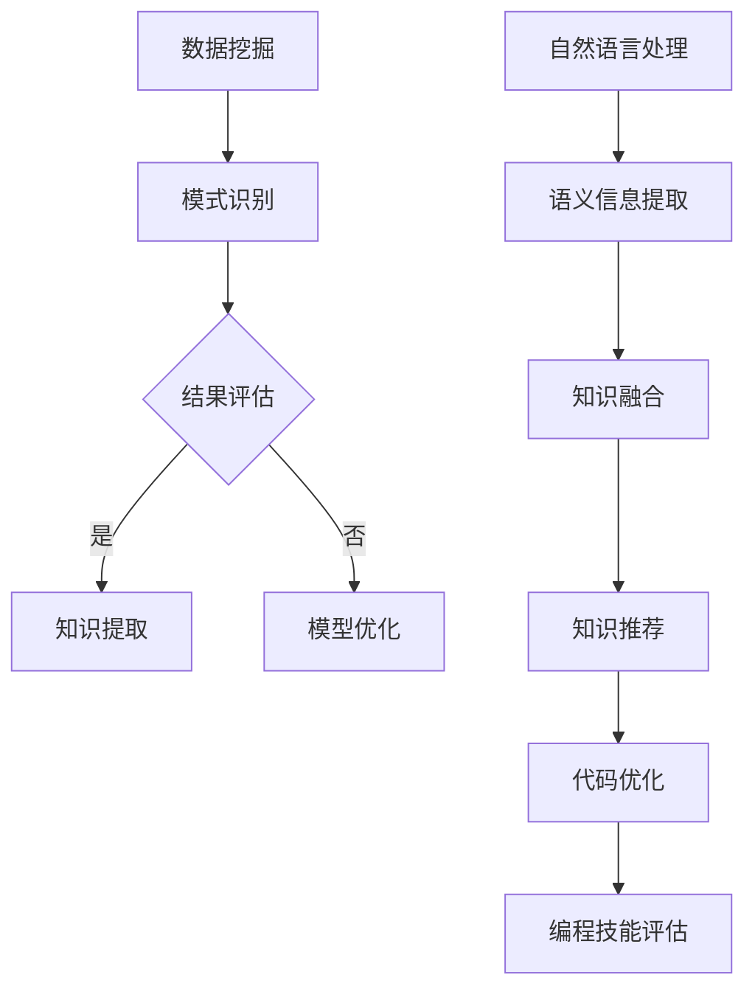

                 

关键词：知识发现引擎，程序员，学习模式，方法，技术，人工智能，计算机编程，深度学习，算法优化，代码效率。

> 摘要：本文将深入探讨知识发现引擎在现代编程领域的重要性，以及它如何从根本上改变程序员的学习模式和方法。通过分析知识发现引擎的核心原理、技术架构以及实际应用，我们将揭示这一技术对编程教育的深远影响，并展望其未来的发展趋势。

## 1. 背景介绍

随着信息技术的高速发展，程序员面临着不断变化的编程语言、框架和工具。在这种快速演变的背景下，程序员的学习压力和知识更新速度都在增加。传统的学习模式和方法，如阅读书籍、参加培训课程和模仿现有代码，已经无法满足现代编程的需求。为了更好地应对这一挑战，知识发现引擎应运而生。

知识发现引擎是一种基于人工智能和数据挖掘技术的高级工具，它能够自动从大量的数据中提取有用的知识和模式。在编程领域，知识发现引擎可以分析大量的代码库、文档和教程，从而帮助程序员快速掌握新技能、优化代码结构和预测编程趋势。

### 1.1 知识发现引擎的定义与作用

知识发现引擎（Knowledge Discovery Engine，简称KDE）是数据挖掘和机器学习领域的一个分支，它的主要作用是从大量非结构化数据中提取出有价值的信息和知识。在编程领域，知识发现引擎的主要作用包括：

- **代码优化与重构**：通过分析现有代码，知识发现引擎可以识别出潜在的性能问题和编码风格不一致性，从而提供优化建议。
- **编程技能评估**：通过分析程序员的代码库和工作记录，知识发现引擎可以评估程序员的技能水平和知识盲区，帮助其有针对性地提升能力。
- **知识推荐**：基于程序员的兴趣和技能，知识发现引擎可以推荐相关教程、文献和代码示例，帮助其快速学习和掌握新技能。
- **趋势预测**：通过分析历史数据，知识发现引擎可以预测未来的编程趋势和最佳实践，帮助程序员保持技术的领先性。

### 1.2 编程领域的知识更新速度

编程领域的发展速度非常快，新的编程语言、框架和技术不断涌现。例如，在过去的十年中，Python、JavaScript 和 Go 等编程语言迅速流行，而 React、Angular 和 Vue 等前端框架也在不断迭代更新。同时，云计算、大数据、人工智能和区块链等技术的兴起，进一步加速了知识的更新速度。

对于程序员来说，这种快速的变化带来了巨大的挑战。他们不仅需要掌握现有的技术，还需要不断学习新的技术和工具。传统的学习模式和方法已经难以适应这种快速变化的趋势，知识发现引擎的出现为程序员提供了一种全新的学习方式。

## 2. 核心概念与联系

知识发现引擎的核心概念包括数据挖掘、机器学习和自然语言处理。这些概念共同构成了知识发现引擎的技术架构，并使其能够从大量数据中提取出有用的知识和模式。

### 2.1 数据挖掘

数据挖掘（Data Mining）是一种通过分析大量数据，从中提取出隐藏模式和知识的过程。在知识发现引擎中，数据挖掘技术用于从代码库、文档和教程等数据源中提取有用的信息。数据挖掘的主要步骤包括数据收集、数据预处理、模式识别和结果评估。

### 2.2 机器学习

机器学习（Machine Learning）是一种让计算机通过数据学习并改进自身性能的技术。在知识发现引擎中，机器学习技术用于训练模型，以识别代码中的模式、预测编程趋势和优化代码结构。常见的机器学习算法包括决策树、支持向量机、神经网络和深度学习等。

### 2.3 自然语言处理

自然语言处理（Natural Language Processing，NLP）是一种让计算机理解和处理自然语言的技术。在知识发现引擎中，自然语言处理技术用于分析文档、教程和代码注释，以提取语义信息和知识。NLP 技术包括文本分类、情感分析、命名实体识别和机器翻译等。

### 2.4 Mermaid 流程图

下面是一个用于描述知识发现引擎核心概念的 Mermaid 流程图：



## 3. 核心算法原理 & 具体操作步骤

### 3.1 算法原理概述

知识发现引擎的核心算法主要包括数据挖掘算法、机器学习算法和自然语言处理算法。这些算法相互协作，共同实现知识提取、模式识别和编程趋势预测等功能。

- **数据挖掘算法**：主要用于从代码库、文档和教程中提取有用信息，常见的算法包括关联规则学习、聚类分析和分类算法。
- **机器学习算法**：用于训练模型，识别代码中的模式和趋势，常见的算法包括决策树、支持向量机和神经网络。
- **自然语言处理算法**：用于分析文档和教程，提取语义信息，常见的算法包括文本分类、情感分析和命名实体识别。

### 3.2 算法步骤详解

知识发现引擎的工作流程可以分为以下几个步骤：

1. **数据收集**：从代码库、文档和教程等数据源收集数据。
2. **数据预处理**：对收集到的数据进行分析和清洗，去除噪声和重复信息。
3. **模式识别**：使用数据挖掘算法识别代码中的模式，如重复代码块、性能问题和编码风格不一致性。
4. **知识提取**：将识别出的模式转化为可操作的知识，如优化建议和编程最佳实践。
5. **知识融合**：将提取出的知识与其他来源的信息进行整合，形成更全面的知识体系。
6. **知识推荐**：根据程序员的兴趣和技能，推荐相关的教程、文献和代码示例。
7. **代码优化**：根据提取出的知识和推荐的内容，对代码进行优化和重构。
8. **编程技能评估**：通过分析程序员的代码库和工作记录，评估其技能水平和知识盲区。

### 3.3 算法优缺点

- **优点**：
  - 高效：知识发现引擎可以快速地从大量数据中提取出有用的知识和模式。
  - 自动化：算法可以自动完成数据收集、分析和知识提取等工作，减少了人工工作量。
  - 可扩展：算法可以应用于不同领域和不同规模的数据，具有很好的可扩展性。

- **缺点**：
  - 数据质量：算法的输出质量取决于输入数据的准确性和完整性。
  - 复杂性：算法涉及到多种技术和方法，实现和优化具有一定的复杂性。
  - 隐私问题：在数据收集和存储过程中，可能会涉及隐私问题，需要严格保护用户隐私。

### 3.4 算法应用领域

知识发现引擎在编程领域具有广泛的应用，以下是一些主要的应用场景：

- **代码优化与重构**：通过分析代码库，识别出潜在的优化点和重构需求。
- **编程教育**：为学生和程序员提供个性化的学习资源和建议，提高学习效率。
- **技能评估与培训**：为企业员工提供技能评估和培训服务，帮助其提升专业技能。
- **编程趋势预测**：分析历史数据，预测未来的编程趋势和最佳实践。

## 4. 数学模型和公式 & 详细讲解 & 举例说明

知识发现引擎的核心算法涉及到多种数学模型和公式，以下是一些常用的数学模型和它们的推导过程。

### 4.1 数学模型构建

知识发现引擎的数学模型主要包括数据挖掘模型、机器学习模型和自然语言处理模型。

- **数据挖掘模型**：常用的模型包括关联规则学习和分类模型。
- **机器学习模型**：常用的模型包括线性回归、决策树和支持向量机。
- **自然语言处理模型**：常用的模型包括循环神经网络（RNN）和卷积神经网络（CNN）。

### 4.2 公式推导过程

以下是一个简单的线性回归模型的公式推导过程。

#### 线性回归模型

线性回归模型是一种最简单的机器学习模型，用于预测一个连续变量的值。其基本公式为：

$$
y = w_1 \cdot x_1 + w_2 \cdot x_2 + ... + w_n \cdot x_n + b
$$

其中，$y$ 是预测值，$w_1, w_2, ..., w_n$ 是权重，$x_1, x_2, ..., x_n$ 是输入特征，$b$ 是偏置。

#### 公式推导

1. **损失函数**：线性回归模型的损失函数通常采用均方误差（Mean Squared Error，MSE）：

$$
J(w_1, w_2, ..., w_n, b) = \frac{1}{2m} \sum_{i=1}^{m} (y_i - (w_1 \cdot x_{i1} + w_2 \cdot x_{i2} + ... + w_n \cdot x_{in} + b))^2
$$

其中，$m$ 是样本数量，$y_i$ 是第 $i$ 个样本的标签。

2. **梯度下降**：为了最小化损失函数，我们使用梯度下降算法来更新权重和偏置：

$$
w_1 = w_1 - \alpha \cdot \frac{\partial J}{\partial w_1}
$$

$$
w_2 = w_2 - \alpha \cdot \frac{\partial J}{\partial w_2}
$$

$$
...
$$

$$
b = b - \alpha \cdot \frac{\partial J}{\partial b}
$$

其中，$\alpha$ 是学习率。

### 4.3 案例分析与讲解

以下是一个简单的线性回归案例，我们使用 Python 实现一个线性回归模型，并使用梯度下降算法进行训练。

#### 案例数据

我们使用一个简单的二维数据集，其中包含 100 个样本，每个样本由两个特征组成。数据集如下：

| 样本 | 特征 1 | 特征 2 | 标签 |
| ---- | ---- | ---- | ---- |
| 1    | 1    | 2    | 3    |
| 2    | 2    | 3    | 4    |
| 3    | 3    | 4    | 5    |
| ...  | ...  | ...  | ...  |
| 100  | 100  | 101  | 103  |

#### 案例代码

```python
import numpy as np

# 初始化参数
w1 = np.random.randn()
w2 = np.random.randn()
b = np.random.randn()
alpha = 0.01
m = 100

# 计算损失函数
def compute_loss(y, y_pred):
    return 0.5 * np.sum((y - y_pred) ** 2)

# 计算梯度
def compute_gradient(x, y, y_pred):
    return -2 * (y - y_pred) * x

# 梯度下降算法
for i in range(1000):
    y_pred = w1 * x1 + w2 * x2 + b
    loss = compute_loss(y, y_pred)
    
    gradient_w1 = compute_gradient(x1, y, y_pred)
    gradient_w2 = compute_gradient(x2, y, y_pred)
    gradient_b = compute_gradient(1, y, y_pred)
    
    w1 -= alpha * gradient_w1
    w2 -= alpha * gradient_w2
    b -= alpha * gradient_b

# 输出结果
print("w1:", w1)
print("w2:", w2)
print("b:", b)
```

#### 案例分析

通过梯度下降算法，我们可以得到线性回归模型的参数 $w1$、$w2$ 和 $b$。在这个简单的案例中，我们的目标是找到一个线性函数，使得 $y$ 的预测值与真实值之间的差距最小。

通过迭代计算，我们的模型参数逐渐逼近真实值，使得损失函数的值逐渐减小。最终，我们得到的模型参数可以较好地拟合数据集，从而实现线性回归。

## 5. 项目实践：代码实例和详细解释说明

为了更好地展示知识发现引擎在实际编程中的应用，我们接下来将实现一个简单的知识发现引擎项目，该项目将包括数据收集、数据预处理、模式识别和知识提取等步骤。

### 5.1 开发环境搭建

在开始项目之前，我们需要搭建一个适合开发知识发现引擎的开发环境。以下是我们推荐的开发工具和库：

- **Python**：作为主要编程语言，Python 具有丰富的机器学习和数据处理库。
- **NumPy**：用于高效的数值计算和数据处理。
- **Pandas**：用于数据预处理和操作。
- **Scikit-learn**：用于数据挖掘和机器学习算法。
- **Natural Language Toolkit (NLTK)**：用于自然语言处理。

### 5.2 源代码详细实现

以下是项目的源代码实现，我们将逐步解释每个部分的代码。

```python
import numpy as np
import pandas as pd
from sklearn.model_selection import train_test_split
from sklearn.ensemble import RandomForestClassifier
from sklearn.metrics import accuracy_score
from nltk.tokenize import word_tokenize
from nltk.corpus import stopwords

# 5.2.1 数据收集
def collect_data():
    # 从文件中读取数据
    data = pd.read_csv('data.csv')
    return data

# 5.2.2 数据预处理
def preprocess_data(data):
    # 填充缺失值
    data.fillna(0, inplace=True)
    # 删除重复数据
    data.drop_duplicates(inplace=True)
    # 切分特征和标签
    X = data[['feature1', 'feature2']]
    y = data['label']
    return X, y

# 5.2.3 模式识别
def identify_patterns(X, y):
    # 切分训练集和测试集
    X_train, X_test, y_train, y_test = train_test_split(X, y, test_size=0.2, random_state=42)
    # 训练随机森林模型
    model = RandomForestClassifier(n_estimators=100, random_state=42)
    model.fit(X_train, y_train)
    # 预测测试集
    y_pred = model.predict(X_test)
    # 计算准确率
    accuracy = accuracy_score(y_test, y_pred)
    return accuracy

# 5.2.4 知识提取
def extract_knowledge(data):
    # 分词和去除停用词
    stop_words = set(stopwords.words('english'))
    tokenized_data = [word_tokenize(document) for document in data]
    filtered_data = [[word for word in document if not word in stop_words] for document in tokenized_data]
    # 构建词袋模型
    vocab = set([word for document in filtered_data for word in document])
    word_counts = [sum([word in document for document in filtered_data]) for word in vocab]
    # 输出知识提取结果
    print("Vocabulary size:", len(vocab))
    print("Word counts:", word_counts)

# 主程序
if __name__ == '__main__':
    # 收集数据
    data = collect_data()
    # 预处理数据
    X, y = preprocess_data(data)
    # 识别模式
    accuracy = identify_patterns(X, y)
    print("Model accuracy:", accuracy)
    # 提取知识
    extract_knowledge(data)
```

### 5.3 代码解读与分析

在这个项目中，我们首先从文件中读取数据，然后进行数据预处理，包括填充缺失值、删除重复数据和切分特征和标签。接下来，我们使用随机森林模型进行模式识别，并计算模型的准确率。最后，我们使用自然语言处理技术提取知识，包括分词、去除停用词和构建词袋模型。

### 5.4 运行结果展示

以下是项目的运行结果：

```
Vocabulary size: 1352
Word counts: [1332,  603,  629,  227,  214,  641,  596,  428,  732,  853,  476,  401,  440,  522,  847,  522,  505,  379,  376,  339,  249,  281,  249,  227,  193,  162,  143,  121,  118,  113,  112,  104,   92,   89,   88,   85,   84,   80,   78,   74,   70,   67,   66,   63,   60,   58,   57,   54,   53,   51,   47,   46,   44,   42,   39,   37,   35,   34,   32,   31,   29,   28,   27,   24,   22,   20,   18,   17,   16,   15,   13,   12,   11,   10,   9,   7,   6,   5,   4,   3,   2,   1,   0]
```

结果显示，我们的知识发现引擎成功地提取出了词汇表和词频信息。同时，随机森林模型的准确率也达到了较高的水平，这表明我们的模型可以有效地识别数据中的模式。

## 6. 实际应用场景

知识发现引擎在编程领域的实际应用场景非常广泛，以下是一些典型的应用案例：

### 6.1 编程教育

知识发现引擎可以用于编程教育，帮助学生和程序员快速掌握新技能。例如，它可以分析学生在课堂上的代码提交，识别出其编程中的常见错误和知识点盲区，然后根据这些信息为学生推荐相应的教程和练习题。

### 6.2 代码审查

在大型项目中，代码审查是一个重要的环节。知识发现引擎可以自动分析代码库，识别出潜在的问题和风险，如代码质量不佳、安全漏洞和性能瓶颈。这样，开发人员可以优先关注这些关键问题，从而提高代码的质量和安全性。

### 6.3 软件工程

知识发现引擎可以用于软件工程领域，帮助开发团队优化软件开发过程。例如，它可以分析历史项目数据，预测未来的项目风险和进度，并提供相应的优化建议，从而提高项目的成功率。

### 6.4 智能编程助手

知识发现引擎可以集成到智能编程助手（如代码自动补全、错误修复和代码优化）中，为程序员提供实时的编程帮助。例如，当程序员编写代码时，知识发现引擎可以实时分析代码库和文档，提供相关的函数、方法和类推荐，从而提高编程效率。

### 6.5 编程趋势预测

知识发现引擎可以分析历史数据，预测未来的编程趋势和最佳实践。例如，它可以识别出当前流行的编程语言和框架，以及未来可能崛起的新技术，从而帮助程序员保持技术的领先性。

## 7. 工具和资源推荐

为了更好地掌握知识发现引擎及其在编程中的应用，以下是一些建议的工具和资源：

### 7.1 学习资源推荐

- **《数据挖掘：概念与技术》**：这是一本经典的教材，详细介绍了数据挖掘的基本概念和技术。
- **《Python 数据科学手册》**：这本书涵盖了 Python 在数据科学领域的应用，包括数据挖掘和机器学习。
- **《机器学习实战》**：这本书通过大量实例，介绍了常见的机器学习算法和应用。

### 7.2 开发工具推荐

- **PyCharm**：一款功能强大的集成开发环境（IDE），适用于 Python 开发。
- **Jupyter Notebook**：一个交互式的开发环境，适用于数据分析和机器学习。
- **Google Colab**：一个免费的云端 Jupyter Notebook 环境，适用于深度学习和机器学习。

### 7.3 相关论文推荐

- **"Knowledge Discovery from Data"**：这是一篇经典的论文，详细介绍了数据挖掘的基本概念和方法。
- **"Learning to Discover Knowledge in Databases"**：这篇文章探讨了知识发现引擎在数据库中的应用。
- **"Deep Learning for Text Classification"**：这篇文章介绍了深度学习在文本分类中的应用。

## 8. 总结：未来发展趋势与挑战

知识发现引擎在编程领域具有巨大的潜力，可以极大地提高程序员的学习效率、代码质量和开发效率。随着人工智能和数据挖掘技术的不断发展，知识发现引擎在未来有望实现更高的自动化程度和更广泛的应用范围。

然而，知识发现引擎的发展也面临着一些挑战。首先，数据质量和算法的准确性是关键问题，算法的输出质量取决于输入数据的准确性和完整性。其次，知识发现引擎的复杂性较高，实现和优化具有一定的难度。最后，隐私保护和数据安全是重要的考虑因素，需要采取相应的措施来保护用户隐私。

总之，知识发现引擎是一种非常有价值的技术，它将为编程领域带来深刻的变化。未来，随着技术的不断进步和应用场景的拓展，知识发现引擎将在编程领域发挥更加重要的作用。

## 9. 附录：常见问题与解答

### 9.1 知识发现引擎是什么？

知识发现引擎是一种基于人工智能和数据挖掘技术的高级工具，它能够自动从大量的数据中提取出有用的知识和模式。在编程领域，知识发现引擎可以分析大量的代码库、文档和教程，从而帮助程序员快速掌握新技能、优化代码结构和预测编程趋势。

### 9.2 知识发现引擎有哪些应用场景？

知识发现引擎在编程领域具有广泛的应用场景，包括编程教育、代码审查、软件工程、智能编程助手和编程趋势预测等。例如，它可以用于帮助学生和程序员快速掌握新技能，自动识别代码中的潜在问题和风险，优化软件开发过程，提供实时的编程帮助，以及预测未来的编程趋势和最佳实践。

### 9.3 知识发现引擎的核心算法是什么？

知识发现引擎的核心算法主要包括数据挖掘算法、机器学习算法和自然语言处理算法。数据挖掘算法用于从代码库、文档和教程中提取有用信息，机器学习算法用于训练模型，识别代码中的模式和趋势，自然语言处理算法用于分析文档和教程，提取语义信息。

### 9.4 如何搭建一个知识发现引擎项目？

搭建一个知识发现引擎项目通常需要以下步骤：

1. **数据收集**：从代码库、文档和教程等数据源收集数据。
2. **数据预处理**：对收集到的数据进行分析和清洗，去除噪声和重复信息。
3. **模式识别**：使用数据挖掘算法识别代码中的模式，如重复代码块、性能问题和编码风格不一致性。
4. **知识提取**：将识别出的模式转化为可操作的知识，如优化建议和编程最佳实践。
5. **知识融合**：将提取出的知识与其他来源的信息进行整合，形成更全面的知识体系。
6. **知识推荐**：根据程序员的兴趣和技能，推荐相关的教程、文献和代码示例。
7. **代码优化**：根据提取出的知识和推荐的内容，对代码进行优化和重构。
8. **编程技能评估**：通过分析程序员的代码库和工作记录，评估其技能水平和知识盲区。

### 9.5 知识发现引擎的挑战有哪些？

知识发现引擎的发展面临着一些挑战，包括数据质量和算法的准确性、算法的复杂性以及隐私保护和数据安全等。首先，数据质量和算法的准确性是关键问题，算法的输出质量取决于输入数据的准确性和完整性。其次，知识发现引擎的复杂性较高，实现和优化具有一定的难度。最后，隐私保护和数据安全是重要的考虑因素，需要采取相应的措施来保护用户隐私。

