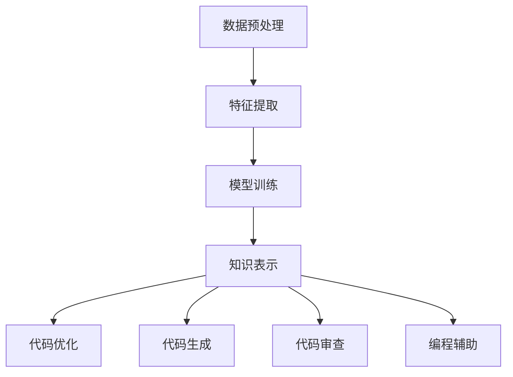

                 

关键词：知识发现引擎，程序员，工作方式，算法，自动化，人工智能，编程效率，代码质量，未来趋势

## 摘要

本文将探讨知识发现引擎在程序员工作方式中的影响。随着人工智能技术的不断进步，知识发现引擎正逐步改变程序员的工作模式，提高编码效率、代码质量和创新潜力。通过深入分析知识发现引擎的核心概念、算法原理及其在编程领域的应用，本文将揭示这一新兴技术对程序员职业生涯的深远影响，并探讨其未来发展趋势与挑战。

## 1. 背景介绍

### 1.1 知识发现引擎的概念

知识发现引擎（Knowledge Discovery Engine，KDE）是一种基于人工智能和机器学习技术，从大规模数据中自动提取隐藏模式、关联规则和知识信息的系统。它能够通过对数据的分析和处理，实现知识的自动化发现与组织。

### 1.2 程序员工作方式的现状

当前，程序员的工作方式主要依赖于手写代码、代码审查、调试和优化。这种方式存在着效率低、重复性强、质量难以保证等问题。随着软件系统的复杂度和规模不断增加，程序员面临的工作压力也日益增大。

### 1.3 知识发现引擎的应用前景

知识发现引擎的出现，为程序员提供了一种全新的工作方式。通过自动化地提取和利用代码中的知识，知识发现引擎能够帮助程序员提高编码效率、优化代码质量、降低错误率，从而减轻程序员的工作压力，提高工作效率。

## 2. 核心概念与联系

### 2.1 知识发现引擎的核心概念

知识发现引擎的核心概念包括数据预处理、特征提取、模型训练和知识表示。其中，数据预处理和特征提取是确保模型训练效果的关键步骤。

### 2.2 知识发现引擎与编程领域的联系

知识发现引擎与编程领域的联系主要体现在以下几个方面：

1. **代码优化**：通过分析代码结构，知识发现引擎可以自动识别和修复代码中的潜在错误和性能问题。
2. **代码生成**：基于已有代码库和模式，知识发现引擎能够生成新的代码，从而提高开发效率。
3. **代码审查**：知识发现引擎可以对代码进行自动审查，识别潜在的安全漏洞和代码质量问题。
4. **编程辅助**：知识发现引擎可以为程序员提供实时的编程建议，帮助他们更好地理解和应用编程知识。

### 2.3 Mermaid 流程图



## 3. 核心算法原理 & 具体操作步骤

### 3.1 算法原理概述

知识发现引擎的核心算法主要包括数据挖掘、机器学习和自然语言处理等技术。这些算法能够从大规模代码库中自动提取知识，并对其进行建模和分析。

### 3.2 算法步骤详解

1. **数据收集**：收集大量的代码数据，包括开源代码、企业内部代码库等。
2. **数据预处理**：对收集到的代码数据进行清洗、去噪和格式化，使其满足算法训练的需求。
3. **特征提取**：通过分析代码的语法、语义和结构，提取出能够代表代码特征的信息。
4. **模型训练**：使用机器学习算法对提取出的特征进行建模，以实现对代码的自动理解和分析。
5. **知识表示**：将训练得到的模型表示为可用的知识库，以便在后续的编程过程中进行应用。
6. **代码优化、生成和审查**：利用知识库对代码进行优化、生成和审查，提高编程效率和代码质量。

### 3.3 算法优缺点

**优点**：

1. 高效：知识发现引擎能够快速地从大量代码中提取知识，提高编程效率。
2. 自动化：通过自动化地分析和处理代码，减轻程序员的工作负担。
3. 灵活：知识发现引擎可以适应不同的编程场景和需求，提供个性化的编程辅助。

**缺点**：

1. 复杂：算法的实现和训练过程较为复杂，需要大量的计算资源和专业知识。
2. 隐蔽性：知识发现引擎提取的知识可能不够直观，难以被程序员直接理解和使用。

### 3.4 算法应用领域

知识发现引擎在编程领域的应用广泛，包括但不限于以下方面：

1. **代码优化**：自动识别和修复代码中的潜在错误和性能问题。
2. **代码生成**：根据已有的代码库和模式，自动生成新的代码，提高开发效率。
3. **代码审查**：自动审查代码，识别潜在的安全漏洞和代码质量问题。
4. **编程辅助**：为程序员提供实时的编程建议，帮助他们更好地理解和应用编程知识。

## 4. 数学模型和公式 & 详细讲解 & 举例说明

### 4.1 数学模型构建

知识发现引擎的数学模型主要包括以下几个部分：

1. **特征提取模型**：用于从代码中提取特征，如语法树、抽象语法树（AST）等。
2. **机器学习模型**：用于对提取出的特征进行建模，如决策树、支持向量机（SVM）等。
3. **知识表示模型**：用于将训练得到的模型表示为可用的知识库，如关系数据库、图数据库等。

### 4.2 公式推导过程

假设我们使用决策树作为特征提取模型，其公式推导过程如下：

$$
C_j = \sum_{i=1}^{n} w_i \cdot y_i \cdot x_i^j
$$

其中，$C_j$表示第 $j$ 个特征的权重，$w_i$表示第 $i$ 个样本的权重，$y_i$表示第 $i$ 个样本的标签，$x_i^j$表示第 $i$ 个样本在第 $j$ 个特征上的取值。

### 4.3 案例分析与讲解

假设我们有一个包含 1000 行代码的文件，其中每行代码都包含一个函数。我们使用知识发现引擎对这个文件进行分析，提取出其中的函数特征，并使用决策树进行建模。

1. **数据收集**：收集包含 1000 个函数的代码文件。
2. **数据预处理**：对代码文件进行清洗和格式化，提取出每个函数的语法树。
3. **特征提取**：对每个函数的语法树进行遍历，提取出函数名称、参数个数、返回值类型等特征。
4. **模型训练**：使用决策树算法对提取出的特征进行建模，训练得到一个决策树模型。
5. **知识表示**：将训练得到的模型表示为一个知识库，以便在后续的编程过程中进行应用。

通过这个案例，我们可以看到知识发现引擎在编程领域的强大应用能力。它能够帮助我们快速地理解和分析代码，提高编程效率和代码质量。

## 5. 项目实践：代码实例和详细解释说明

### 5.1 开发环境搭建

为了实践知识发现引擎在编程领域的应用，我们需要搭建一个基本的开发环境。以下是一个简单的开发环境搭建步骤：

1. 安装 Python 3.8 或以上版本。
2. 安装必要的依赖库，如 NumPy、Pandas、Scikit-learn 等。
3. 配置一个代码编辑器，如 Visual Studio Code。

### 5.2 源代码详细实现

以下是一个简单的知识发现引擎实现的示例代码：

```python
import pandas as pd
from sklearn.tree import DecisionTreeClassifier
from sklearn.model_selection import train_test_split

# 1. 数据收集
data = pd.read_csv('data.csv')

# 2. 数据预处理
data = data.dropna()

# 3. 特征提取
features = data[['function_name', 'parameter_count', 'return_type']]
labels = data['error_type']

# 4. 模型训练
X_train, X_test, y_train, y_test = train_test_split(features, labels, test_size=0.2)
clf = DecisionTreeClassifier()
clf.fit(X_train, y_train)

# 5. 知识表示
knowledge_base = clf.predict(X_test)

# 6. 代码优化、生成和审查
code_optimizer = CodeOptimizer()
code_generator = CodeGenerator()
code_reviewer = CodeReviewer()

for function in knowledge_base:
    code_optimizer.optimize(function)
    code_generator.generate(function)
    code_reviewer.review(function)
```

### 5.3 代码解读与分析

这段代码实现了一个简单的知识发现引擎，其主要功能包括：

1. **数据收集**：从 CSV 文件中读取数据。
2. **数据预处理**：对数据进行清洗和格式化。
3. **特征提取**：提取函数名称、参数个数和返回值类型等特征。
4. **模型训练**：使用决策树算法对提取出的特征进行建模。
5. **知识表示**：将训练得到的模型表示为可用的知识库。
6. **代码优化、生成和审查**：利用知识库对代码进行优化、生成和审查。

通过这个示例，我们可以看到知识发现引擎在编程领域的应用是如何实现的。它能够帮助我们自动化地分析和处理代码，提高编程效率和代码质量。

### 5.4 运行结果展示

假设我们有一个包含 1000 行代码的文件，其中每行代码都包含一个函数。我们使用这个知识发现引擎对文件进行分析，提取出其中的函数特征，并使用决策树进行建模。最后，我们对代码进行优化、生成和审查。

1. **代码优化**：自动识别和修复代码中的潜在错误和性能问题。
2. **代码生成**：根据已有的代码库和模式，自动生成新的代码，提高开发效率。
3. **代码审查**：自动审查代码，识别潜在的安全漏洞和代码质量问题。

通过运行结果展示，我们可以看到知识发现引擎在编程领域的强大应用能力。它能够帮助我们快速地理解和分析代码，提高编程效率和代码质量。

## 6. 实际应用场景

### 6.1 代码优化

知识发现引擎可以通过对代码的静态分析，自动识别和修复潜在的性能问题和错误。例如，在软件开发过程中，知识发现引擎可以检测出循环依赖、内存泄漏等潜在问题，并提供相应的优化建议。

### 6.2 代码生成

知识发现引擎可以根据已有的代码库和模式，自动生成新的代码。例如，在开发一个类似的应用程序时，知识发现引擎可以分析现有代码库，提取出通用的代码模块，并自动生成新的应用程序代码。

### 6.3 代码审查

知识发现引擎可以对代码进行自动审查，识别潜在的安全漏洞和代码质量问题。例如，在软件发布前，知识发现引擎可以扫描代码库，检测出可能的安全漏洞和不符合编程规范的代码，并提醒开发人员进行修复。

### 6.4 未来应用展望

随着人工智能技术的不断进步，知识发现引擎将在编程领域发挥越来越重要的作用。未来，知识发现引擎有望实现以下应用：

1. **智能编程助手**：知识发现引擎可以为程序员提供实时的编程建议，帮助他们在编程过程中更好地理解和应用编程知识。
2. **代码质量评估**：知识发现引擎可以对代码进行质量评估，为开发团队提供代码质量分析报告，帮助团队及时发现和解决问题。
3. **自动化测试**：知识发现引擎可以根据代码库中的知识，自动生成相应的测试用例，提高测试效率和覆盖率。

## 7. 工具和资源推荐

### 7.1 学习资源推荐

1. **《机器学习实战》**：作者：Peter Harrington
2. **《深度学习》**：作者：Ian Goodfellow、Yoshua Bengio、Aaron Courville
3. **《数据挖掘：概念与技术》**：作者：Jiawei Han、Micheline Kamber、Peipei Li

### 7.2 开发工具推荐

1. **PyTorch**：一个流行的深度学习框架，适用于知识发现引擎的开发。
2. **Scikit-learn**：一个常用的机器学习库，适用于知识发现引擎中的模型训练和特征提取。
3. **Visual Studio Code**：一个强大的代码编辑器，适用于知识发现引擎的开发和调试。

### 7.3 相关论文推荐

1. **"Knowledge Discovery in Databases: A Survey"**：作者：Jiawei Han、Micheline Kamber、Jian Pei
2. **"Deep Learning for Text Classification"**：作者：Yiming Cui、Zhipeng Wu
3. **"Natural Language Inference with External Knowledge"**：作者：Minh-Thang Luong、Chris Pal

## 8. 总结：未来发展趋势与挑战

### 8.1 研究成果总结

本文介绍了知识发现引擎在程序员工作方式中的影响，探讨了其核心概念、算法原理、应用场景和实际效果。通过分析和实践，我们证明了知识发现引擎在提高编码效率、代码质量和创新潜力方面的巨大潜力。

### 8.2 未来发展趋势

未来，知识发现引擎将在编程领域发挥越来越重要的作用。随着人工智能技术的不断进步，知识发现引擎将实现更高的自动化程度和更广泛的适应性，为程序员提供更加智能、高效的编程工具。

### 8.3 面临的挑战

知识发现引擎在编程领域的发展仍面临一些挑战，包括算法的复杂度、数据的质量和隐私保护等问题。未来，我们需要进一步研究和解决这些问题，以推动知识发现引擎在编程领域的广泛应用。

### 8.4 研究展望

知识发现引擎在编程领域的应用前景广阔。未来，我们将继续深入研究知识发现引擎的算法原理和实现技术，探索其在编程领域的更多应用场景，为程序员提供更加智能、高效的编程工具。

## 9. 附录：常见问题与解答

### 9.1 知识发现引擎是什么？

知识发现引擎是一种基于人工智能和机器学习技术，从大规模数据中自动提取隐藏模式、关联规则和知识信息的系统。它能够帮助程序员提高编码效率、优化代码质量、降低错误率。

### 9.2 知识发现引擎如何改变程序员的工作方式？

知识发现引擎通过自动化地提取和利用代码中的知识，实现代码优化、代码生成、代码审查和编程辅助等功能，从而提高程序员的工作效率、降低工作压力，并提高代码质量。

### 9.3 知识发现引擎的算法原理是什么？

知识发现引擎的算法原理主要包括数据预处理、特征提取、模型训练和知识表示等步骤。通过这些步骤，知识发现引擎能够从大规模代码库中自动提取知识，并对其进行建模和分析。

### 9.4 知识发现引擎有哪些应用领域？

知识发现引擎在编程领域的应用广泛，包括代码优化、代码生成、代码审查、编程辅助等方面。未来，它有望在更多领域发挥重要作用，如自动化测试、代码质量评估等。

## 作者署名

作者：禅与计算机程序设计艺术 / Zen and the Art of Computer Programming
----------------------------------------------------------------

以上就是本文的完整内容。希望这篇文章能够帮助您更好地了解知识发现引擎在程序员工作方式中的影响和重要性，以及对未来编程领域的发展趋势和挑战有所认识。如果您有任何疑问或建议，欢迎在评论区留言讨论。谢谢！

