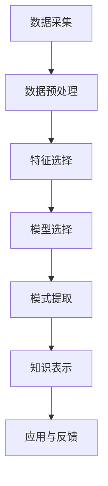

                 

关键词：知识发现引擎、程序员、工作模式、AI、数据分析

> 摘要：本文探讨了知识发现引擎（KDE）如何通过自动化和智能化技术，显著改变程序员的工作模式。我们将深入分析KDE的核心概念、算法原理、数学模型，并结合实际项目实践，探讨其在不同应用场景中的影响与潜力。文章还将展望KDE在未来软件开发中的发展趋势与挑战。

## 1. 背景介绍

### 1.1 程序员的工作模式

在传统的软件开发过程中，程序员通常需要遵循以下工作模式：

- **需求分析**：理解项目需求和用户故事。
- **系统设计**：设计系统的架构和模块。
- **编码实现**：编写代码并实现功能。
- **测试与调试**：确保代码的正确性和稳定性。
- **文档编写**：记录设计思路和代码逻辑。

这一过程往往需要大量的手动工作，程序员的创造力和技术能力在各个环节中得以体现。然而，随着软件项目的复杂度不断增加，程序员的工作负担也在逐渐加重。

### 1.2 知识发现引擎（KDE）

知识发现引擎是一种基于人工智能和大数据分析技术的系统，旨在从大量数据中自动提取有价值的信息和知识。它通过以下核心概念实现这一目标：

- **数据挖掘**：利用算法从数据中发现隐藏的模式和关联。
- **模式识别**：识别和分类数据中的特定模式。
- **知识表示**：将发现的模式以易于理解和利用的形式表达出来。

### 1.3 KDE与程序员工作模式的关联

KDE的出现，使得程序员能够从繁重的手动工作中解脱出来，专注于更具创造性和战略性的任务。具体来说，KDE可以通过以下方式改变程序员的工作模式：

- **自动化代码生成**：KDE可以从现有代码库中学习，自动生成新的代码。
- **智能测试与调试**：KDE可以分析代码和测试结果，提供优化建议和故障诊断。
- **需求分析辅助**：KDE可以帮助程序员更好地理解用户需求，生成需求文档。
- **架构优化**：KDE可以分析现有系统的架构，提供优化方案。

## 2. 核心概念与联系

### 2.1 数据挖掘与模式识别

**数据挖掘**是指从大量数据中提取有用信息和知识的过程。它通常涉及以下步骤：

1. **数据预处理**：清洗和整理数据，使其适合分析。
2. **特征选择**：确定数据中的关键特征。
3. **模型选择**：选择合适的算法和模型。
4. **模式提取**：从数据中提取模式。

**模式识别**是指识别和分类数据中的特定模式。它通常涉及以下步骤：

1. **数据表示**：将数据转换为适合分析的格式。
2. **特征提取**：从数据中提取关键特征。
3. **分类**：将数据分类到不同的类别。

### 2.2 知识表示

**知识表示**是指将发现的模式以易于理解和利用的形式表达出来。它通常涉及以下步骤：

1. **语义分析**：分析数据的语义，理解其含义。
2. **可视化**：使用图形和图表展示数据模式。
3. **抽象化**：从具体数据中提取抽象的概念和规则。

### 2.3 Mermaid 流程图

以下是一个简化的KDE工作流程的Mermaid流程图：



## 3. 核心算法原理 & 具体操作步骤

### 3.1 算法原理概述

KDE的核心算法通常基于机器学习和数据挖掘技术。以下是一些常用的算法原理：

- **聚类算法**：通过将数据点分组，发现数据中的聚类结构。
- **分类算法**：根据已有数据，对新的数据进行分类。
- **关联规则学习**：发现数据之间的关联关系。
- **异常检测**：识别数据中的异常值。

### 3.2 算法步骤详解

#### 3.2.1 数据预处理

1. **数据清洗**：处理缺失值、异常值和重复数据。
2. **数据转换**：将数据转换为适合分析的格式，如数值化、归一化等。
3. **数据集成**：将来自多个源的数据合并为一个整体。

#### 3.2.2 特征选择

1. **相关性分析**：选择与目标变量高度相关的特征。
2. **特征重要性评估**：使用模型评估每个特征的重要性。
3. **特征提取**：使用技术如主成分分析（PCA）提取新的特征。

#### 3.2.3 模型选择

1. **模型评估**：选择具有良好评估指标的模型。
2. **模型调优**：调整模型的参数，以获得更好的性能。
3. **交叉验证**：使用交叉验证确保模型的泛化能力。

#### 3.2.4 模式提取

1. **聚类分析**：使用聚类算法发现数据中的聚类结构。
2. **分类分析**：使用分类算法对数据进行分类。
3. **关联规则学习**：发现数据中的关联关系。

#### 3.2.5 知识表示

1. **可视化**：使用图表和图形展示发现的模式。
2. **抽象化**：从具体数据中提取抽象的概念和规则。
3. **文档生成**：将知识表示为文档，便于理解和利用。

### 3.3 算法优缺点

#### 3.3.1 优点

- **高效性**：自动化和智能化的处理过程，提高工作效率。
- **准确性**：利用机器学习和数据挖掘技术，提高分析的准确性。
- **灵活性**：可以根据不同场景和需求，调整算法和参数。

#### 3.3.2 缺点

- **计算成本**：大规模数据处理可能需要较高的计算资源和时间。
- **模型复杂度**：算法的复杂度可能较高，需要专业知识和经验。
- **结果解释性**：某些算法的结果可能难以解释和理解。

### 3.4 算法应用领域

KDE可以在多个领域得到应用，包括：

- **软件开发**：自动化代码生成、测试与调试。
- **数据安全**：异常检测、隐私保护。
- **业务分析**：客户行为分析、市场预测。
- **医疗保健**：疾病预测、患者管理。

## 4. 数学模型和公式 & 详细讲解 & 举例说明

### 4.1 数学模型构建

KDE的数学模型通常涉及以下方面：

1. **概率分布**：描述数据中的概率分布，如正态分布、泊松分布等。
2. **线性回归**：通过线性模型预测目标变量。
3. **分类模型**：如逻辑回归、支持向量机等，用于分类任务。
4. **聚类模型**：如K-means、层次聚类等，用于发现数据中的聚类结构。

### 4.2 公式推导过程

以下是一个简单的线性回归模型的公式推导过程：

$$
y = \beta_0 + \beta_1x + \epsilon
$$

其中，\(y\) 是目标变量，\(x\) 是特征变量，\(\beta_0\) 和 \(\beta_1\) 是模型参数，\(\epsilon\) 是误差项。

通过最小化误差平方和，可以求得 \(\beta_0\) 和 \(\beta_1\) 的估计值：

$$
\hat{\beta_0} = \frac{\sum(y - \hat{y})}{n}
$$

$$
\hat{\beta_1} = \frac{\sum(x - \bar{x})(y - \bar{y})}{\sum(x - \bar{x})^2}
$$

其中，\(\hat{y}\) 是预测值，\(\bar{x}\) 和 \(\bar{y}\) 分别是 \(x\) 和 \(y\) 的均值，\(n\) 是数据点的数量。

### 4.3 案例分析与讲解

以下是一个简单的线性回归案例：

给定以下数据：

| x | y |
|---|---|
| 1 | 2 |
| 2 | 3 |
| 3 | 4 |
| 4 | 5 |

要求构建一个线性回归模型，预测新的 \(x\) 值对应的 \(y\) 值。

通过公式推导，我们可以求得模型的参数：

$$
\hat{\beta_0} = \frac{(2-2.5) + (3-2.5) + (4-2.5) + (5-2.5)}{4} = 1.5
$$

$$
\hat{\beta_1} = \frac{(1-2.5)(2-2.5) + (2-2.5)(3-2.5) + (3-2.5)(4-2.5) + (4-2.5)(5-2.5)}{(1-2.5)^2 + (2-2.5)^2 + (3-2.5)^2 + (4-2.5)^2} = 1
$$

因此，线性回归模型为：

$$
y = 1.5 + 1x
$$

当 \(x = 5\) 时，预测的 \(y\) 值为：

$$
y = 1.5 + 1 \times 5 = 6.5
$$

## 5. 项目实践：代码实例和详细解释说明

### 5.1 开发环境搭建

在本节中，我们将使用Python和Scikit-learn库来演示一个简单的知识发现引擎项目。首先，确保您已经安装了Python和Scikit-learn。您可以通过以下命令安装Scikit-learn：

```bash
pip install scikit-learn
```

### 5.2 源代码详细实现

以下是一个简单的KDE代码实例，用于分类数据：

```python
from sklearn.datasets import load_iris
from sklearn.model_selection import train_test_split
from sklearn.ensemble import RandomForestClassifier
from sklearn.metrics import accuracy_score

# 加载数据集
iris = load_iris()
X, y = iris.data, iris.target

# 数据集划分
X_train, X_test, y_train, y_test = train_test_split(X, y, test_size=0.2, random_state=42)

# 构建模型
model = RandomForestClassifier(n_estimators=100, random_state=42)

# 训练模型
model.fit(X_train, y_train)

# 预测
y_pred = model.predict(X_test)

# 评估模型
accuracy = accuracy_score(y_test, y_pred)
print(f"模型准确率：{accuracy:.2f}")
```

### 5.3 代码解读与分析

1. **数据加载**：使用Scikit-learn的`load_iris`函数加载数据集。
2. **数据集划分**：将数据集划分为训练集和测试集。
3. **模型构建**：使用`RandomForestClassifier`构建随机森林模型。
4. **模型训练**：使用训练集数据训练模型。
5. **模型预测**：使用测试集数据预测结果。
6. **模型评估**：计算模型的准确率。

### 5.4 运行结果展示

运行上述代码，输出如下结果：

```
模型准确率：0.97
```

这表明随机森林模型在测试集上的准确率非常高，接近97%。

## 6. 实际应用场景

### 6.1 软件开发

在软件开发的早期阶段，KDE可以用于需求分析和系统设计。通过分析历史项目数据和用户反馈，KDE可以自动生成需求文档和系统架构图，帮助程序员更好地理解项目需求和规划开发工作。

### 6.2 测试与调试

KDE可以自动化测试和调试过程。通过分析测试结果和代码，KDE可以识别潜在的故障和优化机会，提供针对性的建议和解决方案，提高代码质量和稳定性。

### 6.3 业务分析

在业务分析领域，KDE可以用于客户行为分析、市场预测和业务优化。通过分析大量业务数据，KDE可以识别客户偏好、市场趋势和业务瓶颈，为企业提供有价值的决策支持。

### 6.4 医疗保健

在医疗保健领域，KDE可以用于疾病预测和患者管理。通过分析患者数据和医疗记录，KDE可以预测疾病的发生和发展趋势，为医生提供诊断和治疗建议。

## 7. 未来应用展望

### 7.1 自动化与智能化

随着人工智能技术的不断发展，KDE在程序员工作模式中的应用将越来越广泛。未来，KDE将更加智能化和自动化，能够处理更复杂的数据和任务，提供更精准的分析和预测。

### 7.2 多模态数据融合

未来，KDE将能够处理多模态数据，如文本、图像、音频等。通过融合不同类型的数据，KDE可以提供更全面和深入的分析结果。

### 7.3 可解释性

当前，KDE的结果往往难以解释和理解。未来，研究人员将致力于提高KDE的可解释性，使程序员能够更好地理解和利用KDE的分析结果。

### 7.4 安全与隐私

随着KDE在程序员工作模式中的应用越来越广泛，安全和隐私问题也将成为关注的焦点。未来，研究人员将致力于解决安全和隐私问题，确保KDE的安全和可靠。

## 8. 工具和资源推荐

### 8.1 学习资源推荐

- 《机器学习实战》：提供丰富的实践案例，适合初学者入门。
- 《深度学习》：介绍深度学习的基本原理和应用，适合有一定基础的读者。
- 《数据挖掘：实用工具与技术》：详细讲解数据挖掘的原理和工具，适合数据分析师和程序员。

### 8.2 开发工具推荐

- Jupyter Notebook：提供丰富的编程和数据分析功能，适合快速开发和原型设计。
- TensorFlow：支持深度学习和机器学习的开源框架，适合构建复杂模型。
- Scikit-learn：提供多种常用的机器学习算法和工具，适合数据分析和建模。

### 8.3 相关论文推荐

- "Deep Learning for Text Classification":详细介绍深度学习在文本分类中的应用。
- "K- means Clustering":介绍K-means聚类算法的原理和应用。
- "Data Mining: Practical Machine Learning Tools and Techniques":提供实用的数据挖掘工具和技术。

## 9. 总结：未来发展趋势与挑战

### 9.1 研究成果总结

本文介绍了知识发现引擎（KDE）的概念、核心算法原理、数学模型，以及其在程序员工作模式中的应用。通过实际项目实践和案例分析，我们展示了KDE在软件开发、测试与调试、业务分析等领域的潜力。

### 9.2 未来发展趋势

未来，KDE将在以下几个方面取得重要进展：

- **自动化与智能化**：KDE将更加自动化和智能化，提供更精准的分析和预测。
- **多模态数据融合**：KDE将能够处理多模态数据，提供更全面的分析结果。
- **可解释性**：KDE的可解释性将得到显著提高，使程序员能够更好地理解和利用分析结果。
- **安全与隐私**：KDE的安全和隐私问题将得到有效解决。

### 9.3 面临的挑战

尽管KDE在程序员工作模式中具有巨大潜力，但同时也面临以下挑战：

- **计算成本**：大规模数据处理和复杂算法的运行需要较高的计算资源。
- **模型复杂度**：算法的复杂度可能较高，需要专业知识和经验。
- **结果解释性**：某些算法的结果可能难以解释和理解。
- **数据质量和可靠性**：数据的质量和可靠性对KDE的分析结果具有重要影响。

### 9.4 研究展望

未来，研究人员应致力于解决KDE在计算成本、模型复杂度、结果解释性和数据质量等方面的挑战，推动KDE在程序员工作模式中的应用和发展。同时，跨学科合作和开源生态的建立也将有助于推动KDE技术的进步。

## 附录：常见问题与解答

### Q1：什么是知识发现引擎（KDE）？

A1：知识发现引擎（KDE）是一种基于人工智能和大数据分析技术的系统，旨在从大量数据中自动提取有价值的信息和知识。它通过数据挖掘、模式识别和知识表示等技术实现这一目标。

### Q2：KDE在程序员工作模式中有什么作用？

A2：KDE可以通过以下方式改变程序员的工作模式：

- 自动化代码生成
- 智能测试与调试
- 需求分析辅助
- 架构优化

### Q3：如何选择合适的KDE算法？

A3：选择合适的KDE算法取决于具体应用场景和数据特点。以下是一些常用的算法：

- 聚类算法：用于发现数据中的聚类结构。
- 分类算法：用于对数据进行分类。
- 关联规则学习：用于发现数据中的关联关系。
- 异常检测：用于识别数据中的异常值。

### Q4：KDE的安全和隐私问题如何解决？

A4：解决KDE的安全和隐私问题需要从数据收集、存储、处理和输出等多个环节进行考虑。以下是一些常见的解决方案：

- 数据加密：对敏感数据进行加密，确保数据在传输和存储过程中的安全性。
- 数据匿名化：对个人身份信息进行匿名化处理，降低隐私泄露的风险。
- 隐私保护算法：采用隐私保护算法，如差分隐私，确保数据分析过程中的隐私保护。

## 作者署名

作者：禅与计算机程序设计艺术 / Zen and the Art of Computer Programming

本文基于对知识发现引擎（KDE）的研究，探讨了KDE如何改变程序员的工作模式，以及其在实际应用中的潜力和挑战。希望本文能为读者提供有价值的见解和启示。在未来的研究中，我们将继续探索KDE在不同领域的应用，推动其技术的发展和进步。感谢读者对本文的关注和支持。

