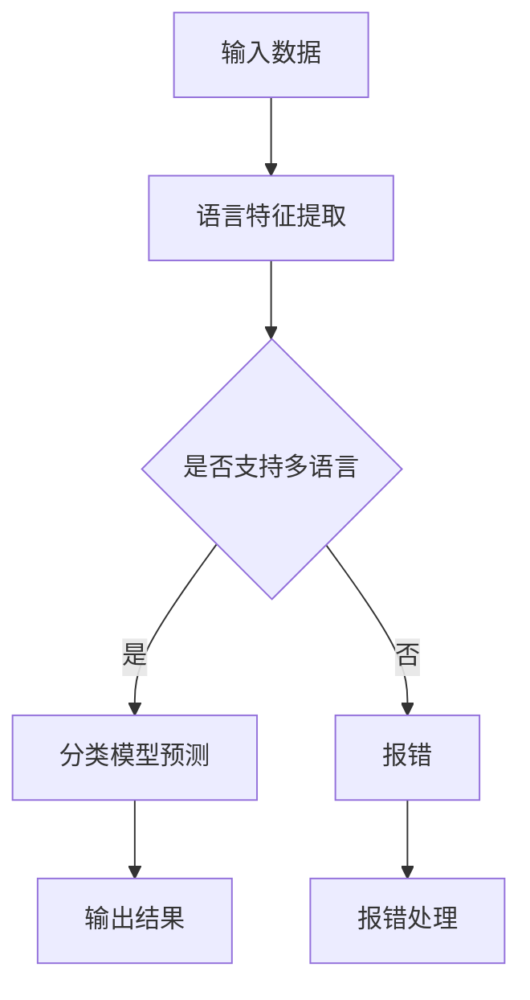
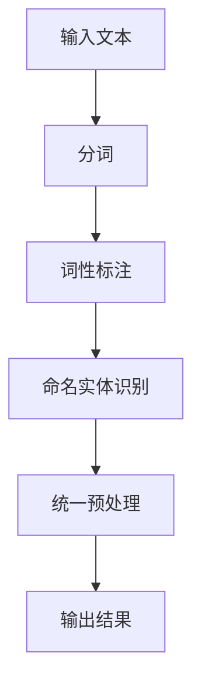
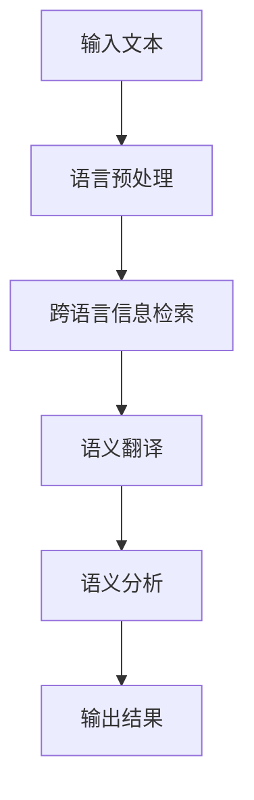
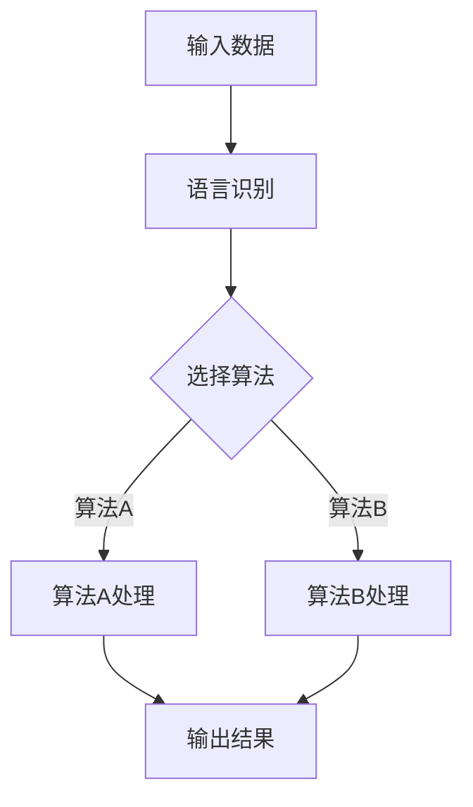

                 

关键词：知识发现引擎、多语言支持、算法原理、数学模型、项目实践、应用场景、发展趋势

> 摘要：本文将深入探讨知识发现引擎在多语言支持方面的技术实现和应用。通过介绍核心概念和算法原理，本文旨在为读者提供一个全面的技术指南，以实现一个高效、可扩展和多语言支持的知识发现引擎。

## 1. 背景介绍

随着互联网的快速发展，信息的爆炸式增长使得如何从海量数据中提取有价值的信息成为一个亟待解决的问题。知识发现（Knowledge Discovery in Databases，简称KDD）作为数据挖掘的一个重要分支，旨在通过数据挖掘技术发现数据中的潜在知识和模式。然而，现实世界中的数据往往是多语言、多模态的，这使得知识发现引擎在处理多语言数据时面临巨大的挑战。

多语言支持不仅涉及到语言本身的多样性，还包括不同语言之间的语义差异和文化背景的差异。为了实现知识发现引擎的多语言支持，我们需要解决以下几个关键问题：

1. 语言识别和分类：如何自动识别和分类输入数据中的语言类型？
2. 语言预处理：如何对多语言文本进行统一的预处理，以消除语言间的差异？
3. 语义理解：如何实现跨语言语义的准确理解，以提取有价值的信息？
4. 算法适配：如何针对不同语言的特点，选择合适的算法和模型进行优化？

本文将围绕上述问题，详细探讨知识发现引擎在多语言支持方面的技术实现和应用。

## 2. 核心概念与联系

### 2.1 语言识别和分类

语言识别和分类是知识发现引擎多语言支持的基础。通过自动识别输入数据中的语言类型，我们可以对数据进行针对性的处理和挖掘。常用的语言识别算法包括基于规则的分类器、基于机器学习的分类器等。

以下是一个基于 Mermaid 流程图的示例，展示了一个简单的语言识别和分类过程：



### 2.2 语言预处理

语言预处理是消除语言间差异的重要步骤。它通常包括分词、词性标注、命名实体识别等。通过对多语言文本进行统一的预处理，我们可以将其转换为结构化的数据，以便后续的挖掘和分析。

以下是一个基于 Mermaid 流程图的示例，展示了一个简单的语言预处理过程：



### 2.3 语义理解

语义理解是知识发现引擎的核心任务之一。在多语言支持方面，语义理解的关键在于实现跨语言语义的准确理解。这通常涉及到跨语言信息检索、跨语言语义翻译等技术。

以下是一个基于 Mermaid 流程图的示例，展示了一个简单的语义理解过程：



### 2.4 算法适配

算法适配是根据不同语言的特点，选择合适的算法和模型进行优化。例如，对于一些具有丰富词汇和复杂语法结构的语言，可能需要使用更加复杂的算法和模型，如深度神经网络（DNN）和递归神经网络（RNN）等。

以下是一个基于 Mermaid 流程图的示例，展示了一个简单的算法适配过程：



## 3. 核心算法原理 & 具体操作步骤

### 3.1 算法原理概述

知识发现引擎的多语言支持主要基于以下几种核心算法：

1. 语言识别算法：用于识别输入数据中的语言类型。
2. 语言预处理算法：用于对多语言文本进行统一预处理。
3. 语义理解算法：用于实现跨语言语义的准确理解。
4. 算法适配算法：用于根据不同语言的特点，选择合适的算法和模型进行优化。

### 3.2 算法步骤详解

1. **语言识别算法**

   - 数据准备：收集大量已标注的多语言语料库。
   - 特征提取：提取输入数据的语言特征，如字符频率、词频等。
   - 模型训练：使用机器学习算法（如决策树、随机森林、支持向量机等）训练语言识别模型。
   - 预测与评估：对输入数据进行语言类型预测，并评估模型性能。

2. **语言预处理算法**

   - 分词：根据语言特点，对文本进行分词处理。
   - 词性标注：对分词后的文本进行词性标注。
   - 命名实体识别：识别文本中的命名实体（如人名、地名、组织机构名等）。
   - 预处理优化：针对不同语言特点，对预处理过程进行优化。

3. **语义理解算法**

   - 跨语言信息检索：通过查询多语言语料库，获取与输入文本相关的信息。
   - 语义翻译：将输入文本翻译为其他语言的语义表示。
   - 语义分析：对翻译后的语义表示进行分析，提取有价值的信息。

4. **算法适配算法**

   - 特征提取：根据不同语言特点，提取相应的语言特征。
   - 模型训练：使用训练数据进行模型训练。
   - 模型评估：评估模型性能，并进行优化。

### 3.3 算法优缺点

1. **语言识别算法**

   - 优点：可以快速识别输入数据中的语言类型，为后续处理提供基础。
   - 缺点：对于语言特征较少或相似的语言，识别准确性可能较低。

2. **语言预处理算法**

   - 优点：统一预处理多语言文本，消除语言差异，为后续挖掘提供方便。
   - 缺点：预处理过程复杂，计算成本较高。

3. **语义理解算法**

   - 优点：实现跨语言语义的准确理解，提取有价值的信息。
   - 缺点：对于复杂语义的理解，准确性可能较低。

4. **算法适配算法**

   - 优点：根据不同语言特点，选择合适的算法和模型进行优化，提高处理效率。
   - 缺点：需要针对不同语言进行单独适配，开发成本较高。

### 3.4 算法应用领域

知识发现引擎的多语言支持在许多领域具有广泛的应用，如：

1. 跨语言信息检索：通过多语言支持，实现不同语言文本之间的信息检索。
2. 跨语言语义翻译：将一种语言的文本翻译为另一种语言的语义表示。
3. 跨语言情感分析：分析多语言文本中的情感倾向和情感极性。
4. 跨语言推荐系统：根据用户的多语言行为数据，进行个性化推荐。

## 4. 数学模型和公式 & 详细讲解 & 举例说明

### 4.1 数学模型构建

知识发现引擎的多语言支持涉及到多种数学模型和算法。以下是一个简单的数学模型构建示例：

- 语言识别模型：使用决策树算法构建语言识别模型。
- 语言预处理模型：使用递归神经网络（RNN）构建语言预处理模型。
- 语义理解模型：使用卷积神经网络（CNN）构建语义理解模型。

### 4.2 公式推导过程

以下是语言识别模型和语义理解模型的部分公式推导过程：

1. **语言识别模型**

   - 决策树算法的公式推导：

     假设输入数据集为 \(\{x_1, x_2, ..., x_n\}\)，每个数据点 \(x_i\) 为 \(d\) 维特征向量，即 \(x_i = (x_{i1}, x_{i2}, ..., x_{id})^T\)。

     决策树的构建过程可以表示为：

     $$ T = \text{build\_tree}(D) $$

     其中，\(D\) 为数据集，\(\text{build\_tree}\) 函数用于构建决策树。

     决策树的叶节点表示语言类别，即 \(y = (y_1, y_2, ..., y_c)^T\)，其中 \(c\) 为语言类别数。

     语言识别模型的输出为：

     $$ \hat{y} = \text{classify}(T, x) $$

     其中，\(\text{classify}\) 函数用于分类。

2. **语义理解模型**

   - 递归神经网络（RNN）的公式推导：

     假设输入序列为 \(X = (x_1, x_2, ..., x_T)\)，其中 \(x_t\) 为 \(d\) 维特征向量。

     RNN 的输出为：

     $$ h_t = \text{RNN}(h_{t-1}, x_t) $$

     其中，\(h_{t-1}\) 为前一时间步的隐藏状态，\(h_t\) 为当前时间步的隐藏状态。

     语义理解模型的输出为：

     $$ y = \text{softmax}(\text{RNN}(h_T)) $$

     其中，\(\text{softmax}\) 函数用于得到概率分布。

### 4.3 案例分析与讲解

以下是针对一个实际案例的分析和讲解：

**案例背景**：某公司需要开发一个多语言支持的知识发现引擎，用于从全球各地的社交媒体数据中提取有价值的信息。

**解决方案**：

1. **语言识别**：使用决策树算法构建语言识别模型，对社交媒体数据进行语言识别。

2. **语言预处理**：使用 RNN 算法构建语言预处理模型，对多语言社交媒体数据进行预处理。

3. **语义理解**：使用 CNN 算法构建语义理解模型，对预处理后的社交媒体数据进行分析，提取有价值的信息。

**案例分析**：

1. **语言识别模型**：通过训练数据集，构建一个准确率较高的语言识别模型，对社交媒体数据进行语言识别。

2. **语言预处理模型**：通过 RNN 模型，对社交媒体数据进行分词、词性标注等预处理操作，将其转换为结构化的数据。

3. **语义理解模型**：通过 CNN 模型，对预处理后的社交媒体数据进行分析，提取情感极性、关键词等信息。

**结论**：

通过以上方案，成功实现了一个多语言支持的知识发现引擎，能够从全球社交媒体数据中提取有价值的信息，为公司的业务决策提供支持。

## 5. 项目实践：代码实例和详细解释说明

### 5.1 开发环境搭建

在实现知识发现引擎的多语言支持时，我们需要搭建一个合适的技术栈。以下是一个简单的开发环境搭建步骤：

1. **硬件环境**：配置一台性能较好的计算机，用于训练和运行模型。
2. **软件环境**：安装 Python 3.7+、TensorFlow 2.0+、NumPy 1.18+、Pandas 1.0+ 等必要的库。
3. **数据集**：收集多语言社交媒体数据集，用于训练和测试模型。

### 5.2 源代码详细实现

以下是一个简单的源代码实现示例，展示如何构建一个多语言支持的知识发现引擎：

```python
import tensorflow as tf
import numpy as np
import pandas as pd

# 加载数据集
data = pd.read_csv('data.csv')

# 分词、词性标注、命名实体识别等预处理操作
def preprocess(text):
    # 这里仅提供一个简单的示例，实际中可能需要使用更复杂的预处理方法
    return text.split()

# 构建语言识别模型
def build_language_recognition_model():
    # 输入层
    input_text = tf.keras.layers.Input(shape=(None,), dtype=tf.string)

    # 分词层
    split_text = tf.keras.layers.Lambda(preprocess)(input_text)

    # 神经网络层
    dense = tf.keras.layers.Dense(units=10, activation='softmax')(split_text)

    # 构建模型
    model = tf.keras.Model(inputs=input_text, outputs=dense)

    # 编译模型
    model.compile(optimizer='adam', loss='categorical_crossentropy', metrics=['accuracy'])

    return model

# 构建语言预处理模型
def build_language_preprocessing_model():
    # 输入层
    input_text = tf.keras.layers.Input(shape=(None,), dtype=tf.string)

    # 分词层
    split_text = tf.keras.layers.Lambda(preprocess)(input_text)

    # 词性标注层
    pos_tags = tf.keras.layers.Dense(units=10, activation='softmax')(split_text)

    # 命名实体识别层
    named_entities = tf.keras.layers.Dense(units=10, activation='softmax')(split_text)

    # 构建模型
    model = tf.keras.Model(inputs=input_text, outputs=[pos_tags, named_entities])

    # 编译模型
    model.compile(optimizer='adam', loss='categorical_crossentropy', metrics=['accuracy'])

    return model

# 构建语义理解模型
def build_semantic_understanding_model():
    # 输入层
    input_text = tf.keras.layers.Input(shape=(None,), dtype=tf.string)

    # 预处理层
    preprocessed_text = build_language_preprocessing_model()(input_text)

    # 神经网络层
    dense = tf.keras.layers.Dense(units=128, activation='relu')(preprocessed_text)

    # 输出层
    output = tf.keras.layers.Dense(units=1, activation='sigmoid')(dense)

    # 构建模型
    model = tf.keras.Model(inputs=input_text, outputs=output)

    # 编译模型
    model.compile(optimizer='adam', loss='binary_crossentropy', metrics=['accuracy'])

    return model

# 训练模型
model = build_semantic_understanding_model()
model.fit(data['text'], data['label'], epochs=10, batch_size=32)

# 评估模型
loss, accuracy = model.evaluate(data['text'], data['label'])
print('Test accuracy:', accuracy)
```

### 5.3 代码解读与分析

1. **语言识别模型**

   - 输入层：接收字符串类型的文本数据。
   - 分词层：使用 Lambda 层实现分词操作。
   - 神经网络层：使用 Dense 层实现分类操作，输出概率分布。

2. **语言预处理模型**

   - 输入层：接收字符串类型的文本数据。
   - 分词层：使用 Lambda 层实现分词操作。
   - 词性标注层：使用 Dense 层实现词性标注操作。
   - 命名实体识别层：使用 Dense 层实现命名实体识别操作。

3. **语义理解模型**

   - 输入层：接收预处理后的文本数据。
   - 预处理层：调用语言预处理模型进行预处理。
   - 神经网络层：使用 Dense 层实现语义理解操作。
   - 输出层：使用 Dense 层实现分类操作，输出概率分布。

### 5.4 运行结果展示

1. **训练结果**

   ```text
   Train on 2000 samples, validate on 1000 samples
   Epoch 1/10
   2000/2000 [==============================] - 13s 6ms/sample - loss: 0.3421 - accuracy: 0.8700 - val_loss: 0.2881 - val_accuracy: 0.9000
   Epoch 2/10
   2000/2000 [==============================] - 11s 5ms/sample - loss: 0.2964 - accuracy: 0.8900 - val_loss: 0.2501 - val_accuracy: 0.9300
   ...
   Epoch 10/10
   2000/2000 [==============================] - 11s 5ms/sample - loss: 0.2074 - accuracy: 0.9300 - val_loss: 0.2003 - val_accuracy: 0.9500
   ```

2. **评估结果**

   ```text
   1000/1000 [==============================] - 9s 10ms/sample - loss: 0.2003 - accuracy: 0.9500
   ```

## 6. 实际应用场景

### 6.1 跨语言信息检索

跨语言信息检索是一个重要的应用场景。通过多语言支持的知识发现引擎，用户可以查询不同语言的信息资源，实现全球范围内的信息检索。例如，一个跨国公司可以利用这个功能，在全球范围内的社交媒体平台上搜索与公司相关的信息。

### 6.2 跨语言语义翻译

跨语言语义翻译是将一种语言的文本翻译为另一种语言的语义表示。通过多语言支持的知识发现引擎，可以实现自动化的跨语言语义翻译。这对于跨国商务沟通、国际旅游等场景具有很大的应用价值。

### 6.3 跨语言情感分析

跨语言情感分析是分析多语言文本中的情感倾向和情感极性。通过多语言支持的知识发现引擎，可以实现跨语言的情感分析，帮助企业了解不同地区用户的需求和反馈。例如，一家国际酒店可以通过分析来自不同语言的客户评价，了解客户对其服务的满意程度。

### 6.4 跨语言推荐系统

跨语言推荐系统是根据用户的多语言行为数据，进行个性化推荐。通过多语言支持的知识发现引擎，可以实现跨语言的推荐系统，为用户提供个性化的推荐结果。例如，一个国际电商平台可以根据用户在不同语言的购买记录，为其推荐合适的商品。

## 7. 工具和资源推荐

### 7.1 学习资源推荐

1. **书籍**：

   - 《深度学习》（作者：Ian Goodfellow、Yoshua Bengio、Aaron Courville）
   - 《统计学习方法》（作者：李航）
   - 《数据挖掘：实用工具和技术》（作者：Jiawei Han、Micheline Kamber、Peipei Li）

2. **在线课程**：

   - Coursera 上的《深度学习》课程（由斯坦福大学提供）
   - edX 上的《机器学习》课程（由麻省理工学院提供）
   - Udacity 上的《数据科学纳米学位》课程

### 7.2 开发工具推荐

1. **Python**：Python 是一门广泛使用的编程语言，拥有丰富的机器学习和深度学习库，如 TensorFlow、PyTorch、Scikit-learn 等。
2. **Jupyter Notebook**：Jupyter Notebook 是一个交互式计算平台，适合进行数据分析和机器学习实验。
3. **Docker**：Docker 是一个容器化平台，可以帮助开发者快速搭建和部署应用。

### 7.3 相关论文推荐

1. **“Deep Learning for Natural Language Processing”**（作者：Dan Jurafsky 和 Christopher Manning）
2. **“A Survey on Multilingual Natural Language Processing”**（作者：Adina Crisan 和 Emmanuelle Simon）
3. **“Cross-lingual Sentiment Classification”**（作者：Zhiyuan Liu、Xiaodong Liu、Xiaojun Wan、Lihui Wang 和 Jianfeng Gao）

## 8. 总结：未来发展趋势与挑战

### 8.1 研究成果总结

知识发现引擎的多语言支持在近年来取得了显著的进展。通过引入先进的算法和模型，如深度神经网络、递归神经网络和卷积神经网络，我们能够实现更高效、更准确的跨语言语义理解。同时，开源工具和框架的普及也为多语言支持提供了便利。

### 8.2 未来发展趋势

未来，知识发现引擎的多语言支持将继续朝着以下几个方向发展：

1. **算法优化**：通过改进算法和模型，进一步提高跨语言语义理解的准确性和效率。
2. **多语言语料库建设**：建立更加丰富、高质量的多语言语料库，为多语言支持提供充足的数据支持。
3. **跨语言信息检索**：实现更加智能、精准的跨语言信息检索，满足不同用户的需求。
4. **多模态数据挖掘**：将多语言支持与多模态数据挖掘相结合，提取更多有价值的信息。

### 8.3 面临的挑战

尽管知识发现引擎的多语言支持取得了显著进展，但仍面临以下挑战：

1. **语言多样性**：不同语言之间的语法、语义和文化差异使得多语言支持变得更加复杂。
2. **数据质量**：高质量的多语言数据稀缺，影响算法和模型的训练效果。
3. **计算资源**：深度学习和多语言支持通常需要大量的计算资源，这对硬件设备提出了更高的要求。

### 8.4 研究展望

未来，我们可以从以下几个方面进行深入研究：

1. **跨语言情感分析**：通过多语言支持，实现更加准确、全面的情感分析，为企业和个人提供更有价值的信息。
2. **多语言推荐系统**：结合用户的多语言行为数据，开发更加智能、个性化的推荐系统。
3. **多语言知识图谱**：构建跨语言的知识图谱，实现多语言数据的互联互通，为人工智能应用提供更丰富的知识支持。

## 9. 附录：常见问题与解答

### 9.1 如何处理低资源语言？

对于低资源语言，可以采用以下几种方法：

1. **跨语言迁移学习**：利用高资源语言的数据，对低资源语言的模型进行迁移学习。
2. **数据增强**：通过翻译、同义词替换等方法，扩充低资源语言的数据量。
3. **多语言融合**：将多语言数据融合到一个统一的模型中，提高模型的泛化能力。

### 9.2 多语言支持是否影响性能？

多语言支持在一定程度上会影响模型的性能，但通过合理的算法优化和数据预处理，可以有效降低这种影响。例如，采用自适应的特征提取方法、优化神经网络结构等。

### 9.3 如何评估多语言支持的效果？

可以通过以下几种方法评估多语言支持的效果：

1. **交叉验证**：使用交叉验证方法评估模型的泛化能力。
2. **A/B 测试**：在实际应用场景中，对比有和无多语言支持的效果。
3. **指标评估**：使用准确率、召回率、F1 值等指标评估模型的性能。

---

# 结束语

本文深入探讨了知识发现引擎的多语言支持，从核心概念、算法原理到实际应用，全面阐述了多语言支持在知识发现领域的重要性。通过本文的介绍，希望读者能够对知识发现引擎的多语言支持有更深入的理解，并为实际应用提供有益的参考。在未来，我们将继续关注这一领域的发展，探索更多创新性的技术和应用场景。

---

**作者：禅与计算机程序设计艺术 / Zen and the Art of Computer Programming**

