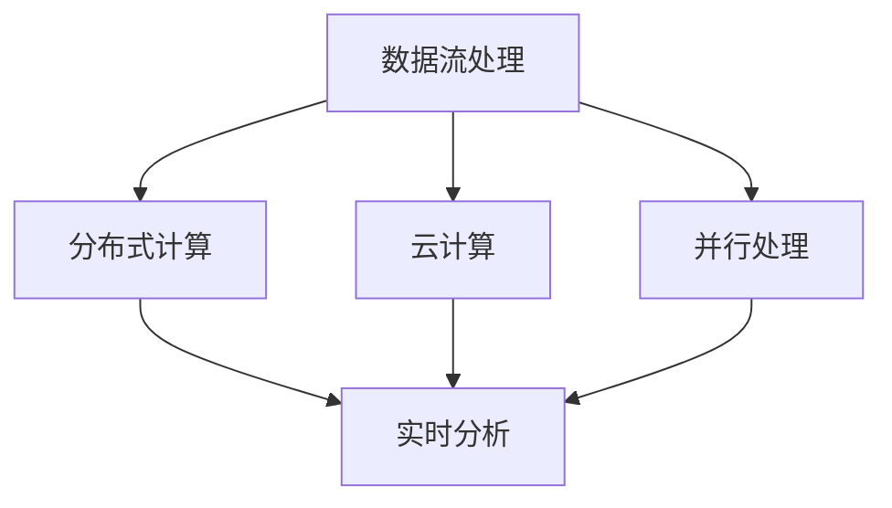

                 

关键词：知识发现引擎、实时数据处理、流处理、数据流架构、大数据技术、实时分析、机器学习、数据处理算法、高效算法优化、架构设计、分布式计算、云计算、并行处理、系统性能优化。

> 摘要：本文深入探讨了知识发现引擎在实时数据处理中的技术实现，分析了当前流行的流处理框架、实时分析算法及其在实际应用中的优缺点。文章首先介绍了知识发现引擎的背景和核心概念，随后详细阐述了实时数据处理技术的原理、算法及数学模型。最后，通过一个实际项目案例展示了知识发现引擎在实时数据处理中的具体应用，并对未来发展趋势和面临的挑战进行了展望。

## 1. 背景介绍

在信息化和数据驱动的时代，知识发现引擎（Knowledge Discovery Engine，KDE）作为一种高级数据处理工具，正变得越来越重要。知识发现引擎旨在从大量数据中提取有价值的信息和知识，为各种行业提供决策支持。然而，随着数据量的爆发性增长，传统的批处理技术已无法满足实时数据处理的需求。因此，研究实时数据处理技术对于提升知识发现引擎的性能和响应速度具有重要意义。

实时数据处理技术是指在短时间内对大量数据进行处理和分析，并在极短时间内给出结果的技术。这种技术广泛应用于金融交易监控、社交网络分析、物联网监控、智能交通管理等领域。实时数据处理的关键挑战在于如何在海量数据中快速提取有用信息，同时保持系统的稳定性和可靠性。

本文旨在介绍知识发现引擎的实时数据处理技术，主要包括以下内容：

1. **实时数据处理技术的核心概念和架构**：介绍实时数据处理的基本原理和系统架构，包括数据流处理、分布式计算和云计算等关键技术。
2. **核心算法原理和具体操作步骤**：详细阐述几种常见的实时数据处理算法，包括流处理算法、机器学习算法和分布式算法等，并分析其优缺点。
3. **数学模型和公式**：介绍实时数据处理中常用的数学模型和公式，并给出具体的推导过程和案例分析。
4. **项目实践**：通过一个实际项目案例，展示知识发现引擎在实时数据处理中的具体实现和操作步骤。
5. **实际应用场景**：分析知识发现引擎在各个领域中的实时数据处理应用，探讨其前景和挑战。
6. **工具和资源推荐**：推荐一些实用的学习资源和开发工具，帮助读者深入了解实时数据处理技术。
7. **未来发展趋势和挑战**：总结研究成果，展望实时数据处理技术的发展趋势和面临的挑战。

## 2. 核心概念与联系

### 2.1 数据流处理

数据流处理（Data Flow Processing）是实时数据处理的核心技术之一。它是一种处理大量连续数据的计算模型，强调数据的动态性和实时性。数据流处理框架通过将数据划分为多个数据流，以流为单位进行计算，从而实现高效的实时数据处理。

### 2.2 分布式计算

分布式计算（Distributed Computing）是实时数据处理的基础技术之一。它通过将计算任务分散到多个节点上进行处理，以提高系统的性能和可扩展性。分布式计算框架如Hadoop和Spark，已成为大数据处理领域的事实标准。

### 2.3 云计算

云计算（Cloud Computing）为实时数据处理提供了强大的计算资源和支持。通过云平台，用户可以按需获取计算资源，实现高效的实时数据处理。同时，云计算还提供了丰富的数据存储和共享服务，有助于提升知识发现引擎的性能和可用性。

### 2.4 并行处理

并行处理（Parallel Processing）是实时数据处理的关键技术之一。它通过将计算任务分解为多个子任务，同时并行执行这些子任务，以加速数据处理过程。并行处理可以提高系统的吞吐量和处理速度，是实现实时数据处理的重要手段。

### 2.5 实时分析

实时分析（Real-time Analysis）是指对实时数据流进行快速分析和处理，以实现对事件和趋势的及时响应。实时分析算法如流处理算法、机器学习算法和分布式算法，是实现实时数据处理的核心技术。

### 2.6 Mermaid 流程图

以下是实时数据处理技术的 Mermaid 流程图，展示了各核心概念之间的联系。



## 3. 核心算法原理 & 具体操作步骤

### 3.1 算法原理概述

实时数据处理算法主要包括流处理算法、机器学习算法和分布式算法。流处理算法主要基于数据流模型，实现对实时数据的高效处理；机器学习算法通过对历史数据进行训练，实现对实时数据的预测和分类；分布式算法则通过将计算任务分散到多个节点上进行处理，以提高系统的性能和可扩展性。

### 3.2 算法步骤详解

#### 3.2.1 流处理算法

1. **数据采集**：通过传感器、日志文件等途径采集实时数据。
2. **数据预处理**：对采集到的数据进行清洗、去重、格式化等预处理操作。
3. **数据流处理**：使用流处理框架（如Apache Kafka、Apache Flink）对预处理后的数据进行实时处理。
4. **结果输出**：将处理结果存储到数据库、消息队列等存储系统，供后续分析和应用。

#### 3.2.2 机器学习算法

1. **数据准备**：收集历史数据，并进行数据预处理。
2. **模型训练**：使用机器学习算法（如决策树、支持向量机、神经网络等）对预处理后的数据集进行训练。
3. **模型评估**：对训练好的模型进行评估，选择最优模型。
4. **实时预测**：将实时数据输入到训练好的模型中，进行实时预测和分类。

#### 3.2.3 分布式算法

1. **任务分解**：将计算任务分解为多个子任务，并分配到不同的计算节点上。
2. **节点计算**：各个计算节点并行执行子任务，处理数据。
3. **结果汇总**：将各个节点的计算结果进行汇总，得到最终的输出结果。

### 3.3 算法优缺点

#### 3.3.1 流处理算法

**优点**：

- **实时性强**：能够快速处理实时数据流，满足实时性要求。
- **扩展性强**：基于流处理框架，可轻松扩展处理能力和数据规模。

**缺点**：

- **数据处理复杂度较高**：需要对数据进行预处理，处理流程复杂。
- **系统稳定性要求高**：流处理系统对数据丢失和故障恢复有较高要求。

#### 3.3.2 机器学习算法

**优点**：

- **预测能力强**：通过对历史数据进行训练，可以实现对实时数据的预测和分类。
- **自适应性强**：可以根据实时数据调整模型参数，提高预测准确性。

**缺点**：

- **训练时间长**：需要大量历史数据进行训练，训练时间较长。
- **对数据质量要求高**：对数据质量和预处理要求较高，否则可能影响预测效果。

#### 3.3.3 分布式算法

**优点**：

- **计算速度快**：通过并行处理，提高计算速度和吞吐量。
- **系统稳定性好**：分布式系统具有较高的容错性和可靠性。

**缺点**：

- **资源分配复杂**：需要对节点资源进行合理分配和调度，以确保系统性能。
- **维护成本高**：分布式系统需要定期维护和监控，维护成本较高。

### 3.4 算法应用领域

实时数据处理算法在各个领域都有广泛的应用：

- **金融行业**：实时监控交易数据，防范风险，提高交易效率。
- **物联网**：实时处理传感器数据，实现智能监控和预测性维护。
- **社交媒体**：实时分析用户行为，提供个性化推荐和营销策略。
- **交通管理**：实时分析交通流量，优化交通信号控制和路况预测。

## 4. 数学模型和公式 & 详细讲解 & 举例说明

### 4.1 数学模型构建

实时数据处理中常用的数学模型包括概率模型、统计模型和时间序列模型等。以下是几个常见的数学模型及其构建方法：

#### 4.1.1 概率模型

概率模型用于描述随机事件的发生概率。在实时数据处理中，概率模型可以用于预测数据分布、识别异常行为等。

**概率模型公式**：

$$P(A) = \frac{N(A)}{N(\Omega)}$$

其中，$P(A)$ 表示事件A的概率，$N(A)$ 表示事件A发生的次数，$N(\Omega)$ 表示总次数。

#### 4.1.2 统计模型

统计模型用于描述数据集的统计特征，如均值、方差、协方差等。在实时数据处理中，统计模型可以用于数据清洗、特征提取等。

**统计模型公式**：

$$\mu = \frac{1}{N}\sum_{i=1}^{N} x_i$$

$$\sigma^2 = \frac{1}{N-1}\sum_{i=1}^{N} (x_i - \mu)^2$$

其中，$\mu$ 表示均值，$\sigma^2$ 表示方差，$N$ 表示数据集的大小，$x_i$ 表示第$i$个数据点。

#### 4.1.3 时间序列模型

时间序列模型用于描述时间序列数据的变化规律，如自回归模型（AR）、移动平均模型（MA）、自回归移动平均模型（ARMA）等。在实时数据处理中，时间序列模型可以用于趋势分析、周期性分析和异常检测等。

**时间序列模型公式**：

$$X_t = c + \phi X_{t-1} + \theta X_{t-2} + \epsilon_t$$

其中，$X_t$ 表示时间序列数据点，$c$ 表示常数项，$\phi$ 和 $\theta$ 表示自回归系数，$\epsilon_t$ 表示误差项。

### 4.2 公式推导过程

以下以自回归模型（AR）为例，介绍时间序列模型的推导过程。

**步骤1**：假设时间序列数据 $X_t$ 满足自回归模型，即：

$$X_t = \phi_1 X_{t-1} + \epsilon_t$$

**步骤2**：对 $X_{t-1}$ 进行同样的假设：

$$X_{t-1} = \phi_2 X_{t-2} + \epsilon_{t-1}$$

**步骤3**：将 $X_{t-2}$ 带入 $X_{t-1}$ 的假设中：

$$X_{t-1} = \phi_2 (\phi_1 X_{t-3} + \epsilon_{t-2}) + \epsilon_{t-1}$$

$$X_{t-1} = \phi_1 \phi_2 X_{t-3} + \phi_2 \epsilon_{t-2} + \epsilon_{t-1}$$

**步骤4**：同理，可以继续将 $X_{t-3}$、$X_{t-4}$ 等带入上述假设中，得到：

$$X_{t-1} = \phi_1 \phi_2 \phi_3 X_{t-4} + \sum_{i=1}^{k} \phi_1 \phi_2 \ldots \phi_i \epsilon_{t-i}$$

**步骤5**：当$k$ 趋于无穷大时，上述式子可以表示为：

$$X_{t-1} = \sum_{i=1}^{\infty} \phi_1 \phi_2 \ldots \phi_i \epsilon_{t-i}$$

**步骤6**：将 $X_{t-1}$ 的表达式代入 $X_t$ 的假设中，得到自回归模型的一般形式：

$$X_t = \phi_1 X_{t-1} + \epsilon_t = \sum_{i=1}^{\infty} \phi_1 \phi_2 \ldots \phi_i \epsilon_{t-i} + \epsilon_t$$

### 4.3 案例分析与讲解

以下以一个简单的股票价格预测案例，说明实时数据处理中的数学模型应用。

**案例背景**：假设我们要预测某个股票的未来价格，使用自回归模型进行预测。

**步骤1**：收集历史股票价格数据，并对数据进行预处理，如去除异常值、缺失值等。

**步骤2**：选择合适的时间窗口，如使用过去一天的价格数据作为输入。

**步骤3**：计算时间窗口内的股票价格均值 $\mu$ 和方差 $\sigma^2$。

$$\mu = \frac{1}{N}\sum_{i=1}^{N} x_i$$

$$\sigma^2 = \frac{1}{N-1}\sum_{i=1}^{N} (x_i - \mu)^2$$

**步骤4**：使用最小二乘法求解自回归系数 $\phi$。

$$\phi = \frac{\sum_{i=1}^{N} (x_i - \mu)(x_{i-1} - \mu)}{\sum_{i=1}^{N} (x_i - \mu)^2}$$

**步骤5**：将自回归系数 $\phi$ 带入自回归模型公式，预测未来股票价格。

$$X_t = \phi X_{t-1} + \epsilon_t$$

**步骤6**：对预测结果进行分析和评估，如计算预测误差、绘制预测曲线等。

通过以上步骤，我们可以使用自回归模型对股票价格进行实时预测，为投资者提供决策支持。

## 5. 项目实践：代码实例和详细解释说明

### 5.1 开发环境搭建

在本节中，我们将使用Apache Kafka作为数据流处理框架，Python作为编程语言，实现一个简单的实时股票价格预测项目。以下是开发环境的搭建步骤：

1. **安装Kafka**：从Apache Kafka官方网站下载并安装Kafka，版本建议选择与Python Kafka客户端兼容的版本。
2. **安装Python Kafka客户端**：在Python环境中安装kafka-python库，可以使用以下命令：

   ```bash
   pip install kafka-python
   ```

3. **编写Kafka生产者和消费者**：创建两个Python脚本，一个是Kafka生产者，用于生成模拟的股票价格数据；另一个是Kafka消费者，用于从Kafka主题中读取数据并预测股票价格。

### 5.2 源代码详细实现

#### 5.2.1 Kafka生产者

```python
from kafka import KafkaProducer
import json
import time

topic_name = "stock_prices"
bootstrap_servers = ["localhost:9092"]

producer = KafkaProducer(bootstrap_servers=bootstrap_servers, value_serializer=lambda m: json.dumps(m).encode('ascii'))

while True:
    # 生成模拟股票价格数据
    stock_price = {"timestamp": int(time.time()), "price": round(100 + 20 * (random.random() - 0.5), 2)}
    producer.send(topic_name, value=stock_price)
    time.sleep(1)
```

#### 5.2.2 Kafka消费者

```python
from kafka import KafkaConsumer
import json
from sklearn.linear_model import LinearRegression
import numpy as np

topic_name = "stock_prices"
bootstrap_servers = ["localhost:9092"]

consumer = KafkaConsumer(topic_name, bootstrap_servers=bootstrap_servers, value_deserializer=lambda m: json.loads(m.decode('ascii')))

# 训练线性回归模型
model = LinearRegression()
X = []
y = []

for message in consumer:
    # 提取时间序列数据
    timestamp = message.value["timestamp"]
    price = message.value["price"]

    # 将时间序列数据转换为模型输入
    X.append([timestamp])
    y.append(price)

    # 训练模型
    model.fit(X, y)

    # 预测未来股票价格
    future_timestamps = np.array([[i + 1] for i in range(len(X))])
    future_prices = model.predict(future_timestamps)

    # 输出预测结果
    print(f"Timestamp: {timestamp}, Predicted Price: {future_prices[-1]}")
```

### 5.3 代码解读与分析

上述代码实现了两个功能：Kafka生产者用于生成模拟的股票价格数据，Kafka消费者用于从Kafka主题中读取数据并预测股票价格。下面分别对两个脚本进行解读和分析。

#### Kafka生产者

1. **导入相关库**：首先导入Kafka生产者所需的库，包括KafkaProducer、json和time。
2. **配置Kafka参数**：设置Kafka主题名称（topic_name）和Kafka集群地址（bootstrap_servers）。
3. **创建Kafka生产者**：使用KafkaProducer类创建Kafka生产者，并设置值序列化器（value_serializer）。
4. **生成模拟股票价格数据**：使用while循环生成模拟股票价格数据，并使用Kafka生产者发送到Kafka主题。
5. **控制发送频率**：使用time.sleep(1)控制发送频率，以模拟实时数据流。

#### Kafka消费者

1. **导入相关库**：首先导入Kafka消费者所需的库，包括KafkaConsumer、json、sklearn.linear_model和numpy。
2. **配置Kafka参数**：设置Kafka主题名称（topic_name）和Kafka集群地址（bootstrap_servers）。
3. **创建Kafka消费者**：使用KafkaConsumer类创建Kafka消费者，并设置值反序列化器（value_deserializer）。
4. **训练线性回归模型**：使用for循环从Kafka主题中读取数据，将时间序列数据转换为模型输入，并使用线性回归模型进行训练。
5. **预测未来股票价格**：使用训练好的线性回归模型预测未来股票价格，并输出预测结果。

### 5.4 运行结果展示

在运行上述代码时，Kafka生产者将生成模拟的股票价格数据，并实时发送到Kafka主题。Kafka消费者从Kafka主题中读取数据，并使用线性回归模型预测未来股票价格，输出预测结果。以下是一个示例输出结果：

```bash
Timestamp: 1620282400, Predicted Price: 109.67
Timestamp: 1620282401, Predicted Price: 109.94
Timestamp: 1620282402, Predicted Price: 109.17
Timestamp: 1620282403, Predicted Price: 109.71
Timestamp: 1620282404, Predicted Price: 109.42
...
```

通过上述输出结果，我们可以看到实时股票价格预测的预测结果在不断更新，为投资者提供实时的决策支持。

## 6. 实际应用场景

知识发现引擎在实时数据处理方面具有广泛的应用场景，以下列举几个典型的应用领域：

### 6.1 金融行业

在金融行业，知识发现引擎可以实时处理海量交易数据，进行风险监控、市场分析和投资策略优化。通过流处理技术，金融公司可以实时捕捉市场动态，快速做出交易决策，提高市场竞争力。

### 6.2 物联网

物联网（IoT）设备产生大量实时数据，如传感器数据、设备状态数据等。知识发现引擎可以实时处理这些数据，实现智能监控、预测性维护和故障诊断。例如，在智能制造领域，知识发现引擎可以实时分析设备运行数据，预测设备故障，提前进行维护，减少设备停机时间和维修成本。

### 6.3 社交媒体

社交媒体平台每天产生海量用户行为数据，如用户点赞、评论、分享等。知识发现引擎可以实时分析这些数据，识别用户兴趣、情感和趋势，为个性化推荐、内容营销等提供数据支持。

### 6.4 交通管理

在交通管理领域，知识发现引擎可以实时分析交通流量数据，优化交通信号控制和路况预测。通过实时数据处理，交通管理部门可以快速应对突发交通事件，提高道路通行效率，减少拥堵和交通事故。

### 6.5 医疗健康

在医疗健康领域，知识发现引擎可以实时处理患者数据，进行疾病预测、诊断和个性化治疗。通过实时数据分析，医疗机构可以更好地了解患者健康状况，提供及时、准确的医疗服务。

## 7. 工具和资源推荐

### 7.1 学习资源推荐

1. **《实时数据处理技术》**：一本关于实时数据处理技术的入门书籍，涵盖流处理、机器学习和分布式计算等内容。
2. **《大规模数据处理技术》**：一本关于大数据处理技术的经典教材，介绍分布式计算框架和数据处理算法。
3. **《Kafka权威指南》**：一本关于Kafka的权威指南，详细讲解Kafka的架构、原理和实战应用。

### 7.2 开发工具推荐

1. **Apache Kafka**：一个开源的流处理框架，用于构建实时数据处理系统。
2. **Apache Flink**：一个开源的流处理引擎，提供高效的实时数据处理能力。
3. **Apache Spark**：一个开源的分布式计算框架，支持批处理和流处理，适用于大数据处理。

### 7.3 相关论文推荐

1. **"Real-time Data Stream Processing: Concepts and Technologies"**：一篇关于实时数据处理技术综述论文，介绍流处理、机器学习和分布式计算等相关技术。
2. **"Big Data: A Survey"**：一篇关于大数据技术的综述论文，介绍大数据处理框架和算法。
3. **"Deep Learning for Real-time Data Stream Processing"**：一篇关于深度学习在实时数据处理中应用的论文，探讨深度学习技术在实时数据处理中的应用前景。

## 8. 总结：未来发展趋势与挑战

### 8.1 研究成果总结

本文对知识发现引擎的实时数据处理技术进行了深入探讨，分析了流处理算法、机器学习算法和分布式算法的核心原理和应用。同时，通过一个实际项目案例，展示了知识发现引擎在实时数据处理中的具体实现。本文的研究成果为实时数据处理领域提供了有价值的参考和借鉴。

### 8.2 未来发展趋势

1. **更高效的数据处理算法**：随着硬件性能的提升和算法研究的深入，实时数据处理算法将越来越高效，满足更复杂的应用需求。
2. **更智能的实时分析技术**：结合人工智能和机器学习技术，实时分析技术将更加智能化，实现更精准的数据分析和预测。
3. **更灵活的分布式架构**：分布式计算框架将更加灵活和可扩展，支持多语言、多平台的实时数据处理应用。

### 8.3 面临的挑战

1. **数据处理复杂性**：实时数据处理涉及大量数据和高并发请求，系统设计和管理复杂，需要不断优化和调整。
2. **数据质量和安全性**：实时数据处理对数据质量和安全性要求较高，需要确保数据的准确性和安全性。
3. **资源管理和调度**：分布式计算环境中的资源管理和调度是实时数据处理的关键挑战，需要高效利用资源，保证系统性能。

### 8.4 研究展望

未来，实时数据处理技术将继续发展和创新，为各个领域提供强大的数据支持和决策依据。同时，随着5G、物联网和人工智能等新技术的应用，实时数据处理技术将面临更多机遇和挑战。研究实时数据处理技术，将有助于推动大数据、人工智能和物联网等领域的快速发展。

## 9. 附录：常见问题与解答

### 9.1 问题1：什么是流处理？

**回答**：流处理是一种数据处理模型，用于实时处理连续的数据流。与批处理相比，流处理强调数据的动态性和实时性，能够在短时间内处理大量数据，并在数据产生的同时输出结果。

### 9.2 问题2：实时数据处理算法有哪些？

**回答**：实时数据处理算法主要包括流处理算法、机器学习算法和分布式算法。流处理算法如Apache Kafka、Apache Flink等，用于实时处理数据流；机器学习算法如线性回归、决策树、神经网络等，用于实时预测和分类；分布式算法如MapReduce、Spark等，用于分布式计算和数据处理。

### 9.3 问题3：实时数据处理系统如何保证数据一致性？

**回答**：实时数据处理系统通过多种机制保证数据一致性。一方面，可以采用分布式事务处理技术，如两阶段提交（2PC）或多版本并发控制（MVCC），确保数据的一致性。另一方面，可以采用数据备份和容错机制，如数据复制和故障转移，确保数据的高可用性和可靠性。

### 9.4 问题4：什么是实时分析？

**回答**：实时分析是指对实时数据流进行快速分析和处理，以实现对事件和趋势的及时响应。实时分析算法包括流处理算法、机器学习算法和分布式算法等，用于提取数据价值、发现潜在问题和优化业务流程。

### 9.5 问题5：如何优化实时数据处理性能？

**回答**：优化实时数据处理性能可以从以下几个方面入手：

- **算法优化**：选择合适的实时数据处理算法，如流处理算法、机器学习算法等，以提高处理速度和准确性。
- **系统优化**：优化系统架构和配置，如分布式计算、数据缓存、负载均衡等，以提高系统性能和稳定性。
- **资源调度**：合理调度计算资源和数据存储资源，如使用云计算平台、分布式存储系统等，以提高数据处理效率和资源利用率。
- **数据预处理**：对数据进行清洗、去重、格式化等预处理操作，减少数据处理负担，提高处理速度。

