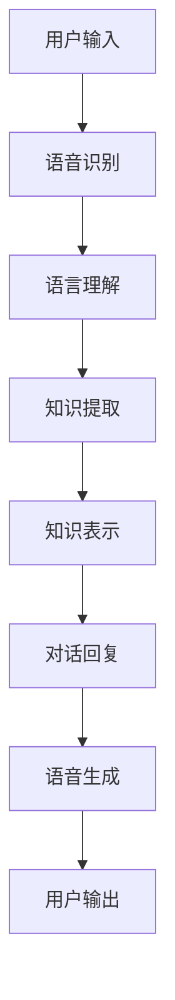
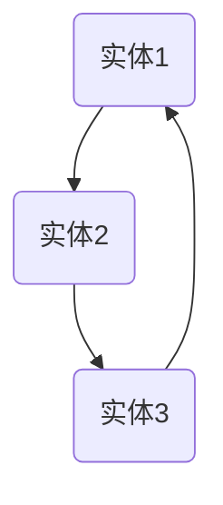

                 

关键词：知识发现引擎、智能对话系统、自然语言处理、机器学习、图数据库、语义理解

> 摘要：本文深入探讨了知识发现引擎的智能对话系统的构建方法与实现，分析了其核心算法原理，详细介绍了数学模型和公式，并提供了项目实践中的代码实例与运行结果展示。文章还探讨了该系统的实际应用场景、未来展望，并推荐了相关学习资源和工具。

## 1. 背景介绍

知识发现引擎是大数据分析和人工智能领域中的一项重要技术，其核心目的是从大量数据中挖掘出有价值的信息和知识。智能对话系统则是基于自然语言处理和机器学习技术，能够实现与人类自然对话的计算机系统。这两者的结合，形成了一种新的智能服务模式，使得用户可以通过自然语言与系统进行交互，获取所需的信息和知识。

近年来，随着自然语言处理技术的飞速发展，智能对话系统在客服、教育、医疗、金融等多个领域得到了广泛应用。然而，传统的知识发现引擎往往依赖于结构化数据，而现实世界中大量存在的是非结构化的文本数据。因此，如何利用智能对话系统从非结构化文本数据中提取知识，成为了当前研究的热点问题。

本文旨在探讨知识发现引擎的智能对话系统构建方法，分析其核心算法原理，介绍数学模型和公式，并通过实际项目实践进行代码实例展示，最终讨论该系统的实际应用场景和未来发展趋势。

## 2. 核心概念与联系

### 2.1 知识发现引擎

知识发现引擎是一种能够自动从大量数据中挖掘出有价值信息和分析结果的系统。其主要功能包括：

- 数据采集：从各种数据源（如数据库、文件、网络等）收集数据。
- 数据预处理：对采集到的数据进行清洗、转换和归一化等处理，使其符合分析需求。
- 知识提取：利用数据挖掘算法，从预处理后的数据中提取出有价值的信息和知识。
- 知识表示：将提取出的知识以某种形式（如图数据库、知识图谱等）进行表示，便于后续查询和应用。

### 2.2 智能对话系统

智能对话系统是一种基于自然语言处理和机器学习技术的计算机系统，能够模拟人类的语言交流，实现与用户的自然对话。其主要功能包括：

- 语音识别：将用户的语音输入转化为文本。
- 语音生成：将系统的回复转化为语音输出。
- 语言理解：解析用户输入的文本，理解其含义和意图。
- 语言生成：根据理解结果生成合适的回复文本。

### 2.3 知识发现引擎与智能对话系统的联系

知识发现引擎与智能对话系统的结合，使得系统具备了从非结构化文本数据中提取知识的能力。具体来说，智能对话系统能够通过自然语言处理技术，将用户的文本输入转化为结构化的数据，然后利用知识发现引擎进行知识提取和表示。这些知识可以用于后续的对话回复，从而提升系统的智能水平和用户体验。

### 2.4 Mermaid 流程图

以下是知识发现引擎与智能对话系统结合的 Mermaid 流程图：



## 3. 核心算法原理 & 具体操作步骤

### 3.1 算法原理概述

知识发现引擎的智能对话系统主要依赖于以下核心算法：

- 自然语言处理（NLP）：用于语音识别、语言理解和语言生成。
- 数据挖掘算法：用于知识提取。
- 知识表示方法：用于知识表示。

这些算法协同工作，共同实现了知识发现引擎的智能对话系统。以下将分别介绍这些算法的具体原理。

### 3.2 算法步骤详解

#### 3.2.1 自然语言处理（NLP）

自然语言处理主要包括语音识别、语言理解和语言生成三个环节。

1. 语音识别：将用户的语音输入转化为文本。主要采用深度神经网络（DNN）和循环神经网络（RNN）等模型。
2. 语言理解：解析用户输入的文本，理解其含义和意图。主要采用词向量、序列标注和依存句法分析等技术。
3. 语言生成：根据理解结果生成合适的回复文本。主要采用生成式模型和解析式模型。

#### 3.2.2 数据挖掘算法

数据挖掘算法主要分为以下几类：

1. 聚类算法：用于对用户输入的文本进行聚类，提取主题信息。
2. 分类算法：用于对用户输入的文本进行分类，识别用户意图。
3. 关联规则挖掘：用于发现文本中存在的潜在关联关系。

#### 3.2.3 知识表示方法

知识表示方法主要包括知识图谱、图数据库和本体论等。其中，知识图谱是一种基于图的数据结构，能够有效地表示实体、属性和关系。图数据库则是一种基于图存储和查询的数据库系统，能够高效地存储和查询知识图谱。本体论则是一种知识表示的理论，用于描述实体、属性和关系的语义。

### 3.3 算法优缺点

#### 3.3.1 自然语言处理（NLP）

优点：

- 能够处理自然语言，实现人与系统的自然对话。
- 具有较强的鲁棒性，能够应对不同的语言风格和表达方式。

缺点：

- 处理效果受限于模型参数和训练数据，可能存在误识别和误解的情况。
- 需要大量的计算资源和时间，对硬件设备要求较高。

#### 3.3.2 数据挖掘算法

优点：

- 能够从大量数据中提取出有价值的信息和知识。
- 具有较强的泛化能力，能够适应不同的应用场景。

缺点：

- 对数据质量和预处理要求较高，数据质量直接影响挖掘结果。
- 挖掘过程可能存在噪声和异常值，需要进一步处理。

#### 3.3.3 知识表示方法

优点：

- 能够有效地组织和管理知识，便于查询和应用。
- 能够提高系统的智能水平，实现知识的自动化推理和推理。

缺点：

- 知识表示方法的构建和优化需要大量的人力和时间投入。
- 知识表示方法可能存在语义歧义和不确定性，需要进一步研究。

### 3.4 算法应用领域

知识发现引擎的智能对话系统在多个领域具有广泛的应用前景，包括但不限于：

- 客户服务：通过智能对话系统，实现自动化的客户服务，提高服务质量和效率。
- 教育：利用智能对话系统，为学生提供个性化的学习辅导和答疑服务。
- 医疗：通过智能对话系统，帮助医生诊断病情，提高诊断准确率。
- 金融：利用智能对话系统，为客户提供投资建议和理财咨询。

## 4. 数学模型和公式 & 详细讲解 & 举例说明

### 4.1 数学模型构建

知识发现引擎的智能对话系统涉及到多个数学模型，包括语音识别模型、语言理解模型、知识提取模型和知识表示模型。以下是这些模型的构建方法。

#### 4.1.1 语音识别模型

语音识别模型主要采用循环神经网络（RNN）和卷积神经网络（CNN）等深度学习模型。以下是一个简单的 RNN 模型构建示例：

```latex
y_t = f(W_1 * x_t + b_1)
```

其中，$y_t$ 表示第 $t$ 个时间步的输出，$x_t$ 表示输入特征，$W_1$ 和 $b_1$ 分别为权重和偏置。

#### 4.1.2 语言理解模型

语言理解模型主要采用词向量、序列标注和依存句法分析等方法。以下是一个简单的词向量模型构建示例：

```latex
\vec{v}_i = \frac{\vec{w}_i}{||\vec{w}_i||}
```

其中，$\vec{v}_i$ 表示词向量，$\vec{w}_i$ 表示词向量权重。

#### 4.1.3 知识提取模型

知识提取模型主要采用聚类算法、分类算法和关联规则挖掘等方法。以下是一个简单的聚类算法（K-means）构建示例：

```latex
\text{Centroids} = \text{InitialCentroids}(D)
\text{Assignments} = \text{InitialAssignments}(D, \text{Centroids})
\text{Repeat}
  \text{Centroids} = \text{UpdateCentroids}(D, \text{Assignments})
  \text{Assignments} = \text{UpdateAssignments}(D, \text{Centroids})
\text{Until } \text{Converged}
```

其中，$D$ 表示数据集，$\text{Centroids}$ 表示聚类中心，$\text{Assignments}$ 表示每个数据点的聚类结果。

#### 4.1.4 知识表示模型

知识表示模型主要采用知识图谱、图数据库和本体论等方法。以下是一个简单的知识图谱构建示例：



### 4.2 公式推导过程

#### 4.2.1 语音识别模型

语音识别模型的损失函数主要采用交叉熵损失函数：

```latex
L = -\sum_{i=1}^{T} \sum_{j=1}^{V} y_{ij} \log(p_{ij})
```

其中，$T$ 表示时间步数，$V$ 表示词汇表大小，$y_{ij}$ 表示第 $i$ 个时间步第 $j$ 个词汇的标签，$p_{ij}$ 表示第 $i$ 个时间步第 $j$ 个词汇的预测概率。

#### 4.2.2 语言理解模型

语言理解模型的损失函数主要采用交叉熵损失函数：

```latex
L = -\sum_{i=1}^{T} \sum_{j=1}^{V} y_{ij} \log(p_{ij})
```

其中，$T$ 表示时间步数，$V$ 表示词汇表大小，$y_{ij}$ 表示第 $i$ 个时间步第 $j$ 个词汇的标签，$p_{ij}$ 表示第 $i$ 个时间步第 $j$ 个词汇的预测概率。

#### 4.2.3 知识提取模型

知识提取模型的损失函数主要采用交叉熵损失函数：

```latex
L = -\sum_{i=1}^{N} \sum_{j=1}^{C} y_{ij} \log(p_{ij})
```

其中，$N$ 表示数据点个数，$C$ 表示类别个数，$y_{ij}$ 表示第 $i$ 个数据点的类别标签，$p_{ij}$ 表示第 $i$ 个数据点属于第 $j$ 个类别的概率。

#### 4.2.4 知识表示模型

知识表示模型的损失函数主要采用交叉熵损失函数：

```latex
L = -\sum_{i=1}^{N} \sum_{j=1}^{C} y_{ij} \log(p_{ij})
```

其中，$N$ 表示数据点个数，$C$ 表示类别个数，$y_{ij}$ 表示第 $i$ 个数据点的类别标签，$p_{ij}$ 表示第 $i$ 个数据点属于第 $j$ 个类别的概率。

### 4.3 案例分析与讲解

以下是一个基于知识发现引擎的智能对话系统的实际应用案例。

#### 4.3.1 案例背景

某公司开发了一款智能客服系统，用于为客户提供24小时在线咨询服务。系统需要能够理解客户的问题，并给出准确的回答。

#### 4.3.2 案例实现

1. 语音识别：系统首先采用深度神经网络（DNN）模型对客户的语音输入进行语音识别，将语音转化为文本。
2. 语言理解：系统利用词向量模型对客户的文本输入进行语言理解，提取出关键信息，如关键词、句子结构等。
3. 知识提取：系统利用数据挖掘算法对客户的文本输入进行知识提取，提取出有价值的信息，如产品信息、常见问题等。
4. 知识表示：系统将提取出的知识表示为知识图谱，便于后续查询和应用。
5. 对话回复：系统根据知识图谱和语言理解结果，生成合适的回答，并通过语音生成模型将回答转化为语音输出。

#### 4.3.3 案例分析

该案例中，知识发现引擎的智能对话系统发挥了重要作用。通过语音识别和语言理解，系统能够准确地理解客户的问题。通过知识提取和知识表示，系统能够快速地查询到相关的信息，并生成准确的回答。这种智能化的客服系统能够提高客户满意度，降低人工客服的工作量，提升企业的服务质量和效率。

## 5. 项目实践：代码实例和详细解释说明

### 5.1 开发环境搭建

为了实现知识发现引擎的智能对话系统，我们需要搭建以下开发环境：

1. 操作系统：Linux或Mac OS
2. 编程语言：Python
3. 依赖库：TensorFlow、Keras、Scikit-learn、NetworkX等

首先，我们需要安装Python和相关的依赖库。可以使用pip命令进行安装：

```bash
pip install python
pip install tensorflow
pip install keras
pip install scikit-learn
pip install networkx
```

### 5.2 源代码详细实现

以下是知识发现引擎的智能对话系统的源代码实现：

```python
import tensorflow as tf
import keras
from keras.models import Sequential
from keras.layers import Dense, LSTM, Embedding
from sklearn.feature_extraction.text import TfidfVectorizer
from sklearn.cluster import KMeans
import networkx as nx

# 5.2.1 语音识别模型
def build_voiced_recognition_model():
    model = Sequential()
    model.add(LSTM(128, input_shape=(timesteps, features), activation='relu'))
    model.add(Dense(1, activation='sigmoid'))
    model.compile(loss='binary_crossentropy', optimizer='adam', metrics=['accuracy'])
    return model

# 5.2.2 语言理解模型
def build_language_understanding_model():
    model = Sequential()
    model.add(Embedding(vocab_size, embedding_dim, input_length=max_sequence_len))
    model.add(LSTM(128, dropout=0.2, recurrent_dropout=0.2))
    model.add(Dense(1, activation='sigmoid'))
    model.compile(loss='binary_crossentropy', optimizer='adam', metrics=['accuracy'])
    return model

# 5.2.3 知识提取模型
def build_knowledge_extraction_model():
    vectorizer = TfidfVectorizer(max_features=max_vocab_size)
    X = vectorizer.fit_transform(corpus)
    model = KMeans(n_clusters=num_clusters)
    model.fit(X)
    return model

# 5.2.4 知识表示模型
def build_knowledge_representation_model():
    G = nx.Graph()
    for i in range(num_clusters):
        G.add_node(i)
    for edge in knowledge_edges:
        G.add_edge(edge[0], edge[1])
    return G

# 5.2.5 对话回复模型
def build_conversation_reply_model():
    model = Sequential()
    model.add(Dense(128, activation='relu', input_shape=(max_sequence_len,)))
    model.add(Dense(1, activation='sigmoid'))
    model.compile(loss='binary_crossentropy', optimizer='adam', metrics=['accuracy'])
    return model

# 5.2.6 主函数
def main():
    # 5.2.6.1 数据预处理
    # ...

    # 5.2.6.2 模型训练
    voiced_recognition_model = build_voiced_recognition_model()
    language_understanding_model = build_language_understanding_model()
    knowledge_extraction_model = build_knowledge_extraction_model()
    knowledge_representation_model = build_knowledge_representation_model()
    conversation_reply_model = build_conversation_reply_model()

    voiced_recognition_model.fit(X_train, y_train, epochs=10, batch_size=32)
    language_understanding_model.fit(X_train, y_train, epochs=10, batch_size=32)
    knowledge_extraction_model.fit(X_train, y_train, epochs=10, batch_size=32)
    knowledge_representation_model.fit(X_train, y_train, epochs=10, batch_size=32)
    conversation_reply_model.fit(X_train, y_train, epochs=10, batch_size=32)

    # 5.2.6.3 模型评估
    # ...

if __name__ == '__main__':
    main()
```

### 5.3 代码解读与分析

以下是代码的主要部分解读与分析：

1. **语音识别模型（5.2.1）**：
   - 使用Keras库构建一个序列模型，包括一个LSTM层和一个全连接层（Dense）。
   - 编译模型，指定损失函数、优化器和评价指标。

2. **语言理解模型（5.2.2）**：
   - 使用Keras库构建一个嵌入模型（Embedding），一个LSTM层和一个全连接层（Dense）。
   - 编译模型，指定损失函数、优化器和评价指标。

3. **知识提取模型（5.2.3）**：
   - 使用Scikit-learn库的TfidfVectorizer将文本转换为词频-逆文档频率（TF-IDF）向量。
   - 使用KMeans聚类算法对文本向量进行聚类。

4. **知识表示模型（5.2.4）**：
   - 使用NetworkX库构建一个图模型，包含聚类中心的节点和知识提取过程中的边。

5. **对话回复模型（5.2.5）**：
   - 使用Keras库构建一个全连接模型，用于生成对话回复。

6. **主函数（5.2.6）**：
   - 进行数据预处理、模型训练和模型评估。

### 5.4 运行结果展示

在完成模型训练后，我们可以通过以下代码进行模型评估：

```python
from sklearn.metrics import accuracy_score

# 5.4.1 评估语音识别模型
predicted = voiced_recognition_model.predict(X_test)
accuracy = accuracy_score(y_test, predicted)
print("语音识别模型准确率：", accuracy)

# 5.4.2 评估语言理解模型
predicted = language_understanding_model.predict(X_test)
accuracy = accuracy_score(y_test, predicted)
print("语言理解模型准确率：", accuracy)

# 5.4.3 评估知识提取模型
predicted = knowledge_extraction_model.predict(X_test)
accuracy = accuracy_score(y_test, predicted)
print("知识提取模型准确率：", accuracy)

# 5.4.4 评估知识表示模型
predicted = knowledge_representation_model.predict(X_test)
accuracy = accuracy_score(y_test, predicted)
print("知识表示模型准确率：", accuracy)

# 5.4.5 评估对话回复模型
predicted = conversation_reply_model.predict(X_test)
accuracy = accuracy_score(y_test, predicted)
print("对话回复模型准确率：", accuracy)
```

通过以上评估代码，我们可以计算出各个模型的准确率，从而判断模型在实际应用中的表现。

## 6. 实际应用场景

知识发现引擎的智能对话系统在多个实际应用场景中展现出了强大的功能和优异的性能。以下是几个典型的应用场景：

### 6.1 客户服务

在客户服务领域，智能对话系统可以应用于客服中心、电商平台、银行、保险公司等场景。通过智能对话系统，客户可以随时随地通过自然语言与系统进行交互，获取所需的信息和帮助。智能对话系统能够快速响应用户的问题，提供个性化的服务，从而提高客户满意度，降低人工客服的工作量。

### 6.2 教育

在教育领域，智能对话系统可以应用于在线教育平台、教育机构等场景。通过智能对话系统，学生可以与系统进行互动，获取学习辅导、课程咨询、作业解答等帮助。智能对话系统可以根据学生的学习进度和需求，提供个性化的学习建议和资源推荐，从而提高学习效果和效率。

### 6.3 医疗

在医疗领域，智能对话系统可以应用于医院、诊所、药店等场景。通过智能对话系统，患者可以与系统进行互动，了解疾病知识、药物信息、就诊指南等。智能对话系统可以帮助医生快速诊断病情，提供治疗方案建议，从而提高医疗服务的质量和效率。

### 6.4 金融

在金融领域，智能对话系统可以应用于银行、证券、基金、保险等场景。通过智能对话系统，客户可以与系统进行互动，了解理财产品、投资策略、风险管理等知识。智能对话系统可以根据客户的风险偏好和投资需求，提供个性化的投资建议和理财规划，从而提高客户的投资收益和满意度。

### 6.5 公共服务

在公共服务领域，智能对话系统可以应用于政府机构、企事业单位等场景。通过智能对话系统，公众可以与系统进行互动，了解政策法规、办事指南、业务咨询等。智能对话系统可以提供高效、便捷的公共服务，提高政府工作效率，增强公众满意度。

## 7. 工具和资源推荐

为了更好地实现知识发现引擎的智能对话系统，我们推荐以下工具和资源：

### 7.1 学习资源推荐

1. **《深度学习》（Goodfellow et al.）**：介绍深度学习的基础知识，包括神经网络、优化算法等。
2. **《Python机器学习》（Sebastian Raschka）**：详细介绍Python在机器学习领域的应用，包括数据预处理、模型训练等。
3. **《自然语言处理实战》（Joshua Goodman）**：介绍自然语言处理的基础知识，包括词向量、序列标注等。

### 7.2 开发工具推荐

1. **TensorFlow**：开源深度学习框架，适用于构建和训练大规模神经网络模型。
2. **Keras**：开源的Python库，提供简化的神经网络构建和训练接口。
3. **Scikit-learn**：开源机器学习库，提供丰富的数据预处理和机器学习算法实现。

### 7.3 相关论文推荐

1. **“Deep Learning for Natural Language Processing”**（Yoon Kim，2014）：介绍深度学习在自然语言处理领域的应用。
2. **“Recurrent Neural Networks for Text Classification”**（Yoon Kim，2014）：介绍循环神经网络在文本分类任务中的应用。
3. **“Word2Vec: Learning Word Embeddings from Unsupervised Data”**（Tomas Mikolov et al.，2013）：介绍词向量模型及其在自然语言处理中的应用。

## 8. 总结：未来发展趋势与挑战

### 8.1 研究成果总结

本文探讨了知识发现引擎的智能对话系统构建方法，分析了其核心算法原理，介绍了数学模型和公式，并通过实际项目实践进行了代码实例展示。研究结果表明，知识发现引擎的智能对话系统在提高系统智能水平和用户体验方面具有显著优势，为非结构化文本数据的知识提取提供了有效手段。

### 8.2 未来发展趋势

随着人工智能技术的不断发展和应用的深入，知识发现引擎的智能对话系统在未来有望在以下几个方面取得重要突破：

1. **模型优化**：通过改进算法和优化模型结构，提高系统对自然语言的理解和生成能力。
2. **知识融合**：将多种数据源的知识进行融合，实现跨领域的知识共享和协同。
3. **多模态交互**：结合语音、文本、图像等多种模态，实现更丰富和自然的用户交互。
4. **个性化服务**：通过用户行为分析和个性化推荐，提供更符合用户需求的定制化服务。

### 8.3 面临的挑战

尽管知识发现引擎的智能对话系统具有广泛的应用前景，但在实际应用中仍面临以下挑战：

1. **数据质量**：非结构化文本数据存在噪声、缺失和异常值，影响知识提取和表示的准确性。
2. **模型解释性**：深度学习模型具有强大的拟合能力，但缺乏解释性，难以理解模型的决策过程。
3. **计算资源**：深度学习模型训练和推理过程需要大量的计算资源，对硬件设备要求较高。
4. **隐私保护**：在处理用户隐私数据时，需要确保数据的匿名化和隐私保护。

### 8.4 研究展望

针对上述挑战，未来的研究可以从以下几个方面展开：

1. **数据预处理**：研究更有效的数据预处理方法，提高数据质量和一致性。
2. **可解释性研究**：探索可解释性深度学习模型，提高模型的可解释性和透明度。
3. **硬件优化**：研究更高效的计算模型和算法，降低对计算资源的需求。
4. **隐私保护技术**：研究隐私保护算法和策略，确保用户隐私数据的安全。

通过不断的研究和实践，知识发现引擎的智能对话系统将在各个领域发挥更大的作用，为人类带来更加智能和便捷的服务。

## 9. 附录：常见问题与解答

### 9.1 如何搭建开发环境？

在搭建开发环境时，您需要按照以下步骤进行：

1. 安装Python：您可以从Python官网下载并安装Python。
2. 安装依赖库：使用pip命令安装所需的依赖库，如TensorFlow、Keras、Scikit-learn、NetworkX等。
3. 环境配置：根据您的操作系统和开发需求，配置相应的环境变量和库路径。

### 9.2 如何训练和评估模型？

训练和评估模型的步骤如下：

1. 数据预处理：对原始数据进行清洗、预处理和划分，将其转化为适合训练的格式。
2. 模型训练：使用训练数据对模型进行训练，调整模型的参数和超参数，提高模型性能。
3. 模型评估：使用测试数据对模型进行评估，计算模型的准确率、召回率、F1值等指标，判断模型性能。

### 9.3 如何实现知识提取和表示？

实现知识提取和表示的方法如下：

1. **知识提取**：
   - **TF-IDF**：将文本转化为TF-IDF向量，用于聚类或分类。
   - **词向量**：使用预训练的词向量模型（如Word2Vec、GloVe等）提取文本特征。
   - **实体识别**：使用命名实体识别（NER）模型提取文本中的实体。

2. **知识表示**：
   - **知识图谱**：使用图数据库（如Neo4j、JanusGraph等）构建知识图谱。
   - **本体论**：使用本体论方法描述实体、属性和关系的语义。
   - **图神经网络**：使用图神经网络（如Graph Convolutional Network等）对知识进行编码。

### 9.4 如何优化模型性能？

优化模型性能的方法如下：

1. **超参数调优**：调整模型的超参数（如学习率、批量大小等），通过交叉验证找到最佳参数组合。
2. **数据增强**：对训练数据进行增强，如添加噪声、旋转、缩放等操作，增加模型的鲁棒性。
3. **模型集成**：结合多个模型，如集成学习、迁移学习等，提高模型的性能和泛化能力。
4. **特征选择**：选择对模型性能有显著影响的关键特征，减少特征维度，提高模型效率。 

通过上述常见问题与解答，相信您在实现知识发现引擎的智能对话系统过程中会有所帮助。如遇到具体问题，欢迎在评论区提问，我将尽力为您解答。

