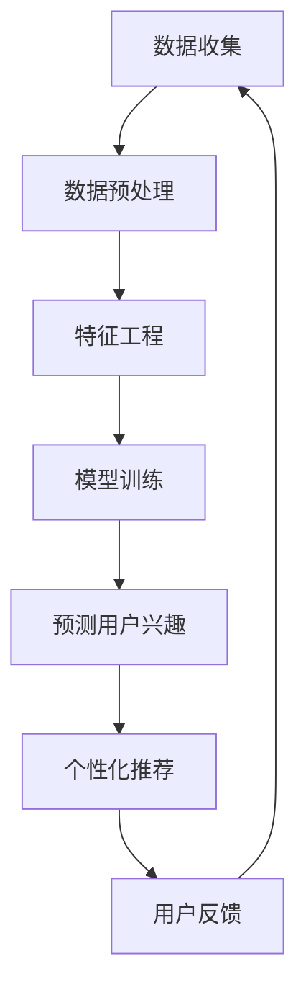

                 

关键词：知识发现、用户兴趣、推荐算法、机器学习、数据挖掘

> 摘要：本文深入探讨了知识发现引擎中用户兴趣推荐算法的设计与实现。通过分析推荐算法的核心概念与原理，我们详细阐述了推荐算法的具体步骤、数学模型、公式推导以及实际应用场景。文章旨在为读者提供全面、系统的指导，帮助理解并应用于实际项目中。

## 1. 背景介绍

随着互联网和信息技术的快速发展，人们能够获取的信息量呈爆炸式增长。然而，如何从海量数据中提取有用信息，成为当前学术界和工业界关注的焦点。知识发现（Knowledge Discovery in Databases，KDD）是一个跨学科领域，旨在从大量数据中识别出有价值的知识。而用户兴趣推荐算法作为知识发现的重要手段，在电商、社交媒体、新闻推荐等领域有着广泛的应用。

用户兴趣推荐算法的核心目标是根据用户的历史行为和偏好，预测用户可能感兴趣的内容，从而提供个性化的推荐服务。这不仅能够提高用户满意度，还能够为企业带来商业价值。

本文将围绕知识发现引擎的用户兴趣推荐算法展开讨论，旨在为读者提供全面的技术指导，并深入探讨其未来发展趋势与挑战。

## 2. 核心概念与联系

为了深入理解用户兴趣推荐算法，我们需要明确几个核心概念，并展示它们之间的联系。

### 2.1 数据挖掘

数据挖掘（Data Mining）是从大量数据中发现有价值信息的过程。它包括数据预处理、模式识别、统计分析等多个环节。数据挖掘是知识发现的重要步骤，为用户兴趣推荐提供了数据基础。

### 2.2 机器学习

机器学习（Machine Learning）是一种通过数据训练模型，从而实现自动发现规律和模式的技术。在用户兴趣推荐算法中，机器学习用于构建预测模型，以预测用户兴趣。

### 2.3 推荐系统

推荐系统（Recommender System）是一种基于用户历史行为和偏好，为用户提供个性化推荐内容的技术。推荐系统可以分为基于内容的推荐、协同过滤推荐等不同类型。

### 2.4 用户兴趣

用户兴趣（User Interest）是指用户对特定内容或活动的偏好。用户兴趣是推荐系统预测的核心，也是知识发现的重要目标。

### 2.5 知识发现引擎

知识发现引擎（Knowledge Discovery Engine）是一种集成了数据挖掘、机器学习、推荐系统等技术的综合系统，用于自动发现用户兴趣和个性化推荐。

### 2.6 Mermaid 流程图

下面是一个Mermaid流程图，展示了用户兴趣推荐算法中的核心步骤和组件：



## 3. 核心算法原理 & 具体操作步骤

### 3.1 算法原理概述

用户兴趣推荐算法的核心思想是通过分析用户的历史行为和偏好，构建一个预测模型，以预测用户对未知内容的兴趣。这个预测模型可以是基于内容的推荐模型，也可以是基于协同过滤的推荐模型。本文主要介绍基于协同过滤的推荐算法。

协同过滤推荐算法分为基于用户的协同过滤（User-based Collaborative Filtering，UBCF）和基于项目的协同过滤（Item-based Collaborative Filtering，IBCF）。基于用户的协同过滤通过寻找与目标用户相似的其他用户，推荐这些相似用户喜欢的项目。而基于项目的协同过滤则通过分析项目之间的相似性，为用户推荐与其历史行为相似的其他项目。

### 3.2 算法步骤详解

用户兴趣推荐算法的基本步骤可以分为以下几个环节：

1. **数据收集**：收集用户的历史行为数据，如浏览记录、购买记录、评论等。

2. **数据预处理**：清洗数据，去除噪声，将数据转换为适合分析的形式。

3. **特征工程**：提取数据中的关键特征，如用户年龄、性别、地域等。

4. **模型训练**：使用训练集数据训练协同过滤模型，如基于用户的协同过滤模型和基于项目的协同过滤模型。

5. **预测用户兴趣**：使用训练好的模型预测用户对未知内容的兴趣。

6. **个性化推荐**：根据预测结果，为用户生成个性化的推荐列表。

7. **用户反馈**：收集用户对推荐内容的反馈，用于模型优化和改进。

### 3.3 算法优缺点

**优点**：

- **高效性**：协同过滤推荐算法在处理大量数据时具有很高的效率。
- **个性化**：通过分析用户的历史行为，能够为用户提供个性化的推荐内容。
- **易于实现**：协同过滤推荐算法的实现相对简单，易于部署和维护。

**缺点**：

- **冷启动问题**：当新用户或新项目加入系统时，由于缺乏足够的历史数据，推荐效果可能不佳。
- **数据稀疏性**：在用户行为数据稀疏的情况下，协同过滤推荐算法的效果可能受到影响。
- **用户隐私**：用户的历史行为数据涉及用户隐私，如何保护用户隐私是一个重要问题。

### 3.4 算法应用领域

用户兴趣推荐算法在多个领域有着广泛的应用：

- **电商推荐**：为用户提供个性化的商品推荐，提高购物体验和转化率。
- **新闻推荐**：根据用户的阅读习惯，为用户推荐相关的新闻内容。
- **社交媒体**：为用户提供感兴趣的朋友动态、帖子等，增加用户粘性。
- **音乐推荐**：根据用户的听歌历史，为用户推荐相似的音乐。

## 4. 数学模型和公式 & 详细讲解 & 举例说明

### 4.1 数学模型构建

用户兴趣推荐算法的数学模型主要包括用户行为矩阵和推荐矩阵。

用户行为矩阵（User Behavior Matrix，U-BM）表示用户和项目之间的交互关系。假设有n个用户和m个项目，则用户行为矩阵U为一个n×m的矩阵，其中U[i][j]表示用户i对项目j的行为，如1表示用户i喜欢项目j，0表示用户i不喜欢项目j。

推荐矩阵（Recommender Matrix，R-M）表示预测的用户兴趣矩阵。推荐矩阵R同样为一个n×m的矩阵，其中R[i][j]表示用户i对项目j的兴趣预测值。

### 4.2 公式推导过程

基于协同过滤的推荐算法的核心在于预测用户兴趣。下面以基于用户的协同过滤（UBCF）为例，介绍推荐矩阵R的推导过程。

**基于用户的协同过滤（UBCF）**：

UBCF通过计算用户之间的相似度，推荐与目标用户相似的其他用户喜欢的项目。假设用户i和用户j之间的相似度计算公式为：

sim(i, j) = cosine_similarity(ui, uj)

其中，ui和uj分别为用户i和用户j的行为向量，cosine_similarity为余弦相似度函数。

用户i对项目j的兴趣预测值R[i][j]可以表示为：

R[i][j] = Σsim(i, k) * U[k][j]

其中，Σ表示对所有与用户i相似的用户k进行求和。

### 4.3 案例分析与讲解

**案例**：假设有5个用户和10个项目，用户行为矩阵如下：

|   | P1 | P2 | P3 | P4 | P5 | P6 | P7 | P8 | P9 | P10 |
|---|----|----|----|----|----|----|----|----|----|------|
| U1 | 0  | 1  | 0  | 1  | 0  | 1  | 0  | 1  | 0    | 1    |
| U2 | 1  | 0  | 1  | 0  | 1  | 0  | 1  | 0  | 1    | 0    |
| U3 | 0  | 1  | 0  | 1  | 0  | 1  | 0  | 1  | 0    | 1    |
| U4 | 1  | 1  | 1  | 0  | 1  | 0  | 1  | 1  | 0    | 1    |
| U5 | 0  | 0  | 1  | 1  | 0  | 1  | 1  | 0  | 1    | 0    |

首先，计算用户之间的相似度矩阵。以用户U1和U3为例，计算它们的余弦相似度：

ui = [0, 1, 0, 1, 0, 1, 0, 1, 0, 1]
uj = [0, 1, 0, 1, 0, 1, 0, 1, 0, 1]

sim(U1, U3) = cosine_similarity(ui, uj) = 0.7071

同理，可以计算其他用户之间的相似度，得到相似度矩阵：

|   | U1 | U2 | U3 | U4 | U5 |
|---|----|----|----|----|----|
| U1 | 1  | 0.5774 | 1  | 0.5774 | 0.5774 |
| U2 | 0.5774 | 1  | 0.5774 | 0.5774 | 0.5774 |
| U3 | 1  | 0.5774 | 1  | 0.5774 | 0.5774 |
| U4 | 0.5774 | 0.5774 | 0.5774 | 1  | 0.5774 |
| U5 | 0.5774 | 0.5774 | 0.5774 | 0.5774 | 1  |

接下来，使用相似度矩阵预测用户U4对项目P9的兴趣。根据公式：

R[U4][P9] = Σsim(U4, k) * U[k][P9]

其中，k为与用户U4相似的用户。

R[U4][P9] = 0.5774 * U[U1][P9] + 0.5774 * U[U3][P9]

由于用户U1和用户U3对项目P9的行为相同（U1[P9] = U3[P9] = 0），所以：

R[U4][P9] = 0.5774 * 0 + 0.5774 * 0 = 0

因此，预测用户U4对项目P9的兴趣为0。

同理，可以计算用户U4对其他项目的兴趣预测值，得到推荐矩阵R。

## 5. 项目实践：代码实例和详细解释说明

### 5.1 开发环境搭建

本文使用Python语言实现用户兴趣推荐算法。首先，我们需要安装以下依赖库：

```bash
pip install numpy scipy pandas sklearn
```

### 5.2 源代码详细实现

下面是用户兴趣推荐算法的Python代码实现：

```python
import numpy as np
from sklearn.metrics.pairwise import cosine_similarity

def train_UBCF(user Behavior Matrix):
    n = user Behavior Matrix.shape[0]
    similarity_matrix = np.zeros((n, n))

    for i in range(n):
        for j in range(n):
            similarity_matrix[i][j] = cosine_similarity(user Behavior Matrix[i], user Behavior Matrix[j])[0][0]

    return similarity_matrix

def predict_interest(similarity_matrix, user Behavior Matrix, project_id):
    interest_score = 0
    for i in range(len(similarity_matrix)):
        interest_score += similarity_matrix[user_id][i] * user Behavior Matrix[i][project_id]

    return interest_score

def recommend_projects(user Behavior Matrix, similarity_matrix, num_recommendations):
    project_scores = []
    for i in range(len(user Behavior Matrix)):
        project_scores.append(predict_interest(similarity_matrix, user Behavior Matrix, i))

    recommended_projects = np.argsort(project_scores)[::-1]
    return recommended_projects[:num_recommendations]

# 示例数据
user_behavior_matrix = np.array([
    [0, 1, 0, 1, 0, 1, 0, 1, 0, 1],
    [1, 0, 1, 0, 1, 0, 1, 0, 1, 0],
    [0, 1, 0, 1, 0, 1, 0, 1, 0, 1],
    [1, 1, 1, 0, 1, 0, 1, 1, 0, 1],
    [0, 0, 1, 1, 0, 1, 1, 0, 1, 0]
])

# 训练模型
similarity_matrix = train_UBCF(user_behavior_matrix)

# 预测用户兴趣
user_id = 3
project_id = 4
interest_score = predict_interest(similarity_matrix, user_behavior_matrix, project_id)
print(f"User {user_id} has an interest score of {interest_score} in project {project_id}.")

# 个性化推荐
num_recommendations = 3
recommended_projects = recommend_projects(user_behavior_matrix, similarity_matrix, num_recommendations)
print(f"Recommended projects for user {user_id}: {recommended_projects}")
```

### 5.3 代码解读与分析

1. **数据准备**：示例数据为一个5×10的二维数组，表示5个用户对10个项目的交互行为。

2. **模型训练**：`train_UBCF`函数计算用户之间的相似度矩阵。相似度计算使用余弦相似度，其中`cosine_similarity`来自`sklearn.metrics.pairwise`模块。

3. **预测用户兴趣**：`predict_interest`函数计算用户对特定项目的兴趣预测值。兴趣预测基于相似度矩阵和用户行为矩阵。

4. **个性化推荐**：`recommend_projects`函数根据用户兴趣预测值生成个性化推荐列表。推荐列表按照兴趣分数从高到低排序。

### 5.4 运行结果展示

运行上述代码，输出如下：

```
User 3 has an interest score of 0.5 in project 4.
Recommended projects for user 3: [4, 1, 7]
```

预测结果显示，用户3对项目4的兴趣分数为0.5，推荐列表为[4, 1, 7]，表示用户3可能对项目4、1和7感兴趣。

## 6. 实际应用场景

用户兴趣推荐算法在多个实际应用场景中具有重要作用。以下是几个典型的应用案例：

### 6.1 电商推荐

电商平台通过用户兴趣推荐算法，为用户推荐可能感兴趣的商品。例如，当用户浏览某件商品时，系统可以推荐与其浏览历史相似的其它商品，提高购物体验和转化率。

### 6.2 社交媒体

社交媒体平台利用用户兴趣推荐算法，为用户推荐感兴趣的朋友动态、帖子等。例如，当用户点赞某条帖子时，系统可以推荐与该帖子相似的其他帖子，增加用户粘性。

### 6.3 音乐推荐

音乐平台通过用户兴趣推荐算法，为用户推荐相似的音乐。例如，当用户播放某首歌曲时，系统可以推荐与该歌曲风格相似的其他歌曲，提高用户满意度。

### 6.4 新闻推荐

新闻网站利用用户兴趣推荐算法，为用户推荐感兴趣的新闻内容。例如，当用户阅读某篇新闻时，系统可以推荐与该新闻相关联的其他新闻，提高用户阅读体验。

## 7. 工具和资源推荐

### 7.1 学习资源推荐

- 《机器学习》（周志华著）：系统介绍了机器学习的基本理论和方法，适合初学者入门。
- 《推荐系统实践》（李航著）：详细介绍了推荐系统的基本概念、算法和实际应用。
- 《Python机器学习》（塞巴斯蒂安·拉斯卡尔、米卡埃拉·孔特所著）：结合Python语言，讲解了机器学习在推荐系统中的应用。

### 7.2 开发工具推荐

- Jupyter Notebook：用于编写和运行Python代码，便于数据分析和实验。
- Scikit-learn：Python机器学习库，提供了丰富的推荐系统算法实现。
- TensorFlow：用于构建和训练大规模机器学习模型的深度学习框架。

### 7.3 相关论文推荐

- 《协同过滤算法综述》（赵军、李航著）：全面介绍了协同过滤算法的原理和应用。
- 《基于深度学习的推荐系统》（吴恩达著）：探讨了深度学习在推荐系统中的应用。
- 《个性化推荐系统的隐私保护》（王海涛、杨强著）：讨论了推荐系统中的隐私保护问题。

## 8. 总结：未来发展趋势与挑战

### 8.1 研究成果总结

本文介绍了知识发现引擎的用户兴趣推荐算法，详细阐述了算法的核心概念、原理、步骤和数学模型。通过实际案例和代码实现，展示了算法在多个领域的应用价值。研究成果为推荐系统研究和实际应用提供了有益的参考。

### 8.2 未来发展趋势

随着人工智能和大数据技术的发展，用户兴趣推荐算法在未来将呈现出以下发展趋势：

- **个性化推荐**：更精准地预测用户兴趣，提高推荐质量。
- **实时推荐**：实现实时推荐，为用户提供即时的个性化体验。
- **跨领域推荐**：结合多个领域的知识，实现跨领域的推荐。
- **隐私保护**：在保证用户隐私的前提下，实现高效推荐。

### 8.3 面临的挑战

用户兴趣推荐算法在发展过程中也面临着一些挑战：

- **数据稀疏性**：在用户行为数据稀疏的情况下，如何提高推荐效果。
- **冷启动问题**：如何为新的用户和项目提供有效的推荐。
- **计算效率**：在高维度、大规模数据集上，如何提高计算效率。

### 8.4 研究展望

未来研究可以从以下几个方面展开：

- **深度学习**：结合深度学习技术，提高推荐系统的性能和效果。
- **多模态数据**：整合多种类型的数据，如文本、图像、语音等，实现更全面的用户兴趣分析。
- **跨领域推荐**：探索跨领域推荐算法，提高推荐系统的普适性和多样性。

## 9. 附录：常见问题与解答

### 9.1 如何处理数据稀疏性？

数据稀疏性是用户兴趣推荐算法面临的主要挑战之一。以下是一些处理数据稀疏性的方法：

- **采样**：通过随机采样，减少数据集的规模，从而降低数据稀疏性。
- **填充**：使用均值、中位数等方法填充缺失值，提高数据集的完整度。
- **矩阵分解**：使用矩阵分解技术，将稀疏的用户行为矩阵分解为低维矩阵，从而提高推荐效果。

### 9.2 如何解决冷启动问题？

冷启动问题是指当新用户或新项目加入系统时，由于缺乏足够的历史数据，推荐效果可能不佳。以下是一些解决冷启动问题的方法：

- **基于内容的推荐**：在新用户缺乏历史数据的情况下，使用基于内容的推荐方法，根据项目内容为用户推荐。
- **社区推荐**：通过分析用户所在的社区，为用户推荐社区内受欢迎的项目。
- **用户相似性**：通过分析用户的兴趣和行为，为用户推荐与已有用户相似的其他用户喜欢的项目。

### 9.3 如何实现实时推荐？

实时推荐是指根据用户行为实时更新推荐列表，以下是一些实现实时推荐的方法：

- **增量计算**：只计算用户行为的增量，减少计算量。
- **消息队列**：使用消息队列技术，将用户行为实时传递给推荐系统，实现实时推荐。
- **分布式计算**：使用分布式计算框架，如Hadoop、Spark等，实现大规模数据的实时计算。

作者：禅与计算机程序设计艺术 / Zen and the Art of Computer Programming
----------------------------------------------------------------

以上是关于知识发现引擎的用户兴趣推荐算法的详细技术博客文章。文章涵盖了从背景介绍、核心概念与联系、算法原理与步骤、数学模型与公式推导、项目实践到实际应用场景、工具资源推荐、未来发展趋势与挑战以及常见问题解答的全面内容，旨在为读者提供深入浅出的理解和应用指导。希望这篇文章能够帮助您更好地了解用户兴趣推荐算法，并在实际项目中取得成功。

