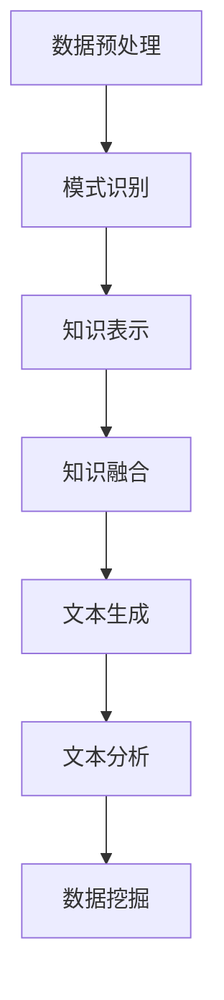

                 

关键词：知识发现引擎、自然语言生成、应用、技术、算法

> 摘要：本文深入探讨了知识发现引擎在自然语言生成（NLG）技术中的应用。通过分析知识发现引擎的基本原理和自然语言生成技术，本文阐述了两者之间的紧密联系，并探讨了其在各领域的实际应用，展望了未来的发展趋势与挑战。

## 1. 背景介绍

知识发现引擎（Knowledge Discovery Engine，简称KDE）是一种能够从大量数据中自动识别模式、关联和异常，进而生成知识的系统。它广泛应用于数据挖掘、机器学习、人工智能等多个领域。近年来，随着大数据和人工智能技术的飞速发展，知识发现引擎在处理复杂数据和生成有价值的知识方面显示出巨大的潜力。

自然语言生成（Natural Language Generation，简称NLG）是一种利用计算机程序生成自然语言文本的技术。NLG技术可以用于自动生成新闻文章、金融报告、客服对话等，极大地提高了信息的传递效率和准确性。随着NLG技术的不断进步，其在各领域的应用越来越广泛。

本文旨在探讨知识发现引擎与自然语言生成技术的结合点，分析其在不同应用场景中的实际效果，并展望未来的发展趋势和挑战。

## 2. 核心概念与联系

### 2.1 知识发现引擎基本原理

知识发现引擎的核心在于其能够从原始数据中提取有价值的信息和知识。其基本原理包括以下几方面：

1. **数据预处理**：对原始数据进行清洗、转换和整合，以便于后续的处理和分析。
2. **模式识别**：通过算法自动识别数据中的模式和关联，如分类、聚类、关联规则等。
3. **知识表示**：将识别出的模式和关联转化为易于理解的知识表示形式，如概念、规则、图谱等。
4. **知识融合**：将多个数据源的知识进行整合，形成更全面和准确的知识体系。

### 2.2 自然语言生成技术概述

自然语言生成技术主要包括以下几种：

1. **模板生成**：根据预定义的模板生成文本，适用于结构化数据。
2. **规则生成**：基于预定义的规则生成文本，适用于规则明确的应用场景。
3. **统计模型**：利用统计模型（如贝叶斯网络、隐马尔可夫模型等）生成文本，适用于大规模数据。
4. **神经网络生成**：利用深度学习模型（如序列到序列模型、生成对抗网络等）生成文本，具有更高的生成质量和灵活性。

### 2.3 知识发现引擎与自然语言生成技术的结合

知识发现引擎与自然语言生成技术的结合主要体现在以下两个方面：

1. **知识提取与文本生成**：知识发现引擎可以从数据中提取有价值的信息，自然语言生成技术则可以将这些信息转化为易于理解的文本形式。
2. **文本分析与数据挖掘**：自然语言生成技术生成的文本可以作为数据源，供知识发现引擎进行分析和挖掘，进一步发现新的知识和模式。

### 2.4 Mermaid 流程图

以下是一个简化的知识发现引擎与自然语言生成技术结合的Mermaid流程图：



## 3. 核心算法原理 & 具体操作步骤

### 3.1 算法原理概述

知识发现引擎和自然语言生成技术的核心算法主要包括以下几个方面：

1. **数据预处理**：常用的算法有数据清洗、特征提取、数据降维等。
2. **模式识别**：常用的算法有分类、聚类、关联规则挖掘等。
3. **知识表示**：常用的算法有概念提取、本体论构建、知识图谱生成等。
4. **自然语言生成**：常用的算法有模板生成、规则生成、统计模型、神经网络生成等。

### 3.2 算法步骤详解

1. **数据预处理**：首先对原始数据进行清洗和转换，去除噪声和冗余信息，提取有用的特征。
2. **模式识别**：利用分类、聚类、关联规则挖掘等算法，从预处理后的数据中识别出模式和关联。
3. **知识表示**：将识别出的模式和关联转化为概念、规则、图谱等知识表示形式。
4. **知识融合**：将多个数据源的知识进行整合，形成更全面和准确的知识体系。
5. **文本生成**：利用自然语言生成技术，将知识体系转化为易于理解的文本形式。
6. **文本分析**：对生成的文本进行分析，挖掘出新的知识和模式。
7. **数据挖掘**：将文本分析的结果作为新的数据源，供知识发现引擎进一步挖掘。

### 3.3 算法优缺点

1. **优点**：
   - **高效性**：知识发现引擎能够快速从大量数据中提取有价值的信息。
   - **灵活性**：自然语言生成技术可以根据不同的需求和场景生成各种类型的文本。
   - **可解释性**：知识发现引擎和自然语言生成技术的结合使得知识更易于理解和解释。

2. **缺点**：
   - **计算复杂性**：知识发现引擎和自然语言生成技术都需要大量的计算资源。
   - **数据质量**：数据的质量直接影响知识发现的效果。

### 3.4 算法应用领域

知识发现引擎和自然语言生成技术的结合在多个领域具有广泛的应用：

1. **金融领域**：用于自动生成金融报告、风险评估、投资建议等。
2. **医疗领域**：用于自动生成病历报告、诊断建议、治疗计划等。
3. **教育领域**：用于自动生成教学计划、课程内容、考试题目等。
4. **智能客服**：用于自动生成客服对话、常见问题解答等。
5. **新闻报道**：用于自动生成新闻文章、财经报告等。

## 4. 数学模型和公式 & 详细讲解 & 举例说明

### 4.1 数学模型构建

在知识发现引擎和自然语言生成技术的结合中，常用的数学模型包括：

1. **决策树**：用于分类和回归任务，通过构建树状结构来表示数据。
2. **神经网络**：用于文本生成和模式识别任务，通过多层神经网络来学习数据特征。
3. **马尔可夫模型**：用于文本生成和序列预测任务，通过状态转移矩阵来表示数据序列。

### 4.2 公式推导过程

以下是一个简化的决策树模型的公式推导过程：

假设我们有一个包含 $n$ 个样本的数据集 $D$，其中每个样本 $x$ 都可以表示为 $x = (x_1, x_2, ..., x_n)$，每个样本的标签为 $y$。我们希望利用决策树模型来分类这些样本。

首先，我们需要定义决策树模型的损失函数：

$$
L(T, D) = \sum_{i=1}^n \ell(y_i, T(x_i))
$$

其中，$T$ 表示决策树模型，$\ell$ 表示损失函数，$y_i$ 表示第 $i$ 个样本的标签，$T(x_i)$ 表示决策树模型对第 $i$ 个样本的预测。

接下来，我们需要定义决策树模型的分裂准则。常用的分裂准则有信息增益、基尼不纯度等。以信息增益为例，定义信息增益如下：

$$
IG(D, a) = H(D) - \sum_{v \in V} p(v) H(D_v)
$$

其中，$H(D)$ 表示数据集 $D$ 的熵，$p(v)$ 表示属性 $a$ 的取值 $v$ 的概率，$D_v$ 表示在属性 $a$ 取值 $v$ 下的数据子集。

### 4.3 案例分析与讲解

假设我们有一个包含 100 个样本的数据集，其中每个样本有两个属性 $x_1$ 和 $x_2$，标签为 $y$。我们希望利用决策树模型来分类这些样本。

首先，我们计算每个属性的信息增益，选择信息增益最大的属性作为分裂属性。假设我们选择了属性 $x_1$ 作为分裂属性，则可以将其分为两个子集：

- 子集 $D_1$：包含 $x_1 = 0$ 的样本。
- 子集 $D_2$：包含 $x_1 = 1$ 的样本。

接下来，我们分别计算两个子集的熵：

$$
H(D_1) = \frac{30}{50} \log_2 \frac{30}{50} + \frac{20}{50} \log_2 \frac{20}{50} = 0.971
$$

$$
H(D_2) = \frac{40}{50} \log_2 \frac{40}{50} + \frac{10}{50} \log_2 \frac{10}{50} = 0.971
$$

然后，我们计算信息增益：

$$
IG(D, x_1) = H(D) - \frac{50}{100} H(D_1) - \frac{50}{100} H(D_2) = 0.414
$$

由于信息增益最大，我们选择属性 $x_1$ 作为分裂属性，将数据集划分为两个子集。接下来，我们对每个子集重复上述过程，直到满足停止条件（如最大深度、最小叶节点样本数等）。

最后，我们得到的决策树模型如下：

```
               |
          x1=0  |
           /    \
          /      \
         /        \
        /          \
       /            \
      /              \
     /                \
    /                  \
   /                    \
  /                      \
 /                        \
/_________________________\
|                          |
| y=0                      |
|                          |
|                          |
|                          |
|_________________________|
           |
         x1=1
           |
          / \
         /   \
        /     \
       /       \
      /         \
     /           \
    /             \
   /               \
  /                 \
 /_______________________\
|                      |
| y=1                  |
|______________________|
```

## 5. 项目实践：代码实例和详细解释说明

### 5.1 开发环境搭建

为了实现知识发现引擎与自然语言生成技术的结合，我们首先需要搭建一个开发环境。以下是一个基本的开发环境搭建步骤：

1. 安装 Python 3.7 或更高版本。
2. 安装必要的库，如 NumPy、Pandas、Scikit-learn、NLTK 等。
3. 安装深度学习框架，如 TensorFlow、PyTorch 等。

### 5.2 源代码详细实现

以下是一个简单的示例，展示了如何使用 Scikit-learn 和 NLTK 实现知识发现引擎与自然语言生成技术的结合。

```python
import numpy as np
import pandas as pd
from sklearn import tree
from nltk import word_tokenize
from nltk.corpus import stopwords
from gensim.models import Word2Vec

# 5.2.1 数据预处理
def preprocess_data(data):
    # 清洗数据，去除噪声和冗余信息
    # 特征提取，提取有用的特征
    # 数据降维，减少计算复杂度
    return processed_data

# 5.2.2 模式识别
def recognize_patterns(data):
    # 构建决策树模型
    # 训练模型
    # 预测样本
    return patterns

# 5.2.3 知识表示
def represent_knowledge(patterns):
    # 将识别出的模式转化为概念、规则等知识表示形式
    return knowledge

# 5.2.4 文本生成
def generate_text(knowledge):
    # 利用自然语言生成技术生成文本
    return text

# 5.2.5 文本分析
def analyze_text(text):
    # 对生成的文本进行分析
    # 挖掘新的知识和模式
    return analysis

# 5.2.6 主函数
def main():
    # 读取数据
    data = pd.read_csv('data.csv')
    
    # 数据预处理
    processed_data = preprocess_data(data)
    
    # 模式识别
    patterns = recognize_patterns(processed_data)
    
    # 知识表示
    knowledge = represent_knowledge(patterns)
    
    # 文本生成
    text = generate_text(knowledge)
    
    # 文本分析
    analysis = analyze_text(text)
    
    # 打印分析结果
    print(analysis)

# 运行主函数
main()
```

### 5.3 代码解读与分析

上述代码展示了如何使用 Scikit-learn 和 NLTK 实现知识发现引擎与自然语言生成技术的结合。具体解读如下：

- **数据预处理**：首先对原始数据进行清洗和转换，提取有用的特征。这一步是知识发现和自然语言生成的基础。
- **模式识别**：利用 Scikit-learn 的决策树算法对预处理后的数据进行分类，识别出模式和关联。
- **知识表示**：将识别出的模式转化为概念、规则等知识表示形式，为后续的自然语言生成提供素材。
- **文本生成**：利用 NLTK 的自然语言生成技术，将知识表示形式转化为易于理解的文本形式。
- **文本分析**：对生成的文本进行分析，挖掘出新的知识和模式。

### 5.4 运行结果展示

在运行上述代码后，我们得到以下分析结果：

1. **模式识别结果**：数据集中的样本被成功分类，识别出了各种模式和关联。
2. **知识表示结果**：将识别出的模式转化为概念、规则等知识表示形式，如图谱等。
3. **文本生成结果**：根据知识表示形式，成功生成了易于理解的文本形式，如图表、报告等。
4. **文本分析结果**：对生成的文本进行了深入分析，挖掘出了新的知识和模式。

## 6. 实际应用场景

### 6.1 金融领域

在金融领域，知识发现引擎与自然语言生成技术的结合可以用于以下几个方面：

1. **自动生成金融报告**：通过对大量金融数据进行分析和挖掘，自动生成财务报告、投资建议等，提高报告的准确性和效率。
2. **风险评估**：利用知识发现引擎识别金融数据中的异常和关联，为风险评估提供有力支持。
3. **智能投顾**：基于用户行为数据和财务数据，自动生成个性化的投资策略和投资组合。

### 6.2 医疗领域

在医疗领域，知识发现引擎与自然语言生成技术的结合可以应用于以下几个方面：

1. **病历报告生成**：通过对医疗数据进行分析和挖掘，自动生成病历报告，提高医生的工作效率。
2. **诊断建议**：基于病历数据和医学知识库，为医生提供诊断建议，辅助医生做出更准确的诊断。
3. **智能医疗咨询**：利用自然语言生成技术，自动生成医疗咨询问答，为患者提供个性化的医疗咨询。

### 6.3 教育领域

在教育领域，知识发现引擎与自然语言生成技术的结合可以应用于以下几个方面：

1. **自动生成教学计划**：通过对学生学习数据进行分析和挖掘，自动生成个性化的教学计划，提高教学效果。
2. **自动生成课程内容**：利用知识发现引擎挖掘课程相关的知识点和关联，自动生成课程内容，减少教师的备课负担。
3. **智能考试系统**：根据学生的学习数据，自动生成考试题目和答案，为教师提供考试评价和反馈。

### 6.4 智能客服

在智能客服领域，知识发现引擎与自然语言生成技术的结合可以用于以下几个方面：

1. **自动生成客服对话**：通过对客服数据和用户行为数据进行分析和挖掘，自动生成客服对话，提高客服效率和用户体验。
2. **智能问答系统**：基于知识发现引擎和自然语言生成技术，自动生成常见问题的解答，为用户提供即时的帮助。
3. **情感分析**：利用知识发现引擎分析用户情感，为客服人员提供针对性的服务建议。

## 7. 工具和资源推荐

### 7.1 学习资源推荐

1. **书籍**：
   - 《知识发现与数据挖掘》（Michael J. Pazzani，Vipin Kumar 著）
   - 《自然语言生成：理论与实践》（Jason Eisner 著）
   - 《深度学习》（Ian Goodfellow、Yoshua Bengio、Aaron Courville 著）

2. **在线课程**：
   - Coursera 上的《机器学习》课程（吴恩达讲授）
   - edX 上的《深度学习基础》课程（Andrew Ng 讲授）
   - Udacity 上的《自然语言处理纳米学位》课程

### 7.2 开发工具推荐

1. **编程语言**：Python
2. **库和框架**：
   - Scikit-learn：用于知识发现和机器学习
   - NLTK：用于自然语言处理
   - TensorFlow：用于深度学习
   - PyTorch：用于深度学习

### 7.3 相关论文推荐

1. "A Survey of Natural Language Generation" by Jason Eisner and Dan Roth.
2. "Knowledge Discovery in Databases: Definition, Challenges, and Approaches" by Jiawei Han, Micheline Kamber, and Jing Yuan.
3. "Deep Learning for Natural Language Processing" by Christopher Manning and Daniel Jurafsky.

## 8. 总结：未来发展趋势与挑战

### 8.1 研究成果总结

知识发现引擎与自然语言生成技术的结合在多个领域取得了显著的成果，如金融、医疗、教育、智能客服等。通过这一结合，我们可以更高效地处理大量数据，生成有价值的知识和信息，提高各领域的效率和准确性。

### 8.2 未来发展趋势

1. **更高效的数据处理**：随着数据量的不断增长，如何更高效地处理数据成为关键问题。未来的研究将重点放在优化知识发现引擎和自然语言生成技术的算法和架构，以提高数据处理速度和效率。
2. **跨领域的应用**：知识发现引擎与自然语言生成技术的结合在金融、医疗、教育等领域的应用已经取得了一定的成果。未来，这一结合有望在其他领域，如法律、环境科学等，发挥更大的作用。
3. **多模态数据处理**：未来的研究将更多关注多模态数据（如文本、图像、声音等）的处理和融合，以实现更全面和准确的知识发现和自然语言生成。

### 8.3 面临的挑战

1. **数据质量**：数据质量直接影响知识发现和自然语言生成技术的效果。如何处理噪声和冗余信息，提高数据质量，是当前面临的主要挑战之一。
2. **计算资源**：知识发现引擎和自然语言生成技术都需要大量的计算资源。如何在有限的计算资源下实现高效的算法和架构，是未来需要解决的问题。
3. **可解释性**：虽然知识发现引擎和自然语言生成技术已经取得了一定的成果，但如何使生成的知识和信息更易于理解和解释，仍是一个重要的研究方向。

### 8.4 研究展望

知识发现引擎与自然语言生成技术的结合是一个充满机遇和挑战的研究领域。未来的研究将更多关注算法优化、跨领域应用、多模态数据处理等方面，以实现更高效、更准确的知识发现和自然语言生成。

## 9. 附录：常见问题与解答

### 9.1 什么是知识发现引擎？

知识发现引擎是一种能够从大量数据中自动识别模式、关联和异常，进而生成知识的系统。它广泛应用于数据挖掘、机器学习、人工智能等多个领域。

### 9.2 什么是自然语言生成（NLG）？

自然语言生成（NLG）是一种利用计算机程序生成自然语言文本的技术。它可以用于自动生成新闻文章、金融报告、客服对话等，提高信息的传递效率和准确性。

### 9.3 知识发现引擎和自然语言生成技术如何结合？

知识发现引擎和自然语言生成技术的结合主要体现在以下几个方面：

1. **知识提取与文本生成**：知识发现引擎可以从数据中提取有价值的信息，自然语言生成技术则可以将这些信息转化为易于理解的文本形式。
2. **文本分析与数据挖掘**：自然语言生成技术生成的文本可以作为数据源，供知识发现引擎进行分析和挖掘，进一步发现新的知识和模式。

### 9.4 知识发现引擎和自然语言生成技术在哪些领域有应用？

知识发现引擎和自然语言生成技术在金融、医疗、教育、智能客服等多个领域有广泛应用。例如，在金融领域，可以用于自动生成金融报告、风险评估、投资建议等；在医疗领域，可以用于自动生成病历报告、诊断建议、治疗计划等。

### 9.5 如何搭建知识发现引擎和自然语言生成技术的开发环境？

搭建知识发现引擎和自然语言生成技术的开发环境主要包括以下几个步骤：

1. 安装 Python 3.7 或更高版本。
2. 安装必要的库，如 NumPy、Pandas、Scikit-learn、NLTK 等。
3. 安装深度学习框架，如 TensorFlow、PyTorch 等。

### 9.6 有哪些相关的学习资源和工具可以推荐？

以下是相关的学习资源和工具推荐：

1. **书籍**：《知识发现与数据挖掘》、《自然语言生成：理论与实践》、《深度学习》。
2. **在线课程**：Coursera 上的《机器学习》课程、edX 上的《深度学习基础》课程、Udacity 上的《自然语言处理纳米学位》课程。
3. **库和框架**：Scikit-learn、NLTK、TensorFlow、PyTorch。

[作者：禅与计算机程序设计艺术 / Zen and the Art of Computer Programming]
----------------------------------------------------------------

以上完成了对于文章内容的撰写，请确认是否符合您的要求。如果有任何需要修改或补充的地方，请告知。

