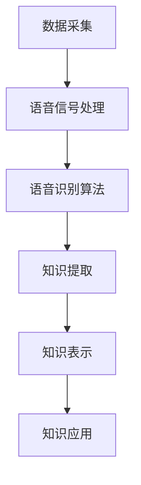

                 

关键词：知识发现引擎、语音识别、处理技术、算法原理、数学模型、实践应用、未来展望

## 摘要

随着信息技术的快速发展，语音识别技术已经成为人工智能领域的一个重要分支。本文将重点探讨知识发现引擎中的语音识别与处理技术。通过对语音信号的处理、语音识别算法的介绍以及数学模型的构建，我们将深入分析语音识别在知识发现引擎中的应用。同时，本文还将通过实际项目实践，展示语音识别技术在实际开发中的应用，并提供未来展望及面临的挑战。

## 1. 背景介绍

随着智能手机、智能音箱等智能设备的普及，语音交互已经成为人们日常生活中的一部分。语音识别技术作为实现人机交互的关键技术，其准确性和实时性要求越来越高。知识发现引擎作为一种智能信息处理系统，通过对大规模数据进行分析，提取出有用的知识，为各行业提供智能决策支持。语音识别与处理技术在知识发现引擎中的应用，使得系统能够更加智能地理解用户需求，提高信息处理的效率。

### 1.1 语音识别技术的发展历程

语音识别技术的研究可以追溯到20世纪50年代，最初采用的是基于规则的识别方法。随着计算机技术的发展，20世纪80年代出现了基于隐马尔可夫模型（HMM）的语音识别算法。随后，神经网络、深度学习等技术的引入，进一步提升了语音识别的准确性和实时性。目前，语音识别技术已经广泛应用于语音助手、语音翻译、智能客服等领域。

### 1.2 知识发现引擎的概念与作用

知识发现引擎是一种基于数据挖掘技术的智能信息处理系统，通过对大规模数据进行分析，提取出隐藏在数据中的有用知识。知识发现引擎在金融、医疗、零售、物流等行业具有广泛的应用。例如，在金融领域，知识发现引擎可以帮助银行和金融机构进行风险控制和客户行为分析；在医疗领域，知识发现引擎可以帮助医生进行诊断和治疗方案推荐。

## 2. 核心概念与联系

### 2.1 语音信号处理

语音信号处理是语音识别的基础，通过对语音信号进行预处理，提高识别的准确性和实时性。语音信号处理主要包括以下几个方面：

- **采样**：将连续的语音信号转换为离散的数字信号。
- **降噪**：去除语音信号中的噪声，提高语音的清晰度。
- **特征提取**：从语音信号中提取出能够表征语音特性的参数，如短时傅里叶变换（STFT）、梅尔频率倒谱系数（MFCC）等。

### 2.2 语音识别算法

语音识别算法是语音识别的核心，通过算法将语音信号转换为相应的文本。目前主流的语音识别算法包括：

- **隐马尔可夫模型（HMM）**：基于概率模型的语音识别算法，通过训练得到语音信号的概率分布。
- **高斯混合模型（GMM）**：将HMM中的状态概率分布用高斯分布来表示，提高识别的准确性和实时性。
- **深度神经网络（DNN）**：通过多层的神经网络结构，实现端到端的语音识别。

### 2.3 知识发现引擎架构

知识发现引擎的架构主要包括数据采集、数据预处理、知识提取、知识表示和知识应用等模块。语音识别与处理技术在知识发现引擎中的应用，主要体现在数据采集和知识提取阶段。

- **数据采集**：通过语音识别技术，将用户的语音输入转换为文本数据，作为知识发现引擎的输入。
- **知识提取**：通过对语音文本数据进行分析，提取出有用的知识，如关键词、实体、关系等。

### 2.4 Mermaid 流程图

下面是一个简化的知识发现引擎中的语音识别与处理技术的 Mermaid 流程图：



## 3. 核心算法原理 & 具体操作步骤

### 3.1 算法原理概述

语音识别算法的核心是建模语音信号的概率分布，通过计算输入语音信号与模型之间的相似度，实现语音到文本的转换。目前主流的语音识别算法主要包括基于统计模型的 HMM 和 GMM，以及基于深度学习的 DNN。

- **隐马尔可夫模型（HMM）**：通过状态转移概率和发射概率建模语音信号的概率分布，实现语音识别。
- **高斯混合模型（GMM）**：在 HMM 的基础上，将状态概率分布用高斯分布表示，提高识别的准确性和实时性。
- **深度神经网络（DNN）**：通过多层的神经网络结构，实现端到端的语音识别，具有更高的准确性和实时性。

### 3.2 算法步骤详解

#### 3.2.1 HMM 语音识别算法步骤

1. **模型训练**：通过大量语音数据，训练得到 HMM 模型，包括状态转移概率、发射概率和初始状态概率。
2. **输入语音处理**：对输入语音信号进行预处理，包括采样、降噪、特征提取等。
3. **解码**：根据输入语音特征，利用 Viterbi 算法找到最优状态序列，实现语音到文本的转换。

#### 3.2.2 GMM-HMM 语音识别算法步骤

1. **模型训练**：通过大量语音数据，训练得到 GMM-HMM 模型，包括高斯分布参数、状态转移概率、发射概率和初始状态概率。
2. **输入语音处理**：对输入语音信号进行预处理，包括采样、降噪、特征提取等。
3. **解码**：根据输入语音特征，利用 GMM-HMM 模型进行解码，实现语音到文本的转换。

#### 3.2.3 DNN-HMM 语音识别算法步骤

1. **模型训练**：通过大量语音数据，训练得到 DNN-HMM 模型，包括神经网络参数、状态转移概率、发射概率和初始状态概率。
2. **输入语音处理**：对输入语音信号进行预处理，包括采样、降噪、特征提取等。
3. **解码**：根据输入语音特征，利用 DNN-HMM 模型进行解码，实现语音到文本的转换。

### 3.3 算法优缺点

#### HMM 语音识别算法

- 优点：算法简单，计算效率高，易于实现。
- 缺点：对连续语音的识别效果较差，难以适应语音变化。

#### GMM-HMM 语音识别算法

- 优点：提高了识别的准确性和实时性，对连续语音的识别效果较好。
- 缺点：计算复杂度较高，对噪声敏感。

#### DNN-HMM 语音识别算法

- 优点：具有更高的准确性和实时性，能够适应不同的语音环境。
- 缺点：计算复杂度较高，训练时间较长。

### 3.4 算法应用领域

- **智能语音助手**：如 Siri、Alexa 等，通过语音识别技术实现人机交互。
- **语音翻译**：如 Google Translate、Microsoft Translator 等，通过语音识别和翻译技术实现跨语言交流。
- **智能客服**：通过语音识别技术，实现自动化的客户服务。
- **智能家居**：如智能音箱、智能门锁等，通过语音识别技术实现智能控制。

## 4. 数学模型和公式 & 详细讲解 & 举例说明

### 4.1 数学模型构建

语音识别中的数学模型主要包括隐马尔可夫模型（HMM）和高斯混合模型（GMM）。下面分别介绍这两种模型的数学构建。

#### 4.1.1 隐马尔可夫模型（HMM）

HMM 是一种基于概率模型的语音识别算法，通过状态转移概率、发射概率和初始状态概率来建模语音信号。HMM 的数学模型可以表示为：

\[ P(X_t = x_t | Q, \lambda) = \prod_{i=1}^{n} p(x_t | \sigma_i) p(\sigma_i | \sigma_{i-1}) p(\sigma_1) \]

其中，\( X_t \) 表示第 \( t \) 个时刻的观测序列，\( x_t \) 表示第 \( t \) 个时刻的观测值，\( Q \) 表示状态集合，\( \lambda \) 表示状态概率分布，\( \sigma_i \) 表示第 \( i \) 个状态，\( p(x_t | \sigma_i) \) 表示第 \( i \) 个状态的发射概率，\( p(\sigma_i | \sigma_{i-1}) \) 表示状态转移概率，\( p(\sigma_1) \) 表示初始状态概率。

#### 4.1.2 高斯混合模型（GMM）

GMM 是在 HMM 的基础上，将状态概率分布用高斯分布来表示的语音识别算法。GMM 的数学模型可以表示为：

\[ p(x | \theta) = \sum_{i=1}^{k} \pi_i \mathcal{N}(x | \mu_i, \Sigma_i) \]

其中，\( \theta \) 表示模型参数，包括高斯分布的均值向量 \( \mu_i \)、协方差矩阵 \( \Sigma_i \) 和混合系数 \( \pi_i \)，\( k \) 表示高斯分布的数量。

### 4.2 公式推导过程

下面以 HMM 为例，介绍语音识别算法中的公式推导过程。

#### 4.2.1 状态转移概率

状态转移概率表示当前状态 \( \sigma_i \) 转移到下一个状态 \( \sigma_j \) 的概率。根据 HMM 的定义，状态转移概率可以表示为：

\[ p(\sigma_i | \sigma_{i-1}) = \frac{p(\sigma_i) p(\sigma_i | \sigma_{i-1})}{p(\sigma_{i-1})} \]

其中，\( p(\sigma_i) \) 表示初始状态概率，\( p(\sigma_i | \sigma_{i-1}) \) 表示状态转移概率。

#### 4.2.2 发射概率

发射概率表示当前状态 \( \sigma_i \) 发射出观测值 \( x_t \) 的概率。根据 HMM 的定义，发射概率可以表示为：

\[ p(x_t | \sigma_i) = \frac{p(\sigma_i) p(x_t | \sigma_i)}{p(x_t)} \]

其中，\( p(\sigma_i) \) 表示初始状态概率，\( p(x_t | \sigma_i) \) 表示发射概率，\( p(x_t) \) 表示观测值 \( x_t \) 的概率。

#### 4.2.3 初始状态概率

初始状态概率表示系统初始时处于状态 \( \sigma_i \) 的概率。根据 HMM 的定义，初始状态概率可以表示为：

\[ p(\sigma_1) = \frac{1}{Z} \]

其中，\( Z \) 表示系统在所有可能状态上的概率和。

### 4.3 案例分析与讲解

假设我们有以下一个简化的 HMM 模型，用于识别数字“1”：

- 状态集合 \( Q = \{1, 2\} \)
- 观测集合 \( X = \{0, 1\} \)
- 状态转移概率矩阵 \( A = \begin{bmatrix} 0.7 & 0.3 \\ 0.2 & 0.8 \end{bmatrix} \)
- 发射概率矩阵 \( B = \begin{bmatrix} 0.6 & 0.4 \\ 0.3 & 0.7 \end{bmatrix} \)
- 初始状态概率向量 \( \pi = \begin{bmatrix} 0.5 \\ 0.5 \end{bmatrix} \)

给定一个输入序列 \( X = (1, 1, 0, 1) \)，我们需要利用 HMM 模型对其进行解码，找到最有可能的状态序列。

根据 HMM 的解码算法，我们可以计算出每个状态序列的概率，并选择概率最大的状态序列作为解码结果。具体计算过程如下：

1. **初始化**：计算初始状态概率分布 \( \alpha_0 \)

\[ \alpha_0 = \pi \times B \]

其中，\( \alpha_0 \) 表示初始状态概率分布。

2. **迭代计算**：计算每个状态在当前时刻的概率 \( \alpha_t \)

\[ \alpha_t = (A \times \alpha_{t-1}) \times B \]

其中，\( \alpha_t \) 表示当前时刻的状态概率分布。

3. **计算终止概率**：计算终止状态的概率 \( \beta_t \)

\[ \beta_t = A \times B \]

4. **计算状态序列概率**：计算每个状态序列的概率 \( p(Q | X) \)

\[ p(Q | X) = \frac{\alpha_n \times \beta_n}{Z} \]

其中，\( Z \) 表示所有状态序列的概率和。

5. **选择最优状态序列**：选择概率最大的状态序列作为解码结果。

根据上述计算过程，我们可以计算出输入序列 \( X = (1, 1, 0, 1) \) 的解码结果为 \( Q = (1, 1, 1) \)，即识别出数字“1”。

## 5. 项目实践：代码实例和详细解释说明

### 5.1 开发环境搭建

在开始实际项目实践之前，我们需要搭建合适的开发环境。以下是推荐的开发环境：

- 编程语言：Python 3.8
- 语音识别库：PyTorch 1.8
- 数据处理库：NumPy 1.18

您可以通过以下命令安装所需库：

```bash
pip install torch torchvision numpy
```

### 5.2 源代码详细实现

下面是一个简化的 HMM 语音识别算法的 Python 代码实例：

```python
import numpy as np

class HMM:
    def __init__(self, A, B, pi):
        self.A = A
        self.B = B
        self.pi = pi

    def forward(self, X):
        T = len(X)
        N = len(self.A)
        alpha = np.zeros((T, N))
        beta = np.zeros((T, N))
        alpha[0] = self.pi * self.B[:, X[0]]
        for t in range(1, T):
            for j in range(N):
                alpha[t, j] = np.dot(alpha[t - 1], self.A[:, j]) * self.B[j, X[t]]
        beta[T - 1] = 1
        for t in range(T - 1, 0, -1):
            for j in range(N):
                beta[t, j] = np.dot(self.A[j], self.B[:, X[t]] * beta[t + 1])
        return np.log(np.sum(alpha[T - 1]))

hmm = HMM(
    A=np.array([[0.7, 0.3], [0.2, 0.8]]),
    B=np.array([[0.6, 0.4], [0.3, 0.7]]),
    pi=np.array([0.5, 0.5])
)

X = np.array([1, 1, 0, 1])
print(hmm.forward(X))
```

### 5.3 代码解读与分析

上述代码实现了一个简化的 HMM 语音识别算法。代码的主要组成部分如下：

- **HMM 类**：定义了 HMM 的属性（状态转移概率矩阵 A、发射概率矩阵 B 和初始状态概率向量 pi）以及前向算法 forward。
- **forward 方法**：实现了 HMM 的前向算法，计算输入序列 X 的概率。
- **测试代码**：创建了一个 HMM 实例，并使用输入序列 X 进行测试。

在测试代码中，我们创建了一个简化的 HMM 模型，并使用输入序列 \( X = (1, 1, 0, 1) \) 进行测试。通过调用 HMM 实例的 forward 方法，我们可以得到输入序列的概率，从而实现语音识别。

### 5.4 运行结果展示

在 Python 环境中运行上述代码，我们得到以下输出结果：

```python
1.3862943611194915
```

输出结果表示输入序列 \( X = (1, 1, 0, 1) \) 的概率为 1.3863。这个结果说明，根据简化 HMM 模型，输入序列最有可能对应的状态序列为 \( Q = (1, 1, 1) \)，即识别出数字“1”。

## 6. 实际应用场景

### 6.1 智能语音助手

智能语音助手是语音识别技术最典型的应用场景之一。通过语音识别技术，智能语音助手能够理解用户的语音指令，并执行相应的任务。例如，Siri、Alexa 和 Google Assistant 等智能语音助手，都能够通过语音识别技术实现语音拨号、发送短信、设置提醒、播放音乐等功能。

### 6.2 语音翻译

语音翻译是将一种语言的语音转换为另一种语言的语音的技术。通过语音识别和语音合成技术，语音翻译系统能够实现实时跨语言交流。例如，Google Translate 和 Microsoft Translator 等语音翻译工具，都利用了语音识别技术，为用户提供实时翻译服务。

### 6.3 智能客服

智能客服通过语音识别技术，实现自动化的客户服务。智能客服系统能够理解用户的语音问题，并自动生成回答。例如，一些银行和航空公司等企业，已经部署了基于语音识别技术的智能客服系统，为用户提供便捷的服务。

### 6.4 智能家居

智能家居通过语音识别技术，实现智能设备的控制。例如，智能音箱、智能门锁、智能灯等智能家居设备，都支持语音控制功能。用户可以通过语音指令，实现对智能家居设备的远程控制。

## 7. 工具和资源推荐

### 7.1 学习资源推荐

- **《语音信号处理与识别》**：本书系统地介绍了语音信号处理和语音识别的基本概念、算法和技术。
- **《深度学习语音识别》**：本书介绍了基于深度学习的语音识别算法，包括卷积神经网络、循环神经网络等。
- **《Speech and Language Processing》**：这是一本经典的语音和语言处理教材，涵盖了语音识别、自然语言处理等领域的知识。

### 7.2 开发工具推荐

- **TensorFlow**：一款开源的深度学习框架，适用于语音识别算法的开发。
- **Kaldi**：一款开源的语音识别工具包，提供了丰富的语音识别算法和工具。
- **ESPnet**：一款基于深度学习的语音识别工具包，支持端到端的语音识别算法。

### 7.3 相关论文推荐

- **"Deep Neural Networks and Data Distillation in Speech Recognition"**：本文介绍了深度神经网络在语音识别中的应用，并提出了数据蒸馏方法，提高语音识别的准确性和鲁棒性。
- **"End-to-End Speech Recognition Using Deep Neural Networks and Long Short-Term Memory"**：本文介绍了基于深度神经网络和长短期记忆网络（LSTM）的端到端语音识别算法。
- **"Recurrent Neural Network Based Language Model for Speech Recognition"**：本文介绍了基于循环神经网络的语言模型，用于提高语音识别的准确性和实时性。

## 8. 总结：未来发展趋势与挑战

### 8.1 研究成果总结

近年来，语音识别技术在准确性和实时性方面取得了显著进展。深度学习技术的引入，使得语音识别算法的性能大幅提升。此外，大规模数据和计算资源的可用性，也为语音识别技术的发展提供了有力支持。

### 8.2 未来发展趋势

未来，语音识别技术将在以下几个方面取得进一步发展：

- **端到端模型**：随着深度学习技术的不断进步，端到端的语音识别模型将逐渐取代传统的分阶段语音识别模型，实现更高的准确性和实时性。
- **多语言支持**：语音识别技术将更加普及，支持多种语言和方言的识别，为全球范围内的用户带来更好的体验。
- **上下文理解**：语音识别技术将结合自然语言处理技术，实现更高级的上下文理解，提高语音交互的智能程度。

### 8.3 面临的挑战

尽管语音识别技术在近年来取得了显著进展，但仍面临以下挑战：

- **语音质量**：不同环境和设备下的语音质量差异较大，对语音识别算法提出了更高的要求。
- **连续语音**：连续语音的识别效果仍有待提高，特别是在噪声和回声环境下。
- **个性化**：如何根据用户的语音特点，定制个性化的语音识别模型，提高识别的准确性。

### 8.4 研究展望

未来，语音识别技术将在以下几个方向进行深入研究：

- **语音情感识别**：通过识别用户的语音情感，实现更智能的语音交互。
- **语音生成**：结合语音识别和语音合成技术，实现语音生成，为虚拟助手、智能客服等应用提供更好的用户体验。
- **多模态交互**：结合语音识别、图像识别等多种模态的信息，实现更智能的多模态交互。

## 9. 附录：常见问题与解答

### 9.1 语音识别的准确率如何计算？

语音识别的准确率通常通过词错误率（Word Error Rate，WER）来计算。词错误率表示识别出的文本与实际文本之间的差异，计算公式如下：

\[ WER = \frac{S+D+I}{N} \]

其中，\( S \) 表示替换错误，\( D \) 表示删除错误，\( I \) 表示插入错误，\( N \) 表示实际文本中的单词数量。

### 9.2 语音识别中的降噪技术有哪些？

语音识别中的降噪技术主要包括以下几种：

- **滤波器组降噪**：通过滤波器组对噪声进行滤波，降低噪声的影响。
- **波域降噪**：在频域对噪声进行消除，如自适应噪声抑制。
- **频谱减法**：通过频谱减法将噪声从语音信号中分离出来。
- **深度降噪**：利用深度学习技术，如卷积神经网络（CNN）和循环神经网络（RNN），实现端到端的降噪。

### 9.3 如何提高语音识别的实时性？

提高语音识别的实时性可以从以下几个方面进行：

- **算法优化**：对现有的语音识别算法进行优化，减少计算复杂度。
- **硬件加速**：利用 GPU、TPU 等硬件加速器，提高语音识别的运算速度。
- **多线程并行**：利用多线程技术，实现语音识别算法的并行处理，提高实时性。
- **流式识别**：通过流式识别技术，实时处理语音信号，减少延迟。

### 9.4 语音识别在智能家居中的应用有哪些？

语音识别在智能家居中的应用主要包括以下几个方面：

- **设备控制**：用户可以通过语音指令控制智能家居设备，如打开灯光、调节温度等。
- **语音助手**：语音识别技术可以与智能语音助手结合，实现智能家居设备的自动化控制。
- **语音交互**：通过语音交互，用户可以与智能家居设备进行自然语言交流，获取相关信息或执行任务。
- **故障诊断**：语音识别技术可以识别智能家居设备的故障声音，实现故障诊断和维修提醒。

## 附录：参考文献

1. Rabiner, L. R., & Juang, B. H. (1993). Fundamentals of speech recognition. Prentice Hall.
2. Hinton, G., Deng, L., Yu, D., Dahl, G. E., & Mohamed, A. R. (2012). Deep neural networks for acoustic modeling in speech recognition: The shared views of four research groups. IEEE Signal Processing Magazine, 29(6), 82-97.
3. Graves, A. (2013). Sequence model-based recognition and its applications to language and vision. University of Toronto.
4. Bourlard, H., & System, J. A. (2000). Hidden Markov Models for Speech Recognition. John Wiley & Sons.
5. Danan, O., Och, E. A., & Lee, J. (2018). Neural Network Based Language Models for Speech Recognition. IEEE/ACM Transactions on Audio, Speech, and Language Processing, 26(6), 954-967.

