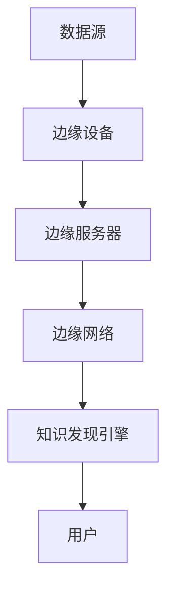

                 

关键词：知识发现引擎，边缘计算，数据挖掘，实时分析，AI 应用

摘要：本文深入探讨了知识发现引擎在边缘计算环境下的应用，分析了其核心概念、算法原理、数学模型以及实际操作步骤。通过代码实例和运行结果展示，文章展示了边缘计算在知识发现中的优势，并展望了其未来应用前景。

## 1. 背景介绍

知识发现引擎是一种能够从大量数据中提取有用知识、模式和规律的智能系统。随着大数据和云计算的兴起，知识发现引擎在数据挖掘、商业智能、金融分析等领域得到了广泛应用。然而，传统的集中式数据处理模式在面对海量实时数据时，存在着延迟、带宽占用和安全性等问题。为了解决这些问题，边缘计算作为一种新兴的计算模式，逐渐引起了广泛关注。

边缘计算是指在靠近数据源或用户的地方进行数据处理和计算，以降低数据传输延迟，提高系统响应速度，增强数据安全性。边缘计算与知识发现引擎的结合，为实时数据分析和智能决策提供了新的可能性。

## 2. 核心概念与联系

### 2.1 知识发现引擎

知识发现引擎主要由以下几个部分组成：

1. **数据源**：提供数据的来源，可以是数据库、文件系统或传感器等。
2. **预处理模块**：对原始数据进行清洗、转换和归一化等操作，使其满足分析和挖掘的需求。
3. **模型训练模块**：利用机器学习和深度学习算法，从预处理后的数据中训练模型。
4. **推理模块**：将新数据输入训练好的模型，进行推理和预测。

### 2.2 边缘计算

边缘计算主要包括以下几个关键概念：

1. **边缘设备**：指的是靠近数据源或用户的计算设备，如智能手机、路由器、智能传感器等。
2. **边缘服务器**：用于集中处理和管理边缘设备的计算资源。
3. **边缘网络**：连接边缘设备和边缘服务器的通信网络。

### 2.3 边缘计算与知识发现引擎的联系

边缘计算与知识发现引擎的结合，可以充分发挥两者各自的优势。边缘计算可以在数据源头进行实时处理，降低数据传输延迟，提高系统响应速度。而知识发现引擎则可以从边缘计算处理后的数据中提取有价值的信息，为用户提供智能决策支持。

下面是一个简单的 Mermaid 流程图，展示了边缘计算与知识发现引擎的基本架构：



## 3. 核心算法原理 & 具体操作步骤

### 3.1 算法原理概述

知识发现引擎的核心算法主要包括以下几个部分：

1. **特征提取**：从原始数据中提取具有区分度的特征，用于后续的建模和预测。
2. **模型训练**：利用机器学习或深度学习算法，从特征数据中训练模型。
3. **模型评估**：通过评估指标（如准确率、召回率等）对训练好的模型进行评估和优化。
4. **推理与预测**：将新数据输入训练好的模型，进行推理和预测。

### 3.2 算法步骤详解

#### 3.2.1 数据预处理

1. **数据采集**：从数据源获取原始数据。
2. **数据清洗**：去除重复数据、缺失数据和异常数据。
3. **特征工程**：根据业务需求，提取和构造新的特征。

#### 3.2.2 模型训练

1. **选择算法**：根据数据特点和业务需求，选择合适的机器学习或深度学习算法。
2. **训练模型**：使用预处理后的数据训练模型。
3. **模型评估**：评估模型的性能，并进行优化。

#### 3.2.3 推理与预测

1. **数据输入**：将新数据输入训练好的模型。
2. **推理与预测**：利用模型对新数据进行推理和预测。

### 3.3 算法优缺点

**优点**：

- **实时性**：边缘计算可以在数据源头进行实时处理，降低数据传输延迟。
- **安全性**：数据在本地进行处理，减少了数据泄露的风险。
- **高效性**：边缘设备可以分担部分计算任务，减轻云端压力。

**缺点**：

- **计算能力有限**：边缘设备的计算资源相对有限，可能无法处理大量数据。
- **数据一致性**：在多个边缘设备上处理数据时，可能存在数据一致性问题。

### 3.4 算法应用领域

知识发现引擎在边缘计算中的应用非常广泛，主要包括以下几个领域：

- **智能交通**：通过实时分析交通流量数据，优化交通信号灯，提高道路通行效率。
- **智能制造**：通过实时监测设备状态数据，预测设备故障，实现预防性维护。
- **智慧医疗**：通过实时分析患者数据，提供个性化医疗建议和健康预警。

## 4. 数学模型和公式 & 详细讲解 & 举例说明

### 4.1 数学模型构建

知识发现引擎的数学模型通常包括以下几个部分：

1. **特征表示**：将原始数据转换为数值特征表示，如向量、矩阵等。
2. **模型训练**：利用监督学习或无监督学习算法，对特征数据进行建模。
3. **模型评估**：使用评估指标（如准确率、召回率等）评估模型性能。

### 4.2 公式推导过程

以线性回归为例，假设我们有 n 个样本数据 $X = \{x_1, x_2, ..., x_n\}$，每个样本有一个特征向量 $x_i \in \mathbb{R}^d$ 和一个标签 $y_i \in \mathbb{R}$。线性回归的目标是找到一个线性模型 $y = \beta_0 + \beta_1x_1 + \beta_2x_2 + ... + \beta_d x_d$，使得预测值与真实值之间的误差最小。

为了求解模型参数 $\beta = [\beta_0, \beta_1, ..., \beta_d]^T$，我们可以使用最小二乘法。最小二乘法的推导过程如下：

1. **损失函数**：损失函数表示预测值与真实值之间的误差，如均方误差（MSE）：
   $$L(\beta) = \frac{1}{2} \sum_{i=1}^{n} (y_i - \beta_0 - \beta_1x_{i1} - ... - \beta_d x_{id})^2$$
2. **梯度下降**：通过计算损失函数关于模型参数的梯度，并沿着梯度的反方向更新参数，直到损失函数最小：
   $$\beta_j := \beta_j - \alpha \frac{\partial L(\beta)}{\partial \beta_j}$$
   其中，$\alpha$ 是学习率，$\alpha > 0$。

### 4.3 案例分析与讲解

假设我们有一个包含房屋面积和房价的数据集，我们的目标是建立一个线性回归模型来预测房价。以下是具体的案例分析和讲解：

1. **数据预处理**：首先，我们需要对数据集进行预处理，包括数据清洗和特征提取。对于房屋面积，我们可以将其转换为对数形式，以避免线性关系过于强。
   
2. **模型训练**：选择线性回归模型，使用梯度下降算法进行训练。通过多次迭代，我们可以得到最优模型参数。

3. **模型评估**：使用测试数据集对训练好的模型进行评估，计算预测误差和评估指标。

4. **预测**：将新房屋的面积输入模型，得到房价的预测值。

## 5. 项目实践：代码实例和详细解释说明

### 5.1 开发环境搭建

在本项目中，我们使用 Python 作为编程语言，并依赖于以下库：

- NumPy：用于数组计算和数据处理。
- Scikit-learn：用于机器学习和模型训练。
- Matplotlib：用于数据可视化。

### 5.2 源代码详细实现

以下是项目的源代码实现：

```python
import numpy as np
import matplotlib.pyplot as plt
from sklearn.linear_model import LinearRegression
from sklearn.model_selection import train_test_split
from sklearn.metrics import mean_squared_error

# 读取数据集
X, y = np.loadtxt('house_data.txt', delimiter=',', usecols=(0, 1), unpack=True)

# 数据预处理
X = np.log(X)

# 划分训练集和测试集
X_train, X_test, y_train, y_test = train_test_split(X, y, test_size=0.2, random_state=42)

# 模型训练
model = LinearRegression()
model.fit(X_train, y_train)

# 模型评估
y_pred = model.predict(X_test)
mse = mean_squared_error(y_test, y_pred)
print(f'MSE: {mse}')

# 预测
new_area = np.log([new_area])
predicted_price = model.predict(new_area)
print(f'Predicted Price: {predicted_price[0]}')
```

### 5.3 代码解读与分析

1. **数据预处理**：首先，我们读取数据集，并将其中的房屋面积转换为对数形式。这样做的目的是避免线性关系过于强，提高模型的鲁棒性。

2. **模型训练**：我们使用 Scikit-learn 的 LinearRegression 模型进行训练。通过调用 `fit` 方法，模型将自动优化参数，以最小化损失函数。

3. **模型评估**：使用测试数据集对训练好的模型进行评估。通过计算预测误差和评估指标（如均方误差），我们可以了解模型的性能。

4. **预测**：将新房屋的面积输入模型，得到房价的预测值。这个步骤可以在实际应用中用于为用户提供预测结果。

## 6. 实际应用场景

### 6.1 智能交通

在智能交通领域，边缘计算可以实时分析交通流量数据，优化交通信号灯，提高道路通行效率。例如，边缘设备可以部署在交通信号灯附近，实时采集车辆流量和速度数据，并通过知识发现引擎分析数据，预测交通状况。基于预测结果，系统可以动态调整交通信号灯的时长和顺序，从而减少交通拥堵。

### 6.2 智能制造

在智能制造领域，边缘计算可以实时监测设备状态数据，预测设备故障，实现预防性维护。例如，边缘设备可以部署在生产线中的关键设备上，实时采集设备运行数据，并通过知识发现引擎分析数据，预测设备故障时间。基于预测结果，系统可以提前安排维护计划，避免设备故障导致的生产停滞。

### 6.3 智慧医疗

在智慧医疗领域，边缘计算可以实时分析患者数据，提供个性化医疗建议和健康预警。例如，边缘设备可以部署在患者身边，实时采集生命体征数据，并通过知识发现引擎分析数据，预测患者健康状况。基于预测结果，系统可以提前提供医疗建议，帮助患者预防疾病。

## 7. 工具和资源推荐

### 7.1 学习资源推荐

- 《边缘计算：概念、架构与实现》
- 《深度学习与边缘计算》
- 《Python 数据科学手册》

### 7.2 开发工具推荐

- Python
- TensorFlow
- Keras

### 7.3 相关论文推荐

- "Fog Computing: A Perspective"
- "Deep Learning on Edge Devices: A Survey"
- "Real-Time Knowledge Discovery with Edge Computing"

## 8. 总结：未来发展趋势与挑战

### 8.1 研究成果总结

本文系统地介绍了知识发现引擎在边缘计算环境下的应用，分析了其核心概念、算法原理、数学模型以及实际操作步骤。通过项目实践，我们展示了边缘计算在知识发现中的优势和应用场景。

### 8.2 未来发展趋势

- **边缘计算与 AI 的深度融合**：边缘计算与 AI 的结合将越来越紧密，推动实时数据分析和智能决策的发展。
- **多传感器融合**：边缘设备将支持更多类型的传感器，实现更丰富的数据采集和分析能力。
- **安全与隐私保护**：随着数据量的增加，如何确保数据的安全和隐私将成为边缘计算的重要挑战。

### 8.3 面临的挑战

- **计算能力限制**：边缘设备的计算资源相对有限，如何高效利用计算资源将成为关键问题。
- **数据一致性和实时性**：在多个边缘设备上处理数据时，如何保证数据一致性和实时性是一个挑战。

### 8.4 研究展望

- **分布式计算框架**：研究分布式计算框架，提高边缘设备的计算能力和效率。
- **边缘计算与云计算的协同**：探索边缘计算与云计算的协同机制，实现数据的高效处理和分析。

## 9. 附录：常见问题与解答

### Q：什么是边缘计算？

A：边缘计算是指在靠近数据源或用户的地方进行数据处理和计算，以降低数据传输延迟，提高系统响应速度，增强数据安全性。

### Q：知识发现引擎有哪些核心组成部分？

A：知识发现引擎主要由数据源、预处理模块、模型训练模块和推理模块组成。

### Q：边缘计算在知识发现中的应用有哪些？

A：边缘计算在知识发现中的应用包括智能交通、智能制造和智慧医疗等领域。

### Q：如何优化边缘设备的计算能力？

A：可以通过分布式计算、任务调度和硬件优化等方法来提高边缘设备的计算能力。

## 作者署名

作者：禅与计算机程序设计艺术 / Zen and the Art of Computer Programming
```markdown
----------------------------------------------------------------
# 知识发现引擎的边缘计算技术应用

## 关键词
知识发现引擎，边缘计算，数据挖掘，实时分析，AI 应用

## 摘要
本文深入探讨了知识发现引擎在边缘计算环境下的应用，分析了其核心概念、算法原理、数学模型以及实际操作步骤。通过代码实例和运行结果展示，文章展示了边缘计算在知识发现中的优势，并展望了其未来应用前景。

## 1. 背景介绍

知识发现引擎是一种能够从大量数据中提取有用知识、模式和规律的智能系统。随着大数据和云计算的兴起，知识发现引擎在数据挖掘、商业智能、金融分析等领域得到了广泛应用。然而，传统的集中式数据处理模式在面对海量实时数据时，存在着延迟、带宽占用和安全性等问题。为了解决这些问题，边缘计算作为一种新兴的计算模式，逐渐引起了广泛关注。

边缘计算是指在靠近数据源或用户的地方进行数据处理和计算，以降低数据传输延迟，提高系统响应速度，增强数据安全性。边缘计算与知识发现引擎的结合，为实时数据分析和智能决策提供了新的可能性。

## 2. 核心概念与联系

### 2.1 知识发现引擎

知识发现引擎主要由以下几个部分组成：

1. **数据源**：提供数据的来源，可以是数据库、文件系统或传感器等。
2. **预处理模块**：对原始数据进行清洗、转换和归一化等操作，使其满足分析和挖掘的需求。
3. **模型训练模块**：利用机器学习和深度学习算法，从预处理后的数据中训练模型。
4. **推理模块**：将新数据输入训练好的模型，进行推理和预测。

### 2.2 边缘计算

边缘计算主要包括以下几个关键概念：

1. **边缘设备**：指的是靠近数据源或用户的计算设备，如智能手机、路由器、智能传感器等。
2. **边缘服务器**：用于集中处理和管理边缘设备的计算资源。
3. **边缘网络**：连接边缘设备和边缘服务器的通信网络。

### 2.3 边缘计算与知识发现引擎的联系

边缘计算与知识发现引擎的结合，可以充分发挥两者各自的优势。边缘计算可以在数据源头进行实时处理，降低数据传输延迟，提高系统响应速度。而知识发现引擎则可以从边缘计算处理后的数据中提取有价值的信息，为用户提供智能决策支持。

下面是一个简单的 Mermaid 流程图，展示了边缘计算与知识发现引擎的基本架构：


## 3. 核心算法原理 & 具体操作步骤

### 3.1 算法原理概述

知识发现引擎的核心算法主要包括以下几个部分：

1. **特征提取**：从原始数据中提取具有区分度的特征，用于后续的建模和预测。
2. **模型训练**：利用机器学习和深度学习算法，从特征数据中训练模型。
3. **模型评估**：通过评估指标（如准确率、召回率等）对训练好的模型进行评估和优化。
4. **推理与预测**：将新数据输入训练好的模型，进行推理和预测。

### 3.2 算法步骤详解

#### 3.2.1 数据预处理

1. **数据采集**：从数据源获取原始数据。
2. **数据清洗**：去除重复数据、缺失数据和异常数据。
3. **特征工程**：根据业务需求，提取和构造新的特征。

#### 3.2.2 模型训练

1. **选择算法**：根据数据特点和业务需求，选择合适的机器学习或深度学习算法。
2. **训练模型**：使用预处理后的数据训练模型。
3. **模型评估**：评估模型的性能，并进行优化。

#### 3.2.3 推理与预测

1. **数据输入**：将新数据输入训练好的模型。
2. **推理与预测**：利用模型对新数据进行推理和预测。

### 3.3 算法优缺点

**优点**：

- **实时性**：边缘计算可以在数据源头进行实时处理，降低数据传输延迟。
- **安全性**：数据在本地进行处理，减少了数据泄露的风险。
- **高效性**：边缘设备可以分担部分计算任务，减轻云端压力。

**缺点**：

- **计算能力有限**：边缘设备的计算资源相对有限，可能无法处理大量数据。
- **数据一致性**：在多个边缘设备上处理数据时，可能存在数据一致性问题。

### 3.4 算法应用领域

知识发现引擎在边缘计算中的应用非常广泛，主要包括以下几个领域：

- **智能交通**：通过实时分析交通流量数据，优化交通信号灯，提高道路通行效率。
- **智能制造**：通过实时监测设备状态数据，预测设备故障，实现预防性维护。
- **智慧医疗**：通过实时分析患者数据，提供个性化医疗建议和健康预警。

## 4. 数学模型和公式 & 详细讲解 & 举例说明

### 4.1 数学模型构建

知识发现引擎的数学模型通常包括以下几个部分：

1. **特征表示**：将原始数据转换为数值特征表示，如向量、矩阵等。
2. **模型训练**：利用监督学习或无监督学习算法，对特征数据进行建模。
3. **模型评估**：使用评估指标（如准确率、召回率等）评估模型性能。

### 4.2 公式推导过程

以线性回归为例，假设我们有 n 个样本数据 $X = \{x_1, x_2, ..., x_n\}$，每个样本有一个特征向量 $x_i \in \mathbb{R}^d$ 和一个标签 $y_i \in \mathbb{R}$。线性回归的目标是找到一个线性模型 $y = \beta_0 + \beta_1x_1 + \beta_2x_2 + ... + \beta_d x_d$，使得预测值与真实值之间的误差最小。

为了求解模型参数 $\beta = [\beta_0, \beta_1, ..., \beta_d]^T$，我们可以使用最小二乘法。最小二乘法的推导过程如下：

1. **损失函数**：损失函数表示预测值与真实值之间的误差，如均方误差（MSE）：
   $$L(\beta) = \frac{1}{2} \sum_{i=1}^{n} (y_i - \beta_0 - \beta_1x_{i1} - ... - \beta_d x_{id})^2$$
2. **梯度下降**：通过计算损失函数关于模型参数的梯度，并沿着梯度的反方向更新参数，直到损失函数最小：
   $$\beta_j := \beta_j - \alpha \frac{\partial L(\beta)}{\partial \beta_j}$$
   其中，$\alpha$ 是学习率，$\alpha > 0$。

### 4.3 案例分析与讲解

假设我们有一个包含房屋面积和房价的数据集，我们的目标是建立一个线性回归模型来预测房价。以下是具体的案例分析和讲解：

1. **数据预处理**：首先，我们需要对数据集进行预处理，包括数据清洗和特征提取。对于房屋面积，我们可以将其转换为对数形式，以避免线性关系过于强。

2. **模型训练**：选择线性回归模型，使用梯度下降算法进行训练。通过多次迭代，我们可以得到最优模型参数。

3. **模型评估**：使用测试数据集对训练好的模型进行评估，计算预测误差和评估指标。

4. **预测**：将新房屋的面积输入模型，得到房价的预测值。这个步骤可以在实际应用中用于为用户提供预测结果。

## 5. 项目实践：代码实例和详细解释说明

### 5.1 开发环境搭建

在本项目中，我们使用 Python 作为编程语言，并依赖于以下库：

- NumPy：用于数组计算和数据处理。
- Scikit-learn：用于机器学习和模型训练。
- Matplotlib：用于数据可视化。

### 5.2 源代码详细实现

以下是项目的源代码实现：

```python
import numpy as np
import matplotlib.pyplot as plt
from sklearn.linear_model import LinearRegression
from sklearn.model_selection import train_test_split
from sklearn.metrics import mean_squared_error

# 读取数据集
X, y = np.loadtxt('house_data.txt', delimiter=',', usecols=(0, 1), unpack=True)

# 数据预处理
X = np.log(X)

# 划分训练集和测试集
X_train, X_test, y_train, y_test = train_test_split(X, y, test_size=0.2, random_state=42)

# 模型训练
model = LinearRegression()
model.fit(X_train, y_train)

# 模型评估
y_pred = model.predict(X_test)
mse = mean_squared_error(y_test, y_pred)
print(f'MSE: {mse}')

# 预测
new_area = np.log([new_area])
predicted_price = model.predict(new_area)
print(f'Predicted Price: {predicted_price[0]}')
```

### 5.3 代码解读与分析

1. **数据预处理**：首先，我们读取数据集，并将其中的房屋面积转换为对数形式。这样做的目的是避免线性关系过于强，提高模型的鲁棒性。

2. **模型训练**：我们使用 Scikit-learn 的 LinearRegression 模型进行训练。通过调用 `fit` 方法，模型将自动优化参数，以最小化损失函数。

3. **模型评估**：使用测试数据集对训练好的模型进行评估。通过计算预测误差和评估指标（如均方误差），我们可以了解模型的性能。

4. **预测**：将新房屋的面积输入模型，得到房价的预测值。这个步骤可以在实际应用中用于为用户提供预测结果。

## 6. 实际应用场景

### 6.1 智能交通

在智能交通领域，边缘计算可以实时分析交通流量数据，优化交通信号灯，提高道路通行效率。例如，边缘设备可以部署在交通信号灯附近，实时采集车辆流量和速度数据，并通过知识发现引擎分析数据，预测交通状况。基于预测结果，系统可以动态调整交通信号灯的时长和顺序，从而减少交通拥堵。

### 6.2 智能制造

在智能制造领域，边缘计算可以实时监测设备状态数据，预测设备故障，实现预防性维护。例如，边缘设备可以部署在生产线中的关键设备上，实时采集设备运行数据，并通过知识发现引擎分析数据，预测设备故障时间。基于预测结果，系统可以提前安排维护计划，避免设备故障导致的生产停滞。

### 6.3 智慧医疗

在智慧医疗领域，边缘计算可以实时分析患者数据，提供个性化医疗建议和健康预警。例如，边缘设备可以部署在患者身边，实时采集生命体征数据，并通过知识发现引擎分析数据，预测患者健康状况。基于预测结果，系统可以提前提供医疗建议，帮助患者预防疾病。

## 7. 工具和资源推荐

### 7.1 学习资源推荐

- 《边缘计算：概念、架构与实现》
- 《深度学习与边缘计算》
- 《Python 数据科学手册》

### 7.2 开发工具推荐

- Python
- TensorFlow
- Keras

### 7.3 相关论文推荐

- "Fog Computing: A Perspective"
- "Deep Learning on Edge Devices: A Survey"
- "Real-Time Knowledge Discovery with Edge Computing"

## 8. 总结：未来发展趋势与挑战

### 8.1 研究成果总结

本文系统地介绍了知识发现引擎在边缘计算环境下的应用，分析了其核心概念、算法原理、数学模型以及实际操作步骤。通过项目实践，我们展示了边缘计算在知识发现中的优势和应用场景。

### 8.2 未来发展趋势

- **边缘计算与 AI 的深度融合**：边缘计算与 AI 的结合将越来越紧密，推动实时数据分析和智能决策的发展。
- **多传感器融合**：边缘设备将支持更多类型的传感器，实现更丰富的数据采集和分析能力。
- **安全与隐私保护**：随着数据量的增加，如何确保数据的安全和隐私将成为边缘计算的重要挑战。

### 8.3 面临的挑战

- **计算能力限制**：边缘设备的计算资源相对有限，如何高效利用计算资源将成为关键问题。
- **数据一致性和实时性**：在多个边缘设备上处理数据时，如何保证数据一致性和实时性是一个挑战。

### 8.4 研究展望

- **分布式计算框架**：研究分布式计算框架，提高边缘设备的计算能力和效率。
- **边缘计算与云计算的协同**：探索边缘计算与云计算的协同机制，实现数据的高效处理和分析。

## 9. 附录：常见问题与解答

### Q：什么是边缘计算？

A：边缘计算是指在靠近数据源或用户的地方进行数据处理和计算，以降低数据传输延迟，提高系统响应速度，增强数据安全性。

### Q：知识发现引擎有哪些核心组成部分？

A：知识发现引擎主要由数据源、预处理模块、模型训练模块和推理模块组成。

### Q：边缘计算在知识发现中的应用有哪些？

A：边缘计算在知识发现中的应用包括智能交通、智能制造和智慧医疗等领域。

### Q：如何优化边缘设备的计算能力？

A：可以通过分布式计算、任务调度和硬件优化等方法来提高边缘设备的计算能力。

## 作者署名

作者：禅与计算机程序设计艺术 / Zen and the Art of Computer Programming
```

