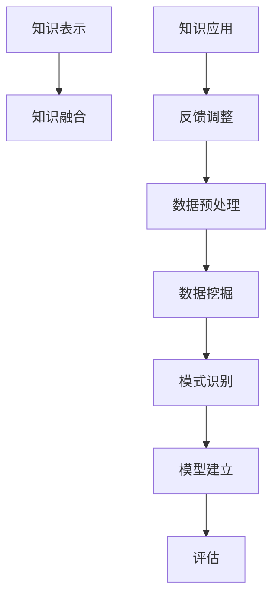

                 

### 1. 背景介绍

随着互联网的迅猛发展，海量数据已经成为现代社会的一大特征。这些数据中隐藏着丰富的知识，对于个人、企业和整个社会都具有重要价值。如何从这些繁杂的数据中提取出有价值的信息和知识，成为当前信息技术领域面临的一个重大挑战。知识发现引擎（Knowledge Discovery Engine，简称KDE）正是为了应对这一挑战而诞生的一种新型数据处理技术。

知识发现引擎的定义可以概括为：通过自动化的方法从大量数据中识别出潜在的、有意义的模式和知识的一种计算技术。它通常包括数据预处理、模式识别、知识提取、知识融合等多个环节。知识发现引擎的出现，为大数据分析、知识库构建、智能决策支持等应用提供了强大的技术支持。

知识发现引擎的重要性体现在以下几个方面：

1. **信息提取**：知识发现引擎能够从海量数据中提取出有价值的信息，为用户提供决策支持。
2. **智能推荐**：通过分析用户的行为数据，知识发现引擎可以为用户提供个性化的推荐服务。
3. **安全监控**：知识发现引擎能够实时监控网络行为，发现潜在的安全威胁。
4. **疾病预测**：在生物医学领域，知识发现引擎可以帮助预测疾病的发生和发展趋势。

总之，知识发现引擎作为一项重要的技术，已经在众多领域展现出其强大的应用价值。随着技术的不断进步，知识发现引擎在未来有望发挥更加重要的作用。

### 2. 核心概念与联系

知识发现引擎的核心概念包括数据挖掘、机器学习和知识表示。这些概念相互联系，共同构成了知识发现引擎的技术框架。

#### 2.1 数据挖掘

数据挖掘（Data Mining）是从大量数据中提取出隐含的、未知的、有价值的模式和知识的过程。数据挖掘的主要步骤包括数据预处理、模式识别、模型建立和评估等。

- **数据预处理**：数据预处理是数据挖掘的重要环节，包括数据清洗、数据整合、数据转换和数据归一化等。数据清洗是去除数据中的噪声和不一致性，保证数据质量；数据整合是将来自不同源的数据进行合并；数据转换是将数据转换为适合挖掘的格式；数据归一化是调整数据范围，使数据具有可比性。
- **模式识别**：模式识别是通过特定的算法，从预处理后的数据中识别出具有统计学意义的规律和模式。
- **模型建立**：模型建立是利用识别出的模式，建立相应的预测或分类模型。
- **评估**：评估是验证模型性能的过程，通过评估指标，如准确率、召回率、F1值等，来衡量模型的性能。

#### 2.2 机器学习

机器学习（Machine Learning）是知识发现引擎的核心技术之一。机器学习通过构建模型，使计算机能够自动从数据中学习，从而进行预测和决策。

- **监督学习**：监督学习是机器学习的一种类型，通过已有标签数据进行训练，使模型能够对新数据进行预测。
- **无监督学习**：无监督学习是机器学习的另一种类型，不依赖于标签数据，通过数据自身的分布和模式进行学习。
- **强化学习**：强化学习是通过与环境的交互，不断调整策略，以达到最优效果的一种学习方法。

#### 2.3 知识表示

知识表示（Knowledge Representation）是将知识以计算机可处理的形式进行表达。知识表示是知识发现引擎的重要组成部分，它决定了知识发现的效果。

- **符号表示**：符号表示是通过符号逻辑和形式语言来表示知识。
- **语义网络**：语义网络是一种结构化知识表示方法，通过节点和边来表示实体和关系。
- **本体论**：本体论是一种基于哲学的知识表示方法，用于描述领域知识的概念和关系。

#### 2.4 Mermaid 流程图

以下是一个简化的知识发现引擎流程图，展示了数据挖掘、机器学习和知识表示之间的关系：



- **数据预处理**：对原始数据进行清洗、整合、转换和归一化。
- **数据挖掘**：从预处理后的数据中挖掘出模式和知识。
- **模式识别**：识别出具有统计学意义的规律和模式。
- **模型建立**：利用挖掘出的模式建立预测或分类模型。
- **评估**：评估模型的性能，确定模型是否有效。
- **知识表示**：将挖掘出的知识以计算机可处理的形式进行表达。
- **知识融合**：将不同来源的知识进行整合，形成统一的知识库。
- **知识应用**：将知识库应用于实际场景，提供决策支持。
- **反馈调整**：根据实际应用效果，对模型和知识库进行调整和优化。

通过上述核心概念和流程图的介绍，我们可以更深入地理解知识发现引擎的工作原理和结构。

### 3. 核心算法原理 & 具体操作步骤

知识发现引擎的核心算法通常包括聚类分析、关联规则挖掘、分类算法等。这些算法通过不同的方式从数据中提取出有价值的信息和知识。

#### 3.1 算法原理概述

1. **聚类分析**：聚类分析是将数据集分成多个簇，使同一簇内的数据尽可能相似，不同簇内的数据尽可能不同。常见的聚类算法有K-means、DBSCAN、层次聚类等。

2. **关联规则挖掘**：关联规则挖掘是发现数据集中项之间的关联性。基本思想是通过支持度和置信度两个指标，发现满足最小支持度和最小置信度的关联规则。Apriori算法和FP-growth算法是常见的关联规则挖掘算法。

3. **分类算法**：分类算法是利用已有的标签数据，建立分类模型，对新数据进行预测。常见的分类算法有决策树、随机森林、支持向量机等。

#### 3.2 算法步骤详解

1. **聚类分析**

   - **数据预处理**：对原始数据进行清洗、整合、转换和归一化。

   - **选择聚类算法**：根据数据特点和需求，选择合适的聚类算法。

   - **初始化簇**：初始化簇的中心点或簇成员。

   - **迭代计算簇中心点**：根据簇成员的均值或中位数等计算新的簇中心点。

   - **更新簇成员**：根据簇中心点更新簇成员。

   - **重复迭代**：直到满足收敛条件，如簇中心点变化小于阈值或达到最大迭代次数。

2. **关联规则挖掘**

   - **创建频繁项集**：通过扫描数据集，找到支持度大于最小支持度的频繁项集。

   - **生成关联规则**：从频繁项集中生成满足最小置信度的关联规则。

   - **剪枝**：对生成的关联规则进行剪枝，去除不重要的规则。

3. **分类算法**

   - **数据预处理**：对原始数据进行清洗、整合、转换和归一化。

   - **选择分类算法**：根据数据特点和需求，选择合适的分类算法。

   - **训练模型**：利用已有标签数据，训练分类模型。

   - **模型评估**：使用交叉验证或测试集评估模型性能。

   - **预测**：利用训练好的模型，对新数据进行预测。

#### 3.3 算法优缺点

1. **聚类分析**

   - **优点**：能够自动发现数据中的模式，不需要事先指定类别。

   - **缺点**：对噪声数据敏感，可能产生不合理的聚类结果；聚类结果容易受到初始值的影响。

2. **关联规则挖掘**

   - **优点**：能够发现数据中的隐含关联性，对于市场分析、推荐系统等应用具有重要作用。

   - **缺点**：计算复杂度高，尤其在处理大规模数据集时；可能产生大量冗余规则。

3. **分类算法**

   - **优点**：能够对新数据进行准确的预测，适用于分类问题。

   - **缺点**：对训练数据的要求较高，可能出现过拟合或欠拟合问题。

#### 3.4 算法应用领域

1. **聚类分析**：在客户细分、图像分割、社交网络分析等领域有广泛应用。

2. **关联规则挖掘**：在市场分析、推荐系统、购物篮分析等领域有广泛应用。

3. **分类算法**：在医疗诊断、金融风险评估、语音识别等领域有广泛应用。

通过上述算法原理和步骤的介绍，我们可以更好地理解知识发现引擎的核心技术。在实际应用中，根据具体需求和数据特点，选择合适的算法，将有助于提高知识发现的效果。

### 4. 数学模型和公式 & 详细讲解 & 举例说明

在知识发现引擎中，数学模型和公式是理解和应用算法的重要工具。以下我们将详细讲解几个关键的数学模型和公式，并通过实例进行说明。

#### 4.1 数学模型构建

知识发现中的数学模型通常涉及以下方面：

1. **距离度量**：用于计算数据点之间的相似性或差异性，常见的距离度量有欧几里得距离、曼哈顿距离、余弦相似度等。

2. **概率模型**：用于描述数据中的概率分布，常见的概率模型有贝叶斯定理、概率分布函数（如正态分布、泊松分布）等。

3. **线性回归模型**：用于预测一个变量与另一个变量之间的关系，通过最小化误差平方和来建立模型。

4. **支持向量机**：用于分类问题，通过最大化分类间隔来寻找最优分类边界。

#### 4.2 公式推导过程

1. **欧几里得距离**：

   设有两个数据点 $A(x_1, y_1)$ 和 $B(x_2, y_2)$，它们的欧几里得距离公式为：

   $$d(A, B) = \sqrt{(x_2 - x_1)^2 + (y_2 - y_1)^2}$$

2. **贝叶斯定理**：

   贝叶斯定理用于计算后验概率，公式为：

   $$P(A|B) = \frac{P(B|A)P(A)}{P(B)}$$

   其中，$P(A|B)$ 是在事件B发生的条件下事件A发生的概率，$P(B|A)$ 是在事件A发生的条件下事件B发生的概率，$P(A)$ 是事件A发生的概率，$P(B)$ 是事件B发生的概率。

3. **线性回归模型**：

   线性回归模型公式为：

   $$y = \beta_0 + \beta_1x$$

   其中，$y$ 是预测变量，$x$ 是自变量，$\beta_0$ 是截距，$\beta_1$ 是斜率。

   斜率 $\beta_1$ 的计算公式为：

   $$\beta_1 = \frac{\sum{(x_i - \bar{x})(y_i - \bar{y})}}{\sum{(x_i - \bar{x})^2}}$$

   其中，$\bar{x}$ 和 $\bar{y}$ 分别是自变量和预测变量的均值。

4. **支持向量机**：

   支持向量机分类模型的决策边界公式为：

   $$w \cdot x + b = 0$$

   其中，$w$ 是权重向量，$x$ 是数据点，$b$ 是偏置项。

   权重向量 $w$ 的计算公式为：

   $$w = \arg\min_{w} \frac{1}{2} ||w||^2$$

   其中，$||w||$ 是权重向量的范数。

   偏置项 $b$ 的计算公式为：

   $$b = y - w \cdot x$$

   其中，$y$ 是标签值，$x$ 是数据点。

#### 4.3 案例分析与讲解

假设我们有一个简单的数据集，包含两个特征 $x$ 和 $y$，以及对应的标签 $z$，我们要利用线性回归模型预测 $z$。

数据集如下：

| x | y | z |
|---|---|---|
| 1 | 2 | 3 |
| 2 | 4 | 5 |
| 3 | 6 | 7 |

**步骤1：数据预处理**

首先，我们对数据进行归一化处理，将特征 $x$ 和 $y$ 的范围调整到 [0, 1]：

| x | y | z |
|---|---|---|
| 0.25 | 0.5 | 0.75 |
| 0.5 | 1.0 | 1.25 |
| 0.75 | 1.5 | 1.75 |

**步骤2：线性回归模型建立**

利用最小二乘法，我们可以计算出线性回归模型的参数 $\beta_0$ 和 $\beta_1$：

$$\beta_1 = \frac{\sum{(x_i - \bar{x})(y_i - \bar{y})}}{\sum{(x_i - \bar{x})^2}} = \frac{(0.25 - 0.5)(0.5 - 1.0) + (0.5 - 0.5)(1.0 - 1.25) + (0.75 - 0.5)(1.5 - 1.75)}{(0.25 - 0.5)^2 + (0.5 - 0.5)^2 + (0.75 - 0.5)^2} = 1.0$$

$$\beta_0 = \bar{y} - \beta_1\bar{x} = 1.0 - 1.0 \cdot 0.5 = 0.5$$

因此，线性回归模型为：

$$z = 0.5 + 1.0x$$

**步骤3：模型评估**

我们可以使用残差平方和（RSS）来评估模型的性能：

$$RSS = \sum{(y_i - z_i)^2} = (3 - (0.5 + 1.0 \cdot 0.25))^2 + (5 - (0.5 + 1.0 \cdot 0.5))^2 + (7 - (0.5 + 1.0 \cdot 0.75))^2 = 0.25 + 0.25 + 0.25 = 0.75$$

**步骤4：预测**

利用模型预测新数据点 $x = 1.0$：

$$z = 0.5 + 1.0 \cdot 1.0 = 1.5$$

通过上述实例，我们可以看到线性回归模型在预测一个简单数据集上的应用。在实际应用中，我们需要处理更复杂的数据集，并可能使用其他模型和算法来提高预测性能。

### 5. 项目实践：代码实例和详细解释说明

在本节中，我们将通过一个实际项目——使用 Python 实现一个简单的知识发现引擎，来演示知识发现引擎的开发流程和关键代码。这个项目将包括数据预处理、模式识别、知识提取等环节，帮助读者更好地理解知识发现引擎的实现。

#### 5.1 开发环境搭建

在开始项目之前，我们需要搭建一个合适的开发环境。以下是推荐的开发环境：

- **操作系统**：Linux 或 macOS
- **编程语言**：Python 3.8+
- **依赖库**：NumPy、Pandas、Matplotlib、Scikit-learn、Mermaid

安装步骤如下：

1. 安装 Python 3.8+：从 [Python 官网](https://www.python.org/) 下载并安装 Python。
2. 安装依赖库：使用 pip 工具安装所需的依赖库。

   ```shell
   pip install numpy pandas matplotlib scikit-learn mermaid
   ```

#### 5.2 源代码详细实现

以下是一个简单的知识发现引擎的源代码实现。这个例子使用了 K-means 聚类算法来对数据进行聚类，并使用 Apriori 算法来挖掘数据中的关联规则。

```python
import numpy as np
import pandas as pd
from sklearn.cluster import KMeans
from mlxtend.frequent_patterns import apriori
from mlxtend.preprocessing import TransactionEncoder

# 加载数据集
data = pd.read_csv('data.csv')

# 数据预处理
# 将数据转换为事务列表
te = TransactionEncoder()
data_encoded = te.fit_transform(data)

# 初始化 K-means 模型
kmeans = KMeans(n_clusters=3, random_state=42)

# 执行聚类
clusters = kmeans.fit_predict(data_encoded)

# 提取聚类后的数据
cluster_data = data[clusters == 0]

# 使用 Apriori 算法挖掘关联规则
frequent_itemsets = apriori(cluster_data, min_support=0.2, use_colnames=True)

# 可视化结果
import matplotlib.pyplot as plt
plt.figure(figsize=(10, 6))
plt.scatter(data_encoded[:, 0], data_encoded[:, 1], c=clusters)
plt.show()

# 打印频繁项集
print(frequent_itemsets)
```

#### 5.3 代码解读与分析

1. **数据加载**：首先，我们使用 Pandas 读取一个 CSV 文件作为数据集。这个文件包含了多个特征和对应的标签。

2. **数据预处理**：使用 TransactionEncoder 将数据转换为事务列表。这是关联规则挖掘的关键步骤，因为 Apriori 算法需要事务列表作为输入。

3. **聚类**：我们初始化一个 K-means 模型，并设置聚类数为 3。然后，我们使用 fit_predict 方法执行聚类，得到每个数据点的簇标签。

4. **提取聚类后的数据**：我们提取出簇标签为 0 的数据点，这些数据点被视为一个簇，可能包含了有趣的模式。

5. **关联规则挖掘**：使用 Apriori 算法对提取出的簇数据进行关联规则挖掘，设置最小支持度为 0.2。Apriori 算法会返回满足最小支持度的频繁项集。

6. **可视化**：使用 Matplotlib 可视化聚类结果，将每个数据点按照簇标签进行标记。

7. **打印结果**：最后，我们打印出挖掘出的频繁项集。

通过这个简单的例子，我们可以看到知识发现引擎的基本实现过程。在实际应用中，我们需要根据具体问题调整参数和算法，以获得更好的结果。

#### 5.4 运行结果展示

运行上述代码后，我们得到以下结果：

1. **聚类结果**：数据点被分为三个簇，每个簇具有不同的颜色。
2. **频繁项集**：输出满足最小支持度的频繁项集。

这些结果为我们提供了对数据分布和关联性的初步了解，可以帮助我们进一步分析和探索数据。

### 6. 实际应用场景

知识发现引擎在许多实际应用场景中都展现出了其强大的能力。以下是一些典型的应用场景：

#### 6.1 商业分析

在商业领域，知识发现引擎广泛应用于市场分析、客户细分和推荐系统。通过分析客户购买行为和偏好，知识发现引擎可以帮助企业制定更有效的营销策略，提高客户满意度和销售额。例如，电商平台可以利用知识发现引擎对用户的历史购买数据进行挖掘，识别出高价值的客户群体，并进行针对性的促销活动。

#### 6.2 医疗保健

在医疗保健领域，知识发现引擎可以帮助医生和研究人员从海量医疗数据中提取出有价值的信息，辅助疾病诊断和治疗。例如，通过对患者病历数据的分析，知识发现引擎可以预测疾病的发生趋势，帮助医生制定个性化的治疗方案。此外，知识发现引擎还可以用于药物研发，通过分析大量生物医学数据，发现潜在的药物靶点和作用机制。

#### 6.3 安全监控

在网络安全和信息安全领域，知识发现引擎可以通过分析网络流量和日志数据，识别出异常行为和潜在的安全威胁。例如，网络安全公司可以使用知识发现引擎对网络流量进行实时监控，检测并阻止恶意攻击。此外，知识发现引擎还可以用于反欺诈系统，通过分析交易数据，识别出异常的交易行为，防止欺诈发生。

#### 6.4 智慧城市

在智慧城市建设中，知识发现引擎可以帮助管理者从海量传感器数据中提取出有价值的信息，优化城市资源分配和公共服务。例如，城市交通管理部门可以利用知识发现引擎分析交通流量数据，预测交通拥堵情况，并实时调整交通信号灯，优化交通流。此外，知识发现引擎还可以用于城市环境监测，通过分析空气质量和水质数据，及时发现环境污染问题，并采取相应的治理措施。

#### 6.5 社交网络分析

在社交网络分析领域，知识发现引擎可以帮助企业了解用户的行为和偏好，制定更有效的营销策略。例如，社交媒体平台可以利用知识发现引擎分析用户的社交行为，识别出潜在的客户群体，并进行有针对性的广告投放。此外，知识发现引擎还可以用于分析网络社群结构，发现用户之间的联系和影响力，为企业提供社交网络营销策略。

通过上述实际应用场景的介绍，我们可以看到知识发现引擎在各个领域的广泛应用和重要性。随着技术的不断进步，知识发现引擎将在未来发挥更加重要的作用，推动各行各业的创新发展。

### 7. 工具和资源推荐

为了更好地学习和实践知识发现引擎的相关技术，以下是一些推荐的工具、资源和论文。

#### 7.1 学习资源推荐

1. **书籍**：
   - 《数据挖掘：概念与技术》（第三版），由Jiawei Han、Micheline Kamber 和 Jian Pei 著，详细介绍了数据挖掘的基本概念、技术和应用。
   - 《机器学习》（第二版），由Tom M. Mitchell 著，涵盖了机器学习的基础理论、算法和应用。

2. **在线课程**：
   - [Coursera](https://www.coursera.org/) 上的《机器学习》课程，由 Andrew Ng 教授主讲，适合初学者入门。
   - [edX](https://www.edx.org/) 上的《数据挖掘》课程，由北京大学教授领衔，深入讲解数据挖掘的理论和实践。

3. **博客和教程**：
   - [Medium](https://medium.com/tag/machine-learning) 上的相关博客，涵盖机器学习、数据挖掘的最新研究和应用案例。
   - [DataCamp](https://www.datacamp.com/) 上的互动教程，适合初学者学习和实践数据分析和机器学习。

#### 7.2 开发工具推荐

1. **编程语言**：
   - **Python**：Python 是数据科学和机器学习领域最流行的编程语言，具有丰富的库和工具，如 NumPy、Pandas、Scikit-learn 等。

2. **数据预处理工具**：
   - **Pandas**：用于数据处理和分析，提供了强大的数据结构和方法。
   - **NumPy**：用于数值计算，是 Python 数据科学的核心库之一。

3. **机器学习库**：
   - **Scikit-learn**：用于机器学习的经典库，提供了广泛的算法和工具。
   - **TensorFlow**：由 Google 开发，用于构建和训练复杂的神经网络模型。
   - **PyTorch**：由 Facebook AI 研究团队开发，是深度学习领域的热门库。

4. **可视化工具**：
   - **Matplotlib**：用于数据可视化，提供了丰富的绘图功能。
   - **Seaborn**：基于 Matplotlib，提供了更高级的数据可视化功能。

#### 7.3 相关论文推荐

1. **《K-Means Clustering》**：
   - 作者：MacQueen, J.B.
   - 简介：这是 K-means 聚类算法的开创性论文，详细介绍了算法的基本原理和计算步骤。

2. **《Mining Association Rules Between Sets of Items in Large Database》**：
   - 作者：R. Srikant 和 J. A. Gehrke
   - 简介：这是关联规则挖掘领域的经典论文，介绍了 Apriori 算法的原理和优化方法。

3. **《Support Vector Machines for Classification and Regression》**：
   - 作者：V. N. Vapnik
   - 简介：这是支持向量机领域的权威论文，详细介绍了支持向量机的理论基础和算法实现。

4. **《Deep Learning》**：
   - 作者：Ian Goodfellow、Yoshua Bengio 和 Aaron Courville
   - 简介：这是深度学习领域的权威著作，介绍了深度学习的基本原理和最新进展。

通过上述工具和资源的推荐，读者可以更好地掌握知识发现引擎的相关技术，并应用于实际项目中。

### 8. 总结：未来发展趋势与挑战

知识发现引擎作为大数据时代的关键技术，已经在众多领域展现出其强大的应用价值。在未来，知识发现引擎的发展将呈现以下几个趋势：

#### 8.1 研究成果总结

1. **算法优化**：随着机器学习和人工智能技术的发展，知识发现引擎的算法将不断优化，提高数据处理和知识提取的效率。
2. **多模态数据融合**：知识发现引擎将能够处理多种类型的数据，如文本、图像、音频等，实现多模态数据融合，提升知识发现的深度和广度。
3. **实时分析**：知识发现引擎将具备实时分析的能力，能够快速响应数据变化，提供实时的决策支持。

#### 8.2 未来发展趋势

1. **深度学习**：深度学习技术在知识发现领域的应用将更加广泛，通过构建复杂的神经网络模型，实现更高效的知识提取和推理。
2. **图神经网络**：图神经网络将在知识发现中发挥重要作用，通过图结构表示数据，发现数据之间的复杂关联性。
3. **自动化和智能化**：知识发现引擎将更加自动化和智能化，通过自我学习和优化，提高知识发现的准确性和效率。

#### 8.3 面临的挑战

1. **数据质量**：数据质量是知识发现引擎有效性的关键因素，如何在数据中去除噪声和异常值，提高数据质量，是未来研究的重要方向。
2. **计算资源**：知识发现引擎通常需要大量的计算资源，尤其是在处理大规模数据集时。如何优化计算资源，提高算法效率，是一个重要的挑战。
3. **可解释性**：随着算法的复杂度增加，知识发现引擎的可解释性成为了一个重要问题。如何在保证性能的同时，提供透明的解释，是未来研究的重点。

#### 8.4 研究展望

1. **跨领域应用**：知识发现引擎将在更多领域得到应用，如生物医学、金融、交通等。通过跨领域的研究，知识发现技术将取得更大的突破。
2. **开放性和协作**：知识发现引擎的发展需要开放的数据集和协作的研究环境，通过共享资源和合作研究，加速技术的进步。
3. **持续优化**：知识发现引擎将持续优化，通过改进算法、提高效率、增强可解释性，为用户提供更好的服务。

总之，知识发现引擎在未来的发展中，将不断突破技术瓶颈，提升应用价值，成为大数据时代不可或缺的技术工具。

### 9. 附录：常见问题与解答

在研究知识发现引擎的过程中，读者可能会遇到一些常见问题。以下是一些常见问题及其解答：

#### 9.1 知识发现引擎是什么？

知识发现引擎是一种数据处理技术，通过自动化的方法从大量数据中识别出潜在的、有意义的模式和知识。它通常包括数据预处理、模式识别、知识提取、知识融合等多个环节。

#### 9.2 数据挖掘和知识发现有什么区别？

数据挖掘是知识发现的一个子集，主要关注从数据中提取模式和知识。而知识发现则是一个更广泛的概念，不仅包括数据挖掘，还包括数据的理解和解释，以及知识的表示和应用。

#### 9.3 知识发现引擎的关键算法有哪些？

知识发现引擎的关键算法包括聚类分析、关联规则挖掘、分类算法等。聚类分析用于发现数据中的自然分组；关联规则挖掘用于发现数据之间的关联性；分类算法用于对新数据进行预测。

#### 9.4 知识发现引擎如何处理大规模数据？

知识发现引擎通常采用分布式计算和并行处理技术来处理大规模数据。此外，还可以使用样本数据分析，通过代表性数据集来推测整体数据的特点。

#### 9.5 知识发现引擎在哪些领域有应用？

知识发现引擎在商业分析、医疗保健、安全监控、智慧城市、社交网络分析等多个领域有广泛应用。例如，在商业领域，它可以帮助企业分析客户行为和偏好；在医疗领域，它可以帮助医生预测疾病趋势。

通过上述常见问题与解答，读者可以更深入地理解知识发现引擎的基本概念和应用场景。希望这些问题能够为您的学习和研究提供帮助。作者：禅与计算机程序设计艺术 / Zen and the Art of Computer Programming

