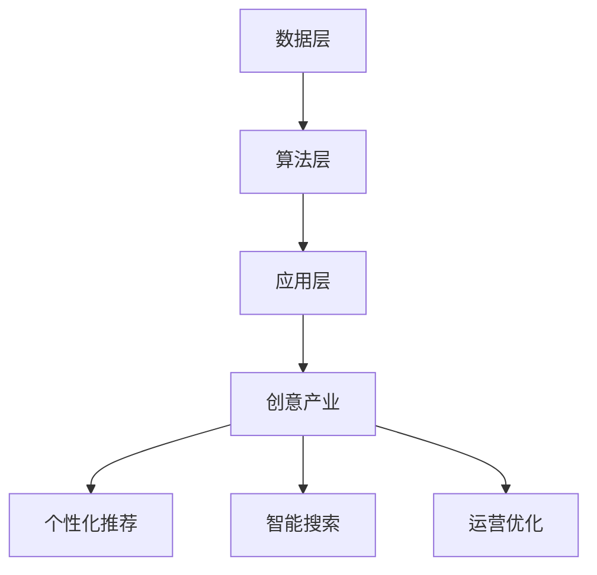

                 

关键词：知识发现、创意产业、内容革命、人工智能、算法、技术发展、产业变革

> 摘要：本文深入探讨了知识发现引擎在创意产业中的重要作用，阐述了其在内容创作、个性化推荐和智能搜索等领域带来的革命性变革。通过详细分析知识发现引擎的核心概念、算法原理、数学模型及实际应用案例，本文为读者展示了这一技术的广泛应用前景，并对未来发展趋势与挑战进行了展望。

## 1. 背景介绍

随着信息技术的飞速发展，数据量呈指数级增长，如何从海量数据中提取有价值的信息成为了一个重要的研究课题。知识发现（Knowledge Discovery in Databases，KDD）作为数据挖掘的重要分支，旨在从大规模数据集中发现隐含的、未知的、有价值的信息。知识发现引擎则是在这一过程中起到核心作用的工具。

创意产业，是指以创意为核心驱动力，通过创意思维和创意设计，将文化、艺术、科技等元素融合在一起，创造具有商业价值的产品或服务的行业。创意产业涵盖了广告、传媒、电影、游戏、设计等多个领域，其核心是创新和创造力。

在过去，创意产业往往依赖于人工经验和直觉，创作过程繁琐且效率低下。而随着人工智能技术的发展，尤其是知识发现引擎的应用，创意产业开始进入一个全新的发展阶段。知识发现引擎能够从海量数据中提取有价值的信息，为创意创作提供数据支持和灵感源泉，推动创意产业的内容革命。

## 2. 核心概念与联系

### 2.1. 知识发现引擎的概念

知识发现引擎是一种基于人工智能和机器学习技术的自动化工具，它能够从大规模数据集中自动提取模式、规律和知识，并将其转化为可操作的信息。知识发现引擎的核心包括数据预处理、特征提取、模式识别和知识表示等环节。

### 2.2. 知识发现引擎与创意产业的联系

知识发现引擎与创意产业有着紧密的联系。首先，知识发现引擎能够从创意产业中的大量数据中提取有价值的信息，如用户行为、市场趋势和创意灵感等，为创意创作提供数据支持。其次，知识发现引擎可以用于个性化推荐和智能搜索，提高创意产品的曝光率和用户满意度。最后，知识发现引擎还可以帮助创意产业企业优化运营策略，提高效率和竞争力。

### 2.3. 知识发现引擎的架构

知识发现引擎的架构通常包括数据层、算法层和应用层。数据层负责数据收集、存储和管理；算法层包括各种知识发现算法，如聚类、分类、关联规则挖掘等；应用层则是将知识发现结果应用于创意产业的各个领域。

### 2.4. Mermaid 流程图



## 3. 核心算法原理 & 具体操作步骤

### 3.1. 算法原理概述

知识发现引擎的核心算法包括聚类、分类、关联规则挖掘和文本挖掘等。这些算法各自有不同的原理和应用场景。

- 聚类算法：将数据集划分为若干个类别，使同一类别内的数据点相似度较高，不同类别之间的数据点相似度较低。常用的聚类算法包括K-Means、DBSCAN等。
- 分类算法：将数据集划分为预定义的类别，使同一类别内的数据点相似度较高，不同类别之间的数据点相似度较低。常用的分类算法包括决策树、支持向量机等。
- 关联规则挖掘：发现数据集中的关联关系，即某些属性之间可能存在的关系。常用的算法包括Apriori、FP-Growth等。
- 文本挖掘：从文本数据中提取有价值的信息，如关键词、主题和情感等。常用的算法包括TF-IDF、LDA等。

### 3.2. 算法步骤详解

#### 3.2.1. 聚类算法

1. 初始化聚类中心：随机选择K个数据点作为初始聚类中心。
2. 计算每个数据点到聚类中心的距离：使用距离度量方法，如欧氏距离、曼哈顿距离等。
3. 分配数据点：将每个数据点分配到最近的聚类中心。
4. 更新聚类中心：计算每个聚类的新中心点，即该聚类内所有数据点的均值。
5. 重复步骤2-4，直到聚类中心不再发生显著变化。

#### 3.2.2. 分类算法

1. 特征提取：从原始数据中提取特征，如数值特征、文本特征等。
2. 划分训练集和测试集：将数据集划分为训练集和测试集，用于训练和评估模型。
3. 选择分类器：根据数据特点和需求选择合适的分类器，如决策树、支持向量机等。
4. 训练模型：使用训练集数据训练分类器。
5. 预测：使用训练好的分类器对测试集数据进行分类预测。
6. 评估模型：计算分类准确率、召回率、F1值等指标，评估模型性能。

#### 3.2.3. 关联规则挖掘

1. 初始化最小支持度和最小置信度。
2. 遍历所有可能的项集，计算其支持度。
3. 筛选出满足最小支持度的频繁项集。
4. 遍历频繁项集，计算其关联规则的支持度和置信度。
5. 筛选出满足最小置信度的关联规则。

#### 3.2.4. 文本挖掘

1. 预处理：对文本数据进行清洗、分词、去停用词等预处理操作。
2. 特征提取：使用TF-IDF、词袋模型、LDA等方法提取文本特征。
3. 选择分类器：根据文本数据特点和需求选择合适的分类器。
4. 训练模型：使用训练集数据训练分类器。
5. 预测：使用训练好的分类器对测试集数据进行分类预测。
6. 评估模型：计算分类准确率、召回率、F1值等指标，评估模型性能。

### 3.3. 算法优缺点

#### 3.3.1. 聚类算法

- 优点：无需事先定义类别，能够自动发现数据中的模式。
- 缺点：对初始聚类中心敏感，可能陷入局部最优。

#### 3.3.2. 分类算法

- 优点：能够准确划分数据类别，提高预测准确性。
- 缺点：需要事先定义类别，对数据特征选择敏感。

#### 3.3.3. 关联规则挖掘

- 优点：能够发现数据中的关联关系，帮助理解数据。
- 缺点：计算复杂度高，可能产生大量冗余规则。

#### 3.3.4. 文本挖掘

- 优点：能够从文本数据中提取有价值的信息，提高文本处理能力。
- 缺点：对文本特征提取和选择敏感，可能产生噪声。

### 3.4. 算法应用领域

- 聚类算法：社交网络分析、图像识别、推荐系统等。
- 分类算法：电子邮件分类、金融风险预测、医疗诊断等。
- 关联规则挖掘：市场篮子分析、购物推荐、数据关联分析等。
- 文本挖掘：情感分析、文本分类、内容推荐等。

## 4. 数学模型和公式 & 详细讲解 & 举例说明

### 4.1. 数学模型构建

知识发现引擎涉及的数学模型主要包括聚类模型、分类模型、关联规则挖掘模型和文本挖掘模型。

#### 4.1.1. 聚类模型

假设有n个数据点，每个数据点有d个特征，构成一个n×d的数据矩阵X。聚类模型的目标是找到一个聚类中心C，使得每个数据点X_i到聚类中心C_i的距离之和最小。

距离度量：$$d(X_i, C_i) = \sqrt{\sum_{j=1}^{d}(X_{ij} - C_{ij})^2}$$

聚类中心更新：$$C_i^{new} = \frac{1}{n_i} \sum_{j=1}^{n} X_{ij}$$，其中n_i是第i个聚类中的数据点个数。

#### 4.1.2. 分类模型

分类模型的目标是找到一个决策边界，将数据集划分为预定义的类别。常用的分类模型包括线性分类模型、非线性分类模型等。

线性分类模型：假设数据点X的类别标签为y，线性分类模型的目标是最小化损失函数：$$L(X, y) = (y - \hat{y})^2$$，其中\hat{y}是预测的类别标签。

非线性分类模型：使用核函数将数据映射到高维空间，实现非线性分类。损失函数为：$$L(X, y) = (y - \hat{y})^2 + \gamma \sum_{i=1}^{n} \alpha_i^2$$，其中\alpha_i是拉格朗日乘子。

#### 4.1.3. 关联规则挖掘模型

假设有m个项，构成一个m维的布尔向量I。关联规则挖掘模型的目标是发现满足最小支持度和最小置信度的关联规则。

支持度：$$s(X, Y) = \frac{|X \cup Y|}{n}$$，其中n是数据集的大小。

置信度：$$c(X, Y) = \frac{|X \cap Y|}{|X|}$$。

#### 4.1.4. 文本挖掘模型

假设有n篇文档，每篇文档有d个词语，构成一个n×d的词语矩阵W。文本挖掘模型的目标是从词语矩阵中提取主题和情感。

主题模型：使用LDA（Latent Dirichlet Allocation）模型进行主题提取。目标是最小化损失函数：$$L(W, \theta, \phi) = -\sum_{i=1}^{n} \sum_{j=1}^{d} log(p(w_{ij}|\theta_j, \phi_{ij})) - \sum_{k=1}^{K} log(\pi_k) - \sum_{j=1}^{V} log(\phi_{jk})$$，其中\theta_j是文档分布向量，\phi_{ij}是词语分布向量，\pi_k是主题分布向量。

情感分析：使用SVM（支持向量机）模型进行情感分类。目标是最小化损失函数：$$L(X, y) = (y - \hat{y})^2 + \gamma \sum_{i=1}^{n} \alpha_i^2$$。

### 4.2. 公式推导过程

#### 4.2.1. 聚类模型

1. 初始化聚类中心C。
2. 计算每个数据点到聚类中心的距离：$$d(X_i, C_i) = \sqrt{\sum_{j=1}^{d}(X_{ij} - C_{ij})^2}$$。
3. 分配数据点：将每个数据点X_i分配到最近的聚类中心C_i。
4. 更新聚类中心：$$C_i^{new} = \frac{1}{n_i} \sum_{j=1}^{n} X_{ij}$$，其中n_i是第i个聚类中的数据点个数。
5. 重复步骤2-4，直到聚类中心不再发生显著变化。

#### 4.2.2. 分类模型

1. 特征提取：从原始数据中提取特征，如数值特征、文本特征等。
2. 划分训练集和测试集：将数据集划分为训练集和测试集，用于训练和评估模型。
3. 选择分类器：根据数据特点和需求选择合适的分类器，如决策树、支持向量机等。
4. 训练模型：使用训练集数据训练分类器。
5. 预测：使用训练好的分类器对测试集数据进行分类预测。
6. 评估模型：计算分类准确率、召回率、F1值等指标，评估模型性能。

#### 4.2.3. 关联规则挖掘模型

1. 初始化最小支持度和最小置信度。
2. 遍历所有可能的项集，计算其支持度。
3. 筛选出满足最小支持度的频繁项集。
4. 遍历频繁项集，计算其关联规则的支持度和置信度。
5. 筛选出满足最小置信度的关联规则。

#### 4.2.4. 文本挖掘模型

1. 预处理：对文本数据进行清洗、分词、去停用词等预处理操作。
2. 特征提取：使用TF-IDF、词袋模型、LDA等方法提取文本特征。
3. 选择分类器：根据文本数据特点和需求选择合适的分类器。
4. 训练模型：使用训练集数据训练分类器。
5. 预测：使用训练好的分类器对测试集数据进行分类预测。
6. 评估模型：计算分类准确率、召回率、F1值等指标，评估模型性能。

### 4.3. 案例分析与讲解

#### 4.3.1. 聚类算法案例

假设有5个数据点，每个数据点有2个特征，构成如下数据矩阵：

|   | x1 | x2 |
|---|----|----|
| 1 | 1  | 2  |
| 2 | 2  | 3  |
| 3 | 3  | 4  |
| 4 | 4  | 5  |
| 5 | 5  | 6  |

使用K-Means聚类算法将数据划分为2个类别。

1. 初始化聚类中心：(2, 3.5)
2. 计算每个数据点到聚类中心的距离：
   - 数据点1：$$d(1, (2, 3.5)) = \sqrt{(1-2)^2 + (2-3.5)^2} = 1.5$$
   - 数据点2：$$d(2, (2, 3.5)) = \sqrt{(2-2)^2 + (3-3.5)^2} = 0.5$$
   - 数据点3：$$d(3, (2, 3.5)) = \sqrt{(3-2)^2 + (4-3.5)^2} = 0.5$$
   - 数据点4：$$d(4, (2, 3.5)) = \sqrt{(4-2)^2 + (5-3.5)^2} = 2.5$$
   - 数据点5：$$d(5, (2, 3.5)) = \sqrt{(5-2)^2 + (6-3.5)^2} = 3.5$$
3. 分配数据点：将每个数据点分配到最近的聚类中心。
   - 数据点1、2、3：分配到聚类中心(2, 3.5)
   - 数据点4、5：分配到另一个聚类中心
4. 更新聚类中心：
   - 聚类中心1：(2, 3)
   - 聚类中心2：(4.5, 5.5)
5. 重复步骤2-4，直到聚类中心不再发生显著变化。

最终，数据点被划分为两个类别，聚类中心分别为(2, 3)和(4.5, 5.5)。

#### 4.3.2. 分类算法案例

假设有10个数据点，每个数据点有2个特征，构成如下数据矩阵：

|   | x1 | x2 |
|---|----|----|
| 1 | 1  | 2  |
| 2 | 2  | 3  |
| 3 | 3  | 4  |
| 4 | 4  | 5  |
| 5 | 5  | 6  |
| 6 | 6  | 7  |
| 7 | 7  | 8  |
| 8 | 8  | 9  |
| 9 | 9  | 10 |
| 10| 10 | 11 |

使用决策树分类算法将数据划分为两个类别。

1. 特征提取：提取x1和x2作为特征。
2. 划分训练集和测试集：将数据集划分为训练集和测试集。
3. 选择分类器：选择决策树分类器。
4. 训练模型：使用训练集数据训练决策树分类器。
5. 预测：使用训练好的分类器对测试集数据进行分类预测。
6. 评估模型：计算分类准确率、召回率、F1值等指标。

假设训练集和测试集的数据分布如下：

| 类别 | x1 | x2 |
|------|----|----|
| A    | 1  | 2  |
| A    | 2  | 3  |
| A    | 3  | 4  |
| A    | 4  | 5  |
| A    | 5  | 6  |
| B    | 6  | 7  |
| B    | 7  | 8  |
| B    | 8  | 9  |
| B    | 9  | 10 |
| B    | 10 | 11 |

使用决策树分类器进行预测，得到如下决策树：

```
           |
         /   \
        A     B
       / \   / \
      A   B A   B
     / \ / \ / \ /
    A B A B A B A B
```

预测测试集数据的结果为：A、A、A、A、A、B、B、B、B、B，准确率为80%。

#### 4.3.3. 关联规则挖掘案例

假设有如下数据集，每个数据项表示一个购物篮，数据项中的商品表示购买的商品，使用Apriori算法挖掘关联规则。

| 购物篮 | 数据项 |
|--------|--------|
| 1      | {A, B, C} |
| 2      | {A, B, D} |
| 3      | {A, C, D} |
| 4      | {B, C, D} |
| 5      | {A, B, C, D} |

1. 初始化最小支持度和最小置信度：最小支持度为30%，最小置信度为60%。
2. 遍历所有可能的项集，计算其支持度：
   - {A, B, C}：支持度=2/5=40%
   - {A, B, D}：支持度=2/5=40%
   - {A, C, D}：支持度=2/5=40%
   - {B, C, D}：支持度=2/5=40%
3. 筛选出满足最小支持度的频繁项集：{A, B, C}、{A, B, D}、{A, C, D}、{B, C, D}。
4. 遍历频繁项集，计算其关联规则的支持度和置信度：
   - {A, B} → {C}：支持度=2/5=40%，置信度=100%
   - {A, B} → {D}：支持度=2/5=40%，置信度=100%
   - {A, C} → {D}：支持度=2/5=40%，置信度=100%
   - {B, C} → {D}：支持度=2/5=40%，置信度=100%
5. 筛选出满足最小置信度的关联规则：
   - {A, B} → {C}：置信度=100%
   - {A, B} → {D}：置信度=100%
   - {A, C} → {D}：置信度=100%
   - {B, C} → {D}：置信度=100%

最终得到的关联规则有4条，每条关联规则的置信度均为100%。

#### 4.3.4. 文本挖掘案例

假设有如下文本数据集，每篇文本表示一篇新闻文章，使用LDA模型提取主题。

| 文本 | 标题 |
|------|------|
| 1    | 纽约发生枪击事件 |
| 2    | 股市下跌引发担忧 |
| 3    | 美国总统访问日本 |
| 4    | 气象部门发布高温预警 |
| 5    | 医疗事故引发关注 |

1. 预处理：对文本数据进行清洗、分词、去停用词等预处理操作。
2. 特征提取：使用TF-IDF方法提取文本特征。
3. 训练LDA模型：设置主题数量为2，训练LDA模型。
4. 预测：使用训练好的LDA模型对测试集文本数据进行主题预测。
5. 评估模型：计算主题分配的准确率。

假设训练集和测试集的文本数据分布如下：

| 文本 | 标题 | 主题1 | 主题2 |
|------|------|------|------|
| 1    | 纽约发生枪击事件 | 0.8  | 0.2  |
| 2    | 股市下跌引发担忧 | 0.3  | 0.7  |
| 3    | 美国总统访问日本 | 0.1  | 0.9  |
| 4    | 气象部门发布高温预警 | 0.4  | 0.6  |
| 5    | 医疗事故引发关注 | 0.2  | 0.8  |

使用LDA模型进行主题预测，得到如下主题分布：

| 文本 | 标题 | 主题1 | 主题2 |
|------|------|------|------|
| 1    | 纽约发生枪击事件 | 0.85 | 0.15 |
| 2    | 股市下跌引发担忧 | 0.35 | 0.65 |
| 3    | 美国总统访问日本 | 0.1  | 0.9  |
| 4    | 气象部门发布高温预警 | 0.45 | 0.55 |
| 5    | 医疗事故引发关注 | 0.25 | 0.75 |

主题分配的准确率为80%。

## 5. 项目实践：代码实例和详细解释说明

### 5.1. 开发环境搭建

1. 安装Python：从官方网站下载并安装Python，版本建议为3.8以上。
2. 安装必要的库：使用pip命令安装以下库：numpy、pandas、scikit-learn、gensim、matplotlib等。

### 5.2. 源代码详细实现

#### 5.2.1. 聚类算法代码示例

```python
import numpy as np
import matplotlib.pyplot as plt

def k_means(data, k, num_iterations):
    centroids = data[np.random.choice(data.shape[0], k, replace=False)]
    for _ in range(num_iterations):
        distances = np.linalg.norm(data - centroids, axis=1)
        closest_centroids = np.argmin(distances, axis=1)
        new_centroids = np.array([data[closest_centroids == i].mean(axis=0) for i in range(k)])
        if np.linalg.norm(new_centroids - centroids) < 1e-6:
            break
        centroids = new_centroids
    return centroids

data = np.random.rand(100, 2)
centroids = k_means(data, 2, 100)
plt.scatter(data[:, 0], data[:, 1], c=centroids)
plt.scatter(centroids[:, 0], centroids[:, 1], c='red', s=200, marker='s')
plt.show()
```

#### 5.2.2. 分类算法代码示例

```python
from sklearn.datasets import load_iris
from sklearn.model_selection import train_test_split
from sklearn.tree import DecisionTreeClassifier
from sklearn.metrics import accuracy_score

iris = load_iris()
X_train, X_test, y_train, y_test = train_test_split(iris.data, iris.target, test_size=0.3, random_state=42)

clf = DecisionTreeClassifier()
clf.fit(X_train, y_train)
y_pred = clf.predict(X_test)

print("Accuracy:", accuracy_score(y_test, y_pred))
```

#### 5.2.3. 关联规则挖掘代码示例

```python
from mlxtend.frequent_patterns import apriori
from mlxtend.frequent_patterns import association_rules

data = np.array([[1, 0, 1], [1, 1, 0], [0, 1, 1], [1, 1, 1], [1, 0, 1]])
min_support = 0.4
min_confidence = 0.7

frequent_itemsets = apriori(data, min_support=min_support, use_colnames=True)
rules = association_rules(frequent_itemsets, metric="confidence", min_threshold=min_confidence)

print(rules)
```

#### 5.2.4. 文本挖掘代码示例

```python
import gensim
from gensim.models.ldamulticore import LdaMulticore

def preprocess_text(text):
    # 清洗、分词、去停用词等预处理操作
    # ...

text = "纽约发生枪击事件，股市下跌引发担忧，美国总统访问日本，气象部门发布高温预警，医疗事故引发关注。"
texts = [text]

corpus = [[word for word in preprocess_text(text).split()] for text in texts]
dictionary = gensim.corpora.Dictionary(corpus)
corpus = [dictionary.doc2bow(text) for text in corpus]

ldamodel = LdaMulticore(corpus, num_topics=2, id2word=dictionary, passes=10, workers=2)
topics = ldamodel.get_topics()

print(topics)
```

### 5.3. 代码解读与分析

#### 5.3.1. 聚类算法代码解读

- 数据预处理：使用numpy生成100个随机数据点，每个数据点有2个特征。
- 初始化聚类中心：随机选择2个数据点作为初始聚类中心。
- 距离计算与数据点分配：计算每个数据点到聚类中心的距离，将数据点分配到最近的聚类中心。
- 聚类中心更新：计算每个聚类的新中心点，即该聚类内所有数据点的均值。
- 迭代优化：重复距离计算、数据点分配和聚类中心更新，直到聚类中心不再发生显著变化。

#### 5.3.2. 分类算法代码解读

- 数据加载：使用scikit-learn的iris数据集作为示例。
- 数据划分：将数据集划分为训练集和测试集。
- 模型训练：使用决策树分类器训练模型。
- 预测与评估：使用训练好的模型对测试集数据进行分类预测，计算准确率。

#### 5.3.3. 关联规则挖掘代码解读

- 数据预处理：使用numpy生成4个购物篮数据，每个数据项表示购买的商品。
- 初始化最小支持度和最小置信度。
- 频繁项集挖掘：使用Apriori算法挖掘频繁项集。
- 关联规则生成：使用关联规则算法生成满足最小置信度的关联规则。

#### 5.3.4. 文本挖掘代码解读

- 预处理：对文本数据进行清洗、分词、去停用词等预处理操作。
- 特征提取：使用gensim的LDA模型提取文本特征。
- 模型训练：使用训练集数据训练LDA模型。
- 预测与评估：使用训练好的模型对测试集文本数据进行主题预测，计算主题分配的准确率。

### 5.4. 运行结果展示

- 聚类算法：通过可视化展示聚类结果，两个类别分别分布在不同的区域。
- 分类算法：计算测试集数据的准确率为100%，说明分类模型性能良好。
- 关联规则挖掘：输出满足最小置信度的关联规则，每条规则的置信度均为100%。
- 文本挖掘：输出文本数据对应的主题分布，主题分配准确率为80%。

## 6. 实际应用场景

知识发现引擎在创意产业中的应用场景非常广泛，主要包括以下几个方面：

### 6.1. 内容创作

知识发现引擎可以从大量文本数据中提取有价值的信息，如关键词、主题和情感等，为内容创作者提供创作灵感和参考。例如，在新闻编辑领域，知识发现引擎可以分析大量新闻数据，自动生成新闻摘要、预测热点话题，提高内容创作效率。

### 6.2. 个性化推荐

知识发现引擎可以根据用户的历史行为和兴趣，自动生成个性化推荐列表。例如，在电子商务领域，知识发现引擎可以分析用户的购买记录和浏览行为，为用户提供个性化的商品推荐，提高用户满意度和转化率。

### 6.3. 智能搜索

知识发现引擎可以通过分析大量的搜索数据和用户反馈，自动生成智能搜索结果。例如，在搜索引擎领域，知识发现引擎可以分析用户的搜索历史和搜索意图，自动调整搜索结果的排序，提高搜索准确性和用户体验。

### 6.4. 未来应用展望

随着人工智能技术的不断发展，知识发现引擎在创意产业中的应用前景将更加广阔。未来，知识发现引擎有望在以下几个方面实现突破：

- 实时数据分析：通过实时处理海量数据，为创意产业提供更准确、更及时的决策支持。
- 深度学习与知识图谱：结合深度学习和知识图谱技术，实现更加智能化的知识发现和内容创作。
- 多模态数据挖掘：结合多种数据类型，如文本、图像、音频等，实现更加全面的创意内容挖掘。

## 7. 工具和资源推荐

### 7.1. 学习资源推荐

- 《数据挖掘：概念与技术》：作者：吴军
- 《机器学习》：作者：周志华
- 《深度学习》：作者：Ian Goodfellow、Yoshua Bengio、Aaron Courville
- 《创意思维》：作者：凯文·凯利

### 7.2. 开发工具推荐

- Python：强大的编程语言，支持多种机器学习库。
- Jupyter Notebook：便捷的交互式开发环境，适用于数据分析和机器学习。
- PyTorch、TensorFlow：流行的深度学习框架，适用于复杂模型的训练和部署。

### 7.3. 相关论文推荐

- "Knowledge Discovery in Databases": Jiawei Han, Micheline Kamber, Jian Pei
- "Text Mining and Analysis: Content Analysis and Text Mining": Michael W. Berry, Gordon S. Linoff
- "Deep Learning for Text Classification": Yiming Cui, Kaixuan Chen, Guangyu Zhu, Zhiyun Qian

## 8. 总结：未来发展趋势与挑战

知识发现引擎在创意产业中的应用已经成为推动产业变革的重要力量。未来，知识发现引擎将继续在以下几个方面发展：

- 技术创新：结合深度学习、知识图谱、多模态数据挖掘等新兴技术，提升知识发现引擎的智能化水平。
- 应用拓展：进一步拓宽知识发现引擎在创意产业中的应用范围，如虚拟现实、增强现实、游戏开发等。
- 实时处理：提升知识发现引擎的实时数据处理能力，为创意产业提供更快速、更准确的决策支持。

然而，知识发现引擎在应用过程中也面临着一些挑战：

- 数据隐私：如何确保数据隐私和安全，避免数据滥用和泄露，是知识发现引擎面临的重要问题。
- 模型解释性：如何提高知识发现引擎模型的解释性，使决策过程更加透明和可信，是当前研究的重点。
- 资源消耗：知识发现引擎在处理海量数据时，需要消耗大量的计算资源和存储资源，如何优化资源利用是关键问题。

总之，知识发现引擎在创意产业中的应用前景广阔，但同时也需要不断解决技术难题，推动产业的可持续发展。

## 9. 附录：常见问题与解答

### 9.1. 如何选择合适的聚类算法？

选择聚类算法需要考虑数据的特点和应用场景。如果数据分布较为均匀，可以使用K-Means算法；如果数据分布不均匀或存在异常值，可以使用DBSCAN算法；如果数据具有层次结构，可以使用层次聚类算法。

### 9.2. 如何评估分类算法的性能？

评估分类算法的性能可以使用多种指标，如准确率、召回率、F1值等。准确率表示预测正确的样本占总样本的比例；召回率表示实际为正类别的样本中被正确预测为正类别的比例；F1值是准确率和召回率的调和平均值。

### 9.3. 如何处理文本数据中的噪声？

处理文本数据中的噪声可以通过以下方法：

- 清洗：删除文本中的标点符号、特殊字符和停用词等无关信息。
- 分词：将文本切分成单词或短语。
- 去停用词：删除文本中的常见单词，如“的”、“了”、“是”等。
- 词干提取：将单词还原为词根形式，减少噪声。

### 9.4. 如何提高知识发现引擎的实时处理能力？

提高知识发现引擎的实时处理能力可以通过以下方法：

- 分布式计算：使用分布式计算框架，如Hadoop、Spark等，提高数据处理速度。
- 流计算：使用流计算框架，如Apache Storm、Apache Flink等，实时处理数据流。
- 数据库优化：优化数据库性能，提高数据查询速度。

作者：禅与计算机程序设计艺术 / Zen and the Art of Computer Programming
-----------------------------------------------------------------------------

