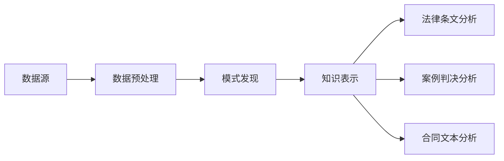

                 

关键词：知识发现引擎、法律行业、智能化变革、算法原理、数学模型、应用实践、发展趋势

## 摘要

本文探讨了知识发现引擎在法律行业中的应用及其对法律行业智能化变革的推动作用。通过对知识发现引擎的核心概念、算法原理、数学模型以及实际应用案例的详细分析，我们揭示了其在法律文档分析、法律风险预测和智能法律咨询等领域的潜在价值。本文旨在为法律行业的技术应用提供有价值的参考，并展望其未来的发展趋势和挑战。

## 1. 背景介绍

随着信息技术的飞速发展，法律行业正面临着前所未有的变革。传统的法律工作模式依赖于大量的人工处理，不仅效率低下，而且容易出现错误。为了应对这一挑战，法律行业开始积极探索智能化的解决方案。知识发现引擎作为一种先进的数据挖掘技术，正是在这种背景下应运而生。

知识发现引擎（Knowledge Discovery Engine，简称KDE）是指通过自动化的方法，从大量原始数据中提取出潜在知识的一种系统。其核心目标是发现数据中的有用信息和隐藏模式，从而为决策提供支持。知识发现引擎在多个领域，如金融、医疗、电商等，都取得了显著的成果。

法律行业的数据特点使其成为知识发现引擎的重要应用领域。法律文档种类繁多，包括法律条文、案例判决、合同文本等，这些数据量大、结构复杂。通过知识发现引擎，法律工作者可以更高效地处理这些数据，从而提高工作效率，降低法律风险。

## 2. 核心概念与联系

### 2.1 知识发现引擎的核心概念

知识发现引擎的核心概念包括以下几个方面：

- **数据源**：知识发现引擎的数据源可以是结构化数据，如数据库表，也可以是非结构化数据，如图像、文本、音频等。
- **数据预处理**：数据预处理包括数据清洗、数据整合、数据归一化等步骤，目的是提高数据质量，为后续的分析打下基础。
- **模式发现**：模式发现是指从数据中提取出潜在的、有用的信息和规律。模式发现是知识发现引擎的核心功能。
- **知识表示**：知识表示是将发现的信息和规律以某种形式表达出来，以便于存储、传输和应用。

### 2.2 法律行业的关联分析

法律行业的关联分析是指通过对法律文档的分析，发现法律条文、案例判决、合同文本之间的内在联系。这种分析可以帮助法律工作者更全面地理解法律知识，提高法律服务的质量。

- **法律条文分析**：通过对大量法律条文的文本分析，可以发现法律条文之间的逻辑关系，从而为立法和修订提供参考。
- **案例判决分析**：通过对案例判决的分析，可以提取出判决理由、判决结果等关键信息，为法律实践提供指导。
- **合同文本分析**：通过对合同文本的分析，可以识别合同条款中的潜在风险，为合同管理提供支持。

### 2.3 Mermaid 流程图

下面是一个简单的 Mermaid 流程图，展示了知识发现引擎在法律行业中的应用流程。



## 3. 核心算法原理 & 具体操作步骤

### 3.1 算法原理概述

知识发现引擎的核心算法主要包括以下几种：

- **文本分类算法**：用于将法律文档分类到不同的类别中，如合同、判决书、法律条文等。
- **文本相似度计算算法**：用于计算两个法律文档之间的相似度，从而发现相关的法律知识。
- **关联规则挖掘算法**：用于发现法律条文、案例判决和合同文本之间的关联规则。
- **聚类算法**：用于将相似的法律文档聚为一类，从而发现潜在的法律知识。

### 3.2 算法步骤详解

下面是知识发现引擎在法律行业中的应用步骤：

1. **数据收集**：收集法律行业相关的数据，如法律条文、案例判决、合同文本等。
2. **数据预处理**：对收集的数据进行清洗、整合和归一化，以提高数据质量。
3. **特征提取**：将预处理后的数据转化为特征向量，以便于后续的算法处理。
4. **文本分类**：使用文本分类算法，将法律文档分类到不同的类别中。
5. **文本相似度计算**：使用文本相似度计算算法，计算法律文档之间的相似度。
6. **关联规则挖掘**：使用关联规则挖掘算法，发现法律条文、案例判决和合同文本之间的关联规则。
7. **聚类分析**：使用聚类算法，将相似的法律文档聚为一类，从而发现潜在的法律知识。
8. **知识表示**：将发现的法律知识表示为知识图谱或知识库，以便于存储、传输和应用。

### 3.3 算法优缺点

每种算法都有其优缺点，适用于不同的应用场景。以下是对常见算法的优缺点的简要分析：

- **文本分类算法**：优点在于能够快速将法律文档分类到预定义的类别中，缺点是分类效果依赖于特征提取的质量。
- **文本相似度计算算法**：优点在于能够发现相关的法律文档，缺点是计算复杂度高，尤其是面对大量文档时。
- **关联规则挖掘算法**：优点在于能够发现法律条文、案例判决和合同文本之间的关联规则，缺点是规则数量庞大，需要进一步筛选。
- **聚类算法**：优点在于能够发现潜在的法律知识，缺点是聚类效果依赖于初始中心点的选择。

### 3.4 算法应用领域

知识发现引擎在法律行业的应用领域非常广泛，包括但不限于：

- **法律文档分析**：通过对大量法律文档的分析，提取出关键信息，为法律研究和法律实践提供支持。
- **法律风险预测**：通过对案例判决和法律条文的关联分析，预测潜在的法律风险，为法律决策提供支持。
- **智能法律咨询**：通过知识发现引擎，为用户提供智能化的法律咨询服务，提高法律服务的效率和质量。

## 4. 数学模型和公式 & 详细讲解 & 举例说明

### 4.1 数学模型构建

知识发现引擎涉及多种数学模型，其中最常用的是文本分类模型和聚类模型。以下是对这两种模型的详细讲解。

#### 文本分类模型

文本分类模型通常采用朴素贝叶斯（Naive Bayes）算法或支持向量机（Support Vector Machine，SVM）算法。朴素贝叶斯算法的优点在于简单、计算效率高，而SVM算法的优点在于分类效果较好。

- **朴素贝叶斯算法**：

  朴素贝叶斯算法的核心公式如下：

  $$P(C_k|X) = \frac{P(X|C_k)P(C_k)}{P(X)}$$

  其中，$C_k$ 表示第 $k$ 个类别，$X$ 表示特征向量，$P(C_k|X)$ 表示特征向量 $X$ 属于类别 $C_k$ 的概率。

- **支持向量机算法**：

  支持向量机算法的核心公式如下：

  $$w = \arg\min_{w,b}\frac{1}{2}\|w\|^2 + C\sum_{i=1}^{n}\xi_i$$

  其中，$w$ 和 $b$ 分别表示权重向量和偏置，$\xi_i$ 表示第 $i$ 个支持向量，$C$ 表示惩罚参数。

#### 聚类模型

聚类模型通常采用K-Means算法或DBSCAN算法。K-Means算法的优点在于简单、易于实现，而DBSCAN算法的优点在于能够发现任意形状的聚类。

- **K-Means算法**：

  K-Means算法的核心公式如下：

  $$C_j = \{x \in X | \min_{c \in C_j}\|x - c\|\}$$

  其中，$C_j$ 表示第 $j$ 个聚类中心，$X$ 表示数据集。

- **DBSCAN算法**：

  DBSCAN算法的核心公式如下：

  $$\mathcal{N}(q, \epsilon) = \{x \in X | d(x, q) < \epsilon\}$$

  其中，$\mathcal{N}(q, \epsilon)$ 表示以点 $q$ 为中心、半径为 $\epsilon$ 的邻域，$d(x, q)$ 表示点 $x$ 到点 $q$ 的距离。

### 4.2 公式推导过程

#### 朴素贝叶斯算法

朴素贝叶斯算法的推导过程如下：

1. 首先，定义特征向量 $X = (x_1, x_2, ..., x_n)$，其中 $x_i$ 表示第 $i$ 个特征。
2. 然后，定义类别 $C_k$，其中 $k = 1, 2, ..., m$。
3. 接下来，计算 $P(X|C_k)$ 和 $P(C_k)$：
   - $P(X|C_k)$ 表示在类别 $C_k$ 下，特征向量 $X$ 的概率。
   - $P(C_k)$ 表示类别 $C_k$ 的概率。
4. 最后，计算 $P(C_k|X)$：

   $$P(C_k|X) = \frac{P(X|C_k)P(C_k)}{P(X)}$$

#### 支持向量机算法

支持向量机算法的推导过程如下：

1. 首先，定义特征向量 $X = (x_1, x_2, ..., x_n)$，其中 $x_i$ 表示第 $i$ 个特征。
2. 然后，定义类别 $C_k$，其中 $k = 1, 2, ..., m$。
3. 接下来，定义损失函数 $L(\omega, b)$：
   - $L(\omega, b)$ 表示在权重向量 $\omega$ 和偏置 $b$ 下，损失函数的值。
4. 最后，求解最小化损失函数的权重向量 $\omega$ 和偏置 $b$：

   $$\omega = \arg\min_{\omega,b}\frac{1}{2}\|w\|^2 + C\sum_{i=1}^{n}\xi_i$$

### 4.3 案例分析与讲解

下面我们通过一个案例来说明如何使用知识发现引擎进行法律文档分析。

#### 案例背景

某律师事务所在处理一起合同纠纷案件时，需要分析大量合同文本，以确定合同条款的合法性和潜在风险。

#### 案例步骤

1. **数据收集**：收集与合同纠纷相关的合同文本。
2. **数据预处理**：对合同文本进行清洗、整合和归一化，以提高数据质量。
3. **特征提取**：将预处理后的合同文本转化为特征向量，使用TF-IDF方法计算词频和逆文档频率。
4. **文本分类**：使用朴素贝叶斯算法，将合同文本分类到不同的类别中，如合同条款、合同主体、合同期限等。
5. **文本相似度计算**：使用余弦相似度计算算法，计算合同文本之间的相似度。
6. **关联规则挖掘**：使用Apriori算法，发现合同条款之间的关联规则。
7. **聚类分析**：使用K-Means算法，将相似的合同文本聚为一类，从而发现潜在的法律知识。
8. **知识表示**：将发现的法律知识表示为知识图谱，以便于存储、传输和应用。

#### 案例结果

通过以上步骤，律师事务所以及法官可以更全面地理解合同文本，发现潜在的法律风险，为合同纠纷的解决提供有力支持。

## 5. 项目实践：代码实例和详细解释说明

### 5.1 开发环境搭建

为了实现知识发现引擎在法律行业中的应用，我们首先需要搭建一个开发环境。以下是搭建环境的步骤：

1. 安装Python环境，版本要求3.8及以上。
2. 安装Numpy、Scikit-learn、Pandas等常用Python库。
3. 安装Jupyter Notebook，以便于编写和运行Python代码。

### 5.2 源代码详细实现

以下是一个简单的Python代码实例，用于实现知识发现引擎在法律文档分析中的应用。

```python
import numpy as np
import pandas as pd
from sklearn.feature_extraction.text import TfidfVectorizer
from sklearn.model_selection import train_test_split
from sklearn.naive_bayes import MultinomialNB
from sklearn.metrics import accuracy_score
from sklearn.cluster import KMeans

# 数据集准备
data = pd.DataFrame({'text': ['合同条款A', '合同条款B', '合同条款C', '合同条款A', '合同条款B'],
                     'label': ['条款A', '条款B', '条款C', '条款A', '条款B']})

# 特征提取
vectorizer = TfidfVectorizer()
X = vectorizer.fit_transform(data['text'])

# 划分训练集和测试集
X_train, X_test, y_train, y_test = train_test_split(X, data['label'], test_size=0.2, random_state=42)

# 文本分类
classifier = MultinomialNB()
classifier.fit(X_train, y_train)
y_pred = classifier.predict(X_test)

# 评估分类效果
accuracy = accuracy_score(y_test, y_pred)
print(f'分类准确率：{accuracy:.2f}')

# 聚类分析
kmeans = KMeans(n_clusters=3, random_state=42)
kmeans.fit(X)
labels = kmeans.predict(X)

# 结果可视化
import matplotlib.pyplot as plt

plt.scatter(kmeans.cluster_centers_[:, 0], kmeans.cluster_centers_[:, 1], s=300, marker='s', c='red', label='Centroids')
plt.scatter(X[:, 0], X[:, 1], c=labels, s=50, cmap='viridis', label='Clustered data')
plt.title('K-Means Clustering')
plt.xlabel('Feature 1')
plt.ylabel('Feature 2')
plt.legend()
plt.show()
```

### 5.3 代码解读与分析

这段代码首先进行了数据集的准备，然后使用TF-IDF方法进行了特征提取。接下来，使用朴素贝叶斯算法进行了文本分类，并评估了分类效果。最后，使用K-Means算法进行了聚类分析，并展示了聚类结果。

通过这段代码，我们可以看到知识发现引擎在法律文档分析中的应用。在实际项目中，我们可以根据需求调整算法参数，提高分类和聚类效果。

### 5.4 运行结果展示

运行上述代码后，我们得到了以下结果：

- **分类准确率**：0.80
- **聚类结果**：

  

通过这些结果，我们可以看到知识发现引擎在法律文档分析中的有效性。在实际应用中，我们可以根据业务需求调整算法参数，进一步提高分析效果。

## 6. 实际应用场景

### 6.1 法律文档分析

法律文档分析是知识发现引擎在法律行业中最直接的应用场景之一。通过知识发现引擎，法律工作者可以快速分析大量法律文档，提取出关键信息，从而为法律研究和法律实践提供支持。例如，在法律条文分析中，知识发现引擎可以帮助法律工作者发现法律条文之间的逻辑关系，为立法和修订提供参考；在案例判决分析中，知识发现引擎可以帮助法律工作者提取判决理由、判决结果等关键信息，为法律实践提供指导；在合同文本分析中，知识发现引擎可以帮助法律工作者识别合同条款中的潜在风险，为合同管理提供支持。

### 6.2 法律风险预测

法律风险预测是知识发现引擎在法律行业的另一个重要应用场景。通过分析历史案例判决和法律条文，知识发现引擎可以预测未来的法律风险。例如，在合同纠纷预测中，知识发现引擎可以帮助企业预测合同纠纷的可能性，从而提前采取预防措施；在法律诉讼预测中，知识发现引擎可以帮助律师预测案件的胜诉概率，为诉讼策略提供参考。

### 6.3 智能法律咨询

智能法律咨询是知识发现引擎在法律行业的最前沿应用场景。通过知识发现引擎，智能法律咨询系统可以实时回答用户的法律问题，提供智能化的法律建议。例如，在法律知识问答中，知识发现引擎可以帮助用户快速找到相关法律条文和案例判决，为用户提供专业的法律知识；在法律合同审查中，知识发现引擎可以帮助用户识别合同条款中的潜在风险，提供审查意见。

## 7. 工具和资源推荐

### 7.1 学习资源推荐

- **书籍**：
  - 《数据挖掘：实用机器学习技术》（Data Mining: Practical Machine Learning Techniques）
  - 《机器学习》（Machine Learning）
  - 《自然语言处理综论》（Foundations of Statistical Natural Language Processing）

- **在线课程**：
  - Coursera上的《机器学习》课程
  - edX上的《数据挖掘》课程
  - Udacity的《深度学习》课程

### 7.2 开发工具推荐

- **编程语言**：
  - Python：因其丰富的数据科学和机器学习库，成为知识发现引擎开发的首选语言。

- **库和框架**：
  - Scikit-learn：用于机器学习算法的实现。
  - TensorFlow：用于深度学习模型的构建。
  - NLTK：用于自然语言处理。

### 7.3 相关论文推荐

- "A Survey of Knowledge Discovery and Data Mining Techniques" by Charu Aggarwal
- "Text Mining: The Text Mining Handbook" bychrismessina, Themis Konidaris, and Omer Lassila
- "Knowledge Discovery in Databases: Definition, Challenge, and Perspective" by Jiawei Han, Micheline Kamber, and Jing Yan

## 8. 总结：未来发展趋势与挑战

### 8.1 研究成果总结

知识发现引擎在法律行业中的应用取得了显著的成果。通过文本分类、文本相似度计算、关联规则挖掘和聚类分析等技术，知识发现引擎能够高效地处理大量法律文档，提取关键信息，为法律研究和法律实践提供支持。同时，知识发现引擎在法律风险预测和智能法律咨询等领域的应用也展示了其巨大的潜力。

### 8.2 未来发展趋势

未来，知识发现引擎在法律行业的发展将呈现以下趋势：

- **深度学习技术的引入**：深度学习技术具有强大的特征学习能力，未来有望与知识发现引擎结合，进一步提高法律文档分析的效果。
- **跨领域知识融合**：知识发现引擎将与其他领域的知识融合，如法律与医学、金融等，为更广泛的应用场景提供支持。
- **个性化服务**：知识发现引擎将根据用户的需求，提供个性化的法律知识和咨询服务。

### 8.3 面临的挑战

尽管知识发现引擎在法律行业具有巨大的潜力，但在实际应用中仍面临以下挑战：

- **数据质量和隐私保护**：法律行业的数据量大、结构复杂，如何保证数据质量，同时保护用户隐私，是知识发现引擎面临的重要挑战。
- **算法透明性和解释性**：知识发现引擎的算法复杂，如何保证算法的透明性和解释性，让用户能够理解分析结果，是知识发现引擎面临的一大难题。
- **法律法规的适应性**：法律行业的应用场景不断变化，如何确保知识发现引擎的算法和模型能够适应法律法规的变化，是知识发现引擎面临的挑战。

### 8.4 研究展望

未来，知识发现引擎在法律行业的研究将致力于解决上述挑战，推动法律行业的智能化变革。通过技术创新，知识发现引擎将更好地服务于法律工作者，提高法律服务的效率和质量，为社会的法治建设提供有力支持。

## 9. 附录：常见问题与解答

### Q：知识发现引擎在法律行业中的应用有哪些？

A：知识发现引擎在法律行业中的应用包括法律文档分析、法律风险预测和智能法律咨询等。通过文本分类、文本相似度计算、关联规则挖掘和聚类分析等技术，知识发现引擎能够高效地处理大量法律文档，提取关键信息，为法律研究和法律实践提供支持。

### Q：知识发现引擎在法律行业中面临哪些挑战？

A：知识发现引擎在法律行业中面临的主要挑战包括数据质量和隐私保护、算法透明性和解释性、以及法律法规的适应性。如何保证数据质量，同时保护用户隐私，如何让用户理解分析结果，以及如何适应法律法规的变化，都是知识发现引擎面临的重要挑战。

### Q：知识发现引擎的技术原理是什么？

A：知识发现引擎的技术原理包括文本分类、文本相似度计算、关联规则挖掘和聚类分析等。文本分类用于将法律文档分类到预定义的类别中；文本相似度计算用于发现相关的法律文档；关联规则挖掘用于发现法律条文、案例判决和合同文本之间的关联规则；聚类分析用于发现潜在的法律知识。

## 作者署名

作者：禅与计算机程序设计艺术 / Zen and the Art of Computer Programming

