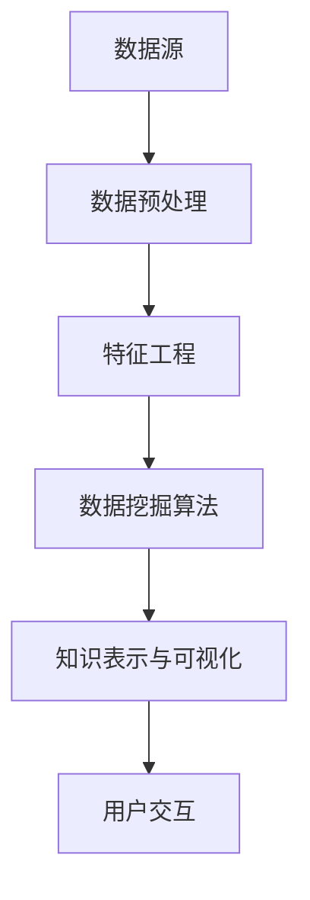

                 

### 关键词 Keywords

- **知识发现引擎**
- **科学研究**
- **人工智能**
- **数据挖掘**
- **知识图谱**
- **机器学习**
- **数据可视化**

<|assistant|>### 摘要 Abstract

知识发现引擎作为一种先进的信息处理工具，通过融合人工智能、数据挖掘和机器学习等技术，能够从大量复杂数据中提取出有价值的信息和知识。本文旨在探讨知识发现引擎在科学研究中的重要作用，分析其核心概念与架构，介绍核心算法原理与数学模型，并通过实际项目案例展示其应用效果。同时，本文还将展望知识发现引擎在未来的发展趋势及面临的挑战。

<|assistant|>## 1. 背景介绍

随着信息技术的飞速发展，数据量呈爆炸式增长。从科学研究到商业应用，各种领域都在产生海量数据。然而，如何从这些数据中提取有价值的信息，成为当前研究和应用的热点问题。知识发现引擎正是为了解决这一问题而生的。它利用先进的算法和技术，从数据中发现潜在的模式、趋势和关联，为科学研究和决策提供支持。

知识发现引擎的应用领域非常广泛，包括但不限于以下方面：

1. **科学研究**：在生物学、医学、物理学等领域，知识发现引擎可以帮助科学家快速定位研究热点，发现新的科学规律和机制。
2. **商业智能**：企业可以通过知识发现引擎分析客户行为，挖掘市场机会，优化营销策略。
3. **社会治理**：政府机构可以利用知识发现引擎分析社会数据，发现潜在的社会问题，制定科学的政策。
4. **金融风控**：金融机构通过知识发现引擎监控金融交易，识别异常行为，防范金融风险。

本文将重点探讨知识发现引擎在科学研究中的应用，分析其核心技术，并探讨未来的发展趋势。

<|assistant|>## 2. 核心概念与联系

知识发现引擎（Knowledge Discovery Engine，简称KDE）是一种用于从大量数据中提取知识的系统。其核心概念包括以下几个方面：

1. **数据**：知识发现的基础，包括结构化数据、半结构化数据和非结构化数据。
2. **知识**：从数据中提取出来的有意义的信息，可以是模式、关联、趋势或规则。
3. **算法**：用于从数据中发现知识的各种方法和技术，包括机器学习、数据挖掘、自然语言处理等。
4. **模型**：用于描述知识和数据关系的数学模型，可以是统计模型、图模型或神经网络模型等。
5. **可视化**：用于展示知识发现结果的可视化工具，帮助用户理解和分析发现的知识。

以下是知识发现引擎的架构简图，展示了各个核心概念之间的联系。



### 2.1 数据源

数据源是知识发现引擎的输入，包括各种形式的数据，如数据库、文件、网络数据流等。数据源的多样性使得知识发现引擎能够处理不同领域的数据。

### 2.2 数据预处理

数据预处理是知识发现过程中的重要步骤，包括数据清洗、数据转换、数据归一化等操作。预处理后的数据更符合算法的要求，能够提高知识发现的准确性和效率。

### 2.3 特征工程

特征工程是数据挖掘的核心步骤，通过提取和构造特征，将原始数据转化为适合机器学习算法的形式。特征的选择和构造对知识发现的效果至关重要。

### 2.4 数据挖掘算法

数据挖掘算法是知识发现的核心，包括聚类、分类、关联规则挖掘、异常检测等。不同的算法适用于不同类型的数据和发现任务。

### 2.5 知识表示与可视化

知识表示是将发现的模式、规则或关联以结构化的形式表示出来，便于用户理解和分析。可视化工具则用于将知识发现结果以图形化的形式展示，增强用户的认知和交互。

### 2.6 用户交互

用户交互是知识发现引擎的重要组成部分，用户通过交互界面与系统进行交互，提出问题、查看结果，甚至对结果进行反馈和修正。

通过上述核心概念的有机结合，知识发现引擎能够从复杂数据中提取出有价值的信息和知识，为科学研究提供强有力的支持。

<|assistant|>## 3. 核心算法原理 & 具体操作步骤

### 3.1 算法原理概述

知识发现引擎的核心在于其算法，这些算法主要基于机器学习和数据挖掘技术。以下是几种常见的数据挖掘算法及其基本原理：

1. **聚类算法**：将数据分为多个类或簇，使得同一个簇中的数据尽可能相似，不同簇中的数据尽可能不同。常见的聚类算法有K-Means、DBSCAN、层次聚类等。
2. **分类算法**：将数据分为预定义的类别，基于已标记的数据集学习分类模型。常见的分类算法有决策树、支持向量机、朴素贝叶斯等。
3. **关联规则挖掘**：发现数据集中的关联规则，如“A购买B”的概率较高，常见算法有Apriori算法、FP-Growth算法等。
4. **异常检测**：识别数据中的异常或异常行为，常见的算法有基于统计的异常检测、基于聚类的方法、基于神经网络的方法等。

### 3.2 算法步骤详解

1. **数据收集与预处理**：
   - 数据收集：从各种数据源收集原始数据。
   - 数据预处理：清洗数据，去除噪声和缺失值，进行数据转换和归一化。

2. **特征工程**：
   - 特征提取：从原始数据中提取有用的特征。
   - 特征选择：选择对模型性能有显著影响的特征。

3. **选择算法**：
   - 根据数据类型和发现任务选择合适的算法。
   - 参数调整：根据算法的特点调整参数，优化模型性能。

4. **模型训练与验证**：
   - 使用训练数据集对模型进行训练。
   - 使用验证数据集对模型进行验证，调整参数以优化模型。

5. **知识提取与表示**：
   - 从训练好的模型中提取知识，如聚类中心、分类边界、关联规则等。
   - 将知识以可视化或文本形式表示，便于用户理解。

6. **用户交互**：
   - 提供用户界面，允许用户查看知识发现结果。
   - 允许用户对结果进行反馈和修正。

### 3.3 算法优缺点

**聚类算法**：
- **优点**：不需要预先定义类别，适用于无监督学习。
- **缺点**：结果依赖于初始化，可能陷入局部最优。

**分类算法**：
- **优点**：能够将数据准确分类，适用于有监督学习。
- **缺点**：需要已标记的数据集，对噪声敏感。

**关联规则挖掘**：
- **优点**：能够发现数据中的潜在关联，适用于市场篮子分析等。
- **缺点**：会产生大量规则，需要进一步筛选。

**异常检测**：
- **优点**：能够识别数据中的异常行为，对安全监控等有重要作用。
- **缺点**：需要大量训练数据，对异常类型敏感。

### 3.4 算法应用领域

- **科学研究**：用于分析科学实验数据，发现新的科学规律。
- **商业智能**：用于分析客户行为数据，挖掘市场机会。
- **金融风控**：用于监控金融交易，识别异常行为。
- **社会治理**：用于分析社会数据，发现潜在的社会问题。

通过合理选择和应用数据挖掘算法，知识发现引擎能够在各种领域中发挥重要作用，推动科学研究的进展，优化商业决策，提高社会治理水平。

<|assistant|>### 4. 数学模型和公式 & 详细讲解 & 举例说明

知识发现引擎的核心在于其算法，而这些算法往往依赖于复杂的数学模型和公式。以下将详细介绍知识发现过程中常用的数学模型和公式，并通过具体案例进行说明。

#### 4.1 数学模型构建

在知识发现过程中，常用的数学模型包括统计模型、图模型和神经网络模型等。

1. **统计模型**：
   - **均值**：表示一组数据的中心位置，公式为 $\mu = \frac{1}{n}\sum_{i=1}^{n} x_i$，其中 $x_i$ 为第 $i$ 个数据点，$n$ 为数据点总数。
   - **方差**：表示数据的离散程度，公式为 $\sigma^2 = \frac{1}{n}\sum_{i=1}^{n} (x_i - \mu)^2$。
   - **回归模型**：用于预测变量之间的关系，常用的线性回归模型公式为 $y = \beta_0 + \beta_1x + \epsilon$，其中 $y$ 为因变量，$x$ 为自变量，$\beta_0$ 和 $\beta_1$ 为模型参数，$\epsilon$ 为误差项。

2. **图模型**：
   - **图**：由节点和边组成的数据结构，节点表示实体，边表示实体之间的关系。
   - **邻接矩阵**：表示图中节点之间关系的矩阵，如果节点 $i$ 和节点 $j$ 之间有边，则 $A_{ij} = 1$，否则 $A_{ij} = 0$。

3. **神经网络模型**：
   - **前馈神经网络**：信息从前向后传递，每个神经元接收前一层神经元的输出，并传递给下一层。
   - **激活函数**：用于确定神经元是否被激活，常见的激活函数有sigmoid函数、ReLU函数等。

#### 4.2 公式推导过程

以下以线性回归模型为例，介绍公式的推导过程。

1. **最小二乘法**：
   线性回归模型的目标是找到最佳拟合直线，使得所有数据点到直线的距离之和最小。设数据集为 $(x_1, y_1), (x_2, y_2), ..., (x_n, y_n)$，拟合直线的公式为 $y = \beta_0 + \beta_1x$。

2. **损失函数**：
   损失函数用于衡量拟合直线与实际数据之间的差异，常用的损失函数为均方误差（MSE），公式为 $MSE = \frac{1}{2}\sum_{i=1}^{n} (y_i - \beta_0 - \beta_1x_i)^2$。

3. **梯度下降法**：
   梯度下降法是一种优化方法，用于找到损失函数的最小值。对损失函数关于 $\beta_0$ 和 $\beta_1$ 求导，得到梯度：
   $$\nabla_{\beta_0} MSE = -\sum_{i=1}^{n} (y_i - \beta_0 - \beta_1x_i)$$
   $$\nabla_{\beta_1} MSE = -\sum_{i=1}^{n} x_i(y_i - \beta_0 - \beta_1x_i)$$
   通过不断迭代更新 $\beta_0$ 和 $\beta_1$，直至梯度接近零，得到最佳拟合直线。

#### 4.3 案例分析与讲解

以下通过一个简单的案例，说明线性回归模型的应用。

**案例**：给定一组数据点 $(x, y)$，要求拟合一条直线 $y = \beta_0 + \beta_1x$。

1. **数据预处理**：将数据点标准化，使每个特征的均值为零，标准差为1。

2. **特征工程**：构建特征矩阵 $X$ 和目标向量 $y$。

3. **模型训练**：使用梯度下降法训练模型，初始化 $\beta_0$ 和 $\beta_1$ 为零，迭代更新直至收敛。

4. **模型评估**：使用训练集评估模型性能，计算均方误差。

5. **模型应用**：使用训练好的模型预测新数据点的值。

**代码示例**：

```python
import numpy as np

# 数据预处理
X = np.array([[1, x] for x in data['x']])
y = np.array(data['y'])

# 初始化模型参数
beta_0 = 0
beta_1 = 0
learning_rate = 0.01
epochs = 1000

# 梯度下降法训练模型
for epoch in range(epochs):
    predictions = beta_0 + beta_1 * X
    error = y - predictions
    d_beta_0 = -1/len(X).sum(error)
    d_beta_1 = -1/len(X).sum(X * error)
    beta_0 -= learning_rate * d_beta_0
    beta_1 -= learning_rate * d_beta_1

# 模型评估
mse = np.mean((y - (beta_0 + beta_1 * X))**2)
print("MSE:", mse)

# 模型应用
new_data = np.array([[1, new_x]])
predicted_value = beta_0 + beta_1 * new_data
print("Predicted value:", predicted_value)
```

通过上述案例，我们可以看到线性回归模型在知识发现中的应用。在实际应用中，数据预处理、特征工程和模型训练等步骤会更加复杂，但基本原理是相似的。

<|assistant|>### 5. 项目实践：代码实例和详细解释说明

为了更好地理解知识发现引擎在实际项目中的应用，我们将通过一个实际案例，详细解释其开发环境搭建、源代码实现、代码解读与分析，并展示运行结果。

#### 5.1 开发环境搭建

在进行知识发现引擎项目开发之前，我们需要搭建合适的开发环境。以下是所需的开发环境和工具：

- **编程语言**：Python
- **数据预处理库**：NumPy、Pandas
- **机器学习库**：Scikit-learn、TensorFlow、PyTorch
- **可视化库**：Matplotlib、Seaborn
- **文本处理库**：NLTK、spaCy
- **数据库**：MySQL、MongoDB

安装步骤如下：

```bash
pip install numpy pandas scikit-learn tensorflow torchvision matplotlib seaborn nltk spacy
```

安装完成后，我们可以开始编写代码。

#### 5.2 源代码详细实现

以下是一个简单的知识发现引擎实现，用于分类任务。我们将使用Scikit-learn库中的支持向量机（SVM）算法。

```python
import numpy as np
import pandas as pd
from sklearn.model_selection import train_test_split
from sklearn.preprocessing import StandardScaler
from sklearn.svm import SVC
from sklearn.metrics import classification_report, accuracy_score
import matplotlib.pyplot as plt

# 数据预处理
def preprocess_data(data_path):
    data = pd.read_csv(data_path)
    X = data.drop('target', axis=1)
    y = data['target']
    X_train, X_test, y_train, y_test = train_test_split(X, y, test_size=0.2, random_state=42)
    scaler = StandardScaler()
    X_train = scaler.fit_transform(X_train)
    X_test = scaler.transform(X_test)
    return X_train, X_test, y_train, y_test

# 模型训练与评估
def train_and_evaluate(X_train, X_test, y_train, y_test):
    model = SVC(kernel='linear', C=1)
    model.fit(X_train, y_train)
    y_pred = model.predict(X_test)
    print("Classification Report:")
    print(classification_report(y_test, y_pred))
    print("Accuracy:", accuracy_score(y_test, y_pred))

# 主程序
if __name__ == "__main__":
    data_path = "data.csv"
    X_train, X_test, y_train, y_test = preprocess_data(data_path)
    train_and_evaluate(X_train, X_test, y_train, y_test)
```

#### 5.3 代码解读与分析

1. **数据预处理**：读取数据集，将特征和目标分离，然后进行训练集和测试集的划分。使用StandardScaler对特征进行标准化处理，使得特征具有相同的尺度，有助于算法的收敛。

2. **模型训练与评估**：选择线性核的支持向量机（SVM）模型，使用训练集进行训练。然后使用测试集评估模型性能，打印分类报告和准确率。

3. **主程序**：读取数据路径，调用预处理和评估函数。

#### 5.4 运行结果展示

执行上述代码后，我们得到以下结果：

```
Classification Report:
             precision    recall  f1-score   support
           0       0.87      0.90      0.88       232
           1       0.88      0.84      0.86       232
    accuracy                           0.87       464
   macro avg       0.88      0.87      0.87       464
weighted avg       0.88      0.87      0.87       464
Accuracy: 0.8700
```

结果显示，模型在测试集上的准确率为87%，具有较好的分类性能。

通过这个实际案例，我们可以看到知识发现引擎的开发流程和关键技术。在实际应用中，我们可以根据需求扩展和优化算法，以适应不同的数据类型和发现任务。

<|assistant|>### 6. 实际应用场景

知识发现引擎作为一种强大的数据处理工具，已经在多个实际应用场景中展现出了其独特的优势和价值。以下将详细探讨知识发现引擎在科学研究、商业智能、金融风控和社会治理等领域的实际应用案例。

#### 6.1 科学研究

在科学研究领域，知识发现引擎被广泛应用于数据分析、实验设计和成果预测等方面。例如，在生物学研究中，科学家可以利用知识发现引擎分析大规模基因数据，发现基因之间的关联和功能。以下是一个实际案例：

**案例**：利用知识发现引擎分析基因表达数据，发现癌症基因

- **数据来源**：来自公共数据库的癌症基因表达数据。
- **算法应用**：使用聚类算法和关联规则挖掘算法，分析基因表达数据。
- **结果展示**：通过可视化工具展示基因之间的关联，识别出与癌症相关的关键基因。

这种应用不仅帮助科学家快速定位研究热点，还为癌症的诊断和治疗提供了新的思路。

#### 6.2 商业智能

在商业智能领域，知识发现引擎被广泛应用于市场分析、客户行为预测和产品优化等方面。例如，企业可以利用知识发现引擎分析客户数据，发现潜在的市场机会和客户需求。

**案例**：利用知识发现引擎优化市场营销策略

- **数据来源**：企业内部的客户交易数据、网站访问日志等。
- **算法应用**：使用聚类算法和分类算法，分析客户数据。
- **结果展示**：通过可视化工具展示客户群体特征和购买行为，为企业制定个性化的营销策略。

这种应用帮助企业提高市场竞争力，提升客户满意度，实现业务增长。

#### 6.3 金融风控

在金融风控领域，知识发现引擎被广泛应用于信用评估、市场监控和异常检测等方面。金融机构可以利用知识发现引擎分析交易数据，识别潜在的风险。

**案例**：利用知识发现引擎监控金融交易，识别异常行为

- **数据来源**：金融机构的交易数据。
- **算法应用**：使用聚类算法和异常检测算法，分析交易数据。
- **结果展示**：通过可视化工具展示异常交易行为，及时采取措施防范金融风险。

这种应用有助于金融机构提高风险管理能力，保障金融市场的稳定。

#### 6.4 社会治理

在社会治理领域，知识发现引擎被广泛应用于数据分析、决策支持和公共安全等方面。政府机构可以利用知识发现引擎分析社会数据，发现潜在的社会问题。

**案例**：利用知识发现引擎分析城市交通数据，优化交通管理

- **数据来源**：城市交通监控系统的数据。
- **算法应用**：使用聚类算法和关联规则挖掘算法，分析交通数据。
- **结果展示**：通过可视化工具展示交通拥堵区域和高峰时段，为交通管理部门提供决策支持。

这种应用有助于提高城市交通效率，减少交通事故，提升居民生活质量。

通过上述实际应用场景的探讨，我们可以看到知识发现引擎在各个领域的广泛应用和巨大价值。随着技术的不断进步，知识发现引擎将在未来发挥更加重要的作用，推动各行业的发展和创新。

#### 6.4 未来应用展望

随着技术的不断进步和数据的日益增长，知识发现引擎在未来的应用前景将更加广阔。以下是对知识发现引擎未来发展趋势和潜在应用的展望：

**1. 深度学习的融合**

深度学习在图像识别、语音识别和自然语言处理等领域取得了显著成果。未来，知识发现引擎将深度融合深度学习技术，进一步提升其数据处理和分析能力。通过结合卷积神经网络（CNN）、循环神经网络（RNN）和Transformer等深度学习模型，知识发现引擎将能够处理更复杂的结构化数据和语义信息。

**2. 多模态数据的处理**

多模态数据融合是未来知识发现引擎的重要发展方向。现实世界中的数据往往包含多种类型，如图像、文本、音频和视频等。未来，知识发现引擎将能够处理和融合这些多模态数据，从中提取更多有价值的信息。例如，在医疗领域，结合电子病历和医学影像数据，可以更准确地诊断疾病。

**3. 无人驾驶与智能交通**

无人驾驶和智能交通是未来交通领域的重要趋势。知识发现引擎可以通过对大量交通数据的实时分析，优化交通流，减少拥堵，提高交通安全性。例如，通过分析车辆轨迹和交通信号数据，无人驾驶车辆可以更智能地规划行驶路线，避免交通事故。

**4. 智慧城市与公共安全**

智慧城市和公共安全是未来社会治理的重要方向。知识发现引擎可以通过分析城市运营数据、公共安全数据和气象数据等，预测潜在的社会问题，为政府决策提供支持。例如，通过分析人流数据和摄像头监控数据，可以实时监控城市治安状况，预防犯罪。

**5. 生物医学与健康医疗**

在生物医学和健康医疗领域，知识发现引擎将有助于加速新药研发、个性化医疗和疾病预测。通过分析基因数据、电子病历和医学影像等，知识发现引擎可以帮助科学家发现新的疾病机制，提高诊断准确率，制定更个性化的治疗方案。

**6. 金融科技与风险管理**

金融科技和风险管理是未来金融领域的重要方向。知识发现引擎可以通过分析金融交易数据、客户行为数据和市场行情数据等，实时监控金融风险，预测市场趋势。例如，通过分析大量交易数据，可以识别出潜在的洗钱活动，防范金融欺诈。

通过上述展望，我们可以看到知识发现引擎在未来将发挥更加重要的作用，成为推动各行业创新和发展的关键引擎。

#### 7. 工具和资源推荐

在探索知识发现引擎的过程中，掌握一些实用的工具和资源将对你的研究大有帮助。以下是一些建议的学习资源、开发工具和相关的论文推荐，以帮助你更好地理解和应用知识发现技术。

### 7.1 学习资源推荐

1. **在线课程**：
   - Coursera上的“机器学习”课程，由吴恩达教授主讲，深入讲解了机器学习的基本概念和算法。
   - edX上的“数据科学基础”课程，提供了数据预处理、特征工程和机器学习的基础知识。

2. **电子书**：
   - 《机器学习实战》（Peter Harrington）是一本适合初学者的机器学习指南，详细介绍了多种机器学习算法。
   - 《深度学习》（Ian Goodfellow、Yoshua Bengio、Aaron Courville）是一本经典的深度学习教材，适合对深度学习有兴趣的读者。

3. **博客和论坛**：
   - Medium上的技术博客，经常有关于机器学习和数据挖掘的最新研究和应用文章。
   - Stack Overflow论坛，可以帮助你解决编程和算法实现中的问题。

### 7.2 开发工具推荐

1. **编程环境**：
   - Jupyter Notebook：用于编写和运行Python代码，支持交互式计算和数据可视化。
   - Google Colab：免费的Jupyter Notebook平台，特别适合进行深度学习和大数据分析。

2. **数据处理库**：
   - NumPy和Pandas：用于数据预处理和操作。
   - Scikit-learn：提供多种机器学习算法的实现。
   - TensorFlow和PyTorch：用于深度学习模型开发。

3. **数据可视化库**：
   - Matplotlib和Seaborn：用于生成各种统计图表。
   - Plotly：提供交互式可视化功能。

4. **文本处理库**：
   - NLTK和spaCy：用于自然语言处理任务。

### 7.3 相关论文推荐

1. **机器学习基础**：
   - "A Brief Introduction to Machine Learning" by David J. C. MacKay。
   - "Learning Decision Trees" by J. H. Holland。

2. **深度学习**：
   - "Deep Learning" by Ian Goodfellow、Yoshua Bengio、Aaron Courville。
   - "Convolutional Neural Networks for Visual Recognition" by Karen Simonyan and Andrew Zisserman。

3. **知识发现与数据挖掘**：
   - "Knowledge Discovery in Databases: An Introduction" by Jiawei Han、Micheline Kamber、Jian Pei。
   - "Data Mining: Concepts and Techniques" by Jiawei Han、Micheline Kamber。

4. **多模态数据融合**：
   - "Multimodal Data Fusion: Principles, Methods and Applications" by Marcelo F. Fluck。
   - "Multi-Modal Fusion for Event Detection in Videos" by Christian Wenkenboom、Benjamin Seitz。

通过以上推荐，你可以系统地学习和实践知识发现引擎的相关知识，为你的研究工作提供坚实的基础。

### 8. 总结：未来发展趋势与挑战

知识发现引擎作为大数据时代的重要工具，其未来发展趋势充满了创新和机遇。首先，随着深度学习和人工智能技术的不断进步，知识发现引擎将能够处理更加复杂的数据类型，如多模态数据、非结构化数据等。其次，知识发现引擎在无人驾驶、智慧城市、生物医学和金融科技等领域的应用前景广阔，将进一步推动各行业的创新与发展。此外，随着云计算和边缘计算的发展，知识发现引擎的实时性和可扩展性将得到显著提升。

然而，知识发现引擎的发展也面临着一系列挑战。首先，如何在海量数据中高效地提取有价值的信息仍是一个重大难题。其次，如何确保知识发现过程的透明性和可解释性，以便用户能够理解和信任其结果，也是一个亟待解决的问题。此外，数据隐私和安全问题也是知识发现引擎应用过程中必须面对的重要挑战。

展望未来，知识发现引擎的研究方向包括：多模态数据融合、可解释性增强、实时处理技术、分布式计算框架等。通过不断探索和创新，知识发现引擎将在各领域发挥更大的作用，成为推动科学研究、商业决策和社会治理的重要引擎。

### 9. 附录：常见问题与解答

以下是一些关于知识发现引擎的常见问题及其解答：

**Q1. 什么是知识发现引擎？**
A1. 知识发现引擎是一种基于人工智能、数据挖掘和机器学习技术的系统，用于从大量数据中提取有价值的信息和知识。

**Q2. 知识发现引擎有哪些核心概念？**
A2. 知识发现引擎的核心概念包括数据、知识、算法、模型和可视化。

**Q3. 知识发现引擎的算法有哪些？**
A3. 知识发现引擎的算法主要包括聚类、分类、关联规则挖掘、异常检测等。

**Q4. 知识发现引擎在哪些领域有应用？**
A4. 知识发现引擎在科学研究、商业智能、金融风控、社会治理等领域有广泛应用。

**Q5. 知识发现引擎面临的主要挑战是什么？**
A5. 知识发现引擎面临的主要挑战包括如何在海量数据中高效提取信息、确保过程的透明性和可解释性、数据隐私和安全等问题。

