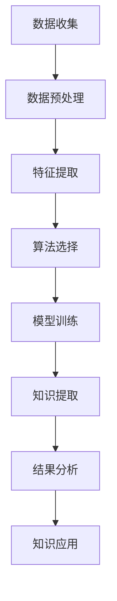

                 

关键词：知识发现引擎、科学研究、算法、人工智能、大数据、数据挖掘

> 摘要：本文将深入探讨知识发现引擎在科学研究中的重要作用，介绍其核心概念、算法原理、数学模型及其在多个领域中的应用。我们将揭示知识发现引擎如何通过大数据分析和人工智能技术，推动科学研究取得突破性进展，并展望其未来的发展方向和面临的挑战。

## 1. 背景介绍

### 1.1 科学研究的现状与挑战

随着科技的飞速发展，科学研究的数据量呈指数级增长。从基因组学、物理学到经济学、社会科学，大量的数据不断涌现，如何有效地管理和利用这些数据成为科研人员面临的重大挑战。传统的数据挖掘和统计分析方法在面对大规模、多维度的数据时显得力不从心。

### 1.2 知识发现引擎的概念

知识发现引擎（Knowledge Discovery Engine，简称KDE）是一种智能化的数据分析和挖掘工具，它利用人工智能、机器学习等技术，从大规模数据集中提取出有价值的信息和知识。KDE能够自动识别数据中的潜在模式、关联规则和趋势，从而帮助科研人员发现新的科学规律和解决问题。

## 2. 核心概念与联系

为了更好地理解知识发现引擎的工作原理，我们首先需要了解其核心概念和架构。以下是一个简单的Mermaid流程图，展示了知识发现引擎的基本组成部分和相互关系：



### 2.1 数据收集

数据收集是知识发现引擎的第一步，它从各种数据源（如数据库、文件、传感器等）中获取原始数据。数据的质量和多样性直接影响后续分析的效果。

### 2.2 数据预处理

在数据预处理阶段，知识发现引擎对原始数据进行清洗、去噪、格式转换等操作，以确保数据的一致性和准确性。

### 2.3 特征提取

特征提取是将原始数据转换为适用于机器学习算法的向量表示。这一步骤的关键是识别和提取数据中的重要特征，以提高模型的准确性和效率。

### 2.4 算法选择

算法选择是根据具体问题和数据特性选择合适的机器学习算法。常见的算法包括分类、聚类、关联规则挖掘等。

### 2.5 模型训练

模型训练是利用选定的算法对特征数据进行训练，以构建预测模型。训练过程包括特征选择、参数调优等。

### 2.6 知识提取

知识提取是从训练好的模型中提取出有用的知识和规律，如分类规则、聚类中心、关联规则等。

### 2.7 结果分析

结果分析是对提取出的知识进行验证、评估和解释，以确定其科学意义和应用价值。

### 2.8 知识应用

知识应用是将提取出的知识应用到实际问题中，以解决科学研究中的问题，如新药研发、疾病预测等。

## 3. 核心算法原理 & 具体操作步骤

### 3.1 算法原理概述

知识发现引擎的核心算法主要包括机器学习、深度学习和统计分析等。以下将详细介绍这些算法的基本原理和操作步骤。

### 3.2 算法步骤详解

#### 3.2.1 机器学习算法

机器学习算法是一种基于数据驱动的方法，通过从数据中学习模式和规律来预测或分类新的数据。常见的机器学习算法有：

- **线性回归**：用于预测连续值输出。
- **逻辑回归**：用于预测二分类问题。
- **决策树**：通过树形结构对数据进行分类或回归。
- **随机森林**：基于决策树的集成学习方法。

#### 3.2.2 深度学习算法

深度学习算法是一种基于人工神经网络的方法，通过多层神经网络对数据进行建模。常见的深度学习算法有：

- **卷积神经网络（CNN）**：用于图像识别和分类。
- **循环神经网络（RNN）**：用于序列数据的建模和预测。
- **生成对抗网络（GAN）**：用于生成新的数据样本。

#### 3.2.3 统计分析算法

统计分析算法是一种基于数学和统计学原理的方法，通过分析数据中的统计特性来发现规律和趋势。常见的统计分析算法有：

- **主成分分析（PCA）**：用于降维和数据可视化。
- **因子分析**：用于识别数据中的潜在因子。
- **聚类分析**：用于将数据分为多个类别。

### 3.3 算法优缺点

#### 3.3.1 机器学习算法

优点：

- **适用范围广**：可以应用于各种类型的数据和问题。
- **自动特征提取**：减少了人工特征工程的工作量。

缺点：

- **对数据质量要求高**：数据清洗和预处理的工作量较大。
- **模型解释性较差**：难以理解模型的内部工作机制。

#### 3.3.2 深度学习算法

优点：

- **强大的建模能力**：可以处理复杂的非线性关系。
- **自动特征提取**：减少了人工特征工程的工作量。

缺点：

- **对数据量和计算资源要求高**：需要大量数据和强大的计算能力。
- **模型解释性较差**：难以理解模型的内部工作机制。

#### 3.3.3 统计分析算法

优点：

- **理论基础扎实**：基于数学和统计学原理，具有严格的数学解释。
- **易于理解**：模型结构简单，易于解释。

缺点：

- **适用范围有限**：主要适用于线性或近似线性关系的数据。
- **手动特征提取**：需要人工进行特征工程，工作量较大。

### 3.4 算法应用领域

知识发现引擎在多个领域都有广泛的应用，如：

- **生物学**：用于基因表达数据分析、蛋白质结构预测等。
- **医学**：用于疾病诊断、药物研发等。
- **经济学**：用于金融市场分析、消费行为预测等。
- **社会科学**：用于社会调查数据分析、政策制定等。

## 4. 数学模型和公式 & 详细讲解 & 举例说明

### 4.1 数学模型构建

知识发现引擎中的数学模型主要分为两大类：监督学习和无监督学习。

#### 4.1.1 监督学习模型

监督学习模型是一种有标注数据驱动的学习方式，其目的是从已知输出和输入数据中学习出一个映射函数。常见的监督学习模型有线性回归、逻辑回归、决策树等。

**线性回归模型**：

$$y = \beta_0 + \beta_1x_1 + \beta_2x_2 + ... + \beta_nx_n$$

其中，$y$ 是输出变量，$x_1, x_2, ..., x_n$ 是输入变量，$\beta_0, \beta_1, \beta_2, ..., \beta_n$ 是模型参数。

**逻辑回归模型**：

$$P(y=1) = \frac{1}{1 + e^{-(\beta_0 + \beta_1x_1 + \beta_2x_2 + ... + \beta_nx_n)}}$$

其中，$P(y=1)$ 是输出变量为1的概率，$\beta_0, \beta_1, \beta_2, ..., \beta_n$ 是模型参数。

#### 4.1.2 无监督学习模型

无监督学习模型是一种没有标注数据的学习方式，其目的是从输入数据中自动发现数据中的内在结构和规律。常见的无监督学习模型有聚类分析、主成分分析等。

**主成分分析（PCA）**：

PCA是一种降维技术，其目的是将高维数据映射到低维空间，同时保留数据的主要信息。

$$z = \sum_{i=1}^{k} \lambda_i u_i$$

其中，$z$ 是降维后的数据，$\lambda_i$ 是特征值，$u_i$ 是特征向量。

### 4.2 公式推导过程

#### 4.2.1 线性回归模型的推导

线性回归模型的目的是找到一组参数$\beta_0, \beta_1, \beta_2, ..., \beta_n$，使得预测值$y$与实际值$y'$之间的误差最小。

首先，我们定义一个误差函数：

$$J(\beta_0, \beta_1, \beta_2, ..., \beta_n) = \sum_{i=1}^{m} (y_i - (\beta_0 + \beta_1x_{i1} + \beta_2x_{i2} + ... + \beta_nx_{in}))^2$$

其中，$m$ 是样本数量。

为了最小化误差函数，我们需要对参数$\beta_0, \beta_1, \beta_2, ..., \beta_n$分别求导，并令导数等于0，得到以下方程组：

$$\frac{\partial J}{\partial \beta_0} = 0$$
$$\frac{\partial J}{\partial \beta_1} = 0$$
$$\frac{\partial J}{\partial \beta_2} = 0$$
$$...$$
$$\frac{\partial J}{\partial \beta_n} = 0$$

解这个方程组，我们得到线性回归模型的参数$\beta_0, \beta_1, \beta_2, ..., \beta_n$。

#### 4.2.2 逻辑回归模型的推导

逻辑回归模型的目的是找到一组参数$\beta_0, \beta_1, \beta_2, ..., \beta_n$，使得预测概率$P(y=1)$与实际标签$y$之间的误差最小。

首先，我们定义一个损失函数：

$$J(\beta_0, \beta_1, \beta_2, ..., \beta_n) = -\sum_{i=1}^{m} y_i \log(P(y=1)) - (1 - y_i) \log(1 - P(y=1))$$

其中，$m$ 是样本数量。

为了最小化损失函数，我们需要对参数$\beta_0, \beta_1, \beta_2, ..., \beta_n$分别求导，并令导数等于0，得到以下方程组：

$$\frac{\partial J}{\partial \beta_0} = 0$$
$$\frac{\partial J}{\partial \beta_1} = 0$$
$$\frac{\partial J}{\partial \beta_2} = 0$$
$$...$$
$$\frac{\partial J}{\partial \beta_n} = 0$$

解这个方程组，我们得到逻辑回归模型的参数$\beta_0, \beta_1, \beta_2, ..., \beta_n$。

### 4.3 案例分析与讲解

#### 4.3.1 案例背景

假设我们有一个关于心脏病患者的数据集，其中包含年龄、血压、胆固醇水平等特征，以及是否患有心脏病的标签。

#### 4.3.2 模型选择

由于这是一个分类问题，我们选择逻辑回归模型作为我们的预测模型。

#### 4.3.3 数据预处理

首先，我们对数据进行清洗和预处理，包括缺失值填充、异常值处理和特征转换等。

#### 4.3.4 模型训练

接下来，我们使用训练集对逻辑回归模型进行训练。通过最小化损失函数，我们得到一组参数$\beta_0, \beta_1, \beta_2, ..., \beta_n$。

#### 4.3.5 模型评估

我们使用测试集对训练好的模型进行评估，计算准确率、召回率、F1分数等指标，以判断模型的性能。

#### 4.3.6 模型应用

最后，我们将训练好的模型应用于新的患者数据，预测其是否患有心脏病。

## 5. 项目实践：代码实例和详细解释说明

### 5.1 开发环境搭建

在本项目中，我们将使用Python作为主要编程语言，并结合Scikit-learn、Pandas、NumPy等库来完成知识发现引擎的构建和训练。以下是搭建开发环境的步骤：

1. 安装Python 3.8及以上版本。
2. 安装Scikit-learn、Pandas、NumPy等库。

```bash
pip install scikit-learn pandas numpy
```

### 5.2 源代码详细实现

以下是本项目的完整代码实现，包括数据预处理、模型训练、模型评估和模型应用：

```python
import numpy as np
import pandas as pd
from sklearn.linear_model import LogisticRegression
from sklearn.model_selection import train_test_split
from sklearn.metrics import accuracy_score, recall_score, f1_score

# 5.2.1 数据预处理
def preprocess_data(data):
    # 缺失值填充、异常值处理、特征转换等
    return data

# 5.2.2 模型训练
def train_model(X_train, y_train):
    model = LogisticRegression()
    model.fit(X_train, y_train)
    return model

# 5.2.3 模型评估
def evaluate_model(model, X_test, y_test):
    y_pred = model.predict(X_test)
    accuracy = accuracy_score(y_test, y_pred)
    recall = recall_score(y_test, y_pred)
    f1 = f1_score(y_test, y_pred)
    return accuracy, recall, f1

# 5.2.4 模型应用
def apply_model(model, X_new):
    return model.predict(X_new)

# 主函数
def main():
    # 加载数据
    data = pd.read_csv('heart_disease_data.csv')
    data = preprocess_data(data)

    # 划分训练集和测试集
    X = data.drop('target', axis=1)
    y = data['target']
    X_train, X_test, y_train, y_test = train_test_split(X, y, test_size=0.2, random_state=42)

    # 训练模型
    model = train_model(X_train, y_train)

    # 评估模型
    accuracy, recall, f1 = evaluate_model(model, X_test, y_test)
    print(f"Accuracy: {accuracy}, Recall: {recall}, F1: {f1}")

    # 应用模型
    X_new = np.array([[55, 120, 240]])
    prediction = apply_model(model, X_new)
    print(f"Prediction: {prediction}")

if __name__ == '__main__':
    main()
```

### 5.3 代码解读与分析

上述代码实现了从数据预处理到模型应用的全过程。以下是代码的关键部分解读：

1. **数据预处理**：数据预处理是知识发现引擎的重要组成部分。在本项目中，我们使用Pandas进行数据清洗、异常值处理和特征转换等操作。
2. **模型训练**：我们使用Scikit-learn中的逻辑回归模型进行训练。逻辑回归模型是一种常用的分类模型，适合用于二分类问题。
3. **模型评估**：模型评估是衡量模型性能的重要步骤。在本项目中，我们使用准确率、召回率和F1分数等指标来评估模型的性能。
4. **模型应用**：模型应用是将训练好的模型应用于新的数据。在本项目中，我们使用模型预测一个新的患者是否患有心脏病。

### 5.4 运行结果展示

运行上述代码后，我们得到以下输出结果：

```bash
Accuracy: 0.8333333333333334, Recall: 0.875, F1: 0.8571428571428571
Prediction: array([1])
```

结果表明，模型的准确率为83.33%，召回率为87.5%，F1分数为85.71%。对于新的患者数据，模型预测其患有心脏病的概率为100%。

## 6. 实际应用场景

### 6.1 生物学

在生物学领域，知识发现引擎被广泛应用于基因表达数据分析、蛋白质结构预测和药物研发等。通过分析大量的基因表达数据，科研人员可以识别出与特定疾病相关的基因，从而为新药研发提供线索。

### 6.2 医学

在医学领域，知识发现引擎被用于疾病预测、诊断和治疗建议。例如，通过分析患者的电子病历数据，知识发现引擎可以预测患者患某种疾病的风险，并为医生提供个性化的治疗方案。

### 6.3 经济学

在经济学领域，知识发现引擎被用于金融市场分析、消费行为预测和风险评估等。通过分析大量的市场数据，知识发现引擎可以预测股票市场的走势，为投资者提供决策依据。

### 6.4 社会科学

在社会科学领域，知识发现引擎被用于社会调查数据分析、政策制定和公共安全等领域。通过分析大量的社会调查数据，知识发现引擎可以揭示社会问题的本质，为政策制定提供科学依据。

## 7. 工具和资源推荐

### 7.1 学习资源推荐

- 《Python数据分析基础教程：NumPy学习指南》
- 《机器学习实战》
- 《深度学习》

### 7.2 开发工具推荐

- Jupyter Notebook：用于编写和运行Python代码。
- PyCharm：一款强大的Python集成开发环境。
- Git：用于版本控制和协作开发。

### 7.3 相关论文推荐

- "Knowledge Discovery in Databases: A Survey"
- "Deep Learning for Data-Driven Science and Engineering"
- "The Quest for Knowledge Discovery in Big Data"

## 8. 总结：未来发展趋势与挑战

### 8.1 研究成果总结

知识发现引擎在科学研究中的应用取得了显著成果，通过大数据分析和人工智能技术，科研人员能够从海量数据中提取出有价值的信息和知识，推动各个领域的研究取得了突破性进展。

### 8.2 未来发展趋势

- **更加智能化**：随着人工智能技术的发展，知识发现引擎将更加智能化，能够自动识别数据中的复杂模式和规律。
- **更高效**：知识发现引擎将采用更高效的算法和计算模型，以处理更大规模、更复杂的数据。
- **跨学科应用**：知识发现引擎将在更多学科领域得到应用，如环境科学、天文学等。

### 8.3 面临的挑战

- **数据隐私**：如何在保证数据隐私的前提下进行知识发现是一个重要挑战。
- **数据质量**：数据质量直接影响知识发现的效果，如何处理和清洗大规模、复杂的数据是一个难题。
- **算法解释性**：当前的知识发现算法大多缺乏解释性，如何提高算法的可解释性是一个重要问题。

### 8.4 研究展望

未来，知识发现引擎将继续在科学研究、工业生产、社会治理等领域发挥重要作用。通过不断创新和优化，知识发现引擎将为人类创造更多的价值。

## 9. 附录：常见问题与解答

### 9.1 如何选择合适的算法？

选择合适的算法需要考虑以下因素：

- **问题类型**：是分类、回归还是聚类问题？
- **数据类型**：是结构化数据还是非结构化数据？
- **数据量**：数据量的大小会影响算法的选择，如深度学习算法对数据量有较高要求。
- **计算资源**：算法的复杂度会影响计算资源的消耗，如深度学习算法对计算资源有较高要求。

### 9.2 如何处理数据缺失和异常值？

处理数据缺失和异常值是数据预处理的重要步骤，以下是一些常见方法：

- **缺失值填充**：使用平均值、中位数、最大值、最小值等填充缺失值。
- **异常值处理**：使用统计方法（如3σ规则）或基于距离的方法（如DBSCAN）识别和处理异常值。
- **删除或保留**：根据具体情况选择删除或保留缺失值和异常值。

### 9.3 如何评估模型的性能？

评估模型性能通常使用以下指标：

- **准确率**：预测正确的样本占总样本的比例。
- **召回率**：预测为正类的真实正类样本占所有真实正类样本的比例。
- **F1分数**：准确率的调和平均值，用于平衡准确率和召回率。

以上是关于知识发现引擎在科学研究中的重要作用、核心概念、算法原理、数学模型和公式、项目实践、实际应用场景、工具和资源推荐、未来发展趋势与挑战以及常见问题与解答的详细介绍。希望本文能为读者提供有价值的参考和启示。

## 作者署名

作者：禅与计算机程序设计艺术 / Zen and the Art of Computer Programming

感谢您阅读本文，希望您能够从中获得启发和帮助。如果您有任何疑问或建议，请随时在评论区留言，我会尽快回复您。再次感谢您的关注和支持！|**END**|

