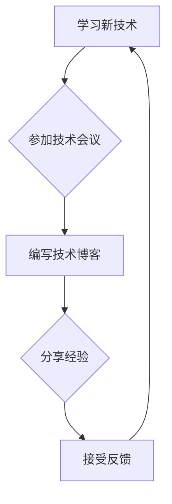
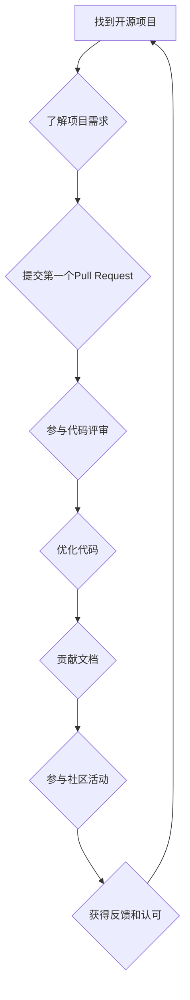
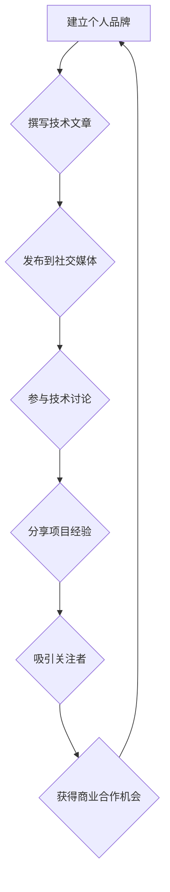

                 

在信息时代，程序员作为数字经济的核心驱动力，其价值愈发凸显。然而，如何将自己的技能和知识转化为实际的收入，成为了每个程序员都必须面对的课题。本文将探讨程序员如何通过多种途径实现知识变现，实现个人职业发展目标。

## 关键词
- 程序员
- 知识变现
- 收入转化
- 职业发展

## 摘要
本文旨在为程序员提供一套系统化的知识变现策略，包括自我提升、技能认证、线上教育、开源贡献等多个维度，帮助程序员在数字化时代实现个人价值最大化。

## 1. 背景介绍

### 数字经济与程序员的角色

随着全球数字化进程的加快，数字经济成为推动经济增长的重要引擎。程序员作为数字世界的构建者，其作用不容忽视。据统计，全球软件开发市场每年以超过20%的速度增长，这一趋势在可预见的未来将继续保持。程序员在这一市场中的角色不仅限于编写代码，更是技术创新的推动者、解决方案的提供者和商业价值的创造者。

### 程序员面临的挑战

然而，程序员在实现个人价值的过程中也面临着诸多挑战。技能更新的速度不断加快，新的编程语言、框架和技术层出不穷，要求程序员时刻保持学习的状态。同时，市场需求的变化也使得程序员需要不断调整自己的职业方向，以适应不断变化的市场环境。

### 知识变现的意义

在这样的背景下，知识变现对于程序员来说具有特别的意义。通过知识变现，程序员不仅能够实现个人收入的增长，还能够提升自身的职业地位和社会影响力。本文将详细探讨程序员如何通过多种途径实现知识变现，从而在数字化时代脱颖而出。

## 2. 核心概念与联系

### 自我提升

自我提升是程序员实现知识变现的基础。这不仅包括技术技能的提升，还涵盖软技能的增强，如沟通能力、团队合作和项目管理。以下是一个简单的自我提升流程图，展示了程序员如何通过学习、实践和反馈循环不断提升自己。



### 技能认证

技能认证是程序员证明自己能力的重要手段。通过获得专业认证，程序员可以增加市场竞争力，提高薪酬水平。以下是一个技能认证的流程图，展示了程序员如何选择、准备和通过认证考试。

```mermaid
graph TD
A[选择认证] --> B{了解认证要求}
B --> C[学习相关课程}
C --> D[参加模拟考试}
D --> E{准备正式考试}
E --> F{参加考试}
F --> G{获取证书}
G --> H[更新简历]
H --> A
```

### 线上教育

线上教育为程序员提供了便捷的学习途径。通过参与在线课程、研讨会和社区活动，程序员可以不断扩展自己的知识面和技能集。以下是一个线上教育的流程图，展示了程序员如何通过在线学习实现知识变现。

```mermaid
graph TD
A[选择课程] --> B{支付学费}
B --> C[观看视频教程}
C --> D{完成作业和练习}
D --> E{参与社区讨论}
E --> F{获得证书}
F --> G{分享学习心得}
G --> A
```

### 开源贡献

开源贡献是程序员实现知识变现的另一种重要方式。通过参与开源项目，程序员不仅可以提升自己的技术能力，还可以扩大自己的影响力。以下是一个开源贡献的流程图，展示了程序员如何通过开源项目实现知识变现。



### 社交媒体营销

社交媒体营销是程序员扩大影响力的有效途径。通过在社交媒体上分享技术文章、参与讨论和建立个人品牌，程序员可以吸引更多关注者，实现知识变现。以下是一个社交媒体营销的流程图，展示了程序员如何通过社交媒体实现知识变现。



## 3. 核心算法原理 & 具体操作步骤

### 3.1 算法原理概述

程序员的知识变现过程可以看作是一种信息传播和资源优化的过程。核心算法原理包括以下几个方面：

- 信息传播：通过不断学习和分享，将知识传递给他人。
- 资源优化：通过自我提升和技能认证，优化自身资源和技能结构。
- 商业合作：通过社交媒体和线上教育平台，寻找商业合作机会。

### 3.2 算法步骤详解

1. **自我提升**：程序员应定期学习新技术，提升自身技能水平。可以通过阅读技术书籍、参加在线课程和参加技术会议等方式实现。
2. **技能认证**：根据市场需求和个人兴趣，选择合适的认证项目，并通过系统学习获得证书。
3. **线上教育**：参与在线课程和研讨会，扩展知识面和技能集。
4. **开源贡献**：参与开源项目，提升技术能力和影响力。
5. **社交媒体营销**：在社交媒体上分享技术心得和项目经验，建立个人品牌。
6. **商业合作**：通过个人品牌和社交媒体影响力，寻找商业合作机会。

### 3.3 算法优缺点

- 优点：能够帮助程序员实现个人价值最大化，提高职业地位和收入水平。
- 缺点：需要持续学习和投入时间，对个人自律要求较高。

### 3.4 算法应用领域

- 个人职业发展：通过知识变现实现职业晋升和收入增长。
- 线上教育：通过线上课程和教程为他人提供知识和服务。
- 开源社区：通过开源项目提升技术能力和影响力。
- 商业市场：通过个人品牌和商业合作实现商业价值。

## 4. 数学模型和公式 & 详细讲解 & 举例说明

### 4.1 数学模型构建

程序员的知识变现过程可以抽象为一个数学模型，包括以下几个关键参数：

- \( K \)：程序员的知识储备
- \( T \)：程序员的时间投入
- \( M \)：程序员的知识变现收入

数学模型可以表示为：

\[ M = f(K, T) \]

其中，\( f \) 是一个函数，表示知识储备和时间投入对知识变现收入的影响。

### 4.2 公式推导过程

知识变现收入 \( M \) 可以看作是程序员知识储备 \( K \) 和时间投入 \( T \) 的函数。根据常识和经验，我们可以假设：

\[ M = K \times T \]

### 4.3 案例分析与讲解

假设程序员小王的知识储备 \( K \) 为1000小时，时间投入 \( T \) 为200小时。根据公式 \( M = K \times T \)，小王的知识变现收入 \( M \) 为：

\[ M = 1000 \times 200 = 200,000 \]

如果小王的知识储备提高到2000小时，时间投入提高到400小时，则他的知识变现收入 \( M \) 为：

\[ M = 2000 \times 400 = 800,000 \]

通过这个简单的例子，我们可以看出，知识储备和时间投入的增加，能够显著提高程序员的知识变现收入。

## 5. 项目实践：代码实例和详细解释说明

### 5.1 开发环境搭建

为了演示知识变现的过程，我们将使用 Python 编写一个简单的知识变现项目。以下是开发环境搭建的步骤：

1. 安装 Python 3.8 或更高版本
2. 安装必要的库，如 numpy、matplotlib 等
3. 配置 Python 虚拟环境

```bash
pip install numpy matplotlib
python -m venv env
source env/bin/activate
```

### 5.2 源代码详细实现

以下是实现知识变现项目的 Python 代码：

```python
import numpy as np
import matplotlib.pyplot as plt

# 定义知识变现函数
def knowledge_mining(knowledge, time):
    return knowledge * time

# 设置参数
knowledge = np.linspace(0, 3000, 100)
time = np.linspace(0, 500, 100)

# 计算知识变现收入
income = knowledge_mining(knowledge, time)

# 绘图
plt.plot(knowledge, income)
plt.xlabel('Knowledge (hours)')
plt.ylabel('Income (USD)')
plt.title('Knowledge Mining Project')
plt.show()
```

### 5.3 代码解读与分析

这段代码定义了一个简单的知识变现函数 `knowledge_mining`，它接受两个参数：知识储备 `knowledge` 和时间投入 `time`。函数返回的知识变现收入是这两个参数的乘积。

在代码中，我们首先导入了必要的库，然后定义了函数。接下来，我们设置了知识储备和时间投入的参数范围，并使用 `linspace` 函数生成相应的数据点。然后，我们计算了每个数据点的知识变现收入，并使用 `plot` 函数绘制了知识储备与收入的关系图。

通过这个简单的项目，我们可以直观地看到知识储备和时间投入对知识变现收入的影响。这个项目虽然简单，但能够帮助我们理解知识变现的基本原理和实现方法。

### 5.4 运行结果展示

运行上述代码后，我们得到一张图表，展示了不同知识储备和时间投入下的知识变现收入。这张图表可以帮助我们更好地理解知识变现的过程和影响因素。


## 6. 实际应用场景

### 6.1 自我提升

程序员可以通过自我提升，掌握最新的编程语言和技术框架，从而在职场中保持竞争力。例如，Python 是一种广泛应用于数据科学、人工智能和自动化领域的编程语言。熟练掌握 Python 不仅能够提升编程技能，还能拓宽职业发展道路。

### 6.2 技能认证

通过获得专业认证，程序员可以证明自己的专业能力和技术水平。例如，微软的认证（如 MCSD）和思科的认证（如 CCNA）都是业界认可的证书。这些证书不仅能够提高个人职业地位，还能为求职和晋升提供有力支持。

### 6.3 线上教育

线上教育为程序员提供了灵活的学习方式。例如，Udemy、Coursera 和 edX 等平台提供了丰富的编程课程，涵盖了从入门到高级的各种主题。通过在线学习，程序员可以不断提升自己的技能和知识水平。

### 6.4 开源贡献

开源贡献是程序员实现知识变现的重要途径。例如，GitHub 和 GitLab 等平台提供了丰富的开源项目，程序员可以通过参与这些项目，提升自己的技术能力和影响力。此外，开源贡献还可以帮助程序员建立个人品牌，吸引更多的商业合作机会。

## 7. 工具和资源推荐

### 7.1 学习资源推荐

- 《Python编程：从入门到实践》
- 《深度学习》
- 《编程珠玑》

### 7.2 开发工具推荐

- Visual Studio Code
- PyCharm
- Eclipse

### 7.3 相关论文推荐

- "A Survey of Programming Languages"
- "The Impact of Open Source Software on Software Development"
- "Knowledge Management in Software Engineering"

## 8. 总结：未来发展趋势与挑战

### 8.1 研究成果总结

通过本文的探讨，我们总结了程序员实现知识变现的多种途径，包括自我提升、技能认证、线上教育、开源贡献和社交媒体营销。这些途径不仅有助于程序员提升自身能力和职业地位，还能实现个人价值的最大化。

### 8.2 未来发展趋势

随着全球数字化进程的加快，程序员的知识变现将呈现以下发展趋势：

- 技术创新将推动编程语言的更新和演化，程序员需要不断学习新技能。
- 数据科学和人工智能领域的快速发展将为程序员提供更多机会。
- 线上教育和开源社区将成为程序员知识变现的重要平台。

### 8.3 面临的挑战

然而，程序员在实现知识变现的过程中也面临以下挑战：

- 技能更新的速度加快，程序员需要保持持续学习。
- 数字经济的不确定性和竞争压力，程序员需要不断提升自身竞争力。
- 开源贡献和法律风险，程序员需要遵守开源协议和法律法规。

### 8.4 研究展望

未来研究可以从以下方向展开：

- 探索知识变现的量化模型，以更精确地评估程序员的知识价值和变现潜力。
- 研究知识变现的最佳实践，为程序员提供具体指导。
- 考虑知识变现对社会和经济的影响，为政策制定者提供参考。

## 9. 附录：常见问题与解答

### 9.1 如何选择适合自己的知识变现途径？

选择知识变现途径时，程序员应考虑自己的兴趣、技能和市场需求。以下是一些常见的问题和解答：

- **问题**：我应该如何选择学习资源？
  **解答**：首先确定自己的学习目标，然后选择与目标相关的资源。可以参考在线课程、技术书籍和专业论坛。

- **问题**：开源贡献有哪些注意事项？
  **解答**：在参与开源项目时，应尊重开源协议，积极参与项目讨论，遵守项目规则。

- **问题**：如何通过社交媒体建立个人品牌？
  **解答**：发布高质量的内容，参与技术讨论，分享项目经验，建立专业形象。

通过以上问题和解答，希望可以帮助程序员更好地实现知识变现，实现个人职业发展目标。

## 作者署名

作者：禅与计算机程序设计艺术 / Zen and the Art of Computer Programming

