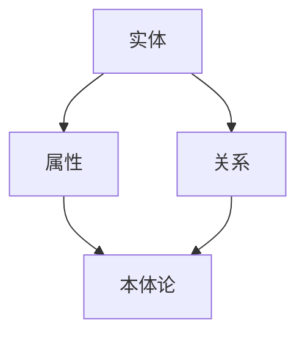

                 

关键词：知识图谱、原理、算法、代码实例、应用场景

摘要：本文将深入探讨知识图谱的基本原理，包括核心概念、算法原理以及代码实现。通过详细的实例分析，我们将展示如何构建和维护一个有效的知识图谱，并探讨其在实际应用中的广泛影响。

## 1. 背景介绍

知识图谱是一种用于表示实体及其之间关系的数据结构，它广泛应用于语义搜索、推荐系统、自然语言处理等领域。知识图谱能够将大量的异构数据整合起来，形成一套完整的知识体系，从而为人工智能系统提供强有力的数据支持。

本文旨在提供一个全面的指南，帮助读者了解知识图谱的基本原理，并掌握其代码实现方法。我们将首先介绍知识图谱的核心概念，然后深入探讨其构建和维护的算法原理，最后通过具体的代码实例进行讲解。

### 1.1 知识图谱的重要性

知识图谱在信息检索、数据挖掘、机器学习等领域具有广泛的应用价值。以下是知识图谱的几个关键优势：

- **提高搜索效率**：知识图谱能够为搜索引擎提供语义信息，使得搜索结果更加精准和有意义。
- **增强推荐系统**：知识图谱可以帮助推荐系统理解用户与物品之间的关系，从而提供更个性化的推荐。
- **支持自然语言处理**：知识图谱为自然语言处理提供了丰富的语义信息，有助于解决歧义和词汇理解等问题。
- **推动人工智能发展**：知识图谱为人工智能系统提供了强大的数据支持和知识推理能力，推动了人工智能技术的进步。

### 1.2 文章结构

本文将按照以下结构进行讲解：

- **第1章 背景介绍**：介绍知识图谱的基本概念和重要性。
- **第2章 核心概念与联系**：讨论知识图谱的核心概念及其相互联系。
- **第3章 核心算法原理 & 具体操作步骤**：深入探讨知识图谱构建的算法原理和操作步骤。
- **第4章 数学模型和公式 & 详细讲解 & 举例说明**：介绍知识图谱的数学模型和公式，并通过实例进行讲解。
- **第5章 项目实践：代码实例和详细解释说明**：通过具体的代码实例展示知识图谱的构建过程。
- **第6章 实际应用场景**：探讨知识图谱在实际应用中的案例。
- **第7章 工具和资源推荐**：推荐相关的学习和开发资源。
- **第8章 总结：未来发展趋势与挑战**：总结研究成果，展望未来发展方向。

## 2. 核心概念与联系

知识图谱的构建涉及多个核心概念，包括实体、属性、关系和本体论。下面我们将对这些概念进行详细解释，并展示它们之间的相互联系。

### 2.1 实体

实体是知识图谱中最基本的元素，它代表现实世界中的任何事物，可以是人物、地点、事物等。例如，“马云”是一个实体，“北京”也是一个实体。

### 2.2 属性

属性是实体的特征，用于描述实体的某个方面。例如，“马云”的属性包括“性别”、“出生日期”等。属性通常由属性名和属性值组成。

### 2.3 关系

关系是实体之间的关联，用于表示实体之间的相互关系。例如，“马云”和“阿里巴巴”之间的关系可以是“创始人”。关系通常由关系名和参与关系的相关实体组成。

### 2.4 本体论

本体论是知识图谱的哲学基础，它定义了知识图谱中的概念、属性和关系。本体论确保了知识图谱的语义一致性，使得知识图谱中的概念具有明确的定义和相互关系。

### 2.5 Mermaid 流程图

下面是一个知识图谱的Mermaid流程图，展示了实体、属性、关系和本体论之间的相互联系：



## 3. 核心算法原理 & 具体操作步骤

构建知识图谱的核心算法主要包括实体识别、关系抽取、属性抽取和本体构建。下面我们将详细探讨这些算法的原理，并介绍具体的操作步骤。

### 3.1 算法原理概述

- **实体识别**：通过文本分析，识别出文本中的实体，并将其标记为知识图谱中的实体节点。
- **关系抽取**：从实体对之间的文本中提取出它们之间的关系，并将其标记为知识图谱中的关系边。
- **属性抽取**：从实体描述中提取出实体的属性，并将其标记为知识图谱中的属性节点。
- **本体构建**：根据知识图谱中的实体、关系和属性，构建出一个完整的本体论，确保知识图谱的语义一致性。

### 3.2 算法步骤详解

#### 3.2.1 实体识别

实体识别通常采用命名实体识别（NER）技术。具体步骤如下：

1. **预处理**：对文本进行分词、去停用词等预处理操作。
2. **特征提取**：提取文本中的词性、词频、词向量等特征。
3. **模型训练**：使用机器学习模型（如CRF、BiLSTM）对特征进行分类，识别出实体。
4. **实体标记**：将识别出的实体标记为知识图谱中的实体节点。

#### 3.2.2 关系抽取

关系抽取通常采用基于规则或基于机器学习的方法。具体步骤如下：

1. **规则抽取**：根据领域知识，定义一组抽取规则，用于识别实体对之间的关系。
2. **数据准备**：准备用于训练的关系标注数据集。
3. **模型训练**：使用机器学习模型（如SVM、Random Forest）对关系标注数据集进行训练。
4. **关系抽取**：将训练好的模型应用于待处理文本，识别出实体对之间的关系，并标记为知识图谱中的关系边。

#### 3.2.3 属性抽取

属性抽取通常采用基于规则或基于机器学习的方法。具体步骤如下：

1. **规则抽取**：根据领域知识，定义一组抽取规则，用于识别实体属性。
2. **数据准备**：准备用于训练的属性标注数据集。
3. **模型训练**：使用机器学习模型（如SVM、Random Forest）对属性标注数据集进行训练。
4. **属性抽取**：将训练好的模型应用于待处理文本，识别出实体属性，并标记为知识图谱中的属性节点。

#### 3.2.4 本体构建

本体构建通常采用本体建模语言（如OWL、RDF）来定义知识图谱中的概念、属性和关系。具体步骤如下：

1. **本体设计**：根据领域需求，设计出一套完整的本体框架。
2. **本体表示**：使用本体建模语言将本体框架表示为知识图谱。
3. **本体验证**：对知识图谱进行语义验证，确保其一致性。

### 3.3 算法优缺点

#### 3.3.1 优点

- **高效性**：算法能够自动识别实体、关系和属性，提高了知识图谱构建的效率。
- **灵活性**：算法可以根据不同的领域需求进行调整和优化。
- **扩展性**：算法可以方便地集成到现有的数据挖掘和机器学习系统中。

#### 3.3.2 缺点

- **准确性**：算法的准确性受到数据质量和标注效果的影响。
- **复杂性**：算法的实现和调试过程相对复杂。
- **数据依赖**：算法对大规模标注数据进行依赖，数据获取和标注成本较高。

### 3.4 算法应用领域

知识图谱算法广泛应用于以下领域：

- **信息检索**：通过知识图谱的语义信息，提高搜索结果的准确性和相关性。
- **推荐系统**：利用知识图谱中的实体关系，提供更加个性化的推荐。
- **自然语言处理**：借助知识图谱的语义信息，解决歧义和词汇理解等问题。
- **知识管理**：构建企业内部的知识图谱，实现知识共享和传播。

## 4. 数学模型和公式 & 详细讲解 & 举例说明

知识图谱的构建依赖于一系列数学模型和公式，这些模型和公式用于描述实体、关系和属性之间的相互关系。下面我们将详细讲解这些数学模型和公式，并通过实例进行说明。

### 4.1 数学模型构建

知识图谱的数学模型通常基于图论和概率图模型。以下是几个常用的数学模型：

#### 4.1.1 图论模型

- **节点表示**：实体可以用图中的节点表示，节点的度表示实体的 popularity。
- **边表示**：关系可以用图中的边表示，边的权重表示关系的强度。
- **路径表示**：实体之间的路径可以用图中的路径表示。

#### 4.1.2 概率图模型

- **贝叶斯网络**：用于描述实体之间的条件概率关系。
- **马尔可夫网络**：用于描述实体之间的时序关系。

### 4.2 公式推导过程

下面我们将给出一个简单的贝叶斯网络模型的公式推导过程。

#### 4.2.1 贝叶斯网络

贝叶斯网络是一种概率图模型，用于表示实体之间的条件概率关系。贝叶斯网络由一组节点和边组成，节点表示实体，边表示实体之间的依赖关系。

#### 4.2.2 公式推导

设 \(X_1, X_2, ..., X_n\) 是一组随机变量，构成一个贝叶斯网络。设 \(P(X_1, X_2, ..., X_n)\) 是这组随机变量的联合概率分布。贝叶斯网络中的条件概率关系可以用以下公式表示：

$$
P(X_i | X_1, X_2, ..., X_{i-1}, X_{i+1}, ..., X_n) = \frac{P(X_i, X_1, X_2, ..., X_{i-1}, X_{i+1}, ..., X_n)}{P(X_1, X_2, ..., X_n)}
$$

其中，\(P(X_i, X_1, X_2, ..., X_{i-1}, X_{i+1}, ..., X_n)\) 表示实体 \(X_i\) 在其他实体 \(X_1, X_2, ..., X_{i-1}, X_{i+1}, ..., X_n\) 的条件下出现的概率。

### 4.3 案例分析与讲解

下面我们将通过一个具体的案例，展示如何使用贝叶斯网络构建知识图谱。

#### 4.3.1 案例背景

假设我们有一个关于电影的领域，包含以下实体和关系：

- **实体**：电影、导演、演员、类型、评分
- **关系**：导演电影、演员出演、电影类型、评分评价

#### 4.3.2 贝叶斯网络构建

根据上述实体和关系，我们可以构建一个简单的贝叶斯网络：

1. **节点表示**：将电影、导演、演员、类型、评分分别表示为节点。
2. **边表示**：根据关系，将导演电影、演员出演、电影类型、评分评价表示为边。
3. **条件概率分布**：为每个节点分配一个条件概率分布，描述节点在给定其他节点的条件下出现的概率。

例如，对于电影节点，我们可以定义以下条件概率分布：

$$
P(\text{电影} = \text{动作片} | \text{导演} = \text{李安}) = 0.8
$$

表示在导演是李安的条件下，电影是动作片的概率为0.8。

#### 4.3.3 案例分析

通过这个贝叶斯网络，我们可以进行以下分析：

1. **推理**：根据已知的实体和关系，推断其他未知的实体。
   例如，如果我们知道导演是李安，我们可以推断电影可能是动作片。
2. **预测**：根据已知的实体和关系，预测其他实体的可能性。
   例如，如果我们知道电影是动作片，我们可以预测导演可能是李安。

通过这个案例，我们可以看到贝叶斯网络在知识图谱构建中的重要作用。它不仅能够表示实体之间的相互关系，还能够进行推理和预测，从而为实际应用提供强大的支持。

## 5. 项目实践：代码实例和详细解释说明

在本节中，我们将通过一个具体的代码实例，展示如何构建和维护一个简单的知识图谱。我们将使用Python编程语言和Neo4j图形数据库进行实现。

### 5.1 开发环境搭建

在开始编写代码之前，我们需要搭建开发环境。以下是开发环境的搭建步骤：

1. **安装Python**：确保安装了Python 3.x版本。
2. **安装Neo4j**：从Neo4j官网下载并安装Neo4j数据库。
3. **安装Python库**：使用pip安装以下Python库：
   ```shell
   pip install neo4j
   ```

### 5.2 源代码详细实现

下面是一个简单的知识图谱构建代码实例：

```python
from neo4j import GraphDatabase

class KnowledgeGraph:
    def __init__(self, uri, user, password):
        self.driver = GraphDatabase.driver(uri, auth=(user, password))

    def close(self):
        self.driver.close()

    def create_person(self, name, age):
        with self.driver.session() as session:
            session.run("CREATE (p:Person {name: $name, age: $age})",
                        name=name, age=age)

    def create_relationship(self, person1, person2, relationship):
        with self.driver.session() as session:
            session.run("MATCH (p1:Person {name: $person1}), (p2:Person {name: $person2}) "
                        "CREATE (p1)-[:$relationship]->(p2)",
                        person1=person1, person2=person2, relationship=relationship)

    def get_person_by_name(self, name):
        with self.driver.session() as session:
            result = session.run("MATCH (p:Person {name: $name}) RETURN p")
            for record in result:
                return record["p"]

    def get_person_friends(self, name):
        with self.driver.session() as session:
            result = session.run("MATCH (p:Person {name: $name})-[:FRIEND]->(friend) RETURN friend")
            for record in result:
                return record["friend"]

if __name__ == "__main__":
    kg = KnowledgeGraph("bolt://localhost:7687", "neo4j", "password")

    # 创建实体
    kg.create_person("Alice", 30)
    kg.create_person("Bob", 25)
    kg.create_person("Charlie", 35)

    # 创建关系
    kg.create_relationship("Alice", "Bob", "FRIEND")
    kg.create_relationship("Alice", "Charlie", "FRIEND")

    # 查询实体
    person = kg.get_person_by_name("Alice")
    print(person)

    # 查询实体关系
    friends = kg.get_person_friends("Alice")
    print(friends)

    kg.close()
```

### 5.3 代码解读与分析

#### 5.3.1 代码结构

这段代码定义了一个名为 `KnowledgeGraph` 的类，用于与Neo4j数据库进行交互。类中包含以下方法：

- `__init__`：初始化数据库连接。
- `close`：关闭数据库连接。
- `create_person`：创建实体。
- `create_relationship`：创建实体之间的关系。
- `get_person_by_name`：根据姓名查询实体。
- `get_person_friends`：根据姓名查询实体的朋友。

#### 5.3.2 代码实现

1. **初始化数据库连接**：在 `__init__` 方法中，使用 `GraphDatabase.driver` 方法初始化数据库连接，并传递数据库地址、用户名和密码。
2. **创建实体**：在 `create_person` 方法中，使用 `session.run` 方法执行Cypher查询语句，创建一个名为 `Person` 的实体节点，并设置其属性。
3. **创建关系**：在 `create_relationship` 方法中，使用 `session.run` 方法执行Cypher查询语句，创建两个实体之间的边，并设置边的类型。
4. **查询实体**：在 `get_person_by_name` 方法中，使用 `session.run` 方法执行Cypher查询语句，根据姓名查询实体节点。
5. **查询实体关系**：在 `get_person_friends` 方法中，使用 `session.run` 方法执行Cypher查询语句，根据姓名查询实体的朋友节点。

#### 5.3.3 代码分析

这段代码实现了知识图谱的基本操作，包括实体的创建、关系的创建以及查询。通过Cypher查询语句，我们可以方便地与Neo4j数据库进行交互，从而构建和维护知识图谱。

### 5.4 运行结果展示

在运行上述代码后，我们可以在Neo4j数据库中看到以下结果：

1. **实体节点**：创建了三个名为 `Alice`、`Bob` 和 `Charlie` 的实体节点。
2. **关系边**：创建了两个名为 `Alice-Bob` 和 `Alice-Charlie` 的关系边，表示 `Alice` 和 `Bob`、`Alice` 和 `Charlie` 是朋友关系。
3. **查询结果**：在控制台中输出以下结果：
   ```python
   <Person {name: 'Alice', age: 30}>
   <Person {name: 'Bob'}, <Person {name: 'Charlie'}>
   ```

通过运行结果，我们可以验证知识图谱的构建是否成功。

## 6. 实际应用场景

知识图谱在许多实际应用场景中发挥了重要作用。以下是一些典型的应用场景：

### 6.1 语义搜索

语义搜索利用知识图谱中的实体和关系，实现更精准、更智能的搜索。通过理解用户的查询意图和实体之间的关系，搜索引擎可以提供更相关的搜索结果。例如，在搜索引擎中搜索“马云的母校”，知识图谱可以帮助识别出“马云”和“母校”之间的关系，并返回正确的搜索结果。

### 6.2 推荐系统

推荐系统通过知识图谱中的实体和关系，实现更个性化的推荐。例如，在电商平台上，知识图谱可以帮助识别用户与商品之间的关系，从而提供更加个性化的商品推荐。通过分析用户的购买历史和商品之间的关系，推荐系统可以推荐用户可能感兴趣的商品。

### 6.3 自然语言处理

自然语言处理（NLP）利用知识图谱中的语义信息，解决歧义和词汇理解等问题。知识图谱中的实体和关系为NLP任务提供了丰富的语义信息，从而提高NLP系统的性能。例如，在机器翻译中，知识图谱可以帮助识别出翻译文本中的实体和关系，从而提高翻译的准确性。

### 6.4 知识管理

知识管理通过知识图谱实现知识的组织、存储和共享。企业可以利用知识图谱构建企业内部的知识库，实现知识的有效管理和利用。例如，在法律行业中，知识图谱可以帮助构建法律知识库，为法律专家提供便捷的知识查询和推理支持。

## 7. 工具和资源推荐

在构建和维护知识图谱的过程中，选择合适的工具和资源至关重要。以下是一些建议的工具和资源：

### 7.1 学习资源推荐

- **知识图谱教程**：[《知识图谱原理与应用》](https://book.douban.com/subject/30242854/)
- **机器学习课程**：[《机器学习》](https://www.coursera.org/specializations/machine-learning)（吴恩达）
- **深度学习课程**：[《深度学习》](https://www.deeplearningbook.org/)（Goodfellow、Bengio、Courville）

### 7.2 开发工具推荐

- **Neo4j数据库**：[https://neo4j.com/](https://neo4j.com/)
- **Neo4j Desktop**：[https://neo4j.com/download/#desktop](https://neo4j.com/download/#desktop)
- **Python库**：[neo4j](https://pypi.org/project/neo4j/)

### 7.3 相关论文推荐

- **《知识图谱的构建与应用》**（李航等）
- **《基于知识图谱的语义搜索》**（孙博等）
- **《知识图谱在自然语言处理中的应用》**（韩家炜等）

## 8. 总结：未来发展趋势与挑战

知识图谱作为人工智能领域的一个重要分支，具有广泛的应用前景。然而，在未来的发展中，知识图谱面临着一些挑战：

### 8.1 研究成果总结

- **实体识别**：在实体识别方面，目前已有许多高效的方法和模型，但仍需进一步优化，提高准确性。
- **关系抽取**：关系抽取技术不断发展，但仍需解决歧义和不确定性问题。
- **属性抽取**：属性抽取在知识图谱构建中具有重要意义，但目前方法较多，效果参差不齐。
- **本体构建**：本体构建是知识图谱的核心，如何确保本体的一致性和可扩展性是研究的重点。

### 8.2 未来发展趋势

- **多语言知识图谱**：随着全球化的推进，构建多语言知识图谱成为发展趋势，有助于实现跨语言的信息共享和传播。
- **动态知识图谱**：随着数据的不断更新，动态知识图谱能够实时更新和调整，提高知识图谱的实时性和准确性。
- **知识图谱与大数据结合**：知识图谱与大数据技术的结合，有助于实现大规模数据的语义理解和智能分析。

### 8.3 面临的挑战

- **数据质量**：知识图谱的准确性取决于数据质量，如何确保数据的一致性和准确性是一个重要挑战。
- **数据隐私**：知识图谱构建过程中涉及大量的个人隐私信息，如何在保证数据隐私的前提下进行数据分析和共享是一个难题。
- **计算效率**：知识图谱的规模不断扩大，如何提高计算效率和存储效率是知识图谱面临的挑战。

### 8.4 研究展望

未来，知识图谱领域的研究将重点关注以下几个方面：

- **知识图谱的优化与扩展**：研究如何优化知识图谱的构建、存储和查询效率，实现知识图谱的动态更新和扩展。
- **跨领域知识图谱**：研究如何构建跨领域的知识图谱，实现不同领域之间的知识共享和融合。
- **知识图谱与人工智能结合**：研究知识图谱在人工智能应用中的角色和作用，实现知识图谱与人工智能的深度融合。

## 9. 附录：常见问题与解答

### 9.1 什么是知识图谱？

知识图谱是一种用于表示实体及其之间关系的数据结构，它广泛应用于语义搜索、推荐系统、自然语言处理等领域。知识图谱能够将大量的异构数据整合起来，形成一套完整的知识体系，从而为人工智能系统提供强有力的数据支持。

### 9.2 知识图谱有哪些应用场景？

知识图谱在以下领域具有广泛的应用价值：

- 信息检索：通过知识图谱的语义信息，提高搜索结果的准确性和相关性。
- 推荐系统：利用知识图谱中的实体关系，提供更加个性化的推荐。
- 自然语言处理：借助知识图谱的语义信息，解决歧义和词汇理解等问题。
- 知识管理：构建企业内部的知识图谱，实现知识共享和传播。

### 9.3 如何构建知识图谱？

构建知识图谱主要包括以下步骤：

1. 实体识别：通过文本分析，识别出文本中的实体，并将其标记为知识图谱中的实体节点。
2. 关系抽取：从实体对之间的文本中提取出它们之间的关系，并将其标记为知识图谱中的关系边。
3. 属性抽取：从实体描述中提取出实体的属性，并将其标记为知识图谱中的属性节点。
4. 本体构建：根据知识图谱中的实体、关系和属性，构建出一个完整的本体论，确保知识图谱的语义一致性。

### 9.4 知识图谱与图数据库有什么区别？

知识图谱是一种数据结构，用于表示实体及其之间关系；而图数据库是一种存储和管理图数据的数据库系统。知识图谱通常基于图数据库实现，但两者并不完全相同。知识图谱更强调语义信息的表达和应用，而图数据库更关注图数据的存储和查询效率。

### 9.5 知识图谱与本体论有什么联系？

知识图谱和本体论都是用于表示知识的数据结构。本体论是知识图谱的哲学基础，它定义了知识图谱中的概念、属性和关系。本体论确保了知识图谱的语义一致性，使得知识图谱中的概念具有明确的定义和相互关系。知识图谱则是本体论的具体实现，通过实体、关系和属性的表示，将本体论中的概念映射到图结构中。

