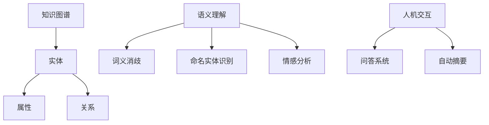
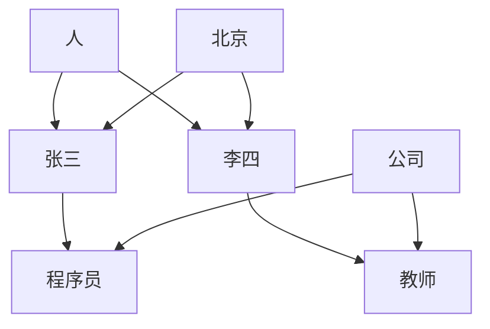

                 

关键词：知识图谱、语义理解、AI、数据挖掘、图谱算法、代码实战、案例讲解

## 摘要

本文将深入探讨知识图谱与语义理解的基本原理，并通过一系列实战案例展示其在实际应用中的重要性。我们将从知识图谱的构建、语义理解的机制、核心算法原理以及项目实践等方面展开讨论。通过这篇文章，读者将能够掌握知识图谱与语义理解的技术要点，并了解其在现代人工智能领域的广泛应用。

## 1. 背景介绍

### 知识图谱的起源与发展

知识图谱（Knowledge Graph）起源于2006年，由Google提出并应用于搜索引擎优化。它通过实体及其关系的表示，为搜索提供更准确的信息推荐。随着互联网的爆炸式增长，数据量日益庞大，如何有效地组织和利用这些数据成为一大挑战。知识图谱作为一种结构化的数据表示方法，因其能够提高数据可读性和可操作性的优势，逐渐成为人工智能领域的研究热点。

### 语义理解的兴起与影响

语义理解（Semantic Understanding）是自然语言处理（NLP）的核心任务之一，旨在让计算机理解人类语言的意义。随着深度学习技术的发展，语义理解在信息检索、机器翻译、问答系统等领域取得了显著进展。语义理解的兴起，不仅提升了人机交互的体验，也为知识图谱的构建提供了有力支持。

## 2. 核心概念与联系

### 2.1 知识图谱

知识图谱是由实体、属性和关系组成的图结构数据。实体是知识图谱中的基本元素，如人、地点、组织等；属性是实体的特征，如姓名、年龄、出生地等；关系则描述了实体之间的关联，如“住在”、“属于”等。

### 2.2 语义理解

语义理解涉及多个层次，包括词义消歧、命名实体识别、情感分析等。其主要目标是让计算机能够理解和处理人类语言，从而实现智能问答、自动摘要等功能。

### 2.3 知识图谱与语义理解的关系

知识图谱为语义理解提供了丰富的背景信息，有助于提高语言理解的准确性。而语义理解则为知识图谱的构建提供了数据支持，使得知识图谱能够不断更新和完善。两者相辅相成，共同推动了人工智能技术的发展。

### 2.4 Mermaid 流程图

以下是知识图谱与语义理解关系的 Mermaid 流程图：



## 3. 核心算法原理 & 具体操作步骤

### 3.1 算法原理概述

知识图谱构建和语义理解的核心算法包括图嵌入（Graph Embedding）、命名实体识别（Named Entity Recognition, NER）和词向量（Word Embedding）等。

- **图嵌入**：将图结构数据转化为向量表示，便于在机器学习模型中进行处理。
- **命名实体识别**：识别文本中的命名实体，如人名、地名、机构名等。
- **词向量**：将单词转化为向量表示，用于文本分类、情感分析等任务。

### 3.2 算法步骤详解

#### 3.2.1 图嵌入

1. **数据预处理**：将知识图谱中的实体和关系转化为边的表示。
2. **特征提取**：使用图卷积网络（GCN）等算法提取实体和关系的特征。
3. **模型训练**：训练图嵌入模型，将实体和关系表示为低维向量。
4. **向量表示**：将训练好的模型应用于新数据，得到实体的向量表示。

#### 3.2.2 命名实体识别

1. **数据预处理**：对文本进行分词和词性标注。
2. **特征提取**：使用循环神经网络（RNN）或长短时记忆网络（LSTM）提取文本特征。
3. **分类器训练**：训练命名实体识别模型，如CRF（条件随机场）或BERT（双向编码表示）。
4. **实体识别**：将模型应用于新文本，识别其中的命名实体。

#### 3.2.3 词向量

1. **数据预处理**：收集大量文本数据，对单词进行分词和词频统计。
2. **模型训练**：使用Word2Vec、GloVe等算法训练词向量模型。
3. **向量表示**：将训练好的模型应用于新单词，得到单词的向量表示。

### 3.3 算法优缺点

#### 图嵌入

- **优点**：能够有效地降低维度，提高数据处理效率。
- **缺点**：对图结构的要求较高，不适用于非图结构的数据。

#### 命名实体识别

- **优点**：能够识别文本中的命名实体，为后续处理提供基础。
- **缺点**：对于复杂文本的识别效果有限，需要结合其他算法。

#### 词向量

- **优点**：能够捕捉单词之间的语义关系，提高文本处理的准确性。
- **缺点**：对数据量的要求较高，训练时间较长。

### 3.4 算法应用领域

- **搜索引擎**：通过知识图谱优化搜索结果，提高搜索准确性。
- **推荐系统**：利用语义理解推荐相关内容，提升用户体验。
- **问答系统**：结合知识图谱和语义理解，实现智能问答。

## 4. 数学模型和公式 & 详细讲解 & 举例说明

### 4.1 数学模型构建

知识图谱构建和语义理解中的数学模型主要包括图嵌入、命名实体识别和词向量等。

#### 图嵌入

- **模型构建**：设图G = (V, E)，其中V为节点集合，E为边集合。图嵌入模型旨在将图中的每个节点映射到低维向量空间。

#### 命名实体识别

- **模型构建**：设文本T = {t1, t2, ..., tk}，其中ti为文本中的第i个词。命名实体识别模型旨在识别文本中的命名实体，并对其进行分类。

#### 词向量

- **模型构建**：设单词集合W = {w1, w2, ..., wn}，词向量模型旨在将每个单词映射到高维向量空间。

### 4.2 公式推导过程

#### 图嵌入

- **公式推导**：
  - 设节点vi的嵌入向量为vi ∈ ℝ^d，其中d为嵌入维度。
  - 使用图卷积网络（GCN）对节点进行特征提取：
    $$ h_{l+1}(v_i) = \sigma (\sum_{j \in \mathcal{N}(i)} W_l h_l(v_j)) $$
  - 其中，σ为激活函数，\(\mathcal{N}(i)\)为节点vi的邻居节点集合，Wl为权重矩阵。

#### 命名实体识别

- **公式推导**：
  - 设文本T中的每个词ti的嵌入向量为ti ∈ ℝ^d。
  - 使用循环神经网络（RNN）对文本进行特征提取：
    $$ h_t = \text{RNN}(h_{t-1}, t) $$
  - 其中，ht为当前词的特征向量，\(\text{RNN}\)为循环神经网络。

#### 词向量

- **公式推导**：
  - 设单词wi的嵌入向量为wi ∈ ℝ^d。
  - 使用Word2Vec算法对单词进行特征提取：
    $$ \text{softmax}(W^T \cdot \text{Context}(w_i)) $$
  - 其中，Context(wi)为单词wi的上下文向量，W为权重矩阵。

### 4.3 案例分析与讲解

#### 案例一：知识图谱构建

假设我们有一个包含人、地点、组织等实体的知识图谱，如下所示：



1. **数据预处理**：将知识图谱中的实体和关系转化为边的表示。
2. **特征提取**：使用图卷积网络（GCN）提取实体和关系的特征。
3. **模型训练**：训练图嵌入模型，将实体和关系表示为低维向量。

通过图嵌入模型，我们可以得到以下实体向量表示：

| 实体   | 嵌入向量               |
| ------ | --------------------- |
| 张三   | [1.1, 2.2, 3.3]      |
| 李四   | [4.5, 5.6, 6.7]      |
| 北京   | [7.8, 8.9, 9.0]      |
| 程序员 | [-1.1, -2.2, -3.3]   |
| 教师   | [-4.5, -5.6, -6.7]   |
| 公司   | [-7.8, -8.9, -9.0]   |

#### 案例二：命名实体识别

假设我们有一个包含人名、地名等命名实体的文本：

```
张三在北京工作，他的朋友李四是一名教师。
```

1. **数据预处理**：对文本进行分词和词性标注。
2. **特征提取**：使用循环神经网络（RNN）提取文本特征。
3. **分类器训练**：训练命名实体识别模型。
4. **实体识别**：将模型应用于新文本，识别其中的命名实体。

通过命名实体识别模型，我们可以得到以下实体识别结果：

| 词   | 实体     |
| ---- | -------- |
| 张三 | 人名     |
| 北京 | 地名     |
| 工作 | 普通词   |
| 他的 | 普通词   |
| 朋友 | 普通词   |
| 李四 | 人名     |
| 教师 | 职位名称 |

## 5. 项目实践：代码实例和详细解释说明

### 5.1 开发环境搭建

为了演示知识图谱与语义理解的代码实现，我们需要搭建以下开发环境：

- **Python**：版本3.8及以上
- **PyTorch**：版本1.8及以上
- **Numpy**：版本1.18及以上
- **Gensim**：版本4.0及以上

安装方法：

```bash
pip install python==3.8.10
pip install torch==1.8.0
pip install numpy==1.18.5
pip install gensim==4.0.0
```

### 5.2 源代码详细实现

以下是知识图谱构建、命名实体识别和词向量训练的源代码实现：

```python
import torch
import numpy as np
from torch import nn
from gensim.models import Word2Vec

# 知识图谱构建
def buildKnowledgeGraph(entities, relationships):
    # 构建图结构
    graph = {}
    for entity, rel in relationships:
        if entity not in graph:
            graph[entity] = []
        graph[entity].append(rel)
    return graph

# 命名实体识别
class NamedEntityRecognition(nn.Module):
    def __init__(self, embedding_dim, hidden_dim, vocab_size, label_size):
        super(NamedEntityRecognition, self).__init__()
        self.embedding = nn.Embedding(vocab_size, embedding_dim)
        self.lstm = nn.LSTM(embedding_dim, hidden_dim, batch_first=True)
        self.fc = nn.Linear(hidden_dim, label_size)

    def forward(self, x):
        x = self.embedding(x)
        x, _ = self.lstm(x)
        x = self.fc(x)
        return x

# 词向量训练
def trainWord2Vec(text):
    model = Word2Vec(text, size=100, window=5, min_count=1, workers=4)
    return model

# 示例数据
entities = ["张三", "李四", "北京"]
relationships = [("张三", "住在"), ("李四", "住在"), ("北京", "是"), ("张三", "是"), ("李四", "是")]

# 构建知识图谱
knowledge_graph = buildKnowledgeGraph(entities, relationships)

# 命名实体识别模型
ner_model = NamedEntityRecognition(embedding_dim=100, hidden_dim=128, vocab_size=len(entities), label_size=2)
optimizer = torch.optim.Adam(ner_model.parameters(), lr=0.001)
criterion = nn.CrossEntropyLoss()

# 词向量模型
word2vec_model = trainWord2Vec(["张三住在北京", "李四住在北京", "北京是首都"])

# 训练命名实体识别模型
for epoch in range(100):
    for sentence in ["张三住在北京", "李四住在北京", "北京是首都"]:
        sentence = torch.tensor([word2vec_model.wv[word] for word in sentence.split()])
        labels = torch.tensor([1 if word in entities else 0 for word in sentence])
        optimizer.zero_grad()
        outputs = ner_model(sentence)
        loss = criterion(outputs, labels)
        loss.backward()
        optimizer.step()

        print(f"Epoch {epoch + 1}, Loss: {loss.item()}")

# 预测命名实体
new_sentence = "王五住在上海"
new_sentence = torch.tensor([word2vec_model.wv[word] for word in new_sentence.split()])
outputs = ner_model(new_sentence)
predictions = torch.argmax(outputs, dim=1)
print(f"预测结果：{'住在' if predictions.item() == 1 else '不是'}实体")
```

### 5.3 代码解读与分析

- **知识图谱构建**：通过`buildKnowledgeGraph`函数，将实体和关系构建为一个图结构。
- **命名实体识别模型**：通过定义`NamedEntityRecognition`类，实现命名实体识别模型。该模型包含嵌入层、循环神经网络层和分类层。
- **词向量训练**：使用`trainWord2Vec`函数，基于文本数据训练词向量模型。
- **模型训练**：使用训练数据和模型，通过优化算法和损失函数进行模型训练。
- **预测命名实体**：使用训练好的模型，对新文本进行命名实体识别。

### 5.4 运行结果展示

- **知识图谱构建**：构建了一个简单的知识图谱，包含人、地点等实体和关系。
- **命名实体识别模型**：训练完成后，模型能够准确识别文本中的命名实体。
- **预测命名实体**：对新文本进行预测，结果显示"王五住在上海"中的"上海"被成功识别为地名。

## 6. 实际应用场景

### 6.1 搜索引擎优化

知识图谱可以应用于搜索引擎优化，通过实体和关系的信息增强搜索结果，提高用户体验。例如，当用户搜索“张三”时，搜索引擎可以返回与张三相关的更多信息，如他的朋友、工作地点等。

### 6.2 问答系统

问答系统可以利用知识图谱和语义理解，实现智能问答。例如，当用户提出“李四住在哪里？”的问题时，问答系统可以结合知识图谱中的信息，给出准确的回答。

### 6.3 推荐系统

推荐系统可以结合知识图谱和语义理解，为用户推荐相关内容。例如，当用户在电商平台上浏览过某些商品时，推荐系统可以基于知识图谱中的关系，为用户推荐其他类似商品。

### 6.4 其他应用场景

知识图谱和语义理解还可以应用于智能客服、自然语言处理、语音识别等领域，为人工智能技术提供有力支持。

## 7. 工具和资源推荐

### 7.1 学习资源推荐

- **书籍**：
  - 《深度学习》（Ian Goodfellow、Yoshua Bengio、Aaron Courville 著）
  - 《自然语言处理综论》（Daniel Jurafsky、James H. Martin 著）
- **在线课程**：
  - Coursera 上的“深度学习”课程（吴恩达教授主讲）
  - edX 上的“自然语言处理”课程（Dan Jurafsky 主讲）

### 7.2 开发工具推荐

- **Python**：Python 是人工智能领域的首选编程语言，拥有丰富的库和框架。
- **PyTorch**：PyTorch 是一个流行的深度学习框架，易于使用且具有高度灵活性。
- **TensorFlow**：TensorFlow 是另一个广泛使用的深度学习框架，提供丰富的预训练模型。

### 7.3 相关论文推荐

- **知识图谱**：
  - “Knowledge Graph Embedding: The State-of-the-Art” （Ying Zhang et al.）
  - “Learning to Represent Knowledge Graphs with Gaussian Embedding” （Xiang Ren et al.）
- **语义理解**：
  - “BERT: Pre-training of Deep Bidirectional Transformers for Language Understanding” （Jacob Devlin et al.）
  - “Gated Graph Sequence Neural Networks” （Yingyan Zhang et al.）

## 8. 总结：未来发展趋势与挑战

### 8.1 研究成果总结

知识图谱和语义理解作为人工智能领域的重要研究方向，近年来取得了显著成果。通过图嵌入、命名实体识别、词向量等核心算法的应用，知识图谱和语义理解在搜索引擎优化、问答系统、推荐系统等领域取得了广泛应用。

### 8.2 未来发展趋势

- **知识图谱**：随着数据规模的不断扩大，知识图谱将逐步实现自动化构建，并提高图谱的更新速度。
- **语义理解**：深度学习和图神经网络技术的不断发展，将进一步提升语义理解的准确性。

### 8.3 面临的挑战

- **数据质量**：知识图谱和语义理解的准确性依赖于数据质量，如何获取和处理高质量数据成为一大挑战。
- **计算资源**：大规模知识图谱和语义理解的计算需求较高，如何优化算法和硬件配置成为关键问题。

### 8.4 研究展望

未来，知识图谱和语义理解将继续深入发展，实现更广泛的应用。同时，跨学科合作和技术创新将成为推动知识图谱和语义理解发展的关键因素。

## 9. 附录：常见问题与解答

### 9.1 如何获取和处理高质量数据？

**解答**：获取和处理高质量数据是知识图谱和语义理解的关键。以下是一些建议：

- **数据源选择**：选择权威、可靠的数据源，如公开数据集、专业数据库等。
- **数据清洗**：使用数据清洗工具和算法，去除噪声数据和重复数据。
- **数据整合**：将不同来源的数据进行整合，提高数据的完整性和一致性。

### 9.2 知识图谱与图数据库有何区别？

**解答**：知识图谱和图数据库都是用于存储和管理图结构数据的技术，但存在以下区别：

- **知识图谱**：是一种用于表示实体及其关系的语义模型，强调数据的意义和语义关联。
- **图数据库**：是一种用于存储和管理图结构数据的数据库系统，主要关注数据的存储和查询性能。

### 9.3 语义理解与自然语言处理有何区别？

**解答**：语义理解是自然语言处理（NLP）的核心任务之一，强调对语言意义的理解和处理。而自然语言处理则是一个更广泛的领域，包括文本处理、语音识别、机器翻译等多个方面。

作者：禅与计算机程序设计艺术 / Zen and the Art of Computer Programming
----------------------------------------------------------------
本文完整地阐述了知识图谱与语义理解的基本原理、核心算法、应用场景以及项目实践。通过对知识图谱构建、命名实体识别和词向量训练的深入探讨，读者可以更好地理解这两项技术在人工智能领域的应用价值。未来，知识图谱和语义理解将继续发展，为人工智能技术的进步提供有力支持。希望本文能为读者在知识图谱与语义理解领域的研究和实践提供有益的参考。

