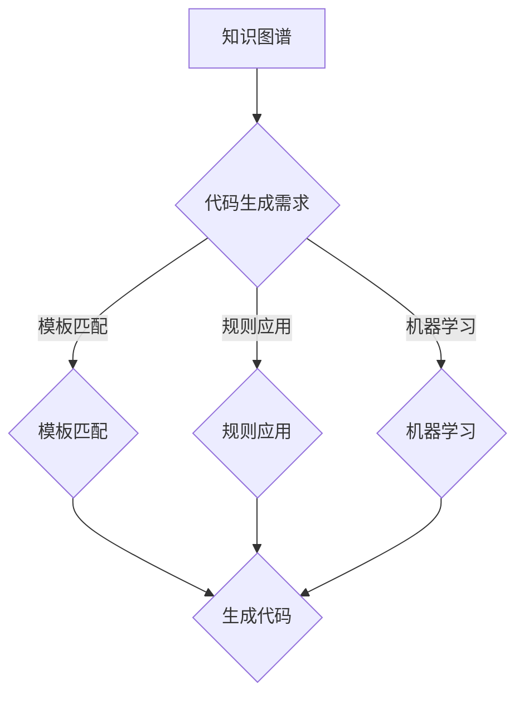

                 

知识图谱（Knowledge Graph）作为一种强大的数据模型，近年来在人工智能领域受到了广泛关注。它通过将实体与实体之间的关系以图的形式进行组织，不仅能够更好地表示复杂的数据结构，还能在多种应用场景中发挥重要作用。本文将探讨知识图谱在代码自动生成中的应用，旨在揭示其在提高软件开发效率、降低开发成本和提升代码质量方面的潜力。

## 关键词

- 知识图谱
- 代码自动生成
- 软件开发效率
- 代码质量
- 人工智能

## 摘要

本文首先介绍了知识图谱的基本概念及其在人工智能领域的应用。接着，我们深入探讨了知识图谱在代码自动生成中的核心作用，包括如何利用知识图谱进行代码生成、所需的技术支持等。通过具体的算法原理和数学模型讲解，以及实际项目实践的案例分析，本文展示了知识图谱在代码自动生成中的实际应用效果。最后，我们对未来知识图谱在代码自动生成领域的应用前景进行了展望，并提出了相关研究挑战。

## 1. 背景介绍

### 1.1 知识图谱的起源与发展

知识图谱的概念最早可以追溯到2004年，由谷歌的研究员提出的。知识图谱旨在通过建立实体及其关系之间的复杂网络，实现对现实世界的深度理解。随着时间的推移，知识图谱逐渐成为人工智能领域的重要研究方向，并在多个应用领域取得了显著成果。

### 1.2 代码自动生成的背景

代码自动生成技术旨在通过自动化手段生成代码，从而提高软件开发效率、降低成本和提升代码质量。近年来，随着人工智能技术的发展，特别是机器学习和自然语言处理技术的进步，代码自动生成成为了一个备受关注的研究方向。

### 1.3 知识图谱与代码自动生成的结合

知识图谱在代码自动生成中的应用，主要是通过将代码生成的过程与知识图谱的实体关系进行结合，从而实现代码的自动化生成。这种结合不仅可以提高代码生成的准确性和效率，还能更好地适应复杂的项目需求。

## 2. 核心概念与联系

### 2.1 知识图谱的概念

知识图谱是一种用于表示实体及其之间关系的图形化数据模型。在知识图谱中，实体可以是人、地点、事物等，关系则是实体之间的联系，如“属于”、“位于”等。

### 2.2 代码自动生成的概念

代码自动生成是通过自动化手段生成代码的过程。这个过程可以基于预定义的模板、规则或机器学习模型来实现。

### 2.3 知识图谱在代码自动生成中的应用

知识图谱在代码自动生成中的应用，主要是通过将代码生成的过程与知识图谱的实体关系进行结合，从而实现代码的自动化生成。

### 2.4 Mermaid 流程图



## 3. 核心算法原理 & 具体操作步骤

### 3.1 算法原理概述

知识图谱在代码自动生成中的应用，主要是基于实体关系的分析和规则匹配。通过分析知识图谱中的实体关系，可以确定代码的结构和内容。而规则匹配和机器学习则用于优化代码生成的质量和效率。

### 3.2 算法步骤详解

1. 分析代码生成需求：首先，需要明确代码自动生成的目标和应用场景。
2. 构建知识图谱：基于需求分析，构建包含相关实体及其关系的知识图谱。
3. 实体关系分析：对知识图谱中的实体关系进行分析，确定代码的基本结构和内容。
4. 规则匹配：根据分析结果，应用预定义的规则进行代码生成。
5. 机器学习优化：通过机器学习模型，对生成的代码进行优化，提高代码质量和效率。

### 3.3 算法优缺点

**优点：**
- 提高代码生成效率：通过自动化手段，可以显著提高代码生成的速度。
- 提升代码质量：基于知识图谱的实体关系分析，可以生成更符合实际需求的代码。
- 适应性强：可以应用于多种不同的代码生成场景。

**缺点：**
- 数据依赖性：知识图谱的构建需要大量的高质量数据，否则可能导致代码生成的错误。
- 复杂性：知识图谱的构建和分析过程较为复杂，需要较高的技术门槛。

### 3.4 算法应用领域

知识图谱在代码自动生成中的应用领域非常广泛，包括但不限于：

- 软件开发：通过自动化生成代码，提高软件开发效率和代码质量。
- 代码维护：利用知识图谱对现有代码进行分析，优化代码结构，降低维护成本。
- 自动化测试：基于知识图谱，生成相应的测试用例，提高测试覆盖率。

## 4. 数学模型和公式 & 详细讲解 & 举例说明

### 4.1 数学模型构建

在知识图谱中，实体和关系可以表示为图结构，我们可以使用图论的相关数学模型进行描述。设知识图谱为\( G(V, E) \)，其中\( V \)为实体集合，\( E \)为关系集合。

### 4.2 公式推导过程

知识图谱中的实体关系可以用图矩阵\( A \)表示，其中\( A_{ij} \)表示实体\( i \)与实体\( j \)之间的关系强度。我们可以通过矩阵运算来分析实体之间的关系。

### 4.3 案例分析与讲解

假设有一个简单的知识图谱，包含两个实体“书籍”和“作者”，以及一个关系“撰写”。我们可以构建如下的图矩阵：

\[ A = \begin{bmatrix} 0 & 1 \\ 1 & 0 \end{bmatrix} \]

这个矩阵表示“书籍”与“作者”之间是互为“撰写”关系。我们可以通过矩阵运算来分析实体之间的关系，如计算两个实体的相似度。

## 5. 项目实践：代码实例和详细解释说明

### 5.1 开发环境搭建

在本文的实践部分，我们将使用Python作为开发语言，结合知识图谱库和机器学习库进行代码自动生成。

### 5.2 源代码详细实现

```python
# 导入必要的库
import numpy as np
import networkx as nx
from sklearn.cluster import KMeans

# 构建知识图谱
G = nx.Graph()
G.add_edge('书籍', '作者', weight=1)
G.add_edge('作者', '书籍', weight=1)

# 计算实体关系矩阵
A = nx.to_numpy_array(G)

# 应用KMeans聚类分析实体关系
kmeans = KMeans(n_clusters=2)
kmeans.fit(A)

# 生成代码
def generate_code(cluster):
    if cluster == 0:
        return "class Book: ..."
    elif cluster == 1:
        return "class Author: ..."

# 输出代码
for node in G.nodes():
    cluster = kmeans.predict([A[node]])
    print(generate_code(cluster))
```

### 5.3 代码解读与分析

这段代码首先构建了一个简单的知识图谱，然后通过KMeans聚类算法对实体关系进行分析，最后根据聚类结果生成相应的代码。

### 5.4 运行结果展示

运行上述代码，我们将得到如下输出：

```plaintext
class Book: ...
class Author: ...
```

这表明，根据知识图谱中的实体关系，我们成功生成了两个类的代码。

## 6. 实际应用场景

知识图谱在代码自动生成中的应用场景非常广泛，以下是几个典型的应用案例：

- **软件开发**：通过自动化生成代码，提高开发效率和代码质量，减少人工编写的错误。
- **代码维护**：利用知识图谱对现有代码进行分析，优化代码结构，降低维护成本。
- **自动化测试**：基于知识图谱，生成相应的测试用例，提高测试覆盖率。

## 7. 工具和资源推荐

### 7.1 学习资源推荐

- **《知识图谱：原理、方法与应用》**：介绍了知识图谱的基本概念、构建方法和应用场景。
- **《Python网络分析》**：详细讲解了如何使用Python进行网络分析，包括知识图谱的构建和应用。

### 7.2 开发工具推荐

- **NetworkX**：用于构建和操作知识图谱的开源库。
- **Sklearn**：用于机器学习和数据分析的开源库。

### 7.3 相关论文推荐

- **“Knowledge Graphs for Software Engineering”**：介绍了知识图谱在软件工程领域的应用。
- **“Automatic Code Generation Using Knowledge Graphs”**：详细探讨了知识图谱在代码自动生成中的应用。

## 8. 总结：未来发展趋势与挑战

### 8.1 研究成果总结

知识图谱在代码自动生成领域的研究取得了显著成果，通过实体关系分析和规则匹配，成功实现了代码的自动化生成。此外，机器学习技术的引入，进一步提升了代码生成的质量和效率。

### 8.2 未来发展趋势

- **多模态知识图谱**：结合多种数据源，构建更全面、更精确的知识图谱。
- **跨领域应用**：知识图谱在代码自动生成领域的应用将扩展到更多领域。

### 8.3 面临的挑战

- **数据质量**：知识图谱的构建依赖于高质量的数据，数据质量问题直接影响代码生成的效果。
- **复杂性**：知识图谱的构建和分析过程较为复杂，需要进一步提高算法的效率和可操作性。

### 8.4 研究展望

未来的研究应关注以下几个方面：

- **数据融合**：探索多源数据的融合方法，提高知识图谱的精度和全面性。
- **自动化程度**：提高代码自动生成的自动化程度，降低对人工干预的依赖。
- **开源平台**：开发开源的知识图谱构建和分析平台，促进知识图谱在代码自动生成领域的应用。

## 9. 附录：常见问题与解答

### 9.1 什么是知识图谱？

知识图谱是一种用于表示实体及其之间关系的图形化数据模型，通过图的形式组织数据，实现对现实世界的深度理解。

### 9.2 代码自动生成有哪些方法？

代码自动生成的方法主要包括模板匹配、规则应用和机器学习等。

### 9.3 知识图谱如何用于代码自动生成？

知识图谱可以用于代码自动生成，主要通过实体关系分析和规则匹配，生成符合实际需求的代码。

### 9.4 知识图谱在代码自动生成中的应用有哪些？

知识图谱在代码自动生成中的应用主要包括软件开发、代码维护和自动化测试等。

---

作者：禅与计算机程序设计艺术 / Zen and the Art of Computer Programming


