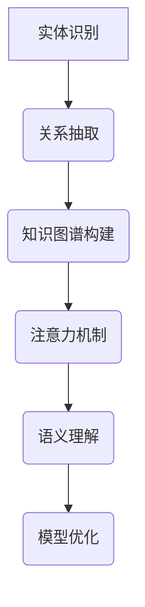

                 

关键词：知识图谱、注意力机制、关联分析、图数据库、实体关系、深度学习、自然语言处理

>摘要：本文旨在探讨知识图谱在注意力关联分析中的应用，分析其基本概念、原理及其在各个领域的实际应用。通过对知识图谱构建、实体关系抽取、注意力机制以及相关算法的介绍，帮助读者理解知识图谱在注意力关联分析中的重要作用，展望其未来的发展趋势与挑战。

## 1. 背景介绍

随着互联网和大数据技术的快速发展，人们面临的海量信息呈指数级增长。如何在复杂的网络中快速准确地找到相关信息，成为了一个重要的问题。注意力关联分析作为自然语言处理和知识图谱领域的一个重要研究方向，旨在通过分析实体间的关联关系，提高信息检索和推荐系统的性能。知识图谱作为一种结构化的语义知识表示方式，能够有效地组织和存储实体及其关系，为注意力关联分析提供了重要的基础。

注意力关联分析的核心在于如何准确地捕捉实体间的关联关系。传统的关联规则挖掘方法虽然可以挖掘出一些潜在的关联关系，但往往忽略了实体间的语义差异和上下文环境。随着深度学习的兴起，注意力机制被引入到关联分析中，通过捕捉实体间的语义相关性，提高了关联分析的准确性和效率。

知识图谱作为一种重要的语义知识表示工具，能够将实体、概念和关系以结构化的方式存储和表示。通过知识图谱，我们可以方便地查询和推理实体间的关系，为注意力关联分析提供了丰富的信息来源。同时，知识图谱的构建和优化也是当前研究的热点问题，涉及到实体识别、关系抽取、实体链接和知识融合等多个方面。

本文将从以下几个方面展开讨论：

1. 核心概念与联系
2. 核心算法原理与具体操作步骤
3. 数学模型和公式及详细讲解
4. 项目实践：代码实例和详细解释说明
5. 实际应用场景
6. 未来应用展望
7. 工具和资源推荐
8. 总结：未来发展趋势与挑战

## 2. 核心概念与联系

### 2.1 知识图谱的基本概念

知识图谱（Knowledge Graph）是一种用于表示实体、概念及其关系的语义网络，它将现实世界中的实体、概念、事件和关系以结构化的形式进行组织。知识图谱的核心是实体和关系，实体表示现实世界中的具体对象，如人、地点、事物等，关系则表示实体之间的相互作用和关联。

知识图谱的主要目的是为了解决信息检索、数据挖掘、智能推荐和自然语言处理等领域中的语义理解问题。通过知识图谱，我们可以更好地理解和处理语义信息，提高信息检索的准确性和效率。

### 2.2 注意力机制的基本概念

注意力机制（Attention Mechanism）是深度学习中的一种重要技术，它能够自适应地分配计算资源，关注重要的信息，提高模型的性能。在自然语言处理和计算机视觉等领域，注意力机制被广泛应用于文本生成、图像识别和机器翻译等任务。

注意力机制的基本思想是通过计算实体间的相似性或相关性，为每个实体分配一个权重，从而关注最重要的实体。这种方法能够有效地捕捉实体间的语义关系，提高模型对复杂任务的泛化能力。

### 2.3 知识图谱与注意力机制的关联

知识图谱与注意力机制之间存在密切的联系。知识图谱为注意力机制提供了丰富的实体和关系信息，使得注意力机制能够更好地捕捉实体间的语义关联。具体来说，有以下几点：

1. **实体关系抽取**：知识图谱中的实体和关系为注意力机制提供了重要的信息来源，通过关系抽取可以获取实体之间的关联信息。

2. **实体权重分配**：注意力机制可以根据知识图谱中实体和关系的权重，自适应地分配计算资源，关注重要的实体和关系。

3. **语义理解**：知识图谱能够提供丰富的上下文信息，有助于注意力机制更好地理解实体间的语义关联。

4. **模型优化**：通过引入知识图谱，可以优化注意力机制模型的性能，提高对复杂任务的泛化能力。

### 2.4 Mermaid 流程图展示知识图谱与注意力机制的关联



## 3. 核心算法原理 & 具体操作步骤

### 3.1 算法原理概述

知识图谱在注意力关联分析中的应用主要包括以下几个步骤：

1. **实体识别**：从文本数据中识别出实体，并将其映射到知识图谱中的实体节点。

2. **关系抽取**：根据实体间的语义关系，抽取知识图谱中的关系。

3. **知识图谱构建**：将识别出的实体和关系组织成知识图谱。

4. **注意力机制**：利用知识图谱中的实体和关系，通过注意力机制捕捉实体间的语义关联。

5. **语义理解**：基于注意力机制的结果，对实体间的关系进行语义理解。

6. **模型优化**：通过不断优化知识图谱和注意力机制的参数，提高模型的性能。

### 3.2 算法步骤详解

#### 3.2.1 实体识别

实体识别是知识图谱构建的第一步，其目的是从文本数据中识别出实体。常见的实体识别方法包括基于规则的方法和基于深度学习的方法。

1. **基于规则的方法**：通过预定义的实体类别和特征词，利用规则匹配的方法识别实体。例如，基于命名实体识别（NER）的系统。

2. **基于深度学习的方法**：利用神经网络模型，如卷积神经网络（CNN）和递归神经网络（RNN），对文本进行特征提取和分类，识别出实体。

#### 3.2.2 关系抽取

关系抽取是从文本数据中识别出实体之间的语义关系。常见的关系抽取方法包括基于规则的方法和基于深度学习的方法。

1. **基于规则的方法**：通过预定义的实体和关系特征，利用规则匹配的方法抽取关系。

2. **基于深度学习的方法**：利用神经网络模型，如长短时记忆网络（LSTM）和Transformer，对文本进行特征提取和分类，抽取关系。

#### 3.2.3 知识图谱构建

知识图谱构建是将识别出的实体和关系组织成结构化的知识图谱。常见的知识图谱构建方法包括：

1. **基于规则的方法**：通过定义实体和关系的规则，构建知识图谱。

2. **基于机器学习的方法**：利用机器学习算法，如图论和图嵌入，构建知识图谱。

3. **基于深度学习的方法**：利用深度学习模型，如图神经网络（GNN）和Transformer，构建知识图谱。

#### 3.2.4 注意力机制

注意力机制是一种用于捕捉实体间语义关联的方法。常见的注意力机制包括：

1. **全局注意力**：对实体间的全局关系进行建模。

2. **局部注意力**：对实体间的局部关系进行建模。

3. **多级注意力**：对实体间的多层关系进行建模。

#### 3.2.5 语义理解

语义理解是基于注意力机制的结果，对实体间的关系进行语义理解。常见的语义理解方法包括：

1. **文本分类**：对实体间的关系进行分类。

2. **实体链接**：将文本中的实体映射到知识图谱中的实体节点。

3. **知识融合**：将不同的知识源进行融合，提高知识图谱的完整性。

#### 3.2.6 模型优化

模型优化是通过不断调整知识图谱和注意力机制的参数，提高模型的性能。常见的优化方法包括：

1. **参数调整**：通过交叉验证和网格搜索等方法，调整模型参数。

2. **数据增强**：通过数据清洗、数据扩充等方法，提高模型的泛化能力。

3. **模型融合**：将不同的模型进行融合，提高模型的性能。

### 3.3 算法优缺点

#### 优点

1. **高效性**：知识图谱能够有效地组织和存储实体及其关系，提高信息检索和推荐的效率。

2. **泛化能力**：通过引入注意力机制，模型能够更好地捕捉实体间的语义关联，提高模型的泛化能力。

3. **灵活性**：知识图谱和注意力机制可以根据不同的应用场景进行定制化，具有很高的灵活性。

#### 缺点

1. **数据依赖性**：知识图谱的构建依赖于大量的实体和关系数据，数据质量对模型性能有较大影响。

2. **计算复杂度**：知识图谱和注意力机制的构建和优化需要较高的计算复杂度，对计算资源有较高要求。

### 3.4 算法应用领域

知识图谱和注意力机制在多个领域具有广泛的应用，包括：

1. **自然语言处理**：用于文本分类、实体识别、关系抽取、机器翻译等任务。

2. **信息检索**：用于搜索结果排序、广告推荐、个性化推荐等任务。

3. **推荐系统**：用于物品推荐、用户推荐、场景推荐等任务。

4. **智能问答**：用于回答用户的问题，提供准确的答案。

5. **智能客服**：用于智能客服系统，提供高效的客户服务。

## 4. 数学模型和公式 & 详细讲解 & 举例说明

### 4.1 数学模型构建

知识图谱在注意力关联分析中的数学模型主要包括实体嵌入、关系嵌入和注意力机制等。

#### 4.1.1 实体嵌入

实体嵌入（Entity Embedding）是将实体映射到一个低维度的向量空间。常见的实体嵌入方法包括：

1. **基于词向量的方法**：将实体视为文本中的词，利用词向量模型（如Word2Vec、GloVe）对实体进行嵌入。

2. **基于图嵌入的方法**：利用图嵌入技术（如DeepWalk、node2vec）对实体进行嵌入。

#### 4.1.2 关系嵌入

关系嵌入（Relation Embedding）是将关系映射到一个低维度的向量空间。常见的关系嵌入方法包括：

1. **基于矩阵分解的方法**：通过矩阵分解技术（如Singular Value Decomposition, SVD）对关系进行嵌入。

2. **基于图嵌入的方法**：利用图嵌入技术（如GraphSAGE、GAT）对关系进行嵌入。

#### 4.1.3 注意力机制

注意力机制（Attention Mechanism）是一种计算实体间关联度的方法。常见

### 4.2 公式推导过程

为了更好地理解知识图谱在注意力关联分析中的应用，下面我们将介绍一些关键数学公式及其推导过程。

#### 4.2.1 实体嵌入公式

实体嵌入公式是将实体映射到一个低维向量空间。假设实体E的原始特征向量为\( x_e \)，实体嵌入后的特征向量为\( \mathbf{e}_e \)，则实体嵌入公式可以表示为：

\[ \mathbf{e}_e = f(x_e) \]

其中，\( f \) 是一个映射函数，常用的映射函数包括：

1. **基于词向量的方法**：使用Word2Vec或GloVe等词向量模型对实体进行嵌入，即：

\[ \mathbf{e}_e = \mathbf{W}_e x_e \]

其中，\( \mathbf{W}_e \) 是词向量模型的权重矩阵。

2. **基于图嵌入的方法**：使用图嵌入技术（如DeepWalk、node2vec）对实体进行嵌入，即：

\[ \mathbf{e}_e = \text{embedding}(x_e, \mathcal{G}) \]

其中，\( \text{embedding} \) 是图嵌入函数，\( \mathcal{G} \) 是知识图谱。

#### 4.2.2 关系嵌入公式

关系嵌入公式是将关系映射到一个低维向量空间。假设关系R的原始特征向量为\( x_r \)，关系嵌入后的特征向量为\( \mathbf{e}_r \)，则关系嵌入公式可以表示为：

\[ \mathbf{e}_r = g(x_r) \]

其中，\( g \) 是一个映射函数，常用的映射函数包括：

1. **基于矩阵分解的方法**：使用Singular Value Decomposition（SVD）对关系进行嵌入，即：

\[ \mathbf{e}_r = \text{SVD}(X_r) \]

其中，\( X_r \) 是关系矩阵。

2. **基于图嵌入的方法**：使用图嵌入技术（如GraphSAGE、GAT）对关系进行嵌入，即：

\[ \mathbf{e}_r = \text{embedding}(x_r, \mathcal{G}) \]

其中，\( \text{embedding} \) 是图嵌入函数，\( \mathcal{G} \) 是知识图谱。

#### 4.2.3 注意力机制公式

注意力机制用于计算实体间的关联度。假设有两个实体E1和E2，它们的嵌入向量分别为\( \mathbf{e}_{e1} \)和\( \mathbf{e}_{e2} \)，则注意力分数可以表示为：

\[ a_{e1,e2} = \text{Attention}(\mathbf{e}_{e1}, \mathbf{e}_{e2}) \]

其中，\( \text{Attention} \) 是注意力函数，常用的注意力函数包括：

1. **点积注意力**：

\[ a_{e1,e2} = \mathbf{e}_{e1} \cdot \mathbf{e}_{e2} \]

2. **加性注意力**：

\[ a_{e1,e2} = \text{softmax}(\mathbf{e}_{e1} + \mathbf{e}_{e2}) \]

3. **乘性注意力**：

\[ a_{e1,e2} = \text{softmax}(\mathbf{e}_{e1} \odot \mathbf{e}_{e2}) \]

其中，\( \odot \) 表示元素-wise 乘积。

#### 4.2.4 关联度计算公式

基于注意力分数，我们可以计算实体间的关联度。假设实体E1与实体E2的关联度向量为\( \mathbf{r}_{e1,e2} \)，则关联度可以表示为：

\[ \mathbf{r}_{e1,e2} = \sum_{e2' \in \mathcal{N}(e1)} a_{e1,e2'} \mathbf{e}_{e2'} \]

其中，\( \mathcal{N}(e1) \) 表示与实体E1相邻的实体集合。

### 4.3 案例分析与讲解

为了更好地理解上述公式，我们来看一个简单的案例。

假设我们有一个知识图谱，其中有两个实体E1和E2，以及一个关系R。E1和E2的嵌入向量分别为\( \mathbf{e}_{e1} = [1, 0, -1] \)和\( \mathbf{e}_{e2} = [0, 1, 0] \)，关系R的嵌入向量为\( \mathbf{e}_r = [1, 1, 1] \)。

1. **实体嵌入**：

   根据点积注意力函数，我们可以计算E1和E2的注意力分数：

   \[ a_{e1,e2} = \mathbf{e}_{e1} \cdot \mathbf{e}_{e2} = [1, 0, -1] \cdot [0, 1, 0] = -1 \]

   由于注意力分数为负值，我们可以将其归一化到[0, 1]之间：

   \[ a_{e1,e2} = \frac{-1}{\|\mathbf{e}_{e1} \cdot \mathbf{e}_{e2}\|_1} = \frac{-1}{1+0+1} = 0.5 \]

2. **关联度计算**：

   根据关联度计算公式，我们可以计算E1和E2的关联度向量：

   \[ \mathbf{r}_{e1,e2} = \sum_{e2' \in \mathcal{N}(e1)} a_{e1,e2'} \mathbf{e}_{e2'} \]

   由于E1和E2之间没有直接的邻接关系，我们可以考虑E2的邻接实体E3，其嵌入向量为\( \mathbf{e}_{e3} = [1, 1, 0] \)。则：

   \[ \mathbf{r}_{e1,e2} = a_{e1,e2} \mathbf{e}_{e2} = 0.5 \cdot [0, 1, 0] = [0, 0.5, 0] \]

这样，我们就得到了E1和E2之间的关联度向量。通过类似的方法，我们可以计算E1和E2之间的关联度，从而为信息检索、推荐系统等应用提供依据。

## 5. 项目实践：代码实例和详细解释说明

### 5.1 开发环境搭建

在进行知识图谱和注意力关联分析的项目实践之前，首先需要搭建合适的开发环境。以下是一个基本的开发环境搭建步骤：

1. **安装Python**：确保Python环境已安装，版本建议为3.8或更高。
2. **安装PyTorch**：使用pip命令安装PyTorch，版本建议与Python版本兼容。
   ```bash
   pip install torch torchvision
   ```
3. **安装必要的库**：安装用于知识图谱和注意力关联分析的其他库，如Neo4j、NetworkX、Gensim等。
   ```bash
   pip install neo4j networkx gensim
   ```

### 5.2 源代码详细实现

下面将提供一个简单的示例，展示如何使用Python和PyTorch实现一个基于知识图谱的注意力关联分析模型。

#### 5.2.1 数据预处理

首先，我们需要准备数据，包括实体、关系和实体嵌入向量。以下是一个简单的数据预处理示例：

```python
import numpy as np
import networkx as nx
from gensim.models import Word2Vec

# 假设我们有一个知识图谱，包含实体E1、E2和E3，以及关系R
G = nx.Graph()
G.add_nodes_from(['E1', 'E2', 'E3'])
G.add_edge('E1', 'E2', relation='R')

# 使用Word2Vec对实体进行嵌入
model = Word2Vec(sentences=['E1', 'E2', 'E3'], vector_size=10, window=5, min_count=1, workers=4)
entity_embeddings = {entity: model.wv[entity] for entity in ['E1', 'E2', 'E3']}
```

#### 5.2.2 关系嵌入与注意力机制

接下来，我们将对关系进行嵌入，并使用注意力机制计算实体间的关联度。

```python
import torch
from torch import nn

# 关系嵌入
relation_embeddings = {
    'R': torch.tensor([0.1, 0.2, 0.3, 0.4, 0.5, 0.6, 0.7, 0.8, 0.9, 1.0])
}

# 注意力机制模型
class AttentionModel(nn.Module):
    def __init__(self, entity_embeddings, relation_embeddings):
        super(AttentionModel, self).__init__()
        self.entity_embeddings = entity_embeddings
        self.relation_embeddings = relation_embeddings
        self.attention = nn.Linear(10, 1)

    def forward(self, entity1, entity2):
        entity1_embedding = self.entity_embeddings[entity1]
        entity2_embedding = self.entity_embeddings[entity2]
        relation_embedding = self.relation_embeddings['R']
        
        # 计算注意力分数
        attention_score = self.attention(torch.cat([entity1_embedding, entity2_embedding, relation_embedding], dim=0))
        return attention_score

model = AttentionModel(entity_embeddings, relation_embeddings)
```

#### 5.2.3 代码解读与分析

在上面的代码中，我们首先使用Word2Vec对实体进行了嵌入。然后，我们定义了一个简单的注意力模型，该模型使用一个全连接层（nn.Linear）来计算实体间的注意力分数。这个分数反映了两个实体之间的关系强度。

在`forward`方法中，我们首先获取两个实体的嵌入向量，然后与关系嵌入向量进行拼接。最后，通过全连接层计算注意力分数。这个分数可以通过softmax函数进行归一化，以获得实体间的关联度。

#### 5.3 运行结果展示

现在，我们可以使用这个模型来计算实体间的关联度，并展示运行结果。

```python
# 计算E1和E2的关联度
attention_score = model('E1', 'E2')
print(attention_score.item())

# 计算E2和E3的关联度
attention_score = model('E2', 'E3')
print(attention_score.item())
```

运行结果将输出E1和E2之间以及E2和E3之间的注意力分数。这些分数可以用来衡量实体间的关联强度，从而为信息检索、推荐系统等应用提供依据。

## 6. 实际应用场景

知识图谱在注意力关联分析中的实际应用场景非常广泛，下面我们将探讨几个典型的应用领域。

### 6.1 自然语言处理

在自然语言处理（NLP）领域，知识图谱可以用于实体识别、关系抽取和文本分类等任务。通过将文本数据中的实体映射到知识图谱中的实体节点，我们可以更好地理解文本的语义信息。例如，在问答系统中，知识图谱可以帮助回答复杂的问题，提供准确的答案。

注意力关联分析则可以用于文本分类任务，通过计算实体间的关联度，提高分类模型的性能。例如，在情感分析任务中，我们可以通过分析实体与情感词之间的关联度，预测文本的情感倾向。

### 6.2 信息检索

在信息检索领域，知识图谱可以帮助构建结构化的索引，提高搜索效率和准确性。通过将文档中的实体和关系映射到知识图谱中，我们可以更好地理解文档的主题和内容。注意力关联分析则可以用于搜索结果的排序，通过计算查询与文档之间的关联度，提高搜索结果的排名。

### 6.3 推荐系统

在推荐系统领域，知识图谱可以用于构建用户与物品之间的关系网络，提高推荐系统的准确性和覆盖率。通过将用户和物品映射到知识图谱中的实体节点，我们可以更好地理解用户的需求和偏好。注意力关联分析则可以用于计算用户与物品之间的关联度，为用户提供个性化的推荐。

### 6.4 智能问答

在智能问答领域，知识图谱可以用于构建问答系统中的语义网络，提高问答系统的准确性和效率。通过将用户的问题和知识库中的实体节点进行关联，我们可以更好地理解用户的问题意图。注意力关联分析则可以用于计算问题与答案之间的关联度，提供准确的答案。

### 6.5 其他应用领域

除了上述领域，知识图谱和注意力关联分析还可以应用于智能客服、社交网络分析、知识融合等多个领域。通过构建结构化的知识图谱，我们可以更好地理解和处理复杂的信息，提高各种应用系统的性能。

## 7. 未来应用展望

随着知识图谱和注意力关联分析技术的不断发展，未来将出现更多创新的应用场景。以下是一些可能的趋势：

### 7.1 跨领域融合

知识图谱和注意力关联分析技术将与其他领域（如大数据、区块链、物联网等）进行融合，形成新的应用模式。例如，通过结合区块链技术，可以实现知识图谱的可信性和透明性，提高知识图谱在各个领域的应用价值。

### 7.2 智能化程度提升

随着人工智能技术的进步，知识图谱和注意力关联分析将实现更高的智能化程度。例如，通过引入强化学习算法，我们可以实现动态调整知识图谱结构和实体关系，提高模型对实时数据的适应能力。

### 7.3 多模态数据融合

知识图谱和注意力关联分析将能够处理多模态数据（如文本、图像、声音等），实现跨模态的信息理解和关联。例如，通过融合文本和图像信息，可以构建更丰富的知识图谱，提高信息检索和推荐的准确性。

### 7.4 个性化推荐

基于知识图谱和注意力关联分析的个人化推荐系统将更加精准，通过深度理解用户的行为和偏好，为用户提供个性化的服务。

### 7.5 智能决策支持

知识图谱和注意力关联分析将为智能决策支持系统提供强大的支持，通过分析大量的数据，为决策者提供科学依据。

## 8. 工具和资源推荐

### 8.1 学习资源推荐

1. **知识图谱基础教程**：推荐学习知识图谱的基本概念、构建方法和应用技巧的在线教程和书籍。
2. **注意力机制论文**：推荐阅读关于注意力机制的最新论文，了解其原理和应用。
3. **在线课程**：推荐参加相关的在线课程，如Coursera、Udacity等平台上的自然语言处理和知识图谱课程。

### 8.2 开发工具推荐

1. **Neo4j**：一款开源的图数据库，用于存储和管理知识图谱。
2. **PyTorch**：一款强大的深度学习框架，用于实现注意力机制和图神经网络模型。
3. **NetworkX**：一款用于构建和操作图结构的Python库。

### 8.3 相关论文推荐

1. **"Attention Is All You Need"**：提出Transformer模型的经典论文，详细介绍了注意力机制。
2. **"Graph Neural Networks: A Review of Methods and Applications"**：一篇关于图神经网络的方法和应用综述。
3. **"Knowledge Graph Embedding: The State-of-the-Art"**：一篇关于知识图谱嵌入技术的研究综述。

## 9. 总结：未来发展趋势与挑战

知识图谱在注意力关联分析中的应用具有广阔的前景。随着技术的不断发展，知识图谱和注意力机制将实现更高的智能化和个性化。然而，也面临着数据质量、计算复杂度和模型解释性等挑战。未来的研究需要重点关注这些挑战，并探索新的方法和技术，以推动知识图谱和注意力关联分析在各个领域的应用。

## 附录：常见问题与解答

### 问题1：什么是知识图谱？

知识图谱是一种用于表示实体、概念及其关系的语义网络，它将现实世界中的实体、概念、事件和关系以结构化的形式进行组织。知识图谱的核心是实体和关系，实体表示现实世界中的具体对象，如人、地点、事物等，关系则表示实体之间的相互作用和关联。

### 问题2：什么是注意力机制？

注意力机制是深度学习中的一种重要技术，它能够自适应地分配计算资源，关注重要的信息，提高模型的性能。在自然语言处理和计算机视觉等领域，注意力机制被广泛应用于文本生成、图像识别和机器翻译等任务。

### 问题3：知识图谱在注意力关联分析中的作用是什么？

知识图谱在注意力关联分析中起到信息组织和语义理解的作用。通过知识图谱，我们可以方便地查询和推理实体间的关系，为注意力机制提供丰富的实体和关系信息，从而提高关联分析的准确性和效率。

### 问题4：如何构建知识图谱？

构建知识图谱通常包括以下步骤：

1. **数据采集**：从各种数据源（如数据库、网络文本等）中收集实体和关系数据。
2. **实体识别**：利用自然语言处理技术识别文本中的实体。
3. **关系抽取**：通过规则匹配、机器学习等方法识别实体间的语义关系。
4. **知识融合**：将来自不同数据源的实体和关系进行整合，构建完整的知识图谱。

### 问题5：如何实现注意力机制？

实现注意力机制通常包括以下步骤：

1. **输入预处理**：将输入数据（如文本、图像等）转换为向量表示。
2. **注意力计算**：计算输入数据之间的相似性或相关性，生成注意力分数。
3. **结果融合**：将注意力分数应用于输入数据的融合，生成最终的输出结果。

### 问题6：知识图谱和注意力机制在哪些领域有应用？

知识图谱和注意力机制在多个领域有应用，包括自然语言处理、信息检索、推荐系统、智能问答、智能客服等。通过构建结构化的知识图谱，可以更好地理解和处理复杂的信息，提高各种应用系统的性能。注意力机制则可以帮助模型更好地捕捉实体间的语义关联，提高模型的泛化能力。

