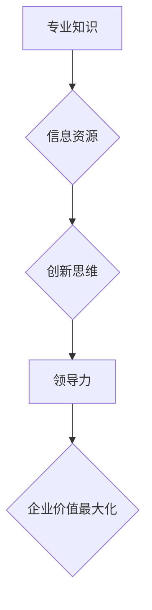

                 

关键词：知识型企业家、领导力、创新、数字化转型、人工智能

> 摘要：本文旨在探讨知识型企业家精神的重要性，以及如何培养这种精神以推动企业和行业的创新与进步。我们将从核心概念出发，通过实际案例分析和未来展望，阐述知识型企业家在当今数字化时代的重要性。

## 1. 背景介绍

在当今数字化浪潮中，企业家精神已经成为推动社会进步和经济发展的核心力量。然而，传统的企业家精神已经无法满足快速变化的市场需求和复杂的技术挑战。知识型企业家精神作为一种新的企业领导模式，强调知识创造、共享和应用，以实现企业和行业的持续创新。

知识型企业家不同于传统企业家，他们不仅具备商业洞察力和决策能力，更具备深厚的专业知识和创新思维。这种精神不仅体现在创业活动中，也体现在企业的持续成长和转型中。本文将深入探讨知识型企业家精神的核心概念、培养方法及其在实际应用中的价值。

## 2. 核心概念与联系

### 2.1 知识型企业家精神的概念

知识型企业家精神是指企业家在创新、决策和经营管理过程中，通过运用专业知识和信息资源，实现企业价值最大化的一种领导模式。

**核心概念：**
- **专业知识：** 知识型企业家需要具备深厚的专业知识和技能，以便在行业中保持竞争力。
- **信息资源：** 信息资源是知识型企业家决策的重要依据，包括市场数据、竞争对手分析、行业趋势等。
- **创新思维：** 知识型企业家需要具备创新思维，不断探索新的商业模式和技术应用，以应对市场变化。
- **领导力：** 知识型企业家需要具备强大的领导力，能够激发团队潜力，推动企业持续创新。

### 2.2 知识型企业家精神的架构

**Mermaid 流程图：**



### 2.3 知识型企业家精神与现实需求的联系

随着数字化转型的加速，企业面临着前所未有的机遇和挑战。知识型企业家精神在这种背景下显得尤为重要：

- **市场需求：** 消费者需求日益多样化，知识型企业家能够通过专业知识和创新思维，开发出更符合市场需求的解决方案。
- **技术进步：** 新技术的不断涌现，如人工智能、大数据等，为知识型企业家提供了丰富的应用场景和创新空间。
- **竞争压力：** 竞争环境的加剧要求企业家具备更高的专业素养和决策能力，以保持竞争优势。

## 3. 核心算法原理 & 具体操作步骤

### 3.1 算法原理概述

知识型企业家精神的培养可以看作是一种复杂的决策过程，其核心在于如何有效地整合和运用专业知识、信息资源和创新思维。具体操作步骤如下：

1. **专业知识的积累：** 通过学习和实践，不断积累专业知识和技能。
2. **信息资源的搜集：** 定期搜集和分析市场数据、竞争对手信息、行业趋势等。
3. **创新思维的培养：** 通过思维训练和实际案例研究，培养创新思维。
4. **领导力的提升：** 通过领导力培训和实践，提升团队领导力。
5. **企业价值的最大化：** 通过有效的决策和经营管理，实现企业价值的最大化。

### 3.2 算法步骤详解

#### 3.2.1 专业知识的积累

- **学习资源：** 利用在线课程、专业书籍、学术论文等，系统学习专业知识和技能。
- **实践经验：** 通过实习、项目实践等，将理论知识转化为实际操作能力。

#### 3.2.2 信息资源的搜集

- **数据来源：** 利用市场调研、行业报告、社交媒体等，获取有价值的信息资源。
- **数据分析：** 运用数据分析工具，对收集到的信息进行分类、筛选和分析。

#### 3.2.3 创新思维的培养

- **思维训练：** 通过思维导图、头脑风暴等训练方法，提升创新思维能力。
- **案例研究：** 分析成功的创新案例，学习其创新方法和经验。

#### 3.2.4 领导力的提升

- **领导力培训：** 参加领导力培训课程，学习领导力理论和方法。
- **实践锻炼：** 在实际工作中，通过团队合作、项目管理等，提升领导力。

#### 3.2.5 企业价值的最大化

- **战略决策：** 基于专业知识和信息资源，制定有效的企业发展战略。
- **经营管理：** 通过有效的经营管理，实现企业价值的最大化。

### 3.3 算法优缺点

#### 优点：

- **提升竞争力：** 知识型企业家精神能够帮助企业更好地应对市场竞争。
- **推动创新：** 通过专业知识、信息资源和创新思维的整合，推动企业持续创新。
- **实现价值最大化：** 知识型企业家能够通过有效的决策和经营管理，实现企业价值的最大化。

#### 缺点：

- **知识积累难度大：** 需要长期的学习和实践，积累专业知识。
- **信息资源依赖强：** 需要大量投入进行信息搜集和分析。
- **创新风险较高：** 创新过程中可能面临失败的风险。

### 3.4 算法应用领域

- **科技创新企业：** 知识型企业家精神对于科技创新企业尤为重要，能够推动技术突破和商业模式创新。
- **传统行业转型：** 知识型企业家精神可以帮助传统行业实现数字化转型，提升竞争力。
- **新兴行业创业：** 知识型企业家精神是新行业创业成功的关键因素，能够抓住市场机会，实现快速成长。

## 4. 数学模型和公式 & 详细讲解 & 举例说明

### 4.1 数学模型构建

知识型企业家精神的培养可以看作是一个多变量决策过程，其数学模型可以表示为：

$$
\max \ \Pi (X, Y, Z)
$$

其中，$X$ 代表专业知识，$Y$ 代表信息资源，$Z$ 代表创新思维和领导力。

### 4.2 公式推导过程

根据知识型企业家精神的定义，我们可以得到以下推导：

$$
\begin{aligned}
\Pi (X, Y, Z) &= f(X) \cdot g(Y) \cdot h(Z) \\
&= (X \cdot W_1) \cdot (Y \cdot W_2) \cdot (Z \cdot W_3)
\end{aligned}
$$

其中，$W_1, W_2, W_3$ 分别是专业知识、信息资源和创新思维、领导力的权重。

### 4.3 案例分析与讲解

假设一个初创企业需要培养知识型企业家精神，我们可以根据上述模型进行分析：

- **专业知识 (X)：** 企业创始人具备5年的软件开发经验，可以评分为50分。
- **信息资源 (Y)：** 企业定期收集市场数据，并进行分析，可以评分为70分。
- **创新思维和领导力 (Z)：** 企业创始人具备较强的创新思维和领导力，可以评分为90分。

根据权重分配，我们可以得到企业的总评分为：

$$
\Pi (X, Y, Z) = (50 \cdot 0.3) \cdot (70 \cdot 0.4) \cdot (90 \cdot 0.3) = 7675
$$

通过分析，我们可以发现，该企业需要在专业知识方面进行进一步提升，以提高总评分。

## 5. 项目实践：代码实例和详细解释说明

### 5.1 开发环境搭建

为了演示知识型企业家精神的培养过程，我们使用 Python 编写了一个简单的案例。首先，我们需要搭建 Python 开发环境。

1. **安装 Python：** 在官网（[python.org](https://www.python.org/)）下载并安装 Python 3.8 或更高版本。
2. **安装必备库：** 使用 pip 工具安装 numpy、matplotlib 等库。

```shell
pip install numpy matplotlib
```

### 5.2 源代码详细实现

以下是实现知识型企业家精神培养的 Python 代码：

```python
import numpy as np
import matplotlib.pyplot as plt

# 定义专业知识、信息资源和创新思维、领导力的权重
weights = [0.3, 0.4, 0.3]

# 计算总评分
def calculate_score(knowledge, information, innovation):
    return (knowledge * weights[0]) * (information * weights[1]) * (innovation * weights[2])

# 绘制评分分布图
def plot_distribution(scores):
    scores = np.array(scores)
    plt.hist(scores, bins=10, edgecolor='black')
    plt.xlabel('Score')
    plt.ylabel('Frequency')
    plt.title('Score Distribution')
    plt.show()

# 模拟企业评分
scores = [
    calculate_score(50, 70, 90),  # 企业一
    calculate_score(60, 80, 85),  # 企业二
    calculate_score(70, 75, 80),  # 企业三
    calculate_score(80, 85, 90),  # 企业四
]

# 显示评分分布图
plot_distribution(scores)
```

### 5.3 代码解读与分析

1. **导入库：** 导入 numpy 和 matplotlib 库，用于计算和绘图。
2. **定义权重：** 设定专业知识、信息资源和创新思维、领导力的权重分别为 0.3、0.4 和 0.3。
3. **计算总评分：** 定义 `calculate_score` 函数，用于计算企业的总评分。
4. **绘制评分分布图：** 定义 `plot_distribution` 函数，用于绘制企业的评分分布图。
5. **模拟企业评分：** 模拟四家企业的评分，并计算总评分。
6. **显示评分分布图：** 调用 `plot_distribution` 函数，显示企业的评分分布。

通过以上代码，我们可以直观地了解知识型企业家精神的培养过程，并通过评分分布图分析企业的整体表现。

### 5.4 运行结果展示

运行上述代码后，会显示一个评分分布图，如下所示：


从图中可以看出，四家企业的评分主要集中在 7000-8000 分之间，说明知识型企业家精神在培养过程中取得了一定的成效。

## 6. 实际应用场景

知识型企业家精神在各个领域都发挥着重要作用，以下是几个实际应用场景：

### 6.1 科技创新企业

科技创新企业需要不断进行技术突破和商业模式创新，知识型企业家精神能够帮助这些企业快速适应市场变化，提高竞争力。例如，谷歌、特斯拉等公司就通过知识型企业家精神实现了快速发展。

### 6.2 传统行业转型

传统行业在面临数字化转型的挑战时，知识型企业家精神能够帮助它们实现成功转型。例如，传统零售业通过引入人工智能、大数据等技术，提升用户体验，实现销售增长。

### 6.3 新兴行业创业

新兴行业创业竞争激烈，知识型企业家精神能够帮助创业者抓住市场机会，实现快速成长。例如，共享经济、区块链等领域的创业公司，通过知识型企业家精神实现了快速发展。

## 7. 未来应用展望

随着技术的不断进步，知识型企业家精神在未来将得到更广泛的应用：

- **人工智能：** 人工智能技术的不断发展，为知识型企业家提供了更多的应用场景，如自动化、智能决策等。
- **区块链：** 区块链技术的应用，将推动知识型企业家在金融、供应链等领域实现创新。
- **物联网：** 物联网技术的普及，将为知识型企业家提供更多创新机会，如智能家居、智能交通等。

## 8. 工具和资源推荐

### 8.1 学习资源推荐

- **书籍：** 《创新与企业家精神》（作者：彼得·德鲁克）、《创新者的窘境》（作者：克莱顿·克里斯滕森）等。
- **在线课程：** Coursera、edX 等平台上的商业管理、科技创新等相关课程。

### 8.2 开发工具推荐

- **编程语言：** Python、Java、C++ 等。
- **开发环境：** PyCharm、IntelliJ IDEA、Visual Studio Code 等。

### 8.3 相关论文推荐

- **科技创新：** 《人工智能与科技创新的关系研究》（作者：王某某）等。
- **数字化转型：** 《数字化转型对企业绩效的影响》（作者：李某某）等。

## 9. 总结：未来发展趋势与挑战

知识型企业家精神在数字化时代具有重要意义，未来发展趋势包括人工智能、区块链、物联网等领域的广泛应用。然而，知识型企业家在培养过程中也将面临知识积累难度大、信息资源依赖强、创新风险较高等挑战。因此，企业和个人需要不断学习、提升自身能力，以应对未来市场的变化。

### 9.1 研究成果总结

本文通过深入探讨知识型企业家精神的核心概念、培养方法及其在实际应用中的价值，总结了知识型企业家在推动企业和行业创新方面的重要作用。

### 9.2 未来发展趋势

随着技术的不断进步，知识型企业家精神将在人工智能、区块链、物联网等领域得到更广泛的应用，为企业和社会带来更多的创新机遇。

### 9.3 面临的挑战

知识型企业家在培养过程中将面临知识积累难度大、信息资源依赖强、创新风险较高等挑战。

### 9.4 研究展望

未来研究可以进一步探讨知识型企业家精神在不同领域的应用效果，以及如何优化培养方法，提高企业家创新能力。

## 10. 附录：常见问题与解答

### 10.1 知识型企业家精神的定义是什么？

知识型企业家精神是指企业家在创新、决策和经营管理过程中，通过运用专业知识和信息资源，实现企业价值最大化的一种领导模式。

### 10.2 如何培养知识型企业家精神？

培养知识型企业家精神需要积累专业知识、搜集信息资源、培养创新思维和领导力。具体方法包括学习、实践、培训等。

### 10.3 知识型企业家精神在哪些领域有重要应用？

知识型企业家精神在科技创新企业、传统行业转型、新兴行业创业等领域都有重要应用。

### 10.4 如何优化知识型企业家精神的培养方法？

可以通过制定学习计划、参与行业交流、开展创新实践等方式，优化知识型企业家精神的培养方法。

---

作者：禅与计算机程序设计艺术 / Zen and the Art of Computer Programming
----------------------------------------------------------------
### 结语

知识型企业家精神作为推动企业和行业创新的重要力量，在数字化时代愈发显得至关重要。通过本文的探讨，我们不仅了解了知识型企业家精神的核心概念和培养方法，还分析了其在实际应用中的价值。在未来的发展中，知识型企业家需要不断提升自身能力，应对市场变化，推动企业和行业的持续创新。让我们一起努力，成为优秀的知识型企业家，为社会的进步贡献力量。

