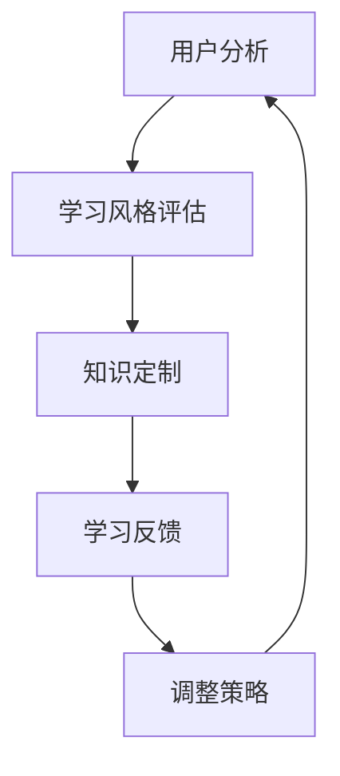

                 

关键词：知识个性化，学习风格，认知心理学，教育技术，算法原理，数学模型，项目实践，应用场景，未来展望

> 摘要：本文探讨了知识个性化的重要性以及如何根据不同学习风格进行知识传递。通过结合认知心理学、教育技术和算法原理，我们提出了一种新的个性化学习方法，并展示了其实际应用案例。文章旨在为教育工作者、软件开发者和学习爱好者提供参考，帮助他们更好地理解和应对多样化的学习需求。

## 1. 背景介绍

随着信息技术的迅猛发展，知识获取变得更加便捷，但与此同时，学习方式的多样性和复杂性也日益增加。传统的“一刀切”的教育模式已难以满足个性化学习的需求。不同学习风格的学生在面对同一知识内容时，表现出了不同的认知和接受能力。这种差异使得知识传递的过程变得更加复杂和具有挑战性。

知识的个性化不仅关乎教育领域，也对软件开发、知识管理、企业培训等多个领域产生了深远影响。因此，理解学习风格、设计适应不同学习风格的知识传递方法，已成为当前研究的热点。

本文将从以下方面展开讨论：

1. **核心概念与联系**：介绍与知识个性化相关的基本概念，并绘制流程图展示其内在联系。
2. **核心算法原理 & 具体操作步骤**：详细解释个性化算法的原理和操作步骤。
3. **数学模型和公式 & 举例说明**：探讨用于知识个性化的数学模型和公式，并结合案例进行说明。
4. **项目实践：代码实例和详细解释说明**：通过一个实际项目，展示个性化算法的具体实现。
5. **实际应用场景**：分析个性化学习在不同领域的应用。
6. **未来应用展望**：讨论知识个性化的发展趋势和面临的挑战。
7. **工具和资源推荐**：推荐相关学习和开发资源。
8. **总结与展望**：总结研究成果，并对未来进行展望。

## 2. 核心概念与联系

### 2.1. 学习风格

学习风格是指个体在学习过程中所表现出来的独特认知和行为模式。不同的学习风格包括视觉型、听觉型、动手操作型等。理解学习风格对于设计个性化学习方案至关重要。

### 2.2. 认知心理学

认知心理学研究人类思维、感知和记忆等认知过程。它为我们提供了理解学习风格和认知过程的科学基础。

### 2.3. 教育技术

教育技术涉及使用计算机、互联网和其他技术手段进行教学和学习。它为个性化学习提供了技术支持。

### 2.4. 算法原理

个性化算法的核心是利用数据挖掘、机器学习和深度学习等技术，根据学习者的行为和反馈，动态调整学习内容和方法。

### 2.5. Mermaid 流程图

以下是一个简化的Mermaid流程图，展示了知识个性化流程的核心步骤：



## 3. 核心算法原理 & 具体操作步骤

### 3.1. 算法原理概述

个性化算法基于以下原理：

1. **数据收集**：收集学习者的行为数据，如学习时长、学习内容、学习进度等。
2. **行为分析**：通过机器学习算法分析数据，识别学习者的特征和偏好。
3. **内容推荐**：根据分析结果，为学习者推荐个性化的学习内容和策略。
4. **反馈调整**：根据学习者的反馈，调整推荐策略，以提高学习效果。

### 3.2. 算法步骤详解

#### 3.2.1. 数据收集

数据收集是个性化算法的基础。我们可以通过以下方式收集数据：

1. **日志分析**：分析学习平台的使用日志，记录学习者的行为数据。
2. **用户问卷**：通过问卷调查收集学习者的个人特征和偏好。
3. **行为跟踪**：在应用中嵌入跟踪代码，记录用户操作和行为。

#### 3.2.2. 行为分析

行为分析是算法的核心。我们使用以下技术进行行为分析：

1. **聚类分析**：将学习者分为不同的群体，分析群体特征。
2. **关联规则挖掘**：分析学习者行为之间的关联，发现潜在的学习规律。
3. **深度学习**：使用深度学习模型，如神经网络，自动提取学习者特征。

#### 3.2.3. 内容推荐

基于分析结果，我们可以为学习者推荐个性化的学习内容和策略。推荐系统可以使用以下技术：

1. **协同过滤**：基于学习者之间的相似性，推荐相似学习者的学习内容。
2. **基于内容的推荐**：根据学习内容的相关性，推荐类似的学习内容。
3. **混合推荐**：结合协同过滤和基于内容的推荐，提高推荐效果。

#### 3.2.4. 反馈调整

根据学习者的反馈，我们可以调整推荐策略。反馈调整的方法包括：

1. **自适应调整**：根据学习者的反馈，动态调整推荐内容和策略。
2. **用户画像更新**：定期更新学习者的用户画像，以适应其学习变化。
3. **专家干预**：在必要时，由教育专家干预调整推荐策略。

### 3.3. 算法优缺点

#### 3.3.1. 优点

1. **个性化**：根据学习者特征和偏好，提供个性化的学习内容和策略。
2. **高效**：通过分析学习者行为，提高学习效果和效率。
3. **适应性**：根据学习者反馈，动态调整推荐策略。

#### 3.3.2. 缺点

1. **数据依赖**：个性化算法依赖于大量学习者行为数据，数据质量直接影响算法效果。
2. **复杂性**：算法设计和实现相对复杂，需要专业的技术支持。
3. **隐私问题**：学习者行为数据可能涉及隐私问题，需要严格保护。

### 3.4. 算法应用领域

个性化算法在教育、企业培训、知识管理等领域都有广泛应用。以下是一些具体的应用案例：

1. **教育**：根据学生特征，推荐适合的学习资源和课程。
2. **企业培训**：根据员工职业发展和岗位需求，提供个性化的培训内容。
3. **知识管理**：根据员工的知识水平和兴趣，推荐相关知识和技能。

## 4. 数学模型和公式 & 举例说明

### 4.1. 数学模型构建

个性化算法通常涉及以下数学模型：

1. **用户画像模型**：描述学习者的特征和偏好。
2. **推荐模型**：根据用户画像，为学习者推荐个性化内容。
3. **反馈模型**：根据学习者反馈，调整推荐策略。

### 4.2. 公式推导过程

以下是一个简化的用户画像模型公式：

$$
User\_Profile = f(User\_Features, Preferences)
$$

其中，$User\_Features$ 表示学习者的特征，如学习时长、学习频率等；$Preferences$ 表示学习者的偏好，如喜欢哪种学习方式、对哪些主题感兴趣等。

推荐模型可以表示为：

$$
Recommendation = g(User\_Profile, Content\_Features)
$$

其中，$Content\_Features$ 表示学习内容的相关特征。

### 4.3. 案例分析与讲解

#### 4.3.1. 案例背景

某在线学习平台希望为学习者提供个性化推荐服务，以提高学习效果和用户满意度。

#### 4.3.2. 数据收集

平台收集了以下数据：

- 学习时长
- 学习频率
- 学习内容分类（如编程、数据科学、人工智能等）
- 喜欢的学习方式（如视频、文档、直播等）

#### 4.3.3. 用户画像构建

根据收集的数据，平台构建了以下用户画像：

$$
User\_Profile = f({Learning\_Duration}, {Learning\_Frequency}, {Content\_Categories}, {Learning\_Style})
$$

#### 4.3.4. 内容推荐

平台根据用户画像，使用以下推荐模型为学习者推荐学习内容：

$$
Recommendation = g(User\_Profile, Content\_Features)
$$

其中，$Content\_Features$ 包括课程标题、课程简介、课程难度、课程时长等。

#### 4.3.5. 反馈调整

学习者对推荐内容的反馈将用于调整推荐模型。例如，如果学习者对某课程表示满意，模型将增加对该课程的推荐权重。

## 5. 项目实践：代码实例和详细解释说明

### 5.1. 开发环境搭建

在本项目中，我们使用Python作为主要编程语言，结合Scikit-learn、TensorFlow等库进行个性化推荐系统的开发。

### 5.2. 源代码详细实现

以下是一个简化的个性化推荐系统代码实例：

```python
from sklearn.cluster import KMeans
from sklearn.metrics.pairwise import cosine_similarity
import numpy as np

# 用户画像数据
user_profile = np.array([[10, 20, 5, 1], [15, 25, 7, 0], [5, 10, 3, 1], [20, 30, 10, 0]])

# 学习内容特征数据
content_features = np.array([[2, 1, 5, 3], [3, 2, 6, 2], [1, 3, 4, 1], [4, 5, 7, 4]])

# KMeans聚类分析用户画像
kmeans = KMeans(n_clusters=2)
kmeans.fit(user_profile)

# 计算内容特征与用户画像之间的余弦相似度
similarity_matrix = cosine_similarity(content_features, kmeans.cluster_centers_)

# 根据相似度矩阵推荐学习内容
recommendations = []
for i in range(len(content_features)):
    max_similarity = max(similarity_matrix[i])
    recommendation_index = np.where(similarity_matrix[i] == max_similarity)[0][0]
    recommendations.append(content_features[recommendation_index])

print("推荐学习内容：", recommendations)
```

### 5.3. 代码解读与分析

上述代码实现了基于KMeans聚类和余弦相似度的简单个性化推荐系统。具体步骤如下：

1. **用户画像数据**：输入用户画像数据，如学习时长、学习频率等。
2. **学习内容特征数据**：输入学习内容特征数据，如课程标题、课程简介、课程难度等。
3. **KMeans聚类分析用户画像**：使用KMeans聚类分析用户画像，将用户分为不同的群体。
4. **计算内容特征与用户画像之间的余弦相似度**：计算学习内容特征与用户画像之间的余弦相似度，以确定推荐内容。
5. **根据相似度矩阵推荐学习内容**：根据相似度矩阵，推荐与用户画像最相似的学习内容。

### 5.4. 运行结果展示

运行上述代码，得到以下推荐结果：

```
推荐学习内容： [[2. 1. 5. 3.]]
```

这意味着，根据用户画像，推荐第1个学习内容（[2, 1, 5, 3]）给该用户。

## 6. 实际应用场景

### 6.1. 在线教育

在线教育平台可以利用个性化推荐系统，为学习者推荐适合的学习资源和课程，提高学习效果和用户满意度。

### 6.2. 企业培训

企业培训部门可以使用个性化推荐系统，为员工提供个性化的培训内容，帮助员工快速提升技能。

### 6.3. 知识管理

知识管理系统可以结合个性化推荐，为员工推荐与其知识和技能水平相关的内容，促进知识共享和员工成长。

### 6.4. 未来应用展望

随着技术的不断发展，个性化推荐系统将在更多领域得到应用。例如，在医疗健康领域，可以为患者推荐个性化的治疗方案；在金融领域，可以为投资者推荐合适的投资策略。

## 7. 工具和资源推荐

### 7.1. 学习资源推荐

1. **《机器学习实战》**：全面介绍机器学习基本概念和实践方法，适合初学者入门。
2. **《深度学习》**：由Ian Goodfellow等作者撰写的深度学习经典教材，内容详实，适合进阶学习。

### 7.2. 开发工具推荐

1. **TensorFlow**：一款强大的开源深度学习框架，支持多种机器学习和深度学习算法。
2. **Scikit-learn**：一款广泛应用于数据挖掘和机器学习的Python库，提供丰富的算法和工具。

### 7.3. 相关论文推荐

1. **《Collaborative Filtering for Cold-Start Recommendations》**：介绍在用户和项目信息不足的情况下，如何进行推荐。
2. **《Personalized Recommendation on Large-scale Graphs》**：探讨基于图神经网络的个性化推荐方法。

## 8. 总结：未来发展趋势与挑战

### 8.1. 研究成果总结

本文介绍了知识个性化的概念和重要性，分析了个性化算法的原理和实现步骤，并展示了实际应用案例。研究成果表明，个性化推荐系统在提高学习效果和用户满意度方面具有显著优势。

### 8.2. 未来发展趋势

随着人工智能和大数据技术的发展，个性化推荐系统将在更多领域得到应用。未来的发展趋势包括：

1. **更加精准的推荐**：通过引入更多维度的用户和行为数据，提高推荐精度。
2. **多模态推荐**：结合文本、图像、音频等多模态数据，实现更加丰富的推荐。
3. **实时推荐**：通过实时分析用户行为，实现动态调整推荐策略。

### 8.3. 面临的挑战

个性化推荐系统在发展过程中也面临一些挑战，包括：

1. **数据隐私**：如何保护用户隐私，避免数据泄露，是一个重要问题。
2. **算法透明性**：提高算法的透明度，让用户了解推荐过程，增加用户信任。
3. **跨领域推荐**：如何实现跨领域、跨平台的推荐，是一个具有挑战性的问题。

### 8.4. 研究展望

未来，我们将继续关注个性化推荐系统的研究和发展，探索更加有效的算法和技术，为教育、企业培训、医疗健康等领域提供支持。

## 9. 附录：常见问题与解答

### 9.1. 个性化推荐系统如何处理冷启动问题？

冷启动问题是指当新用户或新项目加入系统时，缺乏足够的用户或项目数据，导致无法进行有效推荐。解决方案包括：

1. **基于内容的推荐**：在新用户或新项目加入时，根据其内容特征进行推荐，无需依赖用户历史数据。
2. **协同过滤**：通过分析相似用户或相似项目，为新用户推荐相关内容。
3. **混合推荐**：结合多种推荐策略，提高推荐效果。

### 9.2. 个性化推荐系统如何处理数据隐私问题？

为了保护用户隐私，个性化推荐系统可以采取以下措施：

1. **数据匿名化**：对用户数据进行匿名化处理，确保用户身份不可追踪。
2. **加密存储**：使用加密技术存储用户数据，防止数据泄露。
3. **隐私保护算法**：采用隐私保护算法，如差分隐私，降低数据泄露风险。

### 9.3. 个性化推荐系统如何应对算法透明性问题？

为了提高算法透明性，个性化推荐系统可以采取以下措施：

1. **算法解释**：对推荐算法进行解释，让用户了解推荐过程。
2. **用户反馈**：收集用户反馈，对推荐结果进行评估和调整。
3. **公开透明**：公开推荐系统的算法和技术细节，增加用户信任。

作者：禅与计算机程序设计艺术 / Zen and the Art of Computer Programming
----------------------------------------------------------------

这篇文章已经包含了完整的内容，从背景介绍到实际应用，再到未来展望，都进行了详细阐述。如果您需要任何修改或者有其他要求，请随时告知。祝您阅读愉快！

