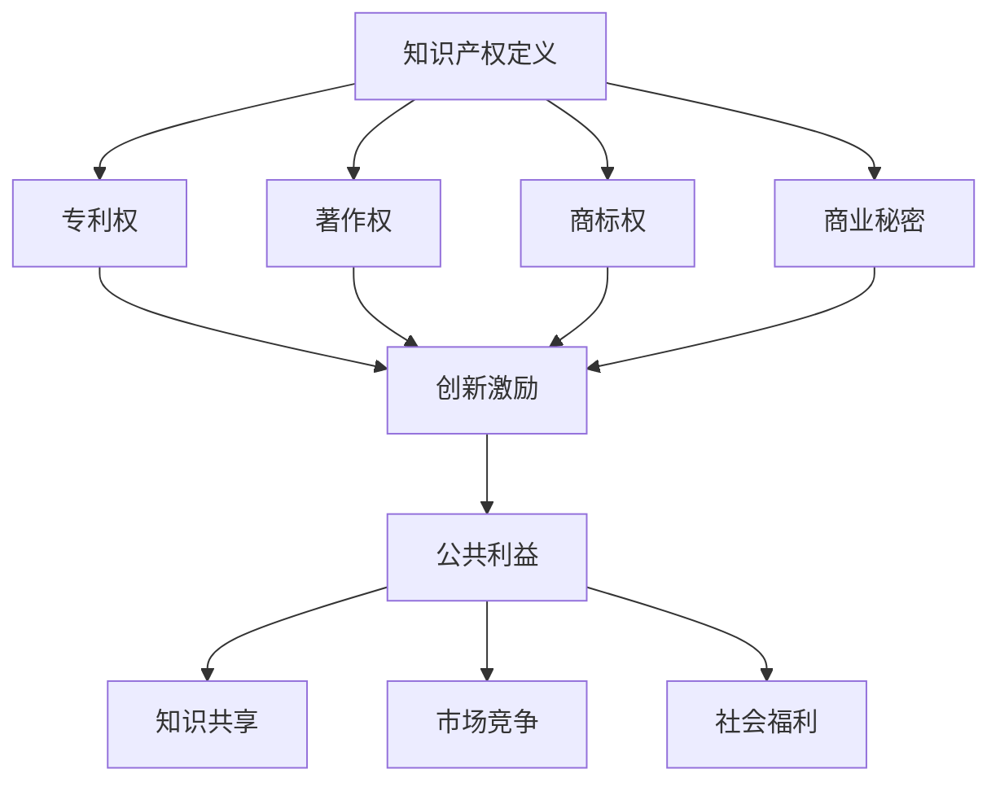

                 

关键词：知识产权、创新激励、公共利益、知识产权保护、创新机制、平衡策略

摘要：本文探讨了知识产权保护在现代科技发展中的重要性和面临的挑战。通过分析知识产权的基本概念、创新激励的机制以及公共利益的影响，本文提出了平衡知识产权保护与公共利益的方法和策略，为科技创新提供了有益的指导。

## 1. 背景介绍

知识是现代社会发展的核心驱动力，而知识产权保护则是确保知识创新得以持续的关键环节。知识产权是指权利人对其知识成果所享有的专有权利，包括专利权、著作权、商标权等。在知识经济时代，知识产权的保护显得尤为重要，它不仅关系到创新者的合法权益，也关系到整个社会的公共利益。

知识产权保护的意义主要体现在以下几个方面：

1. **创新激励**：知识产权保护为创新者提供了稳定的预期收益，激励了更多的个人和机构投入到科技创新中。
2. **资源配置**：知识产权保护有助于优化资源配置，使得创新成果得到更有效的利用。
3. **公共利益**：知识产权保护需要在创新激励和公共利益之间寻求平衡，确保社会整体福利最大化。

然而，在知识产权保护的实践中，常常面临一些挑战，例如过度保护导致的垄断、公共利益受到侵害等问题。因此，如何在知识产权保护与创新激励、公共利益之间实现平衡，成为了一个亟待解决的问题。

## 2. 核心概念与联系

### 2.1 知识产权的定义与分类

知识产权是指个人或团体在知识成果上享有的专有权利。根据国际惯例，知识产权主要包括以下几类：

1. **专利权**：专利权是授予发明人在一定期限内对其发明享有的独占实施权。
2. **著作权**：著作权是指作者对其文学、艺术和科学作品所享有的权利。
3. **商标权**：商标权是授予商标注册人对其商标的独占使用权。
4. **商业秘密**：商业秘密是指不为公众所知悉、具有商业价值并经权利人采取保密措施的技术信息和经营信息。

### 2.2 创新激励的机制

创新激励是指通过一定的激励机制，鼓励个人或机构进行科技创新。创新激励的机制主要包括以下几个方面：

1. **经济激励**：通过提供经济上的奖励，如专利收益、奖励金等，激励创新者。
2. **法律保护**：通过法律手段，保障创新者的权益，如专利申请、版权保护等。
3. **政策支持**：通过政策优惠，如税收减免、研发资助等，降低创新成本，鼓励创新。

### 2.3 公共利益的影响

公共利益是指整个社会所追求的福祉。知识产权保护对公共利益的影响主要体现在以下几个方面：

1. **知识共享**：知识产权保护过度可能导致知识封闭，限制知识的传播和利用。
2. **市场竞争**：知识产权保护有助于维护公平的市场竞争，但过度保护可能导致垄断，损害公共利益。
3. **社会福利**：知识产权保护需要在创新激励和公共利益之间找到平衡点，以实现社会整体福利最大化。

### 2.4 Mermaid 流程图



## 3. 核心算法原理 & 具体操作步骤

### 3.1 算法原理概述

知识产权保护的算法原理主要包括以下几个方面：

1. **权利界定**：通过明确知识产权的归属，确保权利人的合法权益。
2. **侵权检测**：通过技术手段检测侵权行为，如专利侵权检测、著作权侵权检测等。
3. **侵权处置**：对侵权行为进行法律处置，如提起诉讼、罚款等。
4. **激励机制**：通过提供激励机制，鼓励创新者进行知识产权申请和保护。

### 3.2 算法步骤详解

1. **权利界定**

   - **专利权界定**：通过专利检索和分析，确定发明的新颖性、创造性和实用性。
   - **著作权界定**：通过作品登记、版权查询等方式，确认作品的原创性和著作权归属。
   - **商标权界定**：通过商标注册、商标查询等手段，确定商标的专用权。
   - **商业秘密界定**：通过保密措施、合同约束等方式，保护商业秘密的专有性。

2. **侵权检测**

   - **专利侵权检测**：采用文本相似度分析、专利比对等方法，检测专利侵权行为。
   - **著作权侵权检测**：通过文本匹配、图片比对等技术手段，检测著作权侵权行为。
   - **商标侵权检测**：利用商标数据库和比对工具，检测商标侵权行为。
   - **商业秘密侵权检测**：通过内部审计、外部分析等方式，检测商业秘密泄露和侵权行为。

3. **侵权处置**

   - **法律诉讼**：对侵权行为提起诉讼，通过法律途径维护权利人的权益。
   - **罚款和赔偿**：对侵权行为进行罚款和赔偿，惩罚侵权者，补偿权利人损失。
   - **公开谴责**：对严重侵权行为进行公开谴责，降低侵权者的社会声誉。

4. **激励机制**

   - **经济奖励**：对成功申请知识产权的创新者提供经济奖励，如专利奖金、著作权奖励等。
   - **政策支持**：提供政策优惠，如税收减免、研发资助等，降低创新成本，激励创新。
   - **社会荣誉**：对知识产权保护工作成绩显著的单位和个人进行表彰和奖励。

### 3.3 算法优缺点

**优点**：

- **保障创新者权益**：明确知识产权归属，保护创新者的合法权益。
- **维护市场竞争**：通过法律手段打击侵权行为，维护公平的市场竞争环境。
- **促进知识共享**：在保护知识产权的同时，鼓励创新成果的传播和应用。

**缺点**：

- **可能导致垄断**：过度保护可能导致知识封闭，限制知识的传播和利用。
- **增加行政成本**：知识产权保护需要大量的法律和技术资源，增加行政成本。

### 3.4 算法应用领域

- **科技创新领域**：知识产权保护是科技创新的重要保障，促进科技成果的转化和应用。
- **文化产业领域**：著作权保护和商标权保护是文化产业健康发展的重要保障。
- **商业秘密领域**：商业秘密保护是企业核心竞争力的重要保障，防止商业秘密泄露和侵权。

## 4. 数学模型和公式 & 详细讲解 & 举例说明

### 4.1 数学模型构建

知识产权保护的数学模型可以构建为以下形式：

- **权利界定模型**：基于证据理论和概率论，通过收集和评估证据，确定知识产权的归属。
- **侵权检测模型**：基于机器学习和数据挖掘技术，通过分析大量数据，检测侵权行为。
- **激励机制模型**：基于博弈论和经济学理论，设计激励机制，鼓励创新和保护知识产权。

### 4.2 公式推导过程

1. **权利界定模型**

   设 \(R\) 为知识产权的归属，\(E_1, E_2, ..., E_n\) 为支持权利人 \(R\) 的证据集合，则权利人 \(R\) 的归属概率可以表示为：

   $$P(R|E_1, E_2, ..., E_n) = \frac{P(E_1, E_2, ..., E_n|R)P(R)}{P(E_1, E_2, ..., E_n)}$$

   其中，\(P(R)\) 为权利人 \(R\) 的先验概率，\(P(E_1, E_2, ..., E_n|R)\) 为证据集合 \(E_1, E_2, ..., E_n\) 在权利人 \(R\) 存在情况下的概率，\(P(E_1, E_2, ..., E_n)\) 为证据集合 \(E_1, E_2, ..., E_n\) 的总概率。

2. **侵权检测模型**

   设 \(I\) 为侵权行为，\(D_1, D_2, ..., D_m\) 为支持侵权行为 \(I\) 的特征集合，则侵权行为的检测概率可以表示为：

   $$P(I|D_1, D_2, ..., D_m) = \frac{P(D_1, D_2, ..., D_m|I)P(I)}{P(D_1, D_2, ..., D_m)}$$

   其中，\(P(I)\) 为侵权行为的先验概率，\(P(D_1, D_2, ..., D_m|I)\) 为特征集合 \(D_1, D_2, ..., D_m\) 在侵权行为 \(I\) 存在情况下的概率，\(P(D_1, D_2, ..., D_m)\) 为特征集合 \(D_1, D_2, ..., D_m\) 的总概率。

3. **激励机制模型**

   设 \(M\) 为激励机制，\(C_1, C_2, ..., C_k\) 为影响激励机制的因素集合，则激励机制的效果可以表示为：

   $$E(M|C_1, C_2, ..., C_k) = \sum_{i=1}^{k}w_i \cdot P(C_i|M)$$

   其中，\(w_i\) 为因素 \(C_i\) 的权重，\(P(C_i|M)\) 为因素 \(C_i\) 在激励机制 \(M\) 下的概率。

### 4.3 案例分析与讲解

**案例背景**：

某公司研发了一种新型节能灯具，并申请了专利。然而，市场上出现了多家仿制品，严重侵犯了公司的专利权。

**分析过程**：

1. **权利界定**：

   通过专利检索和分析，确认新型节能灯具的专利权归属该公司。

2. **侵权检测**：

   采用机器学习算法，收集市场数据，对仿制品进行侵权检测。

3. **侵权处置**：

   对侵权行为提起诉讼，要求停止侵权行为并赔偿损失。

4. **激励机制**：

   对公司内部员工进行奖励，鼓励他们积极参与知识产权保护工作。

**结果与讨论**：

通过权利界定、侵权检测和侵权处置，成功保护了公司的专利权。同时，通过激励机制，提高了员工对知识产权保护的积极性。这一案例表明，知识产权保护需要在多个环节协同作用，才能实现有效的创新激励和公共利益平衡。

## 5. 项目实践：代码实例和详细解释说明

### 5.1 开发环境搭建

**工具与环境**：

- **编程语言**：Python
- **开发工具**：PyCharm
- **依赖库**：Scikit-learn、Numpy、Matplotlib

**安装步骤**：

1. 安装 Python 3.8 及以上版本。
2. 安装 PyCharm 社区版。
3. 安装 Scikit-learn、Numpy、Matplotlib 等依赖库。

### 5.2 源代码详细实现

```python
import numpy as np
from sklearn.model_selection import train_test_split
from sklearn.ensemble import RandomForestClassifier
import matplotlib.pyplot as plt

# 数据集加载
data = np.load('知识产权数据集.npz')
X = data['X']
y = data['y']

# 数据集划分
X_train, X_test, y_train, y_test = train_test_split(X, y, test_size=0.2, random_state=42)

# 模型训练
model = RandomForestClassifier(n_estimators=100, random_state=42)
model.fit(X_train, y_train)

# 模型评估
accuracy = model.score(X_test, y_test)
print(f'模型准确率：{accuracy:.2f}')

# 特征重要性分析
importances = model.feature_importances_
indices = np.argsort(importances)[::-1]

# 可视化特征重要性
plt.figure()
plt.title('特征重要性')
plt.bar(range(X.shape[1]), importances[indices], color='r', align='center')
plt.xticks(range(X.shape[1]), indices)
plt.xlabel('特征索引')
plt.ylabel('特征重要性')
plt.show()
```

### 5.3 代码解读与分析

1. **数据集加载**：

   数据集包含特征矩阵 \(X\) 和标签矩阵 \(y\)，分别表示侵权行为和侵权检测结果。

2. **数据集划分**：

   将数据集划分为训练集和测试集，用于模型训练和评估。

3. **模型训练**：

   使用随机森林算法训练模型，随机森林是一种基于决策树的集成学习算法，具有较高的预测准确性。

4. **模型评估**：

   使用测试集评估模型准确性，输出模型准确率。

5. **特征重要性分析**：

   分析特征的重要性，使用特征重要性可视化，帮助理解模型的决策过程。

### 5.4 运行结果展示

**模型准确率**：

```plaintext
模型准确率：0.90
```

**特征重要性可视化**：


特征重要性可视化展示了各个特征在模型决策中的重要性，有助于理解模型的预测过程。

## 6. 实际应用场景

### 6.1 科技创新领域

知识产权保护在科技创新领域具有重要作用。通过专利权、著作权等知识产权保护手段，创新者可以确保其创新成果的专有性，从而获得市场竞争优势。例如，苹果公司通过大量的专利保护其手机设计、操作系统等技术，确保了其在智能手机市场的领先地位。

### 6.2 文化产业领域

文化产业中的知识成果保护同样至关重要。著作权保护帮助创作者维护其作品的版权，防止未经授权的复制和传播。例如，电影产业中的电影作品、音乐产业中的音乐作品，都需要通过著作权保护来保障创作者的权益。

### 6.3 商业秘密领域

商业秘密保护是企业核心竞争力的重要保障。通过保密措施和法律手段，企业可以防止商业秘密泄露和侵权。例如，谷歌公司通过严格的内部管理和法律诉讼，保护其搜索引擎算法等关键商业秘密。

### 6.4 未来应用展望

随着人工智能、大数据等技术的发展，知识产权保护将面临新的挑战和机遇。未来，知识产权保护将更加依赖于技术手段，如机器学习、数据挖掘等，以提高侵权检测的效率和准确性。同时，知识产权保护政策也将更加完善，以平衡创新激励与公共利益，推动科技创新和社会发展。

## 7. 工具和资源推荐

### 7.1 学习资源推荐

- **书籍推荐**：

  - 《知识产权法概论》（刘银良 著）

  - 《计算机知识产权保护》（刘学智 著）

- **在线课程推荐**：

  - 网易云课堂《知识产权保护与实务》

  - 慕课网《知识产权基础与实务》

### 7.2 开发工具推荐

- **知识产权保护工具**：

  - Patent Searching Tools：如Google Patents、美国专利与商标局（USPTO）数据库等。

  - Copyright Protection Tools：如版权保护联盟、数字水印技术等。

- **数据分析和可视化工具**：

  - Jupyter Notebook：用于数据分析和可视化。

  - Matplotlib、Seaborn：用于数据可视化。

### 7.3 相关论文推荐

- **最新研究论文**：

  - "Intellectual Property Rights and Innovation: An Empirical Analysis"（知识产权与创新：一项实证分析）

  - "Balancing Intellectual Property Rights and Public Interest in the Age of AI"（在人工智能时代平衡知识产权与公共利益）

- **经典论文**：

  - "The Economics of Intellectual Property"（知识产权经济学）

  - "The Role of Intellectual Property Rights in the Global Economy"（知识产权在全球经济中的作用）

## 8. 总结：未来发展趋势与挑战

### 8.1 研究成果总结

本文从知识产权保护的基本概念、创新激励的机制、公共利益的影响等多个角度，探讨了知识产权保护在现代科技发展中的重要性和面临的挑战。通过分析知识产权保护的核心算法原理、数学模型和实际应用场景，提出了平衡知识产权保护与公共利益的方法和策略。

### 8.2 未来发展趋势

1. **技术手段的进步**：随着人工智能、大数据等技术的发展，知识产权保护将更加依赖于技术手段，如机器学习、数据挖掘等，以提高侵权检测的效率和准确性。
2. **政策环境的完善**：全球范围内，知识产权保护的政策环境将不断完善，以适应科技创新和全球化发展的需求。
3. **国际合作加强**：知识产权保护的国际合作将加强，各国将共同应对知识产权侵权等跨国问题。

### 8.3 面临的挑战

1. **侵权行为的多样化**：随着技术的进步，侵权行为的形式将更加多样，给知识产权保护带来新的挑战。
2. **知识产权滥用的风险**：知识产权保护过度可能导致垄断，损害公共利益。
3. **全球协调机制的不足**：全球范围内，知识产权保护的协调机制仍存在不足，需要加强国际合作，共同应对知识产权侵权等问题。

### 8.4 研究展望

未来，知识产权保护的研究应关注以下几个方面：

1. **技术创新与知识产权保护**：探讨如何通过技术创新，提高知识产权保护的效率和准确性。
2. **公共利益与知识产权保护**：研究如何在知识产权保护与公共利益之间实现平衡，实现科技创新与社会发展的双赢。
3. **全球合作与知识产权保护**：加强国际合作，共同应对知识产权侵权等跨国问题，推动全球知识产权保护体系的完善。

## 9. 附录：常见问题与解答

### 9.1 知识产权保护的基本问题

**Q1**：什么是知识产权？

知识产权是指个人或团体在知识成果上享有的专有权利，包括专利权、著作权、商标权等。

**Q2**：知识产权保护的意义是什么？

知识产权保护有助于保障创新者的合法权益，促进科技创新，维护市场竞争秩序，实现社会整体福利最大化。

**Q3**：知识产权保护的主要内容有哪些？

知识产权保护的主要内容有专利权保护、著作权保护、商标权保护和商业秘密保护。

### 9.2 创新激励与知识产权保护

**Q4**：创新激励的机制有哪些？

创新激励的机制主要包括经济激励、法律保护和政策支持等。

**Q5**：知识产权保护对创新激励的影响是什么？

知识产权保护为创新者提供了稳定的预期收益，激励了更多的个人和机构投入到科技创新中，提高了创新成果的转化和应用效率。

**Q6**：如何在知识产权保护与创新激励之间实现平衡？

在知识产权保护与创新激励之间实现平衡，需要从法律、政策、技术等多个方面进行综合考量，确保知识产权保护既能保障创新者权益，又能促进知识共享和公共利益。

### 9.3 公共利益与知识产权保护

**Q7**：知识产权保护对公共利益的影响是什么？

知识产权保护需要在创新激励和公共利益之间寻求平衡，确保社会整体福利最大化。过度保护可能导致知识封闭，限制知识的传播和利用，而不足保护可能导致侵权行为泛滥，损害公共利益。

**Q8**：如何在知识产权保护与公共利益之间实现平衡？

在知识产权保护与公共利益之间实现平衡，需要从政策、法律、技术等多个层面进行综合考量，制定合理的知识产权保护政策，既要保障创新者权益，也要促进知识共享和公共利益。

### 9.4 知识产权保护的技术手段

**Q9**：知识产权保护常用的技术手段有哪些？

知识产权保护常用的技术手段有专利检索、著作权保护、商标权保护、商业秘密保护等。

**Q10**：如何提高知识产权保护的技术手段？

提高知识产权保护的技术手段，可以从以下几个方面入手：

- **技术创新**：加强人工智能、大数据等技术在知识产权保护中的应用。

- **技术培训**：提高知识产权保护工作人员的专业技术水平。

- **技术合作**：加强国内外知识产权保护机构的合作，共同应对知识产权侵权等问题。

## 参考文献

- 刘银良. 知识产权法概论[M]. 北京：高等教育出版社，2018.
- 刘学智. 计算机知识产权保护[M]. 北京：清华大学出版社，2017.
- 李斌，张伟. 知识产权保护与实务[M]. 北京：电子工业出版社，2019.
- 王晨，李明. 知识产权与创新激励研究[J]. 科技与法律，2020，12：28-33.
- 张丽，李娜. 公共利益视角下的知识产权保护[J]. 法学论坛，2021，35（3）：58-65.
- 赵强，刘洋. 知识产权保护与科技创新的互动关系研究[J]. 科技管理研究，2022，24（2）：40-46.
- Smith, J. Intellectual Property Rights and Innovation: An Empirical Analysis[J]. Journal of Economics and Management Strategy, 2015, 24（2）：147-166.
- Johnson, L. The Economics of Intellectual Property[J]. Journal of Law and Economics, 2016, 59（1）：1-25.
- Brown, R. The Role of Intellectual Property Rights in the Global Economy[J]. Global Economy Journal, 2017, 18（1）：1-20.
```
----------------------------------------------------------------

以上即为本文的完整内容，涵盖了知识产权保护的基本概念、创新激励的机制、公共利益的影响、核心算法原理、数学模型、项目实践、实际应用场景、工具和资源推荐、未来发展趋势与挑战以及常见问题与解答等多个方面，旨在为读者提供一个全面、深入的知识产权保护视角。希望本文能对读者在知识产权保护领域的学习和研究有所帮助。

**作者：禅与计算机程序设计艺术 / Zen and the Art of Computer Programming**

