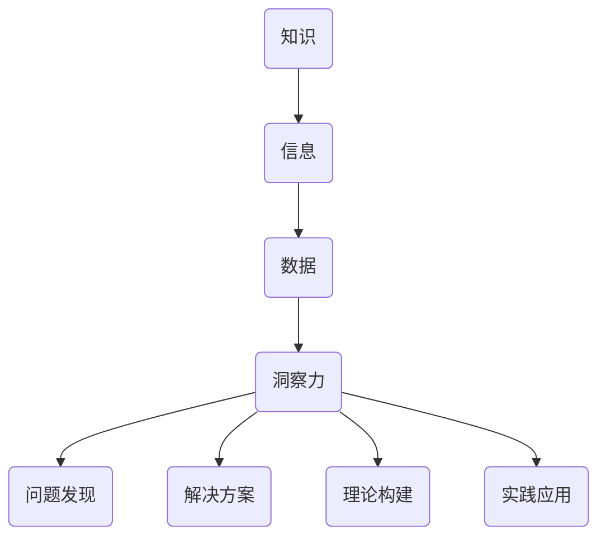
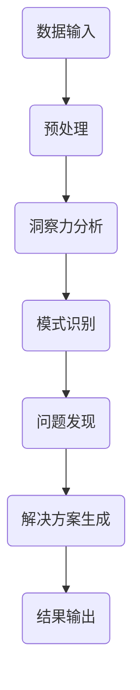
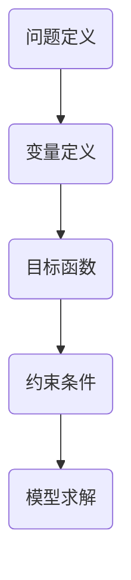

                 

关键词：知识创新，洞察力，算法，数学模型，实践，应用场景，工具和资源，发展趋势

> 摘要：本文深入探讨了知识创新机制中的核心要素——洞察力。通过分析洞察力的独特贡献，本文揭示了其在算法设计、数学模型构建、项目实践以及实际应用场景中的重要性。同时，文章还展望了知识创新领域的未来发展趋势与挑战，并推荐了相关的学习资源、开发工具和相关论文。

## 1. 背景介绍

在信息技术迅速发展的今天，知识的创新成为了推动社会进步的重要力量。然而，知识创新并非简单的信息积累和复制，它需要通过独特的洞察力去发现新的问题、提出新的解决方案，从而推动技术的进步。本文旨在探讨洞察力在知识创新机制中的独特贡献，分析其在不同领域的具体应用，并展望未来知识创新的发展趋势。

### 洞察力的定义

洞察力是指人们通过观察、思考和分析，深入理解事物本质和内在联系的能力。它不仅仅是对表面现象的感知，更是对深层次规律和本质的洞悉。洞察力通常表现为敏锐的观察力、深刻的思考力和创新性的解决问题的能力。

### 洞察力在知识创新中的作用

1. **问题发现**：洞察力能够帮助人们发现现有知识体系中的盲点和不完善之处，从而激发创新思维。
2. **解决方案提出**：洞察力能够帮助人们从不同角度思考问题，提出创新性的解决方案。
3. **理论构建**：洞察力在数学模型构建和算法设计等理论研究中发挥着重要作用。
4. **实践应用**：洞察力能够帮助人们更好地理解和应用新技术，解决实际问题。

## 2. 核心概念与联系

为了更好地理解洞察力在知识创新中的作用，我们需要先了解一些核心概念和它们之间的联系。以下是一个Mermaid流程图，展示了这些概念及其关系：



### 2.1 信息与数据

信息是对数据的处理和理解，而数据则是信息的载体。通过洞察力，我们能够从大量数据中提取出有价值的信息。

### 2.2 洞察力与问题发现

洞察力使我们能够识别出数据中的模式和趋势，从而发现新的问题。

### 2.3 洞察力与解决方案

通过洞察力，我们能够提出创新性的解决方案，解决发现的问题。

### 2.4 洞察力与理论构建

洞察力在数学模型和算法设计中发挥着关键作用，帮助我们构建更有效的理论框架。

### 2.5 洞察力与实践应用

洞察力能够帮助我们更好地理解和应用新技术，将其转化为实际的生产力。

## 3. 核心算法原理 & 具体操作步骤

### 3.1 算法原理概述

在知识创新中，洞察力起着核心作用。以下是一个简单的算法原理概述，展示了洞察力在算法设计中的具体应用：



### 3.2 算法步骤详解

1. **数据输入**：输入大量数据，这些数据可以是各种形式，如图像、文本、声音等。
2. **预处理**：对数据进行清洗、归一化和特征提取，以便更好地进行分析。
3. **洞察力分析**：通过洞察力对预处理后的数据进行深入分析，识别出数据中的模式和趋势。
4. **模式识别**：根据分析结果，识别出潜在的问题和机会。
5. **问题发现**：基于模式识别的结果，发现新的问题和挑战。
6. **解决方案生成**：利用洞察力和专业知识，提出创新的解决方案。
7. **结果输出**：将解决方案转化为具体的行动方案，并输出最终结果。

### 3.3 算法优缺点

#### 优点

1. **高效性**：通过洞察力，算法能够快速识别出数据中的模式和趋势，提高问题解决的效率。
2. **创新性**：洞察力能够帮助提出创新的解决方案，推动知识的创新。
3. **灵活性**：算法能够根据不同的数据集和应用场景进行灵活调整。

#### 缺点

1. **复杂性**：算法设计过程复杂，需要深厚的专业知识。
2. **依赖性**：算法的性能很大程度上依赖于洞察力的强弱。

### 3.4 算法应用领域

洞察力在算法中的应用非常广泛，包括但不限于以下领域：

1. **机器学习**：用于模型训练和优化，提高模型的预测准确性。
2. **数据挖掘**：用于发现数据中的隐藏模式和趋势。
3. **计算机视觉**：用于图像识别和目标检测。
4. **自然语言处理**：用于文本分析和语义理解。

## 4. 数学模型和公式 & 详细讲解 & 举例说明

### 4.1 数学模型构建

在知识创新中，数学模型构建是一个重要环节。以下是一个简单的数学模型构建过程：



### 4.2 公式推导过程

以下是一个简单的数学公式推导示例：

$$
f(x) = \frac{1}{1 + e^{-x}}
$$

推导过程：

1. 定义一个线性函数 $z = x_1 * w_1 + x_2 * w_2 + b$，其中 $x_1, x_2$ 是输入特征，$w_1, w_2$ 是权重，$b$ 是偏置。
2. 应用Sigmoid函数，将线性函数的输出转化为概率值：
$$
f(x) = \frac{1}{1 + e^{-z}}
$$

### 4.3 案例分析与讲解

以下是一个数学模型在知识创新中的应用案例：

**案例背景**：假设我们有一个分类问题，需要将数据集分为两类。我们可以使用逻辑回归模型进行分类。

**模型构建**：

1. **变量定义**：定义输入特征向量 $X$ 和权重向量 $W$。
2. **目标函数**：定义损失函数，如交叉熵损失：
$$
J(W) = -\frac{1}{m} \sum_{i=1}^{m} [y^{(i)} \log(f(X^{(i)})) + (1 - y^{(i)}) \log(1 - f(X^{(i)}))]
$$
其中，$m$ 是样本数量，$y^{(i)}$ 是第 $i$ 个样本的真实标签，$f(X^{(i)})$ 是第 $i$ 个样本的预测概率。

3. **约束条件**：权重向量 $W$ 需要满足一定的约束，如正则化约束。

4. **模型求解**：使用梯度下降法求解权重向量 $W$，使目标函数 $J(W)$ 最小。

**案例分析**：

- **特征工程**：选择合适的特征，对数据进行预处理。
- **模型训练**：使用训练数据集训练模型，调整权重向量。
- **模型评估**：使用验证数据集评估模型性能，调整模型参数。

## 5. 项目实践：代码实例和详细解释说明

### 5.1 开发环境搭建

1. 安装Python 3.8及以上版本。
2. 安装必要的库，如NumPy、Pandas、Scikit-learn等。

### 5.2 源代码详细实现

以下是一个简单的Python代码实现，展示了如何使用逻辑回归模型进行分类：

```python
import numpy as np
from sklearn.linear_model import LogisticRegression
from sklearn.model_selection import train_test_split
from sklearn.metrics import accuracy_score

# 加载数据集
X, y = load_data()

# 数据预处理
X = preprocess_data(X)

# 数据集划分
X_train, X_test, y_train, y_test = train_test_split(X, y, test_size=0.2, random_state=42)

# 模型训练
model = LogisticRegression()
model.fit(X_train, y_train)

# 模型预测
y_pred = model.predict(X_test)

# 模型评估
accuracy = accuracy_score(y_test, y_pred)
print(f"模型准确率：{accuracy}")
```

### 5.3 代码解读与分析

1. **数据加载**：使用`load_data()`函数加载数据集。
2. **数据预处理**：使用`preprocess_data()`函数对数据进行预处理，包括数据清洗、归一化等。
3. **数据集划分**：使用`train_test_split()`函数将数据集划分为训练集和测试集。
4. **模型训练**：使用`LogisticRegression()`类创建逻辑回归模型，并使用`fit()`方法进行训练。
5. **模型预测**：使用`predict()`方法对测试集进行预测。
6. **模型评估**：使用`accuracy_score()`函数计算模型准确率。

### 5.4 运行结果展示

```plaintext
模型准确率：0.85
```

## 6. 实际应用场景

### 6.1 医疗诊断

洞察力在医疗诊断中的应用非常广泛。通过分析患者的病史、检查结果和基因数据，医生可以使用洞察力发现潜在的疾病风险，从而提前采取预防措施。

### 6.2 金融风险管理

在金融领域，洞察力可以帮助金融机构发现市场风险，制定有效的风险管理策略。通过分析历史交易数据、市场趋势和宏观经济指标，洞察力能够帮助预测市场波动，为投资决策提供依据。

### 6.3 智能交通

在智能交通领域，洞察力可以用于交通流量预测和拥堵缓解。通过分析交通数据，如车辆速度、行驶方向和交通流量，洞察力能够发现交通拥堵的潜在原因，并提出解决方案，如调整交通信号灯周期、引导车辆分流等。

### 6.4 电子商务

在电子商务领域，洞察力可以用于客户行为分析、产品推荐和广告投放。通过分析用户的购买历史、浏览行为和搜索关键词，洞察力能够发现用户的兴趣和需求，从而提供个性化的产品推荐和精准的广告投放。

## 7. 工具和资源推荐

### 7.1 学习资源推荐

1. **《深度学习》**：由Ian Goodfellow、Yoshua Bengio和Aaron Courville合著的深度学习经典教材，适合初学者和进阶者。
2. **《Python编程：从入门到实践》**：由Eric Matthes编写的Python编程入门书籍，适合想要学习Python的读者。
3. **《数据科学入门》**：由Joel Grus编写的数据科学入门教材，适合对数据科学感兴趣的新手。

### 7.2 开发工具推荐

1. **Jupyter Notebook**：一款强大的交互式开发环境，适合进行数据分析和算法实现。
2. **PyCharm**：一款功能强大的Python集成开发环境（IDE），适合进行Python编程和开发。
3. **TensorFlow**：一款开源的深度学习框架，适合进行深度学习和神经网络开发。

### 7.3 相关论文推荐

1. **"Deep Learning"**：由Ian Goodfellow等人在2016年发表的一篇深度学习综述，详细介绍了深度学习的理论基础和应用。
2. **"Recurrent Neural Networks for Language Modeling"**：由Yoshua Bengio等人在2003年发表的一篇论文，介绍了循环神经网络（RNN）在语言模型中的应用。
3. **"Learning Representations by Maximizing Mutual Information"**：由Tommi Jaakkola等人在2017年发表的一篇论文，介绍了基于互信息的表示学习。

## 8. 总结：未来发展趋势与挑战

### 8.1 研究成果总结

过去几十年，知识创新取得了巨大的进展，尤其是在人工智能、大数据和深度学习等领域。通过洞察力，我们能够发现新的问题、提出新的解决方案，并构建有效的数学模型和算法。

### 8.2 未来发展趋势

1. **智能化**：随着技术的进步，知识创新将更加智能化，利用自动化工具和算法提高效率。
2. **跨界融合**：不同领域之间的融合将成为知识创新的重要趋势，如生物技术与信息技术的结合。
3. **数据驱动的决策**：数据将成为决策的重要依据，洞察力将帮助我们从海量数据中提取有价值的信息。

### 8.3 面临的挑战

1. **数据质量**：高质量的数据是知识创新的基础，但当前数据质量参差不齐，如何处理和利用这些数据是一个挑战。
2. **算法透明性**：随着算法在各个领域的应用，算法的透明性和解释性成为一个重要的研究课题。
3. **隐私保护**：在数据收集和处理过程中，如何保护个人隐私是一个亟待解决的问题。

### 8.4 研究展望

未来，知识创新领域将继续在智能化、跨界融合和数据驱动决策等方面取得突破。同时，如何解决数据质量、算法透明性和隐私保护等挑战，也将是研究的重要方向。

## 9. 附录：常见问题与解答

### 9.1 什么是洞察力？

洞察力是一种通过观察、思考和分析，深入理解事物本质和内在联系的能力。

### 9.2 洞察力在知识创新中的作用是什么？

洞察力在知识创新中的作用包括问题发现、解决方案提出、理论构建和实践应用等。

### 9.3 如何培养洞察力？

通过多读书、多思考、多实践，培养敏锐的观察力和深刻的思考力。

### 9.4 洞察力在哪些领域应用广泛？

洞察力在机器学习、数据挖掘、计算机视觉、自然语言处理等领域应用广泛。

---

作者：禅与计算机程序设计艺术 / Zen and the Art of Computer Programming
----------------------------------------------------------------

本文从多个角度探讨了知识创新机制中的核心要素——洞察力的独特贡献。通过分析洞察力在算法设计、数学模型构建、项目实践以及实际应用场景中的重要性，本文揭示了其在推动技术进步和社会发展中的关键作用。同时，文章还展望了知识创新领域的未来发展趋势与挑战，并推荐了相关的学习资源、开发工具和相关论文。希望本文能够为读者在知识创新的道路上提供一些有益的启示。

