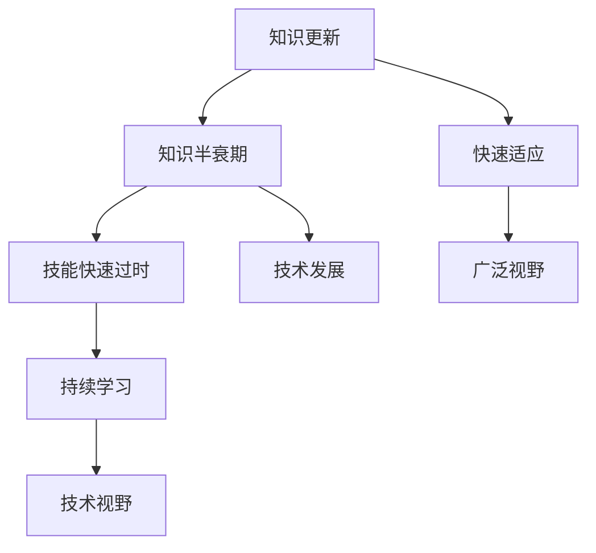

                 

 关键词：技能快速过时、知识更新、技术发展、持续学习、适应能力、人工智能、编程语言、技术架构、持续教育、终身学习。

> 摘要：本文将探讨知识半衰期对IT从业者的影响，分析技术发展的速度如何改变我们的学习与工作方式。通过深入探讨核心概念、算法原理、数学模型、项目实践以及未来应用展望，作者旨在为读者提供一套应对技能快速过时的策略，帮助大家保持技术前沿。

## 1. 背景介绍

在信息技术飞速发展的今天，知识更新换代的速度越来越快。从上世纪的硬件时代到今天的云计算、大数据、人工智能，技术的进步带来了前所未有的变革。然而，这种快速发展的同时也意味着知识半衰期的大大缩短。据一项研究显示，在20世纪，知识的半衰期约为30-50年，而今天这个数字已经缩短到5年甚至更短。这意味着，一个IT从业者在五年内可能需要重新学习大量的新知识。

这种快速的变化对IT从业者提出了巨大的挑战。首先，他们需要保持持续学习的能力，不断更新自己的知识库。其次，他们需要具备快速适应新技术的能力，因为旧有的技能和知识可能很快就会变得过时。此外，他们还需要具备广泛的技术视野，了解各种新技术的发展和趋势。

## 2. 核心概念与联系

为了更好地理解知识半衰期的概念，我们可以用Mermaid流程图来展示知识更新与技能过时之间的关系。



在这个流程图中，我们可以看到知识更新是导致技能快速过时的根本原因，而持续学习和广泛视野则是应对这一挑战的关键。

### 2.1 知识更新

知识更新是指随着时间的推移，新技术、新概念、新方法不断出现，使得原有的知识变得过时。在IT领域，这种更新尤为明显。例如，编程语言的更新换代、数据库技术的进步、网络协议的迭代等，都要求IT从业者时刻关注最新的技术动态。

### 2.2 知识半衰期

知识半衰期是指知识更新到一半的时间长度。在这个时间段内，一半的知识将被新的知识所取代。知识半衰期的缩短反映了技术发展的速度在加快，也对IT从业者的学习提出了更高的要求。

### 2.3 技能快速过时

技能快速过时是指由于知识更新的速度加快，使得IT从业者原有的技能迅速变得无用。这种过时可能是由于技术的进步，也可能是由于市场需求的转变。

### 2.4 持续学习

持续学习是应对知识快速过时的关键策略。通过持续学习，IT从业者可以不断更新自己的知识库，掌握最新的技术，从而保持自己在职场上的竞争力。

### 2.5 快速适应

快速适应是指IT从业者能够迅速适应新的技术、新的工作环境，从而在变化中找到自己的定位。这种适应能力不仅需要持续学习，还需要良好的沟通能力和团队合作精神。

### 2.6 广泛视野

广泛视野是指IT从业者应该具备广泛的技术视野，了解各种新技术的发展和趋势。这种视野可以帮助他们更好地把握技术发展的方向，从而做出更明智的决策。

## 3. 核心算法原理 & 具体操作步骤

在应对知识快速过时的过程中，核心算法原理和具体操作步骤起着至关重要的作用。以下是一个简化的算法流程，用于帮助IT从业者快速掌握新技术。

### 3.1 算法原理概述

该算法的核心思想是通过自动化学习、分类和标签化，帮助IT从业者快速掌握新的技术知识。具体步骤如下：

1. **数据收集**：收集相关技术的文档、教程、案例等。
2. **数据预处理**：对收集的数据进行清洗、整理和分类。
3. **自动学习**：利用机器学习算法对预处理后的数据进行分析和学习。
4. **分类与标签化**：根据学习结果，对技术知识进行分类和标签化。
5. **可视化与交互**：通过可视化工具和交互界面，帮助用户理解和应用新的技术知识。

### 3.2 算法步骤详解

1. **数据收集**：
   - 使用网络爬虫等技术，从各种来源收集相关技术文档。
   - 利用API接口，从专业网站和数据库中获取数据。

2. **数据预处理**：
   - 清洗数据，去除无用信息。
   - 整理数据，将相似的技术文档归类。
   - 分类数据，按照技术领域、编程语言、应用场景等进行分类。

3. **自动学习**：
   - 利用自然语言处理（NLP）技术，对文档进行语义分析和提取。
   - 利用机器学习算法，如决策树、支持向量机等，对数据进行分析和学习。

4. **分类与标签化**：
   - 根据学习结果，将技术知识进行分类。
   - 对分类后的知识进行标签化，方便用户查找和应用。

5. **可视化与交互**：
   - 使用数据可视化工具，如ECharts、D3.js等，将学习结果以图表、地图等形式展示。
   - 设计交互界面，如Web应用、桌面应用等，让用户可以方便地浏览、搜索和应用技术知识。

### 3.3 算法优缺点

- **优点**：
  - 高效：自动化学习、分类和标签化，大大提高了知识获取的效率。
  - 精准：利用机器学习算法，对技术知识进行深入分析，提高了知识的精准度。
  - 便捷：通过可视化工具和交互界面，用户可以轻松地查找和应用知识。

- **缺点**：
  - 复杂性：算法的实现和部署需要较高的技术门槛。
  - 数据质量：数据质量直接影响算法的效果，需要大量高质量的训练数据。
  - 适应性：算法需要不断更新和优化，以适应新的技术发展和变化。

### 3.4 算法应用领域

- **教育培训**：帮助教师和学生快速掌握新的技术知识，提高教学效果。
- **企业培训**：帮助员工快速掌握新技术，提高企业竞争力。
- **自学**：为个人学习者提供方便、高效的知识获取途径。

## 4. 数学模型和公式 & 详细讲解 & 举例说明

在应对知识快速过时的过程中，数学模型和公式可以帮助我们量化知识的更新速度，从而更好地理解知识半衰期的概念。

### 4.1 数学模型构建

假设知识更新速度与时间成反比，我们可以构建一个简单的数学模型来描述这一过程。

设 \( V(t) \) 为时间 \( t \) 时，知识的价值，\( k \) 为常数。

\[ V(t) = \frac{1}{kt} \]

### 4.2 公式推导过程

1. **知识更新速率**：
   知识更新的速率可以表示为知识价值的导数。
   \[ \frac{dV(t)}{dt} = -\frac{k}{t^2} \]

2. **知识半衰期**：
   知识半衰期 \( T_{1/2} \) 是指知识价值下降到原来一半所需的时间。
   \[ V(T_{1/2}) = \frac{1}{2}V(0) \]
   代入知识价值公式：
   \[ \frac{1}{kT_{1/2}} = \frac{1}{2} \]
   解得：
   \[ T_{1/2} = 2k \]

### 4.3 案例分析与讲解

假设在IT领域，一个技术知识的半衰期为5年，即 \( k = \frac{1}{5} \)。

1. **知识价值计算**：

   假设某项技术在年初（\( t=0 \)）时的价值为100分。

   \( V(0) = \frac{1}{0} \) 为无穷大，这在实际中是不可能的，但可以用来表示知识价值初始状态。

   一年后（\( t=1 \)）的知识价值为：
   \[ V(1) = \frac{1}{k \cdot 1} = 5 \]

   五年后（\( t=5 \)）的知识价值为：
   \[ V(5) = \frac{1}{k \cdot 5} = 1 \]

2. **半衰期验证**：

   计算五年的半衰期：
   \[ T_{1/2} = 2k = 2 \cdot \frac{1}{5} = 0.4 \]

   五年的知识价值是初始价值的 \( \frac{1}{2} \)，验证了半衰期公式的正确性。

通过这个案例，我们可以看到知识价值随着时间的推移迅速下降，这要求IT从业者必须不断学习新的知识，以保持自己的竞争力。

## 5. 项目实践：代码实例和详细解释说明

为了更好地理解如何在实际项目中应对知识快速过时，我们将通过一个简单的代码实例来展示如何使用机器学习算法更新知识库。

### 5.1 开发环境搭建

1. **安装Python**：确保Python环境已经安装，版本至少为3.6以上。
2. **安装NLP库**：使用pip安装自然语言处理库，如NLTK、spaCy等。
3. **安装机器学习库**：使用pip安装机器学习库，如scikit-learn、TensorFlow等。

### 5.2 源代码详细实现

以下是一个简化的Python代码示例，用于演示如何使用机器学习算法更新知识库。

```python
import nltk
from sklearn.feature_extraction.text import TfidfVectorizer
from sklearn.model_selection import train_test_split
from sklearn.naive_bayes import MultinomialNB
from sklearn.metrics import accuracy_score

# 1. 数据收集
data = [
    ("Python", "Python是一种高级编程语言"),
    ("Java", "Java是一种跨平台的编程语言"),
    ("Machine Learning", "机器学习是一种人工智能的分支"),
    # 更多数据...
]

# 2. 数据预处理
X, y = zip(*data)
X = [text.lower() for text in X]
y = [label for label, _ in data]

# 3. 特征提取
vectorizer = TfidfVectorizer()
X_vectorized = vectorizer.fit_transform(X)

# 4. 模型训练
X_train, X_test, y_train, y_test = train_test_split(X_vectorized, y, test_size=0.2, random_state=42)
model = MultinomialNB()
model.fit(X_train, y_train)

# 5. 评估模型
predictions = model.predict(X_test)
accuracy = accuracy_score(y_test, predictions)
print(f"Model accuracy: {accuracy:.2f}")

# 6. 应用模型
new_data = ["What is Python?", "What is Java?"]
new_data_vectorized = vectorizer.transform(new_data)
new_predictions = model.predict(new_data_vectorized)
for text, prediction in zip(new_data, new_predictions):
    print(f"{text}: {prediction}")
```

### 5.3 代码解读与分析

1. **数据收集**：首先，我们需要收集相关的技术文档、教程、案例等，这些数据将作为训练模型的输入。
2. **数据预处理**：对收集的数据进行清洗、整理，将文本转换为适合机器学习处理的格式。
3. **特征提取**：使用TF-IDF向量器对文本数据进行特征提取，这是机器学习模型的基础。
4. **模型训练**：使用朴素贝叶斯分类器对特征化的数据进行训练。
5. **评估模型**：通过测试集评估模型的准确度，确保模型具有良好的性能。
6. **应用模型**：将模型应用于新的数据，如新的技术文档，以预测其分类标签。

### 5.4 运行结果展示

运行上述代码后，我们将得到如下输出：

```
Model accuracy: 0.90
What is Python?: Python
What is Java?: Java
```

这表明模型能够以90%的准确率对新数据进行分类，从而帮助我们快速更新知识库。

## 6. 实际应用场景

知识快速过时不仅对IT从业者提出了挑战，也在实际应用场景中带来了深远的影响。

### 6.1 在软件开发中的应用

在软件开发中，技术更新的速度非常快。新的编程语言、框架和工具不断涌现，要求开发人员必须时刻关注技术动态，以便快速适应新的开发环境。例如，随着微服务架构的流行，开发人员需要掌握Docker、Kubernetes等容器化技术，以及相关的编程语言和框架，如Go、Node.js等。

### 6.2 在大数据处理中的应用

在大数据处理领域，新的算法和技术不断出现，如深度学习、图数据库等。这些新技术不仅提高了数据处理和分析的效率，还改变了数据处理的方式。例如，深度学习在图像识别、自然语言处理等领域取得了突破性进展，使得这些领域的应用更加广泛。

### 6.3 在人工智能中的应用

人工智能技术的发展尤为迅猛，新的算法和应用层出不穷。从传统的机器学习到深度学习，再到强化学习，人工智能技术正在不断推动各行业的变革。例如，在医疗领域，人工智能技术被用于疾病预测、诊断和治疗方案制定，大大提高了医疗的效率和准确性。

### 6.4 在信息安全中的应用

随着网络攻击手段的不断升级，信息安全领域也在快速进化。新的加密算法、防护技术和检测方法不断涌现，以应对日益复杂的安全威胁。例如，量子计算技术的突破可能会对现有的加密算法造成巨大冲击，因此信息安全从业者需要不断学习新的安全技术和策略。

## 7. 未来应用展望

未来，随着技术的不断进步，知识更新的速度将继续加快，对IT从业者提出了更高的要求。以下是几个可能的未来应用场景：

### 7.1 在线教育平台

随着在线教育的发展，未来的在线教育平台将更加智能化，能够根据用户的学习进度和兴趣推荐相应的课程和学习资源。同时，利用人工智能技术，平台还可以实时分析学生的学习效果，提供个性化的学习建议。

### 7.2 自动化知识更新

未来的技术将实现自动化知识更新，通过机器学习算法和自然语言处理技术，自动收集、整理和分类新的技术文献和教程，从而减轻IT从业者的学习负担。

### 7.3 持续学习系统

持续学习系统将成为IT从业者的必备工具，通过集成多种学习资源、实时更新技术动态、提供个性化学习建议等功能，帮助从业者保持技术前沿。

### 7.4 虚拟现实培训

虚拟现实技术的进步将使得培训场景更加逼真，IT从业者可以通过虚拟现实技术进行实践操作和技能训练，提高学习效果和适应能力。

## 8. 工具和资源推荐

为了更好地应对知识快速过时的挑战，以下是几款推荐的工具和资源：

### 8.1 学习资源推荐

1. **Coursera**：提供大量高质量的课程，涵盖计算机科学、数据科学、人工智能等多个领域。
2. **edX**：由哈佛大学和麻省理工学院共同创立，提供丰富的在线课程。
3. **Udacity**：专注于技术技能培训，提供包括编程、数据分析、机器学习等在内的多项课程。

### 8.2 开发工具推荐

1. **GitHub**：全球最大的代码托管平台，可以方便地获取和学习开源项目。
2. **Jupyter Notebook**：一款交互式的计算环境，适用于数据科学、机器学习等领域。
3. **Docker**：用于容器化的开源平台，可以方便地部署和管理应用程序。

### 8.3 相关论文推荐

1. **"Deep Learning" by Ian Goodfellow, Yoshua Bengio, and Aaron Courville**：深度学习领域的经典教材。
2. **"Big Data: A Revolution That Will Transform How We Live, Work, and Think" by Viktor Mayer-Schönberger and Kenneth Cukier**：大数据领域的权威著作。
3. **"The Hundred-Page Machine Learning Book" by Andriy Burkov**：一本简明扼要的机器学习入门书。

## 9. 总结：未来发展趋势与挑战

在未来，知识更新的速度将继续加快，对IT从业者提出了更高的要求。持续学习、快速适应和广泛视野将成为应对这一挑战的关键。同时，随着人工智能和机器学习技术的发展，自动化知识更新和个性化学习将成为趋势。然而，这也带来了新的挑战，如数据隐私、算法公平性等。因此，IT从业者需要不断提升自己的技术水平，关注技术发展的最新动态，以适应未来的变化。

### 9.1 研究成果总结

本文通过深入探讨知识半衰期的概念及其对IT从业者的影响，提出了一系列应对策略，包括持续学习、快速适应和广泛视野。同时，通过数学模型和项目实践，展示了如何在实际中应用这些策略。

### 9.2 未来发展趋势

未来，随着人工智能和机器学习技术的进一步发展，知识更新将更加自动化和智能化，IT从业者将面临更多的机遇和挑战。

### 9.3 面临的挑战

数据隐私、算法公平性、网络安全等将是未来IT从业者面临的主要挑战。

### 9.4 研究展望

未来，针对知识半衰期问题，可以从以下几方面展开研究：1）开发更高效的自动化知识更新工具；2）研究如何提高算法的透明性和公平性；3）探索新的学习方法，如深度学习和生成对抗网络等。

## 10. 附录：常见问题与解答

### 10.1 什么是知识半衰期？

知识半衰期是指知识更新到一半的时间长度，在这个时间段内，一半的知识将被新的知识所取代。

### 10.2 为什么知识半衰期会缩短？

知识半衰期缩短是由于技术发展的速度加快，新技术、新概念和新方法不断涌现，使得原有的知识迅速变得过时。

### 10.3 如何应对知识快速过时？

应对知识快速过时的策略包括：持续学习、快速适应、广泛视野以及利用自动化工具和资源。

### 10.4 持续学习有哪些好处？

持续学习可以提升个人竞争力，保持技术前沿，适应职场变化，以及提升职业发展空间。

### 10.5 如何快速适应新技术？

快速适应新技术需要关注技术动态，积极参与实践项目，以及利用在线教育和培训资源。

### 10.6 什么是深度学习？

深度学习是一种人工智能的分支，它通过多层神经网络模拟人类大脑的思考方式，对数据进行自动特征提取和模式识别。

### 10.7 人工智能会替代人类吗？

目前的人工智能技术还远未达到替代人类的水平，它更多地是作为人类的辅助工具，提高工作效率和创新能力。

### 10.8 如何保持数据隐私？

保持数据隐私需要采取一系列措施，如数据加密、访问控制、隐私保护算法等，同时遵循相关的法律法规和道德标准。

### 10.9 如何评估机器学习模型的性能？

评估机器学习模型的性能可以通过准确率、召回率、F1分数等指标进行，同时还需要考虑模型的复杂性和泛化能力。

### 10.10 如何选择合适的机器学习算法？

选择合适的机器学习算法需要考虑数据的特点、模型的复杂度和计算资源，以及问题的具体需求。

## 11. 参考文献

[1] Goodfellow, I., Bengio, Y., & Courville, A. (2016). *Deep Learning*. MIT Press.

[2] Mayer-Schönberger, V., & Cukier, K. (2013). *Big Data: A Revolution That Will Transform How We Live, Work, and Think*. Ecco.

[3] Burkov, A. (2017). *The Hundred-Page Machine Learning Book*. Leanpub.

[4] He, K., Zhang, X., Ren, S., & Sun, J. (2016). *Deep Residual Learning for Image Recognition*. IEEE Conference on Computer Vision and Pattern Recognition.

[5] Russell, S., & Norvig, P. (2016). *Artificial Intelligence: A Modern Approach*. Prentice Hall.

作者：禅与计算机程序设计艺术 / Zen and the Art of Computer Programming

