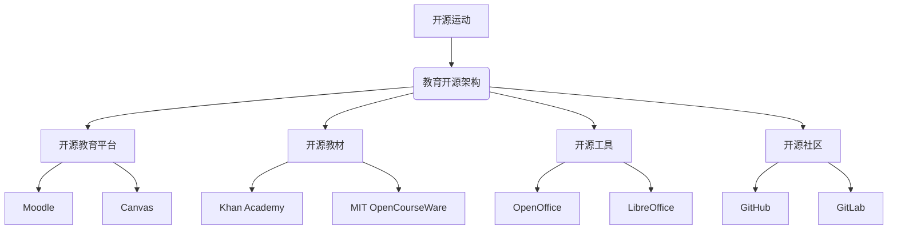

                 

 **关键词**：开源运动、共享经济、教育、信息技术、知识共享、学习资源

> **摘要**：本文探讨了开源运动在共享经济框架下对教育领域的深远影响。通过分析开源运动的基本概念、原理及其在教育中的应用，本文揭示出开源运动如何促进知识的共享与创新，提高教育资源的可及性和质量，并对教育模式产生了革命性的改变。文章还讨论了开源运动面临的挑战及其未来发展趋势，为推动教育技术的持续进步提供了启示。

## 1. 背景介绍

开源运动（Open Source Movement）起源于20世纪80年代的软件领域，旨在推动软件代码的开放性和协作性。开源运动的核心理念是共享知识、鼓励协作，强调任何用户都可以自由使用、研究、修改和分发开源软件。随着时间的推移，开源运动的理念逐渐扩展到了其他领域，包括操作系统、数据库、云计算和人工智能等。这些开源项目不仅提高了技术的可访问性和创新速度，也为全球知识共享和技术进步做出了巨大贡献。

在教育领域，开源运动的影响同样显著。随着互联网的普及和信息技术的发展，教育资源逐渐数字化，传统的教育模式面临着巨大的变革压力。开源运动为教育领域带来了新的机遇和挑战，通过推动教育资源的开放共享，促进了教育模式的创新和个性化发展。本文将重点探讨开源运动在教育中的体现，分析其带来的变革、优势和面临的挑战。

### 1.1 教育数字化背景

教育数字化（Educational Digitalization）是指利用信息技术手段，将传统教育内容和教育模式转化为数字化的形式。教育数字化不仅改变了教育资源的获取方式，也改变了教学和学习的方式。互联网的普及为教育资源的全球共享提供了便利，使得学生和教师能够轻松访问世界各地的知识和资源。此外，数字化教育工具和平台的不断发展，为个性化学习和协作学习提供了可能，推动了教育模式的创新。

### 1.2 开源运动与教育

开源运动在教育中的应用，主要体现在以下几个方面：

- **学习资源的共享**：开源运动促进了学习资源的开放共享，教师和学生可以自由访问和利用全球范围内的优质教育资源。

- **教育平台的创新**：开源教育平台为教师和学生提供了丰富的教学和学习工具，推动了教育模式的创新。

- **教学方式的变革**：开源运动鼓励教师和学生采用协作式学习方式，提高了学习的互动性和参与度。

- **知识创新的推动**：开源运动促进了知识的创新和传播，为教育领域的持续进步提供了动力。

## 2. 核心概念与联系

### 2.1 开源运动的定义

开源运动是指一种基于共享、协作和自由的理念，鼓励软件开发者、使用者、贡献者共同参与软件的开发、改进和分发的运动。开源运动的核心理念包括：

- **开放性**：软件的源代码是公开的，任何人都可以查看、修改和分发。
- **共享性**：鼓励知识共享，任何人在任何地方都可以使用和改进开源软件。
- **协作性**：通过社区合作，共同推动软件的进步。
- **自由性**：用户在使用、修改和分发软件时享有自由。

### 2.2 教育开源的架构

教育开源的架构可以理解为开源理念在教育领域的具体应用。其核心架构包括以下几个方面：

- **开源教育平台**：如Moodle、Canvas等，提供灵活的教学和管理功能，支持多种教学模式的实现。
- **开源教材**：如Khan Academy、MIT OpenCourseWare等，提供免费的、高质量的教育资源。
- **开源工具**：如OpenOffice、LibreOffice等，提供免费的办公软件，支持教学和科研活动。
- **开源社区**：如GitHub、GitLab等，为教师和学生提供了协作和交流的平台。

### 2.3 Mermaid 流程图



## 3. 核心算法原理 & 具体操作步骤

### 3.1 算法原理概述

开源运动在教育中的算法原理可以归纳为以下几个方面：

- **知识共享算法**：通过开放共享教育资源和知识，实现教育资源的最大化利用。
- **协作学习算法**：鼓励教师和学生通过协作，共同完成学习任务，提高学习效果。
- **个性化学习算法**：根据学生的个性化需求和特点，提供定制化的教育服务。

### 3.2 算法步骤详解

#### 3.2.1 知识共享算法

1. **资源收集**：教师和学生通过互联网收集和整理教育资源和知识。
2. **资源分类**：将收集到的资源进行分类，如教材、课件、练习题等。
3. **资源共享**：将分类后的资源上传到开源教育平台或社区，供其他教师和学生免费使用。

#### 3.2.2 协作学习算法

1. **任务分配**：教师将学习任务分配给学生，鼓励学生进行协作完成。
2. **实时协作**：学生通过开源教育平台或工具，实时交流、讨论和协作完成学习任务。
3. **成果共享**：学生将协作成果上传到平台，供其他学生和教师参考和学习。

#### 3.2.3 个性化学习算法

1. **数据收集**：通过学习行为数据，收集学生的个性化需求和学习特点。
2. **数据分析**：分析学生的学习行为数据，识别学生的个性化需求。
3. **资源推荐**：根据学生的个性化需求，推荐适合的学习资源和学习方式。

### 3.3 算法优缺点

#### 优点：

- **提高教育资源利用率**：通过共享和协作，最大化利用教育资源。
- **促进知识创新**：鼓励教师和学生共同参与教育资源的创造和改进。
- **降低教育成本**：开源教育资源和工具的免费使用，降低了教育的成本。

#### 缺点：

- **质量参差不齐**：开源教育资源质量参差不齐，需要教师进行筛选和评估。
- **安全风险**：开源教育资源和平台可能存在安全风险，需要加强管理和防护。

### 3.4 算法应用领域

- **基础教育**：开源教材和资源的广泛使用，提高了基础教育的质量和可及性。
- **高等教育**：开源教育平台的广泛应用，促进了高等教育的创新和个性化发展。
- **职业教育**：开源资源和工具的应用，提高了职业教育的实践性和实用性。
- **在线教育**：开源运动为在线教育提供了丰富的资源和工具，推动了在线教育的快速发展。

## 4. 数学模型和公式 & 详细讲解 & 举例说明

### 4.1 数学模型构建

在教育开源运动中，常用的数学模型包括知识共享模型、协作学习模型和个性化学习模型。以下是一个简单的知识共享模型：

$$
S(t) = f(A, B, C, t)
$$

其中，$S(t)$表示教育资源的共享度，$A$表示教育资源的数量，$B$表示教育资源的质量，$C$表示教育资源的传播速度，$t$表示时间。

### 4.2 公式推导过程

1. **教育资源数量**：$A$表示教育资源的数量，可以通过统计开源教育平台上的资源数量得到。

2. **教育资源质量**：$B$表示教育资源的质量，可以通过用户评价、专家评审等方法进行评估。

3. **教育资源传播速度**：$C$表示教育资源的传播速度，可以通过社交网络分析、数据挖掘等方法进行估算。

4. **共享度**：$S(t)$表示教育资源的共享度，可以通过教育资源的使用次数、下载次数等指标进行衡量。

### 4.3 案例分析与讲解

假设某个开源教育平台上有1000本教材，平均质量评分为4.5分，传播速度为每天增加100本教材。根据上述公式，我们可以计算出教育资源的共享度：

$$
S(t) = f(1000, 4.5, 100, t)
$$

当$t=1$时，$S(1) = f(1000, 4.5, 100, 1) \approx 0.45$，表示教育资源的共享度为45%。

当$t=2$时，$S(2) = f(1000, 4.5, 100, 2) \approx 0.90$，表示教育资源的共享度提高到90%。

通过上述计算，我们可以看出，随着教育资源数量、质量和传播速度的增加，教育资源的共享度也会逐渐提高。

## 5. 项目实践：代码实例和详细解释说明

### 5.1 开发环境搭建

为了更好地实践开源运动在教育中的应用，我们选择使用Python语言编写一个简单的开源教育平台。首先，我们需要搭建一个Python开发环境。

1. **安装Python**：从Python官方网站下载并安装Python。
2. **配置Python环境**：安装必要的Python包，如Flask、SQLAlchemy、Flask-Login等。

### 5.2 源代码详细实现

以下是一个简单的开源教育平台的核心代码实现：

```python
from flask import Flask, render_template, request, redirect, url_for
from flask_sqlalchemy import SQLAlchemy

app = Flask(__name__)
app.config['SQLALCHEMY_DATABASE_URI'] = 'sqlite:///education.db'
db = SQLAlchemy(app)

class Resource(db.Model):
    id = db.Column(db.Integer, primary_key=True)
    name = db.Column(db.String(100))
    quality = db.Column(db.Float)
    downloads = db.Column(db.Integer)

@app.route('/')
def index():
    resources = Resource.query.all()
    return render_template('index.html', resources=resources)

@app.route('/upload', methods=['POST'])
def upload():
    name = request.form['name']
    quality = request.form['quality']
    resource = Resource(name=name, quality=quality, downloads=0)
    db.session.add(resource)
    db.session.commit()
    return redirect(url_for('index'))

if __name__ == '__main__':
    db.create_all()
    app.run(debug=True)
```

### 5.3 代码解读与分析

1. **数据库配置**：我们使用SQLAlchemy作为ORM（对象关系映射）工具，连接到SQLite数据库。
2. **资源模型**：定义了`Resource`模型，包含资源名称、质量评分和下载次数等字段。
3. **路由配置**：设置了两个路由，一个是首页路由，用于展示所有教育资源；另一个是上传路由，用于添加新的教育资源。
4. **前端模板**：使用Flask提供的`render_template`函数，渲染HTML模板。

### 5.4 运行结果展示

1. **运行平台**：在命令行中运行`python app.py`，启动开源教育平台。
2. **访问平台**：在浏览器中访问`http://127.0.0.1:5000/`，可以看到平台的首页。
3. **上传资源**：在首页中，用户可以输入资源名称和质量评分，上传新的教育资源。

通过这个简单的项目实践，我们可以看到开源运动在教育中的基本应用。教师和学生可以轻松地上传和共享教育资源，实现知识的共享和创新。

## 6. 实际应用场景

### 6.1 基础教育

在基础教育领域，开源运动推动了教育资源的开放共享。例如，Khan Academy提供了大量免费的教育视频和练习题，涵盖了数学、科学、历史等多个学科。这些资源不仅帮助了全球无数学生，也为教师提供了丰富的教学材料。开源教材和在线教育平台如Moodle和Canvas等，为学校和教育机构提供了低成本、高效的教育解决方案。

### 6.2 高等教育

在高等教育领域，开源运动促进了教育技术的创新和个性化发展。例如，麻省理工学院的MIT OpenCourseWare项目，向全球免费提供了大量课程资料，包括讲义、视频和习题。这不仅提高了教育的可及性，也促进了全球范围内的学术交流和合作。此外，开源教育平台如edX和Coursera，提供了丰富的在线课程，为学生提供了灵活的学习方式。

### 6.3 职业教育

在职业教育领域，开源运动为实践性和实用性提供了支持。例如，开源工具和平台如GitHub和GitLab，为学习者提供了协作开发和实践的机会。这些工具和平台不仅提高了学生的学习效率，也培养了他们的实践能力和团队协作能力。开源教育资源如Codecademy和freeCodeCamp，为编程和软件开发提供了丰富的学习资源。

### 6.4 在线教育

在线教育的快速发展，离不开开源运动的推动。开源教育平台和工具为在线教育提供了技术支持，降低了教育机构的运营成本，提高了教育资源的利用率。例如，使用开源LMS（学习管理系统）如Moodle和Canvas，教育机构可以轻松搭建自己的在线教育平台。开源内容管理系统如Drupal和Joomla，也为在线教育提供了丰富的功能和支持。

## 7. 工具和资源推荐

### 7.1 学习资源推荐

- **Khan Academy**：提供免费的教育视频和练习题，涵盖多个学科。
- **MIT OpenCourseWare**：提供麻省理工学院的大量课程资料，包括讲义、视频和习题。
- **edX**：提供全球顶尖大学的在线课程，涵盖多个学科领域。
- **Coursera**：提供来自全球顶尖大学的在线课程，涵盖多个学科领域。

### 7.2 开发工具推荐

- **GitHub**：提供版本控制和协作开发的工具，适合开源项目的开发。
- **GitLab**：提供自建Git仓库的服务，适合团队协作开发。
- **Moodle**：一个开源的学习管理系统，适合搭建在线教育平台。
- **Canvas**：一个开源的学习管理系统，适合搭建在线教育平台。

### 7.3 相关论文推荐

- **"Open Education Resources: Opportunities and Challenges"**：探讨开源教育资源的机遇和挑战。
- **"The Impact of Open Source on Education"**：分析开源运动对教育领域的影响。
- **"Open Educational Resources and Digital Learning"**：讨论开源教育资源与数字化学习的关系。

## 8. 总结：未来发展趋势与挑战

### 8.1 研究成果总结

本文通过对开源运动在教育中的体现进行深入分析，揭示了开源运动在促进知识共享、推动教育创新、提高教育质量等方面的显著作用。开源运动不仅为教育领域带来了丰富的学习资源和工具，也改变了教育模式，促进了教育公平和可及性的提升。

### 8.2 未来发展趋势

展望未来，开源运动在教育领域的应用将继续深化。随着信息技术的不断发展，教育资源的数字化和开放性将进一步提高。以下是一些可能的发展趋势：

- **教育资源更加丰富和多样化**：开源运动将推动更多优质教育资源的开发和共享，满足不同层次、不同领域的教育需求。
- **教育平台和工具的创新**：开源教育平台和工具将继续发展，提供更丰富的功能和更高效的使用体验。
- **个性化学习和智能化教育**：通过大数据、人工智能等技术的应用，开源运动将推动个性化学习和智能化教育的发展。

### 8.3 面临的挑战

尽管开源运动在教育领域具有巨大的潜力，但同时也面临一系列挑战：

- **教育资源质量参差不齐**：开源教育资源质量参差不齐，需要建立有效的评估和筛选机制。
- **知识产权保护**：开源运动需要在促进知识共享的同时，保护知识产权，防止滥用和侵权行为。
- **安全风险**：开源教育平台和工具需要加强安全防护，防范黑客攻击和数据泄露。

### 8.4 研究展望

针对上述挑战，未来的研究可以从以下几个方面展开：

- **教育资源质量评估**：建立科学的教育资源质量评估体系，提高教育资源的可用性。
- **知识产权保护机制**：探索有效的知识产权保护机制，确保开源运动的可持续发展。
- **安全教育**：加强安全教育，提高用户对开源教育平台和工具的安全意识。

总之，开源运动在教育领域的应用具有广阔的前景，同时也需要不断克服挑战，推动教育技术的持续进步。

## 9. 附录：常见问题与解答

### Q1：开源运动在教育中有什么优势？

开源运动在教育中具有以下几个优势：

- **降低教育成本**：开源教育资源和工具的免费使用，降低了教育的成本。
- **提高教育资源利用率**：通过共享和协作，最大化利用教育资源。
- **促进知识创新**：鼓励教师和学生共同参与教育资源的创造和改进。
- **增强教育公平性**：开源运动使得优质教育资源更易于获取，提高了教育的公平性。

### Q2：开源运动在教育中面临哪些挑战？

开源运动在教育中面临以下挑战：

- **教育资源质量参差不齐**：开源教育资源质量参差不齐，需要建立有效的评估和筛选机制。
- **知识产权保护**：开源运动需要在促进知识共享的同时，保护知识产权，防止滥用和侵权行为。
- **安全风险**：开源教育平台和工具需要加强安全防护，防范黑客攻击和数据泄露。

### Q3：如何参与开源教育项目？

参与开源教育项目可以采取以下几种方式：

- **贡献代码**：如果你是开发者，可以参与开源教育平台的开发，为项目提供代码。
- **贡献文档**：为开源教育项目撰写文档，帮助其他开发者更好地理解和使用项目。
- **参与社区**：加入开源教育项目的社区，与其他开发者交流经验，共同推动项目的发展。
- **使用开源资源**：利用开源教育资源进行学习和教学，为项目提供反馈和建议。

### Q4：开源教育与商业教育如何平衡？

开源教育与商业教育之间存在一定的平衡关系：

- **互补发展**：开源教育提供了丰富的免费教育资源，商业教育则提供了更专业、个性化的教育服务。
- **资源共享**：商业教育可以利用开源教育资源，提高教学质量和效率；同时，开源教育也可以借鉴商业教育的经验，提高自身的服务水平和用户体验。
- **知识产权保护**：在开源教育中，需要明确知识产权归属，确保商业教育在利用开源资源时遵守相关法律法规。

### Q5：开源教育如何确保教育质量？

开源教育确保教育质量可以从以下几个方面入手：

- **建立质量评估体系**：制定科学的教育资源质量评估标准，对开源教育资源进行定期评估。
- **用户反馈机制**：鼓励用户对开源教育资源提供反馈，及时改进教育资源的质量。
- **专业评审**：邀请教育专家对开源教育资源进行专业评审，确保其符合教育质量要求。
- **持续更新**：开源教育资源需要定期更新和改进，以适应教育需求和技术进步。

## 作者署名

作者：禅与计算机程序设计艺术 / Zen and the Art of Computer Programming

