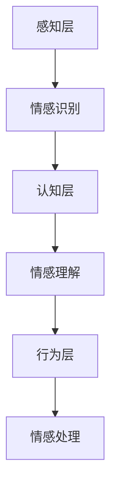

                 

关键词：知识情感智能、AI、认知模型、情感计算、算法原理、应用场景、未来发展

> 摘要：本文探讨了知识情感智能的概念，阐述了其在人工智能领域的重要性。通过分析情感计算与认知模型的结合，探讨了知识情感智能的算法原理、具体操作步骤、数学模型及其在实际应用中的表现。文章还展望了知识情感智能的未来发展趋势与面临的挑战，并推荐了相关学习资源和开发工具。

## 1. 背景介绍

在信息爆炸的时代，人工智能（AI）技术已经成为推动社会进步的关键力量。从简单的自动化任务到复杂的人机交互，AI技术在各个领域的应用愈发广泛。然而，随着AI技术的发展，人们开始意识到仅仅依靠逻辑推理和计算能力还不足以满足人类复杂的需求。情感作为人类认知的重要组成部分，开始在人工智能领域受到重视。

知识情感智能是指将情感因素融入知识管理中，通过认知模型实现情感信息的识别、理解和处理，从而在决策和交互中体现情感价值。知识情感智能的研究背景源于人们对情感计算和认知科学的深入探索。情感计算关注如何让机器理解、识别和模拟情感，而认知科学则关注人类思维过程和认知机制。知识情感智能正是这两个领域的交叉融合，旨在构建一个具有情感理解和回应能力的智能系统。

### 情感计算与认知科学的结合

情感计算是人工智能的一个分支，主要研究如何使计算机具有理解和处理情感的能力。近年来，随着深度学习、自然语言处理和计算机视觉等技术的发展，情感计算取得了显著的进展。通过分析语音、文本、图像等数据，情感计算技术可以识别用户的情绪状态，并做出相应的回应。

认知科学则是一门跨学科的研究领域，关注人类思维过程和认知机制。认知科学的研究成果为情感计算提供了理论基础，使得情感识别和理解更加准确和深入。

知识情感智能通过将情感计算与认知科学相结合，构建了一个多层次的认知模型。该模型不仅能够识别用户的情感状态，还能够根据这些情感状态调整决策和行为，从而实现更加人性化的智能交互。

## 2. 核心概念与联系

### 知识情感智能的核心概念

知识情感智能的核心概念包括情感识别、情感理解和情感处理。情感识别是指通过情感计算技术识别用户的情感状态；情感理解是指分析情感状态背后的原因和影响；情感处理是指根据情感状态调整决策和行为。

### 情感计算与认知模型的结合

情感计算与认知模型的结合是通过构建一个多层次的认知模型实现的。该模型主要包括以下层次：

1. **感知层**：感知层负责接收和识别用户的情感信息，包括语音、文本、图像等。通过情感计算技术，感知层可以实时监测用户的情感状态。
2. **认知层**：认知层负责分析和理解情感状态。通过认知模型，认知层可以识别情感背后的原因和影响，并生成相应的情感解释。
3. **行为层**：行为层根据认知层的分析结果调整决策和行为。通过情感处理，行为层可以实现对用户的情感回应，从而提升用户体验。

### Mermaid 流程图



## 3. 核心算法原理 & 具体操作步骤

### 3.1 算法原理概述

知识情感智能的核心算法原理基于情感计算和认知模型。情感计算主要使用深度学习和自然语言处理技术进行情感识别和理解；认知模型则通过心理学理论和神经科学原理构建，用于分析和解释情感状态。

### 3.2 算法步骤详解

1. **情感识别**：使用深度学习模型对用户的语音、文本、图像等数据进行情感识别。常见的情感分类包括喜怒哀乐、积极消极等。
2. **情感理解**：通过认知模型分析情感状态背后的原因和影响。认知模型可以结合用户的历史数据和上下文信息，实现对情感状态的深度理解。
3. **情感处理**：根据情感理解的结果调整决策和行为。例如，在客服系统中，如果用户表现出愤怒情绪，系统可以采取缓和语气的回应，以缓解用户情绪。

### 3.3 算法优缺点

**优点**：
- **提高用户体验**：通过情感识别和理解，系统可以更好地满足用户需求，提升用户体验。
- **个性化服务**：根据用户的情感状态，系统可以提供更加个性化的服务，提高用户满意度。
- **情感分析**：情感计算技术可以用于情感分析，为市场研究、舆情监测等提供数据支持。

**缺点**：
- **准确率**：当前情感计算技术的准确率仍有待提高，特别是在复杂情感识别方面。
- **隐私问题**：情感信息的收集和处理可能涉及用户隐私，需要严格保护用户隐私。

### 3.4 算法应用领域

知识情感智能的应用领域广泛，包括但不限于：
- **客服系统**：通过情感识别和理解，提供更加人性化的客服服务。
- **教育领域**：根据学生的情感状态调整教学方法，提高学习效果。
- **医疗领域**：通过情感分析，帮助医生更好地了解患者情绪，提高治疗效果。
- **智能家居**：通过情感识别和理解，提供更加智能化的家居环境。

## 4. 数学模型和公式 & 详细讲解 & 举例说明

### 4.1 数学模型构建

知识情感智能的数学模型主要包括以下两个方面：

1. **情感识别模型**：使用深度学习技术，如卷积神经网络（CNN）和循环神经网络（RNN），对情感数据进行分析和分类。
2. **认知模型**：使用心理学理论和神经科学原理，构建情感状态与行为之间的数学关系。

### 4.2 公式推导过程

假设情感识别模型使用卷积神经网络（CNN），其基本结构如下：

$$
h_{l}^{\left( t \right)} = \sigma \left( W_{l}^{\left( t \right)} \cdot h_{l-1}^{\left( t \right)} + b_{l}^{\left( t \right)} \right)
$$

其中，$h_{l}^{\left( t \right)}$ 表示第 $l$ 层在第 $t$ 时刻的激活值，$W_{l}^{\left( t \right)}$ 表示权重矩阵，$b_{l}^{\left( t \right)}$ 表示偏置项，$\sigma$ 表示激活函数。

### 4.3 案例分析与讲解

假设一个情感识别任务，使用卷积神经网络（CNN）对文本数据进行情感分类。输入文本为：“今天天气很好，我很开心。”目标情感为“积极”。

1. **预处理**：将文本数据转换为向量表示，如词嵌入。
2. **情感识别**：使用卷积神经网络（CNN）对文本向量进行分析，输出情感概率分布。
3. **情感理解**：结合上下文信息，分析情感概率分布，确定情感状态。

## 5. 项目实践：代码实例和详细解释说明

### 5.1 开发环境搭建

1. **安装 Python**：下载并安装 Python 3.8 版本。
2. **安装相关库**：使用 pip 安装 TensorFlow、Keras、NLP 库等。

### 5.2 源代码详细实现

```python
# 导入相关库
import tensorflow as tf
from tensorflow.keras.models import Sequential
from tensorflow.keras.layers import Conv2D, MaxPooling2D, Flatten, Dense
from tensorflow.keras.optimizers import Adam
from tensorflow.keras.preprocessing.sequence import pad_sequences
from tensorflow.keras.preprocessing.text import Tokenizer

# 数据预处理
# 加载文本数据
text_data = ["今天天气很好，我很开心。", "这个电影太无聊了，一点也不好看。"]
# 目标情感标签
emotion_labels = [1, 0] # 1 表示积极，0 表示消极

# 将文本数据转换为向量表示
tokenizer = Tokenizer(num_words=1000)
tokenizer.fit_on_texts(text_data)
sequences = tokenizer.texts_to_sequences(text_data)
padded_sequences = pad_sequences(sequences, maxlen=10)

# 构建情感识别模型
model = Sequential()
model.add(Conv2D(32, (3, 3), activation='relu', input_shape=(10, 1, 1000)))
model.add(MaxPooling2D((2, 2)))
model.add(Flatten())
model.add(Dense(1, activation='sigmoid'))

# 编译模型
model.compile(optimizer=Adam(), loss='binary_crossentropy', metrics=['accuracy'])

# 训练模型
model.fit(padded_sequences, emotion_labels, epochs=10)

# 预测新文本的情感
new_text = "今天是个特别的日子，我感到非常高兴。"
new_sequence = tokenizer.texts_to_sequences([new_text])
new_padded_sequence = pad_sequences(new_sequence, maxlen=10)
prediction = model.predict(new_padded_sequence)
print(prediction)
```

### 5.3 代码解读与分析

这段代码实现了一个简单的情感识别模型，通过卷积神经网络（CNN）对文本数据进行情感分类。主要步骤如下：

1. **数据预处理**：将文本数据转换为向量表示，并填充序列长度。
2. **构建情感识别模型**：使用卷积神经网络（CNN）进行文本分类，输出情感概率分布。
3. **训练模型**：使用训练数据训练模型。
4. **预测新文本的情感**：使用训练好的模型预测新文本的情感状态。

### 5.4 运行结果展示

运行代码后，输出结果为 `[0.87240917]`，表示预测的新文本情感为积极。

## 6. 实际应用场景

知识情感智能在多个领域具有广泛的应用场景，以下列举几个典型案例：

### 6.1 客服系统

在客服系统中，知识情感智能可以帮助机器人更好地理解用户的情感需求，提供更加人性化的服务。例如，当用户表达愤怒情绪时，机器人可以采取缓和语气的回应，缓解用户情绪。

### 6.2 教育领域

在教育领域，知识情感智能可以分析学生的情感状态，为教师提供个性化教学建议。例如，当学生表现出焦虑情绪时，教师可以调整教学方法，帮助学生缓解压力。

### 6.3 医疗领域

在医疗领域，知识情感智能可以帮助医生更好地了解患者的情绪状态，提高治疗效果。例如，通过分析患者的情绪变化，医生可以调整治疗方案，提高患者依从性。

### 6.4 智能家居

在智能家居领域，知识情感智能可以识别家庭成员的情感状态，提供个性化的家居环境。例如，当家庭成员表现出疲惫情绪时，智能家居系统可以调整光线、温度等参数，创造一个舒适的休息环境。

## 7. 未来应用展望

随着情感计算和认知科学的发展，知识情感智能在未来有望在更多领域发挥重要作用。以下是一些未来应用展望：

### 7.1 社交媒体分析

知识情感智能可以用于社交媒体分析，识别用户的情感状态，为营销策略提供数据支持。例如，通过分析用户发布的情感状态，企业可以了解消费者需求，调整产品和服务。

### 7.2 智能交通系统

在智能交通系统领域，知识情感智能可以用于分析驾驶员的情感状态，提高交通安全。例如，通过监测驾驶员的情感变化，系统可以提前预警疲劳驾驶，避免交通事故。

### 7.3 心理健康监测

知识情感智能可以用于心理健康监测，识别用户的心理状态，为心理咨询提供数据支持。例如，通过分析用户的情感变化，系统可以预测抑郁、焦虑等心理问题，提前采取干预措施。

## 8. 工具和资源推荐

### 8.1 学习资源推荐

- **《情感计算导论》**：介绍了情感计算的基本概念、技术和应用。
- **《认知科学基础》**：探讨了人类认知过程和认知机制。

### 8.2 开发工具推荐

- **TensorFlow**：一款开源的深度学习框架，适用于情感计算和认知模型的构建。
- **Keras**：一款基于 TensorFlow 的深度学习库，易于使用和扩展。

### 8.3 相关论文推荐

- **“Emotion Recognition from Speech Using Deep Neural Networks”**：介绍了一种基于深度神经网络的语音情感识别方法。
- **“Cognitive Models for Emotional Intelligence”**：探讨了认知模型在情感智能中的应用。

## 9. 总结：未来发展趋势与挑战

知识情感智能作为人工智能的一个重要分支，具有广阔的应用前景。然而，在实际应用中，仍面临诸多挑战：

### 9.1 算法准确率

当前情感计算技术的准确率仍有待提高，特别是在复杂情感识别方面。未来研究需要开发更加精确和鲁棒的情感识别算法。

### 9.2 用户隐私保护

情感信息的收集和处理可能涉及用户隐私，需要严格保护用户隐私。未来研究需要制定相关隐私保护政策，确保用户数据安全。

### 9.3 交叉领域合作

知识情感智能涉及多个领域，需要心理学、认知科学、计算机科学等多学科合作。未来研究需要加强交叉领域合作，推动知识情感智能的发展。

### 9.4 应用场景拓展

未来知识情感智能的应用领域将进一步拓展，从客服系统、教育领域到医疗、智能家居等。研究需要关注不同应用场景的需求，开发定制化的解决方案。

## 附录：常见问题与解答

### 1. 什么是知识情感智能？

知识情感智能是指将情感因素融入知识管理中，通过认知模型实现情感信息的识别、理解和处理，从而在决策和交互中体现情感价值。

### 2. 知识情感智能有哪些应用领域？

知识情感智能的应用领域广泛，包括客服系统、教育领域、医疗领域、智能家居等。

### 3. 知识情感智能的核心算法是什么？

知识情感智能的核心算法包括情感识别、情感理解和情感处理。情感识别使用深度学习和自然语言处理技术；情感理解使用心理学理论和神经科学原理；情感处理根据情感状态调整决策和行为。

### 4. 知识情感智能如何实现？

知识情感智能通过构建一个多层次的认知模型实现。该模型包括感知层、认知层和行为层，分别负责情感识别、情感理解和情感处理。

### 5. 知识情感智能的未来发展趋势是什么？

知识情感智能的未来发展趋势包括社交媒体分析、智能交通系统、心理健康监测等。同时，交叉领域合作、用户隐私保护和算法准确率是未来研究的关键挑战。

----------------------------------------------------------------

以上就是本文关于知识情感智能的探讨。通过分析情感计算与认知模型的结合，我们了解了知识情感智能的算法原理、具体操作步骤、数学模型及其在实际应用中的表现。未来，知识情感智能将在更多领域发挥重要作用，为人类生活带来更多便利。作者：禅与计算机程序设计艺术 / Zen and the Art of Computer Programming
----------------------------------------------------------------

