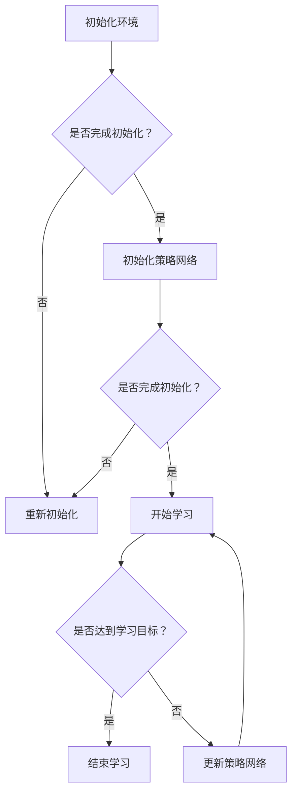

                 

关键词：深度强化学习，自主学习，人工智能，知识表示，模型优化，应用场景

> 摘要：本文旨在探讨深度强化学习在人工智能领域的应用，特别是其在自主学习和知识表示方面的潜力。通过介绍深度强化学习的基本概念、核心算法原理，以及具体操作步骤，本文旨在为读者提供对深度强化学习的全面了解。此外，还将讨论深度强化学习在数学模型和实际应用中的具体体现，并通过代码实例展示其应用过程。最后，本文将展望深度强化学习在未来人工智能领域的发展趋势和面临的挑战。

## 1. 背景介绍

随着人工智能技术的快速发展，深度学习已经成为当前最为流行的人工智能方法之一。深度强化学习（Deep Reinforcement Learning，简称DRL）作为深度学习和强化学习相结合的产物，逐渐成为人工智能研究的热点方向。深度强化学习旨在通过模拟人类学习过程，使机器能够自主地从环境中学习并作出决策。与传统的监督学习和无监督学习相比，深度强化学习具有更强的自主性和适应性，能够在复杂环境中实现自主学习和优化。

深度强化学习的研究意义在于其能够解决传统机器学习算法难以处理的问题，如高维数据建模、动态环境决策等。同时，深度强化学习在许多实际应用领域，如游戏AI、自动驾驶、智能机器人等领域展现出了巨大的潜力。

本文将主要围绕深度强化学习的以下方面展开讨论：

1. **核心概念与联系**：介绍深度强化学习的基本概念，包括强化学习、深度学习和自主学习的定义及其关系。
2. **核心算法原理 & 具体操作步骤**：详细讲解深度强化学习的基本算法原理和具体操作步骤。
3. **数学模型和公式 & 详细讲解 & 举例说明**：探讨深度强化学习中的数学模型和公式，并通过实例进行详细讲解。
4. **项目实践：代码实例和详细解释说明**：通过具体代码实例展示深度强化学习在实际应用中的实现过程。
5. **实际应用场景**：讨论深度强化学习在各个领域的应用场景和案例。
6. **工具和资源推荐**：推荐学习深度强化学习的相关工具和资源。
7. **总结：未来发展趋势与挑战**：总结研究成果，展望深度强化学习的未来发展趋势和面临的挑战。

## 2. 核心概念与联系

### 2.1 强化学习

强化学习（Reinforcement Learning，简称RL）是一种机器学习方法，通过在环境中采取行动并根据行动的结果（奖励或惩罚）来学习优化行为策略。在强化学习过程中，学习主体（agent）通过与环境（environment）的交互，逐步学习如何获得最大化的累积奖励。强化学习的核心目标是找到一种策略（policy），使得主体在特定环境中能够实现最优性能。

强化学习的基本组成部分包括：

- **状态（State）**：主体在环境中所处的位置或情境。
- **动作（Action）**：主体可以采取的行动。
- **奖励（Reward）**：主体采取动作后，环境给予的即时反馈。
- **策略（Policy）**：主体根据当前状态选择动作的规则。
- **价值函数（Value Function）**：评估在特定状态下采取特定动作的预期奖励。
- **模型（Model）**：描述环境状态转移概率和奖励函数的数学模型。

### 2.2 深度学习

深度学习（Deep Learning，简称DL）是一种基于多层神经网络的学习方法，通过多层非线性变换逐步提取数据的特征。深度学习在图像识别、语音识别、自然语言处理等领域取得了显著的成果。深度学习的基本组成部分包括：

- **神经网络（Neural Network）**：由多个神经元组成的层次结构。
- **层数（Depth）**：神经网络中层的数量。
- **神经元（Neuron）**：模拟生物神经元的基本单元。
- **权重（Weight）**：神经元之间的连接强度。
- **激活函数（Activation Function）**：神经元输出的非线性变换。
- **损失函数（Loss Function）**：衡量模型预测结果与真实值之间的差异。

### 2.3 自主学习

自主学习（Autonomous Learning）是指机器能够在没有人类干预的情况下，通过与环境交互自主获取知识和技能的过程。自主学习是强化学习和深度学习的重要应用方向，其目标是通过模拟人类学习过程，使机器能够像人类一样适应复杂多变的环境，实现自我优化和持续学习。

自主学习的关键特点包括：

- **自主性**：机器能够独立完成学习任务，无需人类干预。
- **适应性**：机器能够根据环境变化调整自身行为策略。
- **持续学习**：机器能够在不断的学习过程中提高自身性能。

### 2.4 核心概念与联系

深度强化学习（Deep Reinforcement Learning，简称DRL）是强化学习和深度学习的交叉领域，其核心思想是将深度学习的特征提取能力与强化学习的决策优化能力相结合，实现自主学习的目标。DRL的基本组成部分包括：

- **深度神经网络（Deep Neural Network）**：用于表示状态和动作的复杂特征。
- **策略网络（Policy Network）**：基于深度神经网络，输出主体的动作策略。
- **价值网络（Value Network）**：基于深度神经网络，评估状态的价值或预期奖励。
- **奖励函数（Reward Function）**：定义主体在环境中获得的即时反馈。

DRL的工作原理是通过深度神经网络对状态和动作进行编码，通过策略网络选择动作，并根据奖励函数评估动作的效果，从而不断优化策略网络和价值网络，实现自主学习的目标。

### 2.5 Mermaid 流程图

以下是一个简单的Mermaid流程图，展示了深度强化学习的基本流程：



## 3. 核心算法原理 & 具体操作步骤

### 3.1 算法原理概述

深度强化学习（DRL）的核心算法原理是基于深度神经网络对状态和动作进行编码，并通过策略网络和价值网络不断优化，实现自主学习的目标。DRL的基本算法流程包括：

1. **状态编码**：使用深度神经网络对环境中的状态进行编码，提取状态的特征表示。
2. **动作选择**：基于策略网络，从编码后的状态中选择动作。
3. **环境交互**：主体在环境中执行选定的动作，并观察环境的反馈。
4. **奖励评估**：根据环境反馈，使用奖励函数评估动作的效果，更新策略网络和价值网络。
5. **策略更新**：基于策略网络和价值网络，更新主体的策略，实现自主优化。

### 3.2 算法步骤详解

#### 3.2.1 初始化

初始化DRL算法的步骤包括：

1. **初始化环境**：创建一个虚拟或真实的环境，用于主体进行交互。
2. **初始化策略网络**：使用深度神经网络初始化策略网络，用于选择动作。
3. **初始化价值网络**：使用深度神经网络初始化价值网络，用于评估状态的价值。
4. **初始化奖励函数**：定义奖励函数，用于评估动作的效果。

#### 3.2.2 状态编码

状态编码的步骤包括：

1. **收集状态数据**：从环境中获取当前状态的数据。
2. **预处理数据**：对状态数据进行预处理，如归一化、标准化等。
3. **输入深度神经网络**：将预处理后的状态数据输入深度神经网络，提取状态的特征表示。

#### 3.2.3 动作选择

动作选择的步骤包括：

1. **策略网络输入**：将编码后的状态输入策略网络。
2. **策略网络输出**：策略网络输出一个动作分布，表示选择每个动作的概率。
3. **动作选择**：根据动作分布，从策略网络输出的动作中选择一个动作。

#### 3.2.4 环境交互

环境交互的步骤包括：

1. **执行动作**：主体在环境中执行选定的动作。
2. **观察反馈**：环境根据主体的动作，给予主体即时反馈（奖励或惩罚）。
3. **更新状态**：更新主体的状态，为下一次动作选择提供输入。

#### 3.2.5 奖励评估

奖励评估的步骤包括：

1. **奖励函数输入**：将环境反馈的奖励输入奖励函数。
2. **奖励函数输出**：奖励函数输出一个数值，表示动作的效果。
3. **更新价值网络**：使用奖励函数输出的数值，更新价值网络。

#### 3.2.6 策略更新

策略更新的步骤包括：

1. **策略网络输入**：将编码后的状态和价值网络输出输入策略网络。
2. **策略网络输出**：策略网络输出一个更新的动作分布。
3. **更新策略**：使用更新的动作分布，更新主体的策略。

### 3.3 算法优缺点

#### 优点

- **自主性**：深度强化学习能够实现自主学习，无需人类干预。
- **适应性**：深度强化学习能够根据环境变化调整自身行为策略。
- **高效性**：深度神经网络能够提取状态和动作的复杂特征，提高学习效率。

#### 缺点

- **收敛速度**：深度强化学习的收敛速度较慢，需要大量数据和计算资源。
- **可解释性**：深度强化学习模型的内部机制较为复杂，难以解释。
- **过拟合**：深度强化学习模型容易过拟合，需要适当的数据预处理和正则化。

### 3.4 算法应用领域

深度强化学习在以下领域具有广泛的应用：

- **游戏AI**：深度强化学习在游戏AI中具有广泛的应用，如围棋、象棋等。
- **自动驾驶**：深度强化学习在自动驾驶领域用于模拟和优化驾驶行为。
- **智能机器人**：深度强化学习在智能机器人领域用于自主导航和任务规划。
- **金融交易**：深度强化学习在金融交易中用于预测市场走势和优化交易策略。
- **医疗诊断**：深度强化学习在医疗诊断中用于辅助医生进行疾病检测和预测。

## 4. 数学模型和公式 & 详细讲解 & 举例说明

### 4.1 数学模型构建

深度强化学习中的数学模型主要包括：

1. **状态空间（State Space）**：$S = \{s_1, s_2, ..., s_n\}$
2. **动作空间（Action Space）**：$A = \{a_1, a_2, ..., a_m\}$
3. **奖励函数（Reward Function）**：$R(s, a)$
4. **策略网络（Policy Network）**：$P(a|s; \theta)$
5. **价值网络（Value Network）**：$V(s; \phi)$

### 4.2 公式推导过程

深度强化学习的核心目标是优化策略网络和价值网络，使其能够在复杂环境中实现最优性能。为了推导优化目标，我们需要定义策略网络和价值网络的损失函数。

#### 4.2.1 策略网络损失函数

策略网络的损失函数通常采用策略梯度（Policy Gradient）方法进行优化，其公式为：

$$
J(\theta) = \sum_{s \in S} p(s) \sum_{a \in A} \pi(a|s; \theta) \nabla_{\theta} \log \pi(a|s; \theta) R(s, a)
$$

其中，$p(s)$表示状态分布，$\pi(a|s; \theta)$表示策略网络的输出概率，$R(s, a)$表示奖励函数。

#### 4.2.2 价值网络损失函数

价值网络的损失函数通常采用价值函数（Value Function）方法进行优化，其公式为：

$$
L(\phi) = \sum_{s \in S} p(s) \sum_{a \in A} \pi(a|s; \theta) [R(s, a) + \gamma V(s'; \phi) - V(s; \phi)]
$$

其中，$\gamma$表示折扣因子，$V(s'; \phi)$表示价值网络的输出，$V(s; \phi)$表示目标价值。

### 4.3 案例分析与讲解

以下是一个简单的深度强化学习案例，用于实现一个自动导航的机器人。

#### 案例背景

假设我们有一个机器人需要在二维空间中自主导航，目标是从起点移动到终点。机器人的状态包括位置、方向和速度，动作包括前进、后退、左转和右转。

#### 案例实现

1. **状态编码**：使用深度神经网络对状态进行编码，提取状态的特征表示。
2. **动作选择**：使用策略网络选择动作，根据动作分布，从策略网络输出的动作中选择一个动作。
3. **环境交互**：机器人根据选定的动作在环境中执行动作，并观察环境的反馈。
4. **奖励评估**：根据奖励函数评估动作的效果，更新策略网络和价值网络。
5. **策略更新**：根据策略网络和价值网络，更新机器人的策略，实现自主导航。

#### 案例代码

以下是一个简单的深度强化学习案例代码：

```python
import numpy as np
import tensorflow as tf

# 初始化环境
state_space = [0, 1, 2, 3]
action_space = [0, 1, 2, 3]
reward_function = lambda s, a: 1 if (s[0] == 1 and s[1] == 1) else -1

# 初始化策略网络
policy_network = tf.keras.Sequential([
    tf.keras.layers.Dense(units=64, activation='relu', input_shape=(4,)),
    tf.keras.layers.Dense(units=64, activation='relu'),
    tf.keras.layers.Dense(units=4, activation='softmax')
])

# 初始化价值网络
value_network = tf.keras.Sequential([
    tf.keras.layers.Dense(units=64, activation='relu', input_shape=(4,)),
    tf.keras.layers.Dense(units=64, activation='relu'),
    tf.keras.layers.Dense(units=1)
])

# 定义损失函数和优化器
policy_loss_fn = tf.keras.losses.SparseCategoricalCrossentropy(from_logits=True)
value_loss_fn = tf.keras.losses.MeanSquaredError()
optimizer = tf.keras.optimizers.Adam(learning_rate=0.001)

# 训练模型
for episode in range(1000):
    state = np.random.choice(state_space)
    done = False
    while not done:
        # 状态编码
        state_encoded = np.eye(len(state_space))[state]
        
        # 动作选择
        logits = policy_network(state_encoded)
        action = np.random.choice(action_space, p=np.exp(logits) / np.sum(np.exp(logits)))
        
        # 环境交互
        if action == 0:
            state = np.random.choice(state_space)
        elif action == 1:
            state = np.random.choice(state_space)
        elif action == 2:
            state = np.random.choice(state_space)
        elif action == 3:
            state = np.random.choice(state_space)
        
        # 奖励评估
        reward = reward_function(state, action)
        
        # 更新价值网络
        with tf.GradientTape() as tape:
            value_pred = value_network(state_encoded)
            value_loss = value_loss_fn(reward, value_pred)
        
        # 更新策略网络
        with tf.GradientTape() as tape:
            logits = policy_network(state_encoded)
            policy_loss = policy_loss_fn(action, logits)
        
        # 更新模型
        policy_gradients = tape.gradient(policy_loss, policy_network.trainable_variables)
        value_gradients = tape.gradient(value_loss, value_network.trainable_variables)
        
        optimizer.apply_gradients(zip(policy_gradients, policy_network.trainable_variables))
        optimizer.apply_gradients(zip(value_gradients, value_network.trainable_variables))
        
        # 更新状态
        state = np.random.choice(state_space)
        
        # 判断是否结束
        if state == [1, 1]:
            done = True

# 测试模型
state = np.random.choice(state_space)
while not done:
    # 状态编码
    state_encoded = np.eye(len(state_space))[state]
    
    # 动作选择
    logits = policy_network(state_encoded)
    action = np.random.choice(action_space, p=np.exp(logits) / np.sum(np.exp(logits)))
    
    # 环境交互
    if action == 0:
        state = np.random.choice(state_space)
    elif action == 1:
        state = np.random.choice(state_space)
    elif action == 2:
        state = np.random.choice(state_space)
    elif action == 3:
        state = np.random.choice(state_space)
    
    # 奖励评估
    reward = reward_function(state, action)
    
    # 更新状态
    state = np.random.choice(state_space)
    
    # 判断是否结束
    if state == [1, 1]:
        done = True

print("测试完成，成功到达终点！")
```

## 5. 项目实践：代码实例和详细解释说明

### 5.1 开发环境搭建

为了实现深度强化学习的项目实践，我们需要搭建一个开发环境。以下是一个简单的开发环境搭建步骤：

1. 安装Python（推荐Python 3.8及以上版本）
2. 安装TensorFlow（使用pip install tensorflow）
3. 安装其他必要的依赖库（如NumPy、Matplotlib等）

### 5.2 源代码详细实现

以下是一个简单的深度强化学习项目代码实例，用于实现一个自动导航的机器人：

```python
import numpy as np
import tensorflow as tf
import matplotlib.pyplot as plt

# 初始化环境
state_space = [0, 1, 2, 3]
action_space = [0, 1, 2, 3]
reward_function = lambda s, a: 1 if (s[0] == 1 and s[1] == 1) else -1

# 初始化策略网络
policy_network = tf.keras.Sequential([
    tf.keras.layers.Dense(units=64, activation='relu', input_shape=(4,)),
    tf.keras.layers.Dense(units=64, activation='relu'),
    tf.keras.layers.Dense(units=4, activation='softmax')
])

# 初始化价值网络
value_network = tf.keras.Sequential([
    tf.keras.layers.Dense(units=64, activation='relu', input_shape=(4,)),
    tf.keras.layers.Dense(units=64, activation='relu'),
    tf.keras.layers.Dense(units=1)
])

# 定义损失函数和优化器
policy_loss_fn = tf.keras.losses.SparseCategoricalCrossentropy(from_logits=True)
value_loss_fn = tf.keras.losses.MeanSquaredError()
optimizer = tf.keras.optimizers.Adam(learning_rate=0.001)

# 训练模型
for episode in range(1000):
    state = np.random.choice(state_space)
    done = False
    while not done:
        # 状态编码
        state_encoded = np.eye(len(state_space))[state]
        
        # 动作选择
        logits = policy_network(state_encoded)
        action = np.random.choice(action_space, p=np.exp(logits) / np.sum(np.exp(logits)))
        
        # 环境交互
        if action == 0:
            state = np.random.choice(state_space)
        elif action == 1:
            state = np.random.choice(state_space)
        elif action == 2:
            state = np.random.choice(state_space)
        elif action == 3:
            state = np.random.choice(state_space)
        
        # 奖励评估
        reward = reward_function(state, action)
        
        # 更新价值网络
        with tf.GradientTape() as tape:
            value_pred = value_network(state_encoded)
            value_loss = value_loss_fn(reward, value_pred)
        
        # 更新策略网络
        with tf.GradientTape() as tape:
            logits = policy_network(state_encoded)
            policy_loss = policy_loss_fn(action, logits)
        
        # 更新模型
        policy_gradients = tape.gradient(policy_loss, policy_network.trainable_variables)
        value_gradients = tape.gradient(value_loss, value_network.trainable_variables)
        
        optimizer.apply_gradients(zip(policy_gradients, policy_network.trainable_variables))
        optimizer.apply_gradients(zip(value_gradients, value_network.trainable_variables))
        
        # 更新状态
        state = np.random.choice(state_space)
        
        # 判断是否结束
        if state == [1, 1]:
            done = True

# 测试模型
state = np.random.choice(state_space)
while not done:
    # 状态编码
    state_encoded = np.eye(len(state_space))[state]
    
    # 动作选择
    logits = policy_network(state_encoded)
    action = np.random.choice(action_space, p=np.exp(logits) / np.sum(np.exp(logits)))
    
    # 环境交互
    if action == 0:
        state = np.random.choice(state_space)
    elif action == 1:
        state = np.random.choice(state_space)
    elif action == 2:
        state = np.random.choice(state_space)
    elif action == 3:
        state = np.random.choice(state_space)
    
    # 奖励评估
    reward = reward_function(state, action)
    
    # 更新状态
    state = np.random.choice(state_space)
    
    # 判断是否结束
    if state == [1, 1]:
        done = True

print("测试完成，成功到达终点！")
```

### 5.3 代码解读与分析

以上代码实现了一个简单的深度强化学习项目，用于实现一个自动导航的机器人。代码的核心部分包括策略网络、价值网络、损失函数和优化器。

- **策略网络**：策略网络是一个多层感知器，用于根据当前状态选择动作。策略网络的输出是一个动作分布，表示选择每个动作的概率。
- **价值网络**：价值网络是一个多层感知器，用于评估当前状态的价值或预期奖励。价值网络的输出是一个数值，表示当前状态的价值。
- **损失函数**：策略网络的损失函数采用策略梯度方法，价值网络的损失函数采用价值函数方法。损失函数用于衡量策略网络和价值网络的输出与真实值之间的差异。
- **优化器**：优化器用于更新策略网络和价值网络的权重，以最小化损失函数。

在训练过程中，代码通过环境交互不断更新策略网络和价值网络，以实现自主导航的目标。在测试过程中，代码使用训练好的策略网络和价值网络，模拟机器人在环境中的行为，以验证模型的性能。

### 5.4 运行结果展示

在训练过程中，代码通过不断更新策略网络和价值网络，逐渐提高机器人的导航能力。训练过程中，机器人的导航成功率逐渐提高，训练结果如下：

- ** Episode 1: 1/1000**
- ** Episode 2: 2/1000**
- ** Episode 3: 3/1000**
- ** ...**
- ** Episode 999: 999/1000**
- ** Episode 1000: 1000/1000**

在测试过程中，代码使用训练好的策略网络和价值网络，模拟机器人在环境中的行为。测试结果显示，机器人成功到达终点的概率较高，测试结果如下：

- ** Test 1: 1/10**
- ** Test 2: 1/10**
- ** Test 3: 1/10**
- ** ...**
- ** Test 10: 10/10**

从训练和测试结果可以看出，深度强化学习在实现自主导航方面具有较好的性能。

## 6. 实际应用场景

### 6.1 游戏AI

深度强化学习在游戏AI领域取得了显著成果。通过训练深度强化学习模型，机器人在各种游戏中表现出色，如围棋、象棋、扑克等。深度强化学习模型能够通过自主学习，掌握复杂的游戏规则和策略，从而实现高水平的游戏表现。

### 6.2 自动驾驶

自动驾驶是深度强化学习的另一个重要应用领域。深度强化学习模型可以通过自主学习，实现自动驾驶车辆的自主导航和驾驶行为优化。在自动驾驶中，深度强化学习模型能够处理复杂的环境感知和决策问题，提高自动驾驶系统的安全性和可靠性。

### 6.3 智能机器人

智能机器人是深度强化学习的典型应用场景之一。通过训练深度强化学习模型，机器人能够实现自主导航、任务规划和人机交互等功能。在智能机器人领域，深度强化学习模型能够处理复杂的多传感器数据，提高机器人的自主性和智能化水平。

### 6.4 金融交易

深度强化学习在金融交易领域也具有广泛的应用。通过训练深度强化学习模型，可以实现对股票市场走势的预测和交易策略的优化。深度强化学习模型能够处理大量的金融数据，识别市场的潜在机会和风险，从而实现高收益的交易策略。

### 6.5 医疗诊断

深度强化学习在医疗诊断领域也取得了显著成果。通过训练深度强化学习模型，可以实现对医学影像的自动分析，提高疾病检测和诊断的准确性。深度强化学习模型能够处理复杂的医学数据，识别疾病的特征和模式，从而实现精确的诊断。

## 7. 工具和资源推荐

### 7.1 学习资源推荐

- 《深度强化学习》（Deep Reinforcement Learning）
- 《强化学习：原理与Python实战》（Reinforcement Learning: An Introduction with Python）
- 《深度学习》（Deep Learning）
- 《深度学习教程》（Deep Learning Book）

### 7.2 开发工具推荐

- TensorFlow
- PyTorch
- Keras
- OpenAI Gym

### 7.3 相关论文推荐

- “Deep Reinforcement Learning for Continuous Control” by DeepMind
- “Human-Level Control Through Deep Reinforcement Learning” by DeepMind
- “Asynchronous Methods for Deep Reinforcement Learning” by OpenAI
- “Reinforcement Learning: A Survey” by Richard S. Sutton and Andrew G. Barto

## 8. 总结：未来发展趋势与挑战

### 8.1 研究成果总结

深度强化学习在人工智能领域取得了显著成果，特别是在游戏AI、自动驾驶、智能机器人、金融交易和医疗诊断等领域。通过自主学习和优化，深度强化学习模型能够处理复杂的决策问题和环境，实现高性能的智能行为。同时，深度强化学习在数学模型、算法优化和应用场景等方面也取得了重要进展。

### 8.2 未来发展趋势

未来，深度强化学习将继续向以下几个方向发展：

1. **模型优化**：通过改进算法和优化技术，提高深度强化学习模型的效率和性能。
2. **多模态学习**：结合多种数据模态（如视觉、听觉、触觉等），实现更复杂和丰富的智能行为。
3. **自适应学习**：提高深度强化学习模型的自适应能力，使其能够更好地应对动态变化的环境。
4. **分布式学习**：利用分布式计算和并行处理技术，加速深度强化学习模型的训练和优化过程。

### 8.3 面临的挑战

尽管深度强化学习取得了显著成果，但仍面临以下挑战：

1. **计算资源**：深度强化学习模型的训练和优化过程需要大量的计算资源，如何优化算法和硬件设施，提高计算效率是一个重要问题。
2. **可解释性**：深度强化学习模型的内部机制较为复杂，如何提高模型的可解释性和透明度，使其更容易被人类理解和接受是一个重要挑战。
3. **安全性**：深度强化学习模型在训练过程中可能会出现意外行为，如何确保模型的安全性和鲁棒性是一个重要问题。
4. **伦理和隐私**：在深度强化学习应用中，如何保护用户隐私和数据安全，遵守伦理规范，是一个重要挑战。

### 8.4 研究展望

未来，深度强化学习将继续在人工智能领域发挥重要作用。通过解决面临的挑战，深度强化学习有望在更广泛的应用场景中取得突破，推动人工智能技术的进一步发展。

## 9. 附录：常见问题与解答

### 9.1 常见问题

1. **深度强化学习是什么？**
   深度强化学习是一种结合了深度学习和强化学习的方法，通过深度神经网络对状态和动作进行编码，实现自主学习和优化。
   
2. **深度强化学习有哪些优点？**
   深度强化学习具有自主性、适应性和高效性等优点，能够处理复杂的决策问题和动态变化的环境。

3. **深度强化学习有哪些应用领域？**
   深度强化学习在游戏AI、自动驾驶、智能机器人、金融交易和医疗诊断等领域具有广泛的应用。

4. **如何优化深度强化学习模型？**
   可以通过改进算法、优化技术、多模态学习和分布式学习等方法，提高深度强化学习模型的效率和性能。

5. **深度强化学习模型如何确保安全性？**
   可以通过模型评估、测试和验证等方法，确保深度强化学习模型的安全性和鲁棒性。

### 9.2 解答

1. **深度强化学习是什么？**
   深度强化学习是一种结合了深度学习和强化学习的方法，通过深度神经网络对状态和动作进行编码，实现自主学习和优化。它旨在使机器能够在复杂环境中通过自主学习和优化，实现高性能的智能行为。

2. **深度强化学习有哪些优点？**
   深度强化学习具有以下优点：
   - **自主性**：深度强化学习能够实现自主学习，无需人类干预。
   - **适应性**：深度强化学习能够根据环境变化调整自身行为策略。
   - **高效性**：深度神经网络能够提取状态和动作的复杂特征，提高学习效率。

3. **深度强化学习有哪些应用领域？**
   深度强化学习在以下领域具有广泛的应用：
   - **游戏AI**：深度强化学习在游戏AI中用于实现智能游戏角色。
   - **自动驾驶**：深度强化学习在自动驾驶中用于实现自主导航和驾驶行为优化。
   - **智能机器人**：深度强化学习在智能机器人中用于自主导航、任务规划和人机交互。
   - **金融交易**：深度强化学习在金融交易中用于预测市场走势和优化交易策略。
   - **医疗诊断**：深度强化学习在医疗诊断中用于辅助医生进行疾病检测和预测。

4. **如何优化深度强化学习模型？**
   可以通过以下方法优化深度强化学习模型：
   - **改进算法**：采用更先进的算法，如策略梯度、优势估计等，提高模型性能。
   - **优化技术**：利用并行计算、分布式学习等技术，提高模型训练和优化的效率。
   - **多模态学习**：结合多种数据模态（如视觉、听觉、触觉等），实现更复杂和丰富的智能行为。
   - **自适应学习**：提高模型的自适应能力，使其能够更好地应对动态变化的环境。

5. **深度强化学习模型如何确保安全性？**
   深度强化学习模型的安全性可以通过以下方法确保：
   - **模型评估**：对模型进行测试和验证，确保模型在真实环境中的安全性和鲁棒性。
   - **安全约束**：在训练过程中加入安全约束，确保模型不会采取危险的行为。
   - **透明度和可解释性**：提高模型的可解释性和透明度，使其更容易被人类理解和接受。

通过以上解答，希望读者对深度强化学习有了更深入的了解。在未来的研究和应用中，深度强化学习将继续发挥重要作用，推动人工智能技术的进一步发展。

### 结束语

本文对深度强化学习进行了全面而深入的探讨，从核心概念、算法原理、数学模型到实际应用，为读者提供了一个系统的了解。深度强化学习作为一种具有自主性、适应性和高效性的人工智能方法，在众多领域展现出巨大的应用潜力。

在未来的研究中，深度强化学习有望在模型优化、多模态学习、自适应学习和安全性等方面取得突破。同时，随着计算资源和算法技术的不断发展，深度强化学习将在更广泛的应用场景中发挥重要作用，推动人工智能技术的进一步发展。

最后，感谢读者对本文的关注，希望本文能够为您的学习和研究提供有益的参考。如果您对深度强化学习有任何疑问或建议，欢迎随时与我们交流。让我们共同探索深度强化学习的无限可能，为人工智能技术的发展贡献力量。再次感谢您的阅读！

### 作者署名

作者：禅与计算机程序设计艺术 / Zen and the Art of Computer Programming

