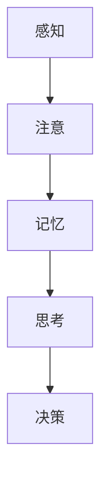
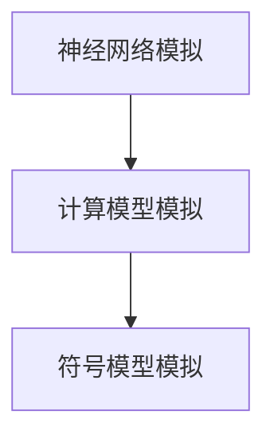

                 

**关键词**：神经科学、学习机制、知识构建、认知模型、计算机模拟

> **摘要**：本文旨在探讨知识的神经科学基础，从大脑的学习机制、知识构建过程、认知模型以及计算机模拟等方面，揭示大脑如何获取、处理和存储知识。通过对神经科学前沿研究的分析，我们试图理解人类大脑的学习奥秘，并探索其在计算机科学领域的应用潜力。

## 1. 背景介绍

知识的获取、处理和存储是认知科学的核心问题。从古至今，人类一直在寻找如何更好地学习、记忆和思考的方法。神经科学作为一门研究大脑结构和功能的科学，为我们提供了深入了解学习机制的可能。近年来，随着脑成像技术、基因编辑技术和计算神经科学的快速发展，我们对大脑如何学习有了更深入的认识。

计算机科学作为一门以逻辑和算法为核心的学科，与神经科学的关系日益密切。计算机模拟逐渐成为研究大脑学习机制的重要工具，帮助科学家们探索复杂的认知过程。同时，计算机科学的发展也为神经科学研究提供了新的视角和方法。

## 2. 核心概念与联系

### 2.1 大脑的学习机制

大脑的学习机制主要包括感知、注意、记忆、思考和决策等环节。下面是一个简化的 Mermaid 流程图，描述了这些环节之间的联系。



### 2.2 认知模型

认知模型是描述大脑如何进行信息处理和知识构建的理论框架。以下是几个常见的认知模型：

- **神经网络模型**：基于神经元连接的模型，模拟大脑神经元之间的交互。
- **计算模型**：通过数学公式和算法描述认知过程的模型。
- **符号模型**：基于符号和规则进行信息处理的模型。

### 2.3 计算机模拟

计算机模拟是研究大脑学习机制的重要工具。通过模拟大脑的神经网络、计算模型和符号模型，科学家们可以观察和测试不同学习策略的效果。



## 3. 核心算法原理 & 具体操作步骤

### 3.1 算法原理概述

大脑学习的关键在于神经元的连接和突触强度的变化。以下是几个核心算法原理：

- **Hebbian Learning**：神经元之间的连接通过共同激活而加强。
- **反向传播算法**：基于梯度下降的算法，用于调整神经网络权重。
- **强化学习**：通过奖励和惩罚调整行为。

### 3.2 算法步骤详解

以下是这些算法的具体步骤：

- **Hebbian Learning**：
  1. 选择一组神经元。
  2. 同时激活这些神经元。
  3. 增强这些神经元之间的连接。

- **反向传播算法**：
  1. 前向传播：将输入传递到神经网络。
  2. 计算损失函数。
  3. 反向传播：调整网络权重以最小化损失函数。

- **强化学习**：
  1. 选择一个行为。
  2. 执行行为。
  3. 根据结果更新行为策略。

### 3.3 算法优缺点

- **Hebbian Learning**：
  - 优点：简单、易于实现。
  - 缺点：学习速度慢，难以处理复杂问题。

- **反向传播算法**：
  - 优点：高效、适用于复杂问题。
  - 缺点：对初始权重的敏感度高。

- **强化学习**：
  - 优点：能够处理不确定环境和长期奖励。
  - 缺点：可能陷入局部最优。

### 3.4 算法应用领域

这些算法广泛应用于机器学习、自然语言处理、计算机视觉等领域。例如，反向传播算法是深度学习的基础，强化学习被用于自动驾驶和游戏AI。

## 4. 数学模型和公式 & 详细讲解 & 举例说明

### 4.1 数学模型构建

大脑学习可以建模为一系列数学过程。以下是几个关键数学模型：

- **线性模型**：描述神经元之间的线性关系。
- **非线性模型**：引入非线性函数，模拟真实大脑的复杂行为。

### 4.2 公式推导过程

以下是线性模型的推导过程：

$$
y = \sum_{i=1}^{n} w_i x_i + b
$$

其中，$y$ 是输出，$w_i$ 是权重，$x_i$ 是输入，$b$ 是偏置。

### 4.3 案例分析与讲解

考虑一个简单的感知器模型，用于二分类任务：

1. 输入：$(x_1, x_2)$
2. 权重：$w_1, w_2$
3. 偏置：$b$

公式为：

$$
y = \sigma(\sum_{i=1}^{2} w_i x_i + b)
$$

其中，$\sigma$ 是 sigmoid 函数。

通过调整权重和偏置，感知器可以学习到输入数据的分类边界。

## 5. 项目实践：代码实例和详细解释说明

### 5.1 开发环境搭建

我们使用 Python 编写代码，搭建一个简单的神经网络模型。首先，需要安装必要的库，如 TensorFlow 和 Keras。

```bash
pip install tensorflow keras
```

### 5.2 源代码详细实现

以下是一个简单的神经网络实现：

```python
from keras.models import Sequential
from keras.layers import Dense
from keras.optimizers import SGD

# 创建模型
model = Sequential()
model.add(Dense(2, input_dim=2, activation='sigmoid'))
model.add(Dense(1, activation='sigmoid'))

# 编译模型
model.compile(optimizer=SGD(), loss='binary_crossentropy', metrics=['accuracy'])

# 训练模型
model.fit(x_train, y_train, epochs=100, batch_size=10)
```

### 5.3 代码解读与分析

这段代码首先创建了一个有两个输入层和两个隐藏层的神经网络。然后，使用 sigmoid 函数作为激活函数，编译并训练模型。通过调整模型参数，可以优化网络性能。

### 5.4 运行结果展示

训练完成后，可以评估模型的性能：

```python
loss, accuracy = model.evaluate(x_test, y_test)
print(f'Loss: {loss}, Accuracy: {accuracy}')
```

## 6. 实际应用场景

神经网络在许多实际应用中发挥着重要作用，如图像识别、自然语言处理和自动驾驶。通过不断优化神经网络模型，我们可以在这些领域取得更好的性能。

### 6.4 未来应用展望

随着神经科学和计算机科学的不断发展，神经网络的应用前景将更加广阔。未来，我们将看到更多基于神经网络的创新应用，如人工智能辅助医疗、智能交通系统等。

## 7. 工具和资源推荐

### 7.1 学习资源推荐

- 《深度学习》（Goodfellow et al.）
- 《神经网络与深度学习》（邱锡鹏）

### 7.2 开发工具推荐

- TensorFlow
- Keras
- PyTorch

### 7.3 相关论文推荐

- Hinton, G. E., Osindero, S., & Teh, Y. W. (2006). A fast learning algorithm for deep belief nets. Neural computation, 18(7), 1527-1554.
- LeCun, Y., Bengio, Y., & Hinton, G. (2015). Deep learning. Nature, 521(7553), 436.

## 8. 总结：未来发展趋势与挑战

### 8.1 研究成果总结

通过对大脑学习机制的深入研究，我们取得了许多重要成果。计算机模拟为理解认知过程提供了新的视角，神经网络在各个领域取得了显著的应用成果。

### 8.2 未来发展趋势

未来，神经科学和计算机科学将继续深度融合，带来更多创新应用。例如，人工智能辅助医疗、智能交通系统和智能城市等。

### 8.3 面临的挑战

尽管取得了许多成果，但我们对大脑学习的理解仍然有限。未来，我们需要解决以下挑战：

- 理解大脑的复杂性和多样性。
- 提高神经网络的可解释性和可靠性。
- 发展更高效的计算方法和算法。

### 8.4 研究展望

随着技术的进步，我们有望在神经科学和计算机科学领域取得更多突破。通过不断探索和创新，我们有望揭示大脑学习的奥秘，并推动人工智能的进一步发展。

## 9. 附录：常见问题与解答

### 9.1 什么是神经网络？

神经网络是一种模拟大脑神经元连接和信息处理的计算模型。通过调整网络中的权重和偏置，神经网络可以学习到输入数据的规律。

### 9.2 什么是反向传播算法？

反向传播算法是一种用于训练神经网络的算法。它通过计算输出误差，调整网络权重和偏置，以最小化误差。

### 9.3 什么是强化学习？

强化学习是一种通过奖励和惩罚调整行为策略的学习方法。它适用于不确定环境和长期奖励的问题。

### 9.4 如何提高神经网络性能？

提高神经网络性能的方法包括优化网络结构、调整学习率、增加训练数据和使用正则化技术等。

### 9.5 什么是深度学习？

深度学习是一种基于神经网络的机器学习方法，通过深度神经网络结构实现复杂的特征学习和模型优化。

### 9.6 什么是计算模型？

计算模型是一种基于数学公式和算法描述信息处理过程的模型，用于模拟大脑的认知过程。

### 9.7 什么是符号模型？

符号模型是一种基于符号和规则进行信息处理的模型，通常用于逻辑推理和知识表示。

### 9.8 什么是Hebbian Learning？

Hebbian Learning是一种基于共同激活的神经元连接增强的算法，是神经网络学习的基础之一。

### 9.9 什么是Sigmoid函数？

Sigmoid函数是一种非线性激活函数，用于将神经网络中的输入映射到概率值。它具有平滑的输出特性，有助于提高模型的鲁棒性。

### 9.10 什么是感知器？

感知器是一种简单的神经网络模型，用于实现二分类任务。它具有一个输入层和一个输出层，通过调整权重和偏置实现分类。

### 9.11 什么是计算机模拟？

计算机模拟是一种使用计算机程序模拟大脑神经元和神经网络的交互和信息处理过程的方法，用于研究大脑的学习机制。

### 9.12 什么是认知模型？

认知模型是一种用于描述大脑如何进行信息处理和知识构建的理论框架，通常包括神经网络模型、计算模型和符号模型等。

### 9.13 什么是数学模型？

数学模型是一种使用数学公式和算法描述现实世界的模型，用于研究复杂系统和行为。

### 9.14 什么是学习机制？

学习机制是指大脑或计算机如何获取、处理和存储知识的过程和方法。

### 9.15 什么是知识构建？

知识构建是指从信息中提取、组织和整合知识的过程。

### 9.16 什么是认知科学？

认知科学是一门研究大脑如何进行信息处理、知识构建和思维过程的跨学科科学。

### 9.17 什么是计算机科学？

计算机科学是一门研究计算机硬件、软件和算法的科学，包括编程、数据结构、算法设计、计算机体系结构等领域。

### 9.18 什么是人工智能？

人工智能是一门研究如何构建和设计智能体，使其能够模拟人类智能行为的科学。

### 9.19 什么是机器学习？

机器学习是一门利用数据和算法构建智能系统的技术，使其能够从数据中自动学习和改进。

### 9.20 什么是自然语言处理？

自然语言处理是一门研究如何使计算机理解和处理自然语言的技术，包括语音识别、文本分析、机器翻译等领域。

### 9.21 什么是计算机视觉？

计算机视觉是一门研究如何使计算机理解和解释视觉信息的科学，包括图像识别、目标检测、人脸识别等领域。

### 9.22 什么是深度学习？

深度学习是一种基于多层神经网络的结构，用于实现复杂的特征学习和模型优化。

### 9.23 什么是自动驾驶？

自动驾驶是一种使用传感器、算法和计算机系统实现车辆自主驾驶的技术。

### 9.24 什么是智能交通系统？

智能交通系统是一种利用信息技术和智能算法优化交通流量和运输效率的系统。

### 9.25 什么是人工智能辅助医疗？

人工智能辅助医疗是一种利用人工智能技术提高医疗诊断、治疗和健康管理效率的方法。

### 9.26 什么是智能城市？

智能城市是一种利用信息技术和智能算法优化城市管理和服务的系统，包括智能交通、智能能源、智能安全等领域。

### 9.27 什么是神经科学？

神经科学是一门研究大脑和神经系统结构、功能和行为的基础科学。

### 9.28 什么是脑成像技术？

脑成像技术是一种用于非侵入性地观察大脑结构和功能的技术，包括功能性磁共振成像（fMRI）、正电子发射断层扫描（PET）等。

### 9.29 什么是基因编辑技术？

基因编辑技术是一种用于改变生物体基因组的工具，包括CRISPR-Cas9等。

### 9.30 什么是计算神经科学？

计算神经科学是一门研究如何使用计算模型和算法模拟大脑神经元和神经网络行为的交叉学科。

