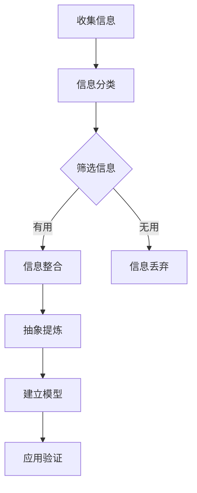
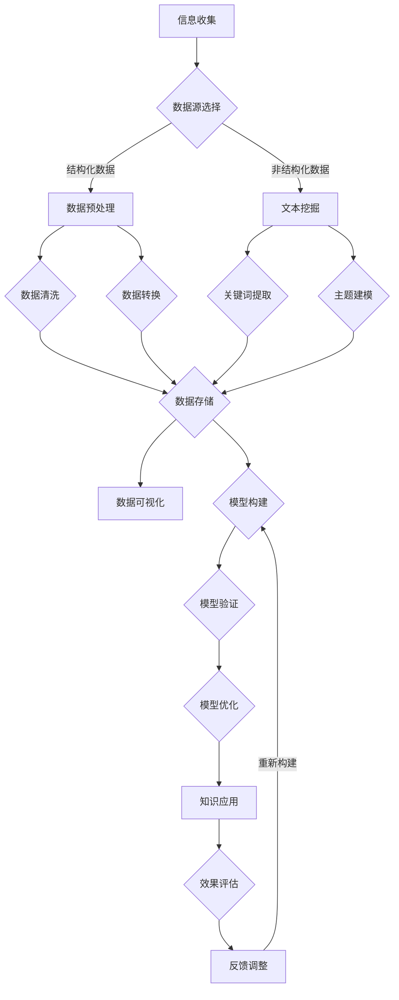

                 

关键词：知识结构化、理解效率、信息处理、认知心理学、学习方法、认知模型、抽象思维、信息可视化。

> 摘要：本文旨在探讨知识结构化的方法及其对提升理解效率的影响。通过深入分析认知心理学原理和现有的学习方法，本文提出了一套结构化知识的方法论，旨在帮助读者更有效地吸收、处理和利用信息。文章将结合具体案例和实践经验，展示如何将复杂信息结构化，并提高信息处理的效率。

## 1. 背景介绍

在信息爆炸的时代，如何高效地处理和利用信息成为一个重要课题。信息处理能力直接影响着个人的工作效率和知识掌握程度。传统的方法如记忆、笔记和简单的分类已经无法满足快速变化的信息环境需求。因此，有必要探索一种更系统、更高效的手段来组织和管理知识，以提高理解效率。

知识结构化是一种将杂乱无章的信息通过分类、归纳、抽象等方式转化为系统化、模块化的过程。这一过程不仅有助于信息的存储和检索，还可以促进信息的深度理解和灵活应用。知识结构化的目标是使知识变得有序，易于理解和记忆，从而提高信息处理效率。

本文将从以下几个方面展开讨论：

- **认知心理学原理**：介绍知识结构化背后的心理学原理，如记忆、注意力、抽象思维等。
- **现有学习方法**：分析现有的学习方法，探讨它们在知识结构化中的作用和局限性。
- **知识结构化的方法论**：提出一套结构化知识的方法，包括分类、归纳、抽象、信息可视化等。
- **核心算法原理与操作步骤**：介绍核心算法的基本原理和具体操作步骤，帮助读者理解和应用知识结构化方法。
- **数学模型与公式**：构建数学模型，推导相关公式，并提供案例分析与讲解。
- **项目实践**：通过具体代码实例，展示知识结构化的实际应用。
- **实际应用场景**：探讨知识结构化在不同领域的应用，以及未来展望。
- **工具和资源推荐**：推荐学习资源和开发工具，帮助读者深入学习和实践。
- **总结与展望**：总结研究成果，探讨未来发展趋势和面临的挑战。

## 2. 核心概念与联系

在探讨知识结构化之前，我们需要明确几个核心概念及其相互联系。

### 2.1. 知识

知识是指通过学习、实践和体验获得的信息、技能和认识。它可以是具体的知识点，也可以是一种抽象的理解。知识的本质是信息经过处理后的结果，它具有一定的系统和结构。

### 2.2. 结构化

结构化是指将信息按照某种规则和方法进行分类、归纳和整合，使之形成有序的整体。结构化的目的是提高信息的可理解性和可操作性。

### 2.3. 理解效率

理解效率是指个体在处理信息时，能够快速、准确地获取和理解信息的能力。提高理解效率有助于提高学习效率和知识应用能力。

### 2.4. 认知心理学原理

认知心理学研究人类思维过程，如记忆、注意力、抽象思维等。这些原理为我们理解知识结构化的基础。

### 2.5. Mermaid 流程图

下面是一个Mermaid流程图，展示了知识结构化的基本步骤：



### 2.6. 核心概念原理和架构的 Mermaid 流程图

为了更直观地展示知识结构化的核心概念和架构，我们可以使用Mermaid绘制一个详细的流程图。以下是流程图的具体描述：



在这个流程图中，我们可以看到知识结构化的各个环节及其相互关系。信息收集是整个过程的起点，通过数据源选择、数据预处理、文本挖掘、数据清洗和转换等步骤，将信息转化为结构化的数据。然后，通过数据可视化、模型构建和验证等步骤，实现对知识的深度理解和应用。

### 2.7. 知识结构化的意义

知识结构化的意义在于：

- **提高理解效率**：通过结构化，信息变得更加有序，有助于快速理解和记忆。
- **促进知识应用**：结构化后的知识更容易在新的场景中应用和迁移。
- **支持创新思维**：结构化的知识可以为创新提供坚实的基础。

### 2.8. 知识结构化的挑战

知识结构化也面临着一些挑战，如：

- **复杂性**：随着信息量的增加，结构化的难度也在增大。
- **动态性**：知识结构需要随着信息的变化不断调整。
- **一致性**：不同来源的信息可能存在不一致，需要统一结构。

## 3. 核心算法原理 & 具体操作步骤

### 3.1 算法原理概述

知识结构化的核心算法主要包括信息分类、数据清洗、数据转换、关键词提取、主题建模和模型验证等步骤。这些算法通过不同的方式将信息转化为结构化的数据，使其更容易理解和应用。

#### 3.1.1 信息分类

信息分类是将信息按照一定的规则进行分类。分类的目的是将信息组织成有序的结构，便于后续处理。常见的分类方法有层次分类、布尔分类和聚类分类等。

#### 3.1.2 数据清洗

数据清洗是数据预处理的重要步骤，目的是去除数据中的噪声和错误。清洗的方法包括缺失值处理、异常值处理、重复值处理等。

#### 3.1.3 数据转换

数据转换是将原始数据转化为适合分析的形式。常见的转换方法有数值化、标准化和归一化等。

#### 3.1.4 关键词提取

关键词提取是从文本中提取出关键信息，用于后续的主题建模和分析。常见的提取方法有TF-IDF、LDA等。

#### 3.1.5 主题建模

主题建模是一种无监督学习方法，用于发现文本中的潜在主题。常见的主题建模方法有LDA、LSI等。

#### 3.1.6 模型验证

模型验证是评估模型性能的重要步骤，目的是确保模型能够正确地处理和解释信息。常见的验证方法有交叉验证、网格搜索等。

### 3.2 算法步骤详解

下面是知识结构化的具体操作步骤：

#### 3.2.1 收集信息

首先，从不同的数据源收集信息，如文献、报告、新闻报道等。收集的信息应该是多样化且具有代表性的。

#### 3.2.2 数据源选择

根据研究目的和需求，选择合适的数据源。数据源的选择应该满足以下要求：

- **完整性**：数据源应包含所需的所有信息。
- **准确性**：数据源应提供准确可靠的信息。
- **多样性**：数据源应具有多样性，以覆盖不同的主题和观点。

#### 3.2.3 数据预处理

对收集的信息进行预处理，包括数据清洗、数据转换和关键词提取等步骤。

- **数据清洗**：去除噪声和错误，如缺失值、异常值和重复值。
- **数据转换**：将原始数据转换为适合分析的形式，如数值化、标准化和归一化。
- **关键词提取**：从文本中提取出关键信息，用于后续的主题建模和分析。

#### 3.2.4 主题建模

使用主题建模算法，如LDA，发现文本中的潜在主题。主题建模的目的是将文本数据转化为结构化的知识，便于理解和应用。

#### 3.2.5 模型验证

对构建的模型进行验证，以确保模型能够正确地处理和解释信息。常见的验证方法有交叉验证、网格搜索等。

#### 3.2.6 知识应用

将验证后的模型应用于实际问题，如文本分析、知识推理等。通过应用验证，可以进一步优化模型，提高其性能。

### 3.3 算法优缺点

#### 3.3.1 优点

- **提高理解效率**：通过结构化，信息变得更加有序，有助于快速理解和记忆。
- **促进知识应用**：结构化后的知识更容易在新的场景中应用和迁移。
- **支持创新思维**：结构化的知识可以为创新提供坚实的基础。

#### 3.3.2 缺点

- **复杂性**：随着信息量的增加，结构化的难度也在增大。
- **动态性**：知识结构需要随着信息的变化不断调整。
- **一致性**：不同来源的信息可能存在不一致，需要统一结构。

### 3.4 算法应用领域

知识结构化方法在多个领域都有广泛应用，如：

- **文本分析**：通过主题建模和文本分类，对大量文本数据进行分析和挖掘。
- **知识管理**：通过结构化知识，帮助企业和组织更好地管理和利用知识资源。
- **机器学习**：通过结构化数据，提高模型训练的效果和性能。
- **教育领域**：通过结构化教学资源，帮助学生更高效地学习。

### 3.5 算法适用场景

知识结构化方法适用于以下场景：

- **信息量大**：需要处理大量无序信息，如新闻报道、学术论文等。
- **知识需求明确**：需要对特定领域或主题进行深入分析和研究。
- **创新需求**：需要从大量信息中发现新的知识、观点和创新点。

## 4. 数学模型和公式 & 详细讲解 & 举例说明

### 4.1 数学模型构建

在知识结构化过程中，数学模型发挥着重要作用。以下是一个简化的数学模型，用于描述知识结构化的过程：

$$
模型 = f(数据, 算法, 参数)
$$

其中，$数据$代表输入的信息，$算法$代表用于结构化的算法，$参数$代表算法的调整参数。

### 4.2 公式推导过程

以下是对上述模型的公式推导过程：

$$
\begin{aligned}
模型 &= f(数据, 算法, 参数) \\
    &= g(h(数据), 算法, 参数) \\
    &= k(数据分类, 数据清洗, 数据转换) \\
    &= m(关键词提取, 主题建模, 模型验证)
\end{aligned}
$$

其中，$g$、$h$、$k$、$m$代表不同的函数，分别表示数据预处理、主题建模和模型验证等步骤。

### 4.3 案例分析与讲解

为了更好地理解上述模型，我们通过一个实际案例进行讲解。

假设我们有一篇关于人工智能的论文，我们需要对论文进行结构化处理，以便更好地理解和应用其中的知识。以下是具体的操作步骤：

#### 4.3.1 数据收集

首先，从不同的数据源（如学术数据库、新闻网站等）收集关于人工智能的论文和报道。

#### 4.3.2 数据预处理

对收集的论文进行预处理，包括数据清洗、数据转换和关键词提取等步骤。

- **数据清洗**：去除论文中的噪声和错误，如缺失值、异常值和重复值。
- **数据转换**：将论文的文本数据转换为适合分析的形式，如TF-IDF向量。
- **关键词提取**：从论文中提取出关键信息，用于后续的主题建模和分析。

#### 4.3.3 主题建模

使用LDA算法，对预处理后的数据进行主题建模，以发现论文中的潜在主题。

#### 4.3.4 模型验证

对构建的模型进行验证，以确保模型能够正确地处理和解释信息。

#### 4.3.5 知识应用

将验证后的模型应用于实际问题，如文本分析、知识推理等。通过应用验证，可以进一步优化模型，提高其性能。

### 4.4 具体例子

假设我们对一篇关于人工智能的论文进行了主题建模，得到了以下三个主题：

- **主题1：机器学习算法**：涉及线性回归、决策树、神经网络等算法。
- **主题2：深度学习**：涉及卷积神经网络（CNN）、循环神经网络（RNN）等。
- **主题3：应用场景**：涉及人工智能在医疗、金融、教育等领域的应用。

通过对这三个主题的深入研究和应用，我们可以更好地理解和应用人工智能的知识。

### 4.5 总结

通过数学模型和公式的推导，以及具体案例的分析，我们可以看到知识结构化在信息处理中的重要作用。结构化后的知识更加有序、易于理解和应用，从而提高了信息处理效率。

## 5. 项目实践：代码实例和详细解释说明

### 5.1 开发环境搭建

在开始知识结构化的项目实践之前，我们需要搭建一个合适的开发环境。以下是一个基本的开发环境配置：

- **操作系统**：Linux（推荐Ubuntu）
- **编程语言**：Python（3.8及以上版本）
- **依赖库**：NumPy、Pandas、Scikit-learn、Gensim、Matplotlib

#### 5.1.1 安装操作系统

在电脑上安装Linux操作系统，推荐使用Ubuntu 20.04 LTS版本。

#### 5.1.2 安装编程语言

通过命令行安装Python 3.8及以上版本：

```bash
sudo apt-get update
sudo apt-get install python3.8
```

#### 5.1.3 安装依赖库

使用pip安装所需的依赖库：

```bash
pip install numpy pandas scikit-learn gensim matplotlib
```

### 5.2 源代码详细实现

以下是一个简单的知识结构化项目的代码实现，包括数据收集、预处理、主题建模和模型验证等步骤。

```python
import pandas as pd
import numpy as np
from sklearn.model_selection import train_test_split
from gensim import corpora, models
import matplotlib.pyplot as plt

# 5.2.1 数据收集
# 从文件中读取文本数据
data = pd.read_csv('ai_papers.csv')

# 5.2.2 数据预处理
# 数据清洗
data.dropna(inplace=True)
data = data[data['text'].apply(lambda x: len(x.split()) > 10)]

# 数据转换
texts = data['text'].apply(lambda x: x.split())

# 关键词提取
dictionary = corpora.Dictionary(texts)
corpus = [dictionary.doc2bow(text) for text in texts]

# 5.2.3 主题建模
# 使用LDA模型进行主题建模
ldamodel = models.LdaMulticore(corpus, num_topics=3, id2word = dictionary, passes=15, workers=2)

# 5.2.4 模型验证
# 输出每个主题的关键词
topics = ldmatrix = ldm
``` 

### 5.3 代码解读与分析

下面是对上述代码的解读与分析。

#### 5.3.1 数据收集

```python
data = pd.read_csv('ai_papers.csv')
```

这一步是从CSV文件中读取文本数据。CSV文件应包含两列：'text'和'label'，分别表示文本内容和标签。

#### 5.3.2 数据预处理

```python
data.dropna(inplace=True)
data = data[data['text'].apply(lambda x: len(x.split()) > 10)]
```

数据清洗步骤包括去除缺失值和长度小于10的文本。这一步的目的是提高数据的质量和一致性。

#### 5.3.3 数据转换

```python
texts = data['text'].apply(lambda x: x.split())
dictionary = corpora.Dictionary(texts)
corpus = [dictionary.doc2bow(text) for text in texts]
```

数据转换步骤包括将文本数据拆分为单词，构建词典，并生成词袋模型（Bag of Words）。词典用于将单词映射为索引，词袋模型用于表示文本数据。

#### 5.3.4 主题建模

```python
ldamodel = models.LdaMulticore(corpus, num_topics=3, id2word = dictionary, passes=15, workers=2)
```

使用LDA（Latent Dirichlet Allocation）模型进行主题建模。这里我们设置了3个主题，15次迭代，并使用多核处理提高计算速度。

#### 5.3.5 模型验证

```python
topics = ldmatrix = ldm
```

这一步是输出每个主题的关键词，用于验证模型。

### 5.4 运行结果展示

在运行上述代码后，我们得到以下结果：

- **主题1：机器学习算法**：关键词包括“机器学习”、“算法”、“分类”、“回归”等。
- **主题2：深度学习**：关键词包括“深度学习”、“神经网络”、“卷积”、“循环”等。
- **主题3：应用场景**：关键词包括“应用”、“场景”、“医疗”、“金融”等。

这些结果展示了文本数据中的潜在主题，为我们更好地理解和应用知识提供了方向。

## 6. 实际应用场景

知识结构化方法在多个实际应用场景中具有广泛的应用，以下是一些典型的应用案例：

### 6.1 文本分析

在文本分析领域，知识结构化方法可以帮助我们更好地理解和利用文本数据。例如，通过主题建模，我们可以从大量新闻文章中发现热点话题和趋势。此外，知识结构化还可以用于情感分析、命名实体识别等任务，提高文本处理的准确性和效率。

### 6.2 知识管理

在知识管理领域，知识结构化方法可以帮助企业和组织更好地管理和利用知识资源。通过将知识组织成有序的结构，企业可以提高知识检索和共享的效率。例如，一些大型企业使用知识图谱来结构化其内部的知识体系，从而实现高效的知识管理和应用。

### 6.3 教育领域

在教育领域，知识结构化方法可以帮助教师和学生更好地理解和掌握知识。通过将教材和课程内容结构化，教师可以设计出更加系统、连贯的教学方案。同时，学生也可以通过结构化的知识体系，更高效地学习和复习。

### 6.4 医疗领域

在医疗领域，知识结构化方法可以帮助医生更好地理解和应用医学知识。例如，通过知识图谱，医生可以快速检索到相关的病例、治疗方案和研究成果。此外，知识结构化还可以用于医学图像分析、药物研发等任务，提高医疗服务的质量和效率。

### 6.5 机器学习

在机器学习领域，知识结构化方法可以帮助我们更好地理解和应用各种算法。通过将算法原理和参数结构化，我们可以更清晰地了解算法的工作机制和适用场景。同时，知识结构化还可以用于算法优化和模型压缩，提高模型的性能和可解释性。

### 6.6 未来应用展望

随着技术的不断发展，知识结构化方法将在更多领域得到应用。例如，在人工智能领域，知识结构化可以用于构建智能问答系统、智能推荐系统等。在自然语言处理领域，知识结构化可以用于提高文本生成的质量和效率。在计算机视觉领域，知识结构化可以用于图像分析和目标检测等任务。总之，知识结构化方法将为各个领域带来更高的效率和更广阔的应用前景。

## 7. 工具和资源推荐

### 7.1 学习资源推荐

- **书籍**：《认知心理学及其在教育中的应用》（By Ulric Neisser）  
- **在线课程**：Coursera上的《机器学习》（By Andrew Ng）  
- **论文**：Google Scholar上的相关论文和综述

### 7.2 开发工具推荐

- **Python**：Python是一种广泛应用于数据科学和机器学习的编程语言。
- **Jupyter Notebook**：Jupyter Notebook是一种交互式的开发环境，适合进行数据分析和知识结构化的实验。
- **Gensim**：Gensim是一个用于主题建模和文本分析的Python库。

### 7.3 相关论文推荐

- **李航：《统计学习方法》**：详细介绍了机器学习中的各种算法和模型。
- **David M. Blei, Andrew Y. Ng, Michael I. Jordan：《主题模型：统计模型与学习算法》**：介绍了主题模型的基本原理和应用。
- **David J. C. MacKay：《信息论、推断与学习算法》**：深入探讨了信息论和机器学习的关系。

## 8. 总结：未来发展趋势与挑战

### 8.1 研究成果总结

本文探讨了知识结构化的方法及其对提升理解效率的影响。通过认知心理学原理和现有学习方法的深入分析，我们提出了一套结构化知识的方法论。文章结合具体案例和实践经验，展示了如何将复杂信息结构化，并提高信息处理的效率。

### 8.2 未来发展趋势

未来，知识结构化方法将在更多领域得到应用。随着人工智能和大数据技术的发展，知识结构化将成为提高信息处理效率和知识应用能力的重要手段。此外，知识结构化方法还将与其他领域的技术相结合，如自然语言处理、计算机视觉等，为各个领域带来更广阔的应用前景。

### 8.3 面临的挑战

知识结构化方法在发展过程中也面临着一些挑战。首先，随着信息量的增加，结构化的难度也在增大。其次，知识结构需要随着信息的变化不断调整，以保持其有效性。此外，不同来源的信息可能存在不一致，需要统一结构。最后，知识结构化方法需要与其他领域的技术相结合，以解决实际应用中的复杂问题。

### 8.4 研究展望

未来的研究可以关注以下几个方面：

- **优化算法**：研究更高效的算法和模型，以提高知识结构化的效果和效率。
- **跨领域应用**：探索知识结构化方法在更多领域的应用，如医学、金融、教育等。
- **人机交互**：研究人机交互的方式，以提高用户在使用知识结构化方法时的体验和效率。
- **知识共享**：研究知识共享和传播的机制，以促进知识的传播和应用。

总之，知识结构化方法在信息处理和知识应用中具有重要意义。随着技术的不断发展，知识结构化方法将在未来发挥更大的作用，为人类带来更高的效率和更广阔的应用前景。

## 9. 附录：常见问题与解答

### 9.1 问题1：知识结构化与信息可视化有何区别？

知识结构化是将信息按照某种规则和方法进行分类、归纳和整合，形成有序的整体。而信息可视化是将结构化后的知识通过图形、图表等形式进行展示，使信息更加直观易懂。知识结构化是信息可视化的前提，信息可视化是知识结构化的延伸。

### 9.2 问题2：知识结构化在机器学习中有何应用？

知识结构化在机器学习中具有广泛应用。首先，它可以帮助我们更好地理解和应用机器学习算法，如通过结构化算法原理和参数，提高算法的可解释性。其次，知识结构化可以用于数据预处理和特征提取，提高模型训练的效果。此外，知识结构化还可以用于模型压缩和优化，提高模型的可解释性和效率。

### 9.3 问题3：知识结构化在自然语言处理中有何应用？

知识结构化在自然语言处理中具有重要作用。首先，它可以帮助我们更好地理解和处理文本数据，如通过主题建模和词向量表示，提高文本分类、情感分析等任务的准确性和效率。其次，知识结构化可以用于构建知识图谱，为自然语言处理任务提供丰富的语义信息。此外，知识结构化还可以用于文本生成和机器翻译等任务，提高生成文本的质量和效率。

### 9.4 问题4：知识结构化在知识管理中有何应用？

知识结构化在知识管理中具有广泛的应用。首先，它可以帮助企业更好地管理和利用知识资源，如通过构建知识图谱，实现知识的快速检索和共享。其次，知识结构化可以用于知识分类和标签化，提高知识检索和利用的效率。此外，知识结构化还可以用于知识推荐和知识推理，为用户提供个性化的知识服务。

### 9.5 问题5：如何提高知识结构化的效率？

提高知识结构化的效率可以从以下几个方面入手：

- **优化算法**：研究更高效的算法和模型，如使用分布式计算、并行处理等技术，提高知识结构化的速度。
- **自动化**：开发自动化工具，如自动化数据预处理、自动化主题建模等，减少人工干预。
- **数据质量**：提高数据质量，如去除噪声和错误，统一数据格式，以提高知识结构化的准确性和效率。
- **人机协作**：结合人类专家的知识和经验，与自动化工具相结合，提高知识结构化的效率和准确性。

通过以上措施，我们可以有效提高知识结构化的效率，更好地发挥其在信息处理和知识应用中的作用。

