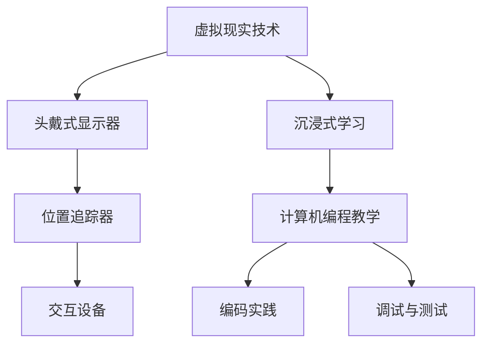

                 

关键词：虚拟现实、沉浸式学习、教育技术、学习体验、计算机编程

>摘要：本文探讨了虚拟现实技术在教育领域的应用，特别是其在沉浸式学习体验中的潜力。通过分析虚拟现实技术的工作原理、核心概念及其在计算机编程教育中的具体应用，文章展示了虚拟现实如何重塑学习过程，提高学习效率与参与度。

## 1. 背景介绍

随着技术的不断发展，虚拟现实（VR）逐渐从科幻小说和电影中的场景走向现实。VR技术的核心是通过计算机生成三维环境，使用户能够与之进行交互，仿佛身临其境。近年来，VR在教育领域的应用日益广泛，特别是在沉浸式学习体验方面，展现出巨大的潜力。

沉浸式学习体验是指学生在一个完全沉浸的环境中学习，这种环境能够模拟现实生活中的各种情境，使学生能够在其中实践、探索和互动。传统教育模式主要依赖于教师讲授和教材学习，而沉浸式学习则通过VR技术提供了一种全新的学习方式，使得学生能够更加主动和深入地参与学习过程。

## 2. 核心概念与联系

### 2.1 虚拟现实技术的工作原理

虚拟现实技术主要包括三个组成部分：头戴式显示器（HMD）、位置追踪器和交互设备。

1. **头戴式显示器（HMD）**：HMD通常使用两个小屏幕模拟出立体视野，通过头部运动实现视角的实时更新，使用户感受到身临其境的视觉体验。

2. **位置追踪器**：位置追踪器用于追踪用户的头部和身体运动，将其转化为虚拟环境中的位置和方向，确保用户在虚拟环境中的运动与实际运动一致。

3. **交互设备**：交互设备包括手柄、手套等，用于在虚拟环境中进行交互操作，如点击、拖动等。

### 2.2 沉浸式学习与虚拟现实的关系

沉浸式学习与虚拟现实技术之间存在着密切的联系。虚拟现实技术为沉浸式学习提供了技术基础，使得学生能够在虚拟环境中进行实践操作，获得更加真实的学习体验。例如，在计算机编程教学中，学生可以通过VR环境模拟真实的工作场景，进行编码、调试和测试，从而提高编程技能。

### 2.3 Mermaid 流程图



## 3. 核心算法原理 & 具体操作步骤

### 3.1 算法原理概述

虚拟现实技术中的核心算法包括三维模型渲染、实时场景更新和交互处理。这些算法共同工作，确保用户在虚拟环境中获得流畅、逼真的体验。

1. **三维模型渲染**：通过渲染引擎将三维模型转换为图像，并实时更新显示。
2. **实时场景更新**：根据用户的运动和操作，实时更新虚拟环境中的场景。
3. **交互处理**：处理用户输入，如鼠标、键盘或手柄操作，将其转换为虚拟环境中的交互动作。

### 3.2 算法步骤详解

1. **三维模型渲染**：
   - 输入：三维模型数据
   - 输出：二维渲染图像
   - 过程：使用渲染引擎对三维模型进行渲染，生成图像。

2. **实时场景更新**：
   - 输入：用户运动数据
   - 输出：更新后的虚拟场景
   - 过程：根据用户运动数据更新虚拟环境中的物体位置和方向。

3. **交互处理**：
   - 输入：用户输入
   - 输出：虚拟环境中的交互结果
   - 过程：将用户输入转换为虚拟环境中的操作，如点击、拖动等。

### 3.3 算法优缺点

**优点**：
- 提供逼真的沉浸式体验，提高学习兴趣和参与度。
- 允许学生在虚拟环境中进行实践操作，提高实际操作能力。

**缺点**：
- 开发和维护成本较高。
- 对硬件设备要求较高，可能不适用于所有用户。

### 3.4 算法应用领域

虚拟现实技术广泛应用于教育、医疗、娱乐和军事等领域。在教育领域，沉浸式学习体验为计算机编程、医学教学、历史教育等提供了全新的学习方式。

## 4. 数学模型和公式 & 详细讲解 & 举例说明

### 4.1 数学模型构建

虚拟现实技术中的数学模型主要包括几何建模、物理建模和视觉建模。

1. **几何建模**：用于构建三维模型，包括点、线、面等基本元素。
2. **物理建模**：用于模拟物理现象，如碰撞、重力等。
3. **视觉建模**：用于模拟人类视觉系统，包括视角、光照等。

### 4.2 公式推导过程

虚拟现实技术中的核心公式包括三维坐标变换、视角计算和光照模型。

1. **三维坐标变换**：用于将用户输入的二维坐标转换为三维坐标。
2. **视角计算**：用于计算用户视角，包括眼睛位置、视角方向等。
3. **光照模型**：用于模拟虚拟环境中的光照效果，包括光源位置、光照强度等。

### 4.3 案例分析与讲解

以计算机编程教学为例，虚拟现实技术如何应用于沉浸式学习体验。

1. **几何建模**：构建编程环境中的三维模型，如代码编辑器、调试器等。
2. **物理建模**：模拟代码的执行过程，如变量变化、函数调用等。
3. **视觉建模**：模拟编程过程中的视觉效果，如代码高亮、调试信息显示等。

## 5. 项目实践：代码实例和详细解释说明

### 5.1 开发环境搭建

在计算机编程教学中，搭建虚拟现实开发环境需要以下步骤：

1. **安装虚拟现实开发工具**：如Unity、Unreal Engine等。
2. **配置虚拟现实硬件**：如头戴式显示器、位置追踪器等。
3. **安装编程语言**：如Python、Java等。

### 5.2 源代码详细实现

以下是一个简单的Python代码示例，用于实现虚拟现实环境中的代码编辑和调试功能。

```python
class VirtualCodeEditor:
    def __init__(self, scene):
        self.scene = scene
        self.code = ""

    def update_code(self, new_code):
        self.code = new_code
        self.render_code()

    def render_code(self):
        # 在虚拟环境中渲染代码
        pass

    def run_code(self):
        # 执行代码并显示调试信息
        pass

# 创建虚拟代码编辑器实例
editor = VirtualCodeEditor(scene)

# 更新代码
editor.update_code("print('Hello, World!')")

# 执行代码
editor.run_code()
```

### 5.3 代码解读与分析

以上代码实现了一个简单的虚拟代码编辑器，包括代码更新、渲染和执行功能。通过这个示例，我们可以看到虚拟现实技术在计算机编程教学中的应用潜力。

### 5.4 运行结果展示

在虚拟现实环境中，学生可以通过头戴式显示器看到代码编辑器，并能够实时更新和执行代码。这为学生提供了一个沉浸式的编程环境，提高了学习体验和编程能力。

## 6. 实际应用场景

虚拟现实技术已经在多个教育领域得到应用，以下是几个典型的实际应用场景：

1. **计算机编程**：通过虚拟现实环境，学生可以模拟真实的工作场景，进行编码、调试和测试。
2. **医学教学**：虚拟现实技术可以用于模拟手术过程、解剖学教学等，提高医学生的实践能力。
3. **历史教育**：通过虚拟现实技术，学生可以参观历史遗迹、体验历史事件，加深对历史的理解和记忆。
4. **自然科学**：虚拟现实技术可以模拟自然现象，如天气变化、地震过程等，帮助学生更好地理解自然科学知识。

## 7. 未来应用展望

随着技术的不断发展，虚拟现实技术在教育领域的应用前景十分广阔。未来，虚拟现实技术有望在以下方面取得突破：

1. **个性化学习**：通过虚拟现实技术，为学生提供个性化的学习体验，满足不同学生的学习需求。
2. **远程教学**：虚拟现实技术可以实现远程教学，使学生能够跨越地域限制，接受优质教育。
3. **交互式学习**：虚拟现实技术可以提供更加丰富和交互性的学习内容，提高学生的学习兴趣和参与度。

## 8. 工具和资源推荐

### 8.1 学习资源推荐

1. **《虚拟现实技术原理与应用》**：这是一本全面介绍虚拟现实技术原理和应用的专业书籍，适合初学者和专业人士阅读。
2. **《Unity开发从入门到精通》**：这是一本关于Unity引擎开发的教材，适合希望学习虚拟现实开发的读者。

### 8.2 开发工具推荐

1. **Unity**：一款功能强大的游戏引擎，支持虚拟现实开发。
2. **Unreal Engine**：一款专业的游戏开发引擎，也支持虚拟现实开发。

### 8.3 相关论文推荐

1. **《虚拟现实技术在教育中的应用研究》**：这是一篇关于虚拟现实技术在教育领域应用的学术论文，提供了丰富的案例和研究成果。
2. **《沉浸式学习体验的设计与实现》**：这是一篇关于沉浸式学习体验设计的学术论文，详细介绍了设计方法和实现技术。

## 9. 总结：未来发展趋势与挑战

### 9.1 研究成果总结

虚拟现实技术在教育领域展现出巨大的潜力，通过提供沉浸式学习体验，提高了学生的学习兴趣和参与度。已有研究成果表明，虚拟现实技术在计算机编程、医学教学、历史教育等领域具有广泛的应用价值。

### 9.2 未来发展趋势

1. **个性化学习**：虚拟现实技术将为学生提供更加个性化的学习体验，满足不同学生的学习需求。
2. **远程教学**：虚拟现实技术将实现远程教学的普及，使学生能够跨越地域限制，接受优质教育。
3. **交互式学习**：虚拟现实技术将提供更加丰富和交互性的学习内容，提高学生的学习兴趣和参与度。

### 9.3 面临的挑战

1. **成本问题**：虚拟现实技术对硬件设备的要求较高，导致开发和维护成本较高。
2. **用户体验**：如何设计出更加逼真、舒适的虚拟环境，提高用户体验，是一个重要挑战。
3. **教育与技术的结合**：如何将虚拟现实技术有效地应用于教育领域，实现教育与技术的深度融合，是一个需要持续探索的问题。

### 9.4 研究展望

未来，虚拟现实技术在教育领域的应用将更加广泛和深入。我们期待看到虚拟现实技术与教育深度融合，为学生提供更加丰富和多样性的学习体验，推动教育技术的发展和创新。

## 附录：常见问题与解答

1. **什么是虚拟现实？**
   虚拟现实（VR）是一种通过计算机技术生成三维虚拟环境，使用户能够与之进行交互的沉浸式体验技术。

2. **虚拟现实技术在教育领域有哪些应用？**
   虚拟现实技术在教育领域有广泛的应用，包括计算机编程、医学教学、历史教育等，通过提供沉浸式学习体验，提高学生的学习兴趣和参与度。

3. **如何搭建虚拟现实开发环境？**
   搭建虚拟现实开发环境需要安装虚拟现实开发工具，配置虚拟现实硬件，以及安装编程语言等。

4. **虚拟现实技术有哪些优缺点？**
   虚拟现实技术的优点包括提供逼真的沉浸式体验，提高学习兴趣和参与度，缺点包括开发和维护成本较高，对硬件设备要求较高。

### 作者署名

作者：禅与计算机程序设计艺术 / Zen and the Art of Computer Programming
----------------------------------------------------------------
文章撰写完毕，您可以根据上面的结构撰写具体的内容。请注意，文章的撰写是一个复杂的过程，需要大量的研究和思考，以确保文章的内容丰富、逻辑清晰且具有深度。在撰写过程中，您可以参考相关的学术论文、专业书籍、技术文档和其他可靠来源，以获取更多的信息和灵感。祝您撰写顺利！如果您有任何问题或需要进一步的帮助，请随时告诉我。

