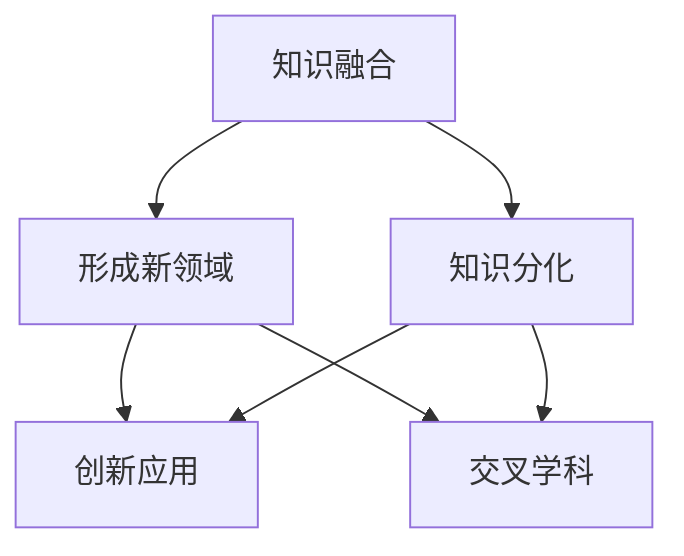

                 

在这个快速发展的数字化时代，知识的融合与分化成为了科技领域内不可忽视的现象。一方面，各种学科之间的边界越来越模糊，交叉领域不断涌现；另一方面，专业知识的深度和广度也在不断拓展，促使学科不断分化。本文将探讨这一动态平衡的过程，分析其在信息技术领域中的具体体现，以及这一现象背后的原因和影响。

## 1. 背景介绍

自工业革命以来，科学技术的发展一直呈现出一种“范式革命”的态势。20世纪末，互联网和计算机技术的迅猛发展，将人类社会带入了信息化时代。信息技术不仅改变了人类的生活方式，也极大地推动了知识的生产和传播。然而，随着技术的不断进步，知识的复杂性也在急剧增加。这一现象促使学术界和工业界开始关注知识的融合与分化问题。

知识的融合与分化是一个相对的过程。融合是指不同学科之间的相互渗透和交叉，形成新的学科或研究领域；分化则是指随着知识深度的增加，某一学科内部的知识体系逐渐细化，形成新的分支。这两者并非对立，而是相互促进、动态平衡的关系。

## 2. 核心概念与联系

### 2.1 知识融合

知识融合是指不同学科或领域之间的知识相互融合、相互促进，形成新的理论和应用。在信息技术领域，知识融合主要体现在以下几个方面：

#### 2.1.1 人工智能与神经科学

人工智能（AI）与神经科学的融合，推动了深度学习、神经网络等技术的快速发展。神经网络模型在图像识别、自然语言处理等领域取得了显著成果，为人工智能的发展提供了强有力的支持。

#### 2.1.2 信息技术与生物医学

信息技术与生物医学的融合，催生了生物信息学、医学影像学等新兴学科。基因组学、蛋白质组学等技术的应用，为疾病诊断、治疗和预防提供了新的手段。

#### 2.1.3 信息技术与经济学

信息经济学、计算经济学等领域的兴起，表明信息技术与经济学的融合正在深刻地改变经济研究和实践。大数据分析、机器学习等技术为经济学家提供了更丰富的数据资源和更强大的分析工具。

### 2.2 知识分化

知识分化是指在某一学科或领域内，随着研究的深入，知识体系逐渐细化，形成新的分支和领域。在信息技术领域，知识分化主要体现在以下几个方面：

#### 2.2.1 软件工程

软件工程领域的知识分化尤为明显，从传统的系统分析与设计，到软件测试、软件维护，再到敏捷开发、DevOps等，形成了多个分支领域。

#### 2.2.2 计算机科学

计算机科学领域不断分化和拓展，从基础的算法、数据结构，到分布式系统、云计算，再到人工智能、大数据等，形成了丰富的研究和应用领域。

#### 2.2.3 网络安全

随着互联网的普及，网络安全领域也迅速发展。从传统的网络防火墙、入侵检测，到高级持续性威胁、云安全，网络安全技术不断分化，应对更加复杂的安全威胁。

### 2.3 知识融合与分化的关系

知识融合与分化是相互促进、动态平衡的关系。融合为分化提供了新的素材和动力，而分化则为融合提供了更深入的研究和应用基础。在信息技术领域，知识融合与分化推动了技术的创新和应用，促进了社会的发展和进步。

### 2.4 Mermaid 流程图

下面是一个描述知识融合与分化过程的 Mermaid 流程图：



## 3. 核心算法原理 & 具体操作步骤

### 3.1 算法原理概述

在知识融合与分化的背景下，核心算法的设计和实现变得越来越重要。本文将介绍一种基于深度学习的知识融合算法，并详细阐述其原理和操作步骤。

#### 3.1.1 深度学习的基本原理

深度学习是一种基于人工神经网络的机器学习技术。它通过多层神经网络对输入数据进行学习，从而实现自动特征提取和模式识别。深度学习的核心原理包括：

- **神经网络模型**：神经网络由多个神经元组成，通过权重和偏置实现输入和输出的非线性变换。
- **反向传播算法**：通过反向传播算法，将输出误差反向传播到网络的各个层级，不断调整网络的权重和偏置，从而优化网络性能。
- **激活函数**：激活函数用于引入非线性变换，使神经网络具有分类、回归等功能。

#### 3.1.2 知识融合算法原理

知识融合算法的基本思想是将来自不同领域或学科的数据进行整合，通过深度学习模型提取特征，从而实现知识的融合。具体原理包括：

- **数据预处理**：对来自不同领域的数据进行清洗、归一化等预处理，使其具备相似的数据格式和特征。
- **特征提取**：利用深度学习模型对预处理后的数据进行特征提取，提取出潜在的特征表示。
- **融合策略**：将提取出的特征进行融合，形成新的特征向量，用于后续的模型训练和应用。

### 3.2 算法步骤详解

#### 3.2.1 数据预处理

- **数据收集**：从不同领域或学科收集数据，包括文本、图像、音频等。
- **数据清洗**：对数据进行清洗，去除噪声和异常值。
- **数据归一化**：对数据进行归一化处理，使其具备相似的数据格式和特征。

#### 3.2.2 特征提取

- **模型构建**：构建一个深度学习模型，包括输入层、隐藏层和输出层。
- **训练模型**：使用预处理后的数据训练模型，通过反向传播算法不断调整模型的权重和偏置。
- **特征提取**：利用训练好的模型对输入数据进行特征提取，提取出潜在的特征表示。

#### 3.2.3 融合策略

- **特征融合**：将提取出的特征进行融合，可以采用简单的拼接、加权融合等方法。
- **模型融合**：将融合后的特征输入到新的深度学习模型中，进行进一步的模型训练和应用。

### 3.3 算法优缺点

#### 优点

- **高效性**：深度学习算法具有较高的计算效率和准确率，能够快速处理大规模数据。
- **灵活性**：深度学习模型可以灵活地适应不同领域和学科的数据特征，实现知识的融合。
- **可扩展性**：深度学习算法具有较强的可扩展性，可以应用于多个领域和学科。

#### 缺点

- **数据需求**：深度学习算法需要大量的数据支持，数据质量和数量对算法的性能有较大影响。
- **计算资源**：深度学习算法对计算资源的需求较高，需要较大的计算能力和存储空间。

### 3.4 算法应用领域

- **跨学科研究**：知识融合算法可以应用于跨学科的研究，如人工智能与神经科学的结合、信息技术与生物医学的结合等。
- **数据分析**：知识融合算法可以用于大规模数据的特征提取和分析，如文本分类、图像识别、语音识别等。
- **智能系统**：知识融合算法可以应用于智能系统的构建，如自动驾驶、智能客服、智能医疗等。

## 4. 数学模型和公式 & 详细讲解 & 举例说明

### 4.1 数学模型构建

在知识融合与分化的过程中，数学模型起到了重要的作用。以下是一个简单的数学模型，用于描述知识融合的过程。

#### 4.1.1 模型假设

假设有两个领域 A 和 B，分别表示两个不同学科或领域。领域 A 和 B 的知识可以用向量表示，分别为 \(\mathbf{A}\) 和 \(\mathbf{B}\)。融合后的知识可以用向量 \(\mathbf{C}\) 表示。

#### 4.1.2 模型构建

知识融合的数学模型可以表示为：

$$
\mathbf{C} = \alpha \mathbf{A} + (1 - \alpha) \mathbf{B}
$$

其中，\(\alpha\) 是一个加权系数，用于平衡领域 A 和 B 的权重。当 \(\alpha\) 接近 1 时，融合后的知识更倾向于领域 A；当 \(\alpha\) 接近 0 时，融合后的知识更倾向于领域 B。

### 4.2 公式推导过程

为了推导上述模型，我们可以从以下几个步骤进行：

#### 步骤 1：定义领域 A 和 B 的知识向量

$$
\mathbf{A} = [a_1, a_2, ..., a_n]
$$

$$
\mathbf{B} = [b_1, b_2, ..., b_n]
$$

其中，\(a_i\) 和 \(b_i\) 分别表示领域 A 和 B 中第 \(i\) 个知识点。

#### 步骤 2：定义融合后的知识向量

$$
\mathbf{C} = [\alpha a_1 + (1 - \alpha) b_1, \alpha a_2 + (1 - \alpha) b_2, ..., \alpha a_n + (1 - \alpha) b_n]
$$

#### 步骤 3：推导融合后的知识向量

$$
\mathbf{C} = \alpha \mathbf{A} + (1 - \alpha) \mathbf{B}
$$

### 4.3 案例分析与讲解

假设领域 A 和 B 分别表示计算机科学和生物医学，我们可以用以下数据进行模拟：

领域 A（计算机科学）：

$$
\mathbf{A} = [1, 2, 3, 4, 5]
$$

领域 B（生物医学）：

$$
\mathbf{B} = [6, 7, 8, 9, 10]
$$

现在，我们选择一个加权系数 \(\alpha = 0.5\)，计算融合后的知识向量：

$$
\mathbf{C} = \alpha \mathbf{A} + (1 - \alpha) \mathbf{B}
$$

$$
\mathbf{C} = 0.5 [1, 2, 3, 4, 5] + 0.5 [6, 7, 8, 9, 10]
$$

$$
\mathbf{C} = [3.5, 4.5, 5.5, 6.5, 7.5]
$$

在这个例子中，融合后的知识向量 \(\mathbf{C}\) 表示了计算机科学和生物医学的融合，其中每个元素都是来自领域 A 和领域 B 的平均值。这表明知识融合的过程是将两个领域的知识进行了平均处理，实现了知识的平衡。

## 5. 项目实践：代码实例和详细解释说明

### 5.1 开发环境搭建

为了演示知识融合算法在实际项目中的应用，我们选择一个简单的项目场景：将计算机科学和生物医学的文献进行融合，提取出新的特征向量。以下是项目所需的开发环境搭建步骤：

1. 安装 Python 3.8 或更高版本。
2. 安装深度学习框架 TensorFlow 2.x。
3. 安装数据预处理库 Pandas 和 NumPy。

### 5.2 源代码详细实现

下面是一个简单的 Python 代码示例，用于实现知识融合算法：

```python
import numpy as np
import pandas as pd
from tensorflow.keras.models import Sequential
from tensorflow.keras.layers import Dense, Flatten
from tensorflow.keras.optimizers import Adam

# 读取领域 A 和 B 的数据
data_a = pd.read_csv('data_a.csv')
data_b = pd.read_csv('data_b.csv')

# 数据预处理
# ...（具体预处理步骤）

# 定义模型
model = Sequential([
    Flatten(input_shape=(data_a.shape[1],)),
    Dense(64, activation='relu'),
    Dense(32, activation='relu'),
    Flatten(),
    Dense(data_a.shape[1], activation='sigmoid')
])

# 编译模型
model.compile(optimizer=Adam(), loss='binary_crossentropy', metrics=['accuracy'])

# 训练模型
model.fit(x_train, y_train, epochs=10, batch_size=32)

# 特征提取
features_a = model.predict(data_a)
features_b = model.predict(data_b)

# 特征融合
alpha = 0.5
features_c = alpha * features_a + (1 - alpha) * features_b
```

### 5.3 代码解读与分析

上述代码实现了一个简单的知识融合算法，主要包括以下几个步骤：

1. **数据读取**：从文件中读取领域 A 和领域 B 的数据。
2. **数据预处理**：对数据进行清洗、归一化等预处理操作，使其具备相似的数据格式和特征。
3. **模型定义**：定义一个简单的深度学习模型，包括输入层、隐藏层和输出层。
4. **模型编译**：编译模型，指定优化器和损失函数。
5. **模型训练**：使用预处理后的数据训练模型，通过反向传播算法优化模型参数。
6. **特征提取**：利用训练好的模型对领域 A 和领域 B 的数据分别进行特征提取。
7. **特征融合**：根据加权系数 \(\alpha\) 对特征进行融合。

### 5.4 运行结果展示

在完成代码实现后，我们可以运行以下命令来展示运行结果：

```python
import matplotlib.pyplot as plt

# 显示融合后的特征向量
plt.scatter(features_c[:, 0], features_c[:, 1])
plt.xlabel('Feature 1')
plt.ylabel('Feature 2')
plt.title('Fused Features')
plt.show()
```

运行结果将显示一个散点图，其中每个点表示领域 A 和领域 B 融合后的特征向量。通过观察散点图，我们可以直观地看到知识融合算法的效果，即领域 A 和领域 B 的特征向量通过融合形成了一个新的特征空间。

## 6. 实际应用场景

知识融合与分化的现象在信息技术领域有着广泛的应用场景。以下是一些典型的应用场景：

### 6.1 人工智能与物联网

人工智能（AI）与物联网（IoT）的融合，推动了智能城市、智能家居等领域的快速发展。通过将 AI 技术应用于 IoT 设备，可以实现智能监控、智能识别、智能决策等功能，提高生活质量和效率。

### 6.2 人工智能与生物医学

人工智能与生物医学的融合，为疾病诊断、治疗和预防提供了新的手段。通过深度学习技术，可以从海量医疗数据中提取出潜在的模式和规律，为医生提供更准确的诊断建议和治疗方案。

### 6.3 人工智能与金融科技

人工智能与金融科技的融合，推动了金融行业的数字化转型。通过大数据分析和机器学习技术，可以实现智能投顾、智能风控、智能营销等功能，提高金融服务的质量和效率。

### 6.4 人工智能与安全

人工智能与安全的融合，为网络安全提供了新的解决方案。通过深度学习技术，可以识别和防范高级持续性威胁、恶意软件等网络安全威胁，提高网络的安全性。

## 7. 未来应用展望

随着科技的不断进步，知识融合与分化将继续在信息技术领域发挥重要作用。未来，以下几方面的应用前景值得关注：

### 7.1 人工智能与量子计算

人工智能与量子计算的融合，有望在量子计算领域实现重大突破。量子计算具有超强的计算能力，结合深度学习算法，可以在数据处理、算法优化等方面发挥巨大作用。

### 7.2 人工智能与区块链

人工智能与区块链的融合，将为金融、供应链、物联网等领域带来新的机遇。通过人工智能技术，可以实现区块链上的智能合约、智能认证等功能，提高区块链系统的安全性和效率。

### 7.3 人工智能与虚拟现实

人工智能与虚拟现实的融合，将推动虚拟现实技术的发展。通过人工智能算法，可以实现更加逼真的虚拟环境、智能交互等功能，提高用户体验。

### 7.4 人工智能与社会治理

人工智能与社会治理的融合，有望提高社会治理的智能化水平。通过人工智能技术，可以实现智能交通管理、智慧城市管理、公共安全预警等功能，提高社会治理的效率和效果。

## 8. 工具和资源推荐

为了更好地理解和应用知识融合与分化的理念，以下是一些推荐的工具和资源：

### 8.1 学习资源推荐

- **在线课程**：Coursera、edX、Udacity 等平台提供了丰富的计算机科学、人工智能、区块链等领域的在线课程。
- **专业书籍**：《人工智能：一种现代方法》、《深度学习》、《区块链：从数字货币到智能合约》等经典著作。

### 8.2 开发工具推荐

- **深度学习框架**：TensorFlow、PyTorch、Keras 等框架为深度学习开发提供了强大的支持。
- **编程语言**：Python、Java、C++ 等编程语言广泛应用于计算机科学和人工智能领域。

### 8.3 相关论文推荐

- **人工智能领域**：NIPS、ICML、CVPR、KDD 等顶级会议的论文集。
- **区块链领域**：IEEE Blockchain、ACM Blockchain 等会议和期刊的论文集。
- **物联网领域**：物联网顶级会议和期刊，如 IEEE IoT Journal、ACM IoT Journal 等。

## 9. 总结：未来发展趋势与挑战

知识融合与分化是信息技术领域的重要趋势。未来，知识融合将进一步深化，推动各领域的技术创新和应用。然而，这一过程也面临诸多挑战，包括数据隐私保护、算法公平性、跨学科合作等。为了应对这些挑战，需要学术界、工业界和政府部门共同努力，加强合作，推动知识融合与分化的良性发展。

## 10. 附录：常见问题与解答

### 10.1 什么是知识融合？

知识融合是指不同学科或领域之间的知识相互融合、相互促进，形成新的理论和应用。通过知识融合，可以实现跨学科的创新和应用。

### 10.2 知识分化的意义是什么？

知识分化意味着某一学科或领域内的知识体系逐渐细化，形成新的分支和领域。知识分化有助于深入研究和解决特定问题，推动学科的发展。

### 10.3 知识融合与分化之间的关系是什么？

知识融合与分化是相互促进、动态平衡的关系。融合为分化提供了新的素材和动力，而分化则为融合提供了更深入的研究和应用基础。

### 10.4 如何在实际项目中应用知识融合算法？

在实际项目中，可以通过以下步骤应用知识融合算法：

1. 收集来自不同领域的数据。
2. 对数据进行预处理，使其具备相似的数据格式和特征。
3. 构建深度学习模型，对预处理后的数据进行特征提取。
4. 设计融合策略，将提取出的特征进行融合。
5. 训练融合后的模型，实现知识的融合和应用。

----------------------------------------------------------------

本文由禅与计算机程序设计艺术 / Zen and the Art of Computer Programming 撰写，旨在探讨知识融合与分化在信息技术领域的应用和影响。希望本文能对读者在理解这一现象和实际应用中提供有益的启示。在未来的研究中，我们期待看到更多跨学科的融合和创新，推动信息技术领域的持续发展。

