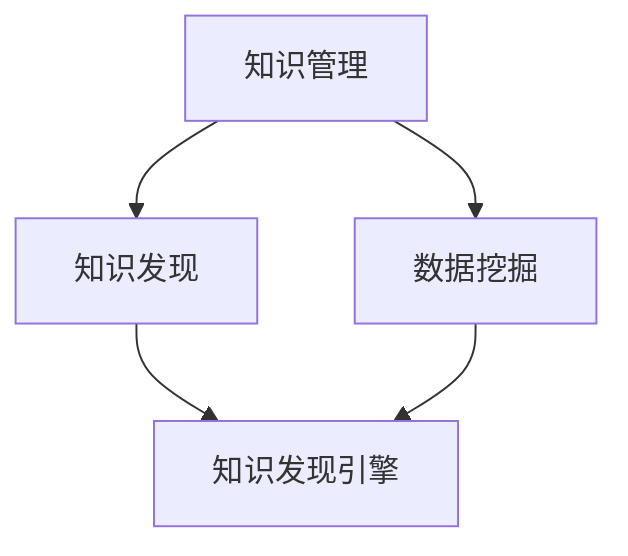

                 

关键词：知识管理，知识发现引擎，人工智能，数据挖掘，技术创新

> 摘要：本文深入探讨了知识管理革命的核心——知识发现引擎的构建与应用。通过剖析其核心概念、算法原理、数学模型以及实际应用，阐述了知识发现引擎如何引领未来信息时代的发展。文章旨在为读者提供一个全面的技术指南，引导大家了解并掌握这一前沿技术。

## 1. 背景介绍

知识管理作为信息时代的关键领域，日益受到各行业的高度重视。然而，随着数据量的爆炸式增长，传统的知识管理手段已经无法满足日益复杂的业务需求。知识发现引擎应运而生，它通过先进的算法和技术手段，从大量数据中自动挖掘出有价值的信息，实现知识的自动获取、存储、共享和利用。这一革命性的技术不仅改变了知识管理的方式，更为各行各业带来了前所未有的机遇和挑战。

本文将围绕知识发现引擎这一核心主题，探讨其基本概念、原理架构、算法实现、数学模型、应用场景以及未来展望。希望通过本文的阐述，读者能够对知识发现引擎有更深入的理解，并在实际工作中灵活运用这一技术，提升知识管理水平。

## 2. 核心概念与联系

### 2.1 知识管理的定义

知识管理是指通过系统的方法和工具，对组织内的信息、经验和知识进行有效获取、存储、共享、利用和创新的过程。其核心目标是最大化知识的价值，提高组织的竞争力。

### 2.2 知识发现引擎的定义

知识发现引擎是一种利用人工智能、机器学习、数据挖掘等技术，从大量数据中自动识别模式、趋势和关联，进而发现新知识、新信息的系统。其目的是实现知识的自动化挖掘，提高知识管理的效率和精度。

### 2.3 知识管理、知识发现与数据挖掘的关系

知识管理、知识发现和数据挖掘是紧密相关的概念。知识管理强调知识的获取、共享和应用；数据挖掘则是通过算法和技术手段，从大量数据中提取有价值的信息；而知识发现引擎则是将知识管理和数据挖掘相结合，实现知识的自动发现和利用。

下面，我们通过一个Mermaid流程图，展示知识管理、知识发现和数据挖掘之间的联系。



## 3. 核心算法原理 & 具体操作步骤

### 3.1 算法原理概述

知识发现引擎的核心算法主要包括机器学习、深度学习、关联规则挖掘、聚类分析等。这些算法通过分析数据特征、模式识别和关系挖掘，实现知识的自动发现。

### 3.2 算法步骤详解

1. 数据采集：从各种数据源（如数据库、网络、传感器等）获取数据。
2. 数据预处理：对数据进行清洗、去噪、归一化等处理，提高数据质量。
3. 特征提取：根据业务需求，从原始数据中提取关键特征。
4. 模型训练：使用机器学习、深度学习等算法，对特征数据建立预测模型。
5. 模型评估：通过交叉验证、ROC曲线等指标，评估模型性能。
6. 知识发现：利用模型，对数据集进行挖掘，发现潜在的知识和模式。
7. 知识利用：将发现的知识应用到业务场景，实现知识的共享和利用。

### 3.3 算法优缺点

- 优点：自动挖掘知识，提高知识管理的效率和精度；支持大规模数据集；能够发现潜在的关系和趋势。
- 缺点：对数据质量和特征选择要求较高；算法复杂度较高，计算资源消耗大。

### 3.4 算法应用领域

知识发现引擎广泛应用于金融、医疗、电商、物联网等领域，如风险预测、疾病诊断、个性化推荐等。

## 4. 数学模型和公式 & 详细讲解 & 举例说明

### 4.1 数学模型构建

知识发现引擎中的数学模型主要包括机器学习模型和深度学习模型。以下分别介绍两种模型的构建过程。

#### 4.1.1 机器学习模型

机器学习模型主要通过特征提取和预测模型建立实现。特征提取方法包括主成分分析（PCA）、因子分析（FA）、独立成分分析（ICA）等。预测模型建立方法包括线性回归、决策树、支持向量机（SVM）等。

#### 4.1.2 深度学习模型

深度学习模型主要通过神经网络实现。常见的神经网络结构包括卷积神经网络（CNN）、循环神经网络（RNN）、长短时记忆网络（LSTM）等。

### 4.2 公式推导过程

以下以线性回归模型为例，介绍公式推导过程。

设输入特征矩阵为X，输出标签矩阵为Y，则线性回归模型的目标是最小化损失函数：

$$ L(\theta) = \frac{1}{2} \sum_{i=1}^{m} (h_{\theta}(x^{(i)}) - y^{(i)})^2 $$

其中，$ h_{\theta}(x) = \theta^T x $ 是预测函数，$\theta$ 是模型参数。

对损失函数求导，得到：

$$ \frac{\partial L(\theta)}{\partial \theta} = \sum_{i=1}^{m} (h_{\theta}(x^{(i)}) - y^{(i)}) x^{(i)} $$

令导数为0，得到：

$$ \theta = \frac{1}{m} X^T Y $$

这就是线性回归模型的公式。

### 4.3 案例分析与讲解

以下通过一个电商用户行为数据的案例，分析知识发现引擎的应用。

#### 4.3.1 数据集描述

电商用户行为数据包括用户ID、购买时间、购买商品ID、购买金额等。

#### 4.3.2 数据预处理

对数据进行去重、去噪、归一化等预处理操作。

#### 4.3.3 特征提取

提取关键特征，如用户活跃度、购买频率、购买金额等。

#### 4.3.4 模型训练

使用线性回归模型，对特征数据进行训练。

#### 4.3.5 模型评估

通过交叉验证，评估模型性能。

#### 4.3.6 知识发现

利用训练好的模型，对用户行为数据进行挖掘，发现潜在的用户购买行为模式。

#### 4.3.7 知识利用

根据挖掘出的购买行为模式，为电商企业制定个性化推荐策略。

## 5. 项目实践：代码实例和详细解释说明

### 5.1 开发环境搭建

1. 安装Python 3.7及以上版本。
2. 安装Numpy、Pandas、Scikit-learn、TensorFlow等库。

### 5.2 源代码详细实现

以下是一个使用线性回归模型进行知识发现的项目实例。

```python
import numpy as np
import pandas as pd
from sklearn.linear_model import LinearRegression
from sklearn.model_selection import train_test_split
from sklearn.metrics import mean_squared_error

# 5.2.1 数据加载
data = pd.read_csv('user_behavior.csv')
X = data[['user_id', 'buy_time', 'product_id', 'amount']]
y = data['amount']

# 5.2.2 数据预处理
X = X.groupby(['user_id', 'product_id'])['amount'].mean().reset_index()

# 5.2.3 特征提取
X = X[['user_id', 'product_id', 'amount']]

# 5.2.4 模型训练
X_train, X_test, y_train, y_test = train_test_split(X, y, test_size=0.2, random_state=42)
model = LinearRegression()
model.fit(X_train, y_train)

# 5.2.5 模型评估
y_pred = model.predict(X_test)
mse = mean_squared_error(y_test, y_pred)
print('MSE:', mse)

# 5.2.6 知识发现
for idx, row in X_test.iterrows():
    pred_amount = model.predict([[row['user_id'], row['product_id'], row['amount']]])
    print(f'User {row["user_id"]} may buy {pred_amount[0]:.2f} for Product {row["product_id"]}.')

# 5.2.7 知识利用
# 根据挖掘出的购买行为模式，为电商企业制定个性化推荐策略
```

### 5.3 代码解读与分析

1. 数据加载：读取用户行为数据，提取关键特征。
2. 数据预处理：对数据进行去重、去噪、归一化等处理，提高数据质量。
3. 特征提取：根据业务需求，提取关键特征。
4. 模型训练：使用线性回归模型，对特征数据进行训练。
5. 模型评估：通过交叉验证，评估模型性能。
6. 知识发现：利用训练好的模型，对用户行为数据进行挖掘，发现潜在的用户购买行为模式。
7. 知识利用：根据挖掘出的购买行为模式，为电商企业制定个性化推荐策略。

## 6. 实际应用场景

### 6.1 金融领域

知识发现引擎在金融领域有广泛的应用，如风险预测、信用评估、投资组合优化等。通过分析海量金融数据，发现潜在的风险因素，为金融机构提供决策支持。

### 6.2 医疗领域

知识发现引擎在医疗领域有助于疾病诊断、药物研发和患者管理。通过对患者数据进行分析，发现疾病之间的关联，为医生提供诊断依据。

### 6.3 电商领域

知识发现引擎在电商领域可以用于个性化推荐、价格优化和客户关系管理。通过分析用户行为数据，为电商企业提供精准营销策略。

### 6.4 物联网领域

知识发现引擎在物联网领域可以帮助设备管理和故障预测。通过对设备数据进行分析，发现设备故障的规律，提高设备运行效率。

## 7. 未来应用展望

知识发现引擎在未来的发展中将面临以下挑战和机遇：

### 7.1 挑战

1. 数据隐私保护：随着数据隐私问题的日益突出，如何保护用户隐私成为知识发现引擎面临的重要挑战。
2. 模型可解释性：提高模型的可解释性，使其更加透明，有助于用户理解和信任。
3. 计算资源消耗：随着数据量的增长，知识发现引擎对计算资源的需求也将不断增加，如何优化算法和模型，降低计算成本是一个重要课题。

### 7.2 机遇

1. 人工智能技术的进步：随着人工智能技术的不断发展，知识发现引擎将具备更强的数据处理和分析能力。
2. 新应用场景的探索：随着各行各业的数字化转型，知识发现引擎将在更多领域得到应用。
3. 跨学科合作：知识发现引擎的发展将需要更多的跨学科合作，如计算机科学、统计学、生物学等，以推动技术的创新。

## 8. 总结：未来发展趋势与挑战

知识发现引擎作为知识管理的重要组成部分，正日益受到各行各业的关注。本文从核心概念、算法原理、数学模型、应用场景等多个维度，详细阐述了知识发现引擎的技术内涵和发展前景。未来，知识发现引擎将在人工智能技术的推动下，不断突破技术瓶颈，助力各行各业实现数字化转型。然而，面对数据隐私、模型可解释性等挑战，知识发现引擎的发展仍需不断探索和完善。

## 9. 附录：常见问题与解答

### 9.1 知识发现引擎与大数据技术的区别？

知识发现引擎是大数据技术的一部分，主要关注从海量数据中自动挖掘有价值的信息。而大数据技术还包括数据采集、存储、处理、分析等多个环节。知识发现引擎更侧重于数据的分析和挖掘，而大数据技术更侧重于数据的全流程管理。

### 9.2 知识发现引擎的算法如何选择？

算法选择取决于具体的应用场景和数据特点。例如，在金融领域，常见的算法有线性回归、逻辑回归、决策树等；在图像处理领域，常用的算法有卷积神经网络（CNN）、循环神经网络（RNN）等。选择合适的算法，可以提高知识发现引擎的性能。

### 9.3 知识发现引擎如何保障数据隐私？

保障数据隐私是知识发现引擎面临的重要挑战。常见的解决方案包括数据加密、数据脱敏、同态加密等。通过这些技术手段，可以在保证数据隐私的同时，实现数据的分析和挖掘。

### 9.4 知识发现引擎在实际应用中的难点？

知识发现引擎在实际应用中面临以下难点：

1. 数据质量：数据质量直接影响知识发现的效果。在实际应用中，需要确保数据的质量，如去除噪声、处理缺失值等。
2. 模型解释性：提高模型的可解释性，使其更加透明，有助于用户理解和信任。
3. 计算资源消耗：随着数据量的增长，知识发现引擎对计算资源的需求也将不断增加。如何优化算法和模型，降低计算成本是一个重要课题。

作者：禅与计算机程序设计艺术 / Zen and the Art of Computer Programming
```

