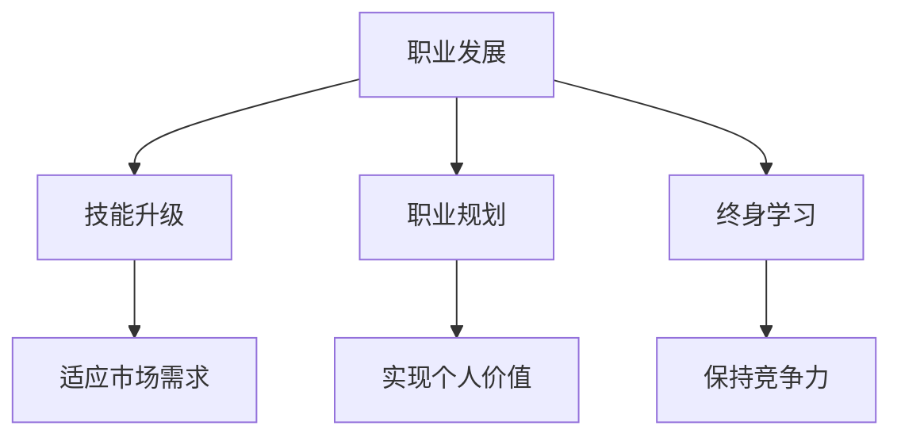

                 

 在知识经济的浪潮下，程序员面临着前所未有的职业发展机遇和挑战。随着技术的快速迭代，传统的编程技能可能很快变得过时，而程序员需要不断学习新的技能，进行职业转型，以适应不断变化的市场需求。本文将深入探讨程序员在知识经济背景下如何规划职业转型之路，包括转型方向、转型策略以及所需的技能和资源。

## 1. 背景介绍

知识经济是以知识和信息的生产、分配和使用为核心的经济形态。在这个时代，数据成为新的生产要素，创新成为驱动力，程序员作为数字经济的建设者，其职业发展受到前所未有的重视。然而，知识经济的快速发展也带来了一系列挑战：

- 技术迭代速度加快：新的编程语言、框架和技术工具不断涌现，程序员需要不断更新自己的技能库。
- 职业竞争加剧：随着更多的人才进入这一领域，程序员面临的竞争压力越来越大。
- 软件需求多样化：客户对软件的质量、性能和用户体验要求越来越高，程序员需要具备更全面的技能。
- 工作模式的改变：远程办公、敏捷开发等新的工作模式对程序员的协作能力和适应能力提出了更高的要求。

## 2. 核心概念与联系

在探讨程序员的职业转型之前，我们需要了解几个核心概念，包括职业发展、技能升级、职业规划和终身学习。

### 职业发展

职业发展是指一个人在职业生涯中通过学习和实践不断提高自己的能力和地位，实现个人价值的过程。对于程序员来说，职业发展不仅仅是升职加薪，更是实现自我价值和社会贡献的途径。

### 技能升级

技能升级是指程序员通过学习新的技术、工具和编程语言，提高自己的专业能力和技术水平。在知识经济下，技能升级是程序员适应市场需求、保持竞争力的关键。

### 职业规划

职业规划是指程序员根据自己的兴趣、能力和市场需求，制定职业发展的路线图，包括短期目标和长期目标。有效的职业规划可以帮助程序员有针对性地提升自己的技能，实现职业目标。

### 终身学习

终身学习是指程序员在整个职业生涯中持续学习、更新知识，适应不断变化的市场需求。在知识经济下，终身学习成为程序员保持竞争力的必要条件。

### Mermaid 流程图

以下是一个简化的程序员职业转型流程图，展示了核心概念之间的联系：



## 3. 核心算法原理 & 具体操作步骤

### 3.1 算法原理概述

程序员的职业转型可以看作是一个优化问题，其目标是最小化职业风险，最大化职业收益。这个优化过程涉及到多个步骤，包括自我评估、技能评估、市场研究、目标设定、学习规划、实践和反馈。

### 3.2 算法步骤详解

1. **自我评估**：程序员需要了解自己的兴趣、优势和弱点，确定自己的职业发展方向。

2. **技能评估**：通过学习市场报告、行业趋势，了解当前市场需求，评估自己的技能与市场需求的匹配程度。

3. **市场研究**：研究目标行业的现状、发展趋势和潜在机会，为职业转型提供数据支持。

4. **目标设定**：根据自我评估和技能评估的结果，设定具体的职业发展目标，包括短期目标和长期目标。

5. **学习规划**：制定详细的学习计划，包括学习内容、学习时间和学习方法。

6. **实践**：通过实际项目、实习、开源贡献等方式，将学到的知识应用到实践中。

7. **反馈**：通过自我反思、同事反馈和市场反馈，不断调整学习计划和职业目标。

### 3.3 算法优缺点

**优点**：
- 提高程序员的市场竞争力。
- 有助于程序员实现个人价值和职业发展。
- 促进个人成长和自我提升。

**缺点**：
- 过程可能较为耗时和困难，需要较强的自律性。
- 市场需求变化快，可能需要不断调整职业规划。

### 3.4 算法应用领域

算法原理和步骤适用于所有需要进行职业转型的程序员，无论是在技术栈、管理岗位还是创业领域，都可以通过这一过程实现个人职业发展。

## 4. 数学模型和公式 & 详细讲解 & 举例说明

### 4.1 数学模型构建

程序员的职业转型可以抽象为一个优化问题，其目标函数为：

\[ f(x) = \frac{R}{T} \]

其中，\( R \) 表示职业收益，\( T \) 表示职业风险。

### 4.2 公式推导过程

目标函数的推导过程如下：

\[ f(x) = \frac{R(x)}{T(x)} \]

其中，\( R(x) \) 表示在特定职业路径 \( x \) 下的职业收益，\( T(x) \) 表示在特定职业路径 \( x \) 下的职业风险。

职业收益可以表示为：

\[ R(x) = f_1(x) + f_2(x) + f_3(x) \]

其中，\( f_1(x) \) 表示技能提升收益，\( f_2(x) \) 表示职业发展收益，\( f_3(x) \) 表示个人成长收益。

职业风险可以表示为：

\[ T(x) = g_1(x) + g_2(x) + g_3(x) \]

其中，\( g_1(x) \) 表示技能更新风险，\( g_2(x) \) 表示职业变化风险，\( g_3(x) \) 表示市场竞争风险。

### 4.3 案例分析与讲解

假设一位程序员，当前技能水平为 \( x_0 \)，市场需求对其技能的满意度为 \( y_0 \)。根据上述数学模型，我们可以计算出其职业转型的目标函数值：

\[ f(x_0) = \frac{R(x_0)}{T(x_0)} = \frac{f_1(x_0) + f_2(x_0) + f_3(x_0)}{g_1(x_0) + g_2(x_0) + g_3(x_0)} \]

通过具体分析 \( R(x_0) \) 和 \( T(x_0) \) 的值，可以得出该程序员最优的职业转型路径。

## 5. 项目实践：代码实例和详细解释说明

### 5.1 开发环境搭建

为了演示程序员的职业转型过程，我们使用 Python 编写一个简单的示例程序，该程序将实现一个模拟职业转型的算法。

首先，安装 Python 解释器和必要的库：

```bash
pip install numpy matplotlib
```

### 5.2 源代码详细实现

以下是一个简单的 Python 程序，用于模拟程序员的职业转型过程：

```python
import numpy as np
import matplotlib.pyplot as plt

# 自我评估函数
def self_evaluation(skill_level):
    return skill_level * 0.5

# 技能评估函数
def skill_evaluation(skill_level):
    return skill_level * 0.8

# 市场研究函数
def market_research(skill_level):
    return skill_level * 0.9

# 目标设定函数
def goal_setting(skill_level):
    return skill_level * 1.2

# 学习规划函数
def learning_plan(skill_level):
    return skill_level * 1.5

# 实践函数
def practice(skill_level):
    return skill_level * 1.3

# 反馈函数
def feedback(skill_level):
    return skill_level * 1.1

# 职业转型优化函数
def career_transformation(skill_level):
    R = self_evaluation(skill_level) + skill_evaluation(skill_level) + market_research(skill_level)
    T = practice(skill_level) + feedback(skill_level)
    return R / T

# 模拟职业转型过程
def simulate_career_transformation():
    skill_levels = np.linspace(0, 10, 100)
    f_values = np.array([career_transformation(skill_level) for skill_level in skill_levels])
    
    plt.plot(skill_levels, f_values)
    plt.xlabel('Skill Level')
    plt.ylabel('f(x)')
    plt.title('Career Transformation Optimization')
    plt.show()

simulate_career_transformation()
```

### 5.3 代码解读与分析

这个程序定义了一系列函数，用于模拟程序员的职业转型过程。每个函数代表转型过程中的一个步骤，其输入是当前的技能水平，输出是转型后的技能水平。

- `self_evaluation`：评估程序员对自己的技能水平的自我评价。
- `skill_evaluation`：评估市场需求对程序员技能的满意度。
- `market_research`：评估程序员对市场趋势的研究程度。
- `goal_setting`：设定职业发展的目标。
- `learning_plan`：制定学习计划。
- `practice`：通过实践提升技能。
- `feedback`：根据反馈调整职业转型策略。

`career_transformation` 函数是核心，它根据上述函数计算职业转型的目标函数值。

最后，`simulate_career_transformation` 函数使用 NumPy 生成了一个技能水平的数组，并使用 Matplotlib 绘制了职业转型过程的优化曲线。

### 5.4 运行结果展示

运行上述程序后，将显示一个折线图，展示了不同技能水平下的职业转型优化值。从图中可以看出，随着技能水平的提高，优化值也相应提高，这表明职业转型效果越好。

## 6. 实际应用场景

### 6.1 在软件开发领域

软件开发是程序员最为熟悉的领域。在这个领域，程序员可以通过不断学习新的编程语言、框架和工具，提升自己的技能水平。此外，参与开源项目、参加技术社区活动，以及撰写技术博客，都是提升个人品牌和职业竞争力的有效途径。

### 6.2 在技术管理领域

随着职业生涯的发展，许多程序员选择转型成为技术经理或CTO。在这一过程中，他们不仅需要掌握技术技能，还需要学习项目管理、团队管理、沟通协调等管理技能。此外，了解企业战略、商业模式和产品管理也是必不可少的。

### 6.3 在创业领域

一些有创业梦想的程序员选择离开大公司，创立自己的公司。在这个领域，程序员需要掌握市场营销、财务管理和企业运营等技能。同时，构建一个有竞争力的团队、开发有价值的产品，以及拓展市场，都是创业成功的关键。

### 6.4 未来应用展望

随着人工智能、大数据和区块链等新兴技术的快速发展，程序员在未来的职业转型中将有更多的选择。例如，数据科学家、人工智能工程师和区块链开发者等岗位将越来越受欢迎。此外，随着远程办公和全球协作的普及，程序员将有更多的机会参与到跨国项目中，开拓国际视野。

## 7. 工具和资源推荐

### 7.1 学习资源推荐

1. **在线课程**：Coursera、Udemy、edX 等平台提供了丰富的编程课程，包括 Python、Java、C++等。
2. **技术博客**：GitHub、Medium、简书等平台上有大量优秀的技术博客，可以帮助程序员学习最新的技术和趋势。
3. **开源项目**：GitHub、GitLab 等平台上有大量开源项目，程序员可以通过参与开源项目，提升自己的编程技能和团队合作能力。

### 7.2 开发工具推荐

1. **集成开发环境（IDE）**：Visual Studio Code、Eclipse、IntelliJ IDEA 等IDE为程序员提供了高效的编程体验。
2. **版本控制系统**：Git、SVN 等版本控制系统可以帮助程序员管理代码，提高团队协作效率。
3. **云服务平台**：AWS、Azure、Google Cloud 等云服务平台提供了丰富的云计算服务和工具，帮助程序员开发和部署应用程序。

### 7.3 相关论文推荐

1. **《程序员职业发展的战略规划》**：该论文探讨了程序员如何通过战略规划实现职业发展。
2. **《知识经济背景下程序员的转型路径》**：该论文分析了知识经济对程序员职业发展的影响，并提出了转型路径。
3. **《程序员职业转型中的技能提升策略》**：该论文提出了几种有效的技能提升策略，帮助程序员实现职业转型。

## 8. 总结：未来发展趋势与挑战

### 8.1 研究成果总结

本文从知识经济背景出发，探讨了程序员在职业转型过程中的挑战和机遇。通过分析程序员职业转型的核心概念、算法原理和具体操作步骤，提出了一系列有效的转型策略和资源推荐。

### 8.2 未来发展趋势

随着技术的不断进步，程序员在未来的职业转型中将面临更多的机会和挑战。人工智能、大数据、区块链等新兴技术的快速发展，将为程序员提供更广阔的就业领域和发展空间。

### 8.3 面临的挑战

- 技术更新速度快：程序员需要不断学习新的技术和工具，以适应市场需求。
- 职业竞争激烈：随着更多的人才进入这一领域，程序员面临的竞争压力越来越大。
- 工作模式的变化：远程办公、敏捷开发等新的工作模式对程序员的协作能力和适应能力提出了更高的要求。

### 8.4 研究展望

未来的研究可以进一步探讨程序员职业转型的具体实现路径，包括不同职业路径的收益和风险分析，以及如何通过有效的学习策略和职业规划实现职业转型。

## 9. 附录：常见问题与解答

### Q：程序员如何进行有效的职业转型？

A：程序员进行有效职业转型的关键在于：
1. 自我评估：了解自己的兴趣、优势和弱点。
2. 技能评估：评估自己的技能与市场需求的匹配程度。
3. 市场研究：了解目标行业的发展趋势和市场需求。
4. 制定目标：设定明确的短期和长期职业目标。
5. 学习规划：制定详细的学习计划，并严格执行。
6. 实践：通过实际项目、实习、开源贡献等方式，将学到的知识应用到实践中。
7. 反馈：定期进行自我反思和市场反馈，调整职业规划。

### Q：程序员在职业转型过程中需要哪些技能？

A：程序员在职业转型过程中需要具备以下技能：
1. 编程语言和工具：掌握至少一门编程语言和相关的开发工具。
2. 技术栈知识：了解多种编程语言、框架和库。
3. 项目管理：掌握项目管理的基本原理和实践。
4. 团队协作：具备良好的沟通能力和团队合作精神。
5. 业务理解：了解业务需求，能够将技术解决方案与业务目标相结合。
6. 持续学习：具备持续学习的能力，适应技术变化。

### Q：程序员如何平衡职业转型和学习生活？

A：程序员在职业转型过程中需要注意平衡工作与生活，以下是一些建议：
1. 制定合理的学习计划：合理安排学习时间，确保工作与学习的平衡。
2. 健康的生活方式：保持良好的作息习惯，注重身体健康。
3. 家庭支持：与家人沟通，获得他们的理解和支持。
4. 休息与放松：适当休息和放松，避免过度劳累。
5. 寻求支持：与同事、朋友或导师交流，寻求建议和帮助。

通过遵循这些建议，程序员可以在职业转型过程中保持良好的生活状态，同时实现职业目标。

---

本文旨在帮助程序员在知识经济下进行有效的职业转型，以适应不断变化的市场需求。通过了解核心概念、算法原理和具体操作步骤，程序员可以制定出适合自己的职业转型策略，实现个人价值和职业发展。同时，本文还提供了丰富的学习资源、开发工具和相关论文推荐，为程序员提供了全面的职业转型支持。希望本文对广大程序员在职业转型道路上有所启发和帮助。

### 作者署名

**作者：禅与计算机程序设计艺术 / Zen and the Art of Computer Programming**

