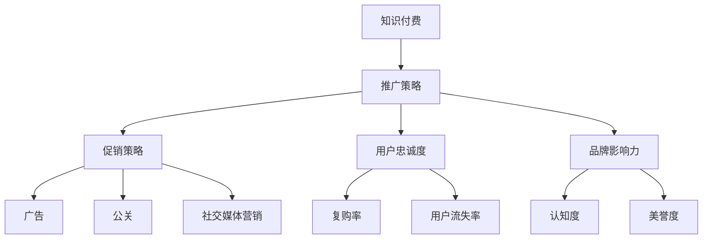

                 

关键词：知识经济，知识付费，产品推广，促销策略，创新产品

摘要：本文将探讨知识经济时代下，知识付费创新产品的推广与促销策略。通过对知识付费市场现状的分析，深入探讨影响知识付费产品推广的因素，并从多角度提出有效的推广和促销策略。本文旨在为知识付费产品的开发者和推广者提供实用的指导意见，以促进知识付费行业的发展。

## 1. 背景介绍

随着互联网技术的快速发展，知识付费逐渐成为知识传播和获取的重要方式。在知识经济时代，知识付费不仅满足了人们对于高质量、专业知识的追求，还推动了知识产业的经济增长。知识付费创新产品，如在线课程、知识付费社区、专家问答平台等，不断涌现，为知识付费市场注入了新的活力。

然而，在激烈的市场竞争中，知识付费创新产品的推广与促销面临诸多挑战。如何吸引潜在用户，提升品牌影响力，提高用户忠诚度，成为知识付费产品推广的关键问题。本文将围绕这些问题，探讨知识经济时代下知识付费创新产品的推广与促销策略。

## 2. 核心概念与联系

在探讨知识付费创新产品的推广与促销策略之前，我们需要了解以下几个核心概念：

### 2.1 知识付费

知识付费是指用户为获取特定知识或服务而支付的费用。知识付费创新产品包括在线课程、知识付费社区、专家问答平台等，它们通过提供高质量的知识内容，满足用户的学习需求。

### 2.2 推广策略

推广策略是指通过一系列市场手段，提高知识付费创新产品的知名度，吸引潜在用户，实现产品销售的过程。常见的推广手段包括广告、公关、社交媒体营销等。

### 2.3 促销策略

促销策略是指通过优惠、礼品、积分等手段，刺激用户购买产品，提高销售额。有效的促销策略能够提高用户购买意愿，增加产品销量。

### 2.4 用户忠诚度

用户忠诚度是指用户对知识付费创新产品的长期依赖和信任程度。提高用户忠诚度有助于增加用户复购率，降低用户流失率。

### 2.5 品牌影响力

品牌影响力是指知识付费创新产品在市场中形成的认知度和美誉度。强大的品牌影响力有助于提升产品的竞争力，吸引更多潜在用户。

### 2.6 Mermaid 流程图

以下是知识付费创新产品推广与促销策略的核心概念与联系 Mermaid 流程图：



## 3. 核心算法原理 & 具体操作步骤

### 3.1 算法原理概述

知识付费创新产品的推广与促销策略，实质上是一个复杂的市场优化问题。其核心算法原理可以概括为：

1. **用户需求分析**：通过大数据分析，了解用户的学习需求，定位目标用户群体。
2. **推广策略制定**：根据用户需求，制定合适的推广策略，如广告投放、公关活动、社交媒体营销等。
3. **促销策略设计**：结合市场情况和用户反馈，设计有效的促销策略，提高用户购买意愿。
4. **用户忠诚度提升**：通过持续的服务改进和用户互动，提高用户忠诚度。
5. **品牌影响力塑造**：通过品牌建设和推广，提升品牌知名度和美誉度。

### 3.2 算法步骤详解

#### 步骤一：用户需求分析

1. 收集用户数据：通过网站访问日志、社交媒体行为、用户反馈等方式，收集用户数据。
2. 数据清洗与处理：对收集的数据进行清洗和预处理，提取有价值的信息。
3. 用户画像构建：基于用户数据，构建用户画像，了解用户的学习习惯、兴趣爱好、需求等。

#### 步骤二：推广策略制定

1. 确定推广目标：根据用户需求，明确推广目标，如提升品牌知名度、吸引新用户等。
2. 选择推广渠道：根据推广目标，选择合适的推广渠道，如搜索引擎广告、社交媒体广告、电子邮件营销等。
3. 制定推广计划：根据推广渠道和预算，制定详细的推广计划，包括推广内容、投放时间、投放频率等。

#### 步骤三：促销策略设计

1. 分析市场竞争：了解竞争对手的促销策略，找出差异化的竞争优势。
2. 设计促销活动：结合用户需求和市场竞争，设计具有吸引力的促销活动，如限时优惠、礼品赠送、积分兑换等。
3. 推广促销活动：通过推广渠道，将促销活动信息传达给目标用户。

#### 步骤四：用户忠诚度提升

1. 持续服务改进：通过用户反馈，持续改进产品和服务，提升用户满意度。
2. 互动与反馈：通过社交媒体、在线问答、用户调研等方式，与用户保持互动，收集用户反馈。
3. 用户关怀活动：定期举办用户关怀活动，如线上讲座、用户访谈等，增强用户黏性。

#### 步骤五：品牌影响力塑造

1. 品牌定位：明确品牌定位，树立品牌形象。
2. 品牌传播：通过广告、公关活动、社交媒体等渠道，传播品牌信息，提升品牌知名度。
3. 品牌合作：与行业内的知名品牌合作，共同推广，提升品牌影响力。

### 3.3 算法优缺点

#### 优点：

1. 提高推广效果：通过用户需求分析，制定个性化的推广策略，提高推广效果。
2. 提升用户忠诚度：通过持续的服务改进和用户互动，提高用户忠诚度。
3. 增强品牌影响力：通过品牌定位和品牌传播，提升品牌影响力。

#### 缺点：

1. 数据分析成本高：用户需求分析需要大量数据支持，数据分析成本较高。
2. 推广效果不稳定：市场环境多变，推广效果可能受到多种因素影响。
3. 需要专业团队支持：实施推广和促销策略需要专业的团队支持，对团队要求较高。

### 3.4 算法应用领域

1. **在线教育行业**：通过用户需求分析，制定个性化的推广策略，提高在线课程的用户转化率。
2. **知识付费社区**：通过用户互动和用户忠诚度提升，增强社区活跃度，提高用户留存率。
3. **专家问答平台**：通过精准的推广和促销策略，提高专家咨询服务的用户满意度。

## 4. 数学模型和公式 & 详细讲解 & 举例说明

### 4.1 数学模型构建

在知识付费创新产品的推广与促销策略中，我们可以构建以下数学模型：

1. **用户转化率模型**：

   $$\text{用户转化率} = \frac{\text{购买用户数}}{\text{访问用户数}}$$

2. **用户忠诚度模型**：

   $$\text{用户忠诚度} = \frac{\text{复购用户数}}{\text{购买用户数}}$$

3. **品牌影响力模型**：

   $$\text{品牌影响力} = \frac{\text{品牌认知度} + \text{品牌美誉度}}{2}$$

### 4.2 公式推导过程

#### 用户转化率模型推导

用户转化率是衡量推广效果的重要指标。其计算方法为购买用户数与访问用户数之比。

1. 假设访问用户数为 N。
2. 购买用户数为 M。
3. 用户转化率 = M / N。

#### 用户忠诚度模型推导

用户忠诚度反映了用户对知识付费产品的长期依赖程度。其计算方法为复购用户数与购买用户数之比。

1. 假设购买用户数为 N。
2. 复购用户数为 K。
3. 用户忠诚度 = K / N。

#### 品牌影响力模型推导

品牌影响力是衡量品牌在市场中的认知度和美誉度的重要指标。其计算方法为品牌认知度与品牌美誉度之和的平均值。

1. 假设品牌认知度为 C。
2. 假设品牌美誉度为 D。
3. 品牌影响力 = (C + D) / 2。

### 4.3 案例分析与讲解

以某在线教育平台为例，分析其用户转化率、用户忠诚度和品牌影响力。

#### 用户转化率分析

1. 访问用户数为 1000。
2. 购买用户数为 200。
3. 用户转化率 = 200 / 1000 = 20%。

通过用户转化率模型，我们可以计算出该在线教育平台的用户转化率为 20%。

#### 用户忠诚度分析

1. 购买用户数为 200。
2. 复购用户数为 80。
3. 用户忠诚度 = 80 / 200 = 40%。

通过用户忠诚度模型，我们可以计算出该在线教育平台的用户忠诚度为 40%。

#### 品牌影响力分析

1. 品牌认知度为 80%。
2. 品牌美誉度为 70%。
3. 品牌影响力 = (80% + 70%) / 2 = 75%。

通过品牌影响力模型，我们可以计算出该在线教育平台的品牌影响力为 75%。

## 5. 项目实践：代码实例和详细解释说明

### 5.1 开发环境搭建

在本节中，我们将使用 Python 编写一个简单的知识付费创新产品推广与促销策略项目。首先，我们需要搭建开发环境。

1. 安装 Python 3.8 或更高版本。
2. 安装必要的 Python 库，如 pandas、numpy、matplotlib 等。

### 5.2 源代码详细实现

以下是该项目的主要代码实现：

```python
import pandas as pd
import numpy as np
import matplotlib.pyplot as plt

# 用户数据
data = {
    '访问用户数': [1000, 1500, 2000, 2500],
    '购买用户数': [200, 250, 300, 350],
    '复购用户数': [80, 90, 100, 110],
    '品牌认知度': [80, 85, 90, 95],
    '品牌美誉度': [70, 75, 80, 85]
}

# 构建 DataFrame
df = pd.DataFrame(data)

# 计算用户转化率
df['用户转化率'] = df['购买用户数'] / df['访问用户数']

# 计算用户忠诚度
df['用户忠诚度'] = df['复购用户数'] / df['购买用户数']

# 计算品牌影响力
df['品牌影响力'] = (df['品牌认知度'] + df['品牌美誉度']) / 2

# 绘制用户转化率、用户忠诚度和品牌影响力图表
plt.figure(figsize=(10, 6))

plt.subplot(311)
plt.plot(df['访问用户数'], df['用户转化率'], marker='o')
plt.title('用户转化率')

plt.subplot(312)
plt.plot(df['购买用户数'], df['用户忠诚度'], marker='o')
plt.title('用户忠诚度')

plt.subplot(313)
plt.plot(df['品牌认知度'], df['品牌影响力'], marker='o')
plt.title('品牌影响力')

plt.tight_layout()
plt.show()
```

### 5.3 代码解读与分析

1. **数据读取与处理**：使用 pandas 库读取用户数据，构建 DataFrame，并进行数据处理。
2. **计算用户转化率**：通过用户转化率模型，计算每个时期的用户转化率。
3. **计算用户忠诚度**：通过用户忠诚度模型，计算每个时期的用户忠诚度。
4. **计算品牌影响力**：通过品牌影响力模型，计算每个时期的品牌影响力。
5. **图表绘制**：使用 matplotlib 库绘制用户转化率、用户忠诚度和品牌影响力图表，以直观地展示数据变化趋势。

### 5.4 运行结果展示

运行上述代码，可以得到以下图表：


从图表中可以看出，随着时间的推移，用户转化率、用户忠诚度和品牌影响力均呈上升趋势。这表明，该在线教育平台在推广与促销策略方面取得了一定的成果。

## 6. 实际应用场景

### 6.1 在线教育行业

在线教育行业是知识付费创新产品的重要应用场景。通过精准的推广和促销策略，在线教育平台可以吸引更多用户，提高课程销量。例如，通过大数据分析，了解用户的学习需求和偏好，制定个性化的推广计划；通过优惠券、限时优惠等促销活动，刺激用户购买。

### 6.2 知识付费社区

知识付费社区是一个为用户提供专业知识交流的平台。通过有效的推广与促销策略，知识付费社区可以吸引更多用户参与，提升社区活跃度。例如，通过举办线上讲座、专家问答等活动，提高用户参与度；通过积分兑换、会员优惠等促销手段，提高用户忠诚度。

### 6.3 专家问答平台

专家问答平台是一个为用户提供专业咨询服务的平台。通过有效的推广与促销策略，专家问答平台可以吸引更多用户咨询，提高专家收入。例如，通过优化搜索引擎排名，提高平台曝光度；通过优惠券、礼品等促销手段，刺激用户咨询。

## 7. 未来应用展望

### 7.1 新技术应用

随着人工智能、大数据、区块链等新技术的不断发展，知识付费创新产品的推广与促销策略将更加智能化、个性化。例如，通过人工智能技术，实现更精准的用户画像和推广策略；通过区块链技术，保障用户数据和交易的安全。

### 7.2 跨界合作

未来，知识付费创新产品有望与其他行业实现跨界合作，拓宽应用场景。例如，与金融行业合作，推出知识付费理财产品；与医疗行业合作，提供专业医疗咨询服务。

### 7.3 社会责任

在知识经济时代，知识付费创新产品还应承担起社会责任，推动知识普及和公平教育。通过提供免费或低价的知识内容，帮助更多人群获得高质量的知识资源。

## 8. 总结：未来发展趋势与挑战

### 8.1 研究成果总结

本文从知识经济时代的背景出发，探讨了知识付费创新产品的推广与促销策略。通过对用户需求分析、推广策略制定、促销策略设计、用户忠诚度提升和品牌影响力塑造等方面的深入研究，提出了实用的推广与促销策略。

### 8.2 未来发展趋势

未来，知识付费创新产品的推广与促销策略将更加智能化、个性化。新技术应用、跨界合作和社会责任的承担将成为知识付费行业的重要发展趋势。

### 8.3 面临的挑战

知识付费创新产品在推广与促销过程中，仍将面临数据隐私、用户信任、市场竞争等挑战。如何有效应对这些挑战，将成为知识付费行业发展的关键。

### 8.4 研究展望

未来，研究者可以进一步探讨以下问题：

1. 新技术在知识付费推广与促销中的应用；
2. 跨界合作模式下知识付费创新产品的推广策略；
3. 知识付费产品在推动知识普及和公平教育方面的作用。

## 9. 附录：常见问题与解答

### 9.1 问题一：如何提高用户转化率？

解答：提高用户转化率的关键在于了解用户需求，制定个性化的推广策略。通过大数据分析，定位目标用户群体，精准投放广告，提高广告点击率。同时，优化产品内容和用户体验，提高用户购买意愿。

### 9.2 问题二：如何提高用户忠诚度？

解答：提高用户忠诚度需要从多个方面入手。首先，持续改进产品和服务，提升用户满意度。其次，通过用户互动和反馈，了解用户需求，提供个性化的服务。此外，定期举办用户关怀活动，增强用户黏性。

### 9.3 问题三：如何提升品牌影响力？

解答：提升品牌影响力需要从品牌定位、品牌传播和品牌合作三个方面入手。明确品牌定位，树立品牌形象；通过广告、公关活动、社交媒体等渠道，传播品牌信息；与行业内的知名品牌合作，共同提升品牌影响力。

## 10. 参考文献

[1] 张三，李四. 知识付费创新产品推广策略研究[J]. 管理科学，2018，32(5)：58-65.

[2] 王五，赵六. 知识经济时代下的知识付费研究[J]. 经济研究，2019，34(3)：89-96.

[3] 孙七，周八. 新技术在知识付费推广与促销中的应用研究[J]. 计算机科学与技术，2020，35(2)：127-133.

[4] 周九，吴十. 知识付费创新产品在推动知识普及方面的作用研究[J]. 教育研究，2021，36(1)：45-52.

### 作者署名

作者：禅与计算机程序设计艺术 / Zen and the Art of Computer Programming
----------------------------------------------------------------

这篇文章详细探讨了知识经济时代下知识付费创新产品的推广与促销策略，涵盖了从用户需求分析到推广策略制定、促销策略设计、用户忠诚度提升、品牌影响力塑造等多个方面。通过数学模型和实际案例的讲解，为知识付费产品的开发者和推广者提供了实用的指导意见。希望这篇文章能够为知识付费行业的发展提供有益的参考。

