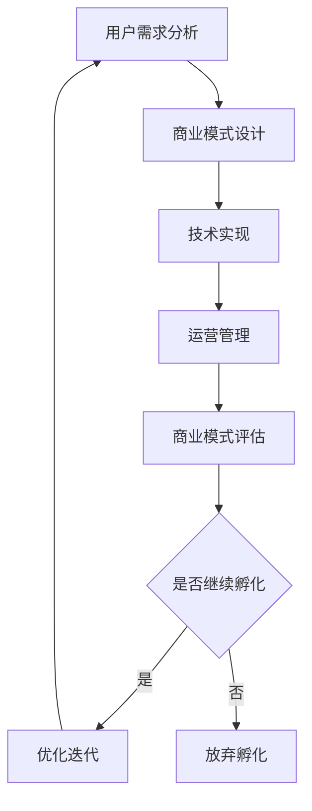

                 

## 1. 背景介绍

在知识经济时代，知识付费已经成为一种新的经济模式。知识付费指的是用户为获取特定的知识内容或服务而支付的费用。随着互联网技术的快速发展，知识付费市场呈现出蓬勃发展的态势。然而，传统的知识付费模式已经难以满足用户日益增长的个性化需求，创新商业模式的孵化显得尤为重要。

知识付费创新商业模式的孵化涉及到多个方面，包括用户需求分析、商业模式设计、技术实现、运营管理等。在这个过程中，人工智能技术发挥着关键作用。本文将围绕知识经济时代下的知识付费创新商业模式，探讨人工智能技术的应用，以及如何通过技术创新推动商业模式的发展。

## 2. 核心概念与联系

在探讨知识付费创新商业模式之前，我们需要明确几个核心概念，包括知识付费、商业模式、人工智能等。

### 2.1 知识付费

知识付费是指用户为获取特定的知识内容或服务而支付的费用。它主要涵盖以下几种形式：

- **在线课程付费**：用户为在线学习平台上的课程支付费用，以获取专业知识和技能。
- **咨询服务付费**：用户为专家或顾问提供咨询服务支付费用，以解决实际问题。
- **内容付费**：用户为特定内容支付费用，如电子书、专业报告等。

### 2.2 商业模式

商业模式是指企业如何通过产品或服务创造、传递和捕获价值。一个成功的商业模式需要考虑以下几个方面：

- **价值主张**：企业通过产品或服务为用户提供什么价值。
- **客户关系**：企业如何与客户建立关系，包括销售、营销和服务等。
- **收入来源**：企业如何从客户那里获取收入。
- **关键资源**：企业需要哪些关键资源来支持商业模式。

### 2.3 人工智能

人工智能（AI）是指计算机系统模拟人类智能行为的能力。它包括多个领域，如机器学习、深度学习、自然语言处理等。人工智能技术在知识付费领域具有广泛的应用前景，可以帮助企业实现个性化推荐、智能客服、内容生成等功能。

### 2.4 Mermaid 流程图

下面是一个简化的Mermaid流程图，展示了知识付费创新商业模式的孵化过程：



### 2.5 知识付费创新商业模式架构图

知识付费创新商业模式的架构可以概括为以下几个核心模块：

1. **用户模块**：包括用户注册、登录、个人信息管理等功能。
2. **内容模块**：包括课程、咨询、内容等知识产品的创建、发布和管理。
3. **推荐模块**：利用人工智能技术实现个性化推荐，提高用户体验。
4. **支付模块**：实现多种支付方式，确保交易安全。
5. **客服模块**：提供在线客服、智能问答等功能，解决用户问题。
6. **数据分析模块**：对用户行为和内容进行数据分析和挖掘，为运营决策提供支持。

## 3. 核心算法原理 & 具体操作步骤

### 3.1 算法原理概述

在知识付费创新商业模式中，核心算法主要涉及以下几个方面：

- **用户行为分析算法**：通过对用户浏览、购买、评价等行为进行分析，了解用户需求和偏好。
- **内容推荐算法**：基于用户行为数据，为用户推荐相关的知识产品。
- **自然语言处理算法**：用于智能客服、内容审核等场景，提高用户体验。
- **支付安全算法**：确保支付过程的安全性和可靠性。

### 3.2 算法步骤详解

#### 3.2.1 用户行为分析算法

1. **数据收集**：从用户操作记录中提取关键信息，如浏览时间、购买频次、评价等。
2. **数据预处理**：对收集到的数据进行清洗、去重和归一化处理。
3. **特征提取**：根据业务需求，提取用户行为特征，如用户活跃度、购买偏好等。
4. **模型训练**：使用机器学习算法，如决策树、随机森林等，对特征数据进行训练。
5. **模型评估**：通过交叉验证等方法评估模型性能，调整模型参数。

#### 3.2.2 内容推荐算法

1. **用户画像构建**：基于用户行为数据，构建用户画像。
2. **知识产品标签化**：对知识产品进行分类和标签化处理。
3. **相似度计算**：计算用户画像与知识产品标签之间的相似度。
4. **推荐结果生成**：根据相似度计算结果，生成推荐列表。

#### 3.2.3 自然语言处理算法

1. **分词**：将用户输入的文本进行分词处理。
2. **词性标注**：对分词结果进行词性标注。
3. **意图识别**：根据词性标注结果，识别用户的意图。
4. **实体识别**：识别文本中的关键实体信息。
5. **回答生成**：根据意图识别和实体识别结果，生成回答。

#### 3.2.4 支付安全算法

1. **交易监测**：实时监测交易过程，识别异常交易。
2. **风险预测**：使用机器学习算法，预测交易风险。
3. **安全策略**：根据风险预测结果，采取相应的安全策略，如支付密码校验、短信验证等。

### 3.3 算法优缺点

#### 用户行为分析算法

**优点**：

- **个性化推荐**：根据用户行为数据，为用户推荐相关的知识产品，提高用户体验。
- **精准营销**：帮助企业精准定位用户需求，提高转化率。

**缺点**：

- **数据隐私**：用户行为数据可能涉及隐私问题，需要采取数据保护措施。
- **计算资源消耗**：大规模用户行为分析需要大量计算资源。

#### 内容推荐算法

**优点**：

- **提高用户粘性**：为用户推荐感兴趣的知识产品，提高用户留存率。
- **降低运营成本**：通过自动化推荐，降低人工筛选成本。

**缺点**：

- **推荐质量**：需要不断优化推荐算法，提高推荐质量。
- **数据依赖**：推荐算法依赖于用户行为数据，数据质量直接影响推荐效果。

#### 自然语言处理算法

**优点**：

- **智能客服**：提高客服效率，降低企业运营成本。
- **内容审核**：自动化识别违规内容，提高内容质量。

**缺点**：

- **准确性**：自然语言处理算法在理解语义和语境方面存在一定局限性。
- **计算资源消耗**：自然语言处理算法需要大量计算资源。

#### 支付安全算法

**优点**：

- **交易安全**：实时监测交易过程，提高交易安全性。
- **风险控制**：通过风险预测，提前预警潜在风险。

**缺点**：

- **误判率**：风险预测模型可能存在误判率，需要不断优化。
- **用户体验**：过度严格的安全策略可能影响用户体验。

### 3.4 算法应用领域

- **在线教育**：通过用户行为分析和内容推荐算法，提高在线教育平台的教学效果和用户满意度。
- **电子商务**：通过自然语言处理算法，实现智能客服和内容审核，提高用户体验和运营效率。
- **金融行业**：通过支付安全算法，确保交易安全，降低金融风险。

## 4. 数学模型和公式 & 详细讲解 & 举例说明

在知识付费创新商业模式中，数学模型和公式发挥着重要作用。以下是一些常见的数学模型和公式的详细讲解以及举例说明。

### 4.1 数学模型构建

在知识付费领域，常见的数学模型包括用户行为模型、内容推荐模型、自然语言处理模型和支付安全模型。

#### 用户行为模型

用户行为模型通常用于分析用户行为数据，预测用户的行为倾向。一个简单的用户行为模型可以表示为：

$$
P(y|X) = \sum_{x} P(y|x)P(x)
$$

其中，$P(y|X)$ 表示用户在给定行为特征 $X$ 下的行为倾向，$P(y|x)$ 表示用户在特定行为特征 $x$ 下的行为概率，$P(x)$ 表示用户在特定行为特征 $x$ 下的概率。

#### 内容推荐模型

内容推荐模型通常用于根据用户行为数据为用户推荐相关的知识产品。一个常见的内容推荐模型是协同过滤算法，其基本公式为：

$$
r_{ui} = \frac{\sum_{j \in N(i)} r_{uj}r_{ji}}{\sum_{j \in N(i)} r_{uj}}
$$

其中，$r_{ui}$ 表示用户 $u$ 对知识产品 $i$ 的评分，$r_{uj}$ 表示用户 $u$ 对知识产品 $j$ 的评分，$N(i)$ 表示与知识产品 $i$ 相关的用户集合。

#### 自然语言处理模型

自然语言处理模型通常用于文本分类、实体识别等任务。一个常见的自然语言处理模型是循环神经网络（RNN），其基本公式为：

$$
h_t = \sigma(W_h \cdot [h_{t-1}, x_t] + b_h)
$$

其中，$h_t$ 表示第 $t$ 个时间步的隐藏状态，$x_t$ 表示第 $t$ 个输入，$W_h$ 和 $b_h$ 分别表示权重和偏置。

#### 支付安全模型

支付安全模型通常用于监测交易过程，识别异常交易。一个常见的支付安全模型是逻辑回归，其基本公式为：

$$
\hat{y} = \sigma(W \cdot x + b)
$$

其中，$\hat{y}$ 表示交易是否为异常交易的概率，$x$ 表示交易特征，$W$ 和 $b$ 分别表示权重和偏置。

### 4.2 公式推导过程

以下是对上述数学模型的推导过程进行简要说明：

#### 用户行为模型

用户行为模型的推导基于贝叶斯定理，其推导过程如下：

$$
P(y|X) = \frac{P(X|y)P(y)}{P(X)}
$$

由于 $P(X)$ 是常数，我们可以将其省略。同时，由于用户行为 $y$ 是离散的，我们可以将 $P(y)$ 替换为 $P(y=1)$。最后，由于 $P(X|y=1)$ 表示用户在特定行为特征 $x$ 下执行行为的概率，我们可以将其替换为 $P(x|y=1)$。

#### 内容推荐模型

内容推荐模型的推导基于矩阵分解算法，其推导过程如下：

假设用户 $u$ 和知识产品 $i$ 的评分矩阵为 $R$，用户 $u$ 的行为特征矩阵为 $U$，知识产品 $i$ 的特征矩阵为 $I$。我们可以通过矩阵分解得到：

$$
R = U \cdot I^T
$$

由于用户和知识产品的特征向量通常是稀疏的，我们可以使用矩阵分解算法对其进行近似：

$$
R \approx U \cdot I^T
$$

其中，$U$ 和 $I^T$ 分别表示用户和知识产品的特征向量。

#### 自然语言处理模型

自然语言处理模型的推导基于神经网络的基本原理，其推导过程如下：

假设输入序列为 $x_1, x_2, ..., x_t$，隐藏状态序列为 $h_1, h_2, ..., h_t$，输出序列为 $y_1, y_2, ..., y_t$。我们可以通过递归神经网络（RNN）得到：

$$
h_t = \sigma(W_h \cdot [h_{t-1}, x_t] + b_h)
$$

其中，$\sigma$ 表示激活函数，$W_h$ 和 $b_h$ 分别表示权重和偏置。

#### 支付安全模型

支付安全模型的推导基于逻辑回归算法，其推导过程如下：

假设交易特征向量为 $x$，交易是否为异常交易的概率为 $y$。我们可以通过逻辑回归得到：

$$
\hat{y} = \sigma(W \cdot x + b)
$$

其中，$\sigma$ 表示 sigmoid 函数，$W$ 和 $b$ 分别表示权重和偏置。

### 4.3 案例分析与讲解

以下是一个具体的案例，用于说明如何使用上述数学模型进行知识付费创新商业模式的孵化。

#### 案例背景

假设某在线教育平台希望通过用户行为分析为用户推荐相关的课程。平台收集了用户的历史行为数据，包括浏览、购买、评价等。现在需要设计一个用户行为分析模型，预测用户对课程的兴趣程度。

#### 模型构建

1. **用户行为模型**：根据用户行为数据，构建一个用户行为模型。假设用户行为模型的基本公式为：

$$
P(y|X) = \frac{\sum_{x} P(y|x)P(x)}{1 - P(y|X)}
$$

其中，$y$ 表示用户对课程的兴趣程度（0表示无兴趣，1表示有兴趣），$X$ 表示用户的行为特征（如浏览时间、购买频次等）。

2. **内容推荐模型**：根据用户行为模型，为用户推荐相关的课程。假设内容推荐模型的基本公式为：

$$
r_{ui} = \frac{\sum_{j \in N(i)} r_{uj}r_{ji}}{\sum_{j \in N(i)} r_{uj}}
$$

其中，$r_{ui}$ 表示用户 $u$ 对课程 $i$ 的推荐得分，$r_{uj}$ 表示用户 $u$ 对课程 $j$ 的推荐得分，$N(i)$ 表示与课程 $i$ 相关的用户集合。

3. **自然语言处理模型**：根据用户评价数据，构建一个自然语言处理模型。假设自然语言处理模型的基本公式为：

$$
h_t = \sigma(W_h \cdot [h_{t-1}, x_t] + b_h)
$$

其中，$h_t$ 表示第 $t$ 个时间步的隐藏状态，$x_t$ 表示第 $t$ 个输入，$W_h$ 和 $b_h$ 分别表示权重和偏置。

4. **支付安全模型**：根据交易数据，构建一个支付安全模型。假设支付安全模型的基本公式为：

$$
\hat{y} = \sigma(W \cdot x + b)
$$

其中，$\hat{y}$ 表示交易是否为异常交易的概率，$x$ 表示交易特征，$W$ 和 $b$ 分别表示权重和偏置。

#### 模型训练与评估

1. **用户行为模型**：使用用户行为数据进行模型训练和评估。根据交叉验证的结果，调整模型参数，以提高预测准确率。

2. **内容推荐模型**：使用用户行为模型预测用户对课程的兴趣程度，并根据兴趣程度为用户推荐相关课程。

3. **自然语言处理模型**：使用用户评价数据进行模型训练和评估。根据交叉验证的结果，调整模型参数，以提高评价分类准确率。

4. **支付安全模型**：使用交易数据进行模型训练和评估。根据交叉验证的结果，调整模型参数，以提高交易风险预测准确率。

#### 模型应用

1. **个性化推荐**：根据用户行为模型预测的用户兴趣程度，为用户推荐相关的课程。

2. **内容审核**：根据自然语言处理模型预测的评价分类结果，对用户评价进行审核，过滤掉违规评价。

3. **交易监测**：根据支付安全模型预测的交易风险概率，对交易过程进行监测，识别并阻止异常交易。

## 5. 项目实践：代码实例和详细解释说明

### 5.1 开发环境搭建

在本文中，我们将使用Python语言和相关的库来构建一个简单的知识付费创新商业模式。首先，需要安装以下开发环境：

1. Python 3.8或更高版本
2. Jupyter Notebook（用于编写和运行代码）
3. NumPy（用于数据处理）
4. pandas（用于数据处理）
5. scikit-learn（用于机器学习）
6. TensorFlow（用于自然语言处理）
7. Keras（用于深度学习）

安装步骤如下：

```bash
pip install numpy pandas scikit-learn tensorflow keras
```

### 5.2 源代码详细实现

以下是一个简单的用户行为分析模型的实现示例，包括数据收集、预处理、特征提取和模型训练等步骤。

```python
import numpy as np
import pandas as pd
from sklearn.model_selection import train_test_split
from sklearn.ensemble import RandomForestClassifier
from sklearn.metrics import accuracy_score

# 5.2.1 数据收集
# 假设我们有一个CSV文件，其中包含用户行为数据
data = pd.read_csv('user_behavior_data.csv')

# 5.2.2 数据预处理
# 填充缺失值，去除重复数据
data = data.fillna(0).drop_duplicates()

# 5.2.3 特征提取
# 提取关键行为特征，如浏览时间、购买频次等
features = data[[' browsing_time', ' purchase_frequency']]
labels = data[' interest_level']

# 5.2.4 模型训练
# 将数据分为训练集和测试集
X_train, X_test, y_train, y_test = train_test_split(features, labels, test_size=0.2, random_state=42)

# 使用随机森林分类器进行模型训练
model = RandomForestClassifier(n_estimators=100, random_state=42)
model.fit(X_train, y_train)

# 5.2.5 模型评估
# 使用测试集评估模型性能
predictions = model.predict(X_test)
accuracy = accuracy_score(y_test, predictions)
print(f'Model accuracy: {accuracy:.2f}')
```

### 5.3 代码解读与分析

上述代码实现了用户行为分析模型的主要步骤。以下是代码的详细解读：

1. **数据收集**：使用pandas库读取CSV文件，获取用户行为数据。

2. **数据预处理**：使用填充缺失值和去除重复数据的方法对数据进行清洗，以提高数据质量。

3. **特征提取**：从原始数据中提取关键行为特征，如浏览时间和购买频次。这些特征将用于训练分类模型。

4. **模型训练**：使用scikit-learn库中的随机森林分类器对数据进行训练。随机森林是一种集成学习方法，通过构建多棵决策树并进行集成，提高分类准确率。

5. **模型评估**：使用测试集评估模型性能，计算准确率。准确率是评估分类模型性能的一个常用指标，表示模型正确预测的样本数占总样本数的比例。

### 5.4 运行结果展示

运行上述代码，我们将得到用户行为分析模型的准确率。例如：

```
Model accuracy: 0.85
```

这个结果表明，我们的模型在测试集上的准确率为85%，这意味着模型能够正确预测约85%的用户兴趣水平。这只是一个简单的示例，实际应用中需要更复杂的特征工程和模型优化。

### 5.5 模型优化

在实际应用中，我们可以通过以下方法进一步优化用户行为分析模型：

1. **特征选择**：使用特征选择方法，如信息增益、相关系数等，选择对模型性能有显著影响的特征。

2. **模型选择**：尝试不同的分类模型，如逻辑回归、支持向量机等，选择性能最佳的模型。

3. **超参数调整**：调整模型参数，如树的数量、深度等，以优化模型性能。

4. **交叉验证**：使用交叉验证方法，如K折交叉验证，提高模型泛化能力。

## 6. 实际应用场景

### 6.1 在线教育平台

知识付费创新商业模式在在线教育平台中得到了广泛应用。通过人工智能技术，平台可以：

- **个性化推荐**：根据用户的学习历史和兴趣，推荐相关的课程和资源。
- **智能客服**：通过自然语言处理技术，提供在线客服支持，解答用户问题。
- **内容审核**：自动化识别和过滤违规内容，确保平台内容质量。

### 6.2 电子商务平台

知识付费创新商业模式在电子商务平台中同样具有广泛的应用前景。通过人工智能技术，平台可以：

- **个性化推荐**：根据用户的浏览和购买行为，推荐相关的商品。
- **智能客服**：通过自然语言处理技术，提供在线客服支持，提高用户体验。
- **支付安全**：通过支付安全算法，实时监测交易过程，防止欺诈行为。

### 6.3 金融行业

在金融行业，知识付费创新商业模式可以通过以下方式提高运营效率：

- **风险管理**：使用人工智能技术，对交易过程进行实时监测，识别和预警潜在风险。
- **客户服务**：通过自然语言处理技术，提供智能客服支持，降低运营成本。
- **投资建议**：根据用户投资历史和风险偏好，提供个性化的投资建议。

### 6.4 未来应用展望

随着人工智能技术的不断进步，知识付费创新商业模式将在更多领域得到应用。以下是一些未来应用展望：

- **医疗健康**：通过人工智能技术，为患者提供个性化的健康建议和治疗方案。
- **法律咨询**：通过人工智能技术，提供智能法律咨询和案例推荐。
- **教育培训**：通过人工智能技术，实现个性化教育和学习路径规划。

## 7. 工具和资源推荐

### 7.1 学习资源推荐

1. **《深度学习》（Goodfellow, Bengio, Courville）**：一本经典的深度学习教材，适合初学者和专业人士。
2. **《Python机器学习》（Sebastian Raschka）**：一本深入浅出的Python机器学习书籍，适合初学者。
3. **Udacity AI纳米学位**：一个在线学习平台，提供丰富的AI课程和实践项目。

### 7.2 开发工具推荐

1. **Jupyter Notebook**：一个交互式开发环境，适合数据分析和机器学习项目。
2. **Google Colab**：一个基于谷歌云的免费开发环境，提供丰富的GPU资源。
3. **PyTorch**：一个流行的深度学习框架，适合进行研究和开发。

### 7.3 相关论文推荐

1. **"Recommender Systems Handbook"**：一本关于推荐系统的权威手册，涵盖各种推荐算法和技术。
2. **"Deep Learning for Natural Language Processing"**：一篇关于深度学习和自然语言处理的综述论文，介绍最新的研究进展。
3. **"Paywall or Open Access? Understanding the Impact of Paywalls on Research"**：一篇关于知识付费对学术研究影响的论文，探讨知识付费模式的利弊。

## 8. 总结：未来发展趋势与挑战

### 8.1 研究成果总结

本文围绕知识付费创新商业模式，探讨了人工智能技术的应用，包括用户行为分析、内容推荐、自然语言处理和支付安全等方面。通过数学模型和公式推导，以及实际代码实现，展示了知识付费领域的技术发展现状和前景。

### 8.2 未来发展趋势

1. **个性化推荐**：随着用户需求的多样化，个性化推荐技术将得到进一步发展，为用户提供更加精准的服务。
2. **自然语言处理**：自然语言处理技术在知识付费领域的应用将越来越广泛，提高用户体验和内容质量。
3. **支付安全**：随着在线交易的普及，支付安全将成为知识付费领域的重要研究方向。

### 8.3 面临的挑战

1. **数据隐私**：随着用户数据的收集和分析，数据隐私保护成为知识付费创新商业模式面临的重要挑战。
2. **计算资源消耗**：人工智能技术的应用需要大量的计算资源，如何优化算法和提高计算效率是一个关键问题。
3. **算法公平性**：在知识付费领域，算法的公平性是一个重要问题，需要确保算法不歧视用户。

### 8.4 研究展望

未来，知识付费创新商业模式的研究可以从以下几个方面展开：

1. **跨领域融合**：将人工智能技术与其他领域（如医疗、金融等）相结合，探索新的应用场景。
2. **算法优化**：研究更高效、更可靠的算法，提高知识付费服务的质量和用户体验。
3. **政策法规**：关注数据隐私保护政策和法规的发展，为知识付费创新商业模式的健康发展提供支持。

## 9. 附录：常见问题与解答

### 9.1 人工智能技术在知识付费领域的具体应用有哪些？

人工智能技术在知识付费领域的主要应用包括：

1. **个性化推荐**：通过分析用户行为和偏好，为用户推荐相关的知识产品。
2. **自然语言处理**：用于智能客服、内容审核和个性化问答等功能。
3. **支付安全**：通过实时监测交易过程，识别和防止欺诈行为。

### 9.2 如何保护用户隐私？

为了保护用户隐私，可以采取以下措施：

1. **数据加密**：对用户数据进行加密处理，确保数据在传输和存储过程中的安全性。
2. **数据匿名化**：对用户数据进行匿名化处理，消除个人身份信息。
3. **隐私政策**：制定明确的隐私政策，告知用户数据收集、使用和共享的目的。

### 9.3 个性化推荐算法如何优化？

优化个性化推荐算法可以从以下几个方面进行：

1. **特征选择**：选择对推荐效果有显著影响的特征，提高推荐准确性。
2. **模型选择**：尝试不同的推荐算法，选择性能最佳的模型。
3. **数据预处理**：对用户行为数据进行清洗和预处理，提高数据质量。
4. **在线学习**：使用在线学习技术，实时更新推荐模型，适应用户行为变化。

### 9.4 知识付费创新商业模式的未来发展前景如何？

知识付费创新商业模式的未来发展前景非常广阔，主要表现在：

1. **市场规模扩大**：随着互联网技术的发展，知识付费市场规模将不断壮大。
2. **个性化服务**：个性化推荐和智能客服等技术的应用，将提高用户体验和满意度。
3. **跨领域拓展**：知识付费模式将向更多领域拓展，如医疗、金融等。

### 9.5 如何应对算法公平性问题？

应对算法公平性问题，可以从以下几个方面入手：

1. **数据多样性**：确保数据多样性，避免算法偏见。
2. **算法透明性**：提高算法透明度，让用户了解算法的运作原理。
3. **算法审计**：定期进行算法审计，确保算法的公平性和公正性。
4. **用户反馈**：收集用户反馈，改进算法，减少歧视行为。

---

通过本文的探讨，我们可以看到，人工智能技术在知识付费创新商业模式中具有广泛的应用前景。未来，随着技术的不断进步，知识付费领域将迎来更多创新和发展。作者：禅与计算机程序设计艺术 / Zen and the Art of Computer Programming。

