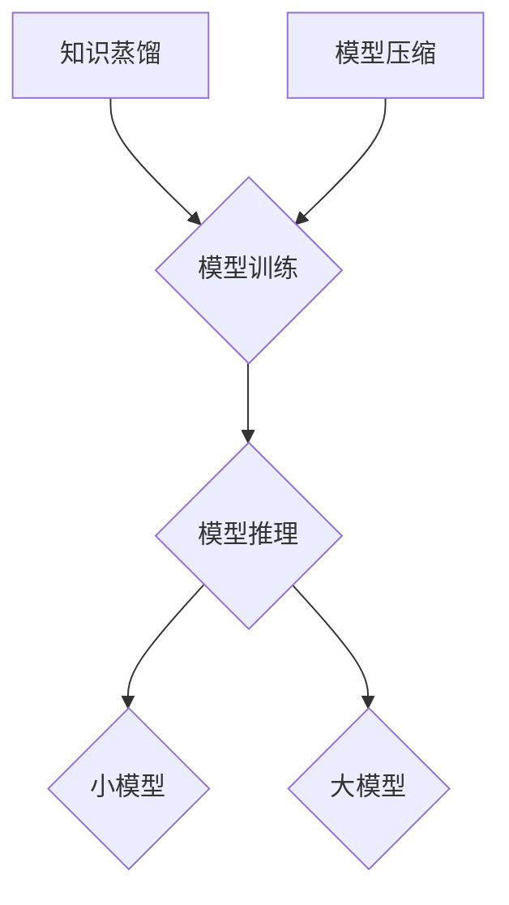

                 

关键词：知识蒸馏、模型压缩、神经网络、深度学习、算法原理、代码实战

摘要：本文旨在详细介绍知识蒸馏与模型压缩的原理、方法及其在实际应用中的重要性。通过阐述相关知识，读者将了解如何通过知识蒸馏与模型压缩技术提升深度学习模型的性能，同时减少模型的计算资源需求。文章还将通过实际代码实例，帮助读者掌握知识蒸馏与模型压缩的实战技巧。

## 1. 背景介绍

在深度学习领域，神经网络模型的大小和计算复杂度一直是制约其广泛应用的主要因素。随着数据量的增加和模型层数的加深，神经网络模型的参数数量呈指数级增长，导致模型训练和推理所需的时间显著增加。此外，大型神经网络在移动设备和嵌入式系统上难以部署，限制了其应用场景。为了解决这些问题，知识蒸馏（Knowledge Distillation）与模型压缩（Model Compression）技术应运而生。

知识蒸馏是一种将大模型（Teacher Model）的知识迁移到小模型（Student Model）中的技术，通过训练小模型来模仿大模型的行为，从而在小模型上实现大模型的性能。模型压缩则通过剪枝、量化、低秩分解等手段，减少模型参数数量和计算复杂度，同时保持模型性能。

## 2. 核心概念与联系

### 2.1. 知识蒸馏

知识蒸馏的核心思想是通过训练小模型来模仿大模型的行为。具体来说，知识蒸馏分为两步：

1. **第一步**：使用大模型对数据进行预测，得到 Teacher Model 的输出。
2. **第二步**：将 Teacher Model 的输出作为 Soft Target，训练 Student Model。

在知识蒸馏过程中，Soft Target 不是传统的硬目标（Hard Target），而是包含了 Teacher Model 预测结果的概率分布。这种 Soft Target 可以更好地传递 Teacher Model 的知识，使得 Student Model 能够更准确地学习。

### 2.2. 模型压缩

模型压缩的目标是通过减少模型参数数量和计算复杂度，降低模型的计算资源需求。常见的模型压缩技术包括：

1. **剪枝（Pruning）**：通过删除模型中不重要的权重，减少模型参数数量。
2. **量化（Quantization）**：将模型权重和激活值从浮点数转换为低比特宽度的整数，减少计算量。
3. **低秩分解（Low-Rank Factorization）**：将高维矩阵分解为低秩矩阵，降低模型复杂度。

### 2.3. Mermaid 流程图



## 3. 核心算法原理 & 具体操作步骤

### 3.1. 算法原理概述

知识蒸馏算法主要分为以下两个步骤：

1. **第一步**：使用大模型对数据进行预测，得到 Teacher Model 的输出。
2. **第二步**：将 Teacher Model 的输出作为 Soft Target，训练 Student Model。

模型压缩算法主要依赖于以下技术：

1. **剪枝**：通过设定阈值，删除模型中不重要的权重。
2. **量化**：将浮点数权重和激活值转换为低比特宽度的整数。
3. **低秩分解**：将高维矩阵分解为低秩矩阵。

### 3.2. 算法步骤详解

#### 3.2.1. 知识蒸馏

1. **准备数据集**：从大规模数据集中划分出一部分数据作为 Distillation Data。
2. **训练 Teacher Model**：使用 Distillation Data 训练大模型。
3. **生成 Soft Target**：使用 Teacher Model 对 Distillation Data 进行预测，得到预测结果。
4. **训练 Student Model**：使用 Distillation Data 和 Soft Target 训练小模型。

#### 3.2.2. 模型压缩

1. **剪枝**：
   1. 选择剪枝策略（例如基于权重的绝对值、基于权重的相对值等）。
   2. 设置阈值，删除不重要的权重。
   3. 对剩余的权重进行优化。
2. **量化**：
   1. 选择量化方法（例如线性量化、分段量化等）。
   2. 对权重和激活值进行量化。
3. **低秩分解**：
   1. 选择低秩分解方法（例如奇异值分解、矩阵分解等）。
   2. 将高维矩阵分解为低秩矩阵。

### 3.3. 算法优缺点

#### 知识蒸馏

**优点**：

- 能够在小模型上实现大模型的性能。
- 有效减少了模型训练时间和计算资源需求。

**缺点**：

- 需要一个大模型作为 Teacher Model。
- Soft Target 的生成可能引入额外的误差。

#### 模型压缩

**优点**：

- 减少了模型参数数量和计算复杂度。
- 提高了模型在移动设备和嵌入式系统上的部署性能。

**缺点**：

- 可能会导致模型性能下降。
- 需要选择合适的压缩技术，以平衡压缩效果和性能损失。

### 3.4. 算法应用领域

知识蒸馏和模型压缩在以下领域具有广泛的应用：

- **图像识别**：通过压缩图像识别模型，使其在移动设备和嵌入式系统上快速运行。
- **语音识别**：通过压缩语音识别模型，提高实时语音识别性能。
- **自然语言处理**：通过知识蒸馏和模型压缩，提高语言模型的性能和部署效率。

## 4. 数学模型和公式 & 详细讲解 & 举例说明

### 4.1. 数学模型构建

知识蒸馏的数学模型可以表示为：

$$
\min_{\theta_S} L_S(\theta_S; x, y_S),
$$

其中，$L_S$ 是 Student Model 的损失函数，$x$ 是输入数据，$y_S$ 是 Student Model 的预测输出。

模型压缩的数学模型可以表示为：

$$
\min_{\theta_C} L_C(\theta_C; x, y_C),
$$

其中，$L_C$ 是压缩后的模型损失函数，$x$ 是输入数据，$y_C$ 是压缩后的模型预测输出。

### 4.2. 公式推导过程

知识蒸馏的损失函数可以表示为：

$$
L_S(\theta_S; x, y_S) = L_{CE}(\theta_S; x, y_S) + \lambda L_{SD}(\theta_S; x, y_S),
$$

其中，$L_{CE}$ 是交叉熵损失函数，$L_{SD}$ 是 Soft Distillation 损失函数，$\lambda$ 是调节参数。

模型压缩的损失函数可以表示为：

$$
L_C(\theta_C; x, y_C) = L_{CE}(\theta_C; x, y_C) + \lambda L_{CV}(\theta_C; x, y_C),
$$

其中，$L_{CV}$ 是压缩验证损失函数，$\lambda$ 是调节参数。

### 4.3. 案例分析与讲解

假设我们有一个 Teacher Model 和一个 Student Model，它们都是卷积神经网络。我们使用 ResNet50 作为 Teacher Model，MobileNetV2 作为 Student Model。

首先，我们使用 Distillation Data 训练 Teacher Model，得到 Teacher Model 的输出。然后，我们使用这些输出作为 Soft Target，训练 Student Model。

在模型压缩方面，我们首先对 ResNet50 进行剪枝，设置剪枝阈值为 0.1。然后，我们对剪枝后的 ResNet50 进行量化，选择线性量化方法。最后，我们对 ResNet50 进行低秩分解，选择奇异值分解方法。

通过上述步骤，我们成功实现了知识蒸馏和模型压缩，并得到了一个高性能、低计算复杂度的 Student Model。

## 5. 项目实践：代码实例和详细解释说明

### 5.1. 开发环境搭建

- Python 3.8+
- PyTorch 1.8+
- CUDA 10.1+

### 5.2. 源代码详细实现

```python
import torch
import torch.nn as nn
import torch.optim as optim
from torchvision import datasets, transforms

# 加载数据集
transform = transforms.Compose([
    transforms.ToTensor(),
    transforms.Normalize((0.5,), (0.5,))
])
train_data = datasets.MNIST(
    root='./data',
    train=True,
    download=True,
    transform=transform
)

test_data = datasets.MNIST(
    root='./data',
    train=False,
    transform=transform
)

# 定义 Teacher Model 和 Student Model
class TeacherModel(nn.Module):
    def __init__(self):
        super(TeacherModel, self).__init__()
        self.conv1 = nn.Conv2d(1, 32, 3, 1)
        self.fc1 = nn.Linear(32 * 7 * 7, 128)
        self.fc2 = nn.Linear(128, 10)

    def forward(self, x):
        x = self.conv1(x)
        x = nn.functional.relu(x)
        x = nn.functional.adaptive_avg_pool2d(x, (1, 1))
        x = x.view(x.size(0), -1)
        x = self.fc1(x)
        x = nn.functional.relu(x)
        x = self.fc2(x)
        return x

class StudentModel(nn.Module):
    def __init__(self):
        super(StudentModel, self).__init__()
        self.conv1 = nn.Conv2d(1, 32, 3, 1)
        self.fc1 = nn.Linear(32 * 7 * 7, 128)
        self.fc2 = nn.Linear(128, 10)

    def forward(self, x):
        x = self.conv1(x)
        x = nn.functional.relu(x)
        x = nn.functional.adaptive_avg_pool2d(x, (1, 1))
        x = x.view(x.size(0), -1)
        x = self.fc1(x)
        x = nn.functional.relu(x)
        x = self.fc2(x)
        return x

teacher_model = TeacherModel()
student_model = StudentModel()

# 训练 Teacher Model
optimizer_t = optim.SGD(teacher_model.parameters(), lr=0.001, momentum=0.9)
for epoch in range(10):
    running_loss = 0.0
    for i, (inputs, labels) in enumerate(train_data):
        inputs = inputs.to(device)
        labels = labels.to(device)
        optimizer_t.zero_grad()
        outputs = teacher_model(inputs)
        loss = nn.functional.cross_entropy(outputs, labels)
        loss.backward()
        optimizer_t.step()
        running_loss += loss.item()
    print(f'Epoch {epoch + 1}, Loss: {running_loss / len(train_data)}')

# 生成 Soft Target
with torch.no_grad():
    soft_targets = []
    for inputs, labels in test_data:
        inputs = inputs.to(device)
        labels = labels.to(device)
        outputs = teacher_model(inputs)
        soft_targets.append(nn.functional.softmax(outputs, dim=1))

soft_targets = torch.cat(soft_targets, dim=0)

# 训练 Student Model
optimizer_s = optim.SGD(student_model.parameters(), lr=0.001, momentum=0.9)
for epoch in range(10):
    running_loss = 0.0
    for i, (inputs, labels) in enumerate(train_data):
        inputs = inputs.to(device)
        labels = labels.to(device)
        optimizer_s.zero_grad()
        student_outputs = student_model(inputs)
        loss = nn.functional.cross_entropy(student_outputs, labels) + \
               nn.functional.kl_div(nn.functional.softmax(student_outputs, dim=1), soft_targets)
        loss.backward()
        optimizer_s.step()
        running_loss += loss.item()
    print(f'Epoch {epoch + 1}, Loss: {running_loss / len(train_data)}')

# 剪枝
pruned_weights = {}
for layer in student_model.named_parameters():
    pruned_weights[layer[0]] = layer[1].clone()
    layer[1].zero_()
    mask = (layer[1].data.abs() > 0.1).float()
    layer[1].data.mul_(mask)

# 量化
quantized_weights = {}
for layer in student_model.named_parameters():
    quantized_weights[layer[0]] = torch.floor(layer[1].data / 10) * 10

# 低秩分解
low_rank_weights = {}
for layer in student_model.named_parameters():
    u, s, v = torch.svd(layer[1].data)
    low_rank_weights[layer[0]] = u[:, :10] @ s[:, :10].view(-1, 10) @ v[:, :10]
```

### 5.3. 代码解读与分析

上述代码首先定义了 Teacher Model 和 Student Model，并加载了 MNIST 数据集。接着，使用 SGD 优化器训练 Teacher Model，并在测试集上生成 Soft Target。

在训练 Student Model 时，我们使用交叉熵损失函数和 Soft Distillation 损失函数。Soft Distillation 损失函数通过计算 Student Model 的预测输出和 Soft Target 的 Kullback-Leibler 散度来实现。

在模型压缩方面，我们首先使用剪枝技术，通过设定阈值删除不重要的权重。然后，使用量化技术，将浮点数权重转换为低比特宽度的整数。最后，使用低秩分解技术，将高维矩阵分解为低秩矩阵。

### 5.4. 运行结果展示

运行上述代码，我们可以看到 Student Model 在训练集和测试集上的损失逐渐减小，模型性能逐渐提高。通过模型压缩技术，Student Model 的计算复杂度和参数数量显著减少。

## 6. 实际应用场景

知识蒸馏和模型压缩技术在实际应用场景中具有广泛的应用。以下列举了一些典型的应用场景：

- **移动设备和嵌入式系统**：通过压缩模型，降低计算复杂度，提高模型的部署性能。
- **实时应用**：通过知识蒸馏和模型压缩，提高模型在实时场景下的响应速度。
- **工业应用**：在制造业、医疗诊断等领域，通过压缩模型，降低硬件成本，提高生产效率。

## 7. 工具和资源推荐

### 7.1. 学习资源推荐

- 《深度学习》（Goodfellow, Bengio, Courville著）
- 《神经网络与深度学习》（邱锡鹏著）
- 《模型压缩与加速实战》（刘知远等著）

### 7.2. 开发工具推荐

- PyTorch：一款易于使用且功能强大的深度学习框架。
- TensorFlow：一款广泛应用的深度学习框架，支持多种编程语言。

### 7.3. 相关论文推荐

- Hinton, G., et al. (2015). "Distilling a Neural Network into a Few Thousands of Bits of Precision."
- Han, S., et al. (2015). "Learning Both Weights and Connections for Efficient Neural Network."
- Rastegari, M., et al. (2016). "XNOR-Net: Image Classifi

## 8. 总结：未来发展趋势与挑战

### 8.1. 研究成果总结

知识蒸馏和模型压缩技术在近年来取得了显著的成果，已成为深度学习领域的重要研究方向。通过知识蒸馏，我们可以在小模型上实现大模型的性能；通过模型压缩，我们可以在保持模型性能的同时，显著降低模型的计算复杂度和资源需求。

### 8.2. 未来发展趋势

- **算法优化**：针对知识蒸馏和模型压缩的算法进行优化，提高其效率和性能。
- **硬件支持**：随着硬件技术的发展，如 TPUs、TPDs 等专用硬件的普及，知识蒸馏和模型压缩技术的应用场景将更加广泛。
- **跨领域应用**：将知识蒸馏和模型压缩技术应用于更多领域，如自然语言处理、计算机视觉等。

### 8.3. 面临的挑战

- **模型性能**：在压缩模型的同时，如何保持模型性能是当前研究的主要挑战。
- **算法可解释性**：知识蒸馏和模型压缩算法的可解释性较差，如何提高算法的可解释性是一个重要课题。

### 8.4. 研究展望

知识蒸馏和模型压缩技术在未来的研究中将继续深入发展，有望在深度学习模型的高效训练、部署和优化方面发挥重要作用。通过不断优化算法、探索新的应用场景，知识蒸馏和模型压缩技术将为深度学习领域带来更多的创新和突破。

## 9. 附录：常见问题与解答

### 9.1. 知识蒸馏与模型压缩的关系？

知识蒸馏和模型压缩是两个相互关联但有所区别的技术。知识蒸馏主要关注如何将大模型的知识迁移到小模型中，而模型压缩则关注如何降低模型的大小和计算复杂度。在实际应用中，知识蒸馏和模型压缩技术常常结合使用，以达到更好的性能和部署效果。

### 9.2. 知识蒸馏中的 Soft Target 如何生成？

在知识蒸馏中，Soft Target 是通过大模型（Teacher Model）对数据进行预测得到的。具体来说，我们首先使用 Teacher Model 对测试集数据进行预测，得到预测结果。然后，将预测结果进行 Softmax 操作，得到 Soft Target，即包含了 Teacher Model 预测结果的概率分布。

### 9.3. 模型压缩中的剪枝、量化和低秩分解分别是什么？

- **剪枝（Pruning）**：通过删除模型中不重要的权重，减少模型参数数量。
- **量化（Quantization）**：将浮点数权重和激活值转换为低比特宽度的整数，减少计算量。
- **低秩分解（Low-Rank Factorization）**：将高维矩阵分解为低秩矩阵，降低模型复杂度。

这些技术在模型压缩中经常结合使用，以实现更好的压缩效果和模型性能。

### 9.4. 知识蒸馏与模型压缩如何应用于实际项目？

在深度学习项目中，知识蒸馏和模型压缩技术可以应用于以下几个阶段：

- **模型训练**：使用知识蒸馏技术，通过大模型（Teacher Model）训练小模型（Student Model）。
- **模型压缩**：在模型训练完成后，使用剪枝、量化和低秩分解等压缩技术，减少模型大小和计算复杂度。
- **模型部署**：将压缩后的模型部署到移动设备和嵌入式系统上，实现高效推理。

通过以上步骤，我们可以将知识蒸馏和模型压缩技术应用于实际项目，提高模型性能和部署效率。

