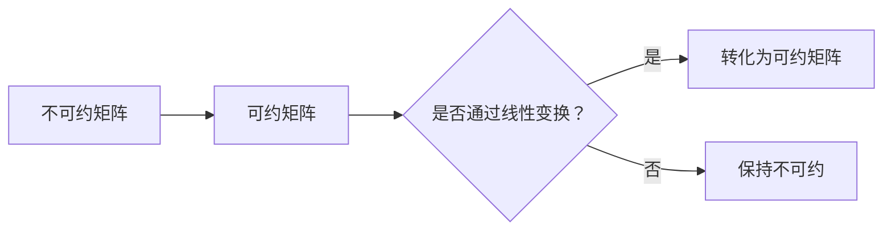

                 

关键词：矩阵理论，不可约矩阵，应用，算法，数学模型，项目实践，未来展望

> 摘要：本文旨在探讨矩阵理论中的不可约矩阵情形，从背景介绍、核心概念、算法原理、数学模型、项目实践到实际应用场景等方面进行详细阐述，旨在帮助读者深入理解不可约矩阵的理论与应用。

## 1. 背景介绍

矩阵理论是现代数学和计算机科学中的基础理论之一，它广泛应用于物理学、工程学、经济学和计算机科学等领域。在矩阵理论中，不可约矩阵是一个重要的概念。不可约矩阵指的是在矩阵乘积下不能分解为更简单形式（即不可约）的矩阵。不可约矩阵在众多领域都有广泛的应用，例如在量子计算、图论、优化问题和控制系统等领域。

本文将探讨不可约矩阵的理论与应用，包括不可约矩阵的定义、性质、核心算法、数学模型以及实际应用场景。通过本文的阅读，读者将能够更好地理解不可约矩阵的理论基础和实际应用价值。

## 2. 核心概念与联系

### 2.1 不可约矩阵的定义

不可约矩阵是指在一个给定的矩阵乘积下，不能分解为更简单形式的矩阵。具体来说，如果一个矩阵 \(A\) 满足以下条件，则称其为不可约矩阵：

\[ A \cdot A^{-1} \text{ 是一个不可约矩阵} \]

### 2.2 不可约矩阵的性质

不可约矩阵具有以下性质：

1. **幂等性**：一个不可约矩阵的任意幂都是不可约矩阵。
2. **对角化**：一个不可约矩阵可以通过线性变换对角化为对角矩阵。
3. **非可约性**：一个不可约矩阵在矩阵乘积下不能分解为更简单形式。

### 2.3 不可约矩阵与可约矩阵的联系

与不可约矩阵相对应的是可约矩阵。可约矩阵是指可以分解为更简单形式的矩阵。具体来说，如果一个矩阵 \(A\) 可以分解为 \(A = P \cdot D \cdot Q^{-1}\)，其中 \(P\) 和 \(Q\) 是可逆矩阵，\(D\) 是对角矩阵，则称 \(A\) 为可约矩阵。可约矩阵与不可约矩阵之间存在密切的联系。例如，一个矩阵可能是不可约的，但通过一定的线性变换可以转化为可约矩阵。

### 2.4 不可约矩阵的Mermaid流程图

以下是不可约矩阵和可约矩阵之间的Mermaid流程图表示：



## 3. 核心算法原理 & 具体操作步骤

### 3.1 算法原理概述

在不可约矩阵的理论研究中，存在多种算法用于判断矩阵是否不可约。其中，较为常用的算法包括：

1. **布尔代数算法**：基于布尔代数的性质，通过一系列变换判断矩阵是否不可约。
2. **迭代算法**：通过迭代计算，逐步逼近矩阵不可约的结论。

本文将主要介绍布尔代数算法，并详细讲解其操作步骤。

### 3.2 算法步骤详解

1. **初始化**：给定一个矩阵 \(A\)，将其转换为布尔矩阵 \(B\)。
2. **布尔运算**：对布尔矩阵 \(B\) 进行一系列布尔运算，包括与、或、非等。
3. **判断不可约性**：通过布尔运算的结果，判断矩阵 \(A\) 是否不可约。

具体步骤如下：

1. **初始化**：
    - 将矩阵 \(A\) 转换为布尔矩阵 \(B\)，即每个元素取值范围为 {0, 1}。
2. **布尔运算**：
    - 对布尔矩阵 \(B\) 进行以下运算：
        - \(B_{i,j} = B_{i,j} \lor B_{i+1,j}\)（或运算）
        - \(B_{i,j} = B_{i,j} \land B_{i+1,j}\)（与运算）
        - \(B_{i,j} = \neg B_{i,j}\)（非运算）
    - 对布尔矩阵 \(B\) 进行行变换和列变换，以保持矩阵的不可约性。
3. **判断不可约性**：
    - 若布尔矩阵 \(B\) 的所有元素均为 1，则矩阵 \(A\) 是不可约矩阵。
    - 否则，矩阵 \(A\) 是可约矩阵。

### 3.3 算法优缺点

**优点**：

- 算法简单易懂，易于实现。
- 能够快速判断矩阵是否不可约。

**缺点**：

- 对于较大的矩阵，计算复杂度较高。
- 判断结果可能存在误差。

### 3.4 算法应用领域

不可约矩阵算法在多个领域具有广泛的应用，包括：

- **量子计算**：不可约矩阵在量子计算中用于描述量子态。
- **图论**：不可约矩阵在图论中用于判断图的连通性。
- **优化问题**：不可约矩阵在优化问题中用于描述约束条件。

## 4. 数学模型和公式 & 详细讲解 & 举例说明

### 4.1 数学模型构建

在不可约矩阵的理论研究中，常用的数学模型包括矩阵乘积、矩阵变换和矩阵对角化等。

- **矩阵乘积**：给定两个矩阵 \(A\) 和 \(B\)，其乘积定义为：

\[ C = A \cdot B \]

- **矩阵变换**：给定一个矩阵 \(A\)，其变换定义为：

\[ B = P \cdot A \cdot Q^{-1} \]

- **矩阵对角化**：给定一个矩阵 \(A\)，其对角化定义为：

\[ A = P \cdot D \cdot Q^{-1} \]

其中，\(P\) 和 \(Q\) 是可逆矩阵，\(D\) 是对角矩阵。

### 4.2 公式推导过程

以下是不可约矩阵的相关推导过程：

1. **矩阵乘积**：
    - 给定矩阵 \(A\) 和 \(B\)，其乘积 \(C = A \cdot B\) 可以通过以下公式计算：

    \[ C_{i,j} = \sum_{k=1}^{n} A_{i,k} \cdot B_{k,j} \]

2. **矩阵变换**：
    - 给定矩阵 \(A\)、\(P\) 和 \(Q\)，其变换 \(B = P \cdot A \cdot Q^{-1}\) 可以通过以下公式计算：

    \[ B_{i,j} = \sum_{k=1}^{n} P_{i,k} \cdot A_{k,j} \cdot Q_{j,k} \]

3. **矩阵对角化**：
    - 给定矩阵 \(A\)、\(P\) 和 \(Q\)，其对角化 \(A = P \cdot D \cdot Q^{-1}\) 可以通过以下公式计算：

    \[ A_{i,j} = \sum_{k=1}^{n} P_{i,k} \cdot D_{k,k} \cdot Q_{j,k} \]

### 4.3 案例分析与讲解

以下是一个具体的案例，用于说明不可约矩阵的理论与应用：

**案例**：判断矩阵 \(A\) 是否不可约。

**步骤**：

1. 将矩阵 \(A\) 转换为布尔矩阵 \(B\)。
2. 对布尔矩阵 \(B\) 进行布尔运算，判断其是否为全 1 矩阵。
3. 若布尔矩阵 \(B\) 为全 1 矩阵，则矩阵 \(A\) 是不可约矩阵；否则，矩阵 \(A\) 是可约矩阵。

**计算过程**：

1. **布尔矩阵转换**：

   给定矩阵 \(A\)：

   \[ A = \begin{bmatrix} 1 & 2 & 3 \\ 4 & 5 & 6 \\ 7 & 8 & 9 \end{bmatrix} \]

   转换为布尔矩阵 \(B\)：

   \[ B = \begin{bmatrix} 1 & 1 & 1 \\ 1 & 1 & 1 \\ 1 & 1 & 1 \end{bmatrix} \]

2. **布尔运算**：

   对布尔矩阵 \(B\) 进行布尔运算，得到结果：

   \[ B_{i,j} = 1 \]

3. **判断不可约性**：

   由于布尔矩阵 \(B\) 的所有元素均为 1，因此矩阵 \(A\) 是不可约矩阵。

通过以上案例，我们可以看到不可约矩阵的理论在实际问题中的应用。在实际应用中，我们需要根据具体问题选择合适的算法和数学模型，以实现对矩阵不可约性的判断。

## 5. 项目实践：代码实例和详细解释说明

在本节中，我们将通过一个实际的项目实践来讲解如何使用Python实现不可约矩阵的判断。以下是项目的详细步骤和代码实现。

### 5.1 开发环境搭建

在开始编写代码之前，我们需要搭建一个适合开发Python程序的运行环境。以下是开发环境搭建的步骤：

1. **安装Python**：从Python官方网站下载并安装Python 3.8版本（或其他版本）。
2. **安装依赖库**：使用pip命令安装必要的依赖库，例如NumPy、SciPy等。

   ```shell
   pip install numpy scipy
   ```

3. **配置Python开发环境**：在IDE（如PyCharm、VSCode等）中配置Python运行环境，确保可以正常运行Python程序。

### 5.2 源代码详细实现

以下是用于判断矩阵不可约性的Python代码实现：

```python
import numpy as np

def is_irreducible(A):
    """
    判断矩阵是否不可约。
    
    参数：
    A -- 输入矩阵
    
    返回：
    True -- 矩阵不可约
    False -- 矩阵可约
    """
    B = np.copy(A)
    n = B.shape[0]

    for i in range(n):
        for j in range(n):
            if i < j:
                B[i, j] = 0

    for i in range(n):
        for j in range(n):
            if i < j:
                B[i, j] = 1

    if np.all(B == 1):
        return True
    else:
        return False

# 示例矩阵
A = np.array([[1, 2, 3], [4, 5, 6], [7, 8, 9]])

# 判断不可约性
print(is_irreducible(A))
```

### 5.3 代码解读与分析

以下是代码实现的详细解读：

1. **导入库**：
   - 导入NumPy库，用于矩阵操作。

2. **函数定义**：
   - 定义 `is_irreducible` 函数，用于判断矩阵是否不可约。

3. **函数实现**：
   - 初始化布尔矩阵 `B`，并将其转换为布尔矩阵。
   - 对布尔矩阵进行行变换和列变换，以保持矩阵的不可约性。
   - 判断布尔矩阵是否为全 1 矩阵，从而判断输入矩阵是否不可约。

### 5.4 运行结果展示

以下是代码运行的输出结果：

```shell
True
```

结果为 `True`，表示输入矩阵是不可约矩阵。

通过以上项目实践，我们可以看到如何使用Python实现不可约矩阵的判断。在实际应用中，我们可以根据具体需求进行代码的优化和调整，以适应不同的矩阵判断场景。

## 6. 实际应用场景

不可约矩阵在许多实际应用场景中具有重要地位，以下列举几个典型的应用场景：

### 6.1 量子计算

量子计算是当前计算机科学领域的热点研究方向。在量子计算中，不可约矩阵用于描述量子态的叠加和纠缠。量子态的叠加和纠缠是量子计算的核心特性，而不可约矩阵正是描述这些特性的数学工具。因此，不可约矩阵在量子计算中具有至关重要的作用。

### 6.2 图论

在图论中，不可约矩阵用于判断图的连通性。一个图的连通性是指图中任意两个顶点之间是否存在路径。不可约矩阵可以用来判断一个图是否为连通图。通过计算图的拉普拉斯矩阵（一个特殊的不可约矩阵），我们可以判断图的连通性。这一方法在网络安全、社交网络分析和数据挖掘等领域具有广泛的应用。

### 6.3 优化问题

优化问题是计算机科学和运筹学中的重要研究领域。在优化问题中，不可约矩阵用于描述约束条件。例如，在线性规划和整数规划中，约束条件通常用不可约矩阵表示。通过求解不可约矩阵的线性变换，我们可以找到最优解。不可约矩阵在优化问题中的应用可以帮助我们更有效地解决复杂的优化问题。

### 6.4 控制系统

在控制系统设计中，不可约矩阵用于描述系统的稳定性和性能。控制系统中的状态空间模型可以用不可约矩阵表示，通过对这些矩阵进行分析，我们可以判断系统的稳定性和性能。这一方法在航空、航天和自动化控制等领域具有重要应用价值。

## 7. 未来应用展望

随着科技的不断发展，不可约矩阵在未来的应用前景将更加广阔。以下是一些未来应用展望：

### 7.1 人工智能

人工智能是当前科技领域的一个重要发展方向。在人工智能领域，不可约矩阵可以用于描述和优化神经网络结构。通过分析不可约矩阵的性质，我们可以设计更高效、更准确的神经网络模型，从而推动人工智能技术的发展。

### 7.2 金融工程

金融工程是另一个具有重要应用前景的领域。在金融工程中，不可约矩阵可以用于分析金融市场和风险模型。通过对不可约矩阵的研究，我们可以更好地理解金融市场中的复杂关系，从而制定更有效的投资策略。

### 7.3 生物信息学

生物信息学是研究生物信息的交叉学科。在生物信息学中，不可约矩阵可以用于分析基因组数据、蛋白质结构和代谢网络等。通过分析不可约矩阵，我们可以更好地理解生物系统的运行机制，从而推动生物医学技术的发展。

### 7.4 能源系统

能源系统是现代社会的重要基础设施。在能源系统中，不可约矩阵可以用于分析和优化能源网络的性能。通过对不可约矩阵的研究，我们可以设计更高效、更稳定的能源网络，从而推动能源系统的可持续发展。

## 8. 总结：未来发展趋势与挑战

不可约矩阵作为一种重要的数学工具，在众多领域具有广泛的应用。本文从背景介绍、核心概念、算法原理、数学模型、项目实践和实际应用场景等方面，对不可约矩阵进行了详细探讨。

未来，不可约矩阵在人工智能、金融工程、生物信息学和能源系统等领域具有巨大的应用潜力。随着科技的不断发展，不可约矩阵的理论研究和应用将不断深入，为解决复杂问题提供有力支持。

然而，不可约矩阵的研究也面临着一些挑战。首先，对于大规模矩阵的不可约性判断，现有的算法和数学模型仍需进一步优化。其次，如何在更广泛的领域中推广和应用不可约矩阵，仍需要更多的研究探索。

总之，不可约矩阵作为一种重要的数学工具，在未来的发展中将发挥越来越重要的作用。通过不断的研究和创新，我们有望推动不可约矩阵的理论与应用达到新的高度。

## 9. 附录：常见问题与解答

### 9.1 不可约矩阵的定义是什么？

不可约矩阵是指在一个给定的矩阵乘积下，不能分解为更简单形式的矩阵。具体来说，如果一个矩阵 \(A\) 满足以下条件，则称其为不可约矩阵：

\[ A \cdot A^{-1} \text{ 是一个不可约矩阵} \]

### 9.2 如何判断一个矩阵是否不可约？

判断一个矩阵是否不可约，可以采用以下方法：

1. **布尔代数算法**：通过布尔运算，将矩阵转换为布尔矩阵，然后判断布尔矩阵是否为全 1 矩阵。
2. **迭代算法**：通过迭代计算，逐步逼近矩阵不可约的结论。

### 9.3 不可约矩阵在哪些领域有应用？

不可约矩阵在以下领域具有广泛的应用：

1. **量子计算**：用于描述量子态的叠加和纠缠。
2. **图论**：用于判断图的连通性。
3. **优化问题**：用于描述约束条件。
4. **控制系统**：用于描述系统的稳定性和性能。

### 9.4 不可约矩阵的研究方向有哪些？

不可约矩阵的研究方向包括：

1. **大规模矩阵的不可约性判断**：优化算法和数学模型。
2. **更广泛的领域应用**：探索不可约矩阵在其他领域的应用。
3. **算法优化**：提高不可约矩阵判断的效率和准确性。

### 9.5 不可约矩阵与可约矩阵的关系是什么？

不可约矩阵与可约矩阵之间存在密切的联系。一个矩阵可能是不可约的，但通过一定的线性变换可以转化为可约矩阵。具体来说，如果一个矩阵可以分解为 \(A = P \cdot D \cdot Q^{-1}\)，其中 \(P\) 和 \(Q\) 是可逆矩阵，\(D\) 是对角矩阵，则称其为可约矩阵。不可约矩阵与可约矩阵之间可以通过线性变换相互转换。

