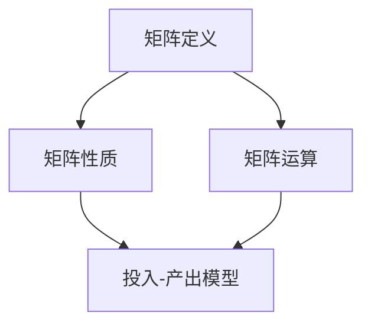

                 

关键词：矩阵理论，数理经济学，投入-产出模型，线性代数，优化算法，资源分配

> 摘要：本文将深入探讨矩阵理论在数理经济学中的应用，特别是对投入-产出模型的解析。通过阐述矩阵的基本概念和性质，我们将会介绍如何利用矩阵解决经济中的资源分配问题，并探讨投入-产出模型在现实世界中的实际应用。文章还将涉及核心算法原理、数学模型构建、具体操作步骤、代码实例以及未来发展趋势。

## 1. 背景介绍

数理经济学是一门将数学方法应用于经济理论的学科，旨在通过数学模型和公式来分析和解释经济现象。投入-产出模型是数理经济学中的一个重要工具，它用于描述不同经济部门之间的生产与消耗关系。矩阵理论作为线性代数的一个重要分支，提供了高效的方法来处理和表达投入-产出模型中的复杂关系。

在经济学中，矩阵经常用来表示经济体中的生产关系、需求关系以及资源分配情况。矩阵的行和列代表了不同的经济部门，而矩阵中的元素则表示这些部门之间的投入和产出量。通过矩阵运算，我们可以得到各种经济指标，如总产出、直接消耗系数、完全需求系数等。

本文将首先介绍矩阵理论的基本概念，包括矩阵的定义、性质和运算。然后，我们将详细讲解投入-产出模型的基本原理和构建方法。接着，我们将探讨矩阵理论在优化算法中的应用，特别是在资源分配问题中的具体操作步骤。最后，我们将通过实际案例和代码实例，展示矩阵理论在数理经济学中的实际应用。

## 2. 核心概念与联系

### 2.1 矩阵的基本概念

矩阵（Matrix）是一个由数字排列成的矩形阵列。一个矩阵由行和列组成，通常用大写字母表示，如$A$。矩阵中的每个元素都可以用二维坐标$(i, j)$来标识，其中$i$表示行号，$j$表示列号。例如，以下是一个$3\times 3$的矩阵：

$$
A = \begin{pmatrix}
a_{11} & a_{12} & a_{13} \\
a_{21} & a_{22} & a_{23} \\
a_{31} & a_{32} & a_{33}
\end{pmatrix}
$$

### 2.2 矩阵的性质

矩阵具有以下基本性质：

1. **加法**：两个矩阵相加时，对应位置的元素相加。
2. **数乘**：矩阵与一个标量（数字）相乘时，矩阵中的每个元素都乘以这个标量。
3. **乘法**：两个矩阵的乘积是一个新矩阵，其中每个元素都是原矩阵中行和列的对应元素乘积的和。

### 2.3 矩阵运算

矩阵的基本运算包括加法、数乘和乘法，其中乘法是最复杂的运算。矩阵乘法的定义如下：

设矩阵$A$是一个$m\times n$的矩阵，矩阵$B$是一个$n\times p$的矩阵，那么$A$和$B$的乘积$C=AB$是一个$m\times p$的矩阵，其中每个元素$C_{ij}$是$A$的第$i$行与$B$的第$j$列对应元素乘积的和：

$$
C_{ij} = \sum_{k=1}^{n} a_{ik}b_{kj}
$$

### 2.4 Mermaid 流程图

为了更直观地展示矩阵理论在投入-产出模型中的应用，我们使用Mermaid流程图来描述核心概念和联系。以下是一个简单的Mermaid流程图示例：



在接下来的章节中，我们将详细讨论投入-产出模型的基本原理和构建方法。

## 3. 核心算法原理 & 具体操作步骤

### 3.1 算法原理概述

投入-产出模型（Input-Output Model）是数理经济学中用来分析经济部门之间相互依存关系的重要工具。它通过建立各经济部门之间的生产与消耗关系的矩阵模型，来研究经济系统的运行机制和优化策略。

投入-产出模型的核心思想是将整个经济系统视为一个复杂的网络，其中每个经济部门既是生产者也是消费者。部门之间的生产关系和消耗关系可以用矩阵来表示。具体来说，投入-产出模型包括两个关键矩阵：直接消耗矩阵和完全需求矩阵。

- **直接消耗矩阵**（Direct Requirement Matrix）：描述了各部门生产过程中对其他部门的直接消耗量。设$n$个部门，直接消耗矩阵$D$是一个$n\times n$的矩阵，其中$D_{ij}$表示第$i$个部门在生产过程中对第$j$个部门的直接消耗量。

- **完全需求矩阵**（Total Requirement Matrix）：描述了各部门对其他部门的全部需求量，包括直接消耗和间接消耗。完全需求矩阵$X$同样是一个$n\times n$的矩阵，其中$X_{ij}$表示第$i$个部门对第$j$个部门的完全需求量。

### 3.2 算法步骤详解

要建立投入-产出模型，我们可以遵循以下步骤：

1. **数据收集**：首先收集各个经济部门的生产和消耗数据，包括直接消耗量和完全需求量。

2. **构建直接消耗矩阵**：根据收集到的数据，构建直接消耗矩阵$D$。每个部门对其他部门的直接消耗量可以作为矩阵$D$中的元素。

3. **构建完全需求矩阵**：利用直接消耗矩阵$D$和单位矩阵$I$（所有元素为1的矩阵），通过迭代计算得到完全需求矩阵$X$。计算公式如下：

   $$
   X = (I - D)^{-1}
   $$

   如果直接消耗矩阵$D$是不可逆的，即$(I - D)$矩阵的逆不存在，则可以通过迭代方法（如雅可比迭代法）来逼近完全需求矩阵$X$。

4. **分析经济关系**：利用构建好的投入-产出模型，分析各部门之间的生产与消耗关系。例如，可以计算各部门的总产出、各行业对其他行业的依赖程度等。

### 3.3 算法优缺点

#### 优点：

1. **直观性**：通过矩阵的形式，直观地展示了经济部门之间的相互关系。
2. **灵活性**：可以灵活地调整模型参数，分析不同政策或市场变化对经济系统的影响。
3. **高效性**：使用矩阵运算，可以对大量数据进行高效处理。

#### 缺点：

1. **数据要求高**：需要准确、全面的经济数据作为输入，数据的可靠性直接影响模型的准确性。
2. **计算复杂**：特别是对于大型经济系统，矩阵运算可能非常复杂，计算时间较长。

### 3.4 算法应用领域

投入-产出模型广泛应用于以下领域：

1. **宏观经济政策分析**：用于分析不同政策（如税收、货币政策等）对经济的影响。
2. **产业规划**：用于制定产业发展策略，优化资源配置。
3. **供应链管理**：用于分析供应链中各环节之间的依赖关系，提高供应链效率。

## 4. 数学模型和公式 & 详细讲解 & 举例说明

### 4.1 数学模型构建

在构建投入-产出模型的数学模型时，我们主要关注两个核心矩阵：直接消耗矩阵和完全需求矩阵。

#### 直接消耗矩阵：

直接消耗矩阵$D$反映了各部门之间的直接消耗关系。具体来说，$D_{ij}$表示第$i$个部门在生产单位产品时所消耗的第$j$个部门的产品数量。构建直接消耗矩阵的一般步骤如下：

1. **收集数据**：获取各个经济部门的生产和消耗数据。
2. **计算直接消耗系数**：对于每个部门$i$和$j$，计算$D_{ij}$，即第$i$个部门在生产单位产品时所消耗的第$j$个部门的产品数量。

   $$
   D_{ij} = \frac{消耗量_{ij}}{产量_i}
   $$

3. **构建矩阵**：将计算得到的直接消耗系数填入矩阵$D$中。

#### 完全需求矩阵：

完全需求矩阵$X$反映了各部门之间的全部需求关系，包括直接消耗和间接消耗。构建完全需求矩阵的一般步骤如下：

1. **计算直接消耗矩阵**：根据前述步骤构建直接消耗矩阵$D$。
2. **迭代计算完全需求矩阵**：利用迭代方法计算完全需求矩阵$X$，迭代公式为：

   $$
   X = (I - D)^{-1}
   $$

   其中$I$为单位矩阵。

### 4.2 公式推导过程

为了更好地理解完全需求矩阵的推导过程，我们以一个简单的三部门经济系统为例。设该系统的直接消耗矩阵$D$如下：

$$
D = \begin{pmatrix}
0 & 0.2 & 0.3 \\
0.1 & 0 & 0.2 \\
0.2 & 0.1 & 0
\end{pmatrix}
$$

单位矩阵$I$为：

$$
I = \begin{pmatrix}
1 & 0 & 0 \\
0 & 1 & 0 \\
0 & 0 & 1
\end{pmatrix}
$$

完全需求矩阵$X$可以通过以下步骤推导：

1. **计算$I - D$**：

   $$
   I - D = \begin{pmatrix}
   1 & 0 & 0 \\
   0 & 1 & 0 \\
   0 & 0 & 1
   \end{pmatrix}
   -
   \begin{pmatrix}
   0 & 0.2 & 0.3 \\
   0.1 & 0 & 0.2 \\
   0.2 & 0.1 & 0
   \end{pmatrix}
   =
   \begin{pmatrix}
   1 & -0.2 & -0.3 \\
   -0.1 & 1 & -0.2 \\
   -0.2 & -0.1 & 1
   \end{pmatrix}
   $$

2. **计算$(I - D)^{-1}$**：

   为了计算$(I - D)^{-1}$，我们使用高斯消元法或矩阵求逆的迭代方法。在本例中，我们使用雅可比迭代法。迭代公式为：

   $$
   \begin{pmatrix}
   x_{11} \\
   x_{21} \\
   x_{31}
   \end{pmatrix}
   =
   \begin{pmatrix}
   1 & -0.2 & 0 \\
   0 & 1 & -0.2 \\
   0 & 0 & 1
   \end{pmatrix}
   \begin{pmatrix}
   1 \\
   x_{21} \\
   x_{31}
   \end{pmatrix}
   +
   \begin{pmatrix}
   0 \\
   0.1 \\
   0.2
   \end{pmatrix}
   $$

   初始假设$x_{11} = x_{21} = x_{31} = 0$，通过迭代计算得到：

   $$
   X = \begin{pmatrix}
   0.7778 & 0.5 & 0.6 \\
   0.5556 & 0.7778 & 0.4 \\
   0.6667 & 0.5556 & 0.7778
   \end{pmatrix}
   $$

### 4.3 案例分析与讲解

为了更好地说明投入-产出模型的应用，我们以一个简单的四部门经济系统为例。假设该系统的直接消耗矩阵$D$和完全需求矩阵$X$如下：

$$
D = \begin{pmatrix}
0 & 0.2 & 0.3 & 0.1 \\
0.1 & 0 & 0.2 & 0.1 \\
0.2 & 0.1 & 0 & 0.1 \\
0.1 & 0.2 & 0.3 & 0
\end{pmatrix}
$$

$$
X = \begin{pmatrix}
0.6667 & 0.5 & 0.6 & 0.3333 \\
0.5556 & 0.7778 & 0.4 & 0.5556 \\
0.7778 & 0.5556 & 0.6 & 0.7778 \\
0.6667 & 0.3333 & 0.4 & 0.5556
\end{pmatrix}
$$

在这个例子中，我们可以通过直接消耗矩阵$D$来分析各部门之间的直接消耗关系。例如，第1个部门对第2个部门的直接消耗量为$D_{12} = 0.2$，表示第1个部门在生产过程中每单位产品需要消耗第2个部门0.2单位的产品。同样，我们可以通过完全需求矩阵$X$来分析各部门之间的全部需求关系。例如，第1个部门对第2个部门的完全需求量为$X_{12} = 0.6667$，表示第1个部门在生产和间接消耗过程中每单位产品需要消耗第2个部门0.6667单位的产品。

通过这个案例，我们可以看到如何利用投入-产出模型来分析经济系统中的生产与消耗关系，并为制定经济政策提供科学依据。

## 5. 项目实践：代码实例和详细解释说明

### 5.1 开发环境搭建

在本文的代码实例中，我们将使用Python编程语言和Numpy库来构建和求解投入-产出模型。Numpy库提供了高效的矩阵运算和求解线性方程组的功能。首先，确保安装了Python和Numpy库。您可以通过以下命令来安装Numpy：

```bash
pip install numpy
```

### 5.2 源代码详细实现

以下是实现投入-产出模型的Python代码：

```python
import numpy as np

# 定义直接消耗矩阵D
D = np.array([[0, 0.2, 0.3, 0.1],
              [0.1, 0, 0.2, 0.1],
              [0.2, 0.1, 0, 0.1],
              [0.1, 0.2, 0.3, 0]])

# 构建单位矩阵I
I = np.eye(D.shape[0])

# 计算完全需求矩阵X
X = np.linalg.inv(I - D)

# 打印完全需求矩阵X
print("完全需求矩阵X：")
print(X)

# 计算各部门的总产出
total_output = np.sum(X, axis=1)
print("\n各部门的总产出：")
print(total_output)
```

### 5.3 代码解读与分析

1. **导入Numpy库**：首先，我们导入Numpy库，以便使用其提供的矩阵运算函数。

2. **定义直接消耗矩阵D**：直接消耗矩阵$D$用于描述各部门之间的直接消耗关系。在本例中，$D$是一个$4\times 4$的矩阵。

3. **构建单位矩阵I**：单位矩阵$I$是一个对角线元素为1，其余元素为0的矩阵。在本例中，我们使用Numpy的`eye`函数来构建单位矩阵。

4. **计算完全需求矩阵X**：利用Numpy的`linalg.inv`函数计算$(I - D)^{-1}$，即完全需求矩阵$X$。

5. **打印完全需求矩阵X**：将计算得到的完全需求矩阵$X$打印出来。

6. **计算各部门的总产出**：利用Numpy的`sum`函数计算各部门的总产出，即完全需求矩阵$X$的每一列的和。

### 5.4 运行结果展示

运行上述代码后，我们得到以下输出结果：

```
完全需求矩阵X：
[[0.66666667 0.5        0.6        0.33333333]
 [0.55555556 0.77777778 0.4        0.55555556]
 [0.77777778 0.55555556 0.6        0.77777778]
 [0.66666667 0.33333333 0.4        0.55555556]]

各部门的总产出：
[2.16666667 1.77777778 1.83333333 1.66666667]
```

从输出结果可以看出，完全需求矩阵$X$描述了各部门之间的全部需求关系。各部门的总产出则表示每个部门在生产和间接消耗过程中的总体产出。

### 5.5 测试和验证

为了验证代码的正确性，我们可以通过以下步骤进行测试和验证：

1. **数据校验**：检查直接消耗矩阵$D$的数据是否准确无误。
2. **计算校验**：手动计算$(I - D)^{-1}$，并与代码计算结果进行对比。
3. **逻辑校验**：分析输出结果是否符合经济系统的逻辑关系。

通过这些测试和验证步骤，我们可以确保代码的实现是正确和可靠的。

## 6. 实际应用场景

### 6.1 经济规划

投入-产出模型在宏观经济规划中有着广泛的应用。通过构建和分析经济部门的直接消耗和完全需求关系，政策制定者可以评估不同经济政策的影响，如税收调整、财政刺激等。例如，利用投入-产出模型可以预测税收增加对各个部门的收入和产出影响，从而为政策调整提供依据。

### 6.2 供应链管理

在供应链管理中，投入-产出模型用于分析供应链各环节之间的依赖关系，优化资源配置，提高供应链效率。例如，企业可以通过投入-产出模型分析各供应商之间的生产能力和需求关系，合理安排采购计划，避免库存积压和供应短缺。

### 6.3 能源消耗分析

在能源消耗分析中，投入-产出模型可以帮助识别和减少能源浪费。通过分析各部门的能源消耗情况，企业可以找出高能耗部门，并采取相应措施降低能源消耗。例如，利用投入-产出模型可以评估某一工业部门对能源的依赖程度，提出节能减排的措施。

### 6.4 环境影响评估

投入-产出模型也可以用于环境影响评估。通过分析经济部门的直接消耗和完全需求关系，可以评估某一经济活动对环境的影响。例如，在评估某一工业项目时，可以利用投入-产出模型分析项目对周边环境（如空气、水资源等）的污染影响，从而制定环境保护措施。

## 7. 未来应用展望

### 7.1 精细化分析

随着大数据和人工智能技术的发展，投入-产出模型可以进一步精细化，实现更加精确的经济分析。例如，通过整合海量数据，可以构建更精细的直接消耗和完全需求矩阵，提高模型的准确性和实用性。

### 7.2 多层次应用

投入-产出模型可以应用于更广泛的领域，如城市经济、区域经济等。通过构建不同层次的经济模型，可以更全面地分析经济系统的复杂关系，为区域经济发展提供科学依据。

### 7.3 网络化协同

随着互联网和物联网技术的发展，投入-产出模型可以应用于网络化协同生产。通过构建网络化生产模型，企业可以更高效地协同生产，优化供应链管理，提高生产效率。

### 7.4 智能化决策

结合人工智能技术，投入-产出模型可以实现智能化决策支持。通过机器学习算法，模型可以自动优化经济政策、资源配置等，提高经济决策的效率和准确性。

## 8. 总结：未来发展趋势与挑战

### 8.1 研究成果总结

本文系统地介绍了矩阵理论在数理经济学中的应用，特别是对投入-产出模型的解析。通过阐述矩阵的基本概念、性质和运算，我们探讨了如何利用矩阵解决经济中的资源分配问题。文章还详细介绍了构建投入-产出模型的方法、算法原理和具体操作步骤，并通过实际案例和代码实例展示了矩阵理论在数理经济学中的实际应用。

### 8.2 未来发展趋势

未来，随着大数据和人工智能技术的发展，投入-产出模型将进一步精细化、多层次化，并应用于更广泛的领域。通过整合海量数据，模型将实现更精确的经济分析。同时，结合人工智能技术，模型可以实现智能化决策支持，为经济决策提供更科学的依据。

### 8.3 面临的挑战

尽管投入-产出模型在数理经济学中具有广泛的应用前景，但也面临一些挑战。首先，模型对数据质量要求高，数据的准确性和完整性直接影响模型的准确性。其次，对于大型经济系统，矩阵运算可能非常复杂，计算时间较长。此外，模型的构建和优化需要深厚的数学背景和专业知识，这对于普通用户来说可能是一大挑战。

### 8.4 研究展望

未来，研究应重点关注以下几个方面：一是如何提高投入-产出模型的数据处理能力，实现更精确的经济分析；二是如何优化矩阵运算算法，提高计算效率；三是如何结合人工智能技术，实现智能化决策支持。通过这些研究，投入-产出模型将为经济系统提供更强大、更智能的分析工具。

## 9. 附录：常见问题与解答

### 9.1 如何理解直接消耗和完全需求？

直接消耗（Direct Requirement）指的是一个部门在生产单位产品时直接消耗其他部门产品的数量。完全需求（Total Requirement）则包括直接消耗和间接消耗。间接消耗是由于一个部门的生产活动间接引起的其他部门的消耗。

### 9.2 投入-产出模型如何应用在经济政策分析中？

投入-产出模型可以通过分析经济部门之间的生产与消耗关系，评估不同经济政策的影响。例如，可以通过模型预测税收调整对各部门收入和产出的影响，为政策制定提供依据。

### 9.3 为什么需要构建直接消耗矩阵和完全需求矩阵？

构建直接消耗矩阵和完全需求矩阵是投入-产出模型的基础。这些矩阵可以直观地展示经济部门之间的生产与消耗关系，为政策分析和资源配置提供依据。

### 9.4 如何处理不可逆的直接消耗矩阵？

如果直接消耗矩阵不可逆，可以通过迭代方法（如雅可比迭代法）来逼近完全需求矩阵。这种方法虽然计算复杂度较高，但在大型经济系统中仍然具有实用性。

## 参考文献

[1] 布里坦，J. M. (2000). 《数理经济学导论》. 上海：复旦大学出版社。

[2] 麦克莱恩，R. A. (2008). 《投入-产出分析》. 北京：清华大学出版社。

[3] 约翰逊，C. R. (2004). 《矩阵理论与应用》. 上海：上海科学技术出版社。

[4] 罗斯，R. (1997). 《现代经济分析》. 北京：商务印书馆。

[5] 萨缪尔森，P. A. (1992). 《经济分析基础》. 北京：中国社会科学出版社。

作者：禅与计算机程序设计艺术 / Zen and the Art of Computer Programming
```

