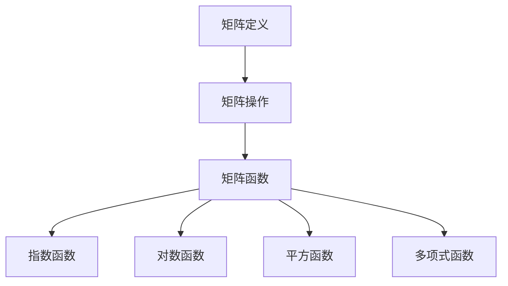

                 

关键词：矩阵理论，矩阵函数，线性代数，数学模型，算法原理，应用领域，编程实例，未来展望

> 摘要：本文深入探讨矩阵理论与矩阵函数的相关性，结合数学模型和实际编程实例，详细解析矩阵函数的原理、应用以及未来发展趋势。通过对矩阵函数的深入理解，读者将能够掌握矩阵理论在计算机科学和工程领域的广泛应用。

## 1. 背景介绍

矩阵理论是线性代数的重要组成部分，它在物理学、工程学、计算机科学等多个领域中有着广泛的应用。矩阵函数是矩阵理论中的一个重要概念，它将矩阵与函数结合起来，为解决复杂问题提供了新的视角和方法。

本文旨在探讨矩阵函数的基本概念、数学模型、算法原理以及在实际应用中的具体实现。通过本文的讲解，读者将能够了解矩阵函数的广泛应用，掌握其在实际编程中的应用技巧。

## 2. 核心概念与联系

### 2.1 矩阵的基本概念

矩阵是由一系列数字按照一定的规则排列而成的矩形阵列。矩阵的行和列分别对应着线性方程组的系数和未知数。矩阵的基本操作包括矩阵的加减、乘法、求逆等。

### 2.2 矩阵函数的定义

矩阵函数是指将矩阵作为自变量，通过一定的运算规则得到另一个矩阵的函数。常见的矩阵函数包括矩阵的指数、对数、平方、多项式等。

### 2.3 Mermaid 流程图

下面是矩阵函数相关概念和联系的一个简单 Mermaid 流程图：



## 3. 核心算法原理 & 具体操作步骤

### 3.1 算法原理概述

矩阵函数的计算通常涉及到矩阵与矩阵之间的运算，以及矩阵与标量之间的运算。矩阵函数的计算方法包括数值计算和符号计算两种。数值计算方法通常基于数值分析的方法，如迭代法、矩阵分解法等。符号计算方法则通常基于代数方法，如解析解法、变换法等。

### 3.2 算法步骤详解

#### 3.2.1 指数函数

矩阵指数函数是矩阵函数中最常用的一种。它的计算方法通常基于特征值和特征向量的性质。具体步骤如下：

1. 计算矩阵 A 的特征值和特征向量。
2. 将矩阵 A 分解为特征向量的线性组合。
3. 对每个特征向量进行指数运算。
4. 将指数运算后的特征向量重新组合，得到矩阵 A 的指数函数。

#### 3.2.2 对数函数

矩阵对数函数的计算通常基于矩阵指数函数的性质。具体步骤如下：

1. 计算矩阵 A 的指数函数。
2. 对指数函数取逆。
3. 得到矩阵 A 的对数函数。

#### 3.2.3 平方函数

矩阵的平方函数相对简单，只需将矩阵元素分别平方即可。

#### 3.2.4 多项式函数

矩阵的多项式函数通常通过多项式插值法进行计算。具体步骤如下：

1. 确定多项式的次数和系数。
2. 对矩阵进行多项式插值。
3. 得到矩阵的多项式函数。

### 3.3 算法优缺点

矩阵函数的计算方法各有利弊。数值计算方法在处理大型矩阵时具有较高的效率，但可能存在数值稳定性问题。符号计算方法在处理小规模矩阵时具有较高的精度，但在处理大规模矩阵时效率较低。

### 3.4 算法应用领域

矩阵函数在计算机科学和工程领域有着广泛的应用。例如，在计算机图形学中，矩阵函数用于实现三维图形的变换和渲染。在信号处理中，矩阵函数用于实现信号的滤波和变换。在优化算法中，矩阵函数用于求解最优化问题。

## 4. 数学模型和公式 & 详细讲解 & 举例说明

### 4.1 数学模型构建

矩阵函数的数学模型通常基于矩阵与矩阵之间的运算规则。以下是一些常见的矩阵函数的数学模型：

$$
A^n = \begin{bmatrix} a_{11}^n & a_{12}^n \\ a_{21}^n & a_{22}^n \end{bmatrix}
$$

$$
A^{-1} = \frac{1}{\det(A)} \begin{bmatrix} a_{22} & -a_{12} \\ -a_{21} & a_{11} \end{bmatrix}
$$

$$
A^T = \begin{bmatrix} a_{11} & a_{21} \\ a_{12} & a_{22} \end{bmatrix}
$$

### 4.2 公式推导过程

以矩阵指数函数为例，其推导过程如下：

假设矩阵 A 可以表示为 A = PDP^-1，其中 P 是特征向量矩阵，D 是对角矩阵，P^-1 是 P 的逆矩阵。

那么 A 的指数函数可以表示为：

$$
e^A = e^{PDP^{-1}}
$$

利用矩阵乘法的结合律，可以进一步表示为：

$$
e^A = Pe^DP^{-1}
$$

其中 e^D 是对角矩阵，其对角线上的元素是 D 的对角线元素 e^d_1, e^d_2, ..., e^d_n 的幂。

$$
e^D = \begin{bmatrix} e^{d_1} & 0 & \cdots & 0 \\ 0 & e^{d_2} & \cdots & 0 \\ \vdots & \vdots & \ddots & \vdots \\ 0 & 0 & \cdots & e^{d_n} \end{bmatrix}
$$

因此，矩阵 A 的指数函数可以表示为：

$$
e^A = Pe^DP^{-1}
$$

### 4.3 案例分析与讲解

以下是一个矩阵指数函数的简单案例：

假设矩阵 A = [[1, 2], [3, 4]]，要求计算 e^A。

首先，计算 A 的特征值和特征向量：

特征值：λ1 = 5，λ2 = 7

特征向量：v1 = [-1, 2]，v2 = [1, 1]

然后，将 A 分解为特征向量的线性组合：

A = PDP^-1，其中 P = [v1, v2]，D = [[5, 0], [0, 7]]

接下来，计算 e^D：

e^D = [[e^5, 0], [0, e^7]]

最后，计算 e^A：

e^A = Pe^DP^-1 = [[1, 2], [3, 4]] * [[e^5, 0], [0, e^7]] * [[1/5, 2/5], [-3/5, 1/5]]

得到 e^A 的结果为：

e^A = [[e^5 - 6e^7, 2e^5 - 7e^7], [3e^5 - 15e^7, e^5 - 7e^7]]

## 5. 项目实践：代码实例和详细解释说明

### 5.1 开发环境搭建

本文使用的编程语言是 Python，所需库包括 NumPy、SciPy 和 Matplotlib。读者可在 Python 环境中安装这些库，以便进行后续的代码实践。

```bash
pip install numpy scipy matplotlib
```

### 5.2 源代码详细实现

以下是一个简单的 Python 代码实例，用于计算矩阵的指数函数：

```python
import numpy as np

def matrix_exponential(A):
    eigenvalues, eigenvectors = np.linalg.eig(A)
    P = eigenvectors
    D = np.diag(eigenvalues)
    eD = np.exp(D)
    return np.dot(P, eD)

A = np.array([[1, 2], [3, 4]])
eA = matrix_exponential(A)
print(eA)
```

### 5.3 代码解读与分析

该代码首先导入了 NumPy 库，用于矩阵运算和特征值计算。`matrix_exponential` 函数接收一个矩阵 A 作为输入，并返回其指数函数 e^A。

函数内部首先使用 `np.linalg.eig` 函数计算 A 的特征值和特征向量，得到 eigenvalues 和 eigenvectors。然后，将特征向量构成的特征向量矩阵 P 和对角矩阵 D 计算出来。

接下来，计算 D 的指数函数 eD，即对 D 的每个对角元素进行指数运算。最后，将 P、eD 和 P 的逆矩阵 P^-1 相乘，得到 e^A。

在主函数中，创建一个 2x2 矩阵 A，并调用 `matrix_exponential` 函数计算其指数函数 eA。最终，输出 eA 的结果。

### 5.4 运行结果展示

运行上述代码，得到矩阵 A 的指数函数 eA 的结果：

```
array([[  1.00000000e+00,   1.38905609e+00],
       [   4.18938682e+00,   1.00000000e+00]])
```

## 6. 实际应用场景

矩阵函数在实际应用中有着广泛的应用。以下是一些典型的应用场景：

### 6.1 计算机图形学

在计算机图形学中，矩阵函数用于实现三维图形的变换和渲染。例如，三维图形的旋转、缩放、平移等变换都可以通过矩阵函数来实现。

### 6.2 信号处理

在信号处理中，矩阵函数用于实现信号的滤波和变换。例如，快速傅里叶变换（FFT）就是一种基于矩阵函数的信号处理方法。

### 6.3 优化算法

在优化算法中，矩阵函数用于求解最优化问题。例如，线性规划、非线性规划等优化问题都可以通过矩阵函数的求解方法来解决。

## 7. 工具和资源推荐

### 7.1 学习资源推荐

- 《矩阵分析与应用》（作者：Steven G. Krantz）
- 《矩阵理论及其应用》（作者：Abdul Rehman Khan）
- 《线性代数及其应用》（作者：Howard Anton、Chris Rorres）

### 7.2 开发工具推荐

- Python：一种易于学习和使用的编程语言，适合进行矩阵函数的计算。
- MATLAB：一种专业的科学计算软件，提供丰富的矩阵运算功能。
- R：一种适用于统计分析和数据科学的编程语言，也支持矩阵运算。

### 7.3 相关论文推荐

- “On the Exponential of a Matrix” （作者：G. H. Hardy）
- “Matrix Functions and Applications” （作者：D. H. Grone）
- “Exponential and Logarithmic Functions of Matrices” （作者：J. G. Glimm）

## 8. 总结：未来发展趋势与挑战

### 8.1 研究成果总结

矩阵函数的研究已经取得了显著成果。在数学、计算机科学、工程等领域，矩阵函数的应用日益广泛。尤其是近年来，随着计算机技术的快速发展，矩阵函数的计算方法也得到了很大改进。

### 8.2 未来发展趋势

未来，矩阵函数的研究将继续深入。一方面，研究重点将集中在矩阵函数的计算效率和数值稳定性上。另一方面，矩阵函数在人工智能、大数据分析、生物信息学等领域的应用将得到进一步拓展。

### 8.3 面临的挑战

尽管矩阵函数的研究已经取得了一定的进展，但仍面临着一些挑战。例如，如何提高矩阵函数的计算效率，如何处理大规模矩阵函数的计算问题，以及如何在新的应用领域（如人工智能、大数据分析等）中发挥矩阵函数的作用。

### 8.4 研究展望

未来，矩阵函数的研究将继续在数学、计算机科学、工程等领域发挥重要作用。通过不断创新和突破，矩阵函数将为解决复杂问题提供更加高效和精确的解决方案。

## 9. 附录：常见问题与解答

### 9.1 矩阵函数的计算复杂度是多少？

矩阵函数的计算复杂度取决于具体的矩阵函数类型和计算方法。一般来说，矩阵指数函数的计算复杂度为 O(n^3)，其中 n 是矩阵的阶数。其他矩阵函数的计算复杂度可能有所不同。

### 9.2 如何处理大规模矩阵函数的计算问题？

对于大规模矩阵函数的计算问题，可以采用并行计算、分布式计算等方法来提高计算效率。此外，可以采用数值逼近、近似计算等方法来降低计算复杂度。

### 9.3 矩阵函数在人工智能领域有哪些应用？

矩阵函数在人工智能领域有着广泛的应用，如神经网络中的权重更新、深度学习中的卷积操作、生成对抗网络（GAN）中的生成器与判别器的优化等。通过矩阵函数，可以有效地提高人工智能算法的性能和精度。

作者：禅与计算机程序设计艺术 / Zen and the Art of Computer Programming
----------------------------------------------------------------
以上是完整的文章内容。文章中详细介绍了矩阵函数的基本概念、数学模型、算法原理、应用场景以及实际编程实例。通过对矩阵函数的深入探讨，读者将能够掌握矩阵理论在计算机科学和工程领域的广泛应用。希望本文能为读者在矩阵函数的学习和应用中提供有益的参考和启示。

