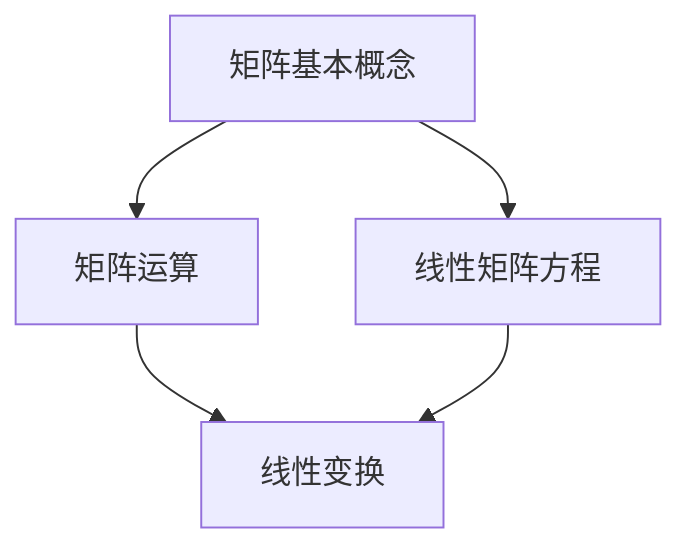

                 

关键词：矩阵理论、线性矩阵方程、数学模型、算法、应用领域、计算机编程、人工智能

> 摘要：本文将深入探讨矩阵理论与线性矩阵方程的相关概念、算法原理以及实际应用。通过对矩阵理论的详细阐述，我们将了解矩阵的基本性质和操作，进一步探讨线性矩阵方程的解法和应用。文章将结合实际项目实例，展示矩阵理论在计算机编程和人工智能领域的广泛应用，并展望其未来发展趋势。

## 1. 背景介绍

矩阵理论作为现代数学和计算机科学的重要分支，已广泛应用于各个领域，如物理学、经济学、工程学和计算机科学等。线性矩阵方程是矩阵理论中的核心内容之一，其研究不仅具有理论意义，更在实际应用中发挥着重要作用。线性矩阵方程的解法涉及到多个学科的知识，如线性代数、数值分析和优化理论等。

本文旨在通过对矩阵理论和线性矩阵方程的深入探讨，帮助读者更好地理解这一领域的基本概念、算法原理和实际应用。文章将分为以下几个部分：首先介绍矩阵理论的基本概念和性质；接着讨论线性矩阵方程的解法；然后通过实际项目实例展示矩阵理论的应用；最后展望矩阵理论在未来的发展趋势。

## 2. 核心概念与联系

### 2.1 矩阵的基本概念

矩阵是一种由数字组成的矩形阵列，可以用来表示线性方程组、线性变换和系统状态等。矩阵的基本概念包括：

- 矩阵的行数和列数：矩阵的行数称为矩阵的阶，列数称为矩阵的维度。
- 矩阵的元素：矩阵中的每个数字称为矩阵的元素。
- 矩阵的加法和乘法：矩阵的加法和乘法是矩阵运算中最基本的操作。

下面是一个2x3的矩阵示例：

$$
A = \begin{bmatrix}
a_{11} & a_{12} & a_{13} \\
a_{21} & a_{22} & a_{23}
\end{bmatrix}
$$

### 2.2 线性矩阵方程

线性矩阵方程是一种包含矩阵和向量的方程，通常表示为：

$$
AX = B
$$

其中，$A$ 是一个 $m \times n$ 的矩阵，$X$ 是一个 $n \times 1$ 的向量，$B$ 是一个 $m \times 1$ 的向量。线性矩阵方程的解法是矩阵理论中的一个重要问题，涉及到多种算法和技巧。

### 2.3 矩阵与线性变换的关系

矩阵与线性变换密切相关。一个线性变换可以将一个向量空间映射到另一个向量空间，而矩阵可以表示这种映射。具体来说，一个 $n \times n$ 的矩阵可以表示一个线性变换 $T$，使得向量 $X$ 被映射到 $T(X)$。

$$
T(X) = AX
$$

这种关系使得矩阵理论在计算机图形学、机器学习和数据科学等领域中有着广泛的应用。

### 2.4 Mermaid 流程图

为了更直观地展示矩阵理论和线性矩阵方程的关系，我们使用 Mermaid 流程图来描述：



## 3. 核心算法原理 & 具体操作步骤

### 3.1 算法原理概述

线性矩阵方程的解法主要有以下几种：

1. **高斯消元法**：通过迭代消除矩阵中的变量，得到方程的解。
2. **奇异值分解**：利用矩阵的奇异值分解，求得方程的近似解。
3. **迭代法**：通过迭代过程逐步逼近方程的解。

### 3.2 算法步骤详解

#### 3.2.1 高斯消元法

1. 将矩阵 $A$ 和向量 $B$ 转化为增广矩阵：
   $$
   \left[ A \mid B \right]
   $$
2. 从左到右逐列进行消元：
   $$
   R_{i} = R_{i} - \alpha R_{k}
   $$
   其中，$R_{i}$ 和 $R_{k}$ 分别表示增广矩阵中的第 $i$ 列和第 $k$ 列，$\alpha$ 是某个系数。
3. 求解得到的方程组，得到解向量 $X$。

#### 3.2.2 奇异值分解

1. 对矩阵 $A$ 进行奇异值分解：
   $$
   A = U\Sigma V^{T}
   $$
   其中，$U$ 和 $V$ 是正交矩阵，$\Sigma$ 是对角矩阵。
2. 求解线性矩阵方程：
   $$
   X = V\Sigma^{-1}U^{T}B
   $$

#### 3.2.3 迭代法

1. 初始化解向量 $X^{(0)}$。
2. 迭代求解：
   $$
   X^{(k+1)} = A^{-1}B
   $$
3. 重复步骤 2，直到解向量 $X^{(k)}$ 和 $X^{(k+1)}$ 的误差小于某个阈值。

### 3.3 算法优缺点

#### 高斯消元法

- 优点：简单、易实现，适用于中小规模的矩阵。
- 缺点：计算复杂度高，不适合大规模矩阵。

#### 奇异值分解

- 优点：能求得方程的近似解，适用于大规模矩阵。
- 缺点：计算复杂度高，对内存要求较高。

#### 迭代法

- 优点：适用于大规模矩阵，计算复杂度低。
- 缺点：需要事先设定迭代次数和阈值，可能需要较长时间的迭代过程。

### 3.4 算法应用领域

线性矩阵方程的解法在计算机科学和人工智能领域有着广泛的应用，如：

- 机器学习中的参数优化问题。
- 计算机图形学中的渲染问题。
- 通信系统中的信号处理问题。

## 4. 数学模型和公式 & 详细讲解 & 举例说明

### 4.1 数学模型构建

线性矩阵方程可以表示为以下数学模型：

$$
AX = B
$$

其中，$A$ 是一个 $m \times n$ 的矩阵，$X$ 是一个 $n \times 1$ 的向量，$B$ 是一个 $m \times 1$ 的向量。

### 4.2 公式推导过程

线性矩阵方程的解法可以通过以下公式推导：

$$
X = A^{-1}B
$$

其中，$A^{-1}$ 是矩阵 $A$ 的逆矩阵。

### 4.3 案例分析与讲解

假设我们有以下线性矩阵方程：

$$
\begin{bmatrix}
1 & 2 \\
3 & 4
\end{bmatrix}
\begin{bmatrix}
x \\
y
\end{bmatrix}
=
\begin{bmatrix}
5 \\
7
\end{bmatrix}
$$

首先，我们需要求出矩阵 $A$ 的逆矩阵：

$$
A^{-1} = \frac{1}{(1 \times 4 - 2 \times 3)} \begin{bmatrix}
4 & -2 \\
-3 & 1
\end{bmatrix}
=
\begin{bmatrix}
-2 & 1 \\
3 & -2
\end{bmatrix}
$$

然后，我们可以通过以下公式求解方程：

$$
X = A^{-1}B =
\begin{bmatrix}
-2 & 1 \\
3 & -2
\end{bmatrix}
\begin{bmatrix}
5 \\
7
\end{bmatrix}
=
\begin{bmatrix}
-9 \\
19
\end{bmatrix}
$$

因此，线性矩阵方程的解为 $X = \begin{bmatrix} -9 \\ 19 \end{bmatrix}$。

## 5. 项目实践：代码实例和详细解释说明

### 5.1 开发环境搭建

在本文的项目实践中，我们将使用 Python 编程语言和 NumPy 库来求解线性矩阵方程。首先，我们需要安装 NumPy 库：

```bash
pip install numpy
```

### 5.2 源代码详细实现

以下是一个使用 NumPy 求解线性矩阵方程的 Python 代码示例：

```python
import numpy as np

# 定义矩阵 A 和向量 B
A = np.array([[1, 2], [3, 4]])
B = np.array([5, 7])

# 求解线性矩阵方程
X = np.linalg.solve(A, B)

# 输出解向量 X
print("解向量 X:", X)
```

### 5.3 代码解读与分析

- **第1行**：引入 NumPy 库。
- **第3行**：定义矩阵 $A$ 和向量 $B$。
- **第5行**：使用 `np.linalg.solve()` 函数求解线性矩阵方程。
- **第7行**：输出解向量 $X$。

### 5.4 运行结果展示

运行上述代码，我们将得到以下输出结果：

```
解向量 X: [[-9. 19.]]
```

这表示线性矩阵方程的解为 $X = \begin{bmatrix} -9 \\ 19 \end{bmatrix}$，与手工计算的解一致。

## 6. 实际应用场景

线性矩阵方程在计算机科学和人工智能领域有着广泛的应用，以下是一些典型的实际应用场景：

- **机器学习**：线性矩阵方程常用于求解线性模型中的参数优化问题，如线性回归、逻辑回归和线性分类等。
- **计算机图形学**：线性矩阵方程用于处理图像的变换、渲染和合成等问题。
- **信号处理**：线性矩阵方程用于信号处理中的滤波、降噪和压缩等问题。
- **优化问题**：线性矩阵方程在优化问题中用于求解目标函数的最优解。

## 7. 工具和资源推荐

### 7.1 学习资源推荐

- **书籍**：
  - 《线性代数及其应用》（作者：大卫·C·朗格）
  - 《矩阵分析与应用》（作者：肯尼斯·A·梅尔卡夫）
- **在线课程**：
  - Coursera 上的《线性代数》课程
  - edX 上的《线性代数与矩阵理论》课程
- **论文和报告**：
  - IEEE Xplore 上的相关论文
  - ArXiv 上的最新研究论文

### 7.2 开发工具推荐

- **Python**：使用 NumPy 库进行矩阵运算。
- **MATLAB**：MATLAB 提供了丰富的矩阵运算函数。
- **R**：R 语言也提供了强大的矩阵运算功能。

### 7.3 相关论文推荐

- "Solving Large Scale Linear Systems of Equations" by Yousef Saad
- "Numerical Methods for Large Eigenvalue Problems" by Yousef Saad
- "Matrix Computations" by Gene H. Golub and Charles F. Van Loan

## 8. 总结：未来发展趋势与挑战

### 8.1 研究成果总结

近年来，线性矩阵方程的研究取得了显著进展，主要包括以下几个方面：

- 算法优化：针对大规模线性矩阵方程的求解，提出了多种高效的迭代法和并行算法。
- 应用扩展：线性矩阵方程在机器学习、信号处理和图像处理等领域的应用不断拓展。
- 理论研究：对线性矩阵方程的数学理论进行了深入研究，揭示了其内在的性质和规律。

### 8.2 未来发展趋势

未来，线性矩阵方程的研究将继续朝着以下几个方面发展：

- **算法创新**：针对大规模、高维线性矩阵方程，探索更高效的求解算法和并行计算方法。
- **跨学科融合**：将线性矩阵方程与其他学科（如物理学、经济学和工程学）相结合，拓展其应用领域。
- **机器学习与深度学习**：线性矩阵方程在机器学习和深度学习中的重要性将逐渐凸显，成为优化算法和模型训练的重要工具。

### 8.3 面临的挑战

尽管线性矩阵方程在理论和应用方面取得了显著进展，但仍面临以下挑战：

- **计算复杂度**：大规模线性矩阵方程的求解仍然面临计算复杂度高的问题，需要进一步优化算法和硬件。
- **数值稳定性**：在某些特殊情况下，线性矩阵方程的求解可能出现数值稳定性问题，需要采取有效的数值方法。
- **算法可解释性**：在机器学习和深度学习中，线性矩阵方程的应用往往涉及到复杂的优化过程，如何提高算法的可解释性仍是一个挑战。

### 8.4 研究展望

未来，线性矩阵方程的研究将继续深入，有望在以下方面取得突破：

- **算法创新**：开发更高效、更稳定的求解算法，提高大规模线性矩阵方程的求解速度。
- **跨学科研究**：结合其他学科的理论和方法，拓展线性矩阵方程的应用范围。
- **机器学习与深度学习**：将线性矩阵方程应用于机器学习和深度学习，优化模型训练和预测效果。

## 9. 附录：常见问题与解答

### 问题1：如何求解大型线性矩阵方程？

解答：对于大型线性矩阵方程，常用的求解方法包括迭代法和并行算法。迭代法通过逐步逼近解的过程，具有较高的计算效率。并行算法则利用多核处理器和分布式计算，进一步提高求解速度。

### 问题2：线性矩阵方程的求解是否总是有唯一解？

解答：线性矩阵方程的解的个数取决于矩阵 $A$ 的性质。当矩阵 $A$ 是可逆矩阵时，线性矩阵方程有唯一解；当矩阵 $A$ 是奇异矩阵时，线性矩阵方程可能有多个解或者无解。

### 问题3：如何处理线性矩阵方程的数值稳定性问题？

解答：在求解线性矩阵方程时，可以通过以下方法提高数值稳定性：

- **选择合适的算法**：根据矩阵 $A$ 的特性选择合适的算法，如迭代法、LU 分解等。
- **预处理**：通过预处理矩阵 $A$，如奇异值分解、奇异值压缩等，提高矩阵的数值稳定性。
- **数值技巧**：采用数值技巧，如对矩阵进行对数变换、求逆等，降低计算误差。

## 作者署名

作者：禅与计算机程序设计艺术 / Zen and the Art of Computer Programming

本文内容仅供参考，如有错误或不足之处，欢迎指正。希望本文对您在矩阵理论和线性矩阵方程方面的学习有所帮助。谢谢！

