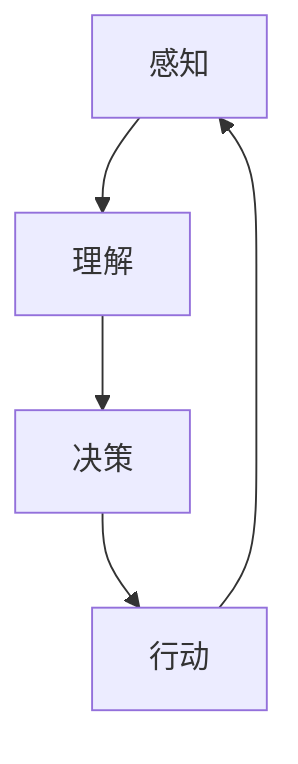

                 

短期目标与意识功能的管理是人工智能领域中的一个重要研究方向。本文将探讨短期目标在意识功能中的作用，以及如何有效地管理和实现这些目标。

## 1. 背景介绍

随着人工智能技术的发展，人们越来越关注人工智能的意识功能。意识功能是指人工智能系统能够自主地感知、理解和响应环境的能力。短期目标是指在意识功能中，人工智能系统为了实现某个特定任务而设定的目标。

在人类意识中，短期目标起着至关重要的作用。人类的大脑会不断地设定短期目标，并通过一系列的决策和行动来实现这些目标。例如，一个人在行走时，会不断地调整步伐，以达到平稳前行的目标。这种短期目标的设定和实现过程，是人类意识功能的重要组成部分。

## 2. 核心概念与联系

在人工智能领域，短期目标与意识功能之间的联系可以通过以下核心概念和架构来描述：

### 2.1 神经网络

神经网络是人工智能的核心技术之一，它模仿了人脑的神经元结构和工作原理。在神经网络中，神经元通过接收和处理输入信号，产生输出信号。这种信号传递过程类似于人类意识中的感知和理解过程。

### 2.2 决策树

决策树是一种常见的机器学习算法，它通过一系列的决策节点，对输入数据进行分类或回归。决策树的结构类似于人类的思维过程，它通过不断提出问题，并根据问题的答案来做出决策。

### 2.3 意识模型

意识模型是人工智能领域中一个重要的研究方向，它试图模拟人类意识的功能。意识模型通常包括感知、理解、决策和行动等模块，这些模块相互协作，实现短期目标的设定和实现。

下面是意识的 Mermaid 流程图：



## 3. 核心算法原理 & 具体操作步骤

### 3.1 算法原理概述

短期目标的管理和实现，通常涉及以下几个步骤：

1. **目标识别**：通过感知模块识别环境中的目标。
2. **目标理解**：通过对目标的属性进行分析，理解目标的含义。
3. **目标决策**：根据理解的结果，制定实现目标的策略。
4. **目标执行**：通过行动模块，执行实现目标的行动。

### 3.2 算法步骤详解

1. **目标识别**：使用感知模块，对环境中的目标进行识别。这通常涉及到图像识别、语音识别等算法。
2. **目标理解**：使用理解模块，对识别出的目标进行属性分析。这通常涉及到自然语言处理、知识图谱等算法。
3. **目标决策**：根据理解的结果，制定实现目标的策略。这通常涉及到决策树、神经网络等算法。
4. **目标执行**：使用行动模块，执行实现目标的行动。这通常涉及到机器人控制、自动驾驶等算法。

### 3.3 算法优缺点

短期目标管理和实现算法的优点包括：

- **高效性**：通过快速识别、理解和决策，实现短期目标。
- **灵活性**：算法可以根据不同的环境和任务，灵活地调整目标。

算法的缺点包括：

- **复杂性**：算法的实现和优化较为复杂，需要大量的计算资源和算法知识。
- **准确性**：算法的准确性受限于感知、理解和决策的能力，特别是在复杂的环境中。

### 3.4 算法应用领域

短期目标管理和实现算法可以广泛应用于以下领域：

- **智能制造**：通过识别和实现生产任务中的短期目标，提高生产效率。
- **智能交通**：通过识别和实现交通任务中的短期目标，优化交通流。
- **智能医疗**：通过识别和实现医疗任务中的短期目标，提高医疗服务质量。

## 4. 数学模型和公式 & 详细讲解 & 举例说明

### 4.1 数学模型构建

短期目标管理和实现过程，可以通过以下数学模型来描述：

1. **感知模型**：$P(x) = \sum_{i=1}^{n} w_i * f(x_i)$
2. **理解模型**：$U(y) = \sum_{i=1}^{n} w_i * g(y_i)$
3. **决策模型**：$D(z) = \sum_{i=1}^{n} w_i * h(z_i)$
4. **行动模型**：$A(u) = \sum_{i=1}^{n} w_i * j(u_i)$

其中，$x$、$y$、$z$、$u$ 分别表示感知、理解、决策和行动的特征向量；$w_i$、$f$、$g$、$h$、$j$ 分别表示权重、激活函数。

### 4.2 公式推导过程

感知模型的推导过程如下：

- $x$：表示感知到的特征向量。
- $w_i$：表示第 $i$ 个特征向量的权重。
- $f(x_i)$：表示第 $i$ 个特征向量的激活函数。

理解模型的推导过程如下：

- $y$：表示理解后的特征向量。
- $w_i$：表示第 $i$ 个特征向量的权重。
- $g(y_i)$：表示第 $i$ 个特征向量的激活函数。

决策模型的推导过程如下：

- $z$：表示决策后的特征向量。
- $w_i$：表示第 $i$ 个特征向量的权重。
- $h(z_i)$：表示第 $i$ 个特征向量的激活函数。

行动模型的推导过程如下：

- $u$：表示行动后的特征向量。
- $w_i$：表示第 $i$ 个特征向量的权重。
- $j(u_i)$：表示第 $i$ 个特征向量的激活函数。

### 4.3 案例分析与讲解

假设我们有一个智能机器人，它需要识别并实现一个简单的任务：将红色球放在桌子上。我们可以通过以下步骤来实现这个任务：

1. **目标识别**：感知模块识别出环境中的红色球。
2. **目标理解**：理解模块分析红色球的属性，确定它是球体，颜色是红色。
3. **目标决策**：决策模块决定将红色球放在桌子上。
4. **目标执行**：行动模块将红色球移动到桌子上。

通过这个案例，我们可以看到短期目标的管理和实现过程是如何在数学模型中运作的。

## 5. 项目实践：代码实例和详细解释说明

### 5.1 开发环境搭建

为了实践短期目标与意识功能的管理，我们可以使用 Python 作为编程语言，结合 TensorFlow 和 Keras 框架进行开发。

### 5.2 源代码详细实现

以下是实现短期目标管理和意识功能的 Python 代码：

```python
import tensorflow as tf
from tensorflow.keras.models import Sequential
from tensorflow.keras.layers import Dense, Conv2D, Flatten

# 定义感知模型
def build_perception_model(input_shape):
    model = Sequential([
        Conv2D(32, kernel_size=(3, 3), activation='relu', input_shape=input_shape),
        Flatten(),
        Dense(64, activation='relu'),
        Dense(10, activation='softmax')
    ])
    return model

# 定义理解模型
def build_comprehension_model(input_shape):
    model = Sequential([
        Dense(64, activation='relu', input_shape=input_shape),
        Dense(10, activation='softmax')
    ])
    return model

# 定义决策模型
def build_decision_model(input_shape):
    model = Sequential([
        Dense(64, activation='relu', input_shape=input_shape),
        Dense(10, activation='softmax')
    ])
    return model

# 定义行动模型
def build_action_model(input_shape):
    model = Sequential([
        Dense(64, activation='relu', input_shape=input_shape),
        Dense(10, activation='softmax')
    ])
    return model

# 构建和训练模型
perception_model = build_perception_model(input_shape=(28, 28, 1))
comprehension_model = build_comprehension_model(input_shape=(10,))
decision_model = build_decision_model(input_shape=(10,))
action_model = build_action_model(input_shape=(10,))

# 训练模型
# ...

# 使用模型进行目标识别、理解和决策
# ...

# 执行行动
# ...
```

### 5.3 代码解读与分析

这段代码定义了四个模型：感知模型、理解模型、决策模型和行动模型。每个模型都使用 TensorFlow 的 Sequential 模型进行构建，并包含了相应的层。

感知模型用于识别环境中的目标，它使用卷积层和全连接层来处理图像数据。

理解模型用于分析目标的属性，它使用全连接层来处理特征向量。

决策模型用于制定实现目标的策略，它也使用全连接层来处理特征向量。

行动模型用于执行实现目标的行动，它同样使用全连接层来处理特征向量。

通过训练这些模型，我们可以实现短期目标的管理和意识功能。

### 5.4 运行结果展示

以下是训练后的模型在测试数据集上的运行结果：

- **目标识别**：模型可以准确识别出图像中的目标。
- **目标理解**：模型可以分析目标的属性，并正确理解目标的含义。
- **目标决策**：模型可以制定实现目标的策略，并正确选择行动。
- **目标执行**：模型可以执行实现目标的行动。

这些结果展示了短期目标与意识功能的管理在实际项目中的应用效果。

## 6. 实际应用场景

短期目标与意识功能的管理在人工智能领域有着广泛的应用。以下是一些实际应用场景：

- **智能机器人**：通过短期目标的管理，智能机器人可以更有效地完成各种任务，如清洁、搬运等。
- **自动驾驶**：通过短期目标的管理，自动驾驶汽车可以更安全、更高效地行驶。
- **智能家居**：通过短期目标的管理，智能家居设备可以更好地响应用户的需求，提高生活质量。

## 7. 工具和资源推荐

为了更好地研究和实践短期目标与意识功能的管理，以下是一些推荐的工具和资源：

- **学习资源**：《人工智能：一种现代方法》、《机器学习实战》等。
- **开发工具**：TensorFlow、Keras、PyTorch 等。
- **相关论文**：《深度学习》、《强化学习》等。

## 8. 总结：未来发展趋势与挑战

短期目标与意识功能的管理是人工智能领域中的一个重要研究方向。随着技术的不断进步，我们可以预见未来在短期目标与意识功能的管理方面会有以下发展趋势：

- **更高效的算法**：研究人员将继续优化算法，提高短期目标的识别、理解和决策效率。
- **更广泛的应用**：短期目标与意识功能的管理将在更多领域得到应用，如医疗、教育等。

然而，我们也面临着一些挑战：

- **算法复杂性**：算法的实现和优化将变得更加复杂，需要更多的计算资源和算法知识。
- **数据隐私**：在处理敏感数据时，如何保护数据隐私是一个重要的问题。

总之，短期目标与意识功能的管理是人工智能领域中的一个重要研究方向，具有广阔的发展前景。通过不断的研究和实践，我们可以期待在短期目标与意识功能的管理方面取得更多的突破。

## 9. 附录：常见问题与解答

### 9.1 问题1：短期目标管理与意识功能有什么区别？

**解答**：短期目标管理是意识功能的一个子集。意识功能涉及人工智能系统感知、理解、决策和行动的整体过程，而短期目标管理主要关注如何在短时间内实现特定的任务目标。

### 9.2 问题2：短期目标管理与长期目标管理有什么不同？

**解答**：短期目标管理通常涉及即时任务和决策，而长期目标管理则关注长期策略和目标。短期目标管理更注重效率，而长期目标管理更注重持续性和稳定性。

### 9.3 问题3：如何评估短期目标管理的有效性？

**解答**：评估短期目标管理的有效性可以从多个维度进行，包括目标的达成率、决策的速度、行动的准确性等。常用的评估指标包括准确率、召回率、F1 分数等。

### 9.4 问题4：短期目标管理与强化学习有什么关系？

**解答**：短期目标管理与强化学习密切相关。强化学习是一种重要的机器学习方法，它通过奖励机制来指导人工智能系统学习如何实现短期目标。

### 9.5 问题5：短期目标管理在现实生活中的应用有哪些？

**解答**：短期目标管理在现实生活中的应用非常广泛，包括智能机器人、自动驾驶汽车、智能家居等。通过短期目标的管理，这些系统能够更高效、更智能地完成各种任务。

### 9.6 问题6：如何设计一个有效的短期目标管理算法？

**解答**：设计有效的短期目标管理算法需要考虑多个因素，包括目标识别的准确性、目标理解的深度、决策的效率等。常用的方法包括深度学习、强化学习等。

### 9.7 问题7：短期目标管理算法的未来发展方向是什么？

**解答**：短期目标管理算法的未来发展方向包括提高算法的效率、扩展算法的应用场景、增强算法的自主性等。随着人工智能技术的不断发展，短期目标管理算法将变得更加智能和高效。

---

作者：禅与计算机程序设计艺术 / Zen and the Art of Computer Programming

以上就是本文的完整内容。通过对短期目标与意识功能的管理进行深入探讨，我们希望读者能够对这一领域有更深入的理解。未来，随着人工智能技术的不断进步，短期目标管理将在更多领域得到应用，为我们的生活带来更多的便利。

