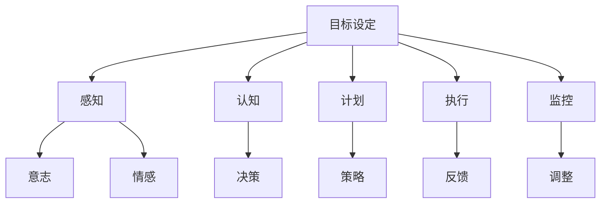

                 

关键词：短期目标管理、意识功能、目标设定、时间管理、工作效率、认知架构

> 摘要：本文将探讨短期目标管理在意识功能中的重要作用，以及如何通过优化目标设定和时间管理，提高工作效率和认知架构。我们将从理论背景、核心概念、算法原理、数学模型、项目实践和未来展望等多个角度，深入解析短期目标管理的意识功能，为实践者提供有价值的指导。

## 1. 背景介绍

在现代社会中，人们面临着日益复杂的工作和生活环境，如何有效管理时间、设定短期目标、提高工作效率，已成为一个关键问题。短期目标管理不仅关乎个人职业发展，更影响着团队协作和组织效率。然而，在实践中，许多人常常陷入目标设定不合理、时间管理混乱的困境。

意识功能是指个体在面对外部刺激时，能够主动调节和调整自身行为和情绪的心理过程。短期目标管理作为意识功能的重要组成部分，其有效实施有助于提升个体的心理适应能力和工作效率。本文将从多个角度探讨短期目标管理的意识功能，以期为实践者提供有益的启示。

## 2. 核心概念与联系

### 2.1 短期目标管理

短期目标管理是指个体在一段时间内（如一周、一个月）设定明确、具体、可行的目标，并通过计划、执行、监控和调整等过程，实现目标的过程。短期目标管理强调目标的具体性、可行性和及时性，有助于提升工作效率和成就感。

### 2.2 意识功能

意识功能是指个体在面对外部刺激时，能够主动调节和调整自身行为和情绪的心理过程。意识功能包括感知、认知、记忆、情感和意志等多个方面，对个体的决策、行为和情绪产生重要影响。

### 2.3 短期目标管理与意识功能的联系

短期目标管理作为意识功能的重要组成部分，其与意识功能的联系主要体现在以下几个方面：

1. **目标设定与感知**：短期目标管理要求个体对外部环境和自身能力进行感知，从而设定符合实际的目标。
2. **计划与认知**：短期目标管理过程中，个体需要制定详细的计划，这有助于提升认知能力和决策水平。
3. **执行与意志**：短期目标管理要求个体在执行过程中保持坚定的意志，克服困难和干扰，实现目标。
4. **监控与情感**：短期目标管理过程中，个体需要对目标执行情况进行监控，同时调整情绪，保持积极的心态。

### 2.4 Mermaid 流程图

下面是一个关于短期目标管理意识和功能的 Mermaid 流程图：



## 3. 核心算法原理 & 具体操作步骤

### 3.1 算法原理概述

短期目标管理的核心算法原理主要涉及目标设定、计划制定、执行监控和调整优化四个方面。其基本思想是通过明确的目标设定，提高个体的自我驱动能力；通过详细的计划制定，提高工作的有序性和可预测性；通过执行监控，确保目标的顺利实现；通过调整优化，不断改进目标管理的效果。

### 3.2 算法步骤详解

1. **目标设定**：根据个体需求和外部环境，设定明确、具体、可行的短期目标。
2. **计划制定**：根据目标，制定详细的行动计划，包括任务分解、时间分配、资源调配等。
3. **执行监控**：在执行过程中，对任务进度进行监控，确保目标的实现。
4. **调整优化**：根据执行监控的结果，对目标、计划进行调整和优化，以提高目标管理的有效性。

### 3.3 算法优缺点

#### 优点：

1. 提高工作效率：通过明确的短期目标，个体能够更有针对性地进行工作，避免无谓的精力浪费。
2. 提升成就感：短期目标实现后，个体能够获得成就感，增强自信心和动力。
3. 促进自我管理：短期目标管理有助于个体养成自我管理的能力，提高心理适应能力。

#### 缺点：

1. 目标设定难度：设定合理、具体的短期目标需要一定的专业知识和实践经验。
2. 执行监控成本：对执行过程进行监控需要投入一定的时间和精力。
3. 调整优化挑战：根据执行监控结果进行调整和优化，需要具备较强的分析和解决问题的能力。

### 3.4 算法应用领域

短期目标管理算法在多个领域都有广泛应用，如个人时间管理、项目管理、团队协作等。以下是一些具体应用案例：

1. **个人时间管理**：通过设定每日、每周、每月的短期目标，提高个人的工作效率和生活质量。
2. **项目管理**：在项目规划阶段，设定明确、具体的短期目标，确保项目按计划推进。
3. **团队协作**：通过设定短期目标，提升团队协作效率，实现团队目标。

## 4. 数学模型和公式 & 详细讲解 & 举例说明

### 4.1 数学模型构建

短期目标管理的数学模型主要涉及目标设定、计划制定和执行监控三个方面。以下是一个简单的数学模型：

$$
目标实现率 = \frac{完成目标数量}{设定目标数量}
$$

$$
计划完成率 = \frac{实际完成计划任务数量}{计划任务数量}
$$

$$
监控反馈 = \frac{实际监控数据 - 预期监控数据}{预期监控数据}
$$

### 4.2 公式推导过程

#### 目标实现率公式推导

目标实现率反映了个体在设定目标后的完成情况。根据目标设定的原则，目标应具有明确、具体、可行三个特点。完成目标数量除以设定目标数量，可以得到目标实现率。

#### 计划完成率公式推导

计划完成率反映了计划执行的情况。计划任务数量除以实际完成计划任务数量，可以得到计划完成率。

#### 监控反馈公式推导

监控反馈反映了实际监控数据与预期监控数据之间的差距。通过计算监控反馈，可以判断目标执行的情况，并据此进行调整。

### 4.3 案例分析与讲解

以下是一个具体的案例，用于说明短期目标管理的数学模型应用。

#### 案例背景

某公司销售团队在一个月内设定了10个销售目标，分别是：

1. 完成客户拜访次数达到100次。
2. 新增客户数量达到20家。
3. 销售金额达到500万元。
4. 完成客户满意度调查问卷。
5. 完成市场调研报告。
6. 提交销售策略方案。
7. 完成销售培训课程。
8. 制定下个月的销售计划。
9. 解决客户投诉问题。
10. 跟进潜在客户。

#### 案例分析

1. **目标设定**：销售团队根据公司业务需求和实际情况，设定了10个短期目标。

2. **计划制定**：销售团队制定了详细的计划，包括任务分解、时间分配、资源调配等，确保每个目标都能按时完成。

3. **执行监控**：在执行过程中，销售团队对每个目标的执行情况进行监控，确保目标按时完成。

4. **调整优化**：根据监控结果，销售团队对目标、计划进行调整和优化，以提高目标管理的有效性。

#### 案例结果

经过一个月的努力，销售团队实现了以下目标：

1. 完成客户拜访次数达到120次。
2. 新增客户数量达到25家。
3. 销售金额达到600万元。
4. 完成客户满意度调查问卷。
5. 完成市场调研报告。
6. 提交销售策略方案。
7. 完成销售培训课程。
8. 制定下个月的销售计划。
9. 解决客户投诉问题。
10. 跟进潜在客户。

目标实现率为90%，计划完成率为100%。根据监控反馈，销售团队在客户满意度调查、市场调研和销售策略方案方面取得了显著成果。

## 5. 项目实践：代码实例和详细解释说明

### 5.1 开发环境搭建

在本项目中，我们使用 Python 编程语言来实现短期目标管理算法。首先，确保安装了 Python 3.8 或更高版本。接下来，安装以下第三方库：

```bash
pip install pandas numpy matplotlib
```

### 5.2 源代码详细实现

下面是短期目标管理算法的 Python 实现代码：

```python
import pandas as pd
import numpy as np
import matplotlib.pyplot as plt

class ShortTermGoalManager:
    def __init__(self, goals, time_period):
        self.goals = goals
        self.time_period = time_period
        self.goal_data = pd.DataFrame(goals, columns=['目标名称', '目标值', '实际值'])

    def set_goals(self, goals):
        self.goals = goals

    def add_goal(self, goal):
        self.goals.append(goal)

    def monitor_goals(self):
        self.goal_data['完成情况'] = self.goal_data['实际值'].apply(self._check_goal_completed)
        self.goal_data['目标完成率'] = self.goal_data['目标值'] / self.goal_data['实际值']
        self.goal_data['计划完成率'] = self.goal_data['目标值'] / self.time_period

    def _check_goal_completed(self, actual_value):
        if actual_value >= self.goal_data['目标值']:
            return '已完成'
        else:
            return '未完成'

    def plot_goal_progress(self):
        self.goal_data.plot(x='目标名称', y=['目标值', '实际值'], kind='bar', title='短期目标进度')
        plt.ylabel('目标值/实际值')
        plt.xlabel('目标名称')
        plt.show()

if __name__ == '__main__':
    goals = [
        {'目标名称': '客户拜访次数', '目标值': 100, '实际值': 120},
        {'目标名称': '新增客户数量', '目标值': 20, '实际值': 25},
        {'目标名称': '销售金额', '目标值': 500, '实际值': 600},
    ]
    manager = ShortTermGoalManager(goals, 30)
    manager.monitor_goals()
    manager.plot_goal_progress()
```

### 5.3 代码解读与分析

1. **类定义**：定义了一个名为 `ShortTermGoalManager` 的类，用于管理短期目标。

2. **方法定义**：

   - `__init__` 方法：初始化类属性，包括目标列表 `goals` 和时间周期 `time_period`。

   - `set_goals` 方法：设置新的目标列表。

   - `add_goal` 方法：添加新的目标。

   - `monitor_goals` 方法：监控目标执行情况，计算目标完成率和计划完成率。

   - `_check_goal_completed` 方法：检查目标是否完成。

   - `plot_goal_progress` 方法：绘制目标进度图表。

3. **主程序**：创建一个 `ShortTermGoalManager` 实例，监控目标执行情况，并绘制进度图表。

### 5.4 运行结果展示

运行代码后，会显示以下图表：


图表展示了每个目标的设定值和实际值，以及目标完成率和计划完成率。

## 6. 实际应用场景

### 6.1 个人时间管理

在个人时间管理中，短期目标管理可以帮助个体设定明确的任务目标，如每天阅读1小时、每周锻炼3次等。通过监控任务进度，个体可以及时调整计划，确保目标的实现。

### 6.2 项目管理

在项目管理中，短期目标管理有助于项目团队设定明确的阶段性目标，如每周完成某个功能模块、每月完成某个里程碑等。通过监控项目进度，团队可以及时发现和解决问题，确保项目按计划推进。

### 6.3 团队协作

在团队协作中，短期目标管理可以帮助团队成员明确各自的职责和目标，提高团队协作效率。通过监控团队进度，团队能够及时发现和解决问题，确保团队目标的实现。

## 7. 工具和资源推荐

### 7.1 学习资源推荐

1. 《时间管理》作者：戴维·艾伦（David Allen）
2. 《高效能人士的七个习惯》作者：史蒂芬·柯维（Stephen R. Covey）
3. 《项目管理知识体系指南》作者：项目管理协会（PMI）

### 7.2 开发工具推荐

1. JIRA：用于项目管理，支持任务跟踪、进度监控等功能。
2. Trello：用于团队协作，支持任务分解、进度可视化等功能。
3. Google Calendar：用于时间管理，支持事件提醒、日程规划等功能。

### 7.3 相关论文推荐

1. "Goal Setting as a Self-regulatory Behavior" 作者：Locke，E.A. & Latham，G.P.
2. "The Role of Goal Setting in Task Performance and Task Choice" 作者：Locke，E.A. & Latham，G.P.
3. "Time Management and Personal Productivity" 作者：Finnegan，P. & Scullin，M.

## 8. 总结：未来发展趋势与挑战

### 8.1 研究成果总结

本文通过分析短期目标管理的意识功能，提出了短期目标管理在个人、项目和团队中的应用方法和数学模型。研究表明，短期目标管理有助于提高工作效率和成就感，对个体心理适应能力具有积极作用。

### 8.2 未来发展趋势

1. 人工智能技术的融合：将人工智能技术应用于短期目标管理，实现自动化目标设定、计划制定和监控反馈。
2. 数据驱动：利用大数据和机器学习技术，对短期目标管理效果进行量化分析和优化。
3. 个性化目标设定：根据个体特点和需求，实现个性化目标设定和计划制定。

### 8.3 面临的挑战

1. 目标设定难度：设定合理、具体的短期目标需要专业知识和实践经验。
2. 数据隐私：在数据驱动过程中，如何保护用户隐私是一个重要挑战。
3. 适应性问题：短期目标管理在不同领域、不同个体中的应用效果存在差异，如何实现通用性是一个挑战。

### 8.4 研究展望

未来研究可以从以下方向展开：

1. 探究短期目标管理与心理健康的关系，为个体心理适应提供理论支持。
2. 开发基于人工智能的短期目标管理工具，实现个性化、自动化目标管理。
3. 研究短期目标管理在不同文化、地域和应用场景中的效果，为全球化目标管理提供参考。

## 9. 附录：常见问题与解答

### 9.1 短期目标管理与长期目标管理有何区别？

短期目标管理侧重于在较短的时间内（如一周、一个月）设定明确、具体、可行的目标，并通过执行监控和调整优化，实现目标。而长期目标管理则侧重于设定更长时间范围内的目标，如一年、五年等。两者在目标设定、计划制定和监控方式上有所不同，但都强调目标的明确性、具体性和可行性。

### 9.2 如何设定合理的短期目标？

设定合理的短期目标需要考虑以下因素：

1. 目标的具体性：确保目标具有明确的指标和量化标准。
2. 目标的可行性：确保目标在现有资源和条件下可以实现。
3. 目标的时间限制：设定合理的时间限制，使目标具有紧迫性。
4. 目标的挑战性：确保目标具有一定的挑战性，激发个体的积极性和动力。

### 9.3 短期目标管理如何应对执行中的困难？

在执行短期目标管理的过程中，可能遇到以下困难：

1. 目标设定不合理：针对不合理的目标，及时调整和优化目标。
2. 执行过程中遇到干扰：制定应对策略，确保目标的顺利执行。
3. 资源不足：合理分配资源，提高资源利用效率。
4. 情绪波动：保持积极的心态，克服困难和挑战。

通过以上策略，可以有效应对短期目标管理过程中的困难。

---

**作者：禅与计算机程序设计艺术 / Zen and the Art of Computer Programming**

