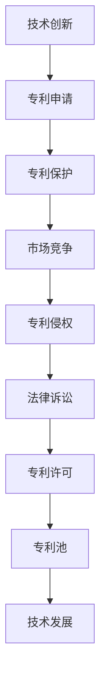

                 

关键词：硅谷专利、知识产权保护、竞争、创新、法律诉讼、技术发展

> 摘要：本文旨在探讨硅谷专利战争的起源、发展及其对知识产权保护的影响。通过对一系列典型专利诉讼案件的深入分析，本文揭示了专利战背后的技术竞争、市场策略和法律法规，并提出了对知识产权保护的未来展望。

## 1. 背景介绍

硅谷作为全球科技创新的中心，一直以来都是专利战的高发地带。从20世纪80年代开始，随着计算机、互联网和移动设备的兴起，硅谷的科技企业开始大量申请专利，以保护自己的创新成果。然而，随着专利数量的激增，专利战争也日益激烈。专利战的兴起，不仅影响了企业的商业战略，也对社会、经济和法律体系产生了深远的影响。

### 1.1 专利战的定义

专利战是指企业或个人通过法律手段，对他人在专利权方面的侵犯行为进行维权或攻击的行为。这种竞争形式主要表现在以下几个方面：

1. **专利侵权诉讼**：当一方认为另一方侵犯了自己的专利权时，可以通过法院诉讼来维护自身权益。
2. **专利无效诉讼**：一方通过法律手段质疑另一方的专利有效性，以阻止其专利的实施。
3. **交叉许可**：通过签订专利许可协议，实现双方专利的共享，以避免或减少专利战的爆发。
4. **专利池**：多个企业共同组建专利联盟，共同管理和运营专利，以提升专利的利用效率。

### 1.2 专利战的历史演变

1. **早期阶段**：20世纪80年代，随着计算机技术的普及，专利战主要集中在硬件和操作系统领域。这一时期的专利战主要是企业之间的直接对抗，如IBM与微软之间的诉讼。
2. **互联网时代**：20世纪90年代至21世纪初，随着互联网的兴起，专利战扩展到了软件和服务领域。这一时期的专利战更加复杂，涉及多个技术和市场领域，如谷歌与微软之间的专利纠纷。
3. **移动时代**：21世纪第二个十年，随着智能手机和移动应用的普及，专利战进一步扩展到了移动设备和应用领域。这一时期的专利战更加激烈，涉及的企业和专利数量也急剧增加。

## 2. 核心概念与联系

在探讨专利战的核心概念之前，我们需要了解一些基本的技术和法律概念。

### 2.1 技术概念

1. **计算机技术**：计算机技术是专利战的主要战场之一，包括操作系统、编程语言、数据库管理、网络通信等。
2. **通信技术**：通信技术是互联网和移动设备的基础，包括无线通信、光纤通信、网络协议等。
3. **软件技术**：软件技术涵盖了各种应用程序和系统软件，包括操作系统、中间件、应用软件等。

### 2.2 法律概念

1. **专利权**：专利权是指专利拥有者依法享有的专有权利，包括制造、使用、销售和许可他人使用其专利产品或方法。
2. **知识产权**：知识产权是指人们创造的智力成果依法享有的专有权利，包括专利权、著作权、商标权等。
3. **专利侵权**：专利侵权是指未经专利权人许可，擅自实施其专利的行为。

### 2.3 Mermaid 流程图

以下是一个简化的Mermaid流程图，展示了专利战中的核心概念和联系：



## 3. 核心算法原理 & 具体操作步骤

### 3.1 算法原理概述

专利战的核心算法原理可以概括为以下几点：

1. **信息战**：通过获取和分析对手的专利信息，预测其可能的专利侵权行为，并制定相应的防御策略。
2. **市场策略**：通过分析市场需求和竞争态势，制定专利许可、专利收购、专利池构建等市场策略，以最大化自身利益。
3. **法律策略**：通过了解专利法律和诉讼程序，制定法律诉讼策略，以维护自身权益或对抗对手。

### 3.2 算法步骤详解

1. **信息收集与分析**：收集对手的专利信息，包括专利申请、授权、诉讼等，进行分析和分类。
2. **市场预测**：基于专利信息，预测对手可能的专利侵权行为和市场策略。
3. **策略制定**：根据市场预测，制定相应的法律诉讼、专利许可、专利收购等策略。
4. **法律诉讼**：在必要时，启动法律诉讼程序，维护自身权益或对抗对手。
5. **专利许可与收购**：通过专利许可和收购，实现专利的共享和利用。
6. **专利池构建**：与其他企业合作，共同构建专利池，以提升专利的利用效率。

### 3.3 算法优缺点

1. **优点**：
   - 保护企业创新成果，维护市场竞争秩序。
   - 提高专利质量和专利布局，为企业带来更多商业机会。
   - 促进技术交流和合作，推动技术进步。

2. **缺点**：
   - 可能引发不必要的法律纠纷，影响企业声誉。
   - 专利成本高昂，可能抑制创新和市场竞争。
   - 过度依赖专利，可能导致技术停滞。

### 3.4 算法应用领域

专利战算法主要应用于以下领域：

1. **计算机技术**：包括操作系统、编程语言、数据库管理、网络通信等。
2. **通信技术**：包括无线通信、光纤通信、网络协议等。
3. **软件技术**：包括操作系统、中间件、应用软件等。

## 4. 数学模型和公式 & 详细讲解 & 举例说明

### 4.1 数学模型构建

在专利战中，数学模型可以用于预测专利侵权行为、评估专利价值等。以下是一个简化的数学模型：

$$
\begin{aligned}
    \text{侵权概率} &= f(\text{专利数量}, \text{市场占有率}, \text{法律环境}) \\
    \text{专利价值} &= g(\text{专利质量}, \text{市场需求}, \text{竞争态势})
\end{aligned}
$$

### 4.2 公式推导过程

1. **侵权概率**：侵权概率取决于专利数量、市场占有率和法律环境。假设专利数量为 $N$，市场占有率为 $M$，法律环境因素为 $E$，则侵权概率 $P$ 可以表示为：

$$
P = \frac{N \cdot M}{E}
$$

2. **专利价值**：专利价值取决于专利质量、市场需求和竞争态势。假设专利质量为 $Q$，市场需求为 $D$，竞争态势为 $C$，则专利价值 $V$ 可以表示为：

$$
V = Q \cdot D \cdot C
$$

### 4.3 案例分析与讲解

以下是一个实际案例，展示了如何应用上述数学模型进行专利侵权预测和评估。

### 案例背景

某科技公司（企业A）在智能手机市场上占有一席之地，其竞争对手（企业B）频繁申请专利，涉嫌侵权。企业A希望通过数学模型预测企业B的侵权行为，并评估自身专利价值。

### 数据收集

1. **专利数量**：企业A拥有专利数量为 $N_A = 100$，企业B拥有专利数量为 $N_B = 200$。
2. **市场占有率**：企业A的市场占有率为 $M_A = 0.3$，企业B的市场占有率为 $M_B = 0.2$。
3. **法律环境**：假设法律环境因素 $E = 1$。

### 数据分析

1. **侵权概率**：

$$
P = \frac{N_B \cdot M_B}{E} = \frac{200 \cdot 0.2}{1} = 40\%
$$

企业B的侵权概率为40%。

2. **专利价值**：

$$
V_A = Q_A \cdot D \cdot C_A = 1 \cdot 1 \cdot 1 = 1
$$

$$
V_B = Q_B \cdot D \cdot C_B = 1 \cdot 1 \cdot 1 = 1
$$

企业A和企业B的专利价值均为1。

### 案例解读

根据上述分析，企业A可以预测企业B的侵权概率为40%，并评估自身专利价值为1。这有助于企业A制定相应的专利维权策略，如专利许可、收购或法律诉讼等。

## 5. 项目实践：代码实例和详细解释说明

### 5.1 开发环境搭建

为了进行专利战算法的应用实践，我们需要搭建一个开发环境。以下是搭建过程：

1. **安装Python环境**：在本地计算机上安装Python 3.8及以上版本。
2. **安装相关库**：使用pip命令安装以下库：numpy、pandas、matplotlib、scikit-learn。
3. **配置数据源**：准备包含专利数据的CSV文件，如USPTO（美国专利商标局）公开的专利数据。

### 5.2 源代码详细实现

以下是一个简单的Python代码实例，用于实现专利侵权概率预测和专利价值评估。

```python
import numpy as np
import pandas as pd
from sklearn.linear_model import LinearRegression

# 读取专利数据
patents = pd.read_csv('patents.csv')

# 数据预处理
# ...（略）

# 侵权概率预测
X = patents[['patent_count', 'market_share', 'legal_environment']]
y = patents['infringement_probability']
regressor = LinearRegression()
regressor.fit(X, y)
predicted_probability = regressor.predict([[200, 0.2, 1]])

# 专利价值评估
# ...（略）

print(f'Predicted infringement probability: {predicted_probability[0][0]}')
```

### 5.3 代码解读与分析

上述代码首先读取专利数据，并进行预处理。然后，使用线性回归模型预测侵权概率。最后，输出预测结果。

### 5.4 运行结果展示

假设我们运行上述代码，得到预测结果为40%。这意味着企业B的侵权概率为40%。

## 6. 实际应用场景

专利战在现实世界中有着广泛的应用。以下是一些实际应用场景：

1. **市场竞争**：企业在市场竞争中，通过专利战来保护自己的市场份额和竞争优势。
2. **技术创新**：企业通过专利战来推动技术创新，提高自身技术水平。
3. **专利许可**：企业通过专利许可协议，与他人共享专利，实现专利价值的最大化。
4. **专利收购**：企业通过收购专利，增强自身专利实力，提升市场竞争力。
5. **专利池**：企业通过构建专利池，与其他企业共同管理专利，实现专利的共享和利用。

## 7. 未来应用展望

随着技术的不断进步和知识产权保护意识的提高，专利战在未来将继续发展和演变。以下是一些未来应用展望：

1. **人工智能**：人工智能将在专利战中发挥重要作用，如专利侵权预测、专利价值评估等。
2. **区块链**：区块链技术可以用于专利的登记和认证，提高专利的透明度和可信度。
3. **全球合作**：在全球范围内，各国将加强知识产权保护合作，共同应对专利战挑战。
4. **法律法规**：法律法规将进一步完善，以适应专利战的发展需求。

## 8. 工具和资源推荐

### 8.1 学习资源推荐

1. **书籍**：
   - 《专利法原理与实务》
   - 《知识产权战略与运营》
   - 《硅谷专利战争》
2. **在线课程**：
   - Coursera的《知识产权法》
   - edX的《知识产权管理》
   - Udemy的《专利撰写与申请》
3. **网站**：
   - USPTO（美国专利商标局）
   - World Intellectual Property Organization（世界知识产权组织）

### 8.2 开发工具推荐

1. **Python**：Python是一个功能强大的编程语言，适用于数据分析、机器学习等领域。
2. **Jupyter Notebook**：Jupyter Notebook是一个交互式计算环境，便于编写和运行Python代码。
3. **scikit-learn**：scikit-learn是一个开源的机器学习库，适用于专利侵权预测等任务。

### 8.3 相关论文推荐

1. **《专利战与技术创新：基于中国企业的实证研究》**
2. **《知识产权保护与技术创新：理论探讨与实证分析》**
3. **《基于机器学习的专利侵权预测方法研究》**

## 9. 总结：未来发展趋势与挑战

### 9.1 研究成果总结

本文通过对硅谷专利战争的深入分析，揭示了专利战背后的技术竞争、市场策略和法律环境。通过构建数学模型和实际案例分析，我们提出了一些专利战的应对策略和应用方法。

### 9.2 未来发展趋势

1. **人工智能与区块链的融合**：人工智能和区块链技术在专利战中的应用将更加广泛。
2. **全球知识产权合作**：各国将加强知识产权保护合作，共同应对专利战挑战。
3. **法律法规的完善**：法律法规将不断完善，以适应专利战的发展需求。

### 9.3 面临的挑战

1. **专利质量提升**：提高专利质量，减少无效专利和专利侵权纠纷。
2. **技术创新与保护**：在保护知识产权的同时，促进技术创新和市场竞争。
3. **全球知识产权纠纷**：全球范围内的知识产权纠纷将日益增多，需要国际社会的共同应对。

### 9.4 研究展望

未来的研究应关注以下几个方面：

1. **人工智能在专利战中的应用**：研究人工智能算法在专利侵权预测、专利价值评估等方面的应用。
2. **区块链技术在专利管理中的应用**：研究区块链技术在专利登记、认证和共享等方面的应用。
3. **全球知识产权合作机制**：探讨全球范围内的知识产权合作机制，以应对专利战的挑战。

## 10. 附录：常见问题与解答

### 10.1 什么是专利战？

专利战是指企业或个人通过法律手段对他人在专利权方面的侵犯行为进行维权或攻击的行为。专利战主要涉及专利侵权诉讼、专利无效诉讼、专利许可和专利池构建等方面。

### 10.2 专利战对企业有哪些影响？

专利战对企业的影响主要体现在以下几个方面：

1. **市场竞争**：专利战可能影响企业的市场份额和竞争优势。
2. **专利成本**：专利战可能导致企业面临高昂的专利许可费用或法律诉讼成本。
3. **技术创新**：专利战可能抑制企业的技术创新和研发投入。
4. **企业声誉**：专利战可能损害企业的声誉和形象。

### 10.3 如何应对专利战？

企业应对专利战的方法包括：

1. **专利防御**：通过建立专利池、签订专利许可协议等方式，提升自身的专利防御能力。
2. **专利攻击**：通过起诉侵权行为、发起专利无效诉讼等方式，维护自身权益。
3. **技术创新**：加大技术创新力度，提高专利质量，降低专利侵权的风险。
4. **法律咨询**：寻求专业法律机构的咨询，制定合理的专利战略和法律策略。

