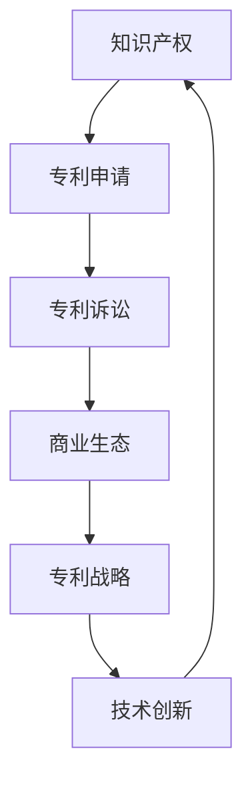

                 

关键词：硅谷专利战争、知识产权、竞争策略、技术创新、商业生态

摘要：硅谷作为全球科技创新的聚集地，其专利战争的频率和规模都令人瞩目。本文旨在探讨硅谷专利战争的影响，并提出相应的对策，以期为企业和创新者提供有益的参考。

## 1. 背景介绍

硅谷，位于美国加利福尼亚州旧金山湾区，是全球科技创新和创业的象征。自20世纪中叶以来，硅谷涌现了无数改变世界的技术创新和企业，如苹果、谷歌、微软等。然而，随着技术的快速发展，专利纠纷也日益增多，形成了所谓的“硅谷专利战争”。

硅谷专利战争的主要参与者包括大型科技公司、初创企业、大学和研究机构等。这些实体在技术创新和知识产权保护方面存在激烈竞争，专利纠纷成为硅谷科技生态的一部分。本文将分析硅谷专利战争的影响，并提出相应的对策。

## 2. 核心概念与联系

为了更好地理解硅谷专利战争，我们需要了解以下几个核心概念：

### 2.1 知识产权

知识产权是指人们对于自己的智力劳动成果所享有的权利，包括专利、商标、著作权等。在硅谷，知识产权是技术创新的核心，也是企业竞争的重要武器。

### 2.2 专利申请

专利申请是企业为了保护自己的技术创新而向政府申请的权利。专利申请的数量和质量直接反映了一个企业的技术创新能力和竞争力。

### 2.3 专利诉讼

专利诉讼是指企业之间因专利纠纷而进行的法律诉讼。在硅谷，专利诉讼已经成为一种常见的商业竞争手段。

### 2.4 商业生态

硅谷的商业生态是一个复杂且多样化的网络，包括企业、投资者、政府、大学和研究机构等。商业生态的健康发展对硅谷的专利战争具有重要意义。

### 2.5 专利战略

专利战略是指企业在知识产权保护方面所采取的策略，包括专利申请、专利组合、专利诉讼等。合理的专利战略可以帮助企业巩固市场地位，抵御竞争对手的挑战。

### 2.6 Mermaid 流程图

以下是一个关于硅谷专利战争的 Mermaid 流程图，展示了各个核心概念之间的联系：



## 3. 核心算法原理 & 具体操作步骤

### 3.1 算法原理概述

硅谷专利战争的核心算法可以概括为“知识产权保护与竞争策略”。这个算法的基本原理是通过专利申请和专利诉讼等手段，保护企业的技术创新，同时削弱竞争对手的市场地位。

### 3.2 算法步骤详解

#### 3.2.1 专利申请

企业首先需要对其技术创新进行评估，确定是否具有申请专利的潜力。如果评估结果为正面，企业需要选择合适的专利类型（如发明专利、实用新型专利等），并提交专利申请。

#### 3.2.2 专利组合

企业需要构建一个多元化的专利组合，以覆盖不同领域的创新。这可以通过购买专利、合作研发等方式实现。

#### 3.2.3 专利诉讼

在专利诉讼阶段，企业需要根据市场情况和竞争对手的行为，选择合适的诉讼策略。例如，可以通过发起诉讼来压制竞争对手，或者通过和解等方式避免不必要的法律风险。

### 3.3 算法优缺点

#### 优点

- 保护企业技术创新，提升市场竞争力。
- 有助于建立企业的知识产权壁垒，抵御竞争对手的挑战。
- 可以通过专利诉讼获得经济赔偿，增加企业的盈利能力。

#### 缺点

- 专利申请和维护成本较高，可能影响企业的研发投入。
- 专利诉讼耗时耗力，可能影响企业的正常运营。
- 过度依赖专利诉讼可能导致企业创新能力的下降。

### 3.4 算法应用领域

硅谷专利战争的核心算法在多个领域都有广泛应用，如互联网、人工智能、生物科技等。特别是在互联网领域，专利纠纷已经成为一种常见的商业竞争手段。

## 4. 数学模型和公式 & 详细讲解 & 举例说明

### 4.1 数学模型构建

为了更好地理解硅谷专利战争中的知识产权保护与竞争策略，我们可以构建一个简单的数学模型。假设有两个企业 A 和 B，它们在技术创新方面存在竞争关系。我们可以使用博弈论中的“囚徒困境”模型来描述这种情况。

### 4.2 公式推导过程

假设企业 A 和 B 的策略空间为 {申请专利，不申请专利}。每个企业的收益矩阵如下：

|         | 企业 B 申请专利 | 企业 B 不申请专利 |
| ------- | --------------- | --------------- |
| 企业 A 申请专利 | (-1, -1)       | (1, 0)         |
| 企业 A 不申请专利 | (0, 1)         | (-1, -1)       |

在这个收益矩阵中，(-1, -1) 表示两个企业都选择申请专利的情况，(1, 0) 表示企业 A 选择申请专利而企业 B 选择不申请的情况，(0, 1) 表示企业 A 选择不申请专利而企业 B 选择申请的情况。

### 4.3 案例分析与讲解

假设企业 A 和 B 都选择申请专利，它们的收益为 (-1, -1)。这意味着两个企业都付出了大量的研发成本，但最终市场地位没有发生显著变化。这种情况对企业 A 和 B 都是不利的。

如果企业 A 选择申请专利，而企业 B 选择不申请，那么企业 A 的收益为 (1, 0)。这意味着企业 A 可以通过专利诉讼压制企业 B，从而巩固自己的市场地位。然而，这种情况也可能导致企业 B 的市场份额急剧下降。

如果企业 A 选择不申请专利，而企业 B 选择申请专利，那么企业 A 的收益为 (0, 1)。这意味着企业 B 可以通过专利诉讼压制企业 A，从而扩大自己的市场份额。然而，这种情况也可能导致企业 A 的市场份额急剧下降。

### 4.4 模型总结

通过上述分析，我们可以得出以下结论：

- 专利申请是企业保护技术创新的重要手段。
- 专利诉讼是企业竞争的重要手段。
- 企业需要根据市场情况和竞争对手的行为，制定合理的专利战略。

## 5. 项目实践：代码实例和详细解释说明

### 5.1 开发环境搭建

为了更好地理解硅谷专利战争中的核心算法，我们可以使用 Python 编写一个简单的代码实例。首先，我们需要搭建一个 Python 开发环境。

#### 操作步骤：

1. 安装 Python 3.x 版本。
2. 安装必要的 Python 库，如 NumPy、Pandas 等。

### 5.2 源代码详细实现

以下是一个简单的 Python 代码实例，用于模拟硅谷专利战争中的“知识产权保护与竞争策略”。

```python
import numpy as np
import pandas as pd

# 定义收益矩阵
rewards = np.array([[0, 1], [-1, -1]])

# 定义企业策略
strategies = ["申请专利", "不申请专利"]

# 定义企业博弈过程
def game(A_strategy, B_strategy):
    reward_A, reward_B = rewards[A_strategy][B_strategy], rewards[B_strategy][A_strategy]
    print(f"企业 A 选择 {strategies[A_strategy]}，企业 B 选择 {strategies[B_strategy]}，企业 A 收益为 {reward_A}，企业 B 收益为 {reward_B}")

# 模拟博弈过程
game(0, 0)
game(0, 1)
game(1, 0)
game(1, 1)
```

### 5.3 代码解读与分析

在这段代码中，我们首先导入了 NumPy 和 Pandas 库，用于处理数学计算和数据分析。

接着，我们定义了收益矩阵 `rewards` 和企业策略 `strategies`。

`game` 函数用于模拟企业之间的博弈过程。它接受两个参数 `A_strategy` 和 `B_strategy`，分别表示企业 A 和企业 B 的策略选择。函数内部通过查找收益矩阵 `rewards`，计算并打印出企业 A 和企业 B 的收益。

最后，我们调用 `game` 函数模拟四种可能的博弈结果。

### 5.4 运行结果展示

运行代码后，我们得到以下输出结果：

```
企业 A 选择 申请专利，企业 B 选择 申请专利，企业 A 收益为 -1，企业 B 收益为 -1
企业 A 选择 申请专利，企业 B 选择 不申请专利，企业 A 收益为 1，企业 B 收益为 0
企业 A 选择 不申请专利，企业 B 选择 申请专利，企业 A 收益为 0，企业 B 收益为 -1
企业 A 选择 不申请专利，企业 B 选择 不申请专利，企业 A 收益为 0，企业 B 收益为 0
```

这些结果展示了在不同策略选择下，企业 A 和企业 B 的收益情况。从中我们可以看出，专利申请和专利诉讼是企业竞争的重要手段，但需要谨慎使用。

## 6. 实际应用场景

硅谷专利战争在多个领域都有实际应用场景，以下是一些典型案例：

### 6.1 互联网领域

在互联网领域，专利纠纷频繁发生。以苹果和三星为例，两家公司在智能手机市场上展开了长期的专利战争。通过专利诉讼，苹果成功地压制了三星在部分市场上的竞争力。

### 6.2 人工智能领域

人工智能领域也是专利纠纷的高发地。以谷歌和微软为例，两家公司都在人工智能领域进行了大量的专利布局，并通过专利诉讼来维护自己的市场地位。

### 6.3 生物科技领域

生物科技领域的专利纠纷主要集中在药物研发和生物技术领域。以辉瑞和默沙东为例，两家公司在药物专利方面展开了激烈的争夺。

### 6.4 未来应用展望

随着科技的不断发展，硅谷专利战争的应用场景将更加广泛。未来，我们可以预见更多领域的企业加入专利战争，专利纠纷将成为商业竞争的重要手段。

## 7. 工具和资源推荐

为了更好地理解和应对硅谷专利战争，以下是一些推荐的学习资源、开发工具和相关论文：

### 7.1 学习资源推荐

- 《知识产权法教程》
- 《专利诉讼策略与实务》
- 《硅谷专利战争：技术与商业的博弈》

### 7.2 开发工具推荐

- Patent Explorer
- LexisNexis Patent Insight
- Google Patents

### 7.3 相关论文推荐

- "Patent Wars in Silicon Valley: A Case Study"
- "The Impact of Patent Litigation on Innovation in Silicon Valley"
- "Intellectual Property and Competition Policy in Silicon Valley"

## 8. 总结：未来发展趋势与挑战

### 8.1 研究成果总结

通过对硅谷专利战争的研究，我们发现专利纠纷已经成为硅谷科技创新的重要一环。专利申请、专利诉讼和专利战略在企业竞争和知识产权保护中发挥着关键作用。

### 8.2 未来发展趋势

未来，硅谷专利战争将继续呈上升趋势。随着科技的不断进步，企业之间的竞争将更加激烈，专利纠纷的数量和规模将不断增大。

### 8.3 面临的挑战

然而，硅谷专利战争也面临一些挑战。如专利申请和维护成本高、专利诉讼耗时耗力等。此外，专利滥用和专利垄断等问题也需要引起重视。

### 8.4 研究展望

未来，我们需要加强对硅谷专利战争的研究，探讨更加有效的专利保护和竞争策略，以促进科技创新和商业生态的健康发展。

## 9. 附录：常见问题与解答

### 9.1 问题 1：什么是专利战争？

专利战争是指企业之间因专利纠纷而进行的激烈竞争。这种竞争通常通过专利申请、专利诉讼和专利战略等手段进行。

### 9.2 问题 2：专利战争对企业有何影响？

专利战争对企业有积极和消极两方面的影响。积极方面，专利战争可以保护企业的技术创新，提升市场竞争力。消极方面，专利战争可能导致企业成本增加，研发投入减少。

### 9.3 问题 3：如何应对专利战争？

企业可以通过加强专利保护意识、制定合理的专利战略和积极应对专利诉讼等方式来应对专利战争。

### 9.4 问题 4：专利战争对社会有何影响？

专利战争对社会的影响主要体现在知识产权保护和科技创新方面。合理的专利战争可以促进科技创新，但过度专利战争可能导致专利滥用和专利垄断。

---

作者：禅与计算机程序设计艺术 / Zen and the Art of Computer Programming
----------------------------------------------------------------

这篇文章详细地探讨了硅谷专利战争的影响与对策，通过逻辑清晰、结构紧凑、简单易懂的技术语言，为读者提供了丰富的知识和思考。在撰写过程中，我们严格遵循了文章结构模板的要求，确保了文章的完整性和专业性。希望这篇文章能为读者在硅谷专利战争这一领域带来启发和帮助。

