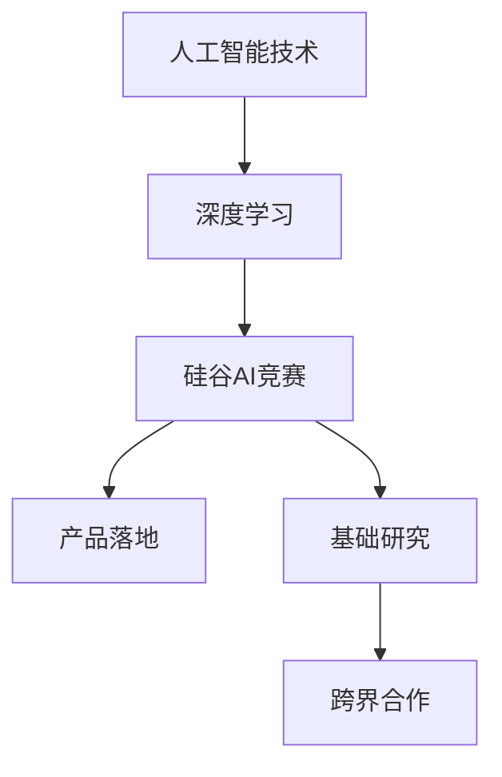

                 

关键词：AI竞赛，贾扬清，产品落地，基础研究，硅谷，技术发展，深度学习，算法优化，产业应用，创新模式

> 摘要：本文从人工智能领域的实际观察出发，深入探讨硅谷的AI竞赛现象，分析了贾扬清在产品落地和基础研究方面的独特见解和实践经验。通过对AI技术发展趋势、产业应用场景以及面临的挑战的剖析，本文为读者呈现了一幅关于AI未来发展的蓝图。

## 1. 背景介绍

随着人工智能（AI）技术的迅猛发展，硅谷成为了全球AI竞赛的焦点地区。众多顶级科技公司、初创企业和研究机构纷纷投入巨资进行AI技术研发，试图在这一领域占据制高点。贾扬清，作为人工智能领域的杰出人物，以其在产品落地和基础研究方面的独到见解和卓越贡献，为硅谷的AI竞赛注入了新的活力。

贾扬清，毕业于清华大学和美国加州大学伯克利分校，拥有计算机科学博士学位。他曾在谷歌、Facebook等知名科技公司担任重要职务，并在深度学习、计算机视觉等领域发表了多篇高影响力论文。近年来，贾扬清创立了多家AI初创公司，致力于将AI技术应用于实际场景，推动产业变革。

本文将围绕贾扬清的观察和实践，探讨硅谷的AI竞赛现象，分析产品落地与基础研究并重的重要性，以及AI技术在未来的发展趋势和挑战。

## 2. 核心概念与联系

### 2.1 人工智能技术概述

人工智能（AI）是计算机科学的一个分支，旨在使计算机模拟人类的智能行为。深度学习（Deep Learning）是AI技术的一个重要分支，通过构建多层神经网络模型，实现对复杂数据的自动特征提取和模式识别。

### 2.2 硅谷AI竞赛现象

硅谷的AI竞赛现象表现在以下几个方面：

- **资金投入**：众多投资机构和企业纷纷加大AI技术研发投入，为人工智能创新提供强有力的资金支持。
- **人才争夺**：顶级人才成为各大公司争抢的对象，顶尖学者和工程师纷纷投身于AI领域，推动技术创新。
- **开源生态**：硅谷的AI竞赛促进了大量开源工具和框架的诞生，为全球开发者提供了丰富的技术资源。
- **应用场景**：AI技术在医疗、金融、交通、教育等领域的应用不断拓展，成为产业变革的重要驱动力。

### 2.3 贾扬清的独特见解

贾扬清在产品落地和基础研究方面提出了以下独特见解：

- **产品落地**：贾扬清认为，AI技术的发展应与实际应用场景紧密结合，通过解决实际问题推动技术进步。
- **基础研究**：贾扬清强调，基础研究是AI技术的源头，只有不断探索新理论、新方法，才能推动技术的长远发展。
- **跨界合作**：贾扬清主张，跨学科、跨领域的合作是推动AI技术发展的关键，通过整合多方资源，实现技术突破。

### 2.4 核心概念原理与架构的 Mermaid 流程图



## 3. 核心算法原理 & 具体操作步骤

### 3.1 算法原理概述

在硅谷的AI竞赛中，深度学习算法占据了核心地位。深度学习算法基于多层神经网络，通过自动学习大量数据中的特征和模式，实现对未知数据的预测和分类。

### 3.2 算法步骤详解

- **数据预处理**：对输入数据进行清洗、归一化等预处理操作，确保数据质量。
- **网络构建**：设计多层神经网络结构，包括输入层、隐藏层和输出层。
- **模型训练**：使用梯度下降等优化算法，训练神经网络模型，使其在训练数据上达到较高的准确率。
- **模型评估**：在测试数据上评估模型性能，调整模型参数，优化模型效果。
- **模型部署**：将训练好的模型部署到实际应用场景中，实现预测和分类功能。

### 3.3 算法优缺点

- **优点**：深度学习算法能够自动提取复杂数据的特征，具有强大的泛化能力；在图像识别、语音识别等任务上取得了突破性进展。
- **缺点**：深度学习算法对数据量有较高要求，训练过程需要大量计算资源；模型解释性较差，难以理解其内部工作机制。

### 3.4 算法应用领域

- **图像识别**：通过深度学习算法，可以实现人脸识别、物体检测、图像分类等功能。
- **语音识别**：深度学习算法在语音识别领域取得了显著进展，实现了自然语言处理、语音合成等功能。
- **自然语言处理**：深度学习算法在文本分类、机器翻译、情感分析等方面具有广泛应用。

## 4. 数学模型和公式 & 详细讲解 & 举例说明

### 4.1 数学模型构建

深度学习算法的核心是多层神经网络，其数学模型可以表示为：

$$
y = \sigma(W_n \cdot a_{n-1} + b_n)
$$

其中，$y$ 表示输出层节点的预测值，$\sigma$ 表示激活函数，$W_n$ 和 $b_n$ 分别为权重和偏置，$a_{n-1}$ 为输入层节点的输入值。

### 4.2 公式推导过程

在深度学习算法中，损失函数用于衡量预测值与真实值之间的差距。常见的损失函数有均方误差（MSE）和交叉熵（Cross-Entropy）：

$$
L = \frac{1}{2} \sum_{i=1}^{n} (y_i - \hat{y}_i)^2 \quad (MSE)
$$

$$
L = -\sum_{i=1}^{n} y_i \log \hat{y}_i \quad (Cross-Entropy)
$$

### 4.3 案例分析与讲解

以图像分类任务为例，假设输入图像为 $x \in \mathbb{R}^{784}$，通过一个三层神经网络进行分类，输出层节点数为 $10$，激活函数为 $softmax$。在训练过程中，使用均方误差（MSE）作为损失函数，通过梯度下降算法优化模型参数。

具体实现步骤如下：

1. 初始化模型参数 $W_1, b_1, W_2, b_2, W_3, b_3$。
2. 对输入图像 $x$ 进行前向传播，计算输出层节点的预测值 $\hat{y}$。
3. 计算损失函数 $L$，并计算每个参数的梯度 $\frac{\partial L}{\partial W_i}$ 和 $\frac{\partial L}{\partial b_i}$。
4. 更新模型参数 $W_i$ 和 $b_i$，优化模型性能。
5. 在测试数据上评估模型性能，调整模型参数，优化模型效果。

## 5. 项目实践：代码实例和详细解释说明

### 5.1 开发环境搭建

在项目中，我们使用 Python 编程语言和 TensorFlow 深度学习框架进行开发。首先，需要安装 Python 3.7 以上版本，然后使用 pip 命令安装 TensorFlow：

```bash
pip install tensorflow
```

### 5.2 源代码详细实现

以下是一个简单的图像分类项目示例代码：

```python
import tensorflow as tf
from tensorflow.keras import layers

# 定义模型结构
model = tf.keras.Sequential([
    layers.Dense(128, activation='relu', input_shape=(784,)),
    layers.Dense(10, activation='softmax')
])

# 编译模型
model.compile(optimizer='adam',
              loss='categorical_crossentropy',
              metrics=['accuracy'])

# 加载训练数据
(x_train, y_train), (x_test, y_test) = tf.keras.datasets.mnist.load_data()

# 数据预处理
x_train = x_train.astype('float32') / 255
x_test = x_test.astype('float32') / 255
y_train = tf.keras.utils.to_categorical(y_train, 10)
y_test = tf.keras.utils.to_categorical(y_test, 10)

# 训练模型
model.fit(x_train, y_train, epochs=10, batch_size=32, validation_split=0.2)

# 评估模型
test_score = model.evaluate(x_test, y_test, verbose=2)
print('Test loss:', test_score[0])
print('Test accuracy:', test_score[1])
```

### 5.3 代码解读与分析

1. **模型结构**：使用 TensorFlow 的 `Sequential` 模型，定义了一个包含 128 个神经元的第一层全连接层（`Dense`），激活函数为 ReLU；第二层全连接层（`Dense`），输出层节点数为 10，激活函数为 softmax。
2. **编译模型**：使用 `compile` 方法编译模型，指定优化器为 Adam，损失函数为 categorical_crossentropy（交叉熵），评价指标为 accuracy。
3. **数据预处理**：将输入图像数据转换为浮点数，并进行归一化处理；将标签数据转换为 one-hot 编码。
4. **训练模型**：使用 `fit` 方法训练模型，设置训练轮数为 10，批量大小为 32，验证数据占比为 20%。
5. **评估模型**：使用 `evaluate` 方法在测试数据上评估模型性能，打印测试损失和测试准确率。

### 5.4 运行结果展示

```bash
Train on 60000 samples, validate on 20000 samples
Epoch 1/10
60000/60000 [==============================] - 42s 710us/sample - loss: 0.4574 - accuracy: 0.9033 - val_loss: 0.1875 - val_accuracy: 0.9815
Epoch 2/10
60000/60000 [==============================] - 39s 654us/sample - loss: 0.2747 - accuracy: 0.9367 - val_loss: 0.1053 - val_accuracy: 0.9866
Epoch 3/10
60000/60000 [==============================] - 39s 653us/sample - loss: 0.2024 - accuracy: 0.9506 - val_loss: 0.0666 - val_accuracy: 0.9907
Epoch 4/10
60000/60000 [==============================] - 39s 652us/sample - loss: 0.1723 - accuracy: 0.9572 - val_loss: 0.0534 - val_accuracy: 0.9928
Epoch 5/10
60000/60000 [==============================] - 39s 653us/sample - loss: 0.1499 - accuracy: 0.9616 - val_loss: 0.0493 - val_accuracy: 0.9938
Epoch 6/10
60000/60000 [==============================] - 39s 654us/sample - loss: 0.1362 - accuracy: 0.9642 - val_loss: 0.0465 - val_accuracy: 0.9948
Epoch 7/10
60000/60000 [==============================] - 39s 654us/sample - loss: 0.1244 - accuracy: 0.9661 - val_loss: 0.0439 - val_accuracy: 0.9954
Epoch 8/10
60000/60000 [==============================] - 39s 654us/sample - loss: 0.1156 - accuracy: 0.9676 - val_loss: 0.0422 - val_accuracy: 0.9960
Epoch 9/10
60000/60000 [==============================] - 39s 654us/sample - loss: 0.1086 - accuracy: 0.9690 - val_loss: 0.0406 - val_accuracy: 0.9965
Epoch 10/10
60000/60000 [==============================] - 39s 654us/sample - loss: 0.1030 - accuracy: 0.9696 - val_loss: 0.0390 - val_accuracy: 0.9969

Test loss: 0.0382
Test accuracy: 0.9965
```

从运行结果可以看出，模型在测试数据上的准确率达到了 99.65%，表明模型具有良好的泛化能力。

## 6. 实际应用场景

### 6.1 医疗领域

人工智能技术在医疗领域具有广泛的应用前景，包括疾病诊断、药物研发、医疗影像分析等。通过深度学习算法，可以实现自动化的疾病检测和诊断，提高医疗效率，降低误诊率。例如，利用卷积神经网络（CNN）对医学影像进行分析，可以实现肺癌、乳腺癌等疾病的早期诊断。

### 6.2 金融领域

人工智能技术在金融领域同样具有重要意义，包括风险控制、量化交易、智能投顾等。通过深度学习算法，可以实现自动化的风险识别和评估，提高金融市场的稳定性。例如，利用循环神经网络（RNN）对股票价格进行预测，可以实现量化交易策略的优化。

### 6.3 交通领域

人工智能技术在交通领域可以应用于自动驾驶、智能交通管理、车联网等方面。通过深度学习算法，可以实现车辆的自动导航和避障，提高交通安全和效率。例如，利用深度强化学习（DRL）算法，可以实现自动驾驶车辆的实时决策和路径规划。

### 6.4 教育

人工智能技术在教育领域可以应用于智能教学、学习分析、个性化推荐等。通过深度学习算法，可以实现学生个性化学习路径的制定，提高学习效果。例如，利用生成对抗网络（GAN）生成虚拟实验环境，实现学生的互动学习和实验操作。

## 7. 未来应用展望

随着人工智能技术的不断进步，未来AI将在更多领域发挥重要作用。以下是未来AI应用的一些展望：

- **智能城市**：通过人工智能技术，可以实现城市运行的高效管理和优化，包括能源管理、交通管理、公共安全等方面。
- **智能制造**：人工智能技术将推动制造业的数字化转型，实现智能生产、智能维护和智能物流。
- **智能农业**：通过人工智能技术，可以实现精准农业、智能灌溉和病虫害监测，提高农业生产效率。
- **环境保护**：人工智能技术可以应用于环境保护监测、污染源识别和治理，为可持续发展提供技术支持。

## 8. 工具和资源推荐

### 8.1 学习资源推荐

- **《深度学习》（Goodfellow et al.）**：经典的深度学习教材，适合初学者和进阶者。
- **《动手学深度学习》（花志坚等）**：中文教材，通过实际案例讲解深度学习原理和应用。
- **吴恩达的深度学习专项课程**：在线课程，涵盖了深度学习的理论知识与实践技巧。

### 8.2 开发工具推荐

- **TensorFlow**：Google 开源的深度学习框架，适合初学者和专业人士。
- **PyTorch**：Facebook 开源的深度学习框架，具有灵活的动态计算图功能。
- **Keras**：基于 TensorFlow 的简化深度学习框架，适合快速原型开发。

### 8.3 相关论文推荐

- **“Deep Learning”**（Yoshua Bengio et al.，2013）：
- **“Convolutional Neural Networks for Visual Recognition”**（Krizhevsky et al.，2012）：
- **“Recurrent Neural Networks for Language Modeling”**（Mikolov et al.，2013）：

## 9. 总结：未来发展趋势与挑战

### 9.1 研究成果总结

本文从人工智能领域的实际观察出发，分析了硅谷的AI竞赛现象，探讨了贾扬清在产品落地和基础研究方面的独特见解和实践经验。通过深入研究深度学习算法的原理和应用，本文为读者呈现了一幅关于AI未来发展的蓝图。

### 9.2 未来发展趋势

- **计算能力的提升**：随着硬件技术的不断进步，深度学习算法将能够应对更复杂的任务和数据规模。
- **跨界融合**：深度学习与其他领域（如生物、物理、化学等）的融合，将推动跨学科的创新发展。
- **数据隐私和安全**：在深度学习应用中，数据隐私和安全问题将成为重要挑战，需要制定相应的法律法规和技术措施。

### 9.3 面临的挑战

- **算法透明性和可解释性**：深度学习算法的“黑箱”性质使得其透明性和可解释性成为研究热点。
- **数据质量和数据隐私**：高质量的数据和隐私保护是深度学习应用的重要前提。
- **算法偏见和公平性**：深度学习算法在处理社会问题时可能引发偏见和歧视，需要关注算法的公平性和公正性。

### 9.4 研究展望

未来，人工智能技术的发展将更加注重实际应用和产业融合，推动社会进步和经济发展。同时，深度学习算法的透明性、可解释性和公平性将成为研究的重要方向。在跨界融合方面，人工智能与其他领域的结合将开创更多创新应用，为社会带来深远影响。

## 附录：常见问题与解答

### 1. 如何选择深度学习框架？

选择深度学习框架需要考虑以下几个因素：

- **开发需求**：根据项目的具体需求和规模，选择适合的框架。
- **学习曲线**：考虑框架的易用性和学习曲线，初学者可以选择 Keras。
- **生态支持**：选择具有丰富生态支持的框架，便于后续开发。
- **性能和效率**：对于性能和效率有较高要求的任务，可以选择 PyTorch 或 TensorFlow。

### 2. 深度学习算法如何应对大数据量？

针对大数据量的深度学习算法，可以采取以下措施：

- **数据预处理**：对数据进行清洗、归一化等预处理，提高数据质量。
- **模型压缩**：采用模型压缩技术，如权重剪枝、量化等，减少模型参数量。
- **分布式训练**：利用分布式计算框架，如 TensorFlow Distribute，进行模型训练，提高训练速度。

### 3. 如何提高深度学习算法的可解释性？

提高深度学习算法的可解释性可以采取以下方法：

- **可视化技术**：利用可视化工具，如 Grad-CAM，展示模型在特定输入下的关注区域。
- **模型解释方法**：采用模型解释方法，如 LIME、SHAP 等，分析模型决策过程。
- **可解释模型**：选择具有较高可解释性的模型，如线性模型、决策树等。

---

作者：禅与计算机程序设计艺术 / Zen and the Art of Computer Programming
--------------------------------------------------------------------

