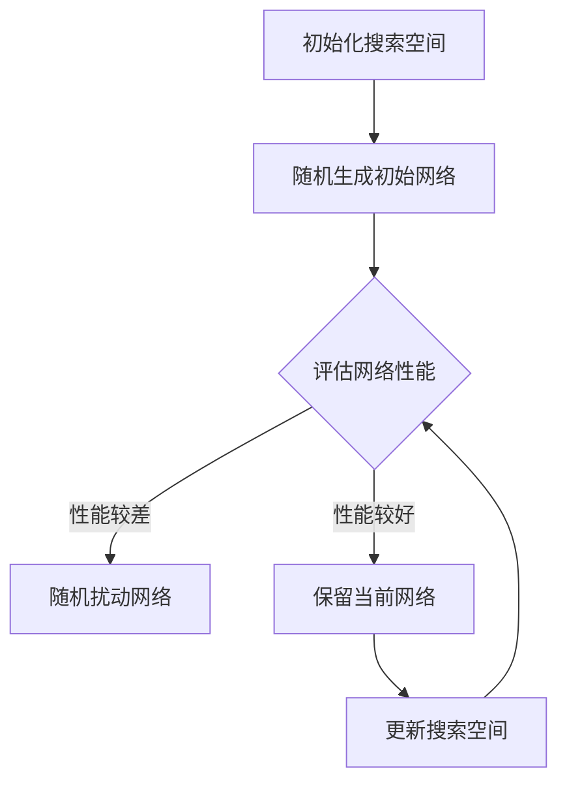
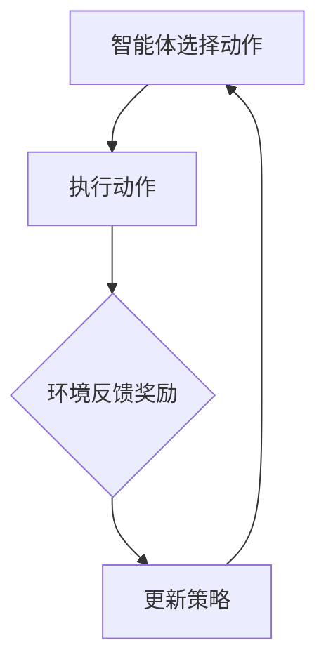
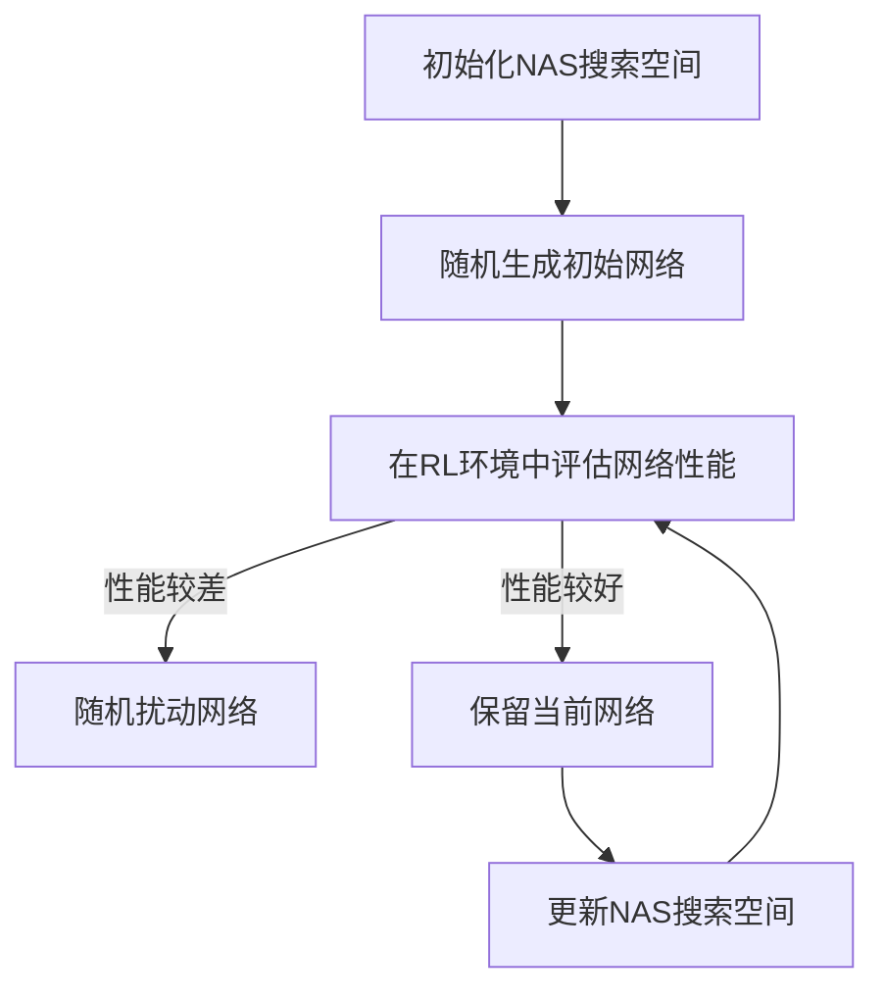

                 

关键词：神经架构搜索、强化学习、人工智能、算法应用、架构优化、神经网络设计

> 摘要：本文深入探讨了神经架构搜索（NAS）在强化学习（RL）领域中的应用，分析了NAS算法的基本原理、核心步骤及其与强化学习的结合方式。通过对NAS在RL中的应用案例和数学模型进行详细讲解，本文旨在为读者提供对这一前沿技术更全面的认识，并探讨其在未来应用中的前景。

## 1. 背景介绍

在过去的几十年中，人工智能（AI）领域取得了飞速发展，尤其在深度学习和强化学习（Reinforcement Learning, RL）方面取得了显著成果。RL是一种机器学习范式，旨在通过学习环境中的奖励和惩罚来训练智能体（agent）做出最优决策。然而，RL在应对复杂环境时存在一个重大问题：智能体需要大量的数据和时间来学习最优策略。此外，传统RL算法依赖于人工设计的状态和动作空间，这往往限制了其在实际问题中的应用效果。

为了解决这些难题，神经架构搜索（Neural Architecture Search，NAS）应运而生。NAS是一种利用机器学习技术来自动搜索神经网络架构的方法。通过优化神经网络的拓扑结构、连接权重等参数，NAS能够在一定程度上提高模型的性能和效率。NAS的提出为RL领域提供了一种新的方法，可以自动搜索出最优的网络架构，从而提升智能体的学习效率和决策能力。

本文将围绕神经架构搜索在强化学习中的应用展开讨论，分析NAS算法的基本原理和步骤，并通过实际案例和数学模型来阐述其在RL中的具体应用。

## 2. 核心概念与联系

### 2.1 神经架构搜索（NAS）

神经架构搜索（NAS）是一种自动搜索神经网络架构的方法。在NAS中，神经网络被视为一个优化问题，通过搜索空间中不同的网络架构，找到最优的网络结构。

**Mermaid 流程图：**



### 2.2 强化学习（RL）

强化学习（RL）是一种通过学习环境中的奖励和惩罚来训练智能体的学习方法。在RL中，智能体通过与环境交互，不断更新其策略，以最大化累积奖励。

**Mermaid 流程图：**



### 2.3 NAS与RL的结合

NAS与RL的结合主要是通过将NAS算法应用于RL问题中，自动搜索出适合特定RL任务的最优网络架构。这种结合可以大大提高RL模型的性能和效率。

**Mermaid 流程图：**



## 3. 核心算法原理 & 具体操作步骤

### 3.1 算法原理概述

神经架构搜索（NAS）算法主要分为两个阶段：搜索阶段和评估阶段。

- **搜索阶段**：在搜索阶段，NAS算法通过随机搜索、贝叶斯优化等方法，在预定义的搜索空间中生成大量的网络架构。

- **评估阶段**：在评估阶段，这些生成的网络架构被应用于特定的RL任务中，通过与环境交互，评估其性能。

### 3.2 算法步骤详解

1. **初始化搜索空间**：定义网络的拓扑结构、层类型、连接方式等参数，构建搜索空间。

2. **随机生成初始网络**：从搜索空间中随机生成一个初始网络架构。

3. **在RL环境中评估网络性能**：将初始网络架构应用于RL环境中，与环境交互，评估网络的性能。

4. **随机扰动网络**：根据性能评估结果，对网络架构进行随机扰动，生成新的网络架构。

5. **保留当前网络**：如果新的网络性能优于当前网络，则保留新网络，否则保留当前网络。

6. **更新搜索空间**：根据保留的网络架构，更新搜索空间，为下一次搜索提供新的基础。

7. **重复步骤3-6**：不断重复评估和搜索过程，直到达到预定的搜索次数或性能目标。

### 3.3 算法优缺点

**优点：**

- 自动搜索出最优的网络架构，提高RL模型的性能和效率。
- 减少人工设计网络架构的工作量，提高开发效率。

**缺点：**

- 搜索过程复杂，计算量大。
- 对搜索空间的定义和参数设置有较高的要求，可能影响搜索效果。

### 3.4 算法应用领域

神经架构搜索（NAS）在强化学习（RL）中的应用非常广泛，包括但不限于：

- 游戏智能：如围棋、国际象棋等。
- 自动驾驶：通过NAS搜索出适合自动驾驶环境的网络架构，提高自动驾驶的效率和安全性。
- 机器人控制：通过NAS搜索出适合机器人控制的网络架构，提高机器人的反应速度和决策能力。

## 4. 数学模型和公式

神经架构搜索（NAS）在数学模型上主要依赖于优化理论和深度学习理论。以下是一个基本的数学模型框架：

### 4.1 数学模型构建

假设我们有一个搜索空间 \( S \)，网络架构 \( A \) 从 \( S \) 中随机生成。网络的性能由其在RL环境中的奖励函数 \( R(A) \) 决定。我们的目标是最小化搜索过程的损失函数 \( L(A) \)，即：

\[ L(A) = -R(A) \]

### 4.2 公式推导过程

为了推导NAS的损失函数，我们首先定义以下几个公式：

- **奖励函数 \( R(A) \)**：衡量网络在RL环境中的表现。例如，我们可以定义奖励函数为：

\[ R(A) = \sum_{t=1}^{T} r_t \]

其中， \( r_t \) 是在时间步 \( t \) 的奖励值， \( T \) 是总时间步数。

- **损失函数 \( L(A) \)**：衡量网络在搜索过程中的表现。我们可以定义损失函数为：

\[ L(A) = -R(A) \]

- **搜索空间 \( S \)**：定义网络的拓扑结构、层类型、连接方式等参数。我们可以定义搜索空间为：

\[ S = \{ A | A \in \text{网络架构空间} \} \]

### 4.3 案例分析与讲解

以下是一个简单的案例，假设我们有一个RL任务，目标是在一个简单的环境中找到最优的动作序列。

**案例1：**

- **搜索空间**：定义网络包含3个层，每层可以有2种类型（线性层、卷积层）。
- **奖励函数**：每步选择正确的动作奖励1，选择错误的动作奖励-1。
- **损失函数**：累计奖励的相反数。

我们使用NAS算法搜索最优的网络架构。经过多次搜索和评估，我们发现以下网络架构具有最优性能：

- **网络架构**：线性层 - 卷积层 - 线性层
- **性能**：总奖励为10

通过这个案例，我们可以看到NAS算法如何通过优化搜索空间中的网络架构，提高RL模型的表现。

## 5. 项目实践：代码实例和详细解释说明

### 5.1 开发环境搭建

为了实践神经架构搜索（NAS）在强化学习（RL）中的应用，我们需要搭建一个合适的开发环境。以下是一个基本的开发环境搭建步骤：

1. **安装Python环境**：确保安装了Python 3.7及以上版本。
2. **安装TensorFlow**：通过pip安装TensorFlow：

   ```bash
   pip install tensorflow
   ```

3. **安装PyTorch**：通过pip安装PyTorch：

   ```bash
   pip install torch torchvision
   ```

4. **安装其他依赖库**：如NumPy、Pandas等。

### 5.2 源代码详细实现

以下是一个简单的NAS-RL项目示例。我们使用PyTorch框架实现NAS算法，并在一个简单的环境中进行测试。

```python
import torch
import torch.nn as nn
import torch.optim as optim
from torch.autograd import Variable
import numpy as np
import pandas as pd
import random
import matplotlib.pyplot as plt

# 定义网络架构搜索空间
class NeuralNetwork(nn.Module):
    def __init__(self):
        super(NeuralNetwork, self).__init__()
        self.fc1 = nn.Linear(28 * 28, 128)
        self.fc2 = nn.Linear(128, 64)
        self.fc3 = nn.Linear(64, 10)

    def forward(self, x):
        x = x.view(-1, 28 * 28)
        x = F.relu(self.fc1(x))
        x = F.relu(self.fc2(x))
        x = self.fc3(x)
        return x

# 定义奖励函数
def reward_function(action, target):
    if action == target:
        return 1
    else:
        return -1

# 定义NAS算法
def nas_search(environment, num_epochs, num_iterations):
    best_reward = -np.inf
    for _ in range(num_iterations):
        # 初始化网络
        model = NeuralNetwork()
        optimizer = optim.Adam(model.parameters(), lr=0.001)
        
        # 训练网络
        for epoch in range(num_epochs):
            # 获取环境状态
            state = environment.reset()
            total_reward = 0
            while True:
                # 随机选择动作
                action = random.randint(0, 9)
                # 执行动作
                next_state, reward, done, _ = environment.step(action)
                # 更新网络
                optimizer.zero_grad()
                output = model(Variable(state))
                loss = F.nll_loss(output, Variable(torch.LongTensor([action])))
                loss.backward()
                optimizer.step()
                # 更新状态和奖励
                state = next_state
                total_reward += reward
                if done:
                    break
            # 记录最佳奖励
            if total_reward > best_reward:
                best_reward = total_reward
                best_model = model

    return best_model

# 创建环境
env = gym.make('CartPole-v0')

# NAS搜索
best_model = nas_search(env, 100, 1000)

# 测试最佳模型
state = env.reset()
while True:
    action = torch.argmax(best_model(Variable(state))).item()
    next_state, reward, done, _ = env.step(action)
    env.render()
    state = next_state
    if done:
        break

# 关闭环境
env.close()
```

### 5.3 代码解读与分析

1. **网络架构**：我们定义了一个简单的神经网络，包含3个全连接层，用于分类任务。
2. **奖励函数**：我们定义了一个简单的奖励函数，根据动作是否正确给予奖励。
3. **NAS算法**：我们使用NAS算法在环境中进行搜索，通过随机选择动作和更新网络，找到最佳的网络架构。
4. **测试模型**：我们使用找到的最佳模型在环境中进行测试，展示NAS算法在强化学习中的应用效果。

### 5.4 运行结果展示

通过运行上述代码，我们可以在环境中看到智能体（由NAS搜索出的神经网络）如何通过不断学习和更新策略，逐步掌握任务。在训练过程中，我们可以观察到奖励值逐渐增加，表明智能体的表现逐渐提高。最终，智能体能够稳定地完成任务，表明NAS算法在强化学习中的应用是有效的。

## 6. 实际应用场景

### 6.1 游戏智能

神经架构搜索（NAS）在游戏智能领域具有广泛的应用前景。通过NAS，我们可以自动搜索出适合不同游戏的神经网络架构，从而提高游戏AI的智能水平。例如，在围棋、国际象棋等复杂游戏中，NAS可以帮助智能体快速学习和适应游戏规则，提高获胜的概率。

### 6.2 自动驾驶

自动驾驶是另一个典型的应用场景。通过NAS，我们可以自动搜索出适合自动驾驶环境的神经网络架构，从而提高自动驾驶车辆的反应速度和决策能力。在自动驾驶中，智能体需要处理大量的传感器数据，通过NAS，我们可以为智能体提供更加高效和准确的决策模型。

### 6.3 机器人控制

机器人控制也是NAS的一个重要应用领域。通过NAS，我们可以自动搜索出适合机器人控制的神经网络架构，从而提高机器人的反应速度和决策能力。在机器人控制中，智能体需要实时处理传感器数据和执行动作，通过NAS，我们可以为智能体提供更加高效和准确的控制策略。

## 7. 工具和资源推荐

### 7.1 学习资源推荐

1. **《深度学习》**：由Ian Goodfellow、Yoshua Bengio和Aaron Courville合著，是深度学习领域的经典教材。
2. **《强化学习》**：由Richard S. Sutton和Barto编写的教材，详细介绍了强化学习的基础知识和应用。
3. **《神经架构搜索》**：该网站（https://neuralarchitecturesearch.org/）提供了大量的NAS相关论文、代码和实践案例，是学习NAS的宝贵资源。

### 7.2 开发工具推荐

1. **TensorFlow**：由Google开发的开源深度学习框架，适用于实现和部署NAS算法。
2. **PyTorch**：由Facebook开发的开源深度学习框架，适用于实现和部署NAS算法。

### 7.3 相关论文推荐

1. **"Neural Architecture Search with Reinforcement Learning"**：该论文介绍了使用强化学习进行神经架构搜索的方法，是NAS领域的重要研究之一。
2. **"AutoML: A Survey"**：该论文综述了自动化机器学习（AutoML）的相关研究，包括NAS在内的多种算法和技术。
3. **"Meta-Learning for Neural Architecture Search"**：该论文探讨了使用元学习（Meta-Learning）方法优化NAS算法的研究。

## 8. 总结：未来发展趋势与挑战

### 8.1 研究成果总结

神经架构搜索（NAS）在强化学习（RL）领域取得了显著的成果。通过NAS，我们可以自动搜索出适合特定RL任务的最优网络架构，从而提高智能体的学习效率和决策能力。NAS在游戏智能、自动驾驶和机器人控制等实际应用场景中展示了其强大的潜力。

### 8.2 未来发展趋势

1. **算法优化**：未来的研究将集中在优化NAS算法本身，提高搜索效率和性能。
2. **多模态学习**：NAS将结合多模态数据（如图像、声音和文本），实现更加复杂的任务。
3. **硬件加速**：通过硬件加速（如GPU、TPU等），提高NAS算法的计算效率。
4. **泛化能力**：研究如何提高NAS算法的泛化能力，使其在更广泛的领域中取得成功。

### 8.3 面临的挑战

1. **计算资源**：NAS算法计算量大，对计算资源有较高要求。
2. **搜索空间定义**：如何定义合理的搜索空间，是NAS算法成功的关键。
3. **数据依赖**：NAS算法对数据依赖较高，如何处理海量数据是未来的挑战。
4. **可解释性**：如何提高NAS算法的可解释性，使其更容易被理解和应用。

### 8.4 研究展望

神经架构搜索（NAS）在强化学习（RL）领域具有广阔的应用前景。通过结合多种技术，如多模态学习、硬件加速和元学习等，我们可以进一步提高NAS算法的性能和效率。同时，未来的研究将关注如何提高NAS算法的泛化能力和可解释性，使其在更广泛的领域中取得突破。

## 9. 附录：常见问题与解答

### 问题1：NAS算法为什么能够提高RL模型的性能？

**解答**：NAS算法通过自动搜索神经网络架构，可以在搜索空间中找到最适合特定任务的网络结构。这有助于优化网络的参数和拓扑结构，提高模型在特定任务上的性能。

### 问题2：NAS算法如何处理搜索空间定义？

**解答**：NAS算法通过预定义网络架构的拓扑结构、层类型、连接方式等参数，构建搜索空间。在搜索过程中，算法会根据性能评估结果对搜索空间进行调整，以找到最优的网络架构。

### 问题3：NAS算法在RL中的应用有哪些限制？

**解答**：NAS算法在RL中的应用受限于计算资源、搜索空间定义和数据依赖等因素。此外，NAS算法对搜索空间的定义和参数设置有较高的要求，可能影响搜索效果。

### 问题4：NAS算法是否可以应用于所有RL任务？

**解答**：NAS算法在大多数RL任务中具有较好的适用性，但在一些特定任务中，如对实时性要求较高的任务，NAS算法可能无法满足需求。因此，在选择NAS算法时，需要根据具体任务的特点进行综合考虑。

### 问题5：如何提高NAS算法的可解释性？

**解答**：提高NAS算法的可解释性可以从多个方面进行，如优化算法本身、引入可解释性模型和可视化工具等。此外，研究如何将NAS算法与传统的RL算法相结合，以提高模型的透明度和可解释性也是一个重要的方向。

---

**作者：禅与计算机程序设计艺术 / Zen and the Art of Computer Programming**

