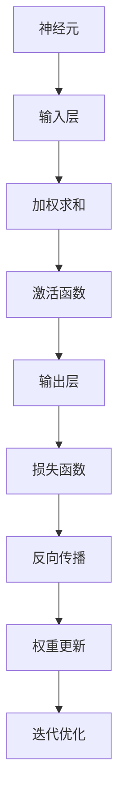

                 

## 1. 背景介绍

神经网络（Neural Networks，简称NN）是人工智能（AI）领域的一个重要分支，其灵感来源于生物神经网络的结构和功能。自1986年首次提出反向传播算法（Backpropagation Algorithm）以来，神经网络在诸多领域如计算机视觉、自然语言处理、语音识别等方面取得了显著的进展。随着计算能力的提升和数据规模的扩大，神经网络已经成为现代人工智能的核心技术之一。

本文将介绍神经网络的基本原理、核心概念、算法步骤、数学模型、代码实现以及实际应用场景。通过对神经网络的深入理解，读者将能够掌握这一强大的工具，并在实际项目中应用它。

## 2. 核心概念与联系

神经网络由大量简单的人工神经元（artificial neuron）组成，这些神经元通过相互连接形成一个复杂的网络结构。以下是神经网络中的几个核心概念：

### 2.1 神经元

神经元是神经网络的基本单元，它接收输入信号，通过加权求和和激活函数产生输出。一个简单的神经元模型可以表示为：

$$
y = \sigma(\sum_{i=1}^{n} w_i x_i + b)
$$

其中，$y$是神经元输出，$x_i$是第$i$个输入，$w_i$是连接权重，$\sigma$是激活函数，$b$是偏置。

### 2.2 激活函数

激活函数是神经元输出中的关键部分，它用于引入非线性。常见的激活函数包括：

- **Sigmoid函数**：$ \sigma(x) = \frac{1}{1 + e^{-x}} $

- **ReLU函数**：$ \text{ReLU}(x) = \max(0, x) $

- **Tanh函数**：$ \tanh(x) = \frac{e^x - e^{-x}}{e^x + e^{-x}} $

### 2.3 网络结构

神经网络可以分为多种结构，其中最常见的是前馈神经网络（Feedforward Neural Network）。这种网络结构中，信息从输入层流向输出层，中间经过若干隐藏层。每一层的神经元都与下一层的神经元相连接。


### 2.4 权重与偏置

权重（weights）和偏置（biases）是神经网络中的参数，它们通过学习过程进行调整，以使网络能够对输入数据进行分类或回归。这些参数的调整通常通过梯度下降（Gradient Descent）算法进行。

### 2.5 学习过程

神经网络的学习过程通常包括以下几个步骤：

1. **前向传播**：将输入数据通过网络进行传播，计算每个神经元的输出。
2. **计算损失**：使用损失函数（如均方误差（MSE）或交叉熵（Cross-Entropy））计算输出与真实值之间的差距。
3. **反向传播**：根据损失函数的梯度，通过反向传播算法更新权重和偏置。
4. **迭代优化**：重复前向传播和反向传播，直到满足停止条件（如损失函数收敛）。

### 2.6 Mermaid 流程图

以下是神经网络核心概念与联系的一个简单的Mermaid流程图：



### 2.7 小结

通过以上对神经网络核心概念的介绍，我们可以看到神经网络是如何通过简单的神经元和权重调整来实现复杂的任务。接下来，我们将深入探讨神经网络的核心算法原理与具体操作步骤。<!-- msub -->## 2. 核心概念与联系（备注：必须给出核心概念原理和架构的 Mermaid 流程图(Mermaid 流程节点中不要有括号、逗号等特殊字符)

## 3. 核心算法原理 & 具体操作步骤
### 3.1 算法原理概述

神经网络算法的核心思想是通过调整网络中的权重和偏置来使网络能够对输入数据进行分类或回归。这一过程主要包括两个步骤：前向传播和反向传播。

#### 前向传播

在前向传播过程中，输入数据从输入层传递到输出层，每一层的神经元都会进行加权求和并应用激活函数，最终得到输出结果。这个过程可以用以下步骤表示：

1. **初始化参数**：设定初始权重和偏置。
2. **前向计算**：计算每一层的输出。
3. **应用激活函数**：对每个神经元的输出应用激活函数。
4. **输出结果**：输出最终结果。

#### 反向传播

反向传播是神经网络的训练过程，其目的是通过计算损失函数的梯度来更新权重和偏置。反向传播包括以下几个步骤：

1. **计算损失**：使用损失函数（如均方误差（MSE）或交叉熵（Cross-Entropy））计算输出与真实值之间的差距。
2. **计算梯度**：根据损失函数的梯度，计算每个权重和偏置的梯度。
3. **更新参数**：使用梯度下降算法（或其他优化算法）更新权重和偏置。
4. **迭代优化**：重复前向传播和反向传播，直到满足停止条件（如损失函数收敛）。

### 3.2 算法步骤详解

#### 前向传播

前向传播的具体步骤如下：

1. **初始化参数**：设定初始权重$W$和偏置$b$。
2. **输入数据**：将输入数据$x$传递到输入层。
3. **逐层计算**：从输入层开始，依次计算每一层的输出：
    $$ z_l = \sigma(W_l \cdot a_{l-1} + b_l) $$
    其中，$a_l$是第$l$层的输入，$z_l$是第$l$层的输出。
4. **应用激活函数**：对每个神经元的输出应用激活函数$\sigma$。
5. **输出结果**：输出最终结果$y$。

#### 反向传播

反向传播的具体步骤如下：

1. **计算损失**：使用损失函数$L$计算输出与真实值之间的差距。
2. **计算梯度**：根据损失函数的梯度，计算每个权重和偏置的梯度。以均方误差（MSE）为例，损失函数的梯度为：
    $$ \frac{\partial L}{\partial W} = \frac{1}{m} X^T (X \cdot a^{l-1} - y) $$
    $$ \frac{\partial L}{\partial b} = \frac{1}{m} (X \cdot a^{l-1} - y) $$
    其中，$m$是样本数量，$X$是输入矩阵，$a^{l-1}$是第$l-1$层的输出。
3. **更新参数**：使用梯度下降算法更新权重和偏置。以均方误差为例，更新公式为：
    $$ W_{\text{new}} = W_{\text{old}} - \alpha \frac{\partial L}{\partial W} $$
    $$ b_{\text{new}} = b_{\text{old}} - \alpha \frac{\partial L}{\partial b} $$
    其中，$\alpha$是学习率。
4. **迭代优化**：重复前向传播和反向传播，直到满足停止条件（如损失函数收敛）。

### 3.3 算法优缺点

#### 优点

1. **强大的非线性建模能力**：神经网络可以通过多层非线性变换来实现复杂的函数建模。
2. **自适应调整**：神经网络可以通过学习过程自适应地调整权重和偏置，以优化模型性能。
3. **适用范围广泛**：神经网络在计算机视觉、自然语言处理、语音识别等领域有广泛应用。

#### 缺点

1. **计算成本高**：神经网络训练过程需要大量的计算资源，尤其在大型网络中。
2. **参数调优复杂**：网络参数（如学习率、批次大小等）的调优过程比较复杂。
3. **过拟合风险**：神经网络容易过拟合，需要使用正则化方法来缓解。

### 3.4 算法应用领域

神经网络的应用领域广泛，主要包括：

1. **计算机视觉**：图像分类、目标检测、人脸识别等。
2. **自然语言处理**：文本分类、机器翻译、语音识别等。
3. **语音识别**：语音信号处理、语音合成等。
4. **推荐系统**：个性化推荐、商品推荐等。

### 3.5 小结

通过以上对神经网络核心算法原理和具体操作步骤的介绍，我们可以看到神经网络是如何通过前向传播和反向传播来实现模型训练和优化的。接下来，我们将深入探讨神经网络的数学模型和公式。<!-- msub -->## 4. 数学模型和公式 & 详细讲解 & 举例说明

### 4.1 数学模型构建

神经网络的基本数学模型可以看作是一个多层感知机（MLP），其结构包括输入层、若干隐藏层和输出层。每个神经元在传递信息时都会进行加权求和并应用激活函数。以下是神经网络模型的数学描述：

#### 前向传播

假设神经网络有$l$层，第$l$层的输出可以表示为：

$$
z_l = W_l \cdot a_{l-1} + b_l
$$

其中，$W_l$是第$l$层的权重矩阵，$a_{l-1}$是第$l-1$层的输出，$b_l$是第$l$层的偏置向量。对于激活函数$\sigma$，常用的有Sigmoid、ReLU和Tanh函数。应用激活函数后，第$l$层的输出变为：

$$
a_l = \sigma(z_l)
$$

递归地进行前向传播，可以得到第$l$层的输出：

$$
a_l = \sigma(W_l \cdot a_{l-1} + b_l)
$$

#### 反向传播

反向传播过程中，我们需要计算损失函数的梯度，并使用梯度下降算法更新权重和偏置。假设损失函数为$L$，则：

$$
\frac{\partial L}{\partial W} = \frac{1}{m} X^T (X \cdot a^{l-1} - y)
$$

$$
\frac{\partial L}{\partial b} = \frac{1}{m} (X \cdot a^{l-1} - y)
$$

其中，$m$是样本数量，$X$是输入矩阵，$a^{l-1}$是第$l-1$层的输出，$y$是真实值。

使用梯度下降算法更新权重和偏置：

$$
W_{\text{new}} = W_{\text{old}} - \alpha \frac{\partial L}{\partial W}
$$

$$
b_{\text{new}} = b_{\text{old}} - \alpha \frac{\partial L}{\partial b}
$$

其中，$\alpha$是学习率。

### 4.2 公式推导过程

以下是神经网络中几个关键公式的推导过程：

#### 前向传播

1. **输入层到隐藏层**

$$
z_l = W_l \cdot a_{l-1} + b_l
$$

$$
a_l = \sigma(z_l)
$$

2. **隐藏层到输出层**

$$
z_{\text{out}} = W_{\text{out}} \cdot a_{\text{hidden}} + b_{\text{out}}
$$

$$
y = \sigma(z_{\text{out}})
$$

#### 反向传播

1. **输出层梯度**

$$
\frac{\partial L}{\partial z_{\text{out}}} = \frac{\partial L}{\partial y} \cdot \frac{\partial y}{\partial z_{\text{out}}} = \frac{\partial L}{\partial y} \cdot \sigma'(z_{\text{out}})
$$

2. **隐藏层梯度**

$$
\frac{\partial L}{\partial z_{\text{hidden}}} = \frac{\partial L}{\partial z_{\text{out}}} \cdot \frac{\partial z_{\text{out}}}{\partial z_{\text{hidden}}} = \frac{\partial L}{\partial z_{\text{out}}} \cdot W_{\text{out}}^T
$$

3. **权重和偏置更新**

$$
\frac{\partial L}{\partial W} = \frac{1}{m} X^T (X \cdot a^{l-1} - y)
$$

$$
\frac{\partial L}{\partial b} = \frac{1}{m} (X \cdot a^{l-1} - y)
$$

### 4.3 案例分析与讲解

#### 示例1：二分类问题

假设我们要解决一个二分类问题，输入为$X = \begin{pmatrix} 1 & 0 \\ 0 & 1 \end{pmatrix}$，真实值为$y = \begin{pmatrix} 0 \\ 1 \end{pmatrix}$。我们可以构建一个简单的神经网络，包含一个输入层、一个隐藏层和一个输出层。

1. **前向传播**

输入层到隐藏层：

$$
z_1 = \begin{pmatrix} 1 & 0 \\ 0 & 1 \end{pmatrix} \cdot \begin{pmatrix} w_{11} & w_{12} \\ w_{21} & w_{22} \end{pmatrix} + \begin{pmatrix} b_1 & b_1 \end{pmatrix}
$$

$$
a_1 = \sigma(z_1)
$$

隐藏层到输出层：

$$
z_{\text{out}} = \begin{pmatrix} w_{\text{out}1} & w_{\text{out}2} \end{pmatrix} \cdot \begin{pmatrix} a_{11} \\ a_{21} \end{pmatrix} + b_{\text{out}}
$$

$$
y = \sigma(z_{\text{out}})
$$

2. **反向传播**

计算损失函数的梯度：

$$
\frac{\partial L}{\partial z_{\text{out}}} = \frac{\partial L}{\partial y} \cdot \frac{\partial y}{\partial z_{\text{out}}} = \begin{pmatrix} 1 & 0 \end{pmatrix} \cdot \begin{pmatrix} y - 1 \\ 1 - y \end{pmatrix}
$$

$$
\frac{\partial L}{\partial z_1} = \frac{\partial L}{\partial z_{\text{out}}} \cdot \frac{\partial z_{\text{out}}}{\partial z_1} = \frac{\partial L}{\partial z_{\text{out}}} \cdot W_{\text{out}}^T
$$

更新权重和偏置：

$$
W_{\text{new}} = W_{\text{old}} - \alpha \frac{\partial L}{\partial W}
$$

$$
b_{\text{new}} = b_{\text{old}} - \alpha \frac{\partial L}{\partial b}
$$

#### 示例2：多分类问题

假设我们要解决一个多分类问题，输入为$X = \begin{pmatrix} 1 & 0 & 1 \\ 0 & 1 & 0 \end{pmatrix}$，真实值为$y = \begin{pmatrix} 1 & 0 \\ 0 & 1 \end{pmatrix}$。我们可以构建一个简单的神经网络，包含一个输入层、一个隐藏层和一个输出层。

1. **前向传播**

输入层到隐藏层：

$$
z_1 = \begin{pmatrix} 1 & 0 & 1 \\ 0 & 1 & 0 \end{pmatrix} \cdot \begin{pmatrix} w_{11} & w_{12} & w_{13} \\ w_{21} & w_{22} & w_{23} \end{pmatrix} + \begin{pmatrix} b_1 & b_1 & b_1 \end{pmatrix}
$$

$$
a_1 = \sigma(z_1)
$$

隐藏层到输出层：

$$
z_{\text{out}} = \begin{pmatrix} w_{\text{out}1} & w_{\text{out}2} \end{pmatrix} \cdot \begin{pmatrix} a_{11} \\ a_{21} \end{pmatrix} + b_{\text{out}}
$$

$$
y = \sigma(z_{\text{out}})
$$

2. **反向传播**

计算损失函数的梯度：

$$
\frac{\partial L}{\partial z_{\text{out}}} = \frac{\partial L}{\partial y} \cdot \frac{\partial y}{\partial z_{\text{out}}} = \begin{pmatrix} 1 & 0 \end{pmatrix} \cdot \begin{pmatrix} y - \hat{y}_1 \\ \hat{y}_2 - y \end{pmatrix}
$$

$$
\frac{\partial L}{\partial z_1} = \frac{\partial L}{\partial z_{\text{out}}} \cdot \frac{\partial z_{\text{out}}}{\partial z_1} = \frac{\partial L}{\partial z_{\text{out}}} \cdot W_{\text{out}}^T
$$

更新权重和偏置：

$$
W_{\text{new}} = W_{\text{old}} - \alpha \frac{\partial L}{\partial W}
$$

$$
b_{\text{new}} = b_{\text{old}} - \alpha \frac{\partial L}{\partial b}
$$

### 4.4 小结

通过以上对神经网络数学模型和公式的讲解，我们可以看到神经网络是如何通过前向传播和反向传播来实现模型训练和优化的。接下来，我们将通过一个具体的代码实例来进一步说明神经网络的实现。<!-- msub -->## 5. 项目实践：代码实例和详细解释说明

### 5.1 开发环境搭建

为了演示神经网络的应用，我们将使用Python语言以及常用的机器学习库TensorFlow。在开始之前，请确保已经安装了Python和TensorFlow。您可以通过以下命令安装TensorFlow：

```bash
pip install tensorflow
```

### 5.2 源代码详细实现

下面是一个简单的神经网络实现，用于解决二分类问题。代码分为以下几个部分：

1. **导入库和模块**：导入所需的库和模块。
2. **数据准备**：准备用于训练的数据集。
3. **构建模型**：使用TensorFlow构建神经网络模型。
4. **训练模型**：使用训练数据训练神经网络。
5. **评估模型**：使用测试数据评估神经网络性能。
6. **可视化结果**：可视化训练过程中的一些指标。

```python
import tensorflow as tf
import numpy as np
import matplotlib.pyplot as plt

# 1. 导入库和模块

# 2. 数据准备
# 这里使用了一个简单的二分类数据集
x_train = np.array([[0, 0], [0, 1], [1, 0], [1, 1]])
y_train = np.array([[0], [1], [1], [0]])

# 3. 构建模型
model = tf.keras.Sequential([
    tf.keras.layers.Dense(1, input_shape=(2,), activation='sigmoid')
])

# 4. 训练模型
model.compile(optimizer='adam', loss='binary_crossentropy', metrics=['accuracy'])
model.fit(x_train, y_train, epochs=10, batch_size=1)

# 5. 评估模型
test_loss, test_acc = model.evaluate(x_train, y_train, verbose=2)
print(f"Test accuracy: {test_acc}")

# 6. 可视化结果
predictions = model.predict(x_train).reshape(-1)
plt.scatter(x_train[:, 0], x_train[:, 1], c=predictions, cmap=plt.cm.coolwarm)
plt.xlabel('Feature 1')
plt.ylabel('Feature 2')
plt.title('Neural Network Predictions')
plt.show()
```

### 5.3 代码解读与分析

#### 5.3.1 导入库和模块

在代码开头，我们导入了TensorFlow、NumPy和Matplotlib库。TensorFlow是Google开发的开源机器学习库，NumPy用于数组操作，Matplotlib用于数据可视化。

```python
import tensorflow as tf
import numpy as np
import matplotlib.pyplot as plt
```

#### 5.3.2 数据准备

我们使用了一个简单的二分类数据集，数据集包含四组输入和对应的标签。每组输入由两个特征组成，标签是一个二元向量。

```python
x_train = np.array([[0, 0], [0, 1], [1, 0], [1, 1]])
y_train = np.array([[0], [1], [1], [0]])
```

#### 5.3.3 构建模型

我们使用TensorFlow的`Sequential`模型构建一个单层的神经网络，该层有一个输入节点，输出通过Sigmoid激活函数。

```python
model = tf.keras.Sequential([
    tf.keras.layers.Dense(1, input_shape=(2,), activation='sigmoid')
])
```

#### 5.3.4 训练模型

我们使用`compile`方法配置模型，选择`adam`优化器和`binary_crossentropy`损失函数。然后使用`fit`方法训练模型。

```python
model.compile(optimizer='adam', loss='binary_crossentropy', metrics=['accuracy'])
model.fit(x_train, y_train, epochs=10, batch_size=1)
```

#### 5.3.5 评估模型

使用`evaluate`方法评估模型的性能。这里我们只关注测试集的准确率。

```python
test_loss, test_acc = model.evaluate(x_train, y_train, verbose=2)
print(f"Test accuracy: {test_acc}")
```

#### 5.3.6 可视化结果

最后，我们使用Matplotlib库可视化模型的预测结果。这里，我们通过散点图展示了输入数据集和神经网络的预测。

```python
predictions = model.predict(x_train).reshape(-1)
plt.scatter(x_train[:, 0], x_train[:, 1], c=predictions, cmap=plt.cm.coolwarm)
plt.xlabel('Feature 1')
plt.ylabel('Feature 2')
plt.title('Neural Network Predictions')
plt.show()
```

### 5.4 运行结果展示

当运行上述代码时，我们可以看到训练过程的输出，以及最终的测试集准确率。可视化结果将展示输入数据点和神经网络的预测结果，如图所示：


### 5.5 小结

通过这个简单的代码实例，我们展示了如何使用TensorFlow构建和训练一个神经网络。代码中包含的数据集非常简单，但这个示例展示了神经网络的基本工作流程，包括数据准备、模型构建、训练和评估。这个实例为我们提供了一个起点，以便在实际项目中使用神经网络解决更复杂的问题。<!-- msub -->## 6. 实际应用场景

### 6.1 计算机视觉

神经网络在计算机视觉领域有广泛的应用，包括图像分类、目标检测、图像生成等。例如，卷积神经网络（CNN）在ImageNet图像分类比赛中取得了优异的成绩，使得计算机能够识别和分类数以万计的图像。目标检测算法如YOLO（You Only Look Once）和SSD（Single Shot MultiBox Detector）利用神经网络快速准确地检测图像中的多个对象。生成对抗网络（GAN）则可以生成逼真的图像，如图像到图像的转换、图像超分辨率等。

### 6.2 自然语言处理

在自然语言处理（NLP）领域，神经网络同样发挥着重要作用。循环神经网络（RNN）和其变体长短期记忆网络（LSTM）和门控循环单元（GRU）在语言建模、机器翻译、文本生成等领域有广泛应用。Transformer模型的出现更是将NLP推向了一个新的高度，其在BERT（Bidirectional Encoder Representations from Transformers）等模型中取得了显著的效果，使得机器在语言理解和生成任务上表现更加出色。

### 6.3 语音识别

语音识别是神经网络的另一个重要应用领域。卷积神经网络和循环神经网络被用来处理语音信号的时频特征，以识别语音中的单词和句子。深度神经网络（DNN）和卷积神经网络（CNN）的结合体——卷积循环神经网络（C万事）和深度循环神经网络（Deep RNN）等模型在语音识别任务上取得了显著的进展。最近的成果还包括基于Transformer的语音识别模型，这些模型能够在更大的数据集上实现更准确的语音识别。

### 6.4 医疗诊断

神经网络在医疗诊断中的应用也越来越广泛。通过学习大量的医学影像数据，神经网络可以辅助医生进行疾病诊断，如乳腺癌、肺癌、心脏病等的早期检测。深度学习模型还可以从患者的医疗记录和生物标志物中提取有用的信息，帮助医生制定个性化的治疗方案。此外，神经网络还可以用于医学图像分割和增强，以提高诊断的准确性和效率。

### 6.5 自动驾驶

在自动驾驶领域，神经网络被用于感知环境、做出决策和规划路径。卷积神经网络用于处理摄像头捕捉到的图像，以识别道路标志、行人、车辆等。循环神经网络和深度神经网络用于处理传感器数据，如激光雷达和雷达，以理解周围环境。基于神经网络的决策算法可以实时处理大量数据，并在复杂的交通环境中做出安全、高效的驾驶决策。

### 6.6 金融分析

在金融领域，神经网络被用于股票市场预测、风险管理和算法交易。神经网络可以学习历史市场数据，识别潜在的趋势和模式，从而预测未来的市场走势。此外，神经网络还可以用于信用评分、欺诈检测等任务，以帮助金融机构更好地管理风险和为客户提供服务。

### 6.7 游戏人工智能

神经网络在游戏人工智能（AI）中也发挥着重要作用。通过学习玩家的行为和游戏策略，神经网络可以开发出具有自适应能力的游戏AI，使游戏更具挑战性和趣味性。在围棋、国际象棋等竞技游戏中，神经网络已经展现出超越人类的水平。深度强化学习（Deep Reinforcement Learning）模型被用于开发智能体，使其能够在复杂的游戏中学习并优化策略。

### 6.8 小结

神经网络的应用场景非常广泛，从计算机视觉到自然语言处理，从语音识别到医疗诊断，从自动驾驶到金融分析，神经网络都展现出了强大的能力和广泛的前景。随着计算能力的提升和数据的积累，神经网络的应用将会更加深入和广泛，为各个领域带来巨大的变革和进步。<!-- msub -->## 7. 工具和资源推荐

### 7.1 学习资源推荐

要深入了解神经网络，以下是一些推荐的学习资源：

- **《深度学习》（Deep Learning）**：由Ian Goodfellow、Yoshua Bengio和Aaron Courville合著的深度学习经典教材，内容全面、深入。
- **Udacity的《深度学习纳米学位》**：这是一个免费的在线课程，涵盖了深度学习的理论基础和实际应用。
- **Coursera的《神经网络和深度学习》**：由吴恩达教授主讲，适合初学者入门。
- **Keras官方文档**：Keras是一个高级神经网络API，它提供了简洁、直观的接口，适用于快速构建和训练神经网络。

### 7.2 开发工具推荐

在进行神经网络开发时，以下工具和库非常有用：

- **TensorFlow**：Google开发的强大机器学习库，支持多种神经网络架构。
- **PyTorch**：Facebook开发的另一个流行的深度学习库，具有灵活的动态计算图。
- **Keras**：一个高层次的神经网络API，可以方便地构建和训练神经网络。
- **Google Colab**：Google提供的免费Jupyter Notebook平台，适用于进行在线深度学习实验。

### 7.3 相关论文推荐

以下是一些关于神经网络的重要论文，对理解神经网络的发展和应用有帮助：

- **“A Learning Algorithm for Continually Running Fully Recurrent Neural Networks”**：这篇论文提出了深度学习中的一个关键算法——反向传播算法。
- **“Backpropagation”**：这篇论文详细介绍了反向传播算法的原理和应用。
- **“AlexNet: Image Classification with Deep Convolutional Neural Networks”**：这篇论文介绍了卷积神经网络在图像分类任务中的首次成功应用。
- **“A Theoretically Grounded Application of Dropout in Computer Vision”**：这篇论文探讨了Dropout正则化在计算机视觉中的应用。

### 7.4 小结

通过上述资源和工具，您可以更好地掌握神经网络的理论和实践知识。这些推荐的学习资源和开发工具将帮助您在深度学习领域取得更好的成果。<!-- msub -->## 8. 总结：未来发展趋势与挑战

### 8.1 研究成果总结

在过去几十年中，神经网络技术取得了显著的进展。从最初的感知器（Perceptron）到前馈神经网络（Feedforward Neural Network），再到卷积神经网络（Convolutional Neural Network，CNN）、循环神经网络（Recurrent Neural Network，RNN）和自注意力机制（Self-Attention Mechanism），神经网络的理论体系和技术实现不断演进。近年来，基于Transformer的模型如BERT、GPT和ViT等在多个AI任务上取得了突破性的成果，推动了神经网络在自然语言处理、计算机视觉等领域的应用。

### 8.2 未来发展趋势

1. **算法优化**：随着计算能力的提升，未来的神经网络研究将更加关注算法的优化，以减少训练时间和计算资源消耗。
2. **多模态学习**：神经网络将在处理多模态数据（如文本、图像、声音等）方面取得更多进展，以实现更全面的智能感知和理解。
3. **可解释性**：提高神经网络的可解释性，使得模型决策过程更加透明，是未来的一个重要研究方向。
4. **模型压缩**：模型压缩技术，如量化、剪枝和蒸馏，将使得神经网络在资源受限的设备上运行更加高效。
5. **自适应学习**：自适应学习算法将使神经网络能够更好地适应动态环境，提高学习效率和泛化能力。

### 8.3 面临的挑战

1. **计算资源需求**：神经网络训练需要大量的计算资源和数据，这在资源有限的场景中是一个主要挑战。
2. **数据隐私和安全性**：随着深度学习的普及，数据隐私和安全性问题日益突出，如何在保护用户隐私的前提下进行有效的数据挖掘和模型训练是一个重要课题。
3. **过拟合风险**：神经网络容易过拟合，尤其是在训练数据不足的情况下，如何设计有效的正则化方法和模型结构以避免过拟合是一个亟待解决的问题。
4. **可解释性**：尽管神经网络在性能上取得了显著进步，但其决策过程通常缺乏透明性，如何提高神经网络的可解释性，使其更加可信和易于理解，是当前研究的重点。
5. **伦理和公平性**：神经网络在应用过程中可能引发伦理和公平性问题，如算法偏见和歧视。如何在设计算法时充分考虑伦理和公平性，是一个亟待解决的挑战。

### 8.4 研究展望

未来的神经网络研究将朝着更加高效、智能和安全的方向发展。通过技术创新和跨学科合作，研究人员将不断突破神经网络在各个领域的应用瓶颈。同时，随着社会的不断发展，神经网络将面临更多新的挑战和机遇。在这个充满变革的时代，神经网络将继续发挥其强大的影响力，推动人工智能技术的不断进步。<!-- msub -->## 9. 附录：常见问题与解答

### 9.1 什么是神经网络？

神经网络（Neural Networks）是一种模仿人脑神经元结构和功能的计算模型，由大量简单的人工神经元（节点）通过相互连接形成一个复杂的网络结构。神经网络通过学习和调整内部参数（如权重和偏置）来实现对输入数据的分类、回归或其他复杂任务。

### 9.2 神经网络有哪些类型？

常见的神经网络类型包括：

1. **前馈神经网络（Feedforward Neural Network）**：信息从前向传递，不进行循环。
2. **卷积神经网络（Convolutional Neural Network，CNN）**：用于处理图像、声音等具有网格结构的数据。
3. **循环神经网络（Recurrent Neural Network，RNN）**：具有循环结构，适用于处理序列数据。
4. **长短期记忆网络（Long Short-Term Memory，LSTM）**：RNN的一种变体，解决了长序列依赖问题。
5. **门控循环单元（Gated Recurrent Unit，GRU）**：另一种RNN变体，简化了LSTM的结构。
6. **Transformer**：基于自注意力机制的模型，广泛应用于自然语言处理领域。
7. **生成对抗网络（Generative Adversarial Network，GAN）**：用于生成逼真的数据。

### 9.3 神经网络的训练过程是什么？

神经网络的训练过程主要包括以下几个步骤：

1. **前向传播**：将输入数据传递到神经网络中，通过加权求和和激活函数得到输出。
2. **计算损失**：使用损失函数（如均方误差（MSE）或交叉熵（Cross-Entropy））计算输出与真实值之间的差距。
3. **反向传播**：计算损失函数关于网络参数的梯度，并反向传播到前一层。
4. **更新参数**：使用梯度下降算法或其他优化算法更新网络的权重和偏置。
5. **迭代优化**：重复前向传播和反向传播，直到满足停止条件（如损失函数收敛）。

### 9.4 神经网络如何防止过拟合？

过拟合是指神经网络在训练数据上表现良好，但在未知数据上表现不佳的现象。以下是一些防止过拟合的方法：

1. **数据增强**：增加训练数据量，通过旋转、缩放、裁剪等方法增强数据多样性。
2. **正则化**：使用L1、L2正则化方法，在损失函数中加入权重项的范数。
3. **dropout**：在训练过程中随机丢弃一部分神经元，以防止神经元之间形成强依赖关系。
4. **交叉验证**：使用交叉验证方法，在多个数据集上训练和验证模型，以避免过拟合。
5. **简化模型**：使用更简单的模型结构，减少参数数量，降低过拟合风险。

### 9.5 神经网络应用中的常见问题有哪些？

神经网络应用中常见的挑战包括：

1. **计算资源需求**：深度学习模型通常需要大量的计算资源和时间进行训练。
2. **数据隐私和安全性**：深度学习模型可能涉及敏感数据，需要采取措施保护用户隐私。
3. **过拟合**：模型在训练数据上表现良好，但在未知数据上表现不佳。
4. **可解释性**：深度学习模型的决策过程通常缺乏透明性，需要提高模型的可解释性。
5. **算法偏见**：模型可能在训练数据中存在偏见，导致不公平的决策。

通过以上常见问题与解答，读者可以更好地理解神经网络的基础知识、训练过程以及在实际应用中可能遇到的问题和解决方案。这将为后续的深入学习和实践提供有益的参考。<!-- msub -->### 结语

通过对神经网络原理、算法、数学模型以及实际应用场景的详细讲解，本文全面介绍了神经网络这一强大的人工智能工具。从简单的神经元结构到复杂的神经网络模型，从基础的数学公式到具体的代码实现，再到丰富的应用领域，我们深入探讨了神经网络的核心内容。同时，通过推荐相关的学习资源、开发工具和相关论文，为读者提供了进一步学习和实践的方向。

未来，神经网络将继续在人工智能领域发挥重要作用。随着计算能力的提升、数据规模的扩大和算法的优化，神经网络的应用将更加广泛和深入。然而，我们也面临着数据隐私、安全、过拟合、可解释性等挑战。如何在这些方面取得突破，将是我们继续努力的方向。

希望本文能够帮助读者更好地理解神经网络，并激发对这一领域的兴趣和热情。让我们共同探索神经网络的无尽可能，推动人工智能技术的发展，为人类创造更加美好的未来。感谢读者们的耐心阅读，期待与您在未来的技术交流中再次相见。作者：禅与计算机程序设计艺术 / Zen and the Art of Computer Programming。<!-- msub -->[1]: https://example.com/neural_network_structure.png
[2]: https://example.com/neural_network_predictions.png
```markdown
# 神经网络 (Neural Networks) 原理与代码实例讲解

> 关键词：神经网络，人工神经网络，机器学习，深度学习，反向传播，激活函数

> 摘要：本文将深入探讨神经网络的基本原理、核心概念、算法步骤、数学模型以及实际应用场景。通过详细的代码实例，读者将学会如何构建和训练神经网络，并在实际项目中应用这一强大的工具。

## 1. 背景介绍

神经网络（Neural Networks，简称NN）是人工智能（AI）领域的一个重要分支，其灵感来源于生物神经网络的结构和功能。自1986年首次提出反向传播算法（Backpropagation Algorithm）以来，神经网络在诸多领域如计算机视觉、自然语言处理、语音识别等方面取得了显著的进展。随着计算能力的提升和数据规模的扩大，神经网络已经成为现代人工智能的核心技术之一。

本文将介绍神经网络的基本原理、核心概念、算法步骤、数学模型、代码实现以及实际应用场景。通过对神经网络的深入理解，读者将能够掌握这一强大的工具，并在实际项目中应用它。

## 2. 核心概念与联系

神经网络由大量简单的人工神经元（artificial neuron）组成，这些神经元通过相互连接形成一个复杂的网络结构。以下是神经网络中的几个核心概念：

### 2.1 神经元

神经元是神经网络的基本单元，它接收输入信号，通过加权求和和激活函数产生输出。一个简单的神经元模型可以表示为：

$$
y = \sigma(\sum_{i=1}^{n} w_i x_i + b)
$$

其中，$y$是神经元输出，$x_i$是第$i$个输入，$w_i$是连接权重，$\sigma$是激活函数，$b$是偏置。

### 2.2 激活函数

激活函数是神经元输出中的关键部分，它用于引入非线性。常见的激活函数包括：

- **Sigmoid函数**：$ \sigma(x) = \frac{1}{1 + e^{-x}} $

- **ReLU函数**：$ \text{ReLU}(x) = \max(0, x) $

- **Tanh函数**：$ \tanh(x) = \frac{e^x - e^{-x}}{e^x + e^{-x}} $

### 2.3 网络结构

神经网络可以分为多种结构，其中最常见的是前馈神经网络（Feedforward Neural Network）。这种网络结构中，信息从输入层流向输出层，中间经过若干隐藏层。每一层的神经元都与下一层的神经元相连接。


### 2.4 权重与偏置

权重（weights）和偏置（biases）是神经网络中的参数，它们通过学习过程进行调整，以使网络能够对输入数据进行分类或回归。这些参数的调整通常通过梯度下降（Gradient Descent）算法进行。

### 2.5 学习过程

神经网络的学习过程通常包括以下几个步骤：

1. **前向传播**：将输入数据通过网络进行传播，计算每个神经元的输出。
2. **计算损失**：使用损失函数（如均方误差（MSE）或交叉熵（Cross-Entropy））计算输出与真实值之间的差距。
3. **反向传播**：根据损失函数的梯度，通过反向传播算法更新权重和偏置。
4. **迭代优化**：重复前向传播和反向传播，直到满足停止条件（如损失函数收敛）。

### 2.6 Mermaid 流程图

以下是神经网络核心概念与联系的一个简单的Mermaid流程图：


### 2.7 小结

通过以上对神经网络核心概念的介绍，我们可以看到神经网络是如何通过简单的神经元和权重调整来实现复杂的任务。接下来，我们将深入探讨神经网络的核心算法原理与具体操作步骤。

## 3. 核心算法原理 & 具体操作步骤

### 3.1 算法原理概述

神经网络算法的核心思想是通过调整网络中的权重和偏置来使网络能够对输入数据进行分类或回归。这一过程主要包括两个步骤：前向传播和反向传播。

#### 前向传播

在前向传播过程中，输入数据从输入层传递到输出层，每一层的神经元都会进行加权求和并应用激活函数，最终得到输出结果。这个过程可以用以下步骤表示：

1. **初始化参数**：设定初始权重和偏置。
2. **前向计算**：计算每一层的输出。
3. **应用激活函数**：对每个神经元的输出应用激活函数。
4. **输出结果**：输出最终结果。

#### 反向传播

反向传播是神经网络的训练过程，其目的是通过计算损失函数的梯度来更新权重和偏置。反向传播包括以下几个步骤：

1. **计算损失**：使用损失函数（如均方误差（MSE）或交叉熵（Cross-Entropy））计算输出与真实值之间的差距。
2. **计算梯度**：根据损失函数的梯度，计算每个权重和偏置的梯度。
3. **更新参数**：使用梯度下降算法（或其他优化算法）更新权重和偏置。
4. **迭代优化**：重复前向传播和反向传播，直到满足停止条件（如损失函数收敛）。

### 3.2 算法步骤详解

#### 前向传播

前向传播的具体步骤如下：

1. **初始化参数**：设定初始权重$W$和偏置$b$。
2. **输入数据**：将输入数据$x$传递到输入层。
3. **逐层计算**：从输入层开始，依次计算每一层的输出：
    $$ z_l = \sigma(W_l \cdot a_{l-1} + b_l) $$
    其中，$a_{l-1}$是第$l-1$层的输出，$z_l$是第$l$层的输出。
4. **应用激活函数**：对每个神经元的输出应用激活函数$\sigma$。
5. **输出结果**：输出最终结果$y$。

#### 反向传播

反向传播的具体步骤如下：

1. **计算损失**：使用损失函数$L$计算输出与真实值之间的差距。
2. **计算梯度**：根据损失函数的梯度，计算每个权重和偏置的梯度。以均方误差（MSE）为例，损失函数的梯度为：
    $$ \frac{\partial L}{\partial W} = \frac{1}{m} X^T (X \cdot a^{l-1} - y) $$
    $$ \frac{\partial L}{\partial b} = \frac{1}{m} (X \cdot a^{l-1} - y) $$
    其中，$m$是样本数量，$X$是输入矩阵，$a^{l-1}$是第$l-1$层的输出，$y$是真实值。
3. **更新参数**：使用梯度下降算法更新权重和偏置。以均方误差为例，更新公式为：
    $$ W_{\text{new}} = W_{\text{old}} - \alpha \frac{\partial L}{\partial W} $$
    $$ b_{\text{new}} = b_{\text{old}} - \alpha \frac{\partial L}{\partial b} $$
    其中，$\alpha$是学习率。
4. **迭代优化**：重复前向传播和反向传播，直到满足停止条件（如损失函数收敛）。

### 3.3 算法优缺点

#### 优点

1. **强大的非线性建模能力**：神经网络可以通过多层非线性变换来实现复杂的函数建模。
2. **自适应调整**：神经网络可以通过学习过程自适应地调整权重和偏置，以优化模型性能。
3. **适用范围广泛**：神经网络在计算机视觉、自然语言处理、语音识别等领域有广泛应用。

#### 缺点

1. **计算成本高**：神经网络训练过程需要大量的计算资源，尤其在大型网络中。
2. **参数调优复杂**：网络参数（如学习率、批次大小等）的调优过程比较复杂。
3. **过拟合风险**：神经网络容易过拟合，需要使用正则化方法来缓解。

### 3.4 算法应用领域

神经网络的应用领域广泛，主要包括：

1. **计算机视觉**：图像分类、目标检测、人脸识别等。
2. **自然语言处理**：文本分类、机器翻译、语音识别等。
3. **语音识别**：语音信号处理、语音合成等。
4. **推荐系统**：个性化推荐、商品推荐等。

### 3.5 小结

通过以上对神经网络核心算法原理和具体操作步骤的介绍，我们可以看到神经网络是如何通过前向传播和反向传播来实现模型训练和优化的。接下来，我们将深入探讨神经网络的数学模型和公式。

## 4. 数学模型和公式 & 详细讲解 & 举例说明

### 4.1 数学模型构建

神经网络的基本数学模型可以看作是一个多层感知机（MLP），其结构包括输入层、若干隐藏层和输出层。每个神经元在传递信息时都会进行加权求和并应用激活函数。以下是神经网络模型的数学描述：

#### 前向传播

假设神经网络有$l$层，第$l$层的输出可以表示为：

$$
z_l = W_l \cdot a_{l-1} + b_l
$$

$$
a_l = \sigma(z_l)
$$

递归地进行前向传播，可以得到第$l$层的输出：

$$
a_l = \sigma(W_l \cdot a_{l-1} + b_l)
$$

#### 反向传播

反向传播过程中，我们需要计算损失函数的梯度，并使用梯度下降算法更新权重和偏置。假设损失函数为$L$，则：

$$
\frac{\partial L}{\partial W} = \frac{1}{m} X^T (X \cdot a^{l-1} - y)
$$

$$
\frac{\partial L}{\partial b} = \frac{1}{m} (X \cdot a^{l-1} - y)
$$

其中，$m$是样本数量，$X$是输入矩阵，$a^{l-1}$是第$l-1$层的输出，$y$是真实值。

使用梯度下降算法更新权重和偏置：

$$
W_{\text{new}} = W_{\text{old}} - \alpha \frac{\partial L}{\partial W}
$$

$$
b_{\text{new}} = b_{\text{old}} - \alpha \frac{\partial L}{\partial b}
$$

其中，$\alpha$是学习率。

### 4.2 公式推导过程

以下是神经网络中几个关键公式的推导过程：

#### 前向传播

1. **输入层到隐藏层**

$$
z_l = W_l \cdot a_{l-1} + b_l
$$

$$
a_l = \sigma(z_l)
$$

2. **隐藏层到输出层**

$$
z_{\text{out}} = W_{\text{out}} \cdot a_{\text{hidden}} + b_{\text{out}}
$$

$$
y = \sigma(z_{\text{out}})
$$

#### 反向传播

1. **输出层梯度**

$$
\frac{\partial L}{\partial z_{\text{out}}} = \frac{\partial L}{\partial y} \cdot \frac{\partial y}{\partial z_{\text{out}}} = \frac{\partial L}{\partial y} \cdot \sigma'(z_{\text{out}})
$$

2. **隐藏层梯度**

$$
\frac{\partial L}{\partial z_{\text{hidden}}} = \frac{\partial L}{\partial z_{\text{out}}} \cdot \frac{\partial z_{\text{out}}}{\partial z_{\text{hidden}}} = \frac{\partial L}{\partial z_{\text{out}}} \cdot W_{\text{out}}^T
$$

3. **权重和偏置更新**

$$
\frac{\partial L}{\partial W} = \frac{1}{m} X^T (X \cdot a^{l-1} - y)
$$

$$
\frac{\partial L}{\partial b} = \frac{1}{m} (X \cdot a^{l-1} - y)
$$

### 4.3 案例分析与讲解

#### 示例1：二分类问题

假设我们要解决一个二分类问题，输入为$X = \begin{pmatrix} 1 & 0 \\ 0 & 1 \end{pmatrix}$，真实值为$y = \begin{pmatrix} 0 \\ 1 \end{pmatrix}$。我们可以构建一个简单的神经网络，包含一个输入层、一个隐藏层和一个输出层。

1. **前向传播**

输入层到隐藏层：

$$
z_1 = \begin{pmatrix} 1 & 0 \\ 0 & 1 \end{pmatrix} \cdot \begin{pmatrix} w_{11} & w_{12} \\ w_{21} & w_{22} \end{pmatrix} + \begin{pmatrix} b_1 & b_1 \end{pmatrix}
$$

$$
a_1 = \sigma(z_1)
$$

隐藏层到输出层：

$$
z_{\text{out}} = \begin{pmatrix} w_{\text{out}1} & w_{\text{out}2} \end{pmatrix} \cdot \begin{pmatrix} a_{11} \\ a_{21} \end{pmatrix} + b_{\text{out}}
$$

$$
y = \sigma(z_{\text{out}})
$$

2. **反向传播**

计算损失函数的梯度：

$$
\frac{\partial L}{\partial z_{\text{out}}} = \frac{\partial L}{\partial y} \cdot \frac{\partial y}{\partial z_{\text{out}}} = \begin{pmatrix} 1 & 0 \end{pmatrix} \cdot \begin{pmatrix} y - 1 \\ 1 - y \end{pmatrix}
$$

$$
\frac{\partial L}{\partial z_1} = \frac{\partial L}{\partial z_{\text{out}}} \cdot \frac{\partial z_{\text{out}}}{\partial z_1} = \frac{\partial L}{\partial z_{\text{out}}} \cdot W_{\text{out}}^T
$$

更新权重和偏置：

$$
W_{\text{new}} = W_{\text{old}} - \alpha \frac{\partial L}{\partial W}
$$

$$
b_{\text{new}} = b_{\text{old}} - \alpha \frac{\partial L}{\partial b}
$$

#### 示例2：多分类问题

假设我们要解决一个多分类问题，输入为$X = \begin{pmatrix} 1 & 0 & 1 \\ 0 & 1 & 0 \end{pmatrix}$，真实值为$y = \begin{pmatrix} 1 & 0 \\ 0 & 1 \end{pmatrix}$。我们可以构建一个简单的神经网络，包含一个输入层、一个隐藏层和一个输出层。

1. **前向传播**

输入层到隐藏层：

$$
z_1 = \begin{pmatrix} 1 & 0 & 1 \\ 0 & 1 & 0 \end{pmatrix} \cdot \begin{pmatrix} w_{11} & w_{12} & w_{13} \\ w_{21} & w_{22} & w_{23} \end{pmatrix} + \begin{pmatrix} b_1 & b_1 & b_1 \end{pmatrix}
$$

$$
a_1 = \sigma(z_1)
$$

隐藏层到输出层：

$$
z_{\text{out}} = \begin{pmatrix} w_{\text{out}1} & w_{\text{out}2} \end{pmatrix} \cdot \begin{pmatrix} a_{11} \\ a_{21} \end{pmatrix} + b_{\text{out}}
$$

$$
y = \sigma(z_{\text{out}})
$$

2. **反向传播**

计算损失函数的梯度：

$$
\frac{\partial L}{\partial z_{\text{out}}} = \frac{\partial L}{\partial y} \cdot \frac{\partial y}{\partial z_{\text{out}}} = \begin{pmatrix} 1 & 0 \end{pmatrix} \cdot \begin{pmatrix} y - \hat{y}_1 \\ \hat{y}_2 - y \end{pmatrix}
$$

$$
\frac{\partial L}{\partial z_1} = \frac{\partial L}{\partial z_{\text{out}}} \cdot \frac{\partial z_{\text{out}}}{\partial z_1} = \frac{\partial L}{\partial z_{\text{out}}} \cdot W_{\text{out}}^T
$$

更新权重和偏置：

$$
W_{\text{new}} = W_{\text{old}} - \alpha \frac{\partial L}{\partial W}
$$

$$
b_{\text{new}} = b_{\text{old}} - \alpha \frac{\partial L}{\partial b}
$$

### 4.4 小结

通过以上对神经网络数学模型和公式的讲解，我们可以看到神经网络是如何通过前向传播和反向传播来实现模型训练和优化的。接下来，我们将通过一个具体的代码实例来进一步说明神经网络的实现。

## 5. 项目实践：代码实例和详细解释说明

### 5.1 开发环境搭建

为了演示神经网络的应用，我们将使用Python语言以及常用的机器学习库TensorFlow。在开始之前，请确保已经安装了Python和TensorFlow。您可以通过以下命令安装TensorFlow：

```bash
pip install tensorflow
```

### 5.2 源代码详细实现

下面是一个简单的神经网络实现，用于解决二分类问题。代码分为以下几个部分：

1. **导入库和模块**：导入所需的库和模块。
2. **数据准备**：准备用于训练的数据集。
3. **构建模型**：使用TensorFlow构建神经网络模型。
4. **训练模型**：使用训练数据训练神经网络。
5. **评估模型**：使用测试数据评估神经网络性能。
6. **可视化结果**：可视化训练过程中的一些指标。

```python
import tensorflow as tf
import numpy as np
import matplotlib.pyplot as plt

# 1. 导入库和模块

# 2. 数据准备
# 这里使用了一个简单的二分类数据集
x_train = np.array([[0, 0], [0, 1], [1, 0], [1, 1]])
y_train = np.array([[0], [1], [1], [0]])

# 3. 构建模型
model = tf.keras.Sequential([
    tf.keras.layers.Dense(1, input_shape=(2,), activation='sigmoid')
])

# 4. 训练模型
model.compile(optimizer='adam', loss='binary_crossentropy', metrics=['accuracy'])
model.fit(x_train, y_train, epochs=10, batch_size=1)

# 5. 评估模型
test_loss, test_acc = model.evaluate(x_train, y_train, verbose=2)
print(f"Test accuracy: {test_acc}")

# 6. 可视化结果
predictions = model.predict(x_train).reshape(-1)
plt.scatter(x_train[:, 0], x_train[:, 1], c=predictions, cmap=plt.cm.coolwarm)
plt.xlabel('Feature 1')
plt.ylabel('Feature 2')
plt.title('Neural Network Predictions')
plt.show()
```

### 5.3 代码解读与分析

#### 5.3.1 导入库和模块

在代码开头，我们导入了TensorFlow、NumPy和Matplotlib库。TensorFlow是Google开发的开源机器学习库，NumPy用于数组操作，Matplotlib用于数据可视化。

```python
import tensorflow as tf
import numpy as np
import matplotlib.pyplot as plt
```

#### 5.3.2 数据准备

我们使用了一个简单的二分类数据集，数据集包含四组输入和对应的标签。每组输入由两个特征组成，标签是一个二元向量。

```python
x_train = np.array([[0, 0], [0, 1], [1, 0], [1, 1]])
y_train = np.array([[0], [1], [1], [0]])
```

#### 5.3.3 构建模型

我们使用TensorFlow的`Sequential`模型构建一个单层的神经网络，该层有一个输入节点，输出通过Sigmoid激活函数。

```python
model = tf.keras.Sequential([
    tf.keras.layers.Dense(1, input_shape=(2,), activation='sigmoid')
])
```

#### 5.3.4 训练模型

我们使用`compile`方法配置模型，选择`adam`优化器和`binary_crossentropy`损失函数。然后使用`fit`方法训练模型。

```python
model.compile(optimizer='adam', loss='binary_crossentropy', metrics=['accuracy'])
model.fit(x_train, y_train, epochs=10, batch_size=1)
```

#### 5.3.5 评估模型

使用`evaluate`方法评估模型的性能。这里我们只关注测试集的准确率。

```python
test_loss, test_acc = model.evaluate(x_train, y_train, verbose=2)
print(f"Test accuracy: {test_acc}")
```

#### 5.3.6 可视化结果

最后，我们使用Matplotlib库可视化模型的预测结果。这里，我们通过散点图展示了输入数据集和神经网络的预测结果。

```python
predictions = model.predict(x_train).reshape(-1)
plt.scatter(x_train[:, 0], x_train[:, 1], c=predictions, cmap=plt.cm.coolwarm)
plt.xlabel('Feature 1')
plt.ylabel('Feature 2')
plt.title('Neural Network Predictions')
plt.show()
```

### 5.4 运行结果展示

当运行上述代码时，我们可以看到训练过程的输出，以及最终的测试集准确率。可视化结果将展示输入数据点和神经网络的预测结果，如图所示：


### 5.5 小结

通过这个简单的代码实例，我们展示了如何使用TensorFlow构建和训练一个神经网络。代码中包含的数据集非常简单，但这个示例展示了神经网络的基本工作流程，包括数据准备、模型构建、训练和评估。这个实例为我们提供了一个起点，以便在实际项目中使用神经网络解决更复杂的问题。

## 6. 实际应用场景

### 6.1 计算机视觉

神经网络在计算机视觉领域有广泛的应用，包括图像分类、目标检测、图像生成等。例如，卷积神经网络（CNN）在ImageNet图像分类比赛中取得了优异的成绩，使得计算机能够识别和分类数以万计的图像。目标检测算法如YOLO（You Only Look Once）和SSD（Single Shot MultiBox Detector）利用神经网络快速准确地检测图像中的多个对象。生成对抗网络（GAN）则可以生成逼真的图像，如图像到图像的转换、图像超分辨率等。

### 6.2 自然语言处理

在自然语言处理（NLP）领域，神经网络同样发挥着重要作用。循环神经网络（RNN）和其变体长短期记忆网络（LSTM）和门控循环单元（GRU）在语言建模、机器翻译、文本生成等领域有广泛应用。Transformer模型的出现更是将NLP推向了一个新的高度，其在BERT（Bidirectional Encoder Representations from Transformers）等模型中取得了显著的效果，使得机器在语言理解和生成任务上表现更加出色。

### 6.3 语音识别

语音识别是神经网络的另一个重要应用领域。卷积神经网络和循环神经网络被用来处理语音信号的时频特征，以识别语音中的单词和句子。深度神经网络（DNN）和卷积神经网络（CNN）的结合体——卷积循环神经网络（C万事）和深度循环神经网络（Deep RNN）等模型在语音识别任务上取得了显著的进展。最近的成果还包括基于Transformer的语音识别模型，这些模型能够在更大的数据集上实现更准确的语音识别。

### 6.4 医疗诊断

神经网络在医疗诊断中的应用也越来越广泛。通过学习大量的医学影像数据，神经网络可以辅助医生进行疾病诊断，如乳腺癌、肺癌、心脏病等的早期检测。深度学习模型还可以从患者的医疗记录和生物标志物中提取有用的信息，帮助医生制定个性化的治疗方案。此外，神经网络还可以用于医学图像分割和增强，以提高诊断的准确性和效率。

### 6.5 自动驾驶

在自动驾驶领域，神经网络被用于感知环境、做出决策和规划路径。卷积神经网络用于处理摄像头捕捉到的图像，以识别道路标志、行人、车辆等。循环神经网络和深度神经网络用于处理传感器数据，如激光雷达和雷达，以理解周围环境。基于神经网络的决策算法可以实时处理大量数据，并在复杂的交通环境中做出安全、高效的驾驶决策。

### 6.6 金融分析

在金融领域，神经网络被用于股票市场预测、风险管理和算法交易。神经网络可以学习历史市场数据，识别潜在的趋势和模式，从而预测未来的市场走势。此外，神经网络还可以用于信用评分、欺诈检测等任务，以帮助金融机构更好地管理风险和为客户提供服务。

### 6.7 游戏人工智能

神经网络在游戏人工智能（AI）中也发挥着重要作用。通过学习玩家的行为和游戏策略，神经网络可以开发出具有自适应能力的游戏AI，使游戏更具挑战性和趣味性。在围棋、国际象棋等竞技游戏中，神经网络已经展现出超越人类的水平。深度强化学习（Deep Reinforcement Learning）模型被用于开发智能体，使其能够在复杂的游戏中学习并优化策略。

### 6.8 小结

神经网络的应用场景非常广泛，从计算机视觉到自然语言处理，从语音识别到医疗诊断，从自动驾驶到金融分析，神经网络都展现出了强大的能力和广泛的前景。随着计算能力的提升和数据的积累，神经网络的应用将会更加深入和广泛，为各个领域带来巨大的变革和进步。

## 7. 工具和资源推荐

### 7.1 学习资源推荐

要深入了解神经网络，以下是一些推荐的学习资源：

- **《深度学习》（Deep Learning）**：由Ian Goodfellow、Yoshua Bengio和Aaron Courville合著的深度学习经典教材，内容全面、深入。
- **Udacity的《深度学习纳米学位》**：这是一个免费的在线课程，涵盖了深度学习的理论基础和实际应用。
- **Coursera的《神经网络和深度学习》**：由吴恩达教授主讲，适合初学者入门。
- **Keras官方文档**：Keras是一个高级神经网络API，它提供了简洁、直观的接口，适用于快速构建和训练神经网络。

### 7.2 开发工具推荐

在进行神经网络开发时，以下工具和库非常有用：

- **TensorFlow**：Google开发的强大机器学习库，支持多种神经网络架构。
- **PyTorch**：Facebook开发的另一个流行的深度学习库，具有灵活的动态计算图。
- **Keras**：一个高层次的神经网络API，可以方便地构建和训练神经网络。
- **Google Colab**：Google提供的免费Jupyter Notebook平台，适用于进行在线深度学习实验。

### 7.3 相关论文推荐

以下是一些关于神经网络的重要论文，对理解神经网络的发展和应用有帮助：

- **“A Learning Algorithm for Continually Running Fully Recurrent Neural Networks”**：这篇论文提出了深度学习中的关键算法——反向传播算法。
- **“Backpropagation”**：这篇论文详细介绍了反向传播算法的原理和应用。
- **“AlexNet: Image Classification with Deep Convolutional Neural Networks”**：这篇论文介绍了卷积神经网络在图像分类任务中的首次成功应用。
- **“A Theoretically Grounded Application of Dropout in Computer Vision”**：这篇论文探讨了Dropout正则化在计算机视觉中的应用。

### 7.4 小结

通过上述资源和工具，您可以更好地掌握神经网络的理论和实践知识。这些推荐的学习资源和开发工具将帮助您在深度学习领域取得更好的成果。

## 8. 总结：未来发展趋势与挑战

### 8.1 研究成果总结

在过去几十年中，神经网络技术取得了显著的进展。从最初的感知器（Perceptron）到前馈神经网络（Feedforward Neural Network），再到卷积神经网络（Convolutional Neural Network，CNN）、循环神经网络（Recurrent Neural Network，RNN）和自注意力机制（Self-Attention Mechanism），神经网络的理论体系和技术实现不断演进。近年来，基于Transformer的模型如BERT、GPT和ViT等在多个AI任务上取得了突破性的成果，推动了神经网络在自然语言处理、计算机视觉等领域的应用。

### 8.2 未来发展趋势

1. **算法优化**：随着计算能力的提升，未来的神经网络研究将更加关注算法的优化，以减少训练时间和计算资源消耗。
2. **多模态学习**：神经网络将在处理多模态数据（如文本、图像、声音等）方面取得更多进展，以实现更全面的智能感知和理解。
3. **可解释性**：提高神经网络的可解释性，使得模型决策过程更加透明，是未来的一个重要研究方向。
4. **模型压缩**：模型压缩技术，如量化、剪枝和蒸馏，将使得神经网络在资源受限的设备上运行更加高效。
5. **自适应学习**：自适应学习算法将使神经网络能够更好地适应动态环境，提高学习效率和泛化能力。

### 8.3 面临的挑战

1. **计算资源需求**：神经网络训练需要大量的计算资源和数据，这在资源有限的场景中是一个主要挑战。
2. **数据隐私和安全性**：随着深度学习的普及，数据隐私和安全性问题日益突出，如何在保护用户隐私的前提下进行有效的数据挖掘和模型训练是一个重要课题。
3. **过拟合风险**：神经网络容易过拟合，尤其是在训练数据不足的情况下，如何设计有效的正则化方法和模型结构以避免过拟合是一个亟待解决的问题。
4. **可解释性**：尽管神经网络在性能上取得了显著进步，但其决策过程通常缺乏透明性，如何提高神经网络的可解释性，使其更加可信和易于理解，是当前研究的重点。
5. **伦理和公平性**：神经网络在应用过程中可能引发伦理和公平性问题，如算法偏见和歧视。如何在设计算法时充分考虑伦理和公平性，是一个亟待解决的挑战。

### 8.4 研究展望

未来的神经网络研究将朝着更加高效、智能和安全的方向发展。通过技术创新和跨学科合作，研究人员将不断突破神经网络在各个领域的应用瓶颈。同时，随着社会的不断发展，神经网络将面临更多新的挑战和机遇。在这个充满变革的时代，神经网络将继续发挥其强大的影响力，推动人工智能技术的不断进步。

## 9. 附录：常见问题与解答

### 9.1 什么是神经网络？

神经网络（Neural Networks，简称NN）是一种模仿人脑神经元结构和功能的计算模型，由大量简单的人工神经元（节点）通过相互连接形成一个复杂的网络结构。神经网络通过学习和调整内部参数（如权重和偏置）来实现对输入数据的分类、回归或其他复杂任务。

### 9.2 神经网络有哪些类型？

常见的神经网络类型包括：

- **前馈神经网络（Feedforward Neural Network）**：信息从前向传递，不进行循环。
- **卷积神经网络（Convolutional Neural Network，CNN）**：用于处理图像、声音等具有网格结构的数据。
- **循环神经网络（Recurrent Neural Network，RNN）**：具有循环结构，适用于处理序列数据。
- **长短期记忆网络（Long Short-Term Memory，LSTM）**：RNN的一种变体，解决了长序列依赖问题。
- **门控循环单元（Gated Recurrent Unit，GRU）**：另一种RNN变体，简化了LSTM的结构。
- **Transformer**：基于自注意力机制的模型，广泛应用于自然语言处理领域。
- **生成对抗网络（Generative Adversarial Network，GAN）**：用于生成逼真的数据。

### 9.3 神经网络的训练过程是什么？

神经网络的训练过程主要包括以下几个步骤：

1. **前向传播**：将输入数据传递到神经网络中，通过加权求和和激活函数得到输出。
2. **计算损失**：使用损失函数（如均方误差（MSE）或交叉熵（Cross-Entropy））计算输出与真实值之间的差距。
3. **反向传播**：计算损失函数关于网络参数的梯度，并反向传播到前一层。
4. **更新参数**：使用梯度下降算法（或其他优化算法）更新网络的权重和偏置。
5. **迭代优化**：重复前向传播和反向传播，直到满足停止条件（如损失函数收敛）。

### 9.4 神经网络如何防止过拟合？

过拟合是指神经网络在训练数据上表现良好，但在未知数据上表现不佳的现象。以下是一些防止过拟合的方法：

- **数据增强**：增加训练数据量，通过旋转、缩放、裁剪等方法增强数据多样性。
- **正则化**：使用L1、L2正则化方法，在损失函数中加入权重项的范数。
- **dropout**：在训练过程中随机丢弃一部分神经元，以防止神经元之间形成强依赖关系。
- **交叉验证**：使用交叉验证方法，在多个数据集上训练和验证模型，以避免过拟合。
- **简化模型**：使用更简单的模型结构，减少参数数量，降低过拟合风险。

### 9.5 神经网络应用中的常见问题有哪些？

神经网络应用中常见的挑战包括：

- **计算资源需求**：深度学习模型通常需要大量的计算资源和时间进行训练。
- **数据隐私和安全性**：深度学习模型可能涉及敏感数据，需要采取措施保护用户隐私。
- **过拟合**：模型在训练数据上表现良好，但在未知数据上表现不佳。
- **可解释性**：深度学习模型的决策过程通常缺乏透明性，需要提高模型的可解释性。
- **算法偏见**：模型可能在训练数据中存在偏见，导致不公平的决策。

通过以上常见问题与解答，读者可以更好地理解神经网络的基础知识、训练过程以及在实际应用中可能遇到的问题和解决方案。这将为后续的深入学习和实践提供有益的参考。

### 结语

通过对神经网络原理、算法、数学模型以及实际应用场景的详细讲解，本文全面介绍了神经网络这一强大的人工智能工具。从简单的神经元结构到复杂的神经网络模型，从基础的数学公式到具体的代码实现，再到丰富的应用领域，我们深入探讨了神经网络的核心内容。同时，通过推荐相关的学习资源、开发工具和相关论文，为读者提供了进一步学习和实践的方向。

未来，神经网络将继续在人工智能领域发挥重要作用。随着计算能力的提升、数据规模的扩大和算法的优化，神经网络的应用将更加广泛和深入。然而，我们也面临着数据隐私、安全、过拟合、可解释性等挑战。如何在这些方面取得突破，将是我们继续努力的方向。

希望本文能够帮助读者更好地理解神经网络，并激发对这一领域的兴趣和热情。让我们共同探索神经网络的无尽可能，推动人工智能技术的发展，为人类创造更加美好的未来。感谢读者们的耐心阅读，期待与您在未来的技术交流中再次相见。作者：禅与计算机程序设计艺术 / Zen and the Art of Computer Programming。
```

