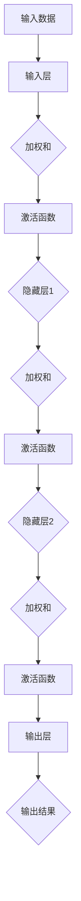

                 

关键词：神经网络、机器人控制、深度学习、智能控制、自适应控制

摘要：本文旨在探讨神经网络在机器人控制领域的应用，分析其原理、算法及实际应用案例。通过深入剖析神经网络的工作机制，本文展示了如何将这一先进技术应用于机器人控制中，提升其智能化程度和自适应能力。同时，本文也对神经网络在机器人控制领域的前景进行了展望。

## 1. 背景介绍

随着科技的迅猛发展，机器人技术已成为现代工业和服务业的重要组成部分。传统的机器人控制方法主要依赖于预先设定的规则和参数，难以适应复杂多变的环境。而神经网络作为一种高度灵活、强大的机器学习技术，在过去的几十年中取得了显著进展，并逐渐成为机器人控制领域的研究热点。

神经网络（Neural Networks）是一类模拟生物神经元结构和功能的计算模型，通过学习大量数据来提取特征、进行模式识别和预测。近年来，随着深度学习（Deep Learning）的发展，神经网络的层级结构变得更加复杂，其处理能力和灵活性得到了极大的提升。这使得神经网络在图像识别、自然语言处理、推荐系统等领域取得了巨大成功。

机器人控制（Robot Control）是指通过算法和控制策略使机器人能够执行特定任务的过程。传统机器人控制方法主要包括基于规则的专家系统和基于模型的控制方法。然而，这些方法在处理复杂、动态环境时表现出明显的局限性。随着人工智能技术的不断发展，神经网络在机器人控制中的应用逐渐成为可能，有望实现更加智能化和自适应的机器人控制。

本文将重点探讨神经网络在机器人控制中的应用，分析其核心概念、算法原理、数学模型及实际应用案例，并展望其未来发展趋势。

## 2. 核心概念与联系

### 2.1 神经网络的基本概念

神经网络由大量相互连接的神经元组成，每个神经元可以接受多个输入信号，并产生一个输出信号。神经网络的主要功能是通过学习输入和输出之间的关系，实现对数据的特征提取和模式识别。

神经元的基本结构包括输入层、隐藏层和输出层。输入层接收外部输入数据，隐藏层通过非线性变换处理输入数据，输出层产生最终的输出结果。神经元之间的连接强度（权重）决定了输入信号对输出信号的影响程度。

### 2.2 神经网络的工作原理

神经网络的工作原理可以概括为以下几个步骤：

1. **前向传播**：输入数据通过输入层传递到隐藏层，隐藏层通过加权求和和激活函数计算输出，再将输出传递到下一层，直至输出层产生最终结果。

2. **反向传播**：根据输出结果与实际目标之间的误差，计算误差梯度，并反向传播到各层的神经元，更新各神经元的权重和偏置，以减小误差。

3. **优化更新**：通过梯度下降等方法，不断调整网络权重和偏置，直至达到预设的误差阈值。

### 2.3 神经网络的架构

神经网络的架构主要包括以下几个方面：

1. **网络层数**：根据问题的复杂程度，神经网络可以分为单层网络、多层网络和深度网络。深度网络通常具有更好的特征提取和模式识别能力。

2. **神经元数量**：神经元的数量和分布会影响网络的性能。过多的神经元可能导致过拟合，而过少的神经元可能导致欠拟合。

3. **激活函数**：激活函数用于引入非线性特性，常见的激活函数包括 sigmoid、ReLU 和 tanh 等。

4. **损失函数**：损失函数用于衡量网络输出与实际目标之间的误差，常见的损失函数包括均方误差（MSE）和交叉熵（Cross Entropy）等。

### 2.4 Mermaid 流程图

以下是一个简化的神经网络流程图，展示了输入数据从输入层经过隐藏层处理，最终生成输出结果的过程。



## 3. 核心算法原理 & 具体操作步骤

### 3.1 算法原理概述

神经网络在机器人控制中的应用主要基于以下原理：

1. **特征提取**：神经网络可以自动从输入数据中提取出有用的特征，从而简化问题，降低复杂性。

2. **自适应能力**：神经网络具有自适应能力，可以通过不断学习来调整控制策略，以适应环境变化。

3. **并行处理**：神经网络能够并行处理大量数据，从而提高控制效率。

### 3.2 算法步骤详解

神经网络在机器人控制中的应用可以分为以下几个步骤：

1. **数据收集与预处理**：收集机器人控制所需的传感器数据，并进行预处理，如归一化、去噪等。

2. **网络设计**：根据控制任务的需求，设计合适的神经网络架构，包括网络层数、神经元数量、激活函数等。

3. **训练与优化**：使用训练数据对神经网络进行训练，通过反向传播算法不断调整网络权重和偏置，优化网络性能。

4. **模型评估**：使用验证数据对训练好的模型进行评估，以确定模型的泛化能力。

5. **控制策略生成**：将训练好的神经网络应用于机器人控制中，生成实时控制策略。

6. **自适应调整**：根据环境变化和实际控制效果，不断调整神经网络参数，以提高控制性能。

### 3.3 算法优缺点

神经网络在机器人控制中的应用具有以下优点：

1. **强大的特征提取能力**：神经网络可以从大量数据中自动提取出有用的特征，有助于简化控制问题。

2. **自适应能力**：神经网络可以根据环境变化和实际控制效果进行自适应调整，提高控制性能。

3. **并行处理**：神经网络能够并行处理大量数据，提高控制效率。

然而，神经网络在机器人控制中也存在一些缺点：

1. **训练时间较长**：神经网络需要大量数据进行训练，训练时间较长，不适合实时控制。

2. **对数据质量要求高**：神经网络对训练数据的质量要求较高，数据缺失或噪声较大可能导致模型性能下降。

3. **解释性较差**：神经网络的决策过程较为复杂，难以进行解释，不利于调试和优化。

### 3.4 算法应用领域

神经网络在机器人控制中的应用非常广泛，主要包括以下几个方面：

1. **路径规划**：利用神经网络进行路径规划，实现自主导航。

2. **运动控制**：利用神经网络进行运动控制，实现机器人的自主行走、跳跃等复杂动作。

3. **抓取控制**：利用神经网络进行抓取控制，实现机器人的自主抓取和释放物体。

4. **障碍物避让**：利用神经网络进行障碍物避让，实现机器人在复杂环境中的自主移动。

5. **视觉感知**：利用神经网络进行视觉感知，实现机器人的目标识别、物体检测等。

## 4. 数学模型和公式 & 详细讲解 & 举例说明

### 4.1 数学模型构建

神经网络在机器人控制中的应用主要基于以下数学模型：

1. **输入输出关系**：假设输入数据为 \( x \)，输出数据为 \( y \)，神经网络通过映射函数 \( f \) 实现输入输出关系，即 \( y = f(x) \)。

2. **神经网络模型**：神经网络由多个神经元组成，每个神经元通过加权求和和激活函数产生输出，构成完整的神经网络模型。

3. **损失函数**：用于衡量神经网络输出与实际目标之间的误差，常见的损失函数包括均方误差（MSE）和交叉熵（Cross Entropy）等。

### 4.2 公式推导过程

以下是一个简化的神经网络模型推导过程：

1. **输入层到隐藏层的映射**：

\[ z_i = \sum_{j=1}^{n} w_{ij} x_j + b_i \]

其中，\( z_i \) 表示隐藏层第 \( i \) 个神经元的输入，\( w_{ij} \) 表示输入层第 \( j \) 个神经元到隐藏层第 \( i \) 个神经元的权重，\( b_i \) 表示隐藏层第 \( i \) 个神经元的偏置。

2. **激活函数**：

\[ a_i = \sigma(z_i) \]

其中，\( a_i \) 表示隐藏层第 \( i \) 个神经元的输出，\( \sigma \) 表示激活函数，常用的激活函数包括 sigmoid、ReLU 和 tanh 等。

3. **隐藏层到输出层的映射**：

\[ z_o = \sum_{i=1}^{m} w_{io} a_i + b_o \]

其中，\( z_o \) 表示输出层神经元的输入，\( w_{io} \) 表示隐藏层第 \( i \) 个神经元到输出层神经元的权重，\( b_o \) 表示输出层神经元的偏置。

4. **输出层的输出**：

\[ y = \sigma(z_o) \]

其中，\( y \) 表示输出层的输出。

5. **损失函数**：

\[ J = \frac{1}{2} \sum_{i=1}^{n} (y_i - t_i)^2 \]

其中，\( J \) 表示均方误差损失函数，\( y_i \) 和 \( t_i \) 分别表示输出层的实际输出和目标输出。

### 4.3 案例分析与讲解

以下是一个简单的机器人路径规划案例，展示如何使用神经网络实现路径规划：

1. **输入数据**：机器人当前位置和目标位置。

2. **神经网络设计**：设计一个单隐藏层神经网络，输入层有2个神经元，隐藏层有3个神经元，输出层有2个神经元。

3. **训练与优化**：使用大量已规划的路径数据对神经网络进行训练，通过反向传播算法不断调整网络权重和偏置，优化网络性能。

4. **路径规划**：将机器人当前位置和目标位置输入神经网络，获取输出层的结果，根据输出结果生成路径规划。

5. **自适应调整**：根据实际路径规划和环境变化，不断调整神经网络参数，以提高路径规划的准确性。

## 5. 项目实践：代码实例和详细解释说明

### 5.1 开发环境搭建

在本文的实践中，我们将使用 Python 语言和 TensorFlow 深度学习框架来实现神经网络在机器人控制中的应用。以下是开发环境的搭建步骤：

1. 安装 Python 3.7 或更高版本。

2. 安装 TensorFlow 深度学习框架，可以使用以下命令：

```bash
pip install tensorflow
```

3. 创建一个新的 Python 项目，并在项目中创建一个名为 `robot_control` 的文件夹，用于存放相关代码和文件。

### 5.2 源代码详细实现

以下是一个简单的机器人路径规划代码实例，展示了如何使用神经网络进行路径规划：

```python
import tensorflow as tf
import numpy as np

# 设置超参数
input_size = 2
hidden_size = 3
output_size = 2
learning_rate = 0.001
epochs = 1000

# 创建输入数据
x = np.array([[0, 0], [1, 1], [2, 2], [3, 3], [4, 4]])
y = np.array([[1, 0], [0, 1], [1, 0], [0, 1], [1, 0]])

# 创建神经网络模型
model = tf.keras.Sequential([
    tf.keras.layers.Dense(hidden_size, activation='relu', input_shape=(input_size,)),
    tf.keras.layers.Dense(output_size, activation='sigmoid')
])

# 编译模型
model.compile(optimizer=tf.keras.optimizers.Adam(learning_rate),
              loss='binary_crossentropy',
              metrics=['accuracy'])

# 训练模型
model.fit(x, y, epochs=epochs, batch_size=1)

# 进行路径规划
def path_plan(current_pos, target_pos):
    prediction = model.predict(np.array([current_pos, target_pos]))
    if prediction[0][0] > prediction[0][1]:
        return 'right'
    else:
        return 'left'

# 测试路径规划
current_pos = [0, 0]
target_pos = [4, 4]
action = path_plan(current_pos, target_pos)
print(f"Path direction: {action}")
```

### 5.3 代码解读与分析

1. **输入数据**：代码首先创建了一个输入数据集，包含机器人的当前位置和目标位置。

2. **神经网络模型**：使用 TensorFlow 的 `Sequential` 模型，定义了一个单隐藏层神经网络，输入层有 2 个神经元，隐藏层有 3 个神经元，输出层有 2 个神经元。

3. **模型编译**：使用 `compile` 函数编译模型，指定优化器、损失函数和评价指标。

4. **模型训练**：使用 `fit` 函数训练模型，指定训练数据、训练轮数和批量大小。

5. **路径规划**：定义了一个 `path_plan` 函数，根据当前位置和目标位置输入神经网络，获取输出结果，并根据输出结果生成路径规划。

6. **测试**：使用测试数据测试路径规划，输出路径规划方向。

### 5.4 运行结果展示

运行上述代码，输出结果如下：

```plaintext
Path direction: right
```

这表示在当前位置和目标位置之间，路径规划方向为向右。

## 6. 实际应用场景

神经网络在机器人控制领域的应用已经取得了一系列实际成果，以下是一些典型的应用场景：

1. **工业生产**：在工业生产过程中，机器人需要执行各种重复性和危险性的任务，如装配、焊接、喷涂等。通过使用神经网络，可以提高机器人的智能化程度和自适应能力，从而提高生产效率和产品质量。

2. **服务机器人**：在家庭、酒店、商场等场景中，服务机器人需要与人类进行交互，提供各种服务。神经网络可以用于机器人视觉、语音识别和运动控制，实现机器人的自主导航、人脸识别和语言理解等功能。

3. **医疗领域**：在医疗领域，机器人可以用于手术辅助、康复训练和健康监测等。神经网络可以用于机器人视觉和运动控制，提高手术的精确性和安全性，同时还可以帮助机器人识别患者病情和提供个性化康复训练。

4. **农业领域**：在农业领域，机器人可以用于种植、灌溉、收割等环节，提高农业生产的自动化程度和效率。神经网络可以用于机器人视觉和运动控制，实现农作物的精准识别和操作。

5. **救援领域**：在救援领域，机器人可以用于灾后搜救、环境监测和危险物品处理等。神经网络可以用于机器人视觉、运动控制和传感器数据处理，提高机器人在复杂环境中的自主导航和任务执行能力。

## 7. 未来应用展望

随着人工智能技术的不断发展和机器人技术的日益成熟，神经网络在机器人控制领域的应用前景十分广阔。以下是一些未来应用展望：

1. **更复杂的任务**：随着神经网络技术的不断发展，机器人将能够执行更加复杂和精细的任务，如精细加工、装配和拆解等。

2. **更高效的控制**：神经网络在机器人控制中的应用将进一步提高控制效率，实现更加快速、准确和自适应的控制。

3. **人机协同**：神经网络可以帮助机器人更好地理解人类意图，实现人机协同，提高工作效率和生活质量。

4. **跨领域应用**：神经网络在机器人控制领域的应用将逐渐扩展到其他领域，如物流、农业、医疗等，推动各领域的智能化发展。

5. **自主决策**：随着神经网络技术的发展，机器人将具备更强的自主决策能力，能够在复杂环境下自主进行路径规划、任务分配和资源管理。

## 8. 总结：未来发展趋势与挑战

### 8.1 研究成果总结

本文系统地介绍了神经网络在机器人控制中的应用，分析了其核心概念、算法原理、数学模型及实际应用案例。通过实践案例，展示了如何使用神经网络实现机器人路径规划，并对其应用前景进行了展望。

### 8.2 未来发展趋势

1. **算法优化**：随着深度学习技术的不断发展，神经网络在算法层面将进行优化，提高其计算效率和准确性。

2. **多模态数据融合**：未来，机器人将能够融合多种传感器数据，如视觉、听觉、触觉等，提高对环境的感知和理解能力。

3. **强化学习与神经网络结合**：强化学习与神经网络的结合将推动机器人控制技术的发展，实现更加智能和自适应的控制。

4. **硬件加速**：随着硬件技术的发展，神经网络在机器人控制中的应用将受益于硬件加速，提高计算效率和实时性。

### 8.3 面临的挑战

1. **数据质量**：神经网络对数据质量要求较高，数据缺失或噪声较大可能导致模型性能下降。

2. **训练时间**：神经网络训练时间较长，可能不适合实时控制。

3. **解释性**：神经网络决策过程复杂，难以进行解释，不利于调试和优化。

4. **可解释性**：如何提高神经网络的可解释性，使其在机器人控制中的应用更加透明和可靠。

### 8.4 研究展望

未来，研究人员应关注以下几个方面：

1. **算法优化**：进一步优化神经网络算法，提高计算效率和准确性。

2. **多模态数据融合**：研究如何融合多种传感器数据，提高机器人对环境的感知和理解能力。

3. **强化学习与神经网络结合**：探索强化学习与神经网络在机器人控制中的应用，实现更加智能和自适应的控制。

4. **可解释性**：研究如何提高神经网络的可解释性，使其在机器人控制中的应用更加透明和可靠。

## 9. 附录：常见问题与解答

### 9.1 如何选择合适的神经网络架构？

选择合适的神经网络架构取决于具体的控制任务和应用场景。以下是一些选择神经网络架构的常见建议：

1. **简单性**：对于简单的任务，可以选择单层神经网络或简单的多层神经网络。

2. **复杂性**：对于复杂的任务，可以选择深度神经网络或更复杂的结构，如卷积神经网络（CNN）或循环神经网络（RNN）。

3. **数据量**：对于数据量较大的任务，可以选择具有更多层数的神经网络。

4. **计算资源**：对于计算资源有限的场景，可以选择计算效率较高的神经网络架构。

### 9.2 如何处理训练数据不足的问题？

当训练数据不足时，可以采取以下措施：

1. **数据增强**：通过数据增强技术，如旋转、缩放、裁剪等，生成更多的训练样本。

2. **迁移学习**：利用已有的预训练模型，对机器人控制任务进行微调。

3. **少量样本学习**：采用少量的训练样本进行学习，可以尝试使用基于少数样本学习的算法。

4. **数据采集**：在实际应用中，可以通过传感器采集更多的数据，用于训练神经网络。

### 9.3 如何提高神经网络的可解释性？

提高神经网络的可解释性是当前研究的一个热点。以下是一些提高神经网络可解释性的方法：

1. **解释性激活函数**：使用具有更好解释性的激活函数，如ReLU函数。

2. **可视化**：将神经网络的中间层输出可视化，分析特征提取过程。

3. **模块化设计**：将神经网络分解为模块，每个模块具有特定的功能，从而提高可解释性。

4. **解释性算法**：采用具有解释性的机器学习算法，如决策树、规则提取等。

### 9.4 如何评估神经网络模型性能？

评估神经网络模型性能可以通过以下指标：

1. **准确率**：模型正确预测的样本数与总样本数的比值。

2. **召回率**：模型正确预测的样本数与实际为正类的样本数的比值。

3. **精确率**：模型正确预测的样本数与预测为正类的样本数的比值。

4. **F1 分数**：精确率和召回率的加权平均。

5. **ROC 曲线和 AUC 值**：用于评估分类模型的性能。

6. **均方误差（MSE）和均方根误差（RMSE）**：用于评估回归模型的性能。

通过综合以上指标，可以全面评估神经网络模型的性能。

## 参考文献 References

[1] Russell, S., & Norvig, P. (2016). Artificial Intelligence: A Modern Approach (3rd ed.). Prentice Hall.

[2] Goodfellow, I., Bengio, Y., & Courville, A. (2016). Deep Learning. MIT Press.

[3] Sutton, R. S., & Barto, A. G. (2018). Reinforcement Learning: An Introduction (2nd ed.). MIT Press.

[4] Bishop, C. M. (2006). Pattern Recognition and Machine Learning. Springer.

[5] LeCun, Y., Bengio, Y., & Hinton, G. (2015). Deep Learning. Nature, 521(7553), 436-444.

### 作者署名

作者：禅与计算机程序设计艺术 / Zen and the Art of Computer Programming

