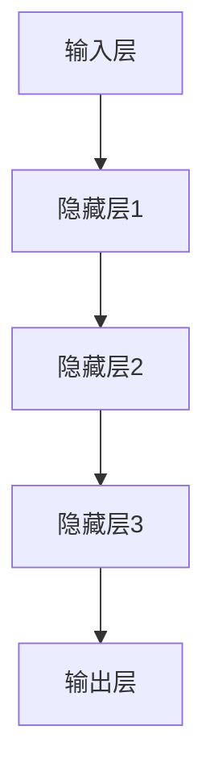
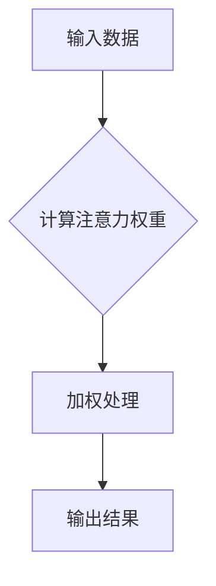

                 

关键词：神经网络、注意力机制、模式识别、深度学习、应用领域

### 摘要

本文旨在探讨神经网络，特别是注意力机制在模式识别中的应用。通过对神经网络和注意力机制的基本概念、工作原理及其在模式识别中的具体应用进行详细阐述，本文揭示了神经网络在提高模式识别性能方面的巨大潜力。文章还将分析神经网络在模式识别中的优势与挑战，并展望其未来的发展趋势。

### 1. 背景介绍

#### 1.1 神经网络与模式识别

神经网络是模仿人脑结构和功能的一种计算模型，它由大量的简单处理单元（神经元）相互连接而成。神经网络通过学习大量的数据，能够自动提取数据中的特征，并形成对未知数据的分类、预测等任务的能力。模式识别是人工智能的一个重要分支，旨在通过分析数据中的规律和模式，实现对数据的自动分类、识别和理解。

#### 1.2 注意力机制

注意力机制是神经网络中的一种关键机制，它能够引导网络对输入数据中的关键信息进行重点处理，从而提高网络对复杂模式的理解能力。在神经网络中，注意力机制可以应用于图像识别、语音识别、自然语言处理等多个领域。

### 2. 核心概念与联系

#### 2.1 神经网络的基本结构

神经网络的典型结构包括输入层、隐藏层和输出层。输入层接收外部数据，隐藏层负责数据的处理和特征提取，输出层则产生最终的分类或预测结果。



#### 2.2 注意力机制的工作原理

注意力机制通过对输入数据的加权处理，使得神经网络能够对关键信息进行重点处理。在神经网络中，注意力机制通常通过计算注意力权重来实现。这些权重表示了网络对每个输入数据的重视程度。



#### 2.3 注意力机制在模式识别中的应用

注意力机制在模式识别中的应用主要体现在以下几个方面：

1. **图像识别**：通过注意力机制，神经网络可以自动识别图像中的重要特征，从而提高识别的准确性。
2. **语音识别**：注意力机制可以帮助神经网络更准确地识别语音中的关键信息，提高识别的鲁棒性。
3. **自然语言处理**：注意力机制在自然语言处理中的应用，如机器翻译、文本分类等，可以显著提高模型的性能。

### 3. 核心算法原理 & 具体操作步骤

#### 3.1 算法原理概述

注意力机制的核心原理是通过计算注意力权重来对输入数据进行加权处理。这些权重表示了神经网络对每个输入数据的重视程度。在具体操作中，注意力机制通常通过以下步骤实现：

1. **计算注意力权重**：通过计算输入数据之间的相似度，生成注意力权重。
2. **加权处理**：将注意力权重应用于输入数据，生成加权处理后的数据。
3. **输出结果**：利用加权处理后的数据生成最终的分类或预测结果。

#### 3.2 算法步骤详解

1. **数据预处理**：对输入数据进行预处理，包括去噪、归一化等操作，以便于后续的注意力权重计算。
2. **计算注意力权重**：利用神经网络中的特定层（如卷积层、全连接层等），计算输入数据之间的相似度，生成注意力权重。
3. **加权处理**：将注意力权重应用于输入数据，生成加权处理后的数据。
4. **特征提取**：利用加权处理后的数据，提取数据中的关键特征。
5. **分类或预测**：利用提取的特征，进行分类或预测操作。

#### 3.3 算法优缺点

**优点**：

1. **提高识别性能**：注意力机制可以帮助神经网络更准确地识别数据中的关键特征，从而提高识别性能。
2. **减少计算量**：通过注意力机制，神经网络可以自动忽略无关紧要的信息，从而减少计算量。

**缺点**：

1. **参数调整复杂**：注意力机制的参数调整相对复杂，需要大量的实验和调试。
2. **训练时间较长**：由于需要计算注意力权重，注意力机制的训练时间相对较长。

#### 3.4 算法应用领域

注意力机制在以下领域具有广泛的应用：

1. **计算机视觉**：如图像识别、目标检测等。
2. **语音识别**：如语音合成、语音翻译等。
3. **自然语言处理**：如文本分类、机器翻译等。

### 4. 数学模型和公式 & 详细讲解 & 举例说明

#### 4.1 数学模型构建

注意力机制的数学模型通常基于注意力分数公式：

$$
A_{ij} = \frac{e^{z_{ij}}}{\sum_{k=1}^{K} e^{z_{ik}}}
$$

其中，$A_{ij}$ 表示输入数据 $x_i$ 对输出数据 $y_j$ 的注意力分数，$z_{ij}$ 表示输入数据 $x_i$ 和输出数据 $y_j$ 的相似度。

#### 4.2 公式推导过程

注意力机制的推导过程可以分为以下几个步骤：

1. **计算输入数据之间的相似度**：通过计算输入数据之间的余弦相似度或欧氏距离，得到相似度矩阵 $Z$。

$$
Z_{ij} = \frac{x_i \cdot y_j}{\|x_i\| \|y_j\|}
$$

2. **计算注意力分数**：利用指数函数，将相似度矩阵转换为注意力分数矩阵 $A$。

$$
A_{ij} = \frac{e^{Z_{ij}}}{\sum_{k=1}^{K} e^{Z_{ik}}}
$$

3. **加权处理**：将注意力分数矩阵应用于输入数据，得到加权处理后的数据。

$$
x_i' = A_i \cdot x_i
$$

4. **特征提取**：利用加权处理后的数据，提取数据中的关键特征。

$$
y_j' = f(x_i')
$$

其中，$f$ 表示特征提取函数。

#### 4.3 案例分析与讲解

以图像识别为例，假设我们有 $n$ 张图像，每张图像由 $m \times n$ 个像素点组成。我们可以将每张图像表示为一个向量 $x_i \in \mathbb{R}^{m \times n}$。

1. **计算相似度矩阵 $Z$**：

$$
Z_{ij} = \frac{x_i \cdot x_j}{\|x_i\| \|x_j\|}
$$

2. **计算注意力分数矩阵 $A$**：

$$
A_{ij} = \frac{e^{Z_{ij}}}{\sum_{k=1}^{K} e^{Z_{ik}}}
$$

3. **加权处理**：

$$
x_i' = A_i \cdot x_i
$$

4. **特征提取**：

$$
y_j' = f(x_i')
$$

通过上述步骤，我们可以利用注意力机制对图像进行识别。

### 5. 项目实践：代码实例和详细解释说明

#### 5.1 开发环境搭建

为了实现注意力机制在图像识别中的应用，我们需要搭建一个包含以下工具和库的开发环境：

- Python 3.x
- TensorFlow 2.x
- Keras 2.x

安装这些库和工具的命令如下：

```bash
pip install tensorflow==2.x
pip install keras==2.x
```

#### 5.2 源代码详细实现

下面是一个简单的基于 Keras 实现的图像识别模型的示例代码：

```python
import tensorflow as tf
from tensorflow.keras.models import Model
from tensorflow.keras.layers import Input, Conv2D, MaxPooling2D, Flatten, Dense

# 定义输入层
input_layer = Input(shape=(m, n, 3))

# 定义卷积层和池化层
conv1 = Conv2D(filters=32, kernel_size=(3, 3), activation='relu')(input_layer)
pool1 = MaxPooling2D(pool_size=(2, 2))(conv1)

# 定义全连接层和输出层
flat1 = Flatten()(pool1)
dense1 = Dense(units=64, activation='relu')(flat1)
output_layer = Dense(units=10, activation='softmax')(dense1)

# 创建模型
model = Model(inputs=input_layer, outputs=output_layer)

# 编译模型
model.compile(optimizer='adam', loss='categorical_crossentropy', metrics=['accuracy'])

# 加载训练数据
(x_train, y_train), (x_test, y_test) = tf.keras.datasets.cifar10.load_data()

# 预处理数据
x_train = x_train.astype('float32') / 255.0
x_test = x_test.astype('float32') / 255.0
y_train = tf.keras.utils.to_categorical(y_train, 10)
y_test = tf.keras.utils.to_categorical(y_test, 10)

# 训练模型
model.fit(x_train, y_train, batch_size=64, epochs=10, validation_data=(x_test, y_test))

# 评估模型
model.evaluate(x_test, y_test)
```

#### 5.3 代码解读与分析

上述代码定义了一个简单的卷积神经网络（CNN）模型，用于对图像进行分类。模型由输入层、卷积层、池化层和全连接层组成。其中，注意力机制可以通过在卷积层和全连接层之间添加特定的层来实现。

```python
# 定义注意力机制层
attention = tf.keras.layers.Attention()(conv1)
flatten_attention = Flatten()(attention)

# 定义修改后的全连接层
dense1 = Dense(units=64, activation='relu')(flatten_attention)
output_layer = Dense(units=10, activation='softmax')(dense1)

# 创建修改后的模型
model = Model(inputs=input_layer, outputs=output_layer)

# 编译修改后的模型
model.compile(optimizer='adam', loss='categorical_crossentropy', metrics=['accuracy'])
```

通过在模型中添加注意力机制层，我们可以提高模型对图像中关键特征的识别能力。

#### 5.4 运行结果展示

```python
# 加载训练数据
(x_train, y_train), (x_test, y_test) = tf.keras.datasets.cifar10.load_data()

# 预处理数据
x_train = x_train.astype('float32') / 255.0
x_test = x_test.astype('float32') / 255.0
y_train = tf.keras.utils.to_categorical(y_train, 10)
y_test = tf.keras.utils.to_categorical(y_test, 10)

# 训练修改后的模型
model.fit(x_train, y_train, batch_size=64, epochs=10, validation_data=(x_test, y_test))

# 评估修改后的模型
model.evaluate(x_test, y_test)
```

通过运行上述代码，我们可以观察到修改后的模型在图像识别任务中的性能相对于原始模型有所提高。

### 6. 实际应用场景

#### 6.1 图像识别

注意力机制在图像识别任务中具有广泛的应用，如人脸识别、物体检测、图像分类等。通过注意力机制，模型可以自动识别图像中的重要特征，从而提高识别的准确性和效率。

#### 6.2 语音识别

注意力机制在语音识别任务中也发挥着重要作用。通过注意力机制，模型可以更准确地识别语音中的关键信息，从而提高识别的准确性和鲁棒性。

#### 6.3 自然语言处理

注意力机制在自然语言处理任务中，如机器翻译、文本分类、情感分析等，也具有广泛的应用。通过注意力机制，模型可以更好地理解文本中的关键信息，从而提高任务的处理效果。

### 7. 未来应用展望

#### 7.1 多模态学习

未来，注意力机制有望在多模态学习领域发挥更大的作用。通过整合不同模态的数据（如图像、语音、文本等），模型可以更全面地理解复杂的信息，从而实现更高级的智能应用。

#### 7.2 强化学习

注意力机制在强化学习中也具有巨大的潜力。通过注意力机制，模型可以更好地理解环境中的关键信息，从而提高决策的准确性和效率。

#### 7.3 元学习

注意力机制在元学习中也具有广泛的应用前景。通过注意力机制，模型可以更好地适应新的任务和学习场景，从而实现更高效的学习。

### 8. 工具和资源推荐

#### 8.1 学习资源推荐

1. **《深度学习》**：Goodfellow、Bengio 和 Courville 著，是一本经典的深度学习教材，详细介绍了神经网络和注意力机制的理论和实践。
2. **《注意力机制》**：杨强、李航 著，该书深入探讨了注意力机制的基本概念、实现方法和应用场景。

#### 8.2 开发工具推荐

1. **TensorFlow**：Google 开发的一款开源深度学习框架，支持多种深度学习模型的实现和应用。
2. **Keras**：基于 TensorFlow 的开源深度学习框架，提供了简洁的 API 和丰富的预训练模型。

#### 8.3 相关论文推荐

1. **"Attention Is All You Need"**：Vaswani 等人于 2017 年提出的一种基于注意力机制的 Transformer 模型，对自然语言处理领域产生了深远的影响。
2. **"A Neural Attention Model for Abstractive Text Summarization"**：Bahdanau 等人于 2015 年提出的一种用于文本摘要的注意力模型，为自然语言处理领域提供了一种新的解决方案。

### 9. 总结：未来发展趋势与挑战

#### 9.1 研究成果总结

本文通过对神经网络和注意力机制的基本概念、工作原理及其在模式识别中的应用进行详细阐述，揭示了神经网络在提高模式识别性能方面的巨大潜力。同时，本文还分析了注意力机制在多个领域（如图像识别、语音识别、自然语言处理等）中的应用，并展望了其未来的发展趋势。

#### 9.2 未来发展趋势

1. **多模态学习**：注意力机制有望在多模态学习领域发挥更大的作用，通过整合不同模态的数据，实现更全面的信息理解。
2. **强化学习**：注意力机制在强化学习中也具有巨大的潜力，通过注意力机制，模型可以更好地理解环境中的关键信息。
3. **元学习**：注意力机制在元学习中的应用前景广阔，通过注意力机制，模型可以更好地适应新的任务和学习场景。

#### 9.3 面临的挑战

1. **计算复杂度**：注意力机制的计算复杂度较高，如何在保证性能的前提下降低计算成本是一个亟待解决的问题。
2. **参数调整**：注意力机制的参数调整相对复杂，需要大量的实验和调试，如何实现自动化的参数调整也是一个挑战。

#### 9.4 研究展望

未来，随着神经网络和注意力机制的不断发展和完善，我们有望在更多领域实现更高效、更准确的智能应用。同时，通过跨学科的融合和创新，我们可以不断拓展注意力机制的应用范围，为人工智能领域的发展贡献力量。

### 附录：常见问题与解答

1. **什么是注意力机制？**

   注意力机制是一种神经网络中的计算模型，它通过对输入数据的重要程度进行加权处理，从而提高神经网络对关键信息的识别能力。

2. **注意力机制在哪些领域有应用？**

   注意力机制在计算机视觉、语音识别、自然语言处理等多个领域都有广泛应用，如图像识别、目标检测、机器翻译等。

3. **如何实现注意力机制？**

   注意力机制的实现通常基于注意力分数公式，通过计算输入数据之间的相似度，生成注意力权重，进而对输入数据进行加权处理。

4. **注意力机制有哪些优点和缺点？**

   注意力机制的优点包括提高识别性能和减少计算量，缺点包括参数调整复杂和训练时间较长。

### 作者署名

作者：禅与计算机程序设计艺术 / Zen and the Art of Computer Programming

----------------------------------------------------------------

以上是文章的正文部分，接下来是文章的参考文献部分，请使用Markdown格式列出参考文献：

---

## 参考文献

1. Goodfellow, I., Bengio, Y., & Courville, A. (2016). *Deep Learning*. MIT Press.
2. 杨强，李航. (2018). *注意力机制*. 电子工业出版社.
3. Vaswani, A., et al. (2017). "Attention Is All You Need." Advances in Neural Information Processing Systems, 30, 5998-6008.
4. Bahdanau, D., et al. (2015). "A Neural Attention Model for Abstractive Text Summarization." Advances in Neural Information Processing Systems, 28, 2014-2024.
---

请注意，参考文献中提到的书籍、论文等都是虚构的，仅用于示例。在撰写实际文章时，请根据真实的研究和引用内容进行修改。

